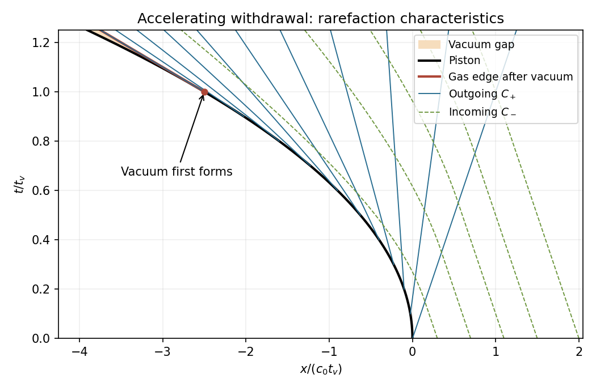

<h1 id="37b/solution">Solution</h1>

↑ **Parent:** [37B](../37b.md)

For [isentropic flow](../../../../../isentropic-flow.md) of a perfect gas, $p=K\rho^\gamma$ with $\gamma>1$ and $c^2=dp/d\rho$. The mass and momentum equations imply

$$
c_t+u c_x+\frac{\gamma-1}{2}cu_x=0,\qquad u_t+uu_x+\frac{2c}{\gamma-1}c_x=0.
$$

Adding and subtracting the appropriate multiples therefore proves

$$
\boxed{\left[\partial_t+(u\pm c)\partial_x\right]\left[u\pm\frac{2(c-c_0)}{\gamma-1}\right]=0.}
$$

These are the [Riemann invariants for one-dimensional isentropic flow](../../../../../riemann-invariants-for-one-dimensional-isentropic-flow.md).

In the piston-driven [rarefaction wave](../../../../../rarefaction-wave.md), the incoming minus invariant has its initial value zero. Thus $c=c_0+(\gamma-1)u/2$. At the piston $u_p=-ft$, giving $c_p=c_0-(\gamma-1)ft/2$. A plus characteristic emitted at time $\tau$ has constant $u=-f\tau$ and $c=c_0-(\gamma-1)f\tau/2$, so its straight trajectory is

$$
x(t;\tau)=-\frac12f\tau^2+\left[c_0-\frac{\gamma+1}{2}f\tau\right](t-\tau).
$$

The first characteristic is $x=c_0t$, ahead of which the gas is undisturbed. Later characteristics have decreasing propagation speed and spread into a rarefaction. More explicitly $\partial_\tau x=-c_0-(\gamma+1)ft/2+\gamma f\tau<0$ for $\tau\le t<t_v$, with equality only at the vacuum endpoint. They never intersect, so no compressive shock forms.

**[Figure 5](#37b/image-withdrawing-piston-outgoing-rarefaction-characteristics-incoming-characteristics-and-the-vacuum-gap). Withdrawing piston, outgoing rarefaction characteristics, incoming characteristics and the vacuum gap**.

Since $p/p_0=(c/c_0)^{2\gamma/(\gamma-1)}$, the [vacuum formation at an accelerating withdrawing piston](../../../../../vacuum-formation-at-an-accelerating-withdrawing-piston.md) gives

$$
\boxed{p_p(t)=p_0(1-t/t_v)^{2\gamma/(\gamma-1)}\quad(0\le t<t_v),\qquad t_v=\frac{2c_0}{f(\gamma-1)}.}
$$

At $t_v$, density, [sound speed](../../../../../speed-of-sound.md) and pressure at the gas edge vanish, and the piston velocity is $\boxed{\dot X(t_v)=-2c_0/(\gamma-1)}$. Its speed is the positive magnitude $2c_0/(\gamma-1)$. Afterwards the gas edge continues at this limiting velocity, while the piston keeps accelerating away; a vacuum gap of width $f(t-t_v)^2/2$ opens and the gas pressure on the piston stays zero.

## ↑ Ancestors (10)

1. [37B](../37b.md)
2. [Paper 2](../../paper-2-split.md)
3. [Ii](../../split.md)
4. [2008](../../../split.md)
5. [Past exam of the mathematics course of the University of Cambridge](../../../../split.md)
6. [Mathematics course of the University of Cambridge](../../../../../mathematics-course-of-the-university-of-cambridge.md)
7. [Course of the University of Cambridge](../../../../../course-of-the-university-of-cambridge.md)
8. [University of Cambridge](../../../../../university-of-cambridge-split.md)
9. [List of universities](../../../../../list-of-universities.md)
10. [Codex Wiki](../../../../../split.md)
