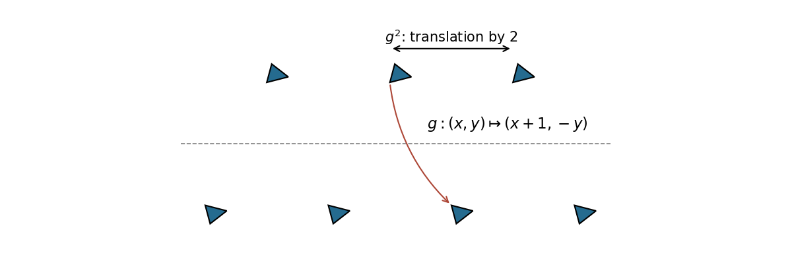

<h1 id="3g/solution">Solution</h1>

↑ **Parent:** [3G](../3g.md)

Every discrete additive subgroup of $\mathbb R^2$ has the form $\mathbb Zv_1+\cdots+\mathbb Zv_r$ for linearly independent vectors, with $r=0,1,$ or $2$. A full [translation lattice](../../../../../translation-lattice.md) has $r=2$, and conversely every such integer span is a discrete cocompact subgroup. This classifies planar lattices up to a choice of basis.

A [frieze group](../../../../../frieze-group.md) is a discrete group of planar [Euclidean isometries](../../../../../euclidean-isometry.md) whose [translation subgroup](../../../../../translation-subgroup.md) is infinite cyclic and has finite index. Consider the [glide reflection](../../../../../glide-reflection.md) $g(x,y)=(x+1,-y)$. Its square is translation by $(2,0)$, whereas every odd power reverses orientation. Therefore $\langle g\rangle\cong\mathbb Z$, but none of its translation elements generates the whole group: they form the index-two subgroup $\langle g^2\rangle$.

To realize exactly this [frieze group](../../../../../frieze-group.md), repeat a small scalene triangular motif at the points $(n,(-1)^n)$, reflecting the motif when $n$ is odd. Choose the motif with three distinct side lengths and no internal symmetry. The displayed pattern has [glide reflection](../../../../../glide-reflection.md) symmetry $g$ and translation period $2$, but no pure horizontal reflection or vertical mirror. Distinct side lengths force any symmetry to preserve corresponding vertices, which rules out extra motif permutations; the sequence of heights then leaves exactly the powers of $g$.

**[Figure 1](#3g/image-alternating-reflected-scalene-motifs-with-a-glide-reflection-generator-and-translation-period-two). Alternating reflected scalene motifs with a glide-reflection generator and translation period two**.

## ↑ Ancestors (10)

1. [3G](../3g.md)
2. [Paper 2](../../paper-2-split.md)
3. [Ii](../../split.md)
4. [2008](../../../split.md)
5. [Past exam of the mathematics course of the University of Cambridge](../../../../split.md)
6. [Mathematics course of the University of Cambridge](../../../../../mathematics-course-of-the-university-of-cambridge.md)
7. [Course of the University of Cambridge](../../../../../course-of-the-university-of-cambridge.md)
8. [University of Cambridge](../../../../../university-of-cambridge-split.md)
9. [List of universities](../../../../../list-of-universities.md)
10. [Codex Wiki](../../../../../split.md)
