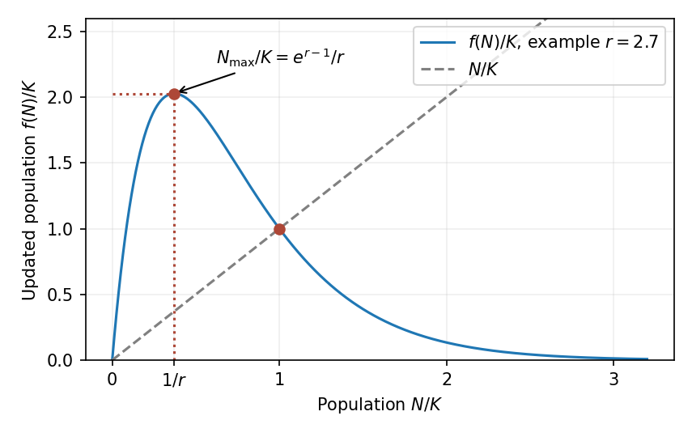

<h1 id="6b/solution">Solution</h1>

↑ **Parent:** [6B](../6b.md)

The [Ricker population map](../../../../../ricker-population-map.md) has equilibria $N=0$ and $N=K$. Since $f'(N)=e^{r(1-N/K)}(1-rN/K)$, their linearization multipliers are

$$
\boxed{f'(0)=e^r>1,\qquad f'(K)=1-r.}
$$

Thus extinction is unstable and the positive equilibrium is locally asymptotically stable for $0<r<2$, becoming unstable for $r>2$.

To verify an actual [period-doubling bifurcation](../../../../../period-doubling-bifurcation.md), rather than only a multiplier crossing, put $N/K=1+x$ and $r=2+\varepsilon$. The centered map is

$$
x\mapsto-(1+\varepsilon)x+O(\varepsilon x^2)+\frac23x^3+O(\varepsilon x^3+x^4).
$$

Its second iterate minus $x$ is $2\varepsilon x-\tfrac43x^3$ to leading order. After rescaling $x=\sqrt{\varepsilon}y$, the limiting nonzero roots are simple, so the [implicit function theorem](../../../../../implicit-function-theorem.md) continues them. Besides $x=0$, two nearby points therefore appear for $\varepsilon>0$, with $x_\pm=\pm\sqrt{3\varepsilon/2}+O(\varepsilon)$. The map exchanges these points, and the derivative of its second iterate there is $1-4\varepsilon+O(\varepsilon^{3/2})$, so the emerging two-cycle is attracting. **The bifurcation at $r=2$ is supercritical period doubling.**

For nonnegative populations, $f$ increases up to $N=K/r$ and decreases thereafter to zero. Hence every update after the initial time satisfies

$$
\boxed{0\le N_t\le f(K/r)=\frac Kr e^{r-1},\qquad t\ge1.}
$$

The bound is attained by choosing $N_0=K/r$; it is not a bound on an arbitrary initial population.

**[Figure 2](#6b/image-unimodal-ricker-update-with-its-maximum-at-k-divided-by-r-and-the-positive-fixed-point-at-k). Unimodal Ricker update with its maximum at K divided by r and the positive fixed point at K**.

## ↑ Ancestors (10)

1. [6B](../6b.md)
2. [Paper 2](../../paper-2-split.md)
3. [Ii](../../split.md)
4. [2008](../../../split.md)
5. [Past exam of the mathematics course of the University of Cambridge](../../../../split.md)
6. [Mathematics course of the University of Cambridge](../../../../../mathematics-course-of-the-university-of-cambridge.md)
7. [Course of the University of Cambridge](../../../../../course-of-the-university-of-cambridge.md)
8. [University of Cambridge](../../../../../university-of-cambridge-split.md)
9. [List of universities](../../../../../list-of-universities.md)
10. [Codex Wiki](../../../../../split.md)
