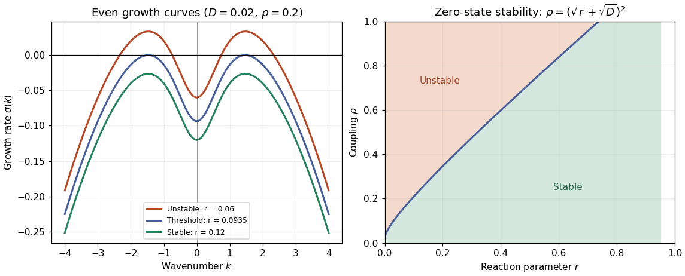

# Paper 3

↑ **Parent:** [Ii](../ii.md)

[https://www.maths.cam.ac.uk/undergrad/pastpapers/files/2008/PaperII_3.pdf](https://www.maths.cam.ac.uk/undergrad/pastpapers/files/2008/PaperII_3.pdf)

**Table of contents**

- [1H](#1h)
  - [Solution](#1h/solution)
- [2F](#2f)
  - [a](#2f/a)
    - [Solution](#2f/a/solution)
  - [b](#2f/b)
    - [Solution](#2f/b/solution)
- [3G](#3g)
  - [Solution](#3g/solution)
- [4G](#4g)
  - [Solution](#4g/solution)
- [5J](#5j)
  - [Solution](#5j/solution)
- [6B](#6b)
  - [Solution](#6b/solution)
- [7A](#7a)
  - [Solution](#7a/solution)
  - [i](#7a/i)
    - [Solution](#7a/i/solution)
  - [ii](#7a/ii)
    - [Solution](#7a/ii/solution)
  - [iii](#7a/iii)
    - [Solution](#7a/iii/solution)
- [8C](#8c)
  - [Solution](#8c/solution)
- [9E](#9e)
  - [Solution](#9e/solution)
- [10E](#10e)
  - [Solution](#10e/solution)
- [11H](#11h)
  - [Solution](#11h/solution)
- [12F](#12f)
  - [a](#12f/a)
    - [Solution](#12f/a/solution)
  - [b](#12f/b)
    - [Solution](#12f/b/solution)
- [13B](#13b)
  - [Solution](#13b/solution)
- [14A](#14a)
  - [Solution](#14a/solution)
  - [a](#14a/a)
    - [Solution](#14a/a/solution)
  - [b](#14a/b)
    - [Solution](#14a/b/solution)
  - [c](#14a/c)
    - [Solution](#14a/c/solution)
- [15E](#15e)
  - [i](#15e/i)
    - [Solution](#15e/i/solution)
  - [ii](#15e/ii)
    - [Solution](#15e/ii/solution)
- [16G](#16g)
  - [Solution](#16g/solution)
- [17F](#17f)
  - [Solution](#17f/solution)
- [18H](#18h)
  - [a](#18h/a)
    - [Solution](#18h/a/solution)
  - [b](#18h/b)
    - [Solution](#18h/b/solution)
- [19G](#19g)
  - [Solution](#19g/solution)
- [20F](#20f)
  - [Solution](#20f/solution)
- [21F](#21f)
  - [Solution](#21f/solution)
- [22H](#22h)
  - [Solution](#22h/solution)
- [23H](#23h)
  - [a](#23h/a)
    - [Solution](#23h/a/solution)
  - [b](#23h/b)
    - [Solution](#23h/b/solution)
  - [c](#23h/c)
    - [Solution](#23h/c/solution)
- [24J](#24j)
  - [i](#24j/i)
    - [Solution](#24j/i/solution)
  - [ii](#24j/ii)
    - [Solution](#24j/ii/solution)
- [25I](#25i)
  - [Solution](#25i/solution)
  - [a](#25i/a)
    - [Solution](#25i/a/solution)
  - [b](#25i/b)
    - [Solution](#25i/b/solution)
- [26I](#26i)
  - [Solution](#26i/solution)
- [27J](#27j)
  - [Solution](#27j/solution)
- [28I](#28i)
  - [Solution](#28i/solution)
- [29C](#29c)
  - [i](#29c/i)
    - [Solution](#29c/i/solution)
  - [ii](#29c/ii)
    - [Solution](#29c/ii/solution)
  - [iii](#29c/iii)
    - [Solution](#29c/iii/solution)
  - [iv](#29c/iv)
    - [Solution](#29c/iv/solution)
- [30A](#30a)
  - [Solution](#30a/solution)
  - [a](#30a/a)
    - [Solution](#30a/a/solution)
  - [b](#30a/b)
    - [Solution](#30a/b/solution)
  - [c](#30a/c)
    - [Solution](#30a/c/solution)
- [31C](#31c)
  - [Solution](#31c/solution)
- [32D](#32d)
  - [Solution](#32d/solution)
- [33E](#33e)
  - [Solution](#33e/solution)
- [34E](#34e)
  - [Solution](#34e/solution)
- [35D](#35d)
  - [Solution](#35d/solution)
- [36A](#36a)
  - [Solution](#36a/solution)
- [37B](#37b)
  - [Solution](#37b/solution)
- [38C](#38c)
  - [a](#38c/a)
    - [Solution](#38c/a/solution)
  - [b](#38c/b)
    - [Solution](#38c/b/solution)

## 1H

↑ **Parent:** [Paper 3](paper-3.md)

<h3 id="1h/solution">Solution</h3>

↑ **Parent:** [1H](#1h)

Put $N=\lfloor x\rfloor$. Comparing the [harmonic number](../../../analytic-number-theory.md#harmonic-number) with an [integral](../../../calculus.md#integral) gives $H_N=\sum_{n=1}^N1/n>\int_1^{N+1}dt/t=\log(N+1)>\log x$. By the [Fundamental theorem of arithmetic](../../../number-theory.md#fundamental-theorem-of-arithmetic), the finite [Euler product](../../../analytic-number-theory.md#euler-product) $\prod_{p\leq x}(1-p^{-1})^{-1}$ expands as the sum of $1/n$ over positive integers whose [prime factors](../../../number-theory.md#prime-factor) are at most $x$. It therefore includes every term of $H_N$, and

$$
\log H_N\leq-\sum_{p\leq x}\log(1-p^{-1})
<\sum_{p\leq x}\frac1p+\frac12\sum_{p\leq x}\frac1{p(p-1)}
<\sum_{p\leq x}\frac1p+\frac12.
$$

The first strict inequality is the [geometric-series bound for the logarithmic remainder](../../../calculus.md#geometric-series-bound-for-the-logarithmic-remainder); the last uses the [telescoping series](../../../real-analysis.md#telescoping-series) $\sum_{n=2}^\infty1/[n(n-1)]=1$. Thus the [prime reciprocal lower bound](../../../analytic-number-theory.md#prime-reciprocal-lower-bound) is

$$
\boxed{\sum_{p\leq x}\frac1p>\log H_N-\frac12>\log\log x-\frac12.}
$$

## 2F

↑ **Parent:** [Paper 3](paper-3.md)

<h3 id="2f/a">a</h3>

↑ **Parent:** [2F](#2f)

<h4 id="2f/a/solution">Solution</h4>

↑ **Parent:** [A](#2f/a)

The closed-set version of the [Baire category theorem](../../../topological-analysis.md#baire-category-theorem) says that if a nonempty [complete metric space](../../../topological-analysis.md#complete-metric-space) is a [countable union](../../../set.md#countable-union) of [closed sets](../../../topology.md#closed-set), at least one of those [closed sets](../../../topology.md#closed-set) has nonempty [interior](../../../topology.md#interior-topology). Equivalently, a nonempty [complete metric space](../../../topological-analysis.md#complete-metric-space) cannot be a [countable union](../../../set.md#countable-union) of closed [nowhere dense sets](../../../topological-analysis.md#nowhere-dense-set).

<h3 id="2f/b">b</h3>

↑ **Parent:** [2F](#2f)

<h4 id="2f/b/solution">Solution</h4>

↑ **Parent:** [B](#2f/b)

Fix $\epsilon>0$. For each $N$, the set $Q_N=\bigcap_{n,m\geq N}\{x:|f_n(x)-f_m(x)|\leq\epsilon\}$ is [closed](../../../topology.md#closed-set), because each $f_n-f_m$ is [continuous](../../../calculus.md#continuous-function). At every $x$, [pointwise convergence](../../../real-analysis.md#pointwise-convergence) makes $(f_n(x))$ a [Cauchy sequence](../../../real-analysis.md#cauchy-sequence), so $\mathbb R=\bigcup_{N\geq1}Q_N$. The [Baire category theorem](../../../topological-analysis.md#baire-category-theorem) supplies an $N_0$ for which $Q_{N_0}$ contains a nonempty [open interval](../../../topology.md#open-interval) $I$. For $x\in I$ and $n\geq N_0$, pass $m\to\infty$ in $|f_n(x)-f_m(x)|\leq\epsilon$ to obtain

$$
\boxed{|f_n(x)-f(x)|\leq\epsilon\quad(x\in I,\ n\geq N_0).}
$$

This [local uniform Cauchy control for pointwise convergent continuous functions](../../../topological-analysis.md#local-uniform-cauchy-control-for-pointwise-convergent-continuous-functions) allows both $I$ and $N_0$ to depend on $\epsilon$.

## 3G

↑ **Parent:** [Paper 3](paper-3.md)

<h3 id="3g/solution">Solution</h3>

↑ **Parent:** [3G](#3g)

Suppose a [connected](../../../geometry-and-topology.md#connected-space) subset $C\subseteq F$ contains distinct points $a,b$. The distance function $d_a(x)=|x-a|$ is a [Lipschitz map](../../../real-analysis.md#lipschitz-continuity) with constant one, by the [reverse triangle inequality](../../../topological-analysis.md#reverse-triangle-inequality). Its image $d_a(C)$ is [connected](../../../geometry-and-topology.md#connected-space) and contains both $0$ and $|b-a|$, so it contains the whole interval $[0,|b-a|]$. Monotonicity and the [Lipschitz](../../../real-analysis.md#lipschitz-continuity) inequality for [Hausdorff dimension](../../../measure-theory.md#hausdorff-dimension) imply

$$
1=\dim_H[0,|b-a|]\leq\dim_H d_a(C)\leq\dim_H C\leq\dim_H F<1,
$$

a contradiction. Thus every nonempty [connected](../../../geometry-and-topology.md#connected-space) subset of $F$ is a single point: **$F$ is [totally disconnected](../../../arithmetic.md#totally-disconnected-space)**. The argument is the [Hausdorff dimension of a connected set](../../../measure-theory.md#hausdorff-dimension-of-a-connected-set) bound, and does not require $F$ to be [closed](../../../topology.md#closed-set).

## 4G

↑ **Parent:** [Paper 3](paper-3.md)

<h3 id="4g/solution">Solution</h3>

↑ **Parent:** [4G](#4g)

One choice of the [Hamming code of length seven](../../../coding-theory.md#hamming-code-of-length-seven) is the [linear map](../../../vector-space.md#linear-map)

$$
h(a,b,c,d)=(a+b+d,\ a+c+d,\ a,\ b+c+d,\ b,\ c,\ d)
$$

over $\mathbb F_2$. Its image is the [kernel](../../../linear-algebra.md#kernel-of-a-linear-map) of the [parity-check matrix](../../../coding-theory.md#parity-check-matrix)

$$
H=\begin{pmatrix}1&0&1&0&1&0&1\\0&1&1&0&0&1&1\\0&0&0&1&1&1&1\end{pmatrix}.
$$

Indeed $Hh(a,b,c,d)^T=0$, the encoder is [injective](../../../algebra.md#injective-function) because positions $3,5,6,7$ recover its inputs, and $H$ has [rank](../../../linear-algebra.md#rank-one-quadratic-form) three. Its columns are nonzero and pairwise distinct. Hence no nonzero [codeword](../../../coding-theory.md#codeword) has [Hamming weight](../../../coding-theory.md#hamming-weight) one or two. The word $h(1,0,0,0)=(1,1,1,0,0,0,0)$ has weight three, proving that the [minimum Hamming distance](../../../coding-theory.md#minimum-distance-of-a-code) is **three**.

If $r=h(a,b,c,d)+e_j$ is received with one erroneous bit, its [syndrome](../../../coding-theory.md#syndrome) $Hr^T$ is column $j$ of $H$. These seven columns are distinct, so the [syndrome](../../../coding-theory.md#syndrome) identifies the bit to flip. A zero [syndrome](../../../coding-theory.md#syndrome) indicates no error under the assumption of at most one error.

For the [extended Hamming code](../../../coding-theory.md#extended-hamming-code), append $\sum_{j=1}^7h_j=a+b+c$. Every extended [codeword](../../../coding-theory.md#codeword) has [even](../../../calculus.md#even-function) weight. Since every original nonzero word has weight at least three, its extended weight is at least four; the weight-three example attains four. Thus

$$
\boxed{d_{\min}=4.}
$$

The [minimum-distance error-detection and correction guarantee](../../../coding-theory.md#minimum-distance-error-detection-and-correction-guarantee) gives **detection of up to three errors and correction of one error**. Detection here means rejecting a word outside the code, rather than simultaneously identifying and correcting every detected pattern; the usual combined decoder corrects single errors and flags double errors.

## 5J

↑ **Parent:** [Paper 3](paper-3.md)

<h3 id="5j/solution">Solution</h3>

↑ **Parent:** [5J](#5j)

The [ordinary least squares](../../../statistical-modelling.md#ordinary-least-squares) estimate, which is also the [maximum-likelihood estimate](../../../statistical-modelling.md#maximum-likelihood-estimator) in this [normal linear model](../../../statistical-modelling.md#normal-linear-model), gives the [hat matrix](../../../statistical-modelling.md#hat-matrix)

$$
\boxed{P=X(X^TX)^{-1}X^T.}
$$

It is the [orthogonal projection](../../../hilbert-space.md#orthogonal-projection) onto the column space of $X$, so $P^T=P$, $P^2=P$ and $\operatorname{rank}P=p$. Since $(I-P)X=0$, the vector of [regression residuals](../../../probability-and-statistics.md#regression-residual) is $\widehat\epsilon=(I-P)\epsilon$, with [multivariate normal distribution](../../../probability-and-statistics.md#multivariate-normal-distribution)

$$
\boxed{\widehat\epsilon\sim N_n\bigl(0,\sigma^2(I-P)\bigr).}
$$

For $i\ne j$, its [covariance](../../../variance.md#covariance) is $-\sigma^2p_{ij}$, which is generally nonzero. Therefore the [regression residuals](../../../probability-and-statistics.md#regression-residual) are generally dependent, even though the original errors are [independent random variables](../../../random-variable.md#independent-random-variables).

Fit the model in R, compute its [internally studentized residuals](../../../probability-and-statistics.md#standardized-regression-residual) with `rstandard(fit)`, and examine a [normal Q-Q plot](../../../probability-and-statistics.md#normal-q-q-plot) with `qqnorm(rstandard(fit))` and `qqline(rstandard(fit))`. A plot of these [regression residuals](../../../probability-and-statistics.md#regression-residual) against the [fitted values](../../../linear-regression.md#fitted-values) helps detect a curved mean pattern or nonconstant [variance](../../../variance.md). Approximate agreement with a straight line in the [Q-Q plot](../../../probability-and-statistics.md#q-q-plot), with no systematic residual pattern, supports the assumed error model.

Here $p\ll n$. The average [leverage](../../../statistical-modelling.md#regression-leverage) is $\operatorname{tr}P/n=p/n$, and $\sum_{ij}p_{ij}^2=\operatorname{tr}(P^2)=p$. Thus most diagonal corrections and most off-diagonal dependences are small when only a few directions have been removed from a large sample. Also $\widetilde\sigma^2$ estimates $\sigma^2$ accurately when $n-p$ is large. These facts make the visual independent-normal approximation reasonable, though exceptional high-[leverage](../../../statistical-modelling.md#regression-leverage) observations still deserve attention.

The approximation is not an exact distributional statement: the [distribution of an internally studentized Gaussian residual](../../../probability-and-statistics.md#distribution-of-an-internally-studentized-gaussian-residual) has $\widehat\eta_i^2/(n-p)\sim\operatorname{Beta}(1/2,(n-p-1)/2)$ when $n-p\geq2$ and $p_{ii}<1$. In particular these residuals are bounded, rather than exactly distributed according to [Student's t-distribution](../../../continuous-probability-distribution.md#student-s-t-distribution). Formal goodness-of-fit calibration should account for fitting and dependence.

## 6B

↑ **Parent:** [Paper 3](paper-3.md)

<h3 id="6b/solution">Solution</h3>

↑ **Parent:** [6B](#6b)

Applying the [law of mass action](../../../mathematical-biology.md#law-of-mass-action) to the [sequential two-site enzyme reaction network](../../../mathematical-biology.md#sequential-two-site-enzyme-reaction-network) gives

$$
\begin{aligned}
\dot s&=-k_1se+k_{-1}c_1-k_3sc_1+k_{-3}c_2,\\
\dot e&=-k_1se+(k_{-1}+k_2)c_1,\\
\dot c_1&=k_1se-(k_{-1}+k_2)c_1-k_3sc_1+(k_{-3}+k_4)c_2,\\
\dot c_2&=k_3sc_1-(k_{-3}+k_4)c_2,\\
\dot p&=k_2c_1+k_4c_2.
\end{aligned}
$$

Adding the appropriate equations gives the [conservation laws](../../../physics.md#conservation-law) $e+c_1+c_2=e_0$ and $s+c_1+2c_2+p=s_0$. In particular $e=e_0(1-v_1-v_2)$ after [nondimensionalization](../../../physics.md#nondimensionalization).

Define the dimensionless reaction rates $a_1=k_{-1}/(k_1s_0)$, $a_3=k_{-3}/(k_1s_0)$, $b_2=k_2/(k_1s_0)$, $b_4=k_4/(k_1s_0)$ and $r_3=k_3/k_1$. Substitution, with primes denoting $d/d\tau$, yields

$$
\boxed{\begin{aligned}
u'&=-u(1-v_1-v_2)+a_1v_1-r_3uv_1+a_3v_2,\\
\epsilon v_1'&=u(1-v_1-v_2)-(a_1+b_2)v_1-r_3uv_1+(a_3+b_4)v_2,\\
\epsilon v_2'&=r_3uv_1-(a_3+b_4)v_2.
\end{aligned}}
$$

These right sides are $f,g_1,g_2$, respectively, with $u(0)=1$ and $v_1(0)=v_2(0)=0$. When $\epsilon\ll1$, the form of these [ordinary differential equations](../../../differential-equation.md#ordinary-differential-equation) displays the faster relaxation of the complexes, which motivates a subsequent [quasi-steady-state approximation](../../../mathematical-biology.md#quasi-steady-state-approximation).

## 7A

↑ **Parent:** [Paper 3](paper-3.md)

<h3 id="7a/solution">Solution</h3>

↑ **Parent:** [7A](#7a)

The map [normal forms](../../../dynamical-systems.md#normal-form-dynamical-systems) at multiplier $+1$ are given in the numbered subparts below. For the multiplier $-1$ problem, the second iterate instead exposes the emerging period-two cycle.

For the multiplier $-1$ problem, write $x=X+\alpha/2$. To the required weighted order, with $X=O(\mu^{1/2})$, the shifted map is $X_{n+1}=-X_n+bX_n+\gamma X_n^2+\delta X_n^3$, where $b=\beta+\alpha\gamma$. Composing it with itself cancels the quadratic term. The cubic contribution is $-2\delta X^3-2\gamma^2X^3$, while the linear correction is $-2bX$. Consequently the [quadratic-cubic flip criticality](../../../dynamical-systems.md#quadratic-cubic-flip-criticality) calculation gives

$$
\boxed{\widehat\mu=-2(\beta+\alpha\gamma),\qquad A=2(\delta+\gamma^2).}
$$

Thus the second iterate has normal form $X_{n+2}=X_n+\widehat\mu X_n-AX_n^3$, up to terms of weighted order at least four. This is the asymptotic interpretation of the stated remainder under $X=O(\mu^{1/2})$; a uniformly valid local expansion about the exact [fixed point](../../../function.md#fixed-point) also retains mixed parameter remainders.

Assuming $\widehat\mu$ crosses zero transversely and $A\ne0$, the small nonzero fixed points of the second iterate satisfy $X^2\sim\widehat\mu/A$. They form a [period-two orbit](../../../dynamical-systems.md#period-two-orbit). For $A>0$ they exist on the side $\widehat\mu>0$, where the original fixed point has become unstable, and the second-iterate multiplier is $1-2\widehat\mu+o(\widehat\mu)$, so the cycle is stable. The [period-doubling bifurcation](../../../dynamical-systems.md#period-doubling-bifurcation) is therefore **supercritical precisely when $\delta+\gamma^2>0$**. Equality is a degenerate case requiring higher-order terms.

<h3 id="7a/i">i</h3>

↑ **Parent:** [7A](#7a)

<h4 id="7a/i/solution">Solution</h4>

↑ **Parent:** [I](#7a/i)

A representative [normal form](../../../dynamical-systems.md#normal-form-dynamical-systems) for a [saddle-node bifurcation](../../../dynamical-systems.md#saddle-node-bifurcation) of a map is $\boxed{x_{n+1}=x_n+\mu-x_n^2}$. Two fixed points $x=\pm\sqrt\mu$ appear for $\mu>0$; near the bifurcation the positive branch is stable and the negative branch unstable.

<h3 id="7a/ii">ii</h3>

↑ **Parent:** [7A](#7a)

<h4 id="7a/ii/solution">Solution</h4>

↑ **Parent:** [Ii](#7a/ii)

For a [transcritical bifurcation](../../../dynamical-systems.md#transcritical-bifurcation), use $\boxed{x_{n+1}=x_n+\mu x_n-x_n^2}$. The fixed points $x=0$ and $x=\mu$ cross and exchange stability at $\mu=0$.

<h3 id="7a/iii">iii</h3>

↑ **Parent:** [7A](#7a)

<h4 id="7a/iii/solution">Solution</h4>

↑ **Parent:** [Iii](#7a/iii)

For a supercritical [pitchfork bifurcation](../../../dynamical-systems.md#pitchfork-bifurcation-normal-form), use $\boxed{x_{n+1}=x_n+\mu x_n-x_n^3}$. The symmetric stable branches $x=\pm\sqrt\mu$ appear for $\mu>0$ as the origin becomes unstable. Replacing the cubic minus sign by plus gives a subcritical [pitchfork bifurcation](../../../dynamical-systems.md#pitchfork-bifurcation-normal-form).

## 8C

↑ **Parent:** [Paper 3](paper-3.md)

<h3 id="8c/solution">Solution</h3>

↑ **Parent:** [8C](#8c)

The [Möbius transformation](../../../group-theory.md#mobius-transformation) $w=z/(z-1)$ sends $0\mapsto0$, $\infty\mapsto1$ and $1\mapsto\infty$. The [hypergeometric function](../../../complex-analysis.md#hypergeometric-function) $F(a,c-b;c;w)$ has local exponent pairs $(0,1-c)$ at $w=0$, $(0,b-a)$ at $w=1$, and $(a,c-b)$ at $w=\infty$. Pulling back to $z$ and multiplying by $(z-1)^{-a}$ gives the pairs

$$
z=0:(0,1-c),\qquad z=\infty:(a,b),\qquad z=1:(0,c-a-b).
$$

At infinity the prefactor adds $a$ to both exponents, while at $z=1$ it subtracts $a$ from both pulled-back exponents. These are exactly the requested [Riemann P-symbol](../../../complex-analysis.md#papperitz-symbol) exponents. Equivalently, the [Pfaff transformation](../../../complex-analysis.md#pfaff-transformation) identifies this branch, up to a nonzero phase depending on the chosen branches, with $F(a,b;c;z)$.

When $c\notin\mathbb Z$, an independent [Frobenius solution](../../../complex-analysis.md#frobenius-solution) is

$$
\boxed{z^{1-c}F(a-c+1,b-c+1;2-c;z).}
$$

Its exponent $1-c$ differs from the first branch's exponent zero, establishing [linear independence](../../../vector-space.md#linear-independence). For resonant parameters, use a parameter limit giving the appropriate logarithmic branch. More directly, on a simply connected region avoiding the singularities and zeros of a nonzero first solution $y_1$, [reduction of order](../../../differential-equation.md#reduction-of-order) gives

$$
\boxed{y_2(z)=y_1(z)\int^z\frac{t^{-c}(1-t)^{c-a-b-1}}{y_1(t)^2}\,dt.}
$$

The [Wronskian](../../../differential-equation.md#wronskian) is a nonzero multiple of $z^{-c}(1-z)^{c-a-b-1}$, so this also produces an independent local solution in the resonant cases for which the first branch is defined.

## 9E

↑ **Parent:** [Paper 3](paper-3.md)

<h3 id="9e/solution">Solution</h3>

↑ **Parent:** [9E](#9e)

Let $A=Dy(x)$ be the [Jacobian matrix](../../../calculus.md#jacobian-matrix) and $K(y)=H(x(y))$. The [chain rule](../../../calculus.md#chain-rule) gives $\nabla_xH=A^T\nabla_yK$. Therefore the [Hamilton equations](../../../classical-mechanics.md#hamilton-s-equations) transform to $\dot y=AJ A^T\nabla_yK$, with $J=\begin{pmatrix}0&-I\\I&0\end{pmatrix}$. They have the required canonical form for every [Hamiltonian](../../../classical-mechanics.md#hamiltonian) exactly when

$$
\boxed{AJA^T=J.}
$$

Necessity follows by choosing Hamiltonians whose gradients take arbitrary values at a point; sufficiency follows from the displayed transformed equation. This is the [symplectic matrix](../../../symplectic-geometry.md#symplectic-matrix) condition for a [canonical transformation](../../../classical-mechanics.md#canonical-transformation), and it also forces $A$ to be invertible.

For the given transformation, $A=\begin{pmatrix}1&2\\-1/4&1/2\end{pmatrix}$ has [determinant](../../../linear-algebra.md#determinant) one. For any $2\times2$ matrix, $AJA^T=(\det A)J$, so the proposed transformation **is canonical**.

## 10E

↑ **Parent:** [Paper 3](paper-3.md)

<h3 id="10e/solution">Solution</h3>

↑ **Parent:** [10E](#10e)

Write the [photon energy density](../../../statistical-physics.md#photon-energy-density) as $\epsilon=a_RT^4$, where $a_R=4\sigma/c$ by the [Stefan–Boltzmann law](../../../thermodynamics.md#stefan-boltzmann-law). The [photon gas](../../../statistical-physics.md#photon-gas) has [pressure](../../../thermodynamics.md#pressure) $P=\epsilon/3$ and zero [photon chemical potential](../../../thermodynamics.md#photon-chemical-potential). The [first law of thermodynamics](../../../thermodynamics.md#first-law-of-thermodynamics) therefore gives

$$
TdS=d(\epsilon V)+P\,dV=4a_RT^3V\,dT+\frac43a_RT^4\,dV.
$$

Dividing by $T$ and integrating gives the [entropy density of a photon gas](../../../statistical-physics.md#entropy-density-of-a-photon-gas):

$$
\boxed{S=\frac{4a_R}{3}T^3V,\qquad s=\frac SV=\frac{16\sigma}{3c}T^3.}
$$

The integration constant is fixed to zero at zero [temperature](../../../thermodynamics.md#temperature), consistently with the [Third law of thermodynamics](../../../thermodynamics.md#third-law-of-thermodynamics).

The inequality $\Gamma\gg H$ says interactions act much faster than the expansion time, maintaining local [thermal equilibrium](../../../thermodynamics.md#thermal-equilibrium). For adiabatic reversible expansion with no additional source of [entropy](../../../thermodynamics.md#entropy), [cosmological entropy conservation](../../../cosmology.md#cosmological-entropy-conservation) fixes the entropy in a comoving volume. Since that volume scales as $a^3$, and the relativistic degrees of freedom are fixed here, $T^3a^3$ is constant. Thus

$$
\boxed{T\propto a^{-1}.}
$$

During [radiation domination](../../../linear-cosmological-density-perturbation.md#radiation-domination), the [Friedmann equation](../../../cosmology.md#friedmann-equations) gives $H^2\propto\rho\propto T^4$, and hence $\boxed{H\propto T^2}$. Fast interactions alone would not exclude an additional entropy-producing process; changing relativistic species likewise changes the simple temperature scaling.

## 11H

↑ **Parent:** [Paper 3](paper-3.md)

<h3 id="11h/solution">Solution</h3>

↑ **Parent:** [11H](#11h)

For positive odd coprime integers $m,n$, the [Jacobi reciprocity law](../../../number-theory.md#jacobi-reciprocity-law) is

$$
\boxed{\left(\frac mn\right)\left(\frac nm\right)=(-1)^{(m-1)(n-1)/4}.}
$$

Factor $a=\prod_jq_j^{e_j}$. Since $a$ is not a square, some $e_j$ is [odd](../../../calculus.md#odd-function). Choose a [quadratic nonresidue](../../../number-theory.md#quadratic-nonresidue) modulo that $q_j$, and choose residue one modulo each other $q_i$. The [Chinese remainder theorem](../../../mathematics.md#chinese-remainder-theorem) provides a positive $n$ with these residues and with $n\equiv1\pmod4$. Multiplicativity of the [Jacobi symbol](../../../number-theory.md#jacobi-symbol) then gives $(n/a)=-1$.

Suppose only finitely many [primes](../../../number-theory.md#prime-number) $p_1,\ldots,p_s$ satisfy $(a/p_i)=-1$. They are coprime to $a$. Repeat the preceding [Chinese remainder theorem](../../../mathematics.md#chinese-remainder-theorem) construction, additionally imposing $n\equiv1\pmod{p_i}$ at every odd $p_i$ and taking $n\equiv1\pmod4$ to avoid two. Since $n\equiv1\pmod4$, [Jacobi reciprocity](../../../number-theory.md#jacobi-reciprocity-law) gives $(a/n)=(n/a)=-1$. Factoring this [Jacobi symbol](../../../number-theory.md#jacobi-symbol) over the prime factors of $n$ shows that at least one such prime $p$ has $(a/p)=-1$. But none of the listed primes divides $n$, a contradiction. This proves the [infinitely many prime quadratic nonresidues of a nonsquare integer](../../../number-theory.md#infinitely-many-prime-quadratic-nonresidues-of-a-nonsquare-integer) assertion.

## 12F

↑ **Parent:** [Paper 3](paper-3.md)

<h3 id="12f/a">a</h3>

↑ **Parent:** [12F](#12f)

<h4 id="12f/a/solution">Solution</h4>

↑ **Parent:** [A](#12f/a)

The [Liouville approximation theorem](../../../number-theory.md#liouville-approximation-theorem) says that for a real [algebraic number](../../../algebra.md#algebraic-number) $\xi$ of degree $d\geq2$, there is a constant $C(\xi)>0$ such that

$$
\boxed{\left|\xi-\frac pq\right|\geq\frac{C(\xi)}{q^d}}
$$

for all integers $p$ and $q\geq1$ with $p/q\ne\xi$. In particular a [quadratic irrational](../../../algebra.md#quadratic-irrational-number) cannot have arbitrarily accurate rational approximations of order $o(q^{-2})$.

<h3 id="12f/b">b</h3>

↑ **Parent:** [12F](#12f)

<h4 id="12f/b/solution">Solution</h4>

↑ **Parent:** [B](#12f/b)

The matrix recurrence gives $p_{n+1}q_n-p_nq_{n+1}=(-1)^n$ and $q_{n+1}=a_{n+1}q_n+q_{n-1}$. Successive [continued fraction convergents](../../../number-theory.md#continued-fraction-convergent) bracket $x$, hence

$$
\boxed{\left|x-\frac{p_n}{q_n}\right|\leq\left|\frac{p_{n+1}}{q_{n+1}}-\frac{p_n}{q_n}\right|=\frac1{q_nq_{n+1}}\leq\frac1{a_{n+1}q_n^2}.}
$$

The infinite [continued fraction](../../../number-theory.md#continued-fraction) is irrational: if $x=p/q$ were rational, a distinct convergent would be at distance at least $1/(qq_n)$, contradicting the first bound once $q_{n+1}>q$. If $x^2$ were rational, this irrational $x$ would have degree two. The [Liouville approximation theorem](../../../number-theory.md#liouville-approximation-theorem) would then give $|x-p_n/q_n|\geq C/q_n^2$. Comparing with the displayed bound would force $a_{n+1}\leq1/C$ for every $n$, contrary to the unbounded coefficients. Thus **$x^2$ is irrational**, by the [unbounded continued-fraction coefficients exclude quadratic irrationality](../../../number-theory.md#unbounded-continued-fraction-coefficients-exclude-quadratic-irrationality) argument.

## 13B

↑ **Parent:** [Paper 3](paper-3.md)

<h3 id="13b/solution">Solution</h3>

↑ **Parent:** [13B](#13b)

For a small [Fourier mode](../../../fourier-analysis.md#fourier-mode) $u=Ue^{ikx+\sigma t}$, $v=Ve^{ikx+\sigma t}$, the inhibitor equation gives $V=U/(1+k^2)$. The [linearization](../../../algebra.md#linearization) of the cubic reaction at zero is $-rU$. Thus the [fast-inhibitor cubic activator growth rate](../../../diffusion-equation.md#fast-inhibitor-cubic-activator-growth-rate) is

$$
\boxed{\sigma(k)=-r-Dk^2+\frac{\rho k^2}{1+k^2}.}
$$

It is an [even function](../../../calculus.md#even-function) of $k$, starts at $\sigma(0)=-r<0$, and tends to $-\infty$ as $|k|\to\infty$. In terms of $q=k^2$, its derivative is $-D+\rho/(1+q)^2$. If $\rho>D$, the maxima occur at $k=\pm\sqrt{\sqrt{\rho/D}-1}$, with

$$
\boxed{\sigma_{\max}=-r+(\sqrt\rho-\sqrt D)^2.}
$$

If $\rho\leq D$, the maximum is $-r$ at $k=0$ and all modes decay. For $\rho>D$, the zero state is unstable when $(\sqrt\rho-\sqrt D)^2>r$, and the stability boundary is

$$
\boxed{\rho=(\sqrt r+\sqrt D)^2,}
$$

where this curve lies in the allowed parameter region.

**[Figure 1](#13b/image-growth-rate-curves-and-the-zero-state-stability-boundary-of-the-fast-inhibitor-model). Growth-rate curves and the zero-state stability boundary of the fast-inhibitor model**.

Putting $\widetilde u=1-u$, $\widetilde v=1-v$ and $\widetilde r=1-r$ negates both original equations and restores precisely the same form, because $\widetilde u(\widetilde u-\widetilde r)(\widetilde u-1)=-u(u-r)(u-1)$. Therefore the state $u=v=1$ has the corresponding boundary $\boxed{\rho=(\sqrt{1-r}+\sqrt D)^2}$.

## 14A

↑ **Parent:** [Paper 3](paper-3.md)

<h3 id="14a/solution">Solution</h3>

↑ **Parent:** [14A](#14a)

For a positively oriented [simple closed curve](../../../geometry-and-topology.md#simple-closed-curve) on which the vector field is nonzero, its [Poincaré index](../../../dynamical-systems.md#poincare-index) is the total rotation of the vector field along that curve divided by $2\pi$, equivalently the [winding number](../../../complex-analysis.md#winding-number) of its normalized direction. The [Poincaré index](../../../dynamical-systems.md#poincare-index) of an isolated [fixed point](../../../function.md#fixed-point) is that of a sufficiently small enclosing curve containing no other fixed point. The [index of a planar periodic orbit](../../../dynamical-systems.md#index-of-a-planar-periodic-orbit) is **$+1$**.

<h3 id="14a/a">a</h3>

↑ **Parent:** [14A](#14a)

<h4 id="14a/a/solution">Solution</h4>

↑ **Parent:** [A](#14a/a)

The [equilibrium points](../../../dynamical-systems.md#equilibrium-point-of-a-dynamical-system) are $(0,0)$ and $(\pm1,\pm(b-a))$, with correlated signs. The [Jacobian matrix](../../../calculus.md#jacobian-matrix) is $\begin{pmatrix}a-3bx^2&1\\3x^2-1&0\end{pmatrix}$. At the origin its eigenvalues satisfy $\lambda^2-a\lambda+1=0$. It is a [focus](../../../dynamical-systems.md#focus-dynamical-systems) for $0<|a|<2$, a repeated-eigenvalue node for $|a|=2$, and a [node](../../../dynamical-systems.md#node-dynamical-systems) for $|a|>2$; stability is determined by the sign of $a$, with stability for $a<0$. Its [Poincaré index](../../../dynamical-systems.md#poincare-index) is $+1$. At either other equilibrium the [determinant](../../../linear-algebra.md#determinant) is $-2$, so it is a [saddle point](../../../analysis.md#saddle-point) with [Poincaré index](../../../dynamical-systems.md#poincare-index) $-1$.

<h3 id="14a/b">b</h3>

↑ **Parent:** [14A](#14a)

<h4 id="14a/b/solution">Solution</h4>

↑ **Parent:** [B](#14a/b)

Take $H(x,y)=y^2/2+x^2/2-x^4/4$. Along a trajectory,

$$
\dot H=y(x^3-x)+(x-x^3)(y+ax-bx^3)=(x-x^3)(ax-bx^3).
$$

Integrating over a [periodic orbit](../../../dynamical-systems.md#periodic-orbit) returns $H$ to its starting value, and hence

$$
\boxed{\oint_\Gamma(x-x^3)(ax-bx^3)\,dt=0.}
$$

This is the [energy obstruction for a cubic planar oscillator](../../../dynamical-systems.md#energy-obstruction-for-a-cubic-planar-oscillator).

<h3 id="14a/c">c</h3>

↑ **Parent:** [14A](#14a)

<h4 id="14a/c/solution">Solution</h4>

↑ **Parent:** [C](#14a/c)

The second-order equation is equivalent to the planar system after setting $y=\dot x-ax+bx^3$. Any nonconstant [periodic solution](../../../differential-equation.md#periodic-solution) has a maximum $M$ and minimum $m$. At an extremum $\ddot x=x^3-x$, so $M>1$ and $m<-1$ are impossible. Equality at either endpoint would give one of the [equilibrium points](../../../dynamical-systems.md#equilibrium-point-of-a-dynamical-system), and uniqueness would force a constant solution. Therefore a nonconstant [periodic orbit](../../../dynamical-systems.md#periodic-orbit) lies in $-1<x<1$.

If $b/a<1$, throughout this strip

$$
(x-x^3)(ax-bx^3)=a x^2(1-x^2)\left(1-\frac ba x^2\right)
$$

has the sign of $a$ whenever $x\ne0$. A nonconstant orbit spends a positive time away from $x=0$, so its integral cannot vanish, contradicting part (b). Thus **there are no nonconstant periodic solutions**. The constant equilibrium solutions of course remain; as usual the question's periodic-orbit assertion excludes equilibria.

## 15E

↑ **Parent:** [Paper 3](paper-3.md)

<h3 id="15e/i">i</h3>

↑ **Parent:** [15E](#15e)

<h4 id="15e/i/solution">Solution</h4>

↑ **Parent:** [I](#15e/i)

In a flat [matter-dominated universe](../../../linear-cosmological-density-perturbation.md#matter-domination), $a\propto t^{2/3}$, $H=2/(3t)$ and $4\pi G\bar\rho_c=2/(3t^2)$. Substitution of $\delta_k\propto t^\beta$ gives $\beta(\beta-1)+(4/3)\beta-2/3=0$, whose roots are $2/3$ and $-1$. Hence

$$
\boxed{\delta_k(t)=A(k)(t/t_{\rm eq})^{2/3}+B(k)(t/t_{\rm eq})^{-1}.}
$$

During [radiation domination](../../../linear-cosmological-density-perturbation.md#radiation-domination), $a\propto t^{1/2}$ while $\bar\rho_c/\bar\rho_{\rm total}\propto a\ll1$. The matter self-gravity term is suppressed relative to $H^2$, leaving approximately $\ddot\delta_k+t^{-1}\dot\delta_k=0$, with solutions constant and $\log t$. Thus there is no growing power-law mode comparable to the later $t^{2/3}$ growth. The elementary estimate in part (ii) neglects this slow [logarithmic growth of matter perturbations during radiation domination](../../../linear-cosmological-density-perturbation.md#logarithmic-growth-of-matter-perturbations-during-radiation-domination).

<h3 id="15e/ii">ii</h3>

↑ **Parent:** [15E](#15e)

<h4 id="15e/ii/solution">Solution</h4>

↑ **Parent:** [Ii](#15e/ii)

Normalize $a(t_0)=1$. In the matter era, horizon crossing $ct_H=2\pi a(t_H)/k$ with $a=(t/t_0)^{2/3}$ gives $t_H/t_0=(k_0/k)^3$. In the radiation era, match $a=(t_{\rm eq}/t_0)^{2/3}(t/t_{\rm eq})^{1/2}$ to obtain

$$
\boxed{\frac{t_H}{t_0}\simeq\begin{cases}(k_0/k)^3,&t_H\gg t_{\rm eq},\\(1+z_{\rm eq})^{-1/2}(k_0/k)^2,&t_H\ll t_{\rm eq}.\end{cases}}
$$

The boundary mode therefore has $k_{\rm eq}=k_0(1+z_{\rm eq})^{1/2}$. For $k<k_{\rm eq}$, the growing mode multiplies the primordial amplitude by $(t_0/t_H)^{2/3}=(k/k_0)^2$. For $k>k_{\rm eq}$, growth is approximately frozen until equality, then multiplied by $(t_0/t_{\rm eq})^{2/3}=1+z_{\rm eq}=(k_{\rm eq}/k_0)^2$. Squaring these factors gives the [matter power spectrum](../../../linear-cosmological-density-perturbation.md#matter-power-spectrum)

$$
\boxed{P(k)\simeq\frac A{k_0^4}\begin{cases}k,&k<k_{\rm eq},\\k_{\rm eq}(k_{\rm eq}/k)^3,&k>k_{\rm eq}.\end{cases}}
$$

The large-$k$ estimate omits the logarithmic radiation-era transfer correction, consistently with the stipulated approximation.

## 16G

↑ **Parent:** [Paper 3](paper-3.md)

<h3 id="16g/solution">Solution</h3>

↑ **Parent:** [16G](#16g)

A [transitive set](../../../set-theory.md#transitive-set) $x$ satisfies $z\in y\in x\Rightarrow z\in x$, equivalently $\bigcup x\subseteq x$. If $x$ is transitive and $z\in y\in\bigcup x$, choose $w\in x$ with $y\in w$. Transitivity gives $y\in x$, so $z\in\bigcup x$. Thus $\bigcup x$ is transitive. If $z\in y\in\mathcal P(x)$, then $z\in x$ and transitivity implies $z\subseteq x$, whence $z\in\mathcal P(x)$. Thus the [power set](../../../set.md#power-set) is transitive as well.

The converse for the union is false: take $x=\{\{\varnothing\}\}$. Then $\bigcup x=\{\varnothing\}$ is transitive but $x$ is not. The power-set converse is true: if $z\in y\in x$, then $y\in\{y\}\in\mathcal P(x)$ implies $y\in\mathcal P(x)$, so $z\in x$.

Define $x_0=x$, $x_{n+1}=\bigcup x_n$ and $\operatorname{TC}(x)=\bigcup_{n<\omega}x_n$. This is a set by [replacement](../../../set-theory.md#axiom-schema-of-replacement) and [union](../../../set.md#set-union), contains $x$ as a subset, and is transitive because taking a member advances one stage. Induction shows it is contained in every transitive set containing $x$, proving the [transitive closure](../../../set-theory.md#transitive-closure) property.

If the [rank of a set](../../../set-theory.md#rank-of-a-set) $x$ is $\alpha$, then

$$
\boxed{\operatorname{rank}\mathcal P(x)=\alpha+1,\qquad\operatorname{rank}\operatorname{TC}(x)=\alpha.}
$$

Every subset of $x$ has rank at most $\alpha$, and $x$ itself is an element of $\mathcal P(x)$, proving the first formula. The second is [transitive closure preserves set-theoretic rank](../../../set-theory.md#transitive-closure-preserves-set-theoretic-rank). Here the convention is $x\subseteq\operatorname{TC}(x)$, not $x\in\operatorname{TC}(x)$.

## 17F

↑ **Parent:** [Paper 3](paper-3.md)

<h3 id="17f/solution">Solution</h3>

↑ **Parent:** [17F](#17f)

The [chromatic polynomial](../../../graph-theory.md#chromatic-polynomial) $p_G(t)$ counts proper vertex colorings with $t$ labeled colors at positive integer $t$. For an edge $e$, the [deletion-contraction recurrence for the chromatic polynomial](../../../graph-theory.md#deletion-contraction-recurrence-for-the-chromatic-polynomial) is $p_G=p_{G-e}-p_{G/e}$, where parallel edges in the contracted graph are merged. Induction on edges, starting from the edgeless polynomial $t^n$, shows that the coefficients have alternating signs: the contracted graph has one fewer vertex, so subtracting its alternating polynomial reinforces the same signs. The leading coefficient stays one. The coefficient of $t^{n-1}$ decreases by one per added edge, hence it is $-m$. Thus $p_G(t)=\sum_{i=0}^n(-1)^{n-i}a_it^i$, with $a_n=1$, $a_{n-1}=m$ and all $a_i\geq0$.

For a [tree](../../../combinatorics.md#tree-graph-theory), choose a root, give it any of $t$ colors, and give every other vertex any of the $t-1$ colors different from its parent. This gives $p_G(t)=t(t-1)^{n-1}$. Conversely, a graph with this polynomial has $m=n-1$. The [chromatic polynomial](../../../graph-theory.md#chromatic-polynomial) of a disjoint union is the product of those of its connected components, each divisible by $t$. The given polynomial has a simple zero at zero, forcing a single connected component. A connected graph with $n-1$ edges is a tree. **The converse holds.**

Finally the polynomial determines the number of vertices, the number of edges and the [chromatic number](../../../graph-theory.md#chromatic-number). If it equals that of the [Turán graph](../../../graph-theory.md#turan-graph) $T_r(n)$, with $1\leq r\leq n$, then $G$ has chromatic number $r$, so has no $K_{r+1}$, and has the maximum possible number of edges for such a graph. The equality case in [Turán's theorem](../../../graph-theory.md#turan-s-theorem) makes $G$ isomorphic to $T_r(n)$. This is the [chromatic polynomial determines a Turán graph](../../../graph-theory.md#chromatic-polynomial-determines-a-turan-graph) property. If $r>n$, the graph is simply complete and its edge count already determines it.

## 18H

↑ **Parent:** [Paper 3](paper-3.md)

<h3 id="18h/a">a</h3>

↑ **Parent:** [18H](#18h)

<h4 id="18h/a/solution">Solution</h4>

↑ **Parent:** [A](#18h/a)

An [algebraic element](../../../galois-theory.md#algebraic-element) $\alpha$ over $K$ is a root of a nonzero polynomial in $K[T]$. Its degree is the degree of its [minimal polynomial](../../../linear-operator-theory.md#minimal-polynomial), equivalently $[K(\alpha):K]$. Since $\alpha$ satisfies $T^2-\alpha^2$ over $K(\alpha^2)$, the [tower law](../../../algebra.md#tower-law) gives $[K(\alpha):K(\alpha^2)]\leq2$ and makes that degree divide the odd integer $[K(\alpha):K]$. It must therefore be one, proving $\boxed{K(\alpha)=K(\alpha^2)}$.

For the addition assertion, let polynomial relations of degrees $r,s$ express $\alpha^r$ and $\beta^s$ in terms of lower powers. The finite-dimensional $K$-space spanned by $\alpha^i\beta^j$ for $0\leq i<r$, $0\leq j<s$ contains one and is closed under multiplication by $\alpha+\beta$. Thus $1,\alpha+\beta,\ldots,(\alpha+\beta)^{rs}$ are linearly dependent. Their dependence is a nonzero polynomial relation over $K$, so **$\alpha+\beta$ is algebraic**.

<h3 id="18h/b">b</h3>

↑ **Parent:** [18H](#18h)

<h4 id="18h/b/solution">Solution</h4>

↑ **Parent:** [B](#18h/b)

A [separable algebraic element](../../../galois-theory.md#separable-algebraic-element) has a [minimal polynomial](../../../linear-operator-theory.md#minimal-polynomial) with distinct roots in an [algebraic closure](../../../algebra.md#algebraic-closure). A [separable field extension](../../../galois-theory.md#separable-extension) is an algebraic extension all of whose elements are separable. In characteristic $p$, the extension $\mathbb F_p(t)/\mathbb F_p(t^p)$ is inseparable: the minimal polynomial of $t$ is $T^p-t^p$, irreducible over the smaller field but having the single root $t$ with multiplicity $p$.

If $L$ is a [finite field](../../../algebra.md#finite-field) of order $q$, every element of $L$ is a root of $T^q-T\in K[T]$, because $K$ contains its prime field. This polynomial has derivative $-1$, so it has no repeated roots. Every element's minimal polynomial divides it and is therefore separable. Hence **$L/K$ is separable**.

## 19G

↑ **Parent:** [Paper 3](paper-3.md)

<h3 id="19g/solution">Solution</h3>

↑ **Parent:** [19G](#19g)

On a maximal torus element $\operatorname{diag}(t,t^{-1})$, the [SU(2) representation](../../../representation-theory.md#representation-theory-of-su-2) $V_2$ has weights $2,0,-2$. A monomial with respective multiplicities $a,b,c$ has weight $2(a-c)$, giving

$$
\boxed{\chi_{\operatorname{Sym}^n(V_2)}(t)=\sum_{a+b+c=n}t^{2(a-c)}.}
$$

For $0\leq\ell\leq n$, its weight-$2\ell$ multiplicity is $\lfloor(n-\ell)/2\rfloor+1$, and multiplicities are symmetric in $\ell$. An irreducible $V_{2j}$ contributes one at each weight $2j,2j-2,\ldots,-2j$, so subtracting adjacent multiplicities yields the [symmetric powers of the three-dimensional SU2 representation](../../../linear-algebra.md#symmetric-powers-of-the-three-dimensional-su2-representation) decomposition

$$
\operatorname{Sym}^n(V_2)\cong\bigoplus_{j=0}^{\lfloor n/2\rfloor}V_{2n-4j}.
$$

It contains the trivial representation once when $n$ is even, and never when $n$ is odd. Therefore

$$
\boxed{\dim\operatorname{Sym}^n(V_2)^{SU(2)}=\begin{cases}1,&n\text{ even},\\0,&n\text{ odd}.\end{cases}}
$$

The double cover $SU(2)\to SO(3)$ identifies $V_2$ with the complexified standard three-dimensional representation. It is self-dual, so the same invariant dimensions apply to homogeneous polynomials. The quadratic form $q=x^2+y^2+z^2$ is invariant, and its powers give nonzero invariants in every even degree. Since each such degree has dimension one and each odd degree has dimension zero, every invariant is a polynomial in $q$. There is no polynomial relation on $q$, as seen by setting $y=z=0$. Thus

$$
\boxed{\mathbb C[x,y,z]^{SO(3)}=\mathbb C[x^2+y^2+z^2].}
$$

## 20F

↑ **Parent:** [Paper 3](paper-3.md)

<h3 id="20f/solution">Solution</h3>

↑ **Parent:** [20F](#20f)

Let $q:S^2\to X$ identify the two points to $p$. Take disjoint small open disks around the original points and let $U$ be their image; $U$ is a contractible wedge of two disks. Let $V=X\setminus\{p\}$, which is homeomorphic to a sphere with two punctures and retracts onto a circle. Then $U\cap V$ consists of two punctured disks, each retracting onto a circle.

In the [Mayer–Vietoris sequence](../../../algebraic-topology.md#mayer-vietoris-sequence), the map $H_1(U\cap V)=\mathbb Z^2\to H_1(U)\oplus H_1(V)=\mathbb Z$ has rank one and is surjective: both annular loops map to generators, with a possible orientation sign. Its kernel is $\mathbb Z$, so $H_2(X)=\mathbb Z$. At degree zero the map $\mathbb Z^2\to\mathbb Z\oplus\mathbb Z$ is $(a,b)\mapsto(a+b,-a-b)$, with rank-one kernel. The preceding degree-one map is surjective, so exactness gives $H_1(X)=\mathbb Z$. Since $X$ is connected and both pieces have no higher homology,

$$
\boxed{H_j(X;\mathbb Z)=\begin{cases}\mathbb Z,&j=0,1,2,\\0,&j\geq3.\end{cases}\qquad b_0=b_1=b_2=1.}
$$

This illustrates [homology after identifying two points on a sphere](../../../algebraic-topology.md#homology-after-identifying-two-points-on-a-sphere).

## 21F

↑ **Parent:** [Paper 3](paper-3.md)

<h3 id="21f/solution">Solution</h3>

↑ **Parent:** [21F](#21f)

The real [Stone-Weierstrass theorem](../../../functional-analysis.md#stone-weierstrass-theorem) states that a subalgebra $A\subseteq C(K,\mathbb R)$ on a compact Hausdorff space $K$, containing constants and separating points, is dense in the [uniform norm](../../../functional-analysis.md#supremum-norm). Let $B$ be its uniform closure. Polynomial approximation to $|t|$ on a bounded interval shows that $f\in B$ implies $|f|\in B$. Therefore $B$ is closed under pointwise maximum and minimum, since $\max(f,g)=(f+g+|f-g|)/2$ and $\min(f,g)=(f+g-|f-g|)/2$.

Fix $h\in C(K)$ and $\epsilon>0$. Point separation and constants supply, for each pair $x,y$, a function $f_{xy}\in A$ agreeing with $h$ at both points. For fixed $x$, finitely many open sets where $f_{xy}>h-\epsilon$ cover $K$; their corresponding maximum $g_x\in B$ satisfies $g_x>h-\epsilon$ everywhere and $g_x(x)=h(x)$. The open sets where $g_x<h+\epsilon$, as $x$ varies, cover $K$. Choose finitely many and take their minimum $g\in B$. Then $h-\epsilon<g<h+\epsilon$ throughout $K$. Approximating $g$ by members of $A$ proves the theorem.

Now let $F$ be the [uniform closure](../../../uniform-approximation.md#uniform-closure-of-a-function-algebra) of integer-coefficient polynomials on $[a,b]$. It is a closed ring. Since $q=\max_{[a,b]}|1-2x|<1$, the integer-coefficient polynomials $\sum_{j=0}^Nx(1-2x)^j$ converge uniformly to $1/2$, with error at most $bq^{N+1}/(1-q)$. Thus $1/2\in F$. Ring operations give every dyadic rational constant, and closure gives every real constant. Since $x\in F$, all real polynomials lie in $F$. The [Stone-Weierstrass theorem](../../../functional-analysis.md#stone-weierstrass-theorem) now yields $\boxed{F=C([a,b])}$, as in [integer polynomial approximation away from zero and one](../../../uniform-approximation.md#integer-polynomial-approximation-away-from-zero-and-one).

On $[0,b]$ the answer is **no**. The constant function $1/2$ cannot be uniformly approximated by integer-coefficient polynomials: at zero every such polynomial has an integer value and therefore error at least $1/2$.

## 22H

↑ **Parent:** [Paper 3](paper-3.md)

<h3 id="22h/solution">Solution</h3>

↑ **Parent:** [22H](#22h)

A nonconstant holomorphic map $f:S\to T$ between compact connected [Riemann surfaces](../../../complex-analysis.md#riemann-surfaces) has degree $d$ equal to the number of points in a fiber counted with local multiplicities. This number is independent of the target point. The [Riemann-Hurwitz formula](../../../complex-analysis.md#riemann-hurwitz-formula) is

$$
\boxed{2g(S)-2=d(2g(T)-2)+\sum_{p\in S}(e_p-1),}
$$

where $e_p$ is the local degree at $p$.

Choose a polynomial $h(s)$ of degree $2g+2$ with distinct roots and take the smooth compactification of $t^2=h(s)$. The affine curve is nonsingular, since simultaneous vanishing of the partial derivatives would require $t=0$ and a repeated root of $h$. At infinity use $u=1/s$, $v=t/s^{g+1}$; the equation becomes $v^2=u^{2g+2}h(1/u)$, which has two smooth points above $u=0$ with nonzero $v$. These charts give a compact [hyperelliptic curve](../../../algebraic-geometry.md#hyperelliptic-curve), connected by the permitted path-connectedness result for the affine curve.

Projection to the $s$-sphere has degree two and simple ramification at the $2g+2$ roots of $h$, with no ramification at the two points at infinity. The [Riemann-Hurwitz formula](../../../complex-analysis.md#riemann-hurwitz-formula) gives $2g(S)-2=-4+(2g+2)=2g-2$. Hence the surface has genus $g$, proving **every nonnegative integer occurs as the genus of a compact connected Riemann surface**.

## 23H

↑ **Parent:** [Paper 3](paper-3.md)

<h3 id="23h/a">a</h3>

↑ **Parent:** [23H](#23h)

<h4 id="23h/a/solution">Solution</h4>

↑ **Parent:** [A](#23h/a)

For an oriented surface with unit normal $N$, the [Gauss map](../../../differential-geometry.md#gauss-map) sends $p$ to $N(p)\in S^2$. The [shape operator](../../../second-fundamental-form.md#shape-operator) is $-dN$ on the tangent plane; its eigenvalues are the [principal curvatures](../../../second-fundamental-form.md#principal-curvature) $k_1,k_2$. The [Gaussian curvature](../../../second-fundamental-form.md#gaussian-curvature) is $K=k_1k_2$ and the [mean curvature](../../../second-fundamental-form.md#mean-curvature) is $H=(k_1+k_2)/2$. Reversing orientation reverses both principal curvatures and $H$, but preserves $K$. The [Theorema Egregium](../../../differential-geometry.md#theorema-egregium) says that [Gaussian curvature](../../../second-fundamental-form.md#gaussian-curvature) is determined by the [first fundamental form](../../../differential-geometry.md#first-fundamental-form), so is invariant under local isometries.

<h3 id="23h/b">b</h3>

↑ **Parent:** [23H](#23h)

<h4 id="23h/b/solution">Solution</h4>

↑ **Parent:** [B](#23h/b)

A [minimal surface](../../../second-fundamental-form.md#minimal-surface) has $H=0$, so $k_2=-k_1$ and $\boxed{K=-k_1^2\leq0}$. For a nonflat example take the [catenoid](../../../differential-geometry.md#catenoid) parametrization $X(u,v)=(\cosh v\cos u,\cosh v\sin u,v)$. Its [first fundamental form](../../../differential-geometry.md#first-fundamental-form) has $E=G=\cosh^2v$ and $F=0$. Choosing the normal appropriately, its [second fundamental form](../../../second-fundamental-form.md) has coefficients $e=-1$, $f=0$, $g=1$. Thus its principal curvatures are $\pm\operatorname{sech}^2v$, proving $H=0$ and $\boxed{K=-\operatorname{sech}^4v<0}$.

<h3 id="23h/c">c</h3>

↑ **Parent:** [23H](#23h)

<h4 id="23h/c/solution">Solution</h4>

↑ **Parent:** [C](#23h/c)

**There is no compact boundaryless minimal surface in $\mathbb R^3$.** For an immersion $X$ of a minimal surface, the coordinate functions are harmonic: $\Delta_SX=0$. Consequently $\Delta_S|X|^2=2|\nabla_SX|^2=4$, because the immersion has a two-dimensional orthonormal tangent frame. Integrating over a compact surface without boundary gives zero on the left by the [divergence theorem](../../../calculus.md#divergence-theorem) and $4\operatorname{Area}(S)>0$ on the right, a contradiction. If surfaces with boundary are allowed, a closed planar disk is a compact minimal example; the boundaryless convention matters.

## 24J

↑ **Parent:** [Paper 3](paper-3.md)

<h3 id="24j/i">i</h3>

↑ **Parent:** [24J](#24j)

<h4 id="24j/i/solution">Solution</h4>

↑ **Parent:** [I](#24j/i)

[Convergence in probability](../../../convergence-of-random-variables.md#convergence-in-probability) means $\mathbb P(|X_n-X|>\epsilon)\to0$ for every $\epsilon>0$. [Convergence in distribution](../../../convergence-of-random-variables.md#convergence-in-distribution) means $F_{X_n}(t)\to F_X(t)$ at every continuity point $t$ of $F_X$. The inclusions obtained by separating the event $|X_n-X|>\epsilon$ give

$$
F_X(t-\epsilon)-\mathbb P(|X_n-X|>\epsilon)\leq F_{X_n}(t)\leq F_X(t+\epsilon)+\mathbb P(|X_n-X|>\epsilon).
$$

Take lower and upper limits as $n\to\infty$, then $\epsilon\downarrow0$ at a continuity point. Both bounds tend to $F_X(t)$, proving that **convergence in probability implies convergence in distribution**.

<h3 id="24j/ii">ii</h3>

↑ **Parent:** [24J](#24j)

<h4 id="24j/ii/solution">Solution</h4>

↑ **Parent:** [Ii](#24j/ii)

[Uniform integrability](../../../convergence-of-random-variables.md#uniform-integrability) means $\sup_n\mathbb E[|X_n|\mathbf1_{\{|X_n|>K\}}]\to0$ as $K\to\infty$. In particular the first absolute moments are uniformly bounded. By the [Portmanteau theorem](../../../convergence-of-random-variables.md#portmanteau-theorem), $\mathbb E|X|\leq\liminf_n\mathbb E|X_n|<\infty$. Let $T_K(x)=\max(-K,\min(x,K))$, a bounded continuous truncation. [Convergence in distribution](../../../convergence-of-random-variables.md#convergence-in-distribution) gives $\mathbb E T_K(X_n)\to\mathbb E T_K(X)$. Therefore

$$
\limsup_n|\mathbb EX_n-\mathbb EX|\leq\sup_n\mathbb E\bigl[|X_n|\mathbf1_{\{|X_n|>K\}}\bigr]+\mathbb E\bigl[|X|\mathbf1_{\{|X|>K\}}\bigr].
$$

The first term tends to zero by [uniform integrability](../../../convergence-of-random-variables.md#uniform-integrability), the second by [integrability](../../../measure-theory.md#integrability) of $X$. Hence $\boxed{\mathbb EX_n\to\mathbb EX}$.

## 25I

↑ **Parent:** [Paper 3](paper-3.md)

<h3 id="25i/solution">Solution</h3>

↑ **Parent:** [25I](#25i)

An irreducible [continuous-time Markov chain](../../../markov-process.md#continuous-time-markov-chain) is [positive recurrent](../../../markov-process.md#positive-recurrent-markov-chain) when the mean return time to a state is finite, and [null recurrent](../../../markov-process.md#null-recurrent-state) when return occurs almost surely but the mean return time is infinite. For the nonexplosive chain here, whose rates are bounded, [positive recurrence](../../../markov-process.md#positive-recurrent-markov-chain) is equivalent to existence of a normalized [stationary distribution](../../../markov-process.md#stationary-distribution). All rates are understood to be positive.

<h3 id="25i/a">a</h3>

↑ **Parent:** [25I](#25i)

<h4 id="25i/a/solution">Solution</h4>

↑ **Parent:** [A](#25i/a)

The [stationary balance equations](../../../markov-process.md#global-balance-for-a-continuous-time-markov-chain) at level zero are $(\lambda+\alpha)\pi_{0C}=\beta\pi_{0W}$ and $\beta\pi_{0W}=\alpha\pi_{0C}+\mu\pi_{1W}$. At every $i\geq1$ they are

$$
(\lambda+\alpha)\pi_{iC}=\lambda\pi_{i-1,C}+\beta\pi_{iW},\qquad
(\mu+\beta)\pi_{iW}=\alpha\pi_{iC}+\mu\pi_{i+1,W}.
$$

The zero-level equations give $\pi_{0C}=\beta\pi_{0W}/(\lambda+\alpha)$ and $\pi_{1W}=\beta\lambda\pi_{0W}/[\mu(\lambda+\alpha)]$. Substituting the latter in the level-one $C$ equation gives

$$
(\pi_{1C},\pi_{1W})=\frac{\beta\pi_{0W}}{\lambda+\alpha}\left(\frac{\lambda(\mu+\beta)}{\mu(\lambda+\alpha)},\frac\lambda\mu\right).
$$

Solve the $W$ equation for $\pi_{i+1,W}$, then substitute it into the next $C$ equation. This yields the required row-vector recurrence with

$$
\boxed{B=\begin{pmatrix}\frac{\lambda\mu-\beta\alpha}{\mu(\lambda+\alpha)}&-\frac\alpha\mu\\\frac{\beta(\beta+\mu)}{\mu(\lambda+\alpha)}&\frac{\beta+\mu}\mu\end{pmatrix}.}
$$

<h3 id="25i/b">b</h3>

↑ **Parent:** [25I](#25i)

<h4 id="25i/b/solution">Solution</h4>

↑ **Parent:** [B](#25i/b)

For this [alternating arrival and service queue](../../../queueing-theory.md#alternating-arrival-and-service-queue), set $\theta=\lambda(\mu+\beta)/[\mu(\lambda+\alpha)]$. Direct multiplication gives $(\theta,\lambda/\mu)B=\theta(\theta,\lambda/\mu)$, so the initial row is a left [eigenvector](../../../linear-operator-theory.md#eigenvector) and $(\pi_{iC},\pi_{iW})=\theta^{i-1}(\pi_{1C},\pi_{1W})$. Consequently

$$
\pi_{iC}=\frac{\beta z}{\lambda+\alpha}\theta^i\quad(i\geq0),\qquad
\pi_{iW}=\frac{\beta\lambda z}{\mu(\lambda+\alpha)}\theta^{i-1}\quad(i\geq1),\qquad\pi_{0W}=z.
$$

These nonnegative probabilities can be normalized exactly when $\theta<1$, equivalently $\mu\alpha>\lambda\beta$. Summing the [geometric series](../../../real-analysis.md#geometric-series) gives

$$
\boxed{z=\frac{\mu\alpha-\lambda\beta}{\mu(\alpha+\beta)},\qquad\text{positive recurrence}\iff\mu\alpha>\lambda\beta.}
$$

When $\theta\geq1$ no positive multiple of the invariant sequence is summable, so no [stationary distribution](../../../markov-process.md#stationary-distribution) exists. This rules out positive recurrence; absence of a stationary probability alone should not be used to distinguish null recurrence from transience.

## 26I

↑ **Parent:** [Paper 3](paper-3.md)

<h3 id="26i/solution">Solution</h3>

↑ **Parent:** [26I](#26i)

An [exponential family](../../../exponential-family.md) has density $h(x)\exp\{\phi\cdot T(x)-k(\phi)\}$ on a parameter-independent support. For an [independent and identically distributed](../../../random-variable.md#independent-and-identically-distributed-random-variables) sample, its [likelihood](../../../statistical-modelling.md#likelihood-function) factorizes through $\sum_iT(X_i)$, so the [Fisher-Neyman factorization theorem](../../../probability-and-statistics.md#fisher-neyman-factorization-theorem) gives a [sufficient statistic](../../../probability-and-statistics.md#sufficient-statistic) whose dimension is the fixed dimension of $T$, independent of sample size.

Expanding the normal log-density gives $\phi_1=\mu/v$, $\phi_2=-1/(2v)$, and

$$
\boxed{k(\phi)=\frac12\log\frac\pi{-\phi_2}-\frac{\phi_1^2}{4\phi_2},\qquad\mathcal F=\{(\phi_1,\phi_2):\phi_1\in\mathbb R,\ \phi_2<0\}.}
$$

The [mean-value parameter](../../../exponential-family.md#mean-parameter-of-an-exponential-family) is $\nabla k=(\mathbb EX,\mathbb EX^2)$, hence

$$
\boxed{H_1=-\frac{\Phi_1}{2\Phi_2}=\mu,\qquad H_2=-\frac1{2\Phi_2}+\frac{\Phi_1^2}{4\Phi_2^2}=v+\mu^2.}
$$

For $n\geq2$ and positive sample variance, $\widehat\mu=\bar X$ and $\widehat v=n^{-1}\sum_i(X_i-\bar X)^2$, so $\widehat\Phi_1=\bar X/\widehat v$. For this [normal natural-mean parameter ratio estimator](../../../exponential-family.md#normal-natural-mean-parameter-ratio-estimator), the [central limit theorem](../../../convergence-of-random-variables.md#central-limit-theorem) gives asymptotic independent errors for $\widehat\mu$ and $\widehat v$, with variances $v/n$ and $2v^2/n$. Applying the [delta method](../../../statistical-inference.md#delta-method) to $\mu/v$ yields

$$
\boxed{\sqrt n(\widehat\Phi_1-\Phi_1)\ \xrightarrow{d}\ N\left(0,\frac1v+\frac{2\mu^2}{v^2}\right).}
$$

If $v=v_0$ is known, $\Phi_2=-1/(2v_0)$ is fixed and $\widehat\Phi_1=\bar X/v_0$ has exact distribution $\boxed{N(\Phi_1,1/(nv_0))}$. The variance-estimation contribution $2\mu^2/v^2$ disappears.

## 27J

↑ **Parent:** [Paper 3](paper-3.md)

<h3 id="27j/solution">Solution</h3>

↑ **Parent:** [27J](#27j)

An [arbitrage](../../../mathematical-finance.md#arbitrage) is a self-financing strategy with zero initial value and terminal value nonnegative almost surely and strictly positive with positive probability. If an [equivalent martingale measure](../../../mathematical-finance.md#risk-neutral-measure) $Q$ exists, a self-financing portfolio in the stated constant-numeraire setting is a $Q$-martingale. Its terminal expectation therefore equals zero. Equivalence preserves the positive-probability event of positive profit, which would make that expectation strictly positive. This contradiction proves no arbitrage in this finite-time finite-state setting.

For the numerical tree use the bank account growing by $1+r=5/4$ and discount stock prices accordingly. The risk-neutral up probabilities solve $qS_u+(1-q)S_d=(5/4)S$, giving

$$
\boxed{q_0=\frac38,\qquad q_{30}=\frac16,\qquad q_{12}=\frac56.}
$$

Thus the four path probabilities are $1/16,5/16,25/48,5/48$, respectively.

The [American put option](../../../mathematical-finance.md#american-put-option) has terminal payoffs $0,0,0,5$. At the upper time-one node, both immediate exercise and continuation are zero. At the lower node, exercise gives three while discounted continuation gives $(4/5)(1/6)5=2/3$. Hence the option values at time one are $0,3$, and backward induction gives

$$
\boxed{V_0=\frac45\left(\frac38\,0+\frac58,3\right)=\frac32.}
$$

The lower node should indeed be exercised immediately, since $3>2/3$.

The seller's initial replicating hedge holds $-1/6$ share and four units in the bank account, costing $3/2$. At the bad node it is worth $-2+5=3$, enough for immediate exercise. If the buyer fails to exercise, the remaining European liability costs only $2/3$: hold $-5/6$ share and $32/3$ in the bank account, whose final payoffs are zero at stock price16 and five at stock price10. Switching to that hedge frees

$$
\boxed{3-\frac23=\frac73}
$$

as certain profit at time one, worth $35/12$ if banked until time two.

## 28I

↑ **Parent:** [Paper 3](paper-3.md)

<h3 id="28i/solution">Solution</h3>

↑ **Parent:** [28I](#28i)

[Completing the square](../../../polynomial.md#completing-the-square) gives

$$
c(x,a)=(a+Q^{-1}Sx)^TQ(a+Q^{-1}Sx)+x^T(R-S^TQ^{-1}S)x.
$$

Since $Q$ is [positive-definite](../../../linear-algebra.md#positive-definite-bilinear-form), the unique minimizer is $\boxed{a=-Q^{-1}Sx}$ and the minimum is $\boxed{x^T(R-S^TQ^{-1}S)x}$.

The [Bellman equation](../../../mathematical-optimization.md#bellman-equation) is $V(n,x)=x^T\Pi_0x$ and

$$
V(k,x)=\inf_a\{c(x,a)+\mathbb E[V(k+1,Ax+Ba+\epsilon_{k+1})]\}.
$$

Suppose $V(k+1,z)=z^T\Pi_rz+\gamma_{k+1}$, where $r=n-k-1$. Zero noise mean gives the expected quadratic $(Ax+Ba)^T\Pi_r(Ax+Ba)+\operatorname{tr}(\Pi_rN_{k+1})$. Complete the square again, with $Q_r=Q+B^T\Pi_rB$ and $S_r=S+B^T\Pi_rA$. This yields the [discrete Riccati recurrence](../../../mathematical-optimization.md#discrete-riccati-recurrence)

$$
\boxed{\Pi_{r+1}=R+A^T\Pi_rA-S_r^TQ_r^{-1}S_r,\qquad K_r=-Q_r^{-1}S_r.}
$$

The matrices $Q_r$ are positive definite. The minimum of the nonnegative stage-plus-future quadratic is nonnegative, so each $\Pi_r$ is symmetric [positive semidefinite](../../../linear-algebra.md#positive-semidefinite-matrix). Starting from $\gamma_n=0$, the constants obey

$$
\boxed{\gamma_k=\gamma_{k+1}+\operatorname{tr}(\Pi_{n-k-1}N_{k+1})=\sum_{j=k}^{n-1}\operatorname{tr}(\Pi_{n-j-1}N_{j+1}).}
$$

Induction proves $V(k,x)=x^T\Pi_{n-k}x+\gamma_k$, with optimal [feedback control](../../../control-theory.md#closed-loop-control) $U_k=K_{n-k-1}X_k$.

## 29C

↑ **Parent:** [Paper 3](paper-3.md)

<h3 id="29c/i">i</h3>

↑ **Parent:** [29C](#29c)

<h4 id="29c/i/solution">Solution</h4>

↑ **Parent:** [I](#29c/i)

Write the [Fourier series](../../../fourier-series.md) $f(x)=\sum_{n\in\mathbb Z}f_ne^{inx}$, with $f_n=(2\pi)^{-1}\int_{-\pi}^{\pi}f(x)e^{-inx}\,dx$. Smoothness makes its coefficients decay faster than every inverse power. Setting

$$
\boxed{u_f(x)=\sum_{n\in\mathbb Z}\frac{f_n}{1+n^2}e^{inx}}
$$

therefore gives a smooth periodic function, and termwise differentiation proves $-u_f''+u_f=f$. Conversely every solution must have these coefficients, proving uniqueness. Equivalently, a homogeneous solution has $\int(|u'|^2+|u|^2)=0$ by [integration by parts](../../../calculus.md#integration-by-parts), so vanishes.

<h3 id="29c/ii">ii</h3>

↑ **Parent:** [29C](#29c)

<h4 id="29c/ii/solution">Solution</h4>

↑ **Parent:** [Ii](#29c/ii)

Expand the quadratic functional and use periodic [integration by parts](../../../calculus.md#integration-by-parts):

$$
I_f[u_f+\varphi]-I_f[u_f]=\int_{-\pi}^{\pi}(u_f'\varphi'+u_f\varphi-f\varphi)\,dx+\frac12\int_{-\pi}^{\pi}(\varphi'^2+\varphi^2)\,dx.
$$

The first integral is zero because $-u_f''+u_f=f$. Thus the difference is $\frac12\int(\varphi'^2+\varphi^2)>0$ for every nonzero $\varphi$. **$u_f$ is the unique strict minimizer.**

<h3 id="29c/iii">iii</h3>

↑ **Parent:** [29C](#29c)

<h4 id="29c/iii/solution">Solution</h4>

↑ **Parent:** [Iii](#29c/iii)

The [Fourier coefficients](../../../fourier-series.md#fourier-coefficient) obey $\dot u_n+(1+n^2)u_n=f_n$, so

$$
\boxed{u(t,x)=\sum_{n\in\mathbb Z}\left[\frac{f_n}{1+n^2}+\left((u_0)_n-\frac{f_n}{1+n^2}\right)e^{-(1+n^2)t}\right]e^{inx}.}
$$

The coefficient decay of $u_0,f$ and the additional exponential damping justify all derivatives for $t>0$ and recovery of the initial data. Thus this is a smooth periodic solution. Every transient mode decays, giving $\boxed{u(t,\cdot)\to u_f}$ uniformly, indeed with all spatial derivatives. The elliptic solution in part (i) is the attracting steady state of this forced [heat equation](../../../diffusion-equation.md#heat-equation).

<h3 id="29c/iv">iv</h3>

↑ **Parent:** [29C](#29c)

<h4 id="29c/iv/solution">Solution</h4>

↑ **Parent:** [Iv](#29c/iv)

Differentiate under the integral and use the evolution equation:

$$
\frac d{dt}I_f[u(t)]=\int_{-\pi}^{\pi}(-u_{xx}+u-f)u_t\,dx=-\int_{-\pi}^{\pi}u_t^2\,dx\leq0.
$$

Thus $\boxed{I_f[u(t)]\leq I_f[u(s)]\ (t>s>0)}$. This is a [gradient flow of the periodic screened Poisson energy](../../../analysis.md#gradient-flow-of-the-periodic-screened-poisson-energy). Part (iii) gives convergence in the function and its first derivative, so $\boxed{I_f[u(t)]\to I_f[u_f]}$, the minimum from part (ii).

## 30A

↑ **Parent:** [Paper 3](paper-3.md)

<h3 id="30a/solution">Solution</h3>

↑ **Parent:** [30A](#30a)

If $g'$ never vanishes on $[a,b]$, [integration by parts](../../../calculus.md#integration-by-parts) gives $I(\lambda)=[f(t)e^{i\lambda g(t)}/(i\lambda g'(t))]_a^b-(i\lambda)^{-1}\int_a^b(f/g')'e^{i\lambda g(t)}\,dt$, hence $\boxed{I(\lambda)=O(\lambda^{-1})}$ for smooth $f,g$. Endpoint terms usually attain this order; special cancellation can give faster decay.

For the final integral, take the imaginary part of $\int_0^1e^{i\lambda(t^3-t)}\,dt$. Its sole stationary point is $t_0=1/\sqrt3$, with $g(t_0)=-2/(3\sqrt3)$ and $g''(t_0)=2\sqrt3$. The [stationary phase](../../../analysis.md#stationary-phase-method) formula in part (a) therefore gives

$$
\boxed{J(\lambda)=\sqrt{\frac\pi{\lambda\sqrt3}}\sin\left(\frac\pi4-\frac{2\lambda}{3\sqrt3}\right)+O(\lambda^{-1}).}
$$

<h3 id="30a/a">a</h3>

↑ **Parent:** [30A](#30a)

<h4 id="30a/a/solution">Solution</h4>

↑ **Parent:** [A](#30a/a)

Near the nondegenerate stationary point, write $g(t)=g(t_0)+g''(t_0)(t-t_0)^2/2+O((t-t_0)^3)$ and replace $f(t)$ by $f(t_0)$ to leading order. Scaling $t-t_0$ by $\lambda^{-1/2}$ reduces the local integral to the Fresnel integral, while the remaining nonstationary region contributes $O(\lambda^{-1})$. The [stationary phase](../../../analysis.md#stationary-phase-method) result is

$$
\boxed{I(\lambda)=f(t_0)\sqrt{\frac{2\pi}{\lambda|g''(t_0)|}}\exp\left(i\lambda g(t_0)+\frac{i\pi}4\operatorname{sgn}g''(t_0)\right)+O(\lambda^{-1}).}
$$

<h3 id="30a/b">b</h3>

↑ **Parent:** [30A](#30a)

<h4 id="30a/b/solution">Solution</h4>

↑ **Parent:** [B](#30a/b)

Use disjoint small neighborhoods of the finitely many nondegenerate stationary points $t_j$, apply the [stationary phase](../../../analysis.md#stationary-phase-method) formula in each, and [integration by parts](../../../calculus.md#integration-by-parts) elsewhere. The leading contributions add:

$$
\boxed{I(\lambda)=\sum_j f(t_j)\sqrt{\frac{2\pi}{\lambda|g''(t_j)|}}e^{i\lambda g(t_j)+i\pi\operatorname{sgn}(g''(t_j))/4}+O(\lambda^{-1}).}
$$

Interference between these oscillatory contributions can cancel the leading coefficient at particular values of $\lambda$.

<h3 id="30a/c">c</h3>

↑ **Parent:** [30A](#30a)

<h4 id="30a/c/solution">Solution</h4>

↑ **Parent:** [C](#30a/c)

For a simple stationary point at the endpoint $b$, only one half of the local quadratic neighborhood lies in the integration interval. The even Gaussian integrand therefore gives half the interior [stationary phase](../../../analysis.md#stationary-phase-method) contribution:

$$
\boxed{I(\lambda)=f(b)\sqrt{\frac\pi{2\lambda|g''(b)|}}e^{i\lambda g(b)+i\pi\operatorname{sgn}(g''(b))/4}+O(\lambda^{-1}).}
$$

## 31C

↑ **Parent:** [Paper 3](paper-3.md)

<h3 id="31c/solution">Solution</h3>

↑ **Parent:** [31C](#31c)

Differentiate the two linear equations in opposite orders. Their compatibility for a fundamental matrix of solutions requires $(U_y+UV)\Phi=(V_x+VU)\Phi$, hence the [zero-curvature representation](../../../integrable-systems.md#zero-curvature-condition)

$$
\boxed{U_y-V_x+[U,V]=0.}
$$

For the displayed matrices, direct multiplication makes all off-diagonal entries zero and leaves the diagonal entries $-u_{xy}+e^u-e^{-2u}$, $u_{xy}-e^u+e^{-2u}$ and zero. Thus the nonlinear compatibility equation is the [Tzitzeica equation](../../../integrable-systems.md#tzitzeica-equation)

$$
\boxed{u_{xy}=e^u-e^{-2u}.}
$$

Under $x\mapsto cx$, $y\mapsto c^{-1}y$, the two derivative factors cancel, so the equation is unchanged. The positive-$c$ component is generated by $\boxed{x\partial_x-y\partial_y}$; negative $c$ adds a disconnected simultaneous reflection. Locally away from the axes, invariance makes $u=w(z)$ with $z=xy$. Since $u_{xy}=w'(z)+zw''(z)$, the reduced equation is

$$
\boxed{zw''+w'=e^w-e^{-2w}.}
$$

This [scaling-invariant reduction of the Tzitzeica equation](../../../integrable-systems.md#scaling-invariant-reduction-of-the-tzitzeica-equation) describes local group-invariant solutions on each orbit sector; smooth extension across the axes imposes corresponding compatibility at $z=0$.

## 32D

↑ **Parent:** [Paper 3](paper-3.md)

<h3 id="32d/solution">Solution</h3>

↑ **Parent:** [32D](#32d)

Represent spin by $J_i=(\hbar/2)\sigma_i$ in the basis $|\uparrow\rangle,|\downarrow\rangle$. The [Pauli matrices](../../../algebra.md#pauli-matrices) are Hermitian and satisfy $[\sigma_i,\sigma_j]=2i\epsilon_{ijk}\sigma_k$, giving the general [angular momentum commutation relations](../../../quantum-mechanics.md#angular-momentum-commutation-relations) $[J_i,J_j]=i\hbar\epsilon_{ijk}J_k$. The particular representation has $J^2=3\hbar^2I/4$ and $J_3$ eigenvalues $\pm\hbar/2$, the features specific to [spin one-half](../../../quantum-mechanics.md#spin-one-half).

In the stated order of two-particle basis vectors, the operator is

$$
\boxed{\sigma^{(A)}\cdot\sigma^{(B)}=\begin{pmatrix}1&0&0&0\\0&-1&2&0\\0&2&-1&0\\0&0&0&1\end{pmatrix}.}
$$

Its eigenvalue-one vectors are $|\uparrow\uparrow\rangle$, $|\downarrow\downarrow\rangle$ and $(|\downarrow\uparrow\rangle+|\uparrow\downarrow\rangle)/\sqrt2$, all symmetric under interchange. The eigenvalue-minus-three vector is $(|\downarrow\uparrow\rangle-|\uparrow\downarrow\rangle)/\sqrt2$, antisymmetric under interchange. These are the [triplet state](../../../quantum-mechanics.md#spin-one-half-triplet-state) and [singlet state](../../../quantum-mechanics.md#singlet-state), respectively.

Identical spin-half particles are [fermions](../../../quantum-mechanics.md#fermion). With no other degrees of freedom to carry antisymmetry, **only the singlet is allowed**. Indeed, for total angular momentum $J=(\hbar/2)(\sigma^{(A)}+\sigma^{(B)})$,

$$
J^2=\frac{\hbar^2}4\left(6I+2\sigma^{(A)}\cdot\sigma^{(B)}\right).
$$

This gives $2\hbar^2$ on the triplet and zero on the singlet, corresponding to total spin one and zero, as required by [addition of angular momentum](../../../quantum-mechanics.md#addition-of-angular-momentum).

## 33E

↑ **Parent:** [Paper 3](paper-3.md)

<h3 id="33e/solution">Solution</h3>

↑ **Parent:** [33E](#33e)

A reciprocal vector must have integral multiples of $2\pi$ as its dot products with lattice translations. The translations along the conventional axes require $G=2\pi(h/a,k/a,l/b)$, and the body-centering translation requires $h+k+l$ to be even. Thus

$$
\boxed{\widetilde L=\{2\pi(h/a,k/a,l/b):h,k,l\in\mathbb Z,\ h+k+l\text{ even}\}.}
$$

This is a [face-centered tetragonal lattice](../../../quantum-mechanics.md#face-centered-tetragonal-lattice), with conventional dimensions $4\pi/a,4\pi/a,4\pi/b$. The [primitive unit cell](../../../quantum-mechanics.md#primitive-unit-cell) volumes are $\boxed{a^2b/2}$ in direct space and $\boxed{2(2\pi)^3/(a^2b)}$ in reciprocal space. Their conventional cell volumes are $a^2b$ and $8(2\pi)^3/(a^2b)$, containing two and four lattice points respectively.

The listed plane is $x/a+z/b=1$, whose normal reciprocal vector is $\boxed{G_0=2\pi(1/a,0,1/b)}$. It is an allowed primitive vector in that direction; half of it has nonintegral indices. The plane spacing is $d=2\pi/|G_0|=(a^{-2}+b^{-2})^{-1/2}=4a/5$ when $b=4a/3$. [Bragg's law](../../../quantum-mechanics.md#bragg-s-law) gives $2d\sin\theta=m\lambda$, so

$$
\boxed{\theta_m=\arcsin(5m/16),\qquad m=1,2,3.}
$$

These are approximately $18.21^\circ,38.68^\circ,69.64^\circ$. Here $\theta$ is the glancing Bragg angle; the angle between incident and scattered beams is $2\theta$.

## 34E

↑ **Parent:** [Paper 3](paper-3.md)

<h3 id="34e/solution">Solution</h3>

↑ **Parent:** [34E](#34e)

At fixed particle number, expand the [entropy](../../../thermodynamics.md#entropy) differential in $(T,p)$. The definition of [heat capacity at constant pressure](../../../thermodynamics.md#heat-capacity-at-constant-pressure) and the [Maxwell relation](../../../thermodynamics.md#maxwell-relations) $(\partial S/\partial p)_T=-(\partial V/\partial T)_p$ give

$$
\boxed{T\,dS=C_p\,dT-T\left(\frac{\partial V}{\partial T}\right)_pdp.}
$$

Similarly expansion in $(T,V)$, using [heat capacity at constant volume](../../../thermodynamics.md#heat-capacity-at-constant-volume) and $(\partial S/\partial V)_T=(\partial p/\partial T)_V$, gives

$$
\boxed{T\,dS=C_V\,dT+T\left(\frac{\partial p}{\partial T}\right)_VdV.}
$$

At constant pressure, $dV=V\alpha\,dT$. Also $dV/V=\alpha\,dT-\kappa\,dp$, so $(\partial p/\partial T)_V=\alpha/\kappa$. Equating the two entropy expressions at constant pressure yields

$$
\boxed{C_p-C_V=\frac{TV\alpha^2}\kappa.}
$$

For a mechanically stable system with positive [isothermal compressibility](../../../thermodynamics.md#isothermal-compressibility), this also gives $C_p\geq C_V$.

## 35D

↑ **Parent:** [Paper 3](paper-3.md)

<h3 id="35d/solution">Solution</h3>

↑ **Parent:** [35D](#35d)

The [retarded potential](../../../electromagnetism.md#retarded-potential) represents causal propagation: each source element contributes according to its charge density at the earlier time needed for a signal to reach the observer, with inverse-distance weighting. The printed formula uses units with the speed of light equal to one.

Insert a [Dirac delta function](../../../distribution-theory.md#dirac-delta-function) in time to write

$$
\phi(t,x)=\frac1{4\pi\epsilon_0}\int d^3x'\int d\tau\,\frac{\rho(\tau,x')}{|x-x'|}\delta(t-\tau-|x-x'|).
$$

For the moving point charge, spatial integration leaves $q/(4\pi\epsilon_0)$ times $\int R(\tau)^{-1}\delta(t-\tau-R(\tau))\,d\tau$, with $R(\tau)=|x-x_0(\tau)|$. The retarded time $\tau_r$ solves $t-\tau_r=R(\tau_r)$. Since $R'(\tau)=-v(\tau)\cdot n(\tau)$, the delta-function Jacobian is $1-v\cdot n$, positive for subluminal motion. Therefore the [Liénard–Wiechert potential](../../../electromagnetism.md#lienard-wiechert-potential) is

$$
\boxed{\phi(t,x)=\frac q{4\pi\epsilon_0(R-v\cdot R)},}
$$

where $R=x-x_0(\tau_r)$ and $v=\dot x_0(\tau_r)$. Replacing charge density by the current density $qv\delta^{(3)}(x-x_0)$ gives $\boxed{A=v\phi}$ in these $c=1$ units. Restoring SI units gives denominator $R-v\cdot R/c$ and $A=v\phi/c^2$, with all source quantities still evaluated at retarded time.

## 36A

↑ **Parent:** [Paper 3](paper-3.md)

<h3 id="36a/solution">Solution</h3>

↑ **Parent:** [36A](#36a)

For two-dimensional [incompressible flow](../../../fluid-mechanics.md#incompressible-flow), introduce the [stream function](../../../fluid-mechanics.md#stream-function) by $u_r=r^{-1}\psi_\varphi$, $u_\varphi=-\psi_r$. The scalar [vorticity](../../../fluid-mechanics.md#vorticity) is $\omega=-\nabla^2\psi$. Taking the curl of the [Stokes equations](../../../stokes-flow.md#stokes-equation) $-\nabla p+\mu\nabla^2u=0$ gives $\nabla^2\omega=0$, and taking their divergence gives $\nabla^2p=0$. Thus the [biharmonic stream function for planar Stokes flow](../../../stokes-flow.md#biharmonic-stream-function-for-planar-stokes-flow) satisfies $\nabla^4\psi=0$.

The far-field shear has stream function $\Gamma y^2/2=(\Gamma r^2/4)(1-\cos2\varphi)$. For a [cylinder in a simple shear Stokes flow](../../../stokes-flow.md#cylinder-in-a-simple-shear-stokes-flow), the axisymmetric biharmonic terms $r^2,\log r,1$ and the angular terms $r^2,1,r^{-2}$ suffice to impose $\psi=\psi_r=0$ at $r=a$ without changing the leading far field. They give

$$
\boxed{\psi=\frac\Gamma4\left[r^2-2a^2\log(r/a)-a^2-\left(r^2-2a^2+\frac{a^4}{r^2}\right)\cos2\varphi\right].}
$$

Differentiation supplies the flow everywhere outside the cylinder:

$$
\boxed{\begin{aligned}u_r&=\frac\Gamma2\left(r-\frac{2a^2}r+\frac{a^4}{r^3}\right)\sin2\varphi,\\
u_\varphi&=\frac\Gamma2\left[-r+\frac{a^2}r+\left(r-\frac{a^4}{r^3}\right)\cos2\varphi\right],\\
p&=p_\infty-\frac{2\mu\Gamma a^2}{r^2}\sin2\varphi.
\end{aligned}}
$$

Both velocity components vanish at $r=a$, and their far-field values are precisely the cylindrical components of $(\Gamma y,0)$. The pressure follows by substitution into the [Stokes equations](../../../stokes-flow.md#stokes-equation).

The tangential surface [traction](../../../continuum-mechanics.md#traction) is $2\mu e_{r\varphi}=\mu\Gamma(2\cos2\varphi-1)$. Integrating its moment about the axis gives

$$
\boxed{\mathcal T_z=a^2\int_0^{2\pi}2\mu e_{r\varphi}\,d\varphi=-2\pi\mu\Gamma a^2.}
$$

This is the fluid's torque on the stationary cylinder, clockwise for $\Gamma>0$; the external holding torque has the opposite sign.

## 37B

↑ **Parent:** [Paper 3](paper-3.md)

<h3 id="37b/solution">Solution</h3>

↑ **Parent:** [37B](#37b)

Substitution of $e^{i(kx-\omega t)}$ in the [Klein-Gordon equation](../../../wave-equation.md#klein-gordon-equation) gives $\boxed{\omega^2=1+k^2}$. On the positive-frequency branch, the [phase velocity](../../../wave-equation.md#phase-velocity) is $\boxed{c_p=\sqrt{1+k^2}/k}$ for $k\ne0$, and the [group velocity](../../../wave-equation.md#group-velocity) is $\boxed{c_g=k/\sqrt{1+k^2}}$. The group speed is less than one, although the phase speed exceeds one in magnitude.

With [Fourier transform](../../../analysis.md#fourier-transform) convention $\widehat f(k)=\int f(x)e^{-ikx}\,dx$, the initial velocity has transform $2/(1+k^2)$. Each Fourier mode solves a harmonic-oscillator equation, giving

$$
\boxed{\phi(x,t)=\frac1\pi\int_{-\infty}^{\infty}\frac{e^{ikx}\sin(t\sqrt{1+k^2})}{(1+k^2)^{3/2}}\,dk.}
$$

For $x=Vt$, symmetry makes this the imaginary part of $\pi^{-1}\int(1+k^2)^{-3/2}e^{it(\sqrt{1+k^2}-Vk)}\,dk$. When $0<V<1$, the phase has a unique stationary point $k_*=V/\sqrt{1-V^2}$, with phase value $\sqrt{1-V^2}$ and positive second derivative $(1-V^2)^{3/2}$. The [stationary phase](../../../analysis.md#stationary-phase-method) method gives

$$
\boxed{\phi(Vt,t)=\sqrt{\frac2{\pi t}}(1-V^2)^{3/4}\sin\left(t\sqrt{1-V^2}+\frac\pi4\right)+O(t^{-3/2}).}
$$

For $V>1$ there is no real stationary point. More precisely, [finite propagation speed](../../../wave-equation.md#finite-propagation-speed) makes the solution at $x>t$ depend only on the initial data on $[x-t,x+t]\subset(0,\infty)$. On that half-line the initial velocity is $e^{-x}$, and $te^{-x}$ exactly solves the equation with zero initial displacement. Uniqueness on the domain of dependence therefore gives

$$
\boxed{\phi(Vt,t)=te^{-Vt}\quad(V>1).}
$$

This [exponential initial-velocity tail for the Klein-Gordon equation](../../../wave-equation.md#exponential-initial-velocity-tail-for-the-klein-gordon-equation) is exponentially small, rather than identically zero: the initial data already have a nonzero tail outside the origin.

## 38C

↑ **Parent:** [Paper 3](paper-3.md)

<h3 id="38c/a">a</h3>

↑ **Parent:** [38C](#38c)

<h4 id="38c/a/solution">Solution</h4>

↑ **Parent:** [A](#38c/a)

[Convergence of a numerical method](../../../numerical-analysis.md#convergence-of-a-numerical-method) means that, for every fixed final time $T$ and admissible initial-value problem, the maximum grid error tends to zero:

$$
\boxed{\max_{0\leq nh\leq T}|y_n-y(nh)|\longrightarrow0\quad\text{as }h\downarrow0.}
$$

<h3 id="38c/b">b</h3>

↑ **Parent:** [38C](#38c)

<h4 id="38c/b/solution">Solution</h4>

↑ **Parent:** [B](#38c/b)

For $h\lambda/2<1$, the implicit step map $z\mapsto y_n+(h/2)[f(t_n,y_n)+f(t_{n+1},z)]$ is a [contraction](../../../analysis.md#contraction-mapping), so the [Banach fixed-point theorem](../../../analysis.md#contraction-mapping-theorem) supplies a unique next value. Smoothness of the exact solution gives the one-step defect

$$
d_n=y(t_{n+1})-y(t_n)-\frac h2\bigl[y'(t_n)+y'(t_{n+1})\bigr],\qquad |d_n|\leq Ch^3,
$$

uniformly on $[0,T]$, by the [trapezoidal rule](../../../numerical-analysis.md#trapezoidal-rule) error estimate or a direct Taylor expansion. Let $e_n=y_n-y(t_n)$. Subtracting exact and numerical steps and applying the [Lipschitz condition](../../../real-analysis.md#lipschitz-continuity) gives

$$
(1-h\lambda/2)|e_{n+1}|\leq(1+h\lambda/2)|e_n|+Ch^3.
$$

Put $r_h=(1+h\lambda/2)/(1-h\lambda/2)$. With $e_0=0$, iteration yields $|e_n|\leq[Ch^3/(1-h\lambda/2)](r_h^n-1)/(r_h-1)$. Since $r_h-1=h\lambda/(1-h\lambda/2)$, this is $Ch^2(r_h^n-1)/\lambda$. For sufficiently small $h$, $\log r_h\leq2\lambda h$, so $r_h^n\leq e^{2\lambda T}$ whenever $nh\leq T$. Therefore

$$
\boxed{\max_{nh\leq T}|e_n|\leq\frac C\lambda(e^{2\lambda T}-1)h^2\longrightarrow0.}
$$

This proves convergence with global order two directly from the defect bound and stability recurrence.

## ↑ Ancestors (8)

1. [Ii](../ii.md)
2. [2008](../../2008.md)
3. [Past exam of the mathematics course of the University of Cambridge](../../../past-exam-of-the-mathematics-course-of-the-university-of-cambridge.md)
4. [Mathematics course of the University of Cambridge](../../../university-of-cambridge.md#mathematics-course-of-the-university-of-cambridge)
5. [Course of the University of Cambridge](../../../university-of-cambridge.md#course-of-the-university-of-cambridge)
6. [University of Cambridge](../../../university-of-cambridge.md)
7. [List of universities](../../../README.md#list-of-universities)
8. [Codex Wiki](../../../README.md)
