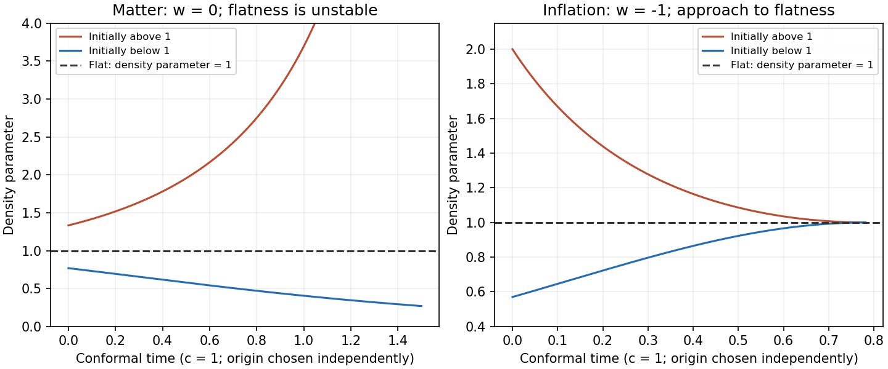

<h1 id="10e/solution">Solution</h1>

↑ **Parent:** [10E](../10e.md)

With a prime denoting conformal-time differentiation, $a'=a\dot a$ and $\mathcal H=a'/a=\dot a$. Multiplying the [Friedmann equation](../../../../../friedmann-equations.md) by $a^2$ gives $\mathcal H^2+kc^2=8\pi G\rho a^2/3$, and hence

$$
\boxed{kc^2/\mathcal H^2=\Omega-1.}
$$

The [Friedmann acceleration equation](../../../../../friedmann-acceleration-equation.md) and $P=w\rho c^2$ give

$$
\mathcal H'=a\ddot a=-\frac{4\pi G}{3}\rho a^2(1+3w)
=-\frac{1+3w}{2}(\mathcal H^2+kc^2).
$$

Differentiate $\Omega-1=kc^2/\mathcal H^2$ and substitute this expression:

$$
\boxed{\Omega'=(1+3w)\mathcal H\Omega(\Omega-1).}
$$

For $k=0$, $\Omega=1$ identically and the same equation holds directly. The relations assume $\mathcal H\ne0$, as is true on the expanding branch in the question.

For pressureless matter, $w=0$, the [cosmological density parameter flow](../../../../../cosmological-density-parameter-flow.md) points away from $\Omega=1$: initial $\Omega>1$ increases, while $0<\Omega<1$ decreases. In the closed case the expanding branch can end at a turnaround, where $\mathcal H=0$ and this density parameter diverges. For vacuum domination, $w=-1$, the sign reverses: values above one decrease and positive values below one increase toward one. The plotted curves are representative conformal-time solutions with $c=1$ and separately chosen origins; inflationary future infinity occurs at a finite conformal time.

**[Figure 1](#10e/image-conformal-time-evolution-of-the-cosmological-density-parameter-during-matter-domination-and-inflation). Conformal-time evolution of the cosmological density parameter during matter domination and inflation**.

In a decelerating matter or radiation era, small deviations from flatness grow: near one, $d\log|\Omega-1|/d\log a\simeq1+3w>0$. Observed near-flatness therefore requires extremely small earlier deviations, the [flatness problem](../../../../../flatness-problem.md). During accelerated expansion with $w<-1/3$, this exponent is negative and curvature is driven toward negligible relative size. For $w=-1$, $|\Omega-1|$ decays approximately as $a^{-2}$. Sufficiently long [cosmic inflation](../../../../../cosmic-inflation-split.md) supplies the [inflationary solution of the flatness problem](../../../../../inflationary-solution-of-the-flatness-problem.md) before ordinary decelerating evolution resumes.

## ↑ Ancestors (10)

1. [10E](../10e.md)
2. [Paper 4](../../paper-4-split.md)
3. [Ii](../../split.md)
4. [2008](../../../split.md)
5. [Past exam of the mathematics course of the University of Cambridge](../../../../split.md)
6. [Mathematics course of the University of Cambridge](../../../../../mathematics-course-of-the-university-of-cambridge.md)
7. [Course of the University of Cambridge](../../../../../course-of-the-university-of-cambridge.md)
8. [University of Cambridge](../../../../../university-of-cambridge-split.md)
9. [List of universities](../../../../../list-of-universities.md)
10. [Codex Wiki](../../../../../split.md)
