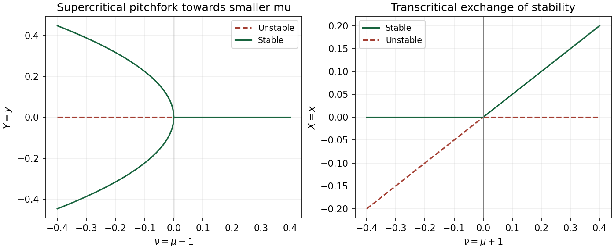

<h1 id="14a/solution">Solution</h1>

↑ **Parent:** [14A](../14a.md)

For a flow, a [hyperbolic fixed point](../../../../../hyperbolic-equilibrium-point.md) has no [eigenvalue](../../../../../eigenvalue.md) of its [linearization](../../../../../linearization.md) with zero real part; a [nonhyperbolic fixed point](../../../../../nonhyperbolic-equilibrium.md) has at least one such [eigenvalue](../../../../../eigenvalue.md). At $(\mu,0)$ the [eigenvalues](../../../../../eigenvalue.md) are $-\mu,1-\mu$, while at $(0,\pm1)$ they are $\mu+1,-2$. Thus nonhyperbolicity occurs at the two stated parameters. The following [centre manifold](../../../../../center-manifold.md) reductions show the associated actual bifurcations.

Near $(1,0)$ put $X=x-\mu$, $Y=y$, $\nu=\mu-1$. The transformed equations are

$$
\dot X=(1+\nu+X)(-X+Y^2),\qquad
\dot Y=Y(-\nu-X-Y^2),\qquad\dot\nu=0.
$$

At $\nu=0$, the non-extended stable subspace is the $X$ axis and the centre subspace is the $Y$ axis. In the [extended centre manifold](../../../../../extended-centre-manifold-for-a-parameter.md), write $X=h(Y,\nu)$, with $h(0,\nu)=0$. The symmetry $Y\mapsto-Y$ allows an even graph. At quadratic order its invariance equation has left side of degree at least three and right side $-h+Y^2$, so $h=Y^2+O(\nu Y^2,Y^4)$. Substitution gives

$$
\boxed{\dot Y=-\nu Y-2Y^3+O(\nu Y^3,Y^5).}
$$

This is a [supercritical pitchfork bifurcation](../../../../../supercritical-pitchfork-bifurcation.md) in parameter $-\nu=1-\mu$. The central branch is stable for $\mu>1$ and unstable for $\mu<1$ near one; the two nonzero branches for $\mu<1$ are stable. At the bifurcation itself the cubic term attracts on the [centre manifold](../../../../../center-manifold.md).

Near $(0,1)$ put $X=x$, $Y=y-1$, $\nu=\mu+1$. Then

$$
\dot X=X(\nu-X+2Y+Y^2),\qquad
\dot Y=(1+Y)(-X-2Y-Y^2),\qquad\dot\nu=0.
$$

At $\nu=0$, the stable subspace is $X=0$ and the centre line is $Y=-X/2$. Thus the leading extended centre graph is $Y=-X/2+O(X^2,\nu X)$, and the reduced flow is

$$
\boxed{\dot X=\nu X-2X^2+O(X^3,\nu X^2).}
$$

This is a [transcritical bifurcation](../../../../../transcritical-bifurcation.md): $X=0$ is stable for $\nu<0$, while the branch $X=\nu/2+\cdots$ is stable for $\nu>0$; the opposite branches are unstable. At the critical point the quadratic term is only one-sided attracting.

**[Figure 2](#14a/image-local-pitchfork-and-transcritical-bifurcations-with-stable-branches-solid-and-unstable-branches-dashed). Local pitchfork and transcritical bifurcations, with stable branches solid and unstable branches dashed**.

The exact additional branch in $y>0$ is

$$
\boxed{x=(\mu+1)/2,\qquad y=\sqrt{(1-\mu)/2},\qquad\mu<1.}
$$

It meets $(\mu,0)$ at $\mu=1$ and $(0,1)$ at $\mu=-1$, displaying the [connecting pitchfork and transcritical branches in a quadratic-product flow](../../../../../connecting-pitchfork-and-transcritical-branches-in-a-quadratic-product-flow.md). Its Jacobian has determinant $1-\mu^2$ and trace $(\mu-3)/2$. Hence it is stable for $-1<\mu<1$ and a saddle for $\mu<-1$. The negative-$y$ companion is needed for the pitchfork sketch near $(1,0)$; no separate analysis of $(0,-1)$ is required.

## ↑ Ancestors (10)

1. [14A](../14a.md)
2. [Paper 4](../../paper-4-split.md)
3. [Ii](../../split.md)
4. [2008](../../../split.md)
5. [Past exam of the mathematics course of the University of Cambridge](../../../../split.md)
6. [Mathematics course of the University of Cambridge](../../../../../mathematics-course-of-the-university-of-cambridge.md)
7. [Course of the University of Cambridge](../../../../../course-of-the-university-of-cambridge.md)
8. [University of Cambridge](../../../../../university-of-cambridge-split.md)
9. [List of universities](../../../../../list-of-universities.md)
10. [Codex Wiki](../../../../../split.md)
