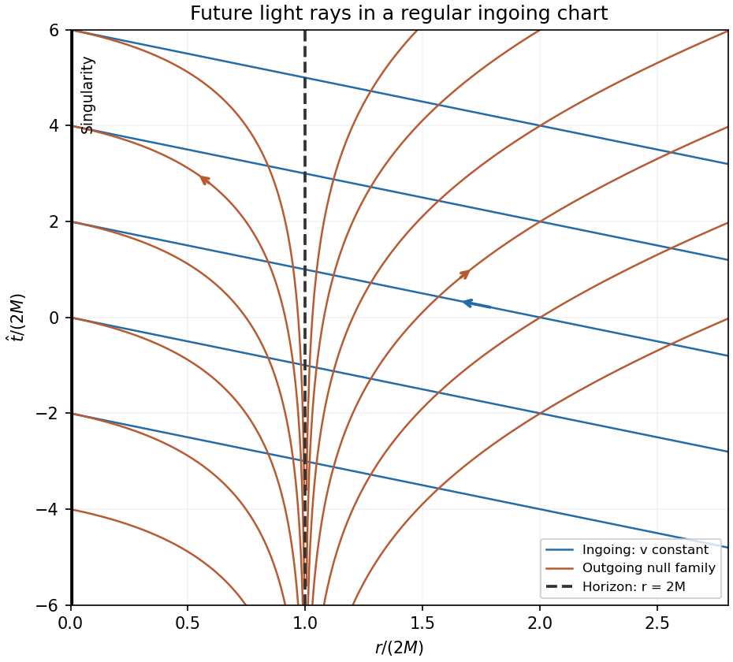

<h1 id="36e/solution">Solution</h1>

↑ **Parent:** [36E](../36e.md)

Write $f(r)=1-2M/r$. Radial null paths satisfy $dt/dr=\pm f^{-1}$, whose integral uses the [Schwarzschild tortoise coordinate](../../../../../schwarzschild-tortoise-coordinate.md) $r_*=r+2M\log|r/(2M)-1|$. The incoming and outgoing families are therefore

$$
\boxed{t=v-r_*,\qquad t=u+r_*}
$$

with constants $v,u$. For an exterior outgoing ray, put $r/(2M)-1=\varepsilon$. As $t\to-\infty$, $t=u+2M(1+\varepsilon)+2M\log\varepsilon$, so $\varepsilon\sim C e^{t/(2M)}$ for a positive ray-dependent $C$. As $t\to\infty$, the logarithm is smaller than the linear term, giving $r\sim t$.

In [Ingoing Eddington-Finkelstein coordinates](../../../../../ingoing-eddington-finkelstein-coordinates.md), $v=t+r_*$, so $dt=dv-dr/f$. Substitution cancels the singular $dr^2/f$ term and gives

$$
\boxed{ds^2=-f\,dv^2+2\,dv\,dr+r^2d\Omega^2.}
$$

This metric is regular at $r=2M$. In the requested chart $\widehat t=v-r$, the incoming rays are $\widehat t=v_0-r$ and the outgoing rays satisfy

$$
\widehat t=u+r+4M\log|r/(2M)-1|,\qquad
\frac{dr}{d\widehat t}=\frac{r-2M}{r+2M}.
$$

Incoming rays move inward everywhere. Outgoing rays move outward outside the horizon, remain at constant radius on it, and also move inward inside it.

**[Figure 3](#36e/image-radial-null-trajectories-in-a-regular-ingoing-schwarzschild-chart-with-future-directions-and-the-event-horizon-marked). Radial null trajectories in a regular ingoing Schwarzschild chart, with future directions and the event horizon marked**.

The line $r=2M$ is the [Schwarzschild event horizon](../../../../../schwarzschild-event-horizon.md), a null boundary of the future black-hole region. It is a coordinate singularity of Schwarzschild time, not a curvature singularity; the curvature singularity is at $r=0$. Signals from the future black-hole interior cannot cross it outward.

Finally parametrize any future-directed timelike observer in that interior by [proper time](../../../../../proper-time.md) $s$. Normalization in the given metric gives

$$
\frac{\dot r^2}{2M/r-1}=1+(2M/r-1)\dot t^2+r^2(\dot\theta^2+\sin^2\theta\dot\phi^2)\geq1.
$$

The future direction in the ingoing chart has $\dot r<0$, so $-\dot r\geq\sqrt{2M/r-1}$. The [proper-time bound inside a Schwarzschild black hole](../../../../../proper-time-bound-inside-a-schwarzschild-black-hole.md) is

$$
\boxed{\Delta s\leq\int_0^{r_0}\sqrt{\frac r{2M-r}}\,dr
=2M\arcsin\sqrt{\frac{r_0}{2M}}-\sqrt{r_0(2M-r_0)}<\pi M.}
$$

Thus a future-continued observer must reach the singular boundary in finite [proper time](../../../../../proper-time.md), regardless of acceleration or angular motion. The black-hole future orientation is essential; a past-directed path or a future path in a white-hole interior is a different statement.

## ↑ Ancestors (10)

1. [36E](../36e.md)
2. [Paper 4](../../paper-4-split.md)
3. [Ii](../../split.md)
4. [2008](../../../split.md)
5. [Past exam of the mathematics course of the University of Cambridge](../../../../split.md)
6. [Mathematics course of the University of Cambridge](../../../../../mathematics-course-of-the-university-of-cambridge.md)
7. [Course of the University of Cambridge](../../../../../course-of-the-university-of-cambridge.md)
8. [University of Cambridge](../../../../../university-of-cambridge-split.md)
9. [List of universities](../../../../../list-of-universities.md)
10. [Codex Wiki](../../../../../split.md)
