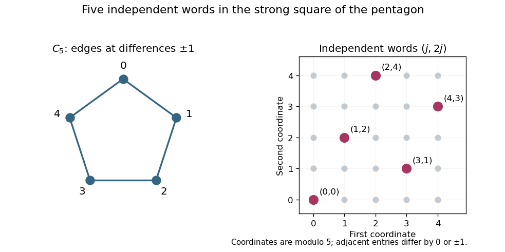

<h1 id="3/solution">Solution</h1>

↑ **Parent:** [3](../3.md)

All [graphs](../../../../../graph-split.md) here are finite and simple. For the [strong graph product](../../../../../strong-product-of-graphs.md) $G\boxtimes H$, two distinct [graph vertex](../../../../../vertex-graph-theory.md) pairs are adjacent if in each coordinate the entries are equal or adjacent. Use $G^{\boxtimes m}$ for its [strong graph power](../../../../../strong-graph-power.md); the exam's $G^m$ means this product power, not the distance-based [graph power](../../../../../graph-power.md). The [Shannon capacity of a graph](../../../../../shannon-capacity-of-a-graph.md) is

$$
\boxed{c(G)=\sup_{m\ge1}\alpha(G^{\boxtimes m})^{1/m}
=\lim_{m\to\infty}\alpha(G^{\boxtimes m})^{1/m},}
$$

where $\alpha$ is the [independence number](../../../../../independence-number.md). Products of [independent sets](../../../../../independent-set-graph-theory.md) are independent, so $a_{r+s}\ge a_ra_s$ for $a_m=\alpha(G^{\boxtimes m})$. To see why the limit exists, fix $r$ and write $m=qr+s$, $0\le s<r$. Then $a_m\ge a_r^q$, using $a_s\ge1$ and $a_0=1$, so $\liminf_m (\log a_m)/m\ge(\log a_r)/r$. Take the supremum over $r$; the reverse upper bound holds termwise. This proves the required form of [Fekete lemma](../../../../../fekete-s-lemma.md). For the empty [graph](../../../../../graph-split.md) on no [graph vertices](../../../../../vertex-graph-theory.md) one [sets](../../../../../set-split.md) [graph capacity](../../../../../shannon-capacity-of-a-graph.md) zero separately.

Associativity of the [strong product](../../../../../strong-product-of-graphs.md) gives

$$
c(G\boxtimes G)=\lim_m\alpha(G^{\boxtimes 2m})^{1/m}
=\left(\lim_m\alpha(G^{\boxtimes 2m})^{1/(2m)}\right)^2
=\boxed{c(G)^2}.
$$

An [orthonormal representation of a graph](../../../../../orthonormal-representation-of-a-graph.md) assigns a real [unit vector](../../../../../unit-vector.md) $u_v$ to each [graph vertex](../../../../../vertex-graph-theory.md), with $u_v\perp u_w$ whenever distinct [graph vertices](../../../../../vertex-graph-theory.md) $v,w$ are nonadjacent. Adjacent [graph vertices](../../../../../vertex-graph-theory.md) need not receive orthogonal [vectors](../../../../../vector.md). A handle is a [unit vector](../../../../../unit-vector.md) $h$. The handle formulation of the [Lovász theta function](../../../../../lovasz-number.md) is

$$
\vartheta(G)=\inf_{\{u_v\},\,\|h\|=1}\max_v\frac1{|h\cdot u_v|^2},
$$

with a zero denominator giving infinity. Representations may use any finite-dimensional Euclidean space. This is the usual [Lovász number](../../../../../lovasz-number.md) in its orthonormal-representation formulation.

For an [independent set](../../../../../independent-set-graph-theory.md) $I$, the [vectors](../../../../../vector.md) $u_v$, $v\in I$, are mutually orthonormal. Directly,

$$
0\le\left\|h-\sum_{v\in I}(h\cdot u_v)u_v\right\|^2
=1-\sum_{v\in I}|h\cdot u_v|^2.
$$

If $T=\max_v|h\cdot u_v|^{-2}$ is finite, every summand is at least $1/T$, giving $|I|\le T$. For a [strong power](../../../../../strong-graph-power.md), use the [vectors](../../../../../vector.md) and handle

$$
u_{(v_1,\ldots,v_m)}=u_{v_1}\otimes\cdots\otimes u_{v_m},\qquad
h_m=h^{\otimes m}.
$$

Their [norms](../../../../../norm.md) are one. Nonadjacency of two distinct words means a coordinate has distinct nonadjacent entries, so the corresponding tensor [inner product](../../../../../inner-product.md) has a zero factor. The handle [inner products](../../../../../inner-product.md) satisfy

$$
|h_m\cdot u_{(v_1,\ldots,v_m)}|^2=\prod_{i=1}^m|h\cdot u_{v_i}|^2\ge T^{-m}.
$$

Applying the preceding calculation gives $\alpha(G^{\boxtimes m})\le T^m$. Taking roots, then the infimum over representations and handles, proves

$$
\boxed{c(G)\le\vartheta(G).}
$$

This is the [tensor-product capacity bound from an orthonormal representation](../../../../../tensor-product-capacity-bound-from-an-orthonormal-representation.md), and the displayed projection calculation supplies [Bessel inequality](../../../../../bessel-s-inequality.md) explicitly.

For $C_5$, label [graph vertices](../../../../../vertex-graph-theory.md) by $\mathbb Z/5\mathbb Z$, with edges at differences $\pm1$. The five words

$$
\{(j,2j):j\in\mathbb Z/5\mathbb Z\}
$$

are independent in its strong square: a difference $\pm1$ in the first coordinate produces a nonedge difference $\pm2$ in the second, while a first-coordinate difference $\pm2$ is already a nonedge. Hence $c(C_5)\ge\sqrt5$.

**[Figure 1](#3/image-five-independent-words-in-the-strong-square-of-the-pentagon). Five independent words in the strong square of the pentagon**.

For the matching upper bound [set](../../../../../set-split.md) $\rho=1/\sqrt5$, $h=(0,0,1)$, and

$$
u_j=\left(\sqrt{1-\rho}\cos\frac{2\pi j}5,
\sqrt{1-\rho}\sin\frac{2\pi j}5,\sqrt\rho\right).
$$

Each [vector](../../../../../vector.md) is unit. For a nonedge, the angle difference is $\pm4\pi/5$, and

$$
u_j\cdot u_{j+2}=(1-\rho)\cos(4\pi/5)+\rho=0,
$$

because $\cos(4\pi/5)=-(1+\sqrt5)/4$ and $\rho=1/\sqrt5$. Thus these [vectors](../../../../../vector.md) form an [orthonormal representation](../../../../../orthonormal-representation-of-a-graph.md). The handle has $|h\cdot u_j|^2=\rho$, giving $\vartheta(C_5)\le1/\rho=\sqrt5$. Together the two bounds prove the [pentagon capacity code](../../../../../pentagon-capacity-code.md) result

$$
\boxed{c(C_5)=\vartheta(C_5)=\sqrt5.}
$$

## ↑ Ancestors (10)

1. [3](../3.md)
2. [Paper 14](../../paper-14-split.md)
3. [Iii](../../split.md)
4. [2008](../../../split.md)
5. [Past exam of the mathematics course of the University of Cambridge](../../../../split.md)
6. [Mathematics course of the University of Cambridge](../../../../../mathematics-course-of-the-university-of-cambridge.md)
7. [Course of the University of Cambridge](../../../../../course-of-the-university-of-cambridge.md)
8. [University of Cambridge](../../../../../university-of-cambridge-split.md)
9. [List of universities](../../../../../list-of-universities.md)
10. [Codex Wiki](../../../../../split.md)
