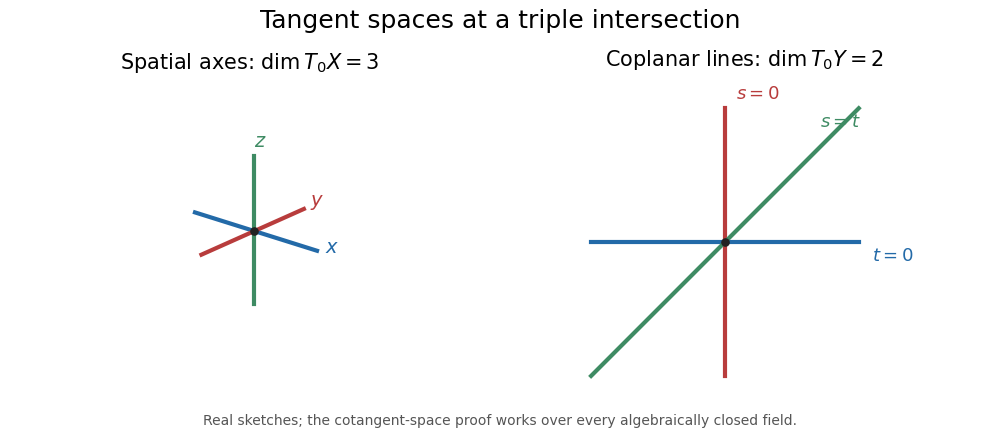

<h1 id="2/i/solution">Solution</h1>

↑ **Parent:** [I](../i.md)

Any isomorphism would permute [irreducible components](../../../../../../irreducible-component.md) and preserve their intersections. In each configuration, the origin is the unique point lying on all three components, so an isomorphism must take origin to origin.

The [coordinate ring](../../../../../../coordinate-ring.md) of the spatial configuration is

$$
A=k[x,y,z]/(xy,xz,yz).
$$

The displayed ideal is indeed the intersection of the three coordinate-axis ideals. Its generators have no linear parts, so at the origin the residue classes of $x,y,z$ form a basis of $\mathfrak m/\mathfrak m^2$. Hence its [algebraic cotangent space](../../../../../../algebraic-cotangent-space.md) and [Zariski tangent space](../../../../../../zariski-tangent-space.md) have dimension three.

For the plane configuration, the [coordinate ring](../../../../../../coordinate-ring.md) is $B=k[s,t]/(st(s-t))$. The three linear factors are distinct in every characteristic, so this principal ideal is radical. It likewise has no linear part, but now $\mathfrak n/\mathfrak n^2$ has basis $s,t$ and dimension two. An isomorphism of [local rings](../../../../../../local-ring.md) induces an isomorphism of these cotangent spaces, which is impossible:

$$
\boxed{\operatorname{edim}\mathcal O_{X,0}=3\ne2=\operatorname{edim}\mathcal O_{Y,0}.}
$$

Thus **the varieties are not isomorphic**. This is [embedding dimension distinguishes three-branch curves](../../../../../../embedding-dimension-distinguishes-three-branch-curves.md): matching incidence of branches does not determine their local algebra.

**[Figure 1](#2/i/image-three-spatial-axes-and-three-coplanar-lines-have-different-tangent-space-dimensions-at-their-common-point). Three spatial axes and three coplanar lines have different tangent-space dimensions at their common point**.

## ↑ Ancestors (11)

1. [I](../i.md)
2. [2](../../2.md)
3. [Paper 21](../../../paper-21-split.md)
4. [Iii](../../../split.md)
5. [2008](../../../../split.md)
6. [Past exam of the mathematics course of the University of Cambridge](../../../../../split.md)
7. [Mathematics course of the University of Cambridge](../../../../../../mathematics-course-of-the-university-of-cambridge.md)
8. [Course of the University of Cambridge](../../../../../../course-of-the-university-of-cambridge.md)
9. [University of Cambridge](../../../../../../university-of-cambridge-split.md)
10. [List of universities](../../../../../../list-of-universities.md)
11. [Codex Wiki](../../../../../../split.md)
