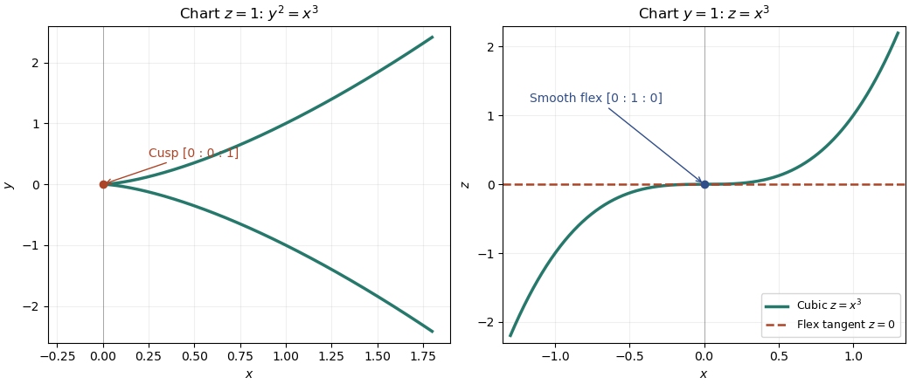

<h1 id="5/c/solution">Solution</h1>

↑ **Parent:** [C](../c.md)

Apply a [projective transformation](../../../../../../projective-linear-transformation.md) to put the [cuspidal cubic](../../../../../../cuspidal-cubic.md) in the form $D=\{F=y^2z-x^3=0\}$. Since $L$ meets $D$ at only one smooth point $p$, the [Bézout theorem](../../../../../../bezout-s-theorem.md) forces intersection multiplicity three there. Hence $L$ is the [tangent line](../../../../../../tangent-line.md) at a [flex](../../../../../../inflection-point-of-an-algebraic-plane-curve.md).

The homogeneous [Hessian matrix](../../../../../../hessian-matrix.md) has determinant

$$
\det\begin{pmatrix}-6x&0&0\\0&2z&2y\\0&2y&0\end{pmatrix}=24xy^2.
$$

By the [Hessian criterion for a flex](../../../../../../hessian-criterion-for-a-flex.md), every smooth flex lies in $D\cap\{xy^2=0\}$. These intersections are $[0:0:1]$, the [cusp](../../../../../../cusp-algebraic-geometry.md), and $[0:1:0]$, which is smooth. Thus the [unique smooth flex of a cuspidal cubic](../../../../../../unique-smooth-flex-of-a-cuspidal-cubic.md) is $p=[0:1:0]$, with [tangent line](../../../../../../tangent-line.md) $L=\{z=0\}$. Conversely the pair in part (b) has exactly the required properties. Therefore **there is one projective-equivalence class**, represented by

$$
\boxed{(C,D)=\bigl(3\{z=0\},\ \{y^2z=x^3\}\bigr).}
$$

**[Figure 1](#5/c/image-cuspidal-cubic-in-two-projective-charts-the-cusp-and-its-unique-smooth-flex). Cuspidal cubic in two projective charts: the cusp and its unique smooth flex**.

## ↑ Ancestors (11)

1. [C](../c.md)
2. [5](../../5.md)
3. [Paper 25](../../../paper-25-split.md)
4. [Iii](../../../split.md)
5. [2008](../../../../split.md)
6. [Past exam of the mathematics course of the University of Cambridge](../../../../../split.md)
7. [Mathematics course of the University of Cambridge](../../../../../../mathematics-course-of-the-university-of-cambridge.md)
8. [Course of the University of Cambridge](../../../../../../course-of-the-university-of-cambridge.md)
9. [University of Cambridge](../../../../../../university-of-cambridge-split.md)
10. [List of universities](../../../../../../list-of-universities.md)
11. [Codex Wiki](../../../../../../split.md)
