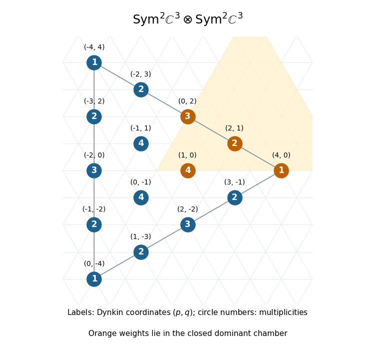
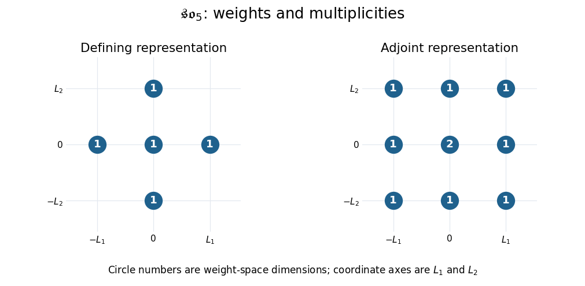

# Paper 3

↑ **Parent:** [Iii](../iii.md)

[https://www.maths.cam.ac.uk/postgrad/part-iii/files/pastpapers/2008/Paper3.pdf](https://www.maths.cam.ac.uk/postgrad/part-iii/files/pastpapers/2008/Paper3.pdf)

**Table of contents**

- [1](#1)
  - [a](#1/a)
    - [i](#1/a/i)
      - [Solution](#1/a/i/solution)
    - [ii](#1/a/ii)
      - [Solution](#1/a/ii/solution)
    - [iii](#1/a/iii)
      - [Solution](#1/a/iii/solution)
  - [b](#1/b)
    - [i](#1/b/i)
      - [Solution](#1/b/i/solution)
    - [ii](#1/b/ii)
      - [Solution](#1/b/ii/solution)
    - [iii](#1/b/iii)
      - [Solution](#1/b/iii/solution)
  - [c](#1/c)
    - [i](#1/c/i)
      - [Solution](#1/c/i/solution)
    - [ii](#1/c/ii)
      - [Solution](#1/c/ii/solution)
- [2](#2)
  - [i](#2/i)
    - [Solution](#2/i/solution)
  - [ii](#2/ii)
    - [Solution](#2/ii/solution)
  - [iii](#2/iii)
    - [Solution](#2/iii/solution)
  - [iv](#2/iv)
    - [Solution](#2/iv/solution)
  - [v](#2/v)
    - [Solution](#2/v/solution)
- [3](#3)
  - [i](#3/i)
    - [Solution](#3/i/solution)
  - [ii](#3/ii)
    - [Solution](#3/ii/solution)
  - [iii](#3/iii)
    - [Solution](#3/iii/solution)
  - [iv](#3/iv)
    - [Solution](#3/iv/solution)
  - [v](#3/v)
    - [Solution](#3/v/solution)
- [4](#4)
  - [i](#4/i)
    - [Solution](#4/i/solution)
  - [ii](#4/ii)
    - [Solution](#4/ii/solution)
  - [iii](#4/iii)
    - [Solution](#4/iii/solution)
  - [iv](#4/iv)
    - [Solution](#4/iv/solution)
  - [v](#4/v)
    - [Solution](#4/v/solution)
- [5](#5)
  - [i](#5/i)
    - [Solution](#5/i/solution)
  - [ii](#5/ii)
    - [Solution](#5/ii/solution)
  - [iii](#5/iii)
    - [Solution](#5/iii/solution)
  - [iv](#5/iv)
    - [Solution](#5/iv/solution)

## 1

↑ **Parent:** [Paper 3](paper-3.md)

<h3 id="1/a">a</h3>

↑ **Parent:** [1](#1)

<h4 id="1/a/i">i</h4>

↑ **Parent:** [A](#1/a)

<h5 id="1/a/i/solution">Solution</h5>

↑ **Parent:** [I](#1/a/i)

Take a basis $x,y$ of the [defining representation](../../../lie-algebra.md#defining-representation-of-a-matrix-lie-algebra) of the [sl2 Lie algebra](../../../semisimple-lie-algebra.md#sl2-lie-algebra), with $Hx=x$, $Hy=-y$, $Ey=x$, $Ex=0$, $Fx=y$ and $Fy=0$. A monomial basis of the [symmetric power](../../../linear-algebra.md#symmetric-power) $\operatorname{Sym}^4V$ is

$$
v_i=x^{4-i}y^i\quad(0\leq i\leq4),\qquad Hv_i=(4-2i)v_i.
$$

For the [exterior power](../../../linear-algebra.md#exterior-power) $U=\bigwedge^2\operatorname{Sym}^4V$, put $w_{ij}=v_i\wedge v_j$ for $i<j$. These ten elements form a basis, and their [weights of a representation](../../../semisimple-lie-algebra.md#weight-of-a-representation) add:

$$
Hw_{ij}=(8-2(i+j))w_{ij}.
$$

Thus the complete [weight-space decomposition](../../../semisimple-lie-algebra.md#weight-space-decomposition), with explicit bases, is

$$
\begin{array}{c|l}
\text{weight}&\text{basis}\\\hline
6&w_{01}\\
4&w_{02}\\
2&w_{03},\ w_{12}\\
0&w_{04},\ w_{13}\\
-2&w_{14},\ w_{23}\\
-4&w_{24}\\
-6&w_{34}
\end{array}
$$

The [weight diagram](../../../semisimple-lie-algebra.md#weight-diagram) therefore has **multiplicities $1,1,2,2,2,1,1$ at weights $6,4,2,0,-2,-4,-6$**, respectively.

**[Figure 1](#1/a/i/image-weights-and-multiplicities-of-the-exterior-square-of-sym4-c2). Weights and multiplicities of the exterior square of Sym4 C2**.

<h4 id="1/a/ii">ii</h4>

↑ **Parent:** [A](#1/a)

<h5 id="1/a/ii/solution">Solution</h5>

↑ **Parent:** [Ii](#1/a/ii)

The induced [raising operator](../../../semisimple-lie-algebra.md#raising-operator) and [lowering operator](../../../semisimple-lie-algebra.md#lowering-operator) act by

$$
Ev_i=i\,v_{i-1},\qquad Fv_i=(4-i)v_{i+1},\qquad X(u\wedge v)=(Xu)\wedge v+u\wedge(Xv).
$$

Since $Ew_{01}=0$ and $w_{01}$ has weight $6$, it generates the seven-dimensional irreducible [sl2 Lie algebra](../../../semisimple-lie-algebra.md#sl2-lie-algebra) module $\operatorname{Sym}^6V$. By [complete reducibility of semisimple Lie algebra representations](../../../semisimple-lie-algebra.md#weyl-s-theorem-on-complete-reducibility), subtracting its weights $6,4,2,0,-2,-4,-6$, each of multiplicity one, from the [weight diagram](../../../semisimple-lie-algebra.md#weight-diagram) leaves weights $2,0,-2$ once each. Hence

$$
\boxed{U\cong\operatorname{Sym}^6V\oplus\operatorname{Sym}^2V.}
$$

These are the only two irreducible isomorphism types occurring as submodules.

For the three-dimensional summand, calculate $Ew_{03}=3w_{02}$ and $Ew_{12}=w_{02}$. Therefore

$$
\boxed{v_+=w_{03}-3w_{12}}
$$

is a nonzero [highest-weight vector](../../../semisimple-lie-algebra.md#highest-weight-vector) of weight $2$. The [classification of finite-dimensional sl2 representations](../../../semisimple-lie-algebra.md#classification-of-finite-dimensional-sl2-representations) shows that the submodule $W$ it generates is the irreducible module $\operatorname{Sym}^2V$, of dimension three.

<h4 id="1/a/iii">iii</h4>

↑ **Parent:** [A](#1/a)

<h5 id="1/a/iii/solution">Solution</h5>

↑ **Parent:** [Iii](#1/a/iii)

Apply the [lowering operator](../../../semisimple-lie-algebra.md#lowering-operator) $F$ to the [highest-weight vector](../../../semisimple-lie-algebra.md#highest-weight-vector) from part (ii). Since $Fw_{03}=4w_{13}+w_{04}$ and $Fw_{12}=2w_{13}$, we obtain

$$
\boxed{Fv_+=w_{04}-2w_{13}\in W_0.}
$$

This is nonzero because $w_{04},w_{13}$ are distinct elements of the [exterior power](../../../linear-algebra.md#exterior-power) basis. Both have weight zero. As a consistency check, the [raising operator](../../../semisimple-lie-algebra.md#raising-operator) sends this vector to $2v_+$, as required by the [sl2 highest-weight lowering formula](../../../semisimple-lie-algebra.md#sl2-highest-weight-lowering-formula).

<h3 id="1/b">b</h3>

↑ **Parent:** [1](#1)

<h4 id="1/b/i">i</h4>

↑ **Parent:** [B](#1/b)

<h5 id="1/b/i/solution">Solution</h5>

↑ **Parent:** [I](#1/b/i)

Let $x_1,x_2,x_3$ be the coordinate basis of the [defining representation](../../../lie-algebra.md#defining-representation-of-a-matrix-lie-algebra) $W$ of $\mathfrak{sl}_3$. Write $s_{ij}=x_ix_j$ for $1\leq i\leq j\leq3$. The six $s_{ij}$ form a basis of the [symmetric power](../../../linear-algebra.md#symmetric-power) $\operatorname{Sym}^2W$, with weight $L_i+L_j$. A basis for the [tensor product of Lie algebra representations](../../../lie-algebra.md#tensor-product-of-lie-algebra-representations) $T$ consists of all 36 ordered tensors

$$
\boxed{s_{ij}\otimes s_{k\ell}\quad(1\leq i\leq j\leq3,\ 1\leq k\leq\ell\leq3).}
$$

The order of the two factors matters; there is no quotient identifying their interchange.

Each [weight of a representation](../../../semisimple-lie-algebra.md#weight-of-a-representation) has the form $k_1L_1+k_2L_2+k_3L_3$, where the nonnegative [integers](../../../number-theory.md#integer) satisfy $k_1+k_2+k_3=4$. Its [weight multiplicity](../../../semisimple-lie-algebra.md#weight-multiplicity) is the number of ways to split this triple into two nonnegative triples, each summing to two. The possible patterns, including every permutation, are

$$
\begin{array}{c|c|c}
(k_1,k_2,k_3)\text{ up to permutation}&\text{number of weights}&\text{multiplicity}\\\hline
(4,0,0)&3&1\\
(3,1,0)&6&2\\
(2,2,0)&3&3\\
(2,1,1)&3&4
\end{array}
$$

For example, $(2,2,0)$ splits as $(2,0,0)+(0,2,0)$, the reverse split, or $(1,1,0)+(1,1,0)$, giving multiplicity three. For $(2,1,1)$, the four splits pair $(2,0,0)$ with $(0,1,1)$ and $(1,1,0)$ with $(1,0,1)$, each in both orders. The multiplicities sum to $3+12+9+12=36$, verifying the dimension.

The following [weight diagram](../../../semisimple-lie-algebra.md#weight-diagram) uses [Dynkin labels](../../../semisimple-lie-algebra.md#dynkin-label) $(p,q)=(k_1-k_2,k_2-k_3)$; the circle numbers give multiplicities and orange points mark the [Closed dominant Weyl chamber](../../../semisimple-lie-algebra.md#closed-dominant-weyl-chamber).

**[Figure 2](#1/b/i/image-the-fifteen-weights-and-multiplicities-of-sym2-c3-tensor-sym2-c3). The fifteen weights and multiplicities of Sym2 C3 tensor Sym2 C3**.

<h4 id="1/b/ii">ii</h4>

↑ **Parent:** [B](#1/b)

<h5 id="1/b/ii/solution">Solution</h5>

↑ **Parent:** [Ii](#1/b/ii)

Take the [simple roots](../../../semisimple-lie-algebra.md#simple-root) $L_1-L_2$ and $L_2-L_3$. A weight represented by $(k_1,k_2,k_3)$ is in the [Closed dominant Weyl chamber](../../../semisimple-lie-algebra.md#closed-dominant-weyl-chamber) exactly when $k_1\geq k_2\geq k_3$. Among nonnegative triples of total four, the possibilities are $(4,0,0),(3,1,0),(2,2,0),(2,1,1)$. Using $L_1+L_2+L_3=0$, their explicit [weight space](../../../semisimple-lie-algebra.md#weight-space) bases are

$$
\begin{array}{c|l}
\text{weight}&\text{basis}\\\hline
4L_1&s_{11}\otimes s_{11}\\
2L_1-L_3&s_{11}\otimes s_{12},\ s_{12}\otimes s_{11}\\
-2L_3&s_{11}\otimes s_{22},\ s_{22}\otimes s_{11},\ s_{12}\otimes s_{12}\\
L_1&s_{11}\otimes s_{23},\ s_{23}\otimes s_{11},\ s_{12}\otimes s_{13},\ s_{13}\otimes s_{12}
\end{array}
$$

Each listed tensor has the required summed weight, and the monomial basis from part (i) shows linear independence and exhausts all possible tensors of that weight. Thus these are all the requested bases.

<h4 id="1/b/iii">iii</h4>

↑ **Parent:** [B](#1/b)

<h5 id="1/b/iii/solution">Solution</h5>

↑ **Parent:** [Iii](#1/b/iii)

Use the positive simple-root [raising operators](../../../semisimple-lie-algebra.md#raising-operator) $E_{12}=x_1\partial_{x_2}$ and $E_{23}=x_2\partial_{x_3}$. On the weight space of $2L_1-L_3$, the first maps both $s_{11}\otimes s_{12}$ and $s_{12}\otimes s_{11}$ to $s_{11}\otimes s_{11}$, while the second annihilates both. Consequently

$$
\boxed{v=s_{11}\otimes s_{12}-s_{12}\otimes s_{11}}
$$

is a nonzero [highest-weight vector](../../../semisimple-lie-algebra.md#highest-weight-vector); the remaining positive-root operator $E_{13}=[E_{12},E_{23}]$ also annihilates it. Its [Dynkin labels](../../../semisimple-lie-algebra.md#dynkin-label) are $(2,1)$, and the generated submodule $Z$ is the irreducible [highest-weight representation](../../../semisimple-lie-algebra.md#highest-weight-representation) with that highest weight.

Put $F_1=E_{21}=x_2\partial_{x_1}$ and $F_2=E_{32}=x_3\partial_{x_2}$, acting on both tensor factors. Direct calculation gives

$$
F_1v=s_{11}\otimes s_{22}-s_{22}\otimes s_{11},\qquad
F_2v=s_{11}\otimes s_{13}-s_{13}\otimes s_{11}.
$$

Define the linearly independent tensors

$$
A=s_{11}\otimes s_{23}-s_{23}\otimes s_{11},\qquad
B=s_{12}\otimes s_{13}-s_{13}\otimes s_{12}.
$$

They both have weight $L_1$, and

$$
F_2F_1v=2A,\qquad F_1F_2v=A+2B.
$$

Therefore $A,B\in Z_{L_1}$. To prove that they exhaust this [weight space](../../../semisimple-lie-algebra.md#weight-space), its weight differs from the highest weight by $(L_1-L_2)+(L_2-L_3)$. The [Poincaré-Birkhoff-Witt theorem](../../../lie-algebra.md#poincare-birkhoff-witt-theorem) expresses all descendants at that difference using $F_2F_1v$ and $F_1F_2v$: the third possible operator $E_{31}=[F_2,F_1]$ is their difference. Hence the space has dimension at most two, and the two independent vectors already found give

$$
\boxed{Z_{L_1}=\operatorname{span}\{A,B\}.}
$$

<h3 id="1/c">c</h3>

↑ **Parent:** [1](#1)

<h4 id="1/c/i">i</h4>

↑ **Parent:** [C](#1/c)

<h5 id="1/c/i/solution">Solution</h5>

↑ **Parent:** [I](#1/c/i)

In the finite-dimensional setting, let $R(a,b)$ denote the irreducible $\mathfrak{sl}_3$ [highest-weight representation](../../../semisimple-lie-algebra.md#highest-weight-representation) of highest weight $aL_1-bL_3$, where $a,b$ are nonnegative [integers](../../../number-theory.md#integer). Thus $(a,b)$ are its [Dynkin labels](../../../semisimple-lie-algebra.md#dynkin-label). The target $\lambda=L_1-2L_3$ has labels $(1,2)$. Write the highest-weight difference in [simple roots](../../../semisimple-lie-algebra.md#simple-root) as

$$
(aL_1-bL_3)-\lambda=r(L_1-L_2)+s(L_2-L_3),\qquad
r=\frac{2a+b-4}{3},\quad s=\frac{a+2b-5}{3}.
$$

The [dominant weight multiplicity formula for sl3](../../../semisimple-lie-algebra.md#dominant-weight-multiplicity-formula-for-sl3) gives zero unless $r,s$ are nonnegative [integers](../../../number-theory.md#integer), and otherwise gives

$$
\dim R(a,b)_\lambda=1+\min(a,b,r,s).
$$

For completeness, this multiplicity is an actual count. In the [sl3 interlacing character formula](../../../semisimple-lie-algebra.md#sl3-interlacing-character-formula), use top row $(a+b,b,0)$ and bottom entry $s+3$; the target diagonal exponents are $(s+3,s+2,s)$. The middle row $(P,Q)$ obeys $P+Q=2s+5$ and

$$
\max\{b,2s+5-b,s+3\}\leq P\leq\min\{a+b,2s+5\}.
$$

Each allowable integral $P$ gives one [Gelfand–Tsetlin basis](../../../representation-theory-of-the-symmetric-group.md#gelfand-tsetlin-basis) vector. Subtracting the lower bound from the upper bound gives the minimum of $a,s,r,r+3,b,s+2$, which reduces to $\min(a,b,r,s)$. This proves the displayed multiplicity formula in the case at hand.

Since both summands have a nonzero [weight space](../../../semisimple-lie-algebra.md#weight-space) and their dimensions at $\lambda$ sum to three, their multiplicities must be one and two. For multiplicity one, the minimum is zero. The cases $a=0$ and $b=0$ give $(0,4+3j)$ and $(5+3j,0)$; the remaining cases $r=0$ or $s=0$ give $(1,2)$ and $(3,1)$. Hence the full family is

$$
\mathcal C_1=\{R(0,4+3j),R(5+3j,0):j\geq0\}\cup\{R(1,2),R(3,1)\}.
$$

For multiplicity two, the minimum is one. The cases $a=1$ and $b=1$ give $(1,5+3j)$ and $(6+3j,1)$; the remaining cases $r=1$ or $s=1$ give $(2,3)$ and $(4,2)$. Thus

$$
\mathcal C_2=\{R(1,5+3j),R(6+3j,1):j\geq0\}\cup\{R(2,3),R(4,2)\}.
$$

The minimum conditions exhaust all cases and each listed module has the stated multiplicity. **All candidate unordered pairs are $\boxed{\{U,V\}\text{ with }U\in\mathcal C_1,\ V\in\mathcal C_2}$.** There are infinitely many at this stage; the question imposes no upper bound on their highest weights.

<h4 id="1/c/ii">ii</h4>

↑ **Parent:** [C](#1/c)

<h5 id="1/c/ii/solution">Solution</h5>

↑ **Parent:** [Ii](#1/c/ii)

Let $\nu=-L_3$, whose [Dynkin labels](../../../semisimple-lie-algebra.md#dynkin-label) are $(0,1)$. Since $\lambda-\nu=L_1-L_3$ is the sum of the two [simple roots](../../../semisimple-lie-algebra.md#simple-root), its boundary distances in the [dominant weight multiplicity formula for sl3](../../../semisimple-lie-algebra.md#dominant-weight-multiplicity-formula-for-sl3) are $r+1,s+1$. Consequently

$$
\dim R(a,b)_\nu=1+\min(a,b,r+1,s+1).
$$

For a module in $\mathcal C_1$, this multiplicity is one in the two families having $a=0$ or $b=0$, and two for $R(1,2)$ and $R(3,1)$. For a module in $\mathcal C_2$, it is two in the families having $a=1$ or $b=1$, and three for $R(2,3)$ and $R(4,2)$. In each case, increasing $r,s$ by one increases the minimum only if neither $a$ nor $b$ already limits it.

To obtain total multiplicity five at $\nu$, the two summands must therefore contribute two and three. **The only surviving pairs, up to interchange, are**

$$
\boxed{\begin{aligned}
&\{R(1,2),R(2,3)\},&&\{R(1,2),R(4,2)\},\\
&\{R(3,1),R(2,3)\},&&\{R(3,1),R(4,2)\}.
\end{aligned}}
$$

Their multiplicities at $\lambda$ remain one and two, so all four pairs satisfy both conditions.

## 2

↑ **Parent:** [Paper 3](paper-3.md)

<h3 id="2/i">i</h3>

↑ **Parent:** [2](#2)

<h4 id="2/i/solution">Solution</h4>

↑ **Parent:** [I](#2/i)

Work with a complex [semisimple Lie algebra](../../../semisimple-lie-algebra.md) and its [root system](../../../semisimple-lie-algebra.md#root-system) $R$ in the real span $E$ of the [roots of a root system](../../../semisimple-lie-algebra.md#root-of-a-root-system). The [Killing form](../../../lie-algebra.md#killing-form) induces a positive definite [inner product](../../../linear-algebra.md#inner-product) on this real root space, after the usual identification with the dual of the real span of the [coroots](../../../semisimple-lie-algebra.md#coroot). For each root $\alpha$, its [Weyl reflection](../../../semisimple-lie-algebra.md#weyl-reflection) is

$$
s_\alpha(\lambda)=\lambda-\langle\lambda,\alpha^\vee\rangle\alpha,\qquad \alpha^\vee=\frac{2\alpha}{(\alpha,\alpha)}.
$$

The [Weyl group](../../../semisimple-lie-algebra.md#weyl-group) is $\boxed{W=\langle s_\alpha:\alpha\in R\rangle}$. The structural facts being used are that these [reflections](../../../linear-algebra.md#reflection-mathematics) preserve the finite [root system](../../../semisimple-lie-algebra.md#root-system), that the roots span $E$, and that the reflections in the [simple roots](../../../semisimple-lie-algebra.md#simple-root) already generate $W$. Thus $W$ is finite: it acts faithfully as permutations of $R$. Equivalently, it is the normalizer of the [Cartan subalgebra](../../../semisimple-lie-algebra.md#cartan-subalgebra) modulo its centralizer in the associated adjoint group.

<h3 id="2/ii">ii</h3>

↑ **Parent:** [2](#2)

<h4 id="2/ii/solution">Solution</h4>

↑ **Parent:** [Ii](#2/ii)

Choose a positive system $R^+$ and its [simple roots](../../../semisimple-lie-algebra.md#simple-root) $\Delta=\{\alpha_1,\ldots,\alpha_\ell\}$. The corresponding fundamental [Weyl chamber](../../../semisimple-lie-algebra.md#fundamental-chamber-of-a-root-system) is the open cone

$$
\boxed{\mathcal W=\{\lambda\in E:\langle\lambda,\alpha_i^\vee\rangle>0\text{ for all }i\}.}
$$

Its [Closed dominant Weyl chamber](../../../semisimple-lie-algebra.md#closed-dominant-weyl-chamber) replaces all strict inequalities by weak inequalities. The facts used here are that every [positive root](../../../semisimple-lie-algebra.md#positive-root) is a nonnegative integral combination of the [simple roots](../../../semisimple-lie-algebra.md#simple-root), and that the [Weyl chambers](../../../semisimple-lie-algebra.md#fundamental-chamber-of-a-root-system) are the connected components left after removing the root-orthogonal hyperplanes. Hence the displayed inequalities describe one such component. The [Weyl group](../../../semisimple-lie-algebra.md#weyl-group) permutes these components simply transitively, and every orbit in $E$ meets the [Closed dominant Weyl chamber](../../../semisimple-lie-algebra.md#closed-dominant-weyl-chamber) in exactly one point. A point on a wall may have a nontrivial stabilizer, which is why uniqueness of the chamber point does not always mean uniqueness of the group element carrying it there.

<h3 id="2/iii">iii</h3>

↑ **Parent:** [2](#2)

<h4 id="2/iii/solution">Solution</h4>

↑ **Parent:** [Iii](#2/iii)

A [highest-weight vector](../../../semisimple-lie-algebra.md#highest-weight-vector) is a nonzero [weight vector](../../../semisimple-lie-algebra.md#weight-vector) $v$ such that $\mathfrak g_\alpha v=0$ for every [positive root](../../../semisimple-lie-algebra.md#positive-root) $\alpha$. Its [weight of a representation](../../../semisimple-lie-algebra.md#weight-of-a-representation) is a highest weight. For an irreducible finite-dimensional [Lie algebra representation](../../../lie-algebra.md#lie-algebra-representation), this is the unique [highest weight of a representation](../../../semisimple-lie-algebra.md#highest-weight-of-a-representation), and $v$ generates the module; a reducible module can have several highest weights of different summands.

Here is an existence argument for every nonzero finite-dimensional module $V$. For each [simple root](../../../semisimple-lie-algebra.md#simple-root), its root operators and [coroot](../../../semisimple-lie-algebra.md#coroot) form an [sl2 subalgebra associated with a root](../../../semisimple-lie-algebra.md#sl2-subalgebra-associated-with-a-root). The [classification of finite-dimensional sl2 representations](../../../semisimple-lie-algebra.md#classification-of-finite-dimensional-sl2-representations) shows that this coroot acts diagonalizably with integral [eigenvalues](../../../linear-operator-theory.md#eigenvalue). These commuting coroots span the [Cartan subalgebra](../../../semisimple-lie-algebra.md#cartan-subalgebra), so simultaneous diagonalization gives a finite [weight-space decomposition](../../../semisimple-lie-algebra.md#weight-space-decomposition)

$$
V=\bigoplus_\lambda V_\lambda.
$$

Choose a real linear functional $\ell$ on the [weight lattice](../../../semisimple-lie-algebra.md#weight-lattice) span that is positive on every [simple root](../../../semisimple-lie-algebra.md#simple-root), hence on every [positive root](../../../semisimple-lie-algebra.md#positive-root), and choose a weight $\lambda$ maximizing $\ell$ among the finitely many weights of $V$. If $v\in V_\lambda$ and $X_\alpha\in\mathfrak g_\alpha$, then

$$
H(X_\alpha v)=X_\alpha Hv+[H,X_\alpha]v=(\lambda(H)+\alpha(H))X_\alpha v,
$$

so $X_\alpha v$ belongs to $V_{\lambda+\alpha}$ if nonzero. For positive $\alpha$, that would contradict maximality because $\ell(\lambda+\alpha)>\ell(\lambda)$. Thus every nonzero $v\in V_\lambda$ is a [highest-weight vector](../../../semisimple-lie-algebra.md#highest-weight-vector). **Every nonzero finite-dimensional module therefore has a highest weight.** The zero module has no nonzero vector or weight, so it is the vacuous exception to the literal unrestricted wording.

<h3 id="2/iv">iv</h3>

↑ **Parent:** [2](#2)

<h4 id="2/iv/solution">Solution</h4>

↑ **Parent:** [Iv](#2/iv)

Let $v$ be a [highest-weight vector](../../../semisimple-lie-algebra.md#highest-weight-vector) of weight $\lambda$. For a [simple root](../../../semisimple-lie-algebra.md#simple-root) $\alpha_i$, choose its [sl2 subalgebra associated with a root](../../../semisimple-lie-algebra.md#sl2-subalgebra-associated-with-a-root), with operators $E_i,F_i,H_i$ satisfying $[E_i,F_i]=H_i$, $[H_i,F_i]=-2F_i$, and $H_i=\alpha_i^\vee$. We have $E_iv=0$ and $H_iv=\lambda(H_i)v$.

Since $F_i$ decreases the weight by $\alpha_i$ and there are only finitely many [weights of a representation](../../../semisimple-lie-algebra.md#weight-of-a-representation), let $n\geq0$ be maximal with $F_i^nv\ne0$. Induction using the two bracket relations gives the [sl2 highest-weight lowering formula](../../../semisimple-lie-algebra.md#sl2-highest-weight-lowering-formula)

$$
E_iF_i^kv=k\bigl(\lambda(H_i)-k+1\bigr)F_i^{k-1}v.
$$

Applying this at $k=n+1$, the left side vanishes, and the nonzero vector $F_i^nv$ on the right forces $\lambda(H_i)=n$. This holds for every [simple root](../../../semisimple-lie-algebra.md#simple-root), so

$$
\boxed{\langle\lambda,\alpha_i^\vee\rangle\in\mathbb Z_{\geq0}\text{ for all }i.}
$$

Thus the [highest weight](../../../semisimple-lie-algebra.md#highest-weight-of-a-representation) is a [dominant integral weight](../../../semisimple-lie-algebra.md#dominant-integral-weight), in particular an element of the [Closed dominant Weyl chamber](../../../semisimple-lie-algebra.md#closed-dominant-weyl-chamber).

<h3 id="2/v">v</h3>

↑ **Parent:** [2](#2)

<h4 id="2/v/solution">Solution</h4>

↑ **Parent:** [V](#2/v)

Use the $\mathfrak{sl}_3$ [weight of a representation](../../../semisimple-lie-algebra.md#weight-of-a-representation) convention from Question 1: $L_1+L_2+L_3=0$, with [simple roots](../../../semisimple-lie-algebra.md#simple-root) $L_1-L_2$ and $L_2-L_3$. This identification is necessary: the general preceding setup does not by itself specify which [root system](../../../semisimple-lie-algebra.md#root-system) the symbols $L_i$ refer to.

The [Weyl group](../../../semisimple-lie-algebra.md#weyl-group) is $S_3$, acting by permutations of the $L_i$. Let $s_1=(12)$ and $s_2=(23)$, with composition read from right to left. Then

$$
-2L_1+L_2\xrightarrow{s_1}L_1-2L_2\xrightarrow{s_2}L_1-2L_3.
$$

Hence

$$
\boxed{w=s_2s_1=(1\ 3\ 2),\qquad\mu=L_1-2L_3.}
$$

For direct verification, the diagonal coefficients of $\mu$ are $(1,0,-2)$, so its two [Dynkin labels](../../../semisimple-lie-algebra.md#dynkin-label) are $1-0=1$ and $0-(-2)=2$, both strictly positive. Thus $\mu$ is in the open [Weyl chamber](../../../semisimple-lie-algebra.md#fundamental-chamber-of-a-root-system). The original three coefficients $(-2,1,0)$ are distinct, so its stabilizer is trivial and this permutation is unique.

## 3

↑ **Parent:** [Paper 3](paper-3.md)

<h3 id="3/i">i</h3>

↑ **Parent:** [3](#3)

<h4 id="3/i/solution">Solution</h4>

↑ **Parent:** [I](#3/i)

Preserving the symmetric [bilinear form](../../../linear-algebra.md#bilinear-form) infinitesimally means $Z^TM+MZ=0$. In blocks of sizes $2,2,1$, write $Z$ as a general block matrix and multiply by the given $M$. The condition says that $MZ$ is skew-symmetric. It forces the lower-right entry to be zero, the middle diagonal block to be the negative transpose of the upper-left block, and the two off-diagonal two-by-two blocks to be skew-symmetric. Thus the general element of the [Special orthogonal Lie algebra](../../../semisimple-lie-algebra.md#special-orthogonal-lie-algebra) is

$$
\boxed{Z=\begin{pmatrix}
A&B&p\\
C&-A^T&q\\
-q^T&-p^T&0
\end{pmatrix},\qquad B^T=-B,\ C^T=-C,}
$$

where $A$ is an arbitrary two-by-two [matrix](../../../vector-space.md#matrix) and $p,q$ are arbitrary two-component columns. More explicitly, using ten independent complex parameters,

$$
Z=\begin{pmatrix}
a&b&0&e&p_1\\
c&d&-e&0&p_2\\
0&f&-a&-c&q_1\\
-f&0&-b&-d&q_2\\
-q_1&-q_2&-p_1&-p_2&0
\end{pmatrix}.
$$

Conversely, substituting this matrix into $Z^TM+MZ$ gives zero, so there are no further restrictions. In particular $\dim\mathfrak{so}_5=4+1+1+2+2=10$.

<h3 id="3/ii">ii</h3>

↑ **Parent:** [3](#3)

<h4 id="3/ii/solution">Solution</h4>

↑ **Parent:** [Ii](#3/ii)

The diagonal [Cartan subalgebra](../../../semisimple-lie-algebra.md#cartan-subalgebra) is

$$
\mathfrak h=\{H(a,d)=\operatorname{diag}(a,d,-a,-d,0):a,d\in\mathbb C\}.
$$

Put $\varepsilon_1=L_1$ and $\varepsilon_2=L_2$; then $L_3=-\varepsilon_1$, $L_4=-\varepsilon_2$ and $L_5=0$ on $\mathfrak h$. For the [matrix unit](../../../vector-space.md#matrix-unit) $E_{ij}$, $[H,E_{ij}]=(L_i-L_j)(H)E_{ij}$. Applying this to the general matrix in part (i) gives the following one-dimensional [root spaces](../../../semisimple-lie-algebra.md#root-space) and chosen root vectors:

$$
\begin{array}{c|l}
\alpha&X_\alpha\\\hline
\varepsilon_1-\varepsilon_2&E_{12}-E_{43}\\
-\varepsilon_1+\varepsilon_2&E_{21}-E_{34}\\
\varepsilon_1+\varepsilon_2&E_{14}-E_{23}\\
-\varepsilon_1-\varepsilon_2&E_{32}-E_{41}\\
\varepsilon_1&E_{15}-E_{53}\\
-\varepsilon_1&E_{35}-E_{51}\\
\varepsilon_2&E_{25}-E_{54}\\
-\varepsilon_2&E_{45}-E_{52}
\end{array}
$$

Each row satisfies $[H,X_\alpha]=\alpha(H)X_\alpha$ and belongs to the [Special orthogonal Lie algebra](../../../semisimple-lie-algebra.md#special-orthogonal-lie-algebra). The two diagonal parameters and eight root vectors span the ten-parameter matrix from part (i), giving the explicit [root-space decomposition](../../../semisimple-lie-algebra.md#root-space-decomposition)

$$
\boxed{\mathfrak{so}_5=\mathfrak h\oplus\bigoplus_{\alpha\in R}\mathbb C X_\alpha,\qquad R=\{\pm\varepsilon_1,\pm\varepsilon_2,\pm\varepsilon_1\pm\varepsilon_2\}.}
$$

This is the [B2 root system](../../../semisimple-lie-algebra.md#b2-root-system), with short roots on the coordinate axes and long roots on the diagonals.

<h3 id="3/iii">iii</h3>

↑ **Parent:** [3](#3)

<h4 id="3/iii/solution">Solution</h4>

↑ **Parent:** [Iii](#3/iii)

For the [defining representation](../../../lie-algebra.md#defining-representation-of-a-matrix-lie-algebra), the standard coordinate vectors $e_1,e_2,e_3,e_4,e_5$ are [weight vectors](../../../semisimple-lie-algebra.md#weight-vector) of weights $\varepsilon_1,\varepsilon_2,-\varepsilon_1,-\varepsilon_2,0$, respectively. Thus the [weight diagram](../../../semisimple-lie-algebra.md#weight-diagram) has four axial points and the origin, **each of multiplicity one**.

For the [Adjoint representation](../../../lie-algebra.md#adjoint-representation-of-a-lie-algebra), the eight nonzero [weights of a representation](../../../semisimple-lie-algebra.md#weight-of-a-representation) are the roots from part (ii), each of multiplicity one, with the displayed $X_\alpha$ as basis. The zero [weight space](../../../semisimple-lie-algebra.md#weight-space) is the [Cartan subalgebra](../../../semisimple-lie-algebra.md#cartan-subalgebra), with basis

$$
H_1=\operatorname{diag}(1,0,-1,0,0),\qquad H_2=\operatorname{diag}(0,1,0,-1,0).
$$

The [Adjoint representation](../../../lie-algebra.md#adjoint-representation-of-a-lie-algebra) diagram therefore has the four axial points, four diagonal points, and **the origin of multiplicity two**. The multiplicities sum to ten, as they must.

**[Figure 3](#3/iii/image-defining-and-adjoint-so5-weight-diagrams-with-multiplicities). Defining and adjoint so5 weight diagrams with multiplicities**.

<h3 id="3/iv">iv</h3>

↑ **Parent:** [3](#3)

<h4 id="3/iv/solution">Solution</h4>

↑ **Parent:** [Iv](#3/iv)

For a finite-dimensional [Lie algebra](../../../lie-algebra.md), the [Killing form](../../../lie-algebra.md#killing-form) is the symmetric [bilinear form](../../../linear-algebra.md#bilinear-form)

$$
\boxed{B(X,Y)=\operatorname{tr}_{\mathfrak g}(\operatorname{ad}X\,\operatorname{ad}Y),\qquad \operatorname{ad}X(Z)=[X,Z].}
$$

In the [root-space decomposition](../../../semisimple-lie-algebra.md#root-space-decomposition) of this [semisimple Lie algebra](../../../semisimple-lie-algebra.md), $\operatorname{ad}H$ acts as zero on the abelian [Cartan subalgebra](../../../semisimple-lie-algebra.md#cartan-subalgebra) and as multiplication by $\alpha(H)$ on $\mathfrak g_\alpha$. For $H,K\in\mathfrak h$, their product thus acts as multiplication by $\alpha(H)\alpha(K)$ on each [root space](../../../semisimple-lie-algebra.md#root-space). Every root space here is one-dimensional. Taking the trace over the two-dimensional Cartan subalgebra and the eight root spaces proves

$$
\boxed{B(H,K)=\sum_{\alpha\in R}\alpha(H)\alpha(K).}
$$

For a general weight decomposition the trace would include the corresponding [weight multiplicities](../../../semisimple-lie-algebra.md#weight-multiplicity); the root multiplicities are one in the semisimple setting here.

<h3 id="3/v">v</h3>

↑ **Parent:** [3](#3)

<h4 id="3/v/solution">Solution</h4>

↑ **Parent:** [V](#3/v)

The PDF's specified five-by-five diagonal matrix is $H=H_1$, so $\varepsilon_1(H)=1$ and $\varepsilon_2(H)=0$. In the root sum for the [Killing form](../../../lie-algebra.md#killing-form), the two short roots $\pm\varepsilon_1$ contribute $1+1$, the two short roots $\pm\varepsilon_2$ contribute zero, and the four long roots $\pm\varepsilon_1\pm\varepsilon_2$ each contribute one. Therefore

$$
\boxed{B(H,H)=2+0+4=6.}
$$

This computation uses the original PDF matrix; the converted TeX incorrectly gives its dimensions.

## 4

↑ **Parent:** [Paper 3](paper-3.md)

<h3 id="4/i">i</h3>

↑ **Parent:** [4](#4)

<h4 id="4/i/solution">Solution</h4>

↑ **Parent:** [I](#4/i)

In the crystallographic convention for this course, an [admissible Coxeter graph](../../../lie-theory.md#admissible-crystallographic-coxeter-graph) comes from linearly independent unit [vectors](../../../vector-space.md#vector) $v_1,\ldots,v_r$ in a [Euclidean space](../../../functional-analysis.md#euclidean-norm), such that for $i\ne j$,

$$
(v_i,v_j)\leq0,\qquad n_{ij}=4(v_i,v_j)^2\in\{0,1,2,3\}.
$$

The vertices $i,j$ have no connection when $n_{ij}=0$, and a single, double or triple connection when $n_{ij}=1,2,3$. Equivalently, the symmetric [Gram matrix](../../../linear-algebra.md#gram-matrix)

$$
\boxed{G_{ii}=1,\qquad G_{ij}=-\frac{\sqrt{n_{ij}}}{2}\ (i\ne j)}
$$

must be [positive-definite](../../../linear-algebra.md#positive-definite-bilinear-form). This equivalence follows because a positive definite [Gram matrix](../../../linear-algebra.md#gram-matrix) can be realized by linearly independent [vectors](../../../vector-space.md#vector), while such vectors necessarily have a positive definite Gram matrix. In the edge-labelled [Coxeter graph](../../../lie-theory.md#coxeter-graph) convention, these connections have labels $3,4,6$, since the corresponding inner products are $-\cos(\pi/3)$, $-\cos(\pi/4)$ and $-\cos(\pi/6)$.

<h3 id="4/ii">ii</h3>

↑ **Parent:** [4](#4)

<h4 id="4/ii/solution">Solution</h4>

↑ **Parent:** [Ii](#4/ii)

Suppose the underlying [graph](../../../graph.md) has a cycle through $k\geq3$ distinct vertices, and let $v_1,\ldots,v_k$ be their unit [vectors](../../../vector-space.md#vector) from admissibility. Adjacent vertices have $(v_i,v_j)\leq-1/2$, and every other pair has nonpositive [inner product](../../../linear-algebra.md#inner-product). Therefore

$$
\left\|\sum_{i=1}^k v_i\right\|^2=k+2\sum_{i<j}(v_i,v_j)\leq k+2k\left(-\frac12\right)=0.
$$

But linear independence makes the sum nonzero, whose squared [norm](../../../functional-analysis.md#norm) in a [Euclidean space](../../../functional-analysis.md#euclidean-norm) must be positive. This contradiction proves that **the underlying [graph](../../../graph.md) of an [admissible Coxeter graph](../../../lie-theory.md#admissible-crystallographic-coxeter-graph) has no cycles**. Double and triple lines record edge multiplicities; they are not cycles of length two. The argument also tolerates chords, which only make the bound smaller.

<h3 id="4/iii">iii</h3>

↑ **Parent:** [4](#4)

<h4 id="4/iii/solution">Solution</h4>

↑ **Parent:** [Iii](#4/iii)

In the finite-dimensional complex [semisimple Lie algebra](../../../semisimple-lie-algebra.md) setting implicit in this root-system construction, the given [Cartan subalgebra](../../../semisimple-lie-algebra.md#cartan-subalgebra) and [root spaces](../../../semisimple-lie-algebra.md#root-space) determine a reduced crystallographic [root system](../../../semisimple-lie-algebra.md#root-system) $R$. The ordering divides $R$ into [positive roots](../../../semisimple-lie-algebra.md#positive-root) and their negatives. The [simple roots](../../../semisimple-lie-algebra.md#simple-root) are the positive roots that cannot be written as a sum of two positive roots; a standard root-system fact is that they form a basis and that every positive root is a nonnegative integral combination of them.

Index the [simple roots](../../../semisimple-lie-algebra.md#simple-root) as $\alpha_1,\ldots,\alpha_\ell$ and form the [Cartan matrix](../../../semisimple-lie-algebra.md#cartan-matrix)

$$
A_{ij}=\langle\alpha_j,\alpha_i^\vee\rangle=\frac{2(\alpha_i,\alpha_j)}{(\alpha_i,\alpha_i)}.
$$

For $i\ne j$, these entries are nonpositive [integers](../../../number-theory.md#integer) and $A_{ij}A_{ji}\in\{0,1,2,3\}$. Construct one vertex per simple root and join distinct vertices by $A_{ij}A_{ji}$ lines. If root lengths differ, direct the arrow toward the shorter [simple root](../../../semisimple-lie-algebra.md#simple-root). **This labelled and oriented graph is the [Dynkin diagram](../../../semisimple-lie-algebra.md#dynkin-diagram).** Its unoriented [Coxeter graph](../../../lie-theory.md#coxeter-graph) is admissible: normalizing the simple roots to unit length gives $4(v_i,v_j)^2=A_{ij}A_{ji}$. A general Lie algebra without the semisimple root-system hypotheses need not produce such a diagram.

<h3 id="4/iv">iv</h3>

↑ **Parent:** [4](#4)

<h4 id="4/iv/solution">Solution</h4>

↑ **Parent:** [Iv](#4/iv)

Let $\alpha_1,\alpha_2$ be distinct [simple roots](../../../semisimple-lie-algebra.md#simple-root). Their difference is not a root, since its simple-root coefficients have opposite signs. The [root string](../../../semisimple-lie-algebra.md#root-string) through $\alpha_2$ in the direction $\alpha_1$ therefore starts at $\alpha_2$ and has the form

$$
\alpha_2,\ \alpha_2+\alpha_1,\ldots,\alpha_2+q\alpha_1,
\qquad q=-\langle\alpha_2,\alpha_1^\vee\rangle.
$$

Here we use the root-string theorem: if the full string runs from $\beta-p\alpha$ through $\beta+q\alpha$, then $p-q=\langle\beta,\alpha^\vee\rangle$; in this case $p=0$. Thus $\alpha_1+\alpha_2$ is a root exactly when $A_{12}<0$, equivalently when the corresponding [Dynkin diagram](../../../semisimple-lie-algebra.md#dynkin-diagram) nodes are connected.

The root-space bracket facts are $[\mathfrak g_\alpha,\mathfrak g_\beta]\subseteq\mathfrak g_{\alpha+\beta}$, with a zero space when the sum is not a root, and $[\mathfrak g_\alpha,\mathfrak g_\beta]=\mathfrak g_{\alpha+\beta}\ne0$ when the sum is a root and $\beta\ne-\alpha$. Applying these stated structural facts proves

$$
\boxed{[\mathfrak g_{\alpha_1},\mathfrak g_{\alpha_2}]=0\iff\text{the two nodes are not connected}.}
$$

If the two names denote the same [simple root](../../../semisimple-lie-algebra.md#simple-root), its one-dimensional [root space](../../../semisimple-lie-algebra.md#root-space) has zero bracket with itself, and a [Dynkin diagram](../../../semisimple-lie-algebra.md#dynkin-diagram) has no self-edge. Thus the equivalence also holds in that case.

<h3 id="4/v">v</h3>

↑ **Parent:** [4](#4)

<h4 id="4/v/solution">Solution</h4>

↑ **Parent:** [V](#4/v)

If the three [simple roots](../../../semisimple-lie-algebra.md#simple-root) are distinct and every pair of root spaces had nonzero [Lie bracket](../../../lie-algebra.md#lie-bracket), part (iv) would put all three connections in the [Dynkin diagram](../../../semisimple-lie-algebra.md#dynkin-diagram). Their underlying [Coxeter graph](../../../lie-theory.md#coxeter-graph) would contain a triangle, contradicting part (ii). Hence **at least one pair satisfies $\boxed{[\mathfrak g_{\alpha_i},\mathfrak g_{\alpha_j}]=0}$.** If two of the listed roots coincide, their common [root space](../../../semisimple-lie-algebra.md#root-space) is one-dimensional, so its bracket with itself is already zero. Thus the conclusion also covers that case.

## 5

↑ **Parent:** [Paper 3](paper-3.md)

<h3 id="5/i">i</h3>

↑ **Parent:** [5](#5)

<h4 id="5/i/solution">Solution</h4>

↑ **Parent:** [I](#5/i)

The [Jordan–Chevalley decomposition](../../../linear-operator-theory.md#jordan-chevalley-decomposition) is characterized by

$$
\boxed{X=X_s+X_n,\quad X_s\text{ diagonalizable},\quad X_n\text{ nilpotent},\quad[X_s,X_n]=0.}
$$

Over $\mathbb C$, a semisimple [linear operator](../../../vector-space.md#linear-operator) is a diagonalizable one. These conditions determine the two parts uniquely. Concretely, on the [generalized eigenspace](../../../linear-operator-theory.md#generalized-eigenspace) for an [eigenvalue](../../../linear-operator-theory.md#eigenvalue) $\lambda$, the semisimple part is $\lambda I$ and the nilpotent part is $X-\lambda I$; both are polynomials in $X$. To see uniqueness, any commuting candidate parts preserve each generalized eigenspace; diagonalize the proposed semisimple part there, and nilpotence then forces its eigenvalue to be the sole eigenvalue $\lambda$ of $X$ on that space.

For the displayed matrix, $\det(tI-X)=(t-1)^2$ and

$$
N=X-I=\begin{pmatrix}1&1\\-1&-1\end{pmatrix},\qquad N^2=0.
$$

Since $I$ is semisimple and commutes with $N$, the required parts are

$$
\boxed{X_s=I_2,\qquad X_n=\begin{pmatrix}1&1\\-1&-1\end{pmatrix}.}
$$

<h3 id="5/ii">ii</h3>

↑ **Parent:** [5](#5)

<h4 id="5/ii/solution">Solution</h4>

↑ **Parent:** [Ii](#5/ii)

We prove closure using [complete reducibility of semisimple Lie algebra representations](../../../semisimple-lie-algebra.md#weyl-s-theorem-on-complete-reducibility), rather than assuming that a [Lie subalgebra](../../../lie-algebra.md#lie-subalgebra) is closed under polynomials in its elements. Write the matrix [Jordan–Chevalley decomposition](../../../linear-operator-theory.md#jordan-chevalley-decomposition) as $X=S+N$. On $\operatorname{End}(V)$, the [commutator](../../../lie-algebra.md#commutator) operator $\operatorname{ad}S$ is diagonalizable: if $S$ has eigenspaces $V_\lambda$, then its eigenvalue on $\operatorname{Hom}(V_\lambda,V_\mu)$ is $\mu-\lambda$. The operator $\operatorname{ad}N$ is nilpotent: if $N^r=0$, then

$$
(\operatorname{ad}N)^k(A)=\sum_{j=0}^k(-1)^j\binom{k}{j}N^{k-j}AN^j=0\qquad(k\geq2r-1).
$$

The two operators commute because $[S,N]=0$. Uniqueness of the [Jordan–Chevalley decomposition](../../../linear-operator-theory.md#jordan-chevalley-decomposition) therefore says that $\operatorname{ad}S$ is the semisimple part of $\operatorname{ad}X$. Since a matrix's semisimple part is a polynomial in that matrix, and $\mathfrak g$ is invariant under $\operatorname{ad}X$, it follows that

$$
[S,\mathfrak g]\subseteq\mathfrak g.
$$

Now regard $\operatorname{End}(V)$ as a [Lie algebra representation](../../../lie-algebra.md#lie-algebra-representation) of $\mathfrak g$ under commutators. By [complete reducibility of semisimple Lie algebra representations](../../../semisimple-lie-algebra.md#weyl-s-theorem-on-complete-reducibility), there is an invariant complement $M$ with $\operatorname{End}(V)=\mathfrak g\oplus M$. Write $S=Y+C$, with $Y\in\mathfrak g$ and $C\in M$. For $A\in\mathfrak g$, the normalization property gives $[C,A]=[S,A]-[Y,A]\in\mathfrak g$, while invariance of $M$ gives $[C,A]\in M$. Thus $[C,A]=0$: $C$ commutes with the whole [Lie algebra](../../../lie-algebra.md).

Decompose $V=\bigoplus_jV_j$ into irreducible $\mathfrak g$-modules. Each $V_j$ is preserved by $X$, hence by its polynomial parts $S,N$, and also by $Y$; therefore it is preserved by $C$. By the [Schur lemma](../../../representation-theory.md#schur-s-lemma), $C|_{V_j}=c_jI$. A [semisimple Lie algebra](../../../semisimple-lie-algebra.md) is a [perfect Lie algebra](../../../semisimple-lie-algebra.md#perfect-lie-algebra), so every element is a sum of [Lie brackets](../../../lie-algebra.md#lie-bracket) and has trace zero on every finite-dimensional representation. Consequently $\operatorname{tr}(X|_{V_j})=\operatorname{tr}(Y|_{V_j})=0$. Also $N|_{V_j}$ is nilpotent, so it has trace zero; hence

$$
\operatorname{tr}(S|_{V_j})=0,\qquad c_j\dim V_j=\operatorname{tr}(C|_{V_j})=0.
$$

Thus every $c_j$ is zero, $C=0$, and $S=Y\in\mathfrak g$. Finally $N=X-S\in\mathfrak g$. We have proved

$$
\boxed{X_s,X_n\in\mathfrak g.}
$$

<h3 id="5/iii">iii</h3>

↑ **Parent:** [5](#5)

<h4 id="5/iii/solution">Solution</h4>

↑ **Parent:** [Iii](#5/iii)

A complex [semisimple Lie algebra](../../../semisimple-lie-algebra.md) has zero centre, so its [Adjoint representation](../../../lie-algebra.md#adjoint-representation-of-a-lie-algebra) is faithful. Its [absolute Jordan decomposition](../../../semisimple-lie-algebra.md#jordan-decomposition-in-an-abstract-semisimple-lie-algebra) is the unique expression $x=x_s+x_n$ with $[x_s,x_n]=0$, $\operatorname{ad}x_s$ diagonalizable and $\operatorname{ad}x_n$ nilpotent. Existence follows by applying part (ii) to the adjoint embedding, and uniqueness follows from uniqueness of the matrix [Jordan–Chevalley decomposition](../../../linear-operator-theory.md#jordan-chevalley-decomposition). The representation-compatibility theorem states that for every finite-dimensional [Lie algebra representation](../../../lie-algebra.md#lie-algebra-representation) $\rho$, $\rho(x_s)$ and $\rho(x_n)$ are respectively the semisimple and nilpotent parts of $\rho(x)$. Thus these parts are intrinsic to the [Lie algebra](../../../lie-algebra.md), independent of a chosen matrix embedding, and their semisimplicity and nilpotence are preserved in every finite-dimensional representation.

<h3 id="5/iv">iv</h3>

↑ **Parent:** [5](#5)

<h4 id="5/iv/solution">Solution</h4>

↑ **Parent:** [Iv](#5/iv)

Use the same nonsemisimple matrix from part (i) and the one-dimensional [Lie subalgebra](../../../lie-algebra.md#lie-subalgebra)

$$
\mathfrak g=\mathbb C X\subseteq\mathfrak{gl}_2,\qquad X=\begin{pmatrix}2&1\\-1&0\end{pmatrix}.
$$

It is a [Lie subalgebra](../../../lie-algebra.md#lie-subalgebra) because $[aX,bX]=0$ for all scalars $a,b$. Its [Jordan–Chevalley decomposition](../../../linear-operator-theory.md#jordan-chevalley-decomposition) has $X_s=I_2$ and $X_n=X-I_2\ne0$. If $I_2=cX$, comparing off-diagonal entries forces $c=0$, which contradicts the diagonal entries. If $X_n=cX$, taking traces gives $0=2c$, again forcing $c=0$ although $X_n\ne0$. Thus

$$
\boxed{X_s\notin\mathfrak g,\qquad X_n\notin\mathfrak g.}
$$

The semisimplicity assumption on the [Lie algebra](../../../lie-algebra.md) in part (ii) is therefore essential.

## ↑ Ancestors (8)

1. [Iii](../iii.md)
2. [2008](../../2008.md)
3. [Past exam of the mathematics course of the University of Cambridge](../../../past-exam-of-the-mathematics-course-of-the-university-of-cambridge.md)
4. [Mathematics course of the University of Cambridge](../../../university-of-cambridge.md#mathematics-course-of-the-university-of-cambridge)
5. [Course of the University of Cambridge](../../../university-of-cambridge.md#course-of-the-university-of-cambridge)
6. [University of Cambridge](../../../university-of-cambridge.md)
7. [List of universities](../../../README.md#list-of-universities)
8. [Codex Wiki](../../../README.md)
