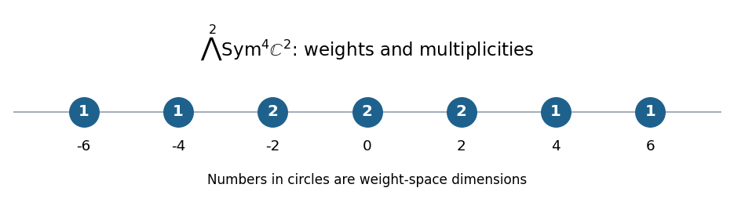

<h1 id="1/a/i/solution">Solution</h1>

↑ **Parent:** [I](../i.md)

Take a basis $x,y$ of the [defining representation](../../../../../../../defining-representation-of-a-matrix-lie-algebra.md) of the [sl2 Lie algebra](../../../../../../../sl2-lie-algebra.md), with $Hx=x$, $Hy=-y$, $Ey=x$, $Ex=0$, $Fx=y$ and $Fy=0$. A monomial basis of the [symmetric power](../../../../../../../symmetric-power.md) $\operatorname{Sym}^4V$ is

$$
v_i=x^{4-i}y^i\quad(0\leq i\leq4),\qquad Hv_i=(4-2i)v_i.
$$

For the [exterior power](../../../../../../../exterior-power.md) $U=\bigwedge^2\operatorname{Sym}^4V$, put $w_{ij}=v_i\wedge v_j$ for $i<j$. These ten elements form a basis, and their [weights of a representation](../../../../../../../weight-of-a-representation.md) add:

$$
Hw_{ij}=(8-2(i+j))w_{ij}.
$$

Thus the complete [weight-space decomposition](../../../../../../../weight-space-decomposition.md), with explicit bases, is

$$
\begin{array}{c|l}
\text{weight}&\text{basis}\\\hline
6&w_{01}\\
4&w_{02}\\
2&w_{03},\ w_{12}\\
0&w_{04},\ w_{13}\\
-2&w_{14},\ w_{23}\\
-4&w_{24}\\
-6&w_{34}
\end{array}
$$

The [weight diagram](../../../../../../../weight-diagram.md) therefore has **multiplicities $1,1,2,2,2,1,1$ at weights $6,4,2,0,-2,-4,-6$**, respectively.

**[Figure 1](#1/a/i/image-weights-and-multiplicities-of-the-exterior-square-of-sym4-c2). Weights and multiplicities of the exterior square of Sym4 C2**.

## ↑ Ancestors (12)

1. [I](../i.md)
2. [A](../../a.md)
3. [1](../../../1.md)
4. [Paper 3](../../../../paper-3-split.md)
5. [Iii](../../../../split.md)
6. [2008](../../../../../split.md)
7. [Past exam of the mathematics course of the University of Cambridge](../../../../../../split.md)
8. [Mathematics course of the University of Cambridge](../../../../../../../mathematics-course-of-the-university-of-cambridge.md)
9. [Course of the University of Cambridge](../../../../../../../course-of-the-university-of-cambridge.md)
10. [University of Cambridge](../../../../../../../university-of-cambridge-split.md)
11. [List of universities](../../../../../../../list-of-universities.md)
12. [Codex Wiki](../../../../../../../split.md)
