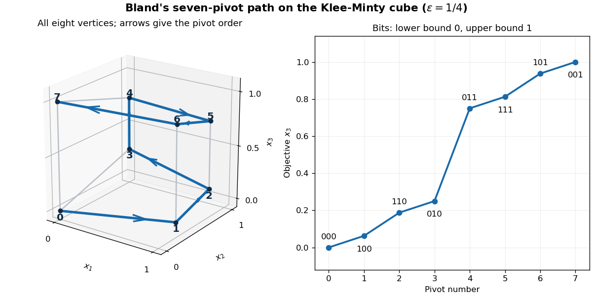

<h1 id="2/solution">Solution</h1>

↑ **Parent:** [2](../2.md)

Encode a [vertex of a polytope](../../../../../vertex-of-a-polytope.md) by three bits: bit $j$ records whether the lower or upper bound of coordinate $j$ is tight. Every choice is possible because $0<\varepsilon<1/2$, and the triangular active equations determine that [vertex of a polytope](../../../../../vertex-of-a-polytope.md) uniquely. Its three adjacent [vertices of a polytope](../../../../../vertex-of-a-polytope.md) are obtained by changing one bit. The geometric [Bland pivoting rule](../../../../../bland-pivoting-rule.md) specified here chooses the smallest-index active [facet](../../../../../facet.md) that can be left while increasing $x_3$. It produces the following path; the final column records the [facet](../../../../../facet.md) left on arrival at the next [vertex of a polytope](../../../../../vertex-of-a-polytope.md):

$$
\begin{array}{c|c|c|c}
\text{step}&\text{bits}&(x_1,x_2,x_3)&\text{next facet left}\\\hline
0&000&(0,0,0)&1\\
1&100&(1,\varepsilon,\varepsilon^2)&3\\
2&110&(1,1-\varepsilon,\varepsilon-\varepsilon^2)&2\\
3&010&(0,1,\varepsilon)&5\\
4&011&(0,1,1-\varepsilon)&1\\
5&111&(1,1-\varepsilon,1-\varepsilon+\varepsilon^2)&4\\
6&101&(1,\varepsilon,1-\varepsilon^2)&2\\
7&001&(0,0,1)&\text{none}
\end{array}
$$

For example, at the origin all three outgoing edges improve the objective, but leaving [facet](../../../../../facet.md) 1 has priority. At bit string $110$, switching bit 2 decreases $x_3$, so the rule switches bit 1, leaving [facet](../../../../../facet.md) 2. At $010$, neither of the earlier-coordinate switches improves $x_3$, so the rule finally leaves [facet](../../../../../facet.md) 5. The upper face reverses the direction in which changes of $x_2$ improve $x_3$, and the remaining three horizontal pivots follow. The objective values in the table are strictly increasing for the stated range of $\varepsilon$.

**[Figure 1](#2/image-seven-bland-pivots-through-all-eight-vertices-of-the-klee-minty-cube-with-epsilon-equal-to-one-quarter). Seven Bland pivots through all eight vertices of the Klee-Minty cube, with epsilon equal to one quarter**.

Thus the [simplex method](../../../../../simplex-method.md) takes **seven pivots although the optimum is directly adjacent to the starting point**. The same [Klee-Minty cube](../../../../../klee-minty-cube.md) in $n$ dimensions has $2n$ inequalities and $2^n$ [vertices of a polytope](../../../../../vertex-of-a-polytope.md). On its lower last-coordinate face, increasing $x_n$ means increasing $x_{n-1}$, and the first $n-1$ coordinates follow the corresponding lower-dimensional path before the last-coordinate [facet](../../../../../facet.md) can be left. On the upper face, increasing $x_n$ means decreasing $x_{n-1}$, and the smallest-index rule traverses that path in reverse. The reverse-path assertion follows by the same induction, interchanging maximization and minimization on each face. Hence the pivot count satisfies $T_n=2T_{n-1}+1$, $T_1=1$, and

$$
\boxed{T_n=2^n-1.}
$$

The usual [Bland pivoting rule](../../../../../bland-pivoting-rule.md) prevents cycling, including degenerate pivots, but this exponential example shows that it does not give a polynomial worst-case pivot bound. For rational fixed $\varepsilon$, the constraints have polynomial encoding length. Arithmetic cost per pivot does not remove the exponential obstruction.

For a lower bound that applies to every pivot choice, use $0\leq x_i\leq1$ and maximize $\sum_{i=1}^nx_i$, starting at the origin. Each edge of this [cube](../../../../../cube.md) changes only one coordinate, whereas the unique optimal [vertex of a polytope](../../../../../vertex-of-a-polytope.md) is $(1,\ldots,1)$. Every coordinate must therefore be changed along at least one edge. **Every route of adjacent pivots takes at least $n$ pivots**, and every strictly improving route takes exactly $n$.

For [Dantzig pivot rule](../../../../../dantzig-pivot-rule.md), the rate is the objective increase per unit entering nonbasic variable, as in standard [reduced cost](../../../../../reduced-cost.md) pricing. Rescale the three coordinates by

$$
y_1=\varepsilon^4x_1,\qquad y_2=\varepsilon^2x_2,\qquad y_3=x_3.
$$

The transformed [linear program](../../../../../linear-programming.md) still maximizes $y_3$, now with bounds

$$
0\leq y_1\leq\varepsilon^4,\qquad
\varepsilon^{-1}y_1\leq y_2\leq\varepsilon^2-\varepsilon^{-1}y_1,\qquad
\varepsilon^{-1}y_2\leq y_3\leq1-\varepsilon^{-1}y_2.
$$

When the active [facet](../../../../../facet.md) for coordinate $i$ is freed, the other active equations give $|dx_3/dx_i|=\varepsilon^{3-i}$. The positive rates per unit $y_i$ are therefore

$$
\varepsilon^{-2},\qquad\varepsilon^{-1},\qquad1,
$$

for $i=1,2,3$, respectively. Equivalently, use the nonnegative lower- and upper-bound [slack variables](../../../../../slack-variable.md) of these displayed, normalized inequalities: freeing coordinate $i$ changes its entering slack by $|dy_i|$. Thus [Dantzig pivot rule](../../../../../dantzig-pivot-rule.md) chooses the lowest coordinate index among improving edges and follows the same seven-pivot path. In $n$ dimensions set $y_i=\varepsilon^{2(n-i)}x_i$; the rates $\varepsilon^{-(n-i)}$ give the same $2^n-1$ pivots. These statements concern coordinate/slack pricing, not objective increase per unit Euclidean edge length, which defines a different pivot rule.

## ↑ Ancestors (10)

1. [2](../2.md)
2. [Paper 38](../../paper-38-split.md)
3. [Iii](../../split.md)
4. [2008](../../../split.md)
5. [Past exam of the mathematics course of the University of Cambridge](../../../../split.md)
6. [Mathematics course of the University of Cambridge](../../../../../mathematics-course-of-the-university-of-cambridge.md)
7. [Course of the University of Cambridge](../../../../../course-of-the-university-of-cambridge.md)
8. [University of Cambridge](../../../../../university-of-cambridge-split.md)
9. [List of universities](../../../../../list-of-universities.md)
10. [Codex Wiki](../../../../../split.md)
