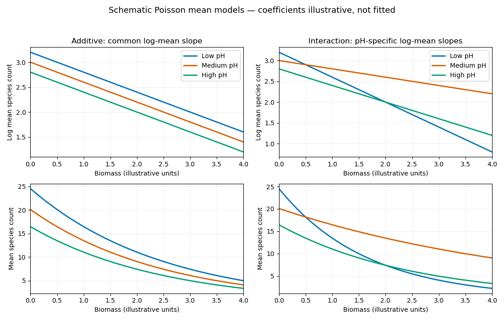

<h1 id="3/solution">Solution</h1>

↑ **Parent:** [3](../3.md)

A [Poisson distribution](../../../../../poisson-distribution.md) has probability mass $e^{-\mu}\mu^y/y!=\exp\{y\theta-e^\theta-\log(y!)\}$, where $\theta=\log\mu$. It is an [exponential family](../../../../../exponential-family-split.md) with $b(\theta)=e^\theta$, mean $\mu$ and [variance](../../../../../variance-split.md) $\mu$. The responses are independent, their linear predictors are $x_i^T\beta$, and the [log link](../../../../../logarithmic-link-function.md) relates these predictors to their means. These are precisely the components of a [generalized linear model](../../../../../generalized-linear-model.md); the [log link](../../../../../logarithmic-link-function.md) is its [canonical link function](../../../../../canonical-link-function.md) and the dispersion is one.

The [log-likelihood](../../../../../log-likelihood.md) and [score function](../../../../../informant-function.md) are

$$
\ell(\beta)=\sum_i\{y_i x_i^T\beta-e^{x_i^T\beta}-\log(y_i!)\},\qquad U(\beta)=\sum_i x_i\{y_i-e^{x_i^T\beta}\}.
$$

Thus a finite [maximum-likelihood estimator](../../../../../maximum-likelihood-estimator.md) satisfies

$$
\boxed{\sum_i x_i(y_i-\widehat\mu_i)=0,\qquad\widehat\mu_i=e^{x_i^T\widehat\beta}.}
$$

The Hessian is $-\sum_i\mu_i x_ix_i^T$; with a full-rank [design matrix](../../../../../design-matrix.md) it is negative definite at finite parameter values, so a finite solution is the unique maximum. A finite maximum need not exist for every possible response/design combination; the displayed equations describe it when it does exist. If the first component of every $x_i$ is one, the first score equation gives **$\sum_i y_i=\sum_i\widehat\mu_i$**.

The saturated model fits each mean as $y_i$, with the limiting mean zero allowed for a zero count. Subtracting the fitted [log-likelihood](../../../../../log-likelihood.md) from the saturated [log-likelihood](../../../../../log-likelihood.md) gives the [Poisson deviance](../../../../../poisson-deviance.md)

$$
\boxed{D=2\sum_i\left[y_i\log\frac{y_i}{\widehat\mu_i}-(y_i-\widehat\mu_i)\right],}
$$

where $0\log(0/\widehat\mu_i)=0$. With an [intercept](../../../../../regression-intercept.md), the sum of the second terms is zero, but retaining them is necessary without that score equation.

Take low pH as a [reference level](../../../../../reference-level-in-a-regression-factor.md). For group $j$, the model with [interaction](../../../../../interaction-statistics.md) has

$$
Y_i\sim\operatorname{Poisson}(\mu_i),\qquad \log\mu_i=\alpha+\gamma_j+(\beta+\delta_j)b_i,\qquad \gamma_{\mathrm{low}}=\delta_{\mathrm{low}}=0,
$$

where $b_i$ is biomass. The additive model sets every $\delta_j$ to zero. The [interaction](../../../../../interaction-statistics.md) model estimates six parameters and the additive model four. In the additive model the log-mean curves are parallel straight lines, while the mean curves are positive exponentials with fixed ratios $e^{\gamma_j-\gamma_k}$. In the [interaction](../../../../../interaction-statistics.md) model the log-mean slopes differ, and the mean ratio is $e^{\gamma_j-\gamma_k+(\delta_j-\delta_k)b}$. The following sketches illustrate [common versus factor-specific slopes in Poisson regression](../../../../../common-versus-factor-specific-slopes-in-poisson-regression.md); their coefficients are illustrative, not estimates from the data.

**[Figure 1](#3/image-illustrative-poisson-mean-curves-with-common-and-ph-specific-biomass-slopes). Illustrative Poisson mean curves with common and pH-specific biomass slopes**.

The additive model is nested in the [interaction](../../../../../interaction-statistics.md) model with two restrictions. The [likelihood-ratio test](../../../../../likelihood-ratio-test.md) therefore uses

$$
D_{\mathrm{add}}-D_{\mathrm{int}}=99.2-83.2=16.0\ \stackrel{H_0}{\approx}\ \chi^2_2,
$$

whose [p-value](../../../../../p-value.md) is $e^{-8}=0.0003355$. **There is strong evidence that the biomass slope on the log-mean scale depends on pH.** The interaction-model residual [deviance](../../../../../exponential-family-deviance.md) $83.2$ is close to its $90-6=84$ residual [degrees of freedom](../../../../../degree-of-freedom.md), giving no obvious indication of [overdispersion](../../../../../overdispersion.md) from this comparison alone. The supplied deviances contain no slope estimates: they do not establish which pH group has more species, whether each slope is positive or negative, or whether any actual curves cross. Those conclusions require the fitted coefficients and their uncertainty.

## ↑ Ancestors (10)

1. [3](../3.md)
2. [Paper 41](../../paper-41-split.md)
3. [Iii](../../split.md)
4. [2008](../../../split.md)
5. [Past exam of the mathematics course of the University of Cambridge](../../../../split.md)
6. [Mathematics course of the University of Cambridge](../../../../../mathematics-course-of-the-university-of-cambridge.md)
7. [Course of the University of Cambridge](../../../../../course-of-the-university-of-cambridge.md)
8. [University of Cambridge](../../../../../university-of-cambridge-split.md)
9. [List of universities](../../../../../list-of-universities.md)
10. [Codex Wiki](../../../../../split.md)
