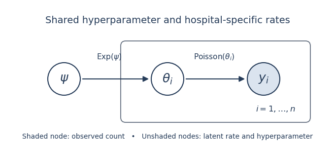

# Paper 44

↑ **Parent:** [Iii](../iii.md)

[https://www.maths.cam.ac.uk/postgrad/part-iii/files/pastpapers/2008/Paper44.pdf](https://www.maths.cam.ac.uk/postgrad/part-iii/files/pastpapers/2008/Paper44.pdf)

**Table of contents**

- [1](#1)
  - [a](#1/a)
    - [Solution](#1/a/solution)
  - [b](#1/b)
    - [Solution](#1/b/solution)
  - [c](#1/c)
    - [Solution](#1/c/solution)
  - [d](#1/d)
    - [Solution](#1/d/solution)
  - [e](#1/e)
    - [Solution](#1/e/solution)
  - [f](#1/f)
    - [Solution](#1/f/solution)
  - [g](#1/g)
    - [Solution](#1/g/solution)
  - [h](#1/h)
    - [Solution](#1/h/solution)
  - [i](#1/i)
    - [Solution](#1/i/solution)
- [2](#2)
  - [a](#2/a)
    - [Solution](#2/a/solution)
  - [b](#2/b)
    - [Solution](#2/b/solution)
  - [c](#2/c)
    - [Solution](#2/c/solution)
  - [d](#2/d)
    - [Solution](#2/d/solution)
  - [e](#2/e)
    - [Solution](#2/e/solution)
  - [f](#2/f)
    - [Solution](#2/f/solution)
  - [g](#2/g)
    - [Solution](#2/g/solution)
  - [h](#2/h)
    - [Solution](#2/h/solution)
  - [i](#2/i)
    - [Solution](#2/i/solution)
- [3](#3)
  - [a](#3/a)
    - [Solution](#3/a/solution)
  - [b](#3/b)
    - [Solution](#3/b/solution)
  - [c](#3/c)
    - [Solution](#3/c/solution)
  - [d](#3/d)
    - [Solution](#3/d/solution)
  - [e](#3/e)
    - [Solution](#3/e/solution)
  - [f](#3/f)
    - [Solution](#3/f/solution)
  - [g](#3/g)
    - [Solution](#3/g/solution)
  - [h](#3/h)
    - [Solution](#3/h/solution)
  - [i](#3/i)
    - [Solution](#3/i/solution)
  - [j](#3/j)
    - [Solution](#3/j/solution)
  - [k](#3/k)
    - [Solution](#3/k/solution)
- [4](#4)
  - [a](#4/a)
    - [Solution](#4/a/solution)
  - [b](#4/b)
    - [Solution](#4/b/solution)
  - [c](#4/c)
    - [Solution](#4/c/solution)
  - [d](#4/d)
    - [Solution](#4/d/solution)
  - [e](#4/e)
    - [Solution](#4/e/solution)
  - [f](#4/f)
    - [Solution](#4/f/solution)
  - [g](#4/g)
    - [Solution](#4/g/solution)
  - [h](#4/h)
    - [Solution](#4/h/solution)
  - [i](#4/i)
    - [Solution](#4/i/solution)

## 1

↑ **Parent:** [Paper 44](paper-44.md)

<h3 id="1/a">a</h3>

↑ **Parent:** [1](#1)

<h4 id="1/a/solution">Solution</h4>

↑ **Parent:** [A](#1/a)

Let the [prior odds](../../../statistical-inference.md#prior-odds) be $\mathbb P(T)/\mathbb P(F)=R$, so $\mathbb P(T)=R/(1+R)$. The [Type I error](../../../information-theory.md#type-i-and-type-ii-errors) gives $\mathbb P(P\mid F)=\alpha$, while the [statistical power](../../../probability-and-statistics.md#statistical-power) gives $\mathbb P(P\mid T)=1-\beta$. By [Bayes' theorem](../../../probability-theory.md#bayes-theorem),

$$
\boxed{\mathbb P(F\mid P)=\frac{\alpha}{\alpha+R(1-\beta)}.}
$$

This is a posterior probability of the null, not the false-positive probability $\alpha$ conditional on the null. The distinction is the [base-rate effect in a positive study](../../../statistical-inference.md#base-rate-effect-in-a-positive-study).

<h3 id="1/b">b</h3>

↑ **Parent:** [1](#1)

<h4 id="1/b/solution">Solution</h4>

↑ **Parent:** [B](#1/b)

The positive result's [posterior odds](../../../statistical-inference.md#posterior-odds) of true to false are

$$
\frac{\mathbb P(T\mid P)}{\mathbb P(F\mid P)}=R\frac{1-\beta}{\alpha}.
$$

Thus being more likely true requires $\boxed{R>\alpha/(1-\beta)}$. The question's weak inequality is necessary; equality gives a tie rather than a strict preference.

<h3 id="1/c">c</h3>

↑ **Parent:** [1](#1)

<h4 id="1/c/solution">Solution</h4>

↑ **Parent:** [C](#1/c)

Under the null, $Y$ has the [standard normal distribution](../../../probability-theory.md#standard-normal-distribution), so the [Type I error](../../../information-theory.md#type-i-and-type-ii-errors) is $\alpha=\mathbb P_0(Y>1.65)=1-\Phi(1.65)\simeq0.05$. Under the alternative, the [Type II error](../../../information-theory.md#type-i-and-type-ii-errors) is $\beta=\mathbb P_1(Y\leq1.65)=\Phi(1.65-2.49)=\Phi(-0.84)\simeq0.20$. Hence $\boxed{\alpha\simeq0.05,\quad\beta\simeq0.20}$, using the supplied rounded normal probabilities.

<h3 id="1/d">d</h3>

↑ **Parent:** [1](#1)

<h4 id="1/d/solution">Solution</h4>

↑ **Parent:** [D](#1/d)

For these two simple hypotheses the [Bayes factor](../../../statistical-inference.md#bayes-factor) is the ratio of their [normal probability densities](../../../probability-theory.md#normal-density):

$$
B_{10}(y)=\frac{\exp[-(y-2.49)^2/2]}{\exp[-y^2/2]}
=\exp\left(2.49y-\frac{2.49^2}{2}\right).
$$

Therefore $\boxed{B_{10}(y)=e^{2.49(y-1.245)}}$, and the [posterior odds](../../../statistical-inference.md#posterior-odds) are $RB_{10}(y)$.

<h3 id="1/e">e</h3>

↑ **Parent:** [1](#1)

<h4 id="1/e/solution">Solution</h4>

↑ **Parent:** [E](#1/e)

**Yes: replacing the observed statistic by a significance label loses information.** The binary positive event has [Bayes factor](../../../statistical-inference.md#bayes-factor) $(1-\beta)/\alpha\simeq16$, but the observed-statistic [Bayes factor](../../../statistical-inference.md#bayes-factor) varies continuously with $y$. A result just at the threshold has $B_{10}(1.65)\simeq2.74$, while $B_{10}(3)\simeq79.0$. Both would receive the same positive label.

The binary calculation is correct for that deliberately coarsened observation; its problem is treating it as the whole evidence when the statistic is available. This is the point developed in [Goodman and Greenland's response](https://journals.plos.org/plosmedicine/article?id=10.1371/journal.pmed.0040168).

<h3 id="1/f">f</h3>

↑ **Parent:** [1](#1)

<h4 id="1/f/solution">Solution</h4>

↑ **Parent:** [F](#1/f)

Conditional on a false relationship, the independent studies are each negative with probability $1-\alpha$. The complement of at least one positive is that all are negative. Hence the [familywise error rate](../../../statistical-modelling.md#familywise-error-rate) is $\boxed{1-(1-\alpha)^n}$.

<h3 id="1/g">g</h3>

↑ **Parent:** [1](#1)

<h4 id="1/g/solution">Solution</h4>

↑ **Parent:** [G](#1/g)

Let $A_n$ denote the event that at least one study is positive. [Conditional independence](../../../random-variable.md#conditional-independence) gives $\mathbb P(A_n\mid T)=1-\beta^n$ and $\mathbb P(A_n\mid F)=1-(1-\alpha)^n$. Updating the [prior odds](../../../statistical-inference.md#prior-odds) by this event's [Bayes factor](../../../statistical-inference.md#bayes-factor) gives

$$
\boxed{\frac{\mathbb P(T\mid A_n)}{\mathbb P(F\mid A_n)}
=R\frac{1-\beta^n}{1-(1-\alpha)^n}.}
$$

These are the [odds under at-least-one-positive selection](../../../statistical-inference.md#odds-under-at-least-one-positive-selection), not the odds using every study's actual result.

<h3 id="1/h">h</h3>

↑ **Parent:** [1](#1)

<h4 id="1/h/solution">Solution</h4>

↑ **Parent:** [H](#1/h)

For $0<\alpha,\beta<1$, both event probabilities tend to one, so the [posterior odds](../../../statistical-inference.md#posterior-odds) tend to $\boxed{R}$. If $1-\beta>\alpha$, the event's [Bayes factor](../../../statistical-inference.md#bayes-factor) decreases toward one. To see monotonicity, put $a=1-\alpha>\beta$ and write

$$
\frac{1-\beta^n}{1-a^n}=\frac{1-\beta}{1-a}\frac{\sum_{k=0}^{n-1}\beta^k}{\sum_{k=0}^{n-1}a^k}.
$$

The last quotient is a weighted average of the decreasing values $(\beta/a)^k$, with weights $a^k$. Adding the next, smaller value decreases the average.

Thus the selection rule becomes less informative as more teams try: eventually a positive study is almost certain even under the null. This explains the hotter-field interpretation in [Ioannidis's model](https://journals.plos.org/plosmedicine/article?id=10.1371/journal.pmed.0020124). It describes evidence retained by this particular selection event, rather than proving that every individual study becomes less reliable or that the full accumulated evidence gets weaker.

<h3 id="1/i">i</h3>

↑ **Parent:** [1](#1)

<h4 id="1/i/solution">Solution</h4>

↑ **Parent:** [I](#1/i)

**Consistent independent replications should strengthen confidence; contradictory results can weaken it.** The change depends on the actual evidence. If $k$ of $n$ studies are positive and all labels are available, the [posterior odds](../../../statistical-inference.md#posterior-odds) are

$$
R\left(\frac{1-\beta}{\alpha}\right)^k\left(\frac{\beta}{1-\alpha}\right)^{n-k}.
$$

For the normal model, retaining the full independent statistics instead gives

$$
\boxed{\text{posterior odds}=R\exp\left(2.49\sum_{j=1}^n y_j-n\frac{2.49^2}{2}\right).}
$$

Each study multiplies the existing odds by its own [Bayes factor](../../../statistical-inference.md#bayes-factor). Reading a complete synthesis is therefore different from learning only that somebody obtained a positive result. [Publication bias](../../../statistical-inference.md#publication-bias), dependence between studies and changes in study design must be accounted for before applying the independent-product formula.

## 2

↑ **Parent:** [Paper 44](paper-44.md)

<h3 id="2/a">a</h3>

↑ **Parent:** [2](#2)

<h4 id="2/a/solution">Solution</h4>

↑ **Parent:** [A](#2/a)

The [Bayesian network](../../../statistical-model.md#bayesian-network) has a shared parent $\psi$ and, for each hospital, the chain $\psi\to\theta_i\to y_i$. A plate encloses the hospital-specific pair. Observed counts are shaded; the local rates are [latent variables](../../../statistical-modelling.md#latent-variable). Conditional on $\psi$, the pairs are independent.

<a id="2/a/image-directed-graph-of-a-poisson-exponential-hierarchical-model"></a>


**[Figure 1](#2/a/image-directed-graph-of-a-poisson-exponential-hierarchical-model). Directed graph of a Poisson–exponential hierarchical model**.

<h3 id="2/b">b</h3>

↑ **Parent:** [2](#2)

<h4 id="2/b/solution">Solution</h4>

↑ **Parent:** [B](#2/b)

The joint density factors as $p(\psi)\prod_jp(\theta_j\mid\psi)p(y_j\mid\theta_j)$. In the [full conditional distribution](../../../probability-theory.md#full-conditional-distribution) of $\theta_i$, all factors not involving $\theta_i$ cancel. The remaining [likelihood function](../../../statistical-modelling.md#likelihood-function) and [exponential distribution](../../../continuous-probability-distribution.md#exponential-distribution) prior give

$$
p(\theta_i\mid\theta_{-i},\psi,y)\propto\theta_i^{y_i}e^{-\theta_i}e^{-\psi\theta_i}
=\theta_i^{y_i}e^{-(1+\psi)\theta_i}.
$$

In shape–rate convention this is $\boxed{\theta_i\mid\psi,y\sim\operatorname{Gamma}(y_i+1,\,1+\psi)}$, a special case of the [Gamma–Poisson hierarchical model](../../../statistical-inference.md#gamma-poisson-hierarchical-model). It depends only on the node's observed child $y_i$ and parent $\psi$, as required for its [Gibbs sampler](../../../statistical-inference.md#gibbs-sampler) update.

<h3 id="2/c">c</h3>

↑ **Parent:** [2](#2)

<h4 id="2/c/solution">Solution</h4>

↑ **Parent:** [C](#2/c)

Integrate the [latent variable](../../../statistical-modelling.md#latent-variable) out to obtain the hospital's [marginal likelihood](../../../statistical-inference.md#bayesian-model-evidence):

$$
p(y_i\mid\psi)=\frac{\psi}{y_i!}\int_0^\infty\theta^{y_i}e^{-(1+\psi)\theta}d\theta
=\frac{\psi}{(1+\psi)^{y_i+1}}.
$$

For $\phi=(1+\psi)^{-1}$ this becomes $\boxed{p(y_i\mid\phi)=(1-\phi)\phi^{y_i}}$. It is a [geometric distribution](../../../discrete-probability-distribution.md#geometric-distribution) on the nonnegative integers, with success probability $1-\phi$. The transformation concerns the likelihood, so no Jacobian is inserted here.

<h3 id="2/d">d</h3>

↑ **Parent:** [2](#2)

<h4 id="2/d/solution">Solution</h4>

↑ **Parent:** [D](#2/d)

Put $s=\sum_i y_i$. The independent-count [likelihood function](../../../statistical-modelling.md#likelihood-function) is proportional to $(1-\phi)^n\phi^s$. Its [conjugate prior](../../../exponential-family.md#conjugate-prior) is $\boxed{\phi\sim\operatorname{Beta}(a,b),\quad a,b>0}$, giving the [posterior distribution](../../../statistical-inference.md#bayesian-posterior) $\operatorname{Beta}(a+s,b+n)$.

<h3 id="2/e">e</h3>

↑ **Parent:** [2](#2)

<h4 id="2/e/solution">Solution</h4>

↑ **Parent:** [E](#2/e)

A flat density in $\log\psi$ induces $p(\psi)\propto1/\psi$. Since $\psi=(1-\phi)/\phi$, the absolute [Jacobian determinant](../../../calculus.md#jacobian-determinant) is $|d\psi/d\phi|=\phi^{-2}$. Therefore

$$
\boxed{p(\phi)\propto\frac{1}{\phi(1-\phi)},\qquad0<\phi<1.}
$$

This is the [Haldane prior](../../../statistical-inference.md#haldane-prior), an [improper prior](../../../statistical-inference.md#improper-prior) with formal beta parameters $(0,0)$.

<h3 id="2/f">f</h3>

↑ **Parent:** [2](#2)

<h4 id="2/f/solution">Solution</h4>

↑ **Parent:** [F](#2/f)

Multiplying the likelihood in part (d) by the [Haldane prior](../../../statistical-inference.md#haldane-prior) gives $p(\phi\mid y)\propto\phi^{s-1}(1-\phi)^{n-1}$. Consequently

$$
\boxed{\phi\mid y\sim\operatorname{Beta}(s,n),\qquad s=\sum_i y_i>0.}
$$

For at least one hospital, $n>0$, this posterior is proper exactly when $s>0$. If every count is zero, the kernel diverges at $\phi=0$ and does not define a [posterior distribution](../../../statistical-inference.md#bayesian-posterior); the [improper prior](../../../statistical-inference.md#improper-prior) cannot then be used for the subsequent expectation.

<h3 id="2/g">g</h3>

↑ **Parent:** [2](#2)

<h4 id="2/g/solution">Solution</h4>

↑ **Parent:** [G](#2/g)

The gamma [full conditional distribution](../../../probability-theory.md#full-conditional-distribution) has mean $(y_i+1)/(1+\psi)=(y_i+1)\phi$. The [tower property](../../../measure-theory.md#law-of-total-expectation) and the [Beta distribution](../../../probability-theory.md#beta-distribution) mean give

$$
\mathbb E[\theta_i\mid y]=(y_i+1)\frac{s}{s+n}.
$$

Writing $\overline y=s/n$ and $w=s/(s+n)=\overline y/(1+\overline y)$ yields

$$
\boxed{\mathbb E[\theta_i\mid y]=w y_i+(1-w)\overline y.}
$$

Thus [partial pooling](../../../statistical-inference.md#partial-pooling) pulls every local mean toward the overall sample mean. The common weight arises from the fixed shape-one mixing distribution; it is the [Poisson–exponential posterior shrinkage formula](../../../statistical-inference.md#poisson-exponential-posterior-shrinkage-formula).

<h3 id="2/h">h</h3>

↑ **Parent:** [2](#2)

<h4 id="2/h/solution">Solution</h4>

↑ **Parent:** [H](#2/h)

The model treats hospitals as [exchangeable](../../../probability-theory.md#exchangeable-random-variables) and assumes the same exponential mixing law for their total expected annual counts. Its shape is fixed: the prior standard deviation equals its mean. Real hospitals differ in size, patient mix, ascertainment and observation effort, so expected counts should not generally share one distribution without accounting for these predictors. Common regional conditions can also invalidate their assumed [conditional independence](../../../random-variable.md#conditional-independence). The resulting [geometric distribution](../../../discrete-probability-distribution.md#geometric-distribution) for observed counts is a restrictive distributional prediction that can be checked.

<h3 id="2/i">i</h3>

↑ **Parent:** [2](#2)

<h4 id="2/i/solution">Solution</h4>

↑ **Parent:** [I](#2/i)

Model the count relative to exposure, for example

$$
y_i\mid b_i\sim\operatorname{Poisson}(E_i e^{x_i^T\beta+b_i}),\qquad b_i\mid\tau\sim N(0,\tau^2).
$$

Here $E_i$ is a measured exposure such as patient-days, $x_i$ contains hospital predictors, and $b_i$ is a [random effect](../../../statistical-modelling.md#random-effect). This [Poisson regression](../../../statistical-modelling.md#poisson-regression) separates hospital size from rate variation and supplies [partial pooling](../../../statistical-inference.md#partial-pooling). Use proper, scale-appropriate priors on coefficients and variation; add regional or temporal effects if the data demand them. A gamma mixing law with an estimated shape is another way to allow more flexible [overdispersion](../../../exponential-family.md#overdispersion). Compare the fitted model's counts and dispersion through [posterior predictive checks](../../../statistical-inference.md#posterior-predictive-check).

## 3

↑ **Parent:** [Paper 44](paper-44.md)

<h3 id="3/a">a</h3>

↑ **Parent:** [3](#3)

<h4 id="3/a/solution">Solution</h4>

↑ **Parent:** [A](#3/a)

Write the new measurement as $Y_{i1}=\theta_i+\varepsilon_{i1}$, with independent $\theta_i\sim N(\mu,\tau^2)$ and $\varepsilon_{i1}\sim N(0,\sigma_i^2)$. Adding independent [normal distributions](../../../probability-theory.md#normal-distribution) gives the [prior predictive distribution](../../../statistical-inference.md#bayesian-model-evidence)

$$
\boxed{Y_{i1}\sim N(\mu,\tau^2+\sigma_i^2).}
$$

<h3 id="3/b">b</h3>

↑ **Parent:** [3](#3)

<h4 id="3/b/solution">Solution</h4>

↑ **Parent:** [B](#3/b)

Let $z_{0.999}=\Phi^{-1}(0.999)$ be the [standard normal distribution](../../../probability-theory.md#standard-normal-distribution) quantile. Standardizing the prediction in part (a) gives

$$
\boxed{u_{i1}=\mu+z_{0.999}\sqrt{\tau^2+\sigma_i^2}.}
$$

This is a one-sided predictive limit; its upper-tail probability is $0.001$ under the specified model.

<h3 id="3/c">c</h3>

↑ **Parent:** [3](#3)

<h4 id="3/c/solution">Solution</h4>

↑ **Parent:** [C](#3/c)

By [normal-normal conjugacy](../../../probability-and-statistics.md#normal-normal-conjugacy-with-known-observation-variance), the [posterior distribution](../../../statistical-inference.md#bayesian-posterior) is

$$
\boxed{\theta_i\mid y_{i1}\sim N(m_{i1},v_{i1}),\qquad
v_{i1}=\left(\tau^{-2}+\sigma_i^{-2}\right)^{-1},\qquad
m_{i1}=v_{i1}\left(\frac\mu{\tau^2}+\frac{y_{i1}}{\sigma_i^2}\right).}
$$

The [posterior mean](../../../statistical-inference.md#posterior-mean) is a precision-weighted average of the population mean and the observed personal measurement.

<h3 id="3/d">d</h3>

↑ **Parent:** [3](#3)

<h4 id="3/d/solution">Solution</h4>

↑ **Parent:** [D](#3/d)

Integrate the next independent measurement error over the [posterior distribution](../../../statistical-inference.md#bayesian-posterior) of $\theta_i$. The [posterior predictive distribution](../../../statistical-inference.md#posterior-predictive-distribution) is

$$
\boxed{Y_{i2}\mid y_{i1}\sim N(m_{i1},v_{i1}+\sigma_i^2).}
$$

Both uncertainty about the personal mean and variation in a new measurement contribute.

<h3 id="3/e">e</h3>

↑ **Parent:** [3](#3)

<h4 id="3/e/solution">Solution</h4>

↑ **Parent:** [E](#3/e)

Taking the upper $0.999$ [quantile](../../../probability-theory.md#quantile-function) of the [posterior predictive distribution](../../../statistical-inference.md#posterior-predictive-distribution) gives

$$
\boxed{u_{i2}=m_{i1}+\Phi^{-1}(0.999)\sqrt{v_{i1}+\sigma_i^2}.}
$$

The same predictive false-alarm probability is retained after updating with the first measurement.

<h3 id="3/f">f</h3>

↑ **Parent:** [3](#3)

<h4 id="3/f/solution">Solution</h4>

↑ **Parent:** [F](#3/f)

After $k$ measurements the [normal-normal conjugacy](../../../probability-and-statistics.md#normal-normal-conjugacy-with-known-observation-variance) formulas are

$$
v_{ik}=(\tau^{-2}+k\sigma_i^{-2})^{-1},\qquad
m_{ik}=v_{ik}\left(\mu\tau^{-2}+\sigma_i^{-2}\sum_{j=1}^k y_{ij}\right).
$$

The upper monitoring limit is $m_{ik}+z_{0.999}\sqrt{v_{ik}+\sigma_i^2}$. Its center moves toward the athlete's own mean and the population's influence diminishes. Its predictive width decreases toward $z_{0.999}\sigma_i$, since uncertainty about the mean vanishes but the next measurement's error remains. The absolute upper limit need not decrease monotonically: its center can move upward or downward with the observations. This is [sequential normal predictive monitoring](../../../probability-and-statistics.md#sequential-normal-predictive-monitoring).

<h3 id="3/g">g</h3>

↑ **Parent:** [3](#3)

<h4 id="3/g/solution">Solution</h4>

↑ **Parent:** [G](#3/g)

The [hierarchical Bayesian model](../../../statistical-inference.md#hierarchical-bayesian-model) separates variability between individuals from variability between repeated measurements on an individual. In [WinBUGS](../../../statistical-inference.md#winbugs), `dnorm` takes a [precision parameter](../../../statistical-modelling.md#precision-parameter), so inverse variance is the appropriate second argument.

Line (1) gives $\log\sigma_j^2\sim N(\phi,\psi^2)$, hence a positive [log-normal distribution](../../../probability-theory.md#log-normal-distribution) for each within-individual variance. Estimating the shared parameters supplies [partial pooling](../../../statistical-inference.md#partial-pooling) of these variances without forcing them equal. Line (2) assigns a proper bounded flat prior to the between-individual standard deviation $\tau$, and line (3) does the same for the standard deviation $\psi$ on the log-variance scale. The broad bounded priors on $\mu$ and $\phi$ are also proper.

This is a reasonable structure for heterogeneous repeated measurements, but flat does not mean uninformative on all transformed scales. The bounds must be wide enough for plausible values, while such enormous ranges can put substantial mass on implausible predictions. Use [prior predictive checks](../../../statistical-inference.md#prior-predictive-check) and sensitivity analysis, and check the [Markov chain Monte Carlo convergence diagnostics](../../../statistical-inference.md#markov-chain-monte-carlo-convergence-diagnostics). Serial dependence or systematic trends would require an extension of the independent-measurement likelihood.

<h3 id="3/h">h</h3>

↑ **Parent:** [3](#3)

<h4 id="3/h/solution">Solution</h4>

↑ **Parent:** [H](#3/h)

Add the new individual's latent mean and log variance to the same population hierarchy. Enter only that individual's first two measurements as observations; use the historical data and these two values to fit the model. The third measurement must be held out, or the predictive check reuses the value it is meant to test. For example, augment the unchanged population hyperpriors with this [WinBUGS](../../../statistical-inference.md#winbugs) structure:

```
new.mean ~ dnorm(mu, invtau2)
new.logvar ~ dnorm(phi, invpsi2)
new.precision <- exp(-new.logvar)
for (k in 1:2) {
    new.Y[k] ~ dnorm(new.mean, new.precision)
}
future.Y ~ dnorm(new.mean, new.precision)
upper.indicator <- step(future.Y - held.out.third)
```

`future.Y` is unobserved. Its simulated values give the [posterior predictive distribution](../../../statistical-inference.md#posterior-predictive-distribution), including uncertainty in the population parameters and personal variance. A central 99.9% [prediction interval](../../../statistical-inference.md#prediction-interval) uses its $0.0005$ and $0.9995$ empirical quantiles. **Flag the third value if it is outside that interval.** Equivalently, estimate its predictive tail probability by the mean of `upper.indicator` and flag if that mean is below $0.0005$ or above $0.9995$. This is two-sided, unlike the earlier one-sided upper limit.

<h3 id="3/i">i</h3>

↑ **Parent:** [3](#3)

<h4 id="3/i/solution">Solution</h4>

↑ **Parent:** [I](#3/i)

Conditionally on $\lambda_i$, the proposed precision gives $\theta_i\mid\lambda_i\sim N(\mu,4\tau^2/\lambda_i)$. Thus, with independent $Z\sim N(0,1)$ and $\lambda_i\sim\chi_4^2$,

$$
\frac{\theta_i-\mu}{\tau}=\frac{Z}{\sqrt{\lambda_i/4}}.
$$

By the [Student t-distribution](../../../continuous-probability-distribution.md#student-s-t-distribution) construction, $\boxed{(\theta_i-\mu)/\tau\sim t_4}$. Here $\tau$ is a scale rather than the standard deviation: the prior variance of $\theta_i$ is $2\tau^2$.

<h3 id="3/j">j</h3>

↑ **Parent:** [3](#3)

<h4 id="3/j/solution">Solution</h4>

↑ **Parent:** [J](#3/j)

The [Student t-distribution](../../../continuous-probability-distribution.md#student-s-t-distribution) has heavier tails than the [normal distribution](../../../probability-theory.md#normal-distribution), so unusual personal means need not force the entire population's spread upward or be shrunk as strongly toward its center. The latent $\lambda_i$ allows a large local prior variance for an outlying individual. This [normal scale mixture representation of Student t](../../../continuous-probability-distribution.md#normal-scale-mixture-representation-of-student-t) is a useful robust version of the [hierarchical Bayesian model](../../../statistical-inference.md#hierarchical-bayesian-model). It still assumes a symmetric, unimodal population; a genuinely multimodal population may need a different model.

<h3 id="3/k">k</h3>

↑ **Parent:** [3](#3)

<h4 id="3/k/solution">Solution</h4>

↑ **Parent:** [K](#3/k)

Fit both hierarchies to the historical data and compare their [posterior predictive checks](../../../statistical-inference.md#posterior-predictive-check). Use discrepancies sensitive to between-individual tails, such as the maximum standardized personal mean, tail counts and the spread of individual sample means. Simulate new individual means as well as repeated observations; conditioning only on fitted personal means would conceal a poor population model.

Leave whole individuals out for [cross-validation](../../../statistical-learning.md#cross-validation), rather than just measurements, when the aim is prediction for a new individual. Compare held-out predictive log densities or interval calibration, with uncertainty in the comparison. Check both fits' [Markov chain Monte Carlo convergence diagnostics](../../../statistical-inference.md#markov-chain-monte-carlo-convergence-diagnostics) and sensitivity to scale priors. Better tail prediction and adequate calibration would support the heavier-tailed model; the data are required to decide, so no empirical winner can be asserted here.

## 4

↑ **Parent:** [Paper 44](paper-44.md)

<h3 id="4/a">a</h3>

↑ **Parent:** [4](#4)

<h4 id="4/a/solution">Solution</h4>

↑ **Parent:** [A](#4/a)

The transformation $t=(x-\overline x)/s_x$ centers day at zero and measures it in standard-deviation units. It reduces numerical scale differences and makes the intercept-like parameter refer to the middle of the observed time range. In [nonlinear regression](../../../statistical-modelling.md#nonlinear-regression) this can reduce posterior parameter dependence and improve [Markov chain Monte Carlo](../../../statistical-inference.md#markov-chain-monte-carlo) mixing. It also makes priors on the growth coefficient easier to interpret; it does not change the curve family.

<h3 id="4/b">b</h3>

↑ **Parent:** [4](#4)

<h4 id="4/b/solution">Solution</h4>

↑ **Parent:** [B](#4/b)

Write $A_i=\phi_{i1}$, $b_i=\phi_{i2}>0$ and $k_i=-\phi_{i3}=\theta_{i3}$. Then

$$
m_i(t)=\frac{A_i}{1+b_ie^{-k_it}}.
$$

For $k_i>0$, $A_i$ is the limiting circumference and $1/(1+b_i)$ is the fraction of that asymptote attained at the centered day $x=\overline x$. Under the code's transformations,

$$
\boxed{A_i=e^{\theta_{i1}},\qquad\frac{m_i(0)}{A_i}=\frac1{1+e^{-\theta_{i2}}}.}
$$

The latter expression is the [logistic function](../../../statistical-learning.md#logistic-function). The curve also satisfies the [logistic growth equation](../../../mathematical-biology.md#logistic-growth-equation) $dm_i/dx=(k_i/s_x)m_i(1-m_i/A_i)$. Its inflection point is at half the asymptote. The original prior permits $k_i\leq0$, in which case it does not describe increasing growth.

<h3 id="4/c">c</h3>

↑ **Parent:** [4](#4)

<h4 id="4/c/solution">Solution</h4>

↑ **Parent:** [C](#4/c)

The priors are proper but difficult to justify as practically weak information. Uniform bounds $[-100,100]$ on log asymptotes cover fantastically small and large circumferences. The independent prior on the transformed location makes the centered fraction spend much of its mass near zero or one, while the slope prior permits decreasing growth. Independence also ignores likely relationships among curve parameters.

The $\operatorname{Gamma}(0.001,0.001)$ prior on error precision is proper, but its near-zero shape creates a highly skewed prior with consequential mass near very small precision. It is not automatically harmless. Use biologically scaled priors for asymptotes and timing, a positive growth-rate prior, and a defensible prior on the error standard deviation such as a suitably scaled [half-normal distribution](../../../probability-theory.md#half-normal-distribution). Check simulated trajectories with [prior predictive checks](../../../statistical-inference.md#prior-predictive-check) and assess prior sensitivity.

<h3 id="4/d">d</h3>

↑ **Parent:** [4](#4)

<h4 id="4/d/solution">Solution</h4>

↑ **Parent:** [D](#4/d)

Model B replaces independent tree parameters by [multivariate normal](../../../probability-and-statistics.md#multivariate-normal-distribution) [random effects](../../../statistical-modelling.md#random-effect). It permits correlated asymptote, timing and slope variation and supplies [partial pooling](../../../statistical-inference.md#partial-pooling), a useful improvement if the five trees can be regarded as [exchangeable](../../../probability-theory.md#exchangeable-random-variables).

The [Wishart distribution](../../../probability-theory.md#wishart-distribution) prior is on the [precision matrix](../../../variance.md#precision-matrix) $\Omega$, not the covariance matrix. In the [WinBUGS](../../../statistical-inference.md#winbugs) convention, dimension three and degrees of freedom three give a proper but very dispersed prior. The induced [inverse-Wishart distribution](../../../probability-theory.md#inverse-wishart-distribution) has no finite mean at those degrees of freedom. Thus this is not a neutral choice of covariance prior, and estimating six covariance components from only five trees is weakly informed. The broad mean priors and possible negative growth slopes also remain. Check prior-predictive curves and sensitivity, and consider separate, interpretable scale and correlation priors.

The resulting posterior means of the second and third parameters are quite similar across trees, motivating a simpler shared-shape model; their uncertainty means this similarity is evidence to explore, rather than a proof of exact equality.

<h3 id="4/e">e</h3>

↑ **Parent:** [4](#4)

<h4 id="4/e/solution">Solution</h4>

↑ **Parent:** [E](#4/e)

A common second parameter means the trees reach the same fraction of their asymptotic sizes at the centered day; a common third parameter means they have the same standardized growth rate. **The trees may differ mainly in final size while sharing a growth shape.** Similar environment and the overlapping posterior estimates make this biologically plausible. Equality is a stronger modelling assumption than [partial pooling](../../../statistical-inference.md#partial-pooling), and should be checked predictively.

<h3 id="4/f">f</h3>

↑ **Parent:** [4](#4)

<h4 id="4/f/solution">Solution</h4>

↑ **Parent:** [F](#4/f)

Keep a tree-specific log asymptote $a_i$ with a normal population distribution, but use one shared location $b$ and one shared positive growth coefficient $k$. For example, with fixed prior constants chosen on meaningful scales:

```
mean.a ~ dnorm(m.a, precision.a.prior)
sd.a ~ dnorm(0, precision.sd.a) T(0,)
precision.a <- 1 / pow(sd.a, 2)
b ~ dnorm(m.b, precision.b.prior)
k ~ dnorm(m.k, precision.k.prior) T(0,)
sigma ~ dnorm(0, precision.sigma.prior) T(0,)
precision.y <- 1 / pow(sigma, 2)
for (i in 1:5) {
    a[i] ~ dnorm(mean.a, precision.a)
    for (j in 1:7) {
        fitted[i,j] <- exp(a[i]) / (1 + exp(-b - k*t[j]))
        Y[i,j] ~ dnorm(fitted[i,j], precision.y)
    }
}
```

Here the transformed days `t[j]` are supplied as data. This is Model C: only the log asymptote is a [random effect](../../../statistical-modelling.md#random-effect), while location and growth rate are shared. The prior constants are fixed inputs, and the truncations give positive standard deviations and an increasing growth curve. One can retain the original error-precision prior for a comparison matching the supplied fits; the code above illustrates a more interpretable positive-scale alternative.

<h3 id="4/g">g</h3>

↑ **Parent:** [4](#4)

<h4 id="4/g/solution">Solution</h4>

↑ **Parent:** [G](#4/g)

Smaller mean [Bayesian deviance](../../../statistical-modelling.md#bayesian-deviance) indicates better average likelihood fit. Model B has the smallest $\overline D$, improving on A by $3.9$ and on C by $3.1$. Model C has the smallest [effective parameter count in DIC](../../../statistical-modelling.md#effective-parameter-count-in-dic), reflecting its shared timing and growth coefficients. Model B's hierarchical covariance parameters and residual flexibility contribute to a larger effective count than C.

Adding fit and complexity gives the reported [deviance information criterion](../../../statistical-modelling.md#deviance-information-criterion): A has $260.1$, B $258.1$, and C $255.6$. Thus **DIC favors Model C**, whose simpler shape more than compensates for its slightly worse mean fit than B. The differences are modest, and the criteria must use the same observation likelihood and deviance convention. These numbers are not posterior model probabilities; predictive assessment remains useful.

<h3 id="4/h">h</h3>

↑ **Parent:** [4](#4)

<h4 id="4/h/solution">Solution</h4>

↑ **Parent:** [H](#4/h)

Model A has fifteen separate curve parameters plus one error-scale parameter. With such broad priors, one might have expected more of those sixteen parameters to be effectively estimated, rather than $p_D=12$, and might also have expected its greater unpooled flexibility to give better fit than the displayed $\overline D=248.1$. Model B instead has a smaller mean deviance despite sharing information between trees.

This is a diagnostic concern, not a mathematical impossibility. [Effective parameter count in DIC](../../../statistical-modelling.md#effective-parameter-count-in-dic) depends on posterior curvature and parameterization, while mean posterior deviance is not minimized deviance. A weakly identified nonlinear asymptote–slope trade-off, skewness, multiple posterior regions or slow [Markov chain Monte Carlo](../../../statistical-inference.md#markov-chain-monte-carlo) mixing could explain the unexpected comparison. For A, the implied deviance at the posterior mean is $\overline D-p_D=236.1$; for B it is $230.3$. Inspect traces, effective sample sizes, independent chains and fitted curves, and extend sampling where needed. Fifty thousand iterations alone do not establish convergence.

<h3 id="4/i">i</h3>

↑ **Parent:** [4](#4)

<h4 id="4/i/solution">Solution</h4>

↑ **Parent:** [I](#4/i)

Assess the observation-error assumption with standardized residual plots and [quantile-quantile plots](../../../probability-and-statistics.md#q-q-plot), preferably comparing the same discrepancies with [posterior predictive](../../../statistical-inference.md#posterior-predictive-distribution) replicated data. Inspect tail behavior, asymmetry, variance versus fitted size and serial patterns within a tree; fitted residuals are dependent and do not behave exactly like independent errors.

**This does not test normality of the tree random effects.** For that, simulate new tree-specific log asymptotes from the population hierarchy and compare between-tree discrepancies or use leave-one-tree-out predictions. There are only five trees, so distributional checks on their population are intrinsically weak. Conditioning on the five fitted effects can hide misspecification of their normal population law.

## ↑ Ancestors (8)

1. [Iii](../iii.md)
2. [2008](../../2008.md)
3. [Past exam of the mathematics course of the University of Cambridge](../../../past-exam-of-the-mathematics-course-of-the-university-of-cambridge.md)
4. [Mathematics course of the University of Cambridge](../../../university-of-cambridge.md#mathematics-course-of-the-university-of-cambridge)
5. [Course of the University of Cambridge](../../../university-of-cambridge.md#course-of-the-university-of-cambridge)
6. [University of Cambridge](../../../university-of-cambridge.md)
7. [List of universities](../../../README.md#list-of-universities)
8. [Codex Wiki](../../../README.md)
