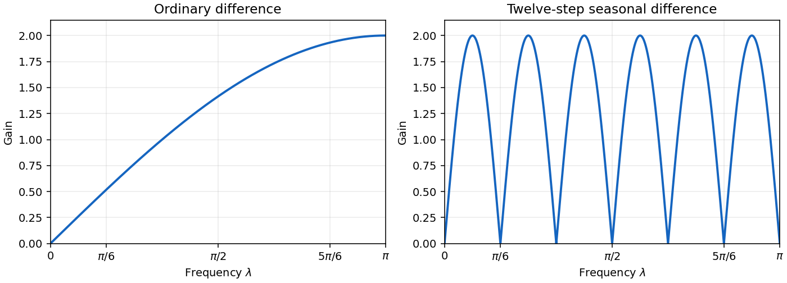

# Paper 47

↑ **Parent:** [Iii](../iii.md)

[https://www.maths.cam.ac.uk/postgrad/part-iii/files/pastpapers/2008/Paper47.pdf](https://www.maths.cam.ac.uk/postgrad/part-iii/files/pastpapers/2008/Paper47.pdf)

**Table of contents**

- [1](#1)
  - [Solution](#1/solution)
- [2](#2)
  - [Solution](#2/solution)
  - [a](#2/a)
    - [Solution](#2/a/solution)
  - [b](#2/b)
    - [Solution](#2/b/solution)
  - [c](#2/c)
    - [Solution](#2/c/solution)
- [3](#3)
  - [a](#3/a)
    - [Solution](#3/a/solution)
  - [b](#3/b)
    - [i](#3/b/i)
      - [Solution](#3/b/i/solution)
    - [ii](#3/b/ii)
      - [Solution](#3/b/ii/solution)
    - [iii](#3/b/iii)
      - [Solution](#3/b/iii/solution)
- [4](#4)
  - [a](#4/a)
    - [Solution](#4/a/solution)
  - [b](#4/b)
    - [Solution](#4/b/solution)
  - [c](#4/c)
    - [Solution](#4/c/solution)
  - [d](#4/d)
    - [Solution](#4/d/solution)
- [5](#5)
  - [a](#5/a)
    - [i](#5/a/i)
      - [Solution](#5/a/i/solution)
    - [ii](#5/a/ii)
      - [Solution](#5/a/ii/solution)
    - [iii](#5/a/iii)
      - [Solution](#5/a/iii/solution)
  - [b](#5/b)
    - [i](#5/b/i)
      - [Solution](#5/b/i/solution)
    - [ii](#5/b/ii)
      - [Solution](#5/b/ii/solution)
    - [iii](#5/b/iii)
      - [Solution](#5/b/iii/solution)
- [6](#6)
  - [a](#6/a)
    - [Solution](#6/a/solution)
  - [b](#6/b)
    - [i](#6/b/i)
      - [Solution](#6/b/i/solution)
    - [ii](#6/b/ii)
      - [Solution](#6/b/ii/solution)
    - [iii](#6/b/iii)
      - [Solution](#6/b/iii/solution)
    - [iv](#6/b/iv)
      - [Solution](#6/b/iv/solution)

## 1

↑ **Parent:** [Paper 47](paper-47.md)

<h3 id="1/solution">Solution</h3>

↑ **Parent:** [1](#1)

A [weakly stationary process](../../../time-series.md#weakly-stationary-process) has finite second moments, a [mean](../../../probability-theory.md#expected-value) $m=E X_t$ independent of $t$, and a [covariance](../../../variance.md#covariance) depending only on the separation of the observations. Its [autocovariance function](../../../time-series.md#autocovariance) and [autocorrelation function](../../../time-series.md#autocorrelation) are

$$
\gamma(h)=E[(X_{t+h}-m)(X_t-m)],\qquad \rho(h)=\gamma(h)/\gamma(0),
$$

where the [autocorrelation](../../../time-series.md#autocorrelation) requires $\gamma(0)>0$.

Write the [autoregressive polynomial](../../../time-series.md#autoregressive-polynomial) as $A(z)=1-\alpha z+\alpha z^2$, so the [autoregressive model](../../../time-series.md#autoregressive-model) is $A(B)X_t=\epsilon_t$, with $B$ the [backshift operator](../../../time-series.md#backshift-operator). It is important to distinguish a [weakly stationary process](../../../time-series.md#weakly-stationary-process) from a [causal time series](../../../time-series.md#causal-time-series): [weak stationarity](../../../time-series.md#weakly-stationary-process) alone does not require $X_t$ to depend only on present and past [white noise](../../../time-series.md#white-noise).

For a two-sided [weakly stationary process](../../../time-series.md#weakly-stationary-process), the [two-sided stationary inverse of an autoregressive polynomial](../../../time-series.md#two-sided-stationary-inverse-of-an-autoregressive-polynomial) exists and is unique if $A$ has no root on the [unit circle](../../../complex-analysis.md#complex-unit-circle). To find the excluded parameters, set $z=e^{i\lambda}$. The imaginary part of $A(z)=0$ gives

$$
\alpha\sin\lambda(2\cos\lambda-1)=0.
$$

The case $\alpha=0$ is harmless. The possible frequencies are $0,\pi,\pm\pi/3$. Since $A(1)=1$, $A(-1)=1+2\alpha$ and $A(e^{\pm i\pi/3})=1-\alpha$, the exceptional parameters are $-1/2$ and $1$. Thus, with nondegenerate [white noise](../../../time-series.md#white-noise), the literal two-sided answer is

$$
\boxed{\alpha\in\mathbb R\setminus\{-\tfrac12,1\}.}
$$

For completeness, away from those values $1/A(z)$ has an absolutely summable [Laurent series](../../../analysis.md#laurent-series) on an annulus containing the [unit circle](../../../complex-analysis.md#complex-unit-circle). Its bilateral coefficients define an $L^2$-convergent [linear filter of a stationary time series](../../../time-series.md#linear-filter-of-a-stationary-time-series) applied to $\epsilon_t$, giving the required solution. Applying the same inverse to the equation gives uniqueness. At an exceptional value, the [spectral measure of a stationary time series](../../../time-series.md#spectral-measure-of-a-stationary-time-series) would have to satisfy $|A(e^{i\lambda})|^2\mu_X(d\lambda)=\sigma^2d\lambda/(2\pi)$. A zero of $A$ on the [unit circle](../../../complex-analysis.md#complex-unit-circle) makes the resulting density nonintegrable near that zero, contradicting finite [variance](../../../variance.md).

If the usual additional [causal time series](../../../time-series.md#causal-time-series) convention is intended, the [causality root criterion for an autoregressive model](../../../time-series.md#causality-root-criterion-for-an-autoregressive-model) requires the roots of $A$ to lie outside the closed [unit disk](../../../geometry-and-topology.md#unit-disk). Equivalently, the roots of $u^2-\alpha u+\alpha$ lie strictly inside it. The real quadratic stability conditions reduce to $|\alpha|<1$ and $1+2\alpha>0$, giving the narrower answer

$$
\boxed{-\tfrac12<\alpha<1\quad\text{for the causal solution}.}
$$

The printed question does not explicitly impose this extra convention. Both answers have therefore been distinguished. If $\sigma^2=0$, the exceptional parameters permit nonunique stationary homogeneous solutions rather than the nonexistence conclusion above.

At $\alpha=-1/12$,

$$
A(z)=(1-z/4)(1+z/3),\qquad
\frac1{A(z)}=\frac{3/7}{1-z/4}+\frac{4/7}{1+z/3}.
$$

Consequently the [Wold representation](../../../time-series.md#wold-decomposition) is

$$
\boxed{X_t=\sum_{j=0}^{\infty}\psi_j\epsilon_{t-j},\qquad
\psi_j=\frac37\left(\frac14\right)^j+\frac47\left(-\frac13\right)^j.}
$$

The coefficients are absolutely summable, and $\psi_0=1$. The past of $X$ lies in the closed linear span of the past [white noise](../../../time-series.md#white-noise); conversely $\epsilon_t=A(B)X_t$ recovers that noise from present and past $X$. Thus $\epsilon_t$ is orthogonal to the past of $X$ and is its one-step linear prediction error, as required for the [Wold decomposition](../../../time-series.md#wold-decomposition). There is no deterministic component.

Using orthogonality of the [white noise](../../../time-series.md#white-noise), put $H=|h|$ and calculate the [autocovariance](../../../time-series.md#autocovariance) by geometric sums:

$$
\begin{aligned}
\gamma(h)/\sigma^2
&=\sum_{j\geq0}\psi_j\psi_{j+H}\\
&=\frac9{49}\frac{(1/4)^H}{1-1/16}
 +\frac{16}{49}\frac{(-1/3)^H}{1-1/9}
 +\frac{12}{49}\frac{(1/4)^H+(-1/3)^H}{1+1/12}\\
&=\frac{192}{455}(1/4)^H+\frac{54}{91}(-1/3)^H.
\end{aligned}
$$

Hence

$$
\boxed{\gamma(h)=\frac{6\sigma^2}{455}\left[32(1/4)^{|h|}+45(-1/3)^{|h|}\right].}
$$

In particular, $\gamma(0)=66\sigma^2/65$ and $\gamma(1)=-6\sigma^2/65$; these also satisfy the [Yule-Walker equations](../../../time-series.md#yule-walker-equations) for this [autoregressive model](../../../time-series.md#autoregressive-model).

## 2

↑ **Parent:** [Paper 47](paper-47.md)

<h3 id="2/solution">Solution</h3>

↑ **Parent:** [2](#2)

Use the two-sided [spectral density of a stationary process](../../../time-series.md#spectral-density-of-a-stationary-process) convention

$$
\boxed{\gamma_k=\int_{-\pi}^{\pi}e^{ik\lambda}f_X(\lambda)\,d\lambda.}
$$

Thus [white noise](../../../time-series.md#white-noise) of [variance](../../../variance.md) $\sigma^2$ has density $\sigma^2/(2\pi)$.

Absolute summability makes the [linear filter of a stationary time series](../../../time-series.md#linear-filter-of-a-stationary-time-series) well defined in $L^2$: $\sum_r\|a_rX_{t-r}\|_2\leq\|X_0\|_2\sum_r|a_r|<\infty$. Its [mean](../../../probability-theory.md#expected-value) is $m_Y=m_X\sum_ra_r$. For its [autocovariance](../../../time-series.md#autocovariance), continuity of the $L^2$ inner product gives

$$
\gamma_Y(k)=\sum_{r,s}a_ra_s\gamma_X(k-r+s).
$$

The sum is absolutely convergent because $|\gamma_X(j)|\leq\gamma_X(0)$. It depends only on $k$, proving [weak stationarity](../../../time-series.md#weakly-stationary-process). Inserting the spectral inversion formula and exchanging the absolutely dominated sum with the integral yields

$$
\begin{aligned}
\gamma_Y(k)&=\int_{-\pi}^{\pi}e^{ik\lambda}
 \left(\sum_ra_re^{-ir\lambda}\right)
 \left(\sum_sa_se^{is\lambda}\right)f_X(\lambda)\,d\lambda,\\
\boxed{f_Y(\lambda)}&=\boxed{|a(\lambda)|^2f_X(\lambda)}.
\end{aligned}
$$

Here the coefficients are real, so the two factors are complex conjugates. This is the [spectral density transformation under a linear filter](../../../time-series.md#spectral-density-transformation-under-a-linear-filter).

Applying a second [linear filter of a stationary time series](../../../time-series.md#linear-filter-of-a-stationary-time-series) gives

$$
\boxed{f_Z(\lambda)=|b(\lambda)|^2|a(\lambda)|^2f_X(\lambda).}
$$

The [composition of absolutely summable time-series filters](../../../time-series.md#composition-of-absolutely-summable-time-series-filters) can also be calculated directly:

$$
Z_t=\sum_jb_j\sum_ra_rX_{t-j-r}=\sum_\ell c_\ell X_{t-\ell},\qquad
\boxed{c_\ell=\sum_jb_ja_{\ell-j}.}
$$

Indeed $\sum_\ell|c_\ell|\leq\|a\|_1\|b\|_1$; this bound also justifies the interchange of the two $L^2$ sums. The [filter gain](../../../time-series.md#filter-gain) multiplies under this composition. The sketches for the two individual filters are:

**[Figure 1](#2/image-ordinary-and-twelve-step-seasonal-difference-filter-gains). Ordinary and twelve-step seasonal difference-filter gains**.

<h3 id="2/a">a</h3>

↑ **Parent:** [2](#2)

<h4 id="2/a/solution">Solution</h4>

↑ **Parent:** [A](#2/a)

For [differencing](../../../time-series.md#differencing), the only nonzero filter coefficients are $a_0=1$ and $a_1=-1$. Therefore $a(\lambda)=1-e^{i\lambda}$ and

$$
\boxed{f_Y(\lambda)=4\sin^2(\lambda/2)f_X(\lambda),\qquad
G_a(\lambda)=2\sin(\lambda/2)\quad(0\leq\lambda\leq\pi).}
$$

The left sketch shows the [filter gain](../../../time-series.md#filter-gain) increasing from zero at frequency zero to two at $\pi$. This [differencing](../../../time-series.md#differencing) filter removes a constant component and attenuates slowly varying components while relatively emphasizing higher frequencies. It is a high-pass filter, rather than an averaging or smoothing filter.

<h3 id="2/b">b</h3>

↑ **Parent:** [2](#2)

<h4 id="2/b/solution">Solution</h4>

↑ **Parent:** [B](#2/b)

The [seasonal difference operator](../../../time-series.md#seasonal-difference-operator) has $b_0=1$, $b_{12}=-1$ and all other coefficients zero. Its frequency response is $1-e^{12i\lambda}$, so

$$
\boxed{f_Z(\lambda)=4\sin^2(6\lambda)f_Y(\lambda),\qquad
G_b(\lambda)=2|\sin(6\lambda)|.}
$$

The right sketch shows zeros at $\lambda=j\pi/6$ for $j=0,\ldots,6$, and maxima of height two at $(2j+1)\pi/12$ for $j=0,\ldots,5$. The [seasonal difference operator](../../../time-series.md#seasonal-difference-operator) removes every exactly twelve-periodic component, including a constant. Its [filter gain](../../../time-series.md#filter-gain) has a comb pattern: it selectively suppresses seasonal frequencies, rather than increasing monotonically with frequency.

<h3 id="2/c">c</h3>

↑ **Parent:** [2](#2)

<h4 id="2/c/solution">Solution</h4>

↑ **Parent:** [C](#2/c)

The [composition of absolutely summable time-series filters](../../../time-series.md#composition-of-absolutely-summable-time-series-filters) is $(1-B^{12})(1-B)$, with $B$ the [backshift operator](../../../time-series.md#backshift-operator). Thus

$$
\boxed{Z_t=X_t-X_{t-1}-X_{t-12}+X_{t-13},}
$$

and its only nonzero coefficients are $c_0=1$, $c_1=-1$, $c_{12}=-1$, $c_{13}=1$. Multiplication of the two [filter gains](../../../time-series.md#filter-gain) gives

$$
\boxed{G_c(\lambda)=4\sin(\lambda/2)|\sin(6\lambda)|,\quad0\leq\lambda\leq\pi.}
$$

Equivalently, its [spectral density transformation under a linear filter](../../../time-series.md#spectral-density-transformation-under-a-linear-filter) is $f_Z=16\sin^2(\lambda/2)\sin^2(6\lambda)f_X$.

## 3

↑ **Parent:** [Paper 47](paper-47.md)

<h3 id="3/a">a</h3>

↑ **Parent:** [3](#3)

<h4 id="3/a/solution">Solution</h4>

↑ **Parent:** [A](#3/a)

A good [pseudorandom number generator](../../../probability-and-statistics.md#pseudorandom-number-generator) for [Monte Carlo integration](../../../probability-and-statistics.md#monte-carlo-integration) should have approximately uniform outputs, a period much longer than the intended run, and negligible detectable dependence both serially and in higher-dimensional tuples. It should be fast, reproducible from a seed, portable enough to reproduce a calculation, and numerically precise enough for the required tail probabilities. Values strictly inside $(0,1)$ avoid singularities in logarithmic [inverse transform sampling](../../../probability-theory.md#inverse-transform-sampling). Separate simulations also need well-separated streams or seeds, rather than accidentally identical streams. A [pseudorandom number generator](../../../probability-and-statistics.md#pseudorandom-number-generator) is deterministic; these properties mean that it imitates independent [uniform distributions](../../../continuous-probability-distribution.md#continuous-uniform-distribution) sufficiently well for the application, not that its outputs are literally independent.

<h3 id="3/b">b</h3>

↑ **Parent:** [3](#3)

<h4 id="3/b/i">i</h4>

↑ **Parent:** [B](#3/b)

<h5 id="3/b/i/solution">Solution</h5>

↑ **Parent:** [I](#3/b/i)

For rate $\lambda>0$, the [exponential distribution](../../../continuous-probability-distribution.md#exponential-distribution) has [cumulative distribution function](../../../probability-theory.md#cumulative-distribution-function) $F(x)=1-e^{-\lambda x}$ on $x\geq0$. [Inverse transform sampling](../../../probability-theory.md#inverse-transform-sampling) gives $-\log(1-U)/\lambda$; since $1-U$ is also uniform, an equivalent answer is

$$
\boxed{E=-\log U/\lambda.}
$$

For $x\geq0$, $P(E>x)=P(U<e^{-\lambda x})=e^{-\lambda x}$, verifying the [exponential distribution](../../../continuous-probability-distribution.md#exponential-distribution) directly.

The centered [Laplace distribution](../../../continuous-probability-distribution.md#laplace-distribution) with density $(\lambda/2)e^{-\lambda|x|}$ can be obtained by multiplying $E$ by an independent sign taking $1$ and $-1$ with equal probabilities. Alternatively, its [inverse transform sampling](../../../probability-theory.md#inverse-transform-sampling) formula uses just one uniform variate:

$$
\boxed{L=\begin{cases}\log(2U)/\lambda,&0<U<1/2,\\-\log(2(1-U))/\lambda,&1/2\leq U<1.\end{cases}}
$$

The first branch inverts the negative half of the [cumulative distribution function](../../../probability-theory.md#cumulative-distribution-function) and the second branch inverts the positive half. Add a location parameter if a noncentered [Laplace distribution](../../../continuous-probability-distribution.md#laplace-distribution) is wanted.

**Correct uniformity is essential for each marginal distribution, and independence is essential for independent samples and for the sign construction.** For example, setting every $U_i$ equal to a single uniform $U$ gives uniform marginals but identical transformed draws. Likewise, choosing a sign from the same uniform used for the magnitude can change the [Laplace distribution](../../../continuous-probability-distribution.md#laplace-distribution) unless the one-uniform inverse above is used.

<h4 id="3/b/ii">ii</h4>

↑ **Parent:** [B](#3/b)

<h5 id="3/b/ii/solution">Solution</h5>

↑ **Parent:** [Ii](#3/b/ii)

The first algorithm uses independent [normal distributions](../../../probability-theory.md#normal-distribution): generate $Z_1,\ldots,Z_\nu$ with law $N(0,1)$ and return

$$
\boxed{Y=\sum_{j=1}^{\nu}Z_j^2.}
$$

For example, the [Box-Muller transform](../../../probability-and-statistics.md#box-muller-transform) generates two such normal variates from independent uniforms:

$$
Z_1=\sqrt{-2\log U}\cos(2\pi V),\qquad
Z_2=\sqrt{-2\log U}\sin(2\pi V).
$$

To verify this, $R^2=-2\log U$ has density $e^{-s/2}/2$ and $2\pi V$ is an independent uniform angle. Converting the resulting polar density to Cartesian coordinates gives $(2\pi)^{-1}e^{-(z_1^2+z_2^2)/2}$, which factors into two independent [normal distributions](../../../probability-theory.md#normal-distribution). Independent pairs therefore give the required sum, discarding a spare coordinate when $\nu$ is odd. Its [moment-generating function](../../../probability-theory.md#moment-generating-function) is $(1-2t)^{-\nu/2}$, that of the [chi-squared distribution](../../../probability-theory.md#chi-squared-distribution).

A genuinely different algorithm uses [exponential-envelope rejection sampling for a chi-squared variable](../../../probability-and-statistics.md#exponential-envelope-rejection-sampling-for-a-chi-squared-variable). Put $a=\nu/2\geq1$. The target and proposal [probability density functions](../../../continuous-probability-distribution.md#probability-density-function) are

$$
f(y)=\frac{y^{a-1}e^{-y/2}}{2^a\Gamma(a)},\qquad
 g(y)=\frac1\nu e^{-y/\nu},\quad y>0.
$$

For $a>1$, differentiating $\log(f/g)$ gives $(a-1)(1/y-1/\nu)$, so the maximum is at $y=\nu$. The envelope constant and normalized density ratio are

$$
M=\frac{a^ae^{1-a}}{\Gamma(a)},\qquad
\frac{f(y)}{Mg(y)}=\exp\left((a-1)\left[\log(y/\nu)-y/\nu+1\right]\right).
$$

They remain valid at $a=1$, where $M=1$ and $f=g$. Repeatedly draw fresh independent $U,V$, put $Y=-\nu\log U$, and accept when

$$
\boxed{\log V\leq(a-1)\left[\log(Y/\nu)-Y/\nu+1\right].}
$$

The right side is nonpositive by $\log u\leq u-1$, so this is a legitimate acceptance probability. The joint probability of proposing and accepting in $dy$ is $g(y)f(y)/(Mg(y))\,dy=f(y)\,dy/M$; conditional on acceptance the density is exactly $f$. This proves the [rejection sampling](../../../probability-and-statistics.md#rejection-sampling) algorithm, rather than only identifying the target law.

For $\nu=2$ I prefer the second method: it reduces to a single exponential draw with no rejection. The first method is simple and attractive when normal draws are already available or $\nu$ is small. For larger $\nu$, the second method avoids generating $\nu$ normals: its acceptance probability is $1/M$, asymptotic to $\sqrt{2\pi}/(e\sqrt a)$ by [Stirling's formula](../../../real-analysis.md#stirling-formula). Its expected number of proposals grows like $\sqrt\nu$, rather than the linear number of normal draws in the first method. Both are exact ideal-uniform algorithms; actual runtime also depends on the implementation.

<h4 id="3/b/iii">iii</h4>

↑ **Parent:** [B](#3/b)

<h5 id="3/b/iii/solution">Solution</h5>

↑ **Parent:** [Iii](#3/b/iii)

For [Beta sampling by gamma ratios](../../../probability-theory.md#beta-sampling-by-gamma-ratios), use either preceding [chi-squared distribution](../../../probability-theory.md#chi-squared-distribution) algorithm to generate independent $S\sim\chi^2_{2\alpha}$ and $T\sim\chi^2_{2\beta}$, and return

$$
\boxed{R=S/(S+T).}
$$

Write $W=S+T$, so $S=WR$ and $T=W(1-R)$. The [Jacobian determinant](../../../calculus.md#jacobian-determinant) is $W$. The joint [probability density function](../../../continuous-probability-distribution.md#probability-density-function) after this [change of variables](../../../calculus.md#change-of-variables-formula) factors as

$$
\frac{r^{\alpha-1}(1-r)^{\beta-1}}{B(\alpha,\beta)}
\frac{w^{\alpha+\beta-1}e^{-w/2}}{2^{\alpha+\beta}\Gamma(\alpha+\beta)},
\qquad0<r<1,\quad w>0.
$$

Integrating out $w$ proves the [Beta distribution](../../../probability-theory.md#beta-distribution) for $R$.

A new method is [Beta sampling by uniform order statistics](../../../probability-theory.md#beta-sampling-by-uniform-order-statistics). Generate $m=\alpha+\beta-1$ independent uniforms, sort them, and return the $\alpha$th [order statistic](../../../probability-theory.md#order-statistic). There are $\alpha-1$ uniforms below the selected value and $\beta-1$ above it. Selecting their labels and placing the selected observation in $dr$ gives density

$$
\frac{m!}{(\alpha-1)!(\beta-1)!}r^{\alpha-1}(1-r)^{\beta-1},\qquad0<r<1,
$$

which is the [Beta distribution](../../../probability-theory.md#beta-distribution) density. The integrality of the shape parameters is what makes this order-statistic construction possible.

## 4

↑ **Parent:** [Paper 47](paper-47.md)

<h3 id="4/a">a</h3>

↑ **Parent:** [4](#4)

<h4 id="4/a/solution">Solution</h4>

↑ **Parent:** [A](#4/a)

For [Jackknife resampling](../../../statistical-inference.md#jackknife-resampling), calculate the leave-one-out estimates $\widehat\theta_{(-i)}$ by deleting observation $i$, and their average $\overline\theta_J=n^{-1}\sum_i\widehat\theta_{(-i)}$. The [Jackknife variance estimator](../../../statistical-inference.md#jackknife-variance-estimator) is

$$
\boxed{\widehat V_J=\frac{n-1}{n}\sum_{i=1}^n(\widehat\theta_{(-i)}-\overline\theta_J)^2.}
$$

The factor $n-1$ compensates for the small differences between the overlapping samples. For sufficiently smooth [statistics](../../../statistical-inference.md#statistic) it estimates their [sampling variance](../../../statistical-modelling.md#variance-of-an-estimator). The related estimated bias is $(n-1)(\overline\theta_J-\widehat\theta)$, leading to the [jackknife bias correction](../../../statistical-inference.md#jackknife-bias-correction) $n\widehat\theta-(n-1)\overline\theta_J$.

For the nonparametric [bootstrap](../../../statistical-modelling.md#bootstrapping-statistics), replace the unknown distribution by its [empirical distribution function](../../../probability-theory.md#empirical-distribution-function)

$$
\boxed{\widehat F_n(t)=\frac1n\sum_{i=1}^n\mathbf1\{x_i\leq t\}.}
$$

Independently sample $n$ observations with replacement from the original observations, compute the [estimator](../../../statistical-modelling.md#estimator) on that [bootstrap sample](../../../statistical-modelling.md#bootstrap-sample), and repeat this for $B$ independently generated [bootstrap samples](../../../statistical-modelling.md#bootstrap-sample). If the resulting values are $\widehat\theta_1^*,\ldots,\widehat\theta_B^*$, estimate the conditional [bootstrap](../../../statistical-modelling.md#bootstrapping-statistics) variance by

$$
\boxed{\widehat V_B=\frac1{B-1}\sum_{b=1}^B(\widehat\theta_b^*-\overline\theta^*)^2.}
$$

Its interpretation as an approximation to the original [sampling variance](../../../statistical-modelling.md#variance-of-an-estimator) relies on the [bootstrap](../../../statistical-modelling.md#bootstrapping-statistics) approximating the sampling law of the [statistic](../../../statistical-inference.md#statistic); increasing $B$ only reduces simulation error and cannot repair a failure of that approximation.

<h3 id="4/b">b</h3>

↑ **Parent:** [4](#4)

<h4 id="4/b/solution">Solution</h4>

↑ **Parent:** [B](#4/b)

Since the original observations are distinct, a [bootstrap sample](../../../statistical-modelling.md#bootstrap-sample) has no repeated value precisely when it contains all $n$ original values once. Of the $n^n$ equally likely ordered resamples, $n!$ are permutations without repetition. Therefore

$$
\boxed{P(\text{at least one repeated value})=1-\frac{n!}{n^n}.}
$$

The probability is zero for $n=1$ and rapidly approaches one as $n$ grows.

<h3 id="4/c">c</h3>

↑ **Parent:** [4](#4)

<h4 id="4/c/solution">Solution</h4>

↑ **Parent:** [C](#4/c)

The first matrix contains the leave-one-out samples, and each element of `vect` is their [sample mean](../../../variance.md#sample-mean). For $n\geq2$,

$$
\overline x_{(-i)}=\frac{n\overline x-x_i}{n-1},\qquad
\frac1n\sum_i\overline x_{(-i)}=\overline x.
$$

Thus R4a computes the [Jackknife variance estimator](../../../statistical-inference.md#jackknife-variance-estimator) of the full [sample mean](../../../variance.md#sample-mean):

$$
\frac{n-1}{n}\sum_i(\overline x_{(-i)}-\overline x)^2
=\frac1{n(n-1)}\sum_i(x_i-\overline x)^2=\boxed{s_x^2/n},
$$

where $s_x^2$ is the unbiased [sample variance](../../../statistical-inference.md#sample-variance). R5a computes the estimated bias used in [jackknife bias correction](../../../statistical-inference.md#jackknife-bias-correction). The identity for the average leave-one-out [sample mean](../../../variance.md#sample-mean) gives **R5a = 0**, apart from floating-point rounding.

**The second printed loop contains an indexing error: its row index is `i`, although its loop variable is `b`.** Literally, after the first block, `i` equals $n$. When $n\leq199$, every iteration overwrites row $n$ of the new matrix; the other rows remain missing. Hence `vect` contains one finite mean and 198 missing entries. R's default sorting removes missing entries, leaving a vector of length one, so selecting its fifth and 195th entries gives **R7b = `c(NA, NA)`**. If $n>199$, the matrix assignment is out of bounds; if the second block runs independently with `i` undefined, it fails even earlier. This is a source error, not a property of the [bootstrap](../../../statistical-modelling.md#bootstrapping-statistics).

Replacing just the row index by `b` gives the intended algorithm: draw 199 independent [bootstrap samples](../../../statistical-modelling.md#bootstrap-sample) and sort their [sample means](../../../variance.md#sample-mean) as $s_1\leq\cdots\leq s_{199}$. The two indices are $200(0.05/2)=5$ and $200(1-0.05/2)=195$, so

$$
\boxed{\text{intended R7b}=(s_5,s_{195}).}
$$

These are the endpoints of an approximate 95% [percentile bootstrap confidence interval](../../../statistical-modelling.md#percentile-bootstrap-confidence-interval) for the population [mean](../../../probability-theory.md#expected-value). Their actual numerical values depend on the supplied data and random draws, which are not specified. They are not the reflected endpoints of a [basic bootstrap confidence interval](../../../statistical-modelling.md#basic-bootstrap-confidence-interval), and the choice of ranks does not guarantee exact finite-sample coverage.

<h3 id="4/d">d</h3>

↑ **Parent:** [4](#4)

<h4 id="4/d/solution">Solution</h4>

↑ **Parent:** [D](#4/d)

Negative [covariance](../../../variance.md#covariance) can be exploited through [antithetic variates](../../../probability-and-statistics.md#antithetic-variates), but it must belong to an actual joint sampling scheme. Two separately independent samples do not inherit negative [covariance](../../../variance.md#covariance) merely because one can imagine a coupling of their marginal distributions. Interpret the data as $h=\min(n,m)$ independent matched pairs $(X_i,Y_i)$ with [covariance](../../../variance.md#covariance) $\sigma_{XY}<0$, together with independent unmatched observations if the sample sizes differ. Other known pairing schemes can be handled by substituting their actual [covariance](../../../variance.md#covariance) of the two means.

Let $A=\overline X$, $B=\overline Y$, and put

$$
V_X=\sigma_X^2/n,\qquad V_Y=\sigma_Y^2/m,\qquad C=\operatorname{Cov}(A,B)=h\sigma_{XY}/(nm).
$$

For any fixed $w$, the combination $wA+(1-w)B$ is an [unbiased estimator](../../../statistical-modelling.md#unbiased-estimator) of the common [mean](../../../probability-theory.md#expected-value). Its [variance](../../../variance.md) is $w^2V_X+(1-w)^2V_Y+2w(1-w)C$. Differentiation, or [completing the square](../../../polynomial.md#completing-the-square), gives the [minimum-variance combination of unbiased sample means](../../../probability-and-statistics.md#minimum-variance-combination-of-unbiased-sample-means):

$$
\boxed{\widetilde\theta=w_*A+(1-w_*)B,\qquad
w_*=\frac{V_Y-C}{V_X+V_Y-2C},\qquad
\operatorname{Var}(\widetilde\theta)=\frac{V_XV_Y-C^2}{V_X+V_Y-2C}.}
$$

With $C<0$, both weights are positive. This is efficiency among fixed linear unbiased combinations, not a universal claim about every possible [estimator](../../../statistical-modelling.md#estimator) for arbitrary distributions $F,G$.

For an immediately implementable exactly [unbiased estimator](../../../statistical-modelling.md#unbiased-estimator) without known moments, use fixed $w=n/(n+m)$, the pooled [sample mean](../../../variance.md#sample-mean). Its [variance](../../../variance.md) is

$$
\frac{n\sigma_X^2+m\sigma_Y^2+2h\sigma_{XY}}{(n+m)^2},
$$

which shows directly the gain from negative [covariance](../../../variance.md#covariance). For any fixed weight, estimate $V_X,V_Y$ using $s_X^2/n,s_Y^2/m$, and $C$ using $h s_{XY}/(nm)$, with $s_{XY}$ the usual unbiased [sample covariance](../../../variance.md#sample-covariance) of the matched pairs. Substitute them into the variance quadratic. At least two matched pairs are needed to estimate their [covariance](../../../variance.md#covariance) nonparametrically.

If the unknown optimal weights are desired while retaining exact unbiasedness, a [cross-fitted combination of unbiased sample means](../../../probability-and-statistics.md#cross-fitted-combination-of-unbiased-sample-means) gives an algorithm using the supplied data. Split the independent pairs and unmatched observations into two folds, keeping each pair together and retaining observations of both types in each fold. Estimate the moments from fold 2 to choose the weight for the fold-1 [sample means](../../../variance.md#sample-mean), adjusting the variance terms for fold 1's sample sizes; do the converse for fold 2. Clip estimated weights to $(0\leq w\leq1)$, to keep them bounded when training moment estimates are unstable. Average the two held-out combinations with deterministic weights, for example one half each for balanced folds.

Conditional on its training fold, each held-out pair of [sample means](../../../variance.md#sample-mean) has [expectation](../../../probability-theory.md#expected-value) $\theta$, and its weights sum to one. Each held-out combination, and hence their average, is therefore exactly an [unbiased estimator](../../../statistical-modelling.md#unbiased-estimator). Under consistent moment estimation with increasing balanced folds, the weights approach $w_*$ and recover its first-order [variance](../../../variance.md) advantage. In contrast, estimating a weight from the same data to which it is applied need not yield an [unbiased estimator](../../../statistical-modelling.md#unbiased-estimator).

Estimate the [variance](../../../variance.md) of this fitted-weight procedure by a [bootstrap](../../../statistical-modelling.md#bootstrapping-statistics) that resamples matched pairs as blocks and unmatched observations separately, repeats the entire split/weight/combination procedure, and takes the [sample variance](../../../statistical-inference.md#sample-variance) of the resulting estimates. This preserves the negative [covariance](../../../variance.md#covariance) and includes variability of the fitted weights. Resampling the $x$ and $y$ values independently would erase the feature responsible for the improvement. The [bootstrap](../../../statistical-modelling.md#bootstrapping-statistics) estimate has its usual large-sample qualification; the fixed-weight plug-in variance formula above is the simpler alternative when weights are predetermined.

## 5

↑ **Parent:** [Paper 47](paper-47.md)

<h3 id="5/a">a</h3>

↑ **Parent:** [5](#5)

<h4 id="5/a/i">i</h4>

↑ **Parent:** [A](#5/a)

<h5 id="5/a/i/solution">Solution</h5>

↑ **Parent:** [I](#5/a/i)

A systematic [Gibbs sampler](../../../statistical-inference.md#gibbs-sampler) updates the coordinates of $\theta$ successively from their [full conditional distributions](../../../probability-theory.md#full-conditional-distribution). At iteration $t$, draw

$$
\theta_j^{(t+1)}\sim\pi\left(\theta_j\mid
\theta_1^{(t+1)},\ldots,\theta_{j-1}^{(t+1)},
\theta_{j+1}^{(t)},\ldots,\theta_p^{(t)}\right),\qquad j=1,\ldots,p.
$$

For a single coordinate, if the current state has distribution $\pi$, its untouched coordinates have the correct marginal law and the resampled coordinate has precisely the conditional law under $\pi$. Integrating marginal times conditional therefore recovers $\pi$. Each coordinate kernel preserves this [invariant distribution](../../../markov-process.md#stationary-distribution), so their composition also preserves it. This proves the target of the [Gibbs sampler](../../../statistical-inference.md#gibbs-sampler); the whole systematic sweep need not be a reversible kernel.

Starting from a suitable state and assuming the required irreducibility and convergence conditions, discard an initial transient and retain subsequent states as a dependent sample from, or approximately from, $\pi$. In finite-state problems irreducibility and aperiodicity suffice; in continuous-state problems the corresponding positive recurrence and ergodicity conditions must hold. Successive draws are generally dependent, so Monte Carlo uncertainty must account for that dependence.

<h4 id="5/a/ii">ii</h4>

↑ **Parent:** [A](#5/a)

<h5 id="5/a/ii/solution">Solution</h5>

↑ **Parent:** [Ii](#5/a/ii)

Use the shape-scale convention for the [inverse-gamma distribution](../../../continuous-probability-distribution.md#inverse-gamma-distribution): $\operatorname{IG}(a,b)$ has density proportional to $s^{-a-1}e^{-b/s}$ for $s>0$. Write $X=X_k$, $\beta=\beta_k$, $\mu=\mu_k$, $\Sigma=\Sigma_k$ and $s=\sigma^2$. The [independent normal and inverse-gamma regression priors](../../../linear-regression.md#independent-normal-and-inverse-gamma-regression-priors) make the conditional [log-likelihood](../../../statistical-modelling.md#log-likelihood) plus log prior in $\beta$ equal, up to a constant, to

$$
-\frac12\left[\beta^T(X^TX/s+\Sigma^{-1})\beta
 -2\beta^T(X^Ty/s+\Sigma^{-1}\mu)\right].
$$

Define $V=(X^TX/s+\Sigma^{-1})^{-1}$ and $m=V(X^Ty/s+\Sigma^{-1}\mu)$. [Completing the square](../../../polynomial.md#completing-the-square) turns this expression into $-(\beta-m)^TV^{-1}(\beta-m)/2$ plus a constant. Thus the conditional [posterior distribution](../../../statistical-inference.md#bayesian-posterior) is the [multivariate normal distribution](../../../probability-and-statistics.md#multivariate-normal-distribution)

$$
\boxed{\beta_k\mid\sigma^2,x,y\sim N_{k+1}(m,V),\quad
V=(X_k^TX_k/\sigma^2+\Sigma_k^{-1})^{-1},\quad
m=V(X_k^Ty/\sigma^2+\Sigma_k^{-1}\mu_k).}
$$

Positive definiteness of the prior [covariance matrix](../../../variance.md#covariance-matrix) makes this well defined even if the [design matrix](../../../linear-regression.md#design-matrix) is rank deficient.

Holding $\beta$ fixed, the factors depending on $s$ are

$$
s^{-(a+n/2)-1}\exp\left(-\frac{b+\|y-X\beta\|^2/2}{s}\right).
$$

Consequently

$$
\boxed{\sigma^2\mid\beta_k,x,y\sim\operatorname{IG}\left(a+n/2,\ b+\tfrac12\|y-X_k\beta_k\|^2\right).}
$$

There is no additional $(k+1)/2$ in the shape: the [normal distribution](../../../probability-theory.md#normal-distribution) prior for $\beta_k$ is independent of $\sigma^2$. A prior scaled by $\sigma^2$ would be a different model and would change that calculation.

<h4 id="5/a/iii">iii</h4>

↑ **Parent:** [A](#5/a)

<h5 id="5/a/iii/solution">Solution</h5>

↑ **Parent:** [Iii](#5/a/iii)

Choose an initial $s^{(0)}>0$. At each iteration, evaluate $V$ and $m$ using $s^{(t)}$ and draw $\beta^{(t+1)}$ from the conditional [multivariate normal distribution](../../../probability-and-statistics.md#multivariate-normal-distribution) just derived. Next compute $b_t=b+\|y-X_k\beta^{(t+1)}\|^2/2$ and draw

$$
s^{(t+1)}\sim\operatorname{IG}(a+n/2,b_t).
$$

For example, generate $G\sim\Gamma(a+n/2,\text{rate }b_t)$ and set $s^{(t+1)}=1/G$. A draw of the conditional [multivariate normal distribution](../../../probability-and-statistics.md#multivariate-normal-distribution) can be formed as $m+LZ$ with $LL^T=V$ a [Cholesky decomposition](../../../linear-algebra.md#cholesky-decomposition) and $Z$ a vector of independent standard [normal distributions](../../../probability-theory.md#normal-distribution).

This two-block [Gibbs sampler](../../../statistical-inference.md#gibbs-sampler) alternates the [full conditional distributions](../../../probability-theory.md#full-conditional-distribution) of the [independent normal and inverse-gamma regression priors](../../../linear-regression.md#independent-normal-and-inverse-gamma-regression-priors) posterior. The conditional-integration argument proves that its [invariant distribution](../../../markov-process.md#stationary-distribution) is the joint [posterior distribution](../../../statistical-inference.md#bayesian-posterior). Under the usual convergence conditions, retain the pairs $(\beta^{(t)},s^{(t)})$ after an initial transient as the requested dependent posterior sample. The new variance update uses the newly drawn coefficients, rather than the previous coefficients.

<h3 id="5/b">b</h3>

↑ **Parent:** [5](#5)

<h4 id="5/b/i">i</h4>

↑ **Parent:** [B](#5/b)

<h5 id="5/b/i/solution">Solution</h5>

↑ **Parent:** [I](#5/b/i)

A [reversible-jump Markov chain Monte Carlo](../../../statistical-inference.md#reversible-jump-markov-chain-monte-carlo) calculation compares normalized model-specific densities. The fixed-order posterior written only up to proportionality in part (a) omits normalizing factors that depend on $k$ and therefore cannot simply be canceled between dimensions. Moreover, the printed question does not specify the model-order [prior distribution](../../../statistical-inference.md#prior-probability) or the probabilities of selecting birth and death moves. Denote those by $p_k$, $b_k$ and $d_k$, respectively, retaining them in the answer.

Put $s=\sigma^2$, $c=n^{-1}\sum_i x_i^{k+1}$, $v_i=x_i^{k+1}-c$, and $r=y-X_k\beta$. The [centered polynomial birth move in reversible-jump sampling](../../../statistical-inference.md#centered-polynomial-birth-move-in-reversible-jump-sampling) changes the fitted vector by $zv$, so its new residual is $r'=r-zv$. Therefore

$$
\|r'\|^2-\|r\|^2=-2zv^Tr+z^2v^Tv.
$$

The map from $(\beta_0,\ldots,\beta_k,z)$ to $(\beta'_0,\ldots,\beta'_{k+1})$ has ones down the diagonal and a single additional entry $-c$ in the intercept row. Its [Jacobian determinant](../../../calculus.md#jacobian-determinant) is one.

Write $Q_k=(\beta-\mu_k)^T\Sigma_k^{-1}(\beta-\mu_k)$ and $Q_{k+1}=(\beta'-\mu_{k+1})^T\Sigma_{k+1}^{-1}(\beta'-\mu_{k+1})$. The normalized [multivariate normal distribution](../../../probability-and-statistics.md#multivariate-normal-distribution) prior ratio is

$$
\frac{\pi_{k+1}(\beta')}{\pi_k(\beta)}
=(2\pi)^{-1/2}\sqrt{\frac{|\Sigma_k|}{|\Sigma_{k+1}|}}
 \exp\left[-\tfrac12(Q_{k+1}-Q_k)\right].
$$

Divide also by the forward proposal density $q(z)=(2\pi\sigma_\beta^2)^{-1/2}e^{-z^2/(2\sigma_\beta^2)}$. The common [inverse-gamma distribution](../../../continuous-probability-distribution.md#inverse-gamma-distribution) prior for $s$ and the common normal-likelihood normalization cancel, since $s$ stays fixed. The forward acceptance ratio is consequently

$$
R_+=\frac{p_{k+1}d_{k+1}}{p_kb_k}\,
\sigma_\beta\sqrt{\frac{|\Sigma_k|}{|\Sigma_{k+1}|}}
\exp\left[
\frac{zv^Tr-z^2v^Tv/2}{s}
-\frac{Q_{k+1}-Q_k}{2}
+\frac{z^2}{2\sigma_\beta^2}
\right],\qquad
\boxed{A_+=\min(1,R_+).}
$$

Here $\sigma_\beta>0$ is the proposal standard deviation. If equal model priors and symmetric birth/death selection are explicitly adopted, their ratios become one; they are not determined by the PDF. The expression assumes the same hyperparameters for the variance prior in both models, as in part (a). A dimension-dependent variance prior would contribute its own ratio.

<h4 id="5/b/ii">ii</h4>

↑ **Parent:** [B](#5/b)

<h5 id="5/b/ii/solution">Solution</h5>

↑ **Parent:** [Ii](#5/b/ii)

For the reverse [centered polynomial birth move in reversible-jump sampling](../../../statistical-inference.md#centered-polynomial-birth-move-in-reversible-jump-sampling), recover $z=\beta'_{k+1}$ from the current coefficient vector. Remove that highest-order coefficient and undo the intercept shift:

$$
\boxed{\beta_0=\beta'_0+c\beta'_{k+1},\qquad
\beta_i=\beta'_i\ (1\leq i\leq k),\qquad s'=s.}
$$

No auxiliary random number is drawn for this death move: the removed coefficient supplies the auxiliary value needed to reconstruct the birth move. The reverse [Jacobian determinant](../../../calculus.md#jacobian-determinant) is also one. The inverse prediction change is $-zv$, hence the residual in the lower-order model is $r=r'+zv$.

<h4 id="5/b/iii">iii</h4>

↑ **Parent:** [B](#5/b)

<h5 id="5/b/iii/solution">Solution</h5>

↑ **Parent:** [Iii](#5/b/iii)

[Reversible-jump Markov chain Monte Carlo](../../../statistical-inference.md#reversible-jump-markov-chain-monte-carlo) requires the reciprocal density/proposal ratio for the matched reverse transformation, so the death acceptance probability is

$$
\boxed{A_-=\min(1,R_+^{-1}).}
$$

Expressed directly in the current residual $r'=y-X_{k+1}\beta'$ and the recovered lower-order parameters, this is

$$
R_-=\frac{p_kb_k}{p_{k+1}d_{k+1}}\,
\frac1{\sigma_\beta}\sqrt{\frac{|\Sigma_{k+1}|}{|\Sigma_k|}}
\exp\left[
-\frac{zv^Tr'+z^2v^Tv/2}{s}
+\frac{Q_{k+1}-Q_k}{2}
-\frac{z^2}{2\sigma_\beta^2}
\right].
$$

Indeed $r=r'+zv$ makes this exponent the negative of the birth exponent, and all prefactors invert. Thus $R_-R_+=1$ for matched states. This reciprocity, including the normalized [prior distributions](../../../statistical-inference.md#prior-probability) and auxiliary proposal density, gives the required detailed balance between models.

## 6

↑ **Parent:** [Paper 47](paper-47.md)

<h3 id="6/a">a</h3>

↑ **Parent:** [6](#6)

<h4 id="6/a/solution">Solution</h4>

↑ **Parent:** [A](#6/a)

The [expectation-maximization algorithm](../../../statistical-modelling.md#expectation-maximization-algorithm) alternates conditional averaging over missing data with maximization over the parameter. Start at a parameter value $\theta^{(0)}$ for which the observed [likelihood function](../../../statistical-modelling.md#likelihood-function) is positive. At iteration $t$, its E-step forms

$$
Q(\theta\mid\theta^{(t)})=E_{\theta^{(t)}}[\log f(x,Z;\theta)\mid x],
$$

using the current conditional law of $Z$ but treating $\theta$ as the candidate parameter. Its M-step takes

$$
\boxed{\theta^{(t+1)}\in\arg\max_\theta Q(\theta\mid\theta^{(t)}).}
$$

Repeat until the parameter or observed [log-likelihood](../../../statistical-modelling.md#log-likelihood) stabilizes. An increase of $Q$ implies an increase of the observed [log-likelihood](../../../statistical-modelling.md#log-likelihood): if $q_t(z)=f(z\mid x;\theta^{(t)})$, then

$$
\ell(\theta)-\ell(\theta^{(t)})
=Q(\theta\mid\theta^{(t)})-Q(\theta^{(t)}\mid\theta^{(t)})
 +D_{\mathrm{KL}}(q_t\|f(\cdot\mid x;\theta)),
$$

where [Kullback-Leibler divergence](../../../probability-and-statistics.md#kullback-leibler-divergence) is nonnegative. In general this monotonicity does not guarantee a global maximum; distinct initializations may approach different stationary points. The particular observed [log-likelihood](../../../statistical-modelling.md#log-likelihood) below is concave, which makes a stronger conclusion possible there.

<h3 id="6/b">b</h3>

↑ **Parent:** [6](#6)

<h4 id="6/b/i">i</h4>

↑ **Parent:** [B](#6/b)

<h5 id="6/b/i/solution">Solution</h5>

↑ **Parent:** [I](#6/b/i)

The parameter-dependent part of the complete [multinomial distribution](../../../discrete-probability-distribution.md#multinomial-distribution) [log-likelihood](../../../statistical-modelling.md#log-likelihood) is

$$
\ell_c(\theta)=y_1\log(1-\theta)+(y_2+y_3)\log\theta+C(y).
$$

The remaining probability factors and multinomial coefficient are constant in $\theta$. If $y_1+y_2+y_3>0$, differentiating gives $-y_1/(1-\theta)+(y_2+y_3)/\theta$, whose zero is

$$
\boxed{\widehat\theta=\frac{y_2+y_3}{y_1+y_2+y_3}.}
$$

The [log-likelihood](../../../statistical-modelling.md#log-likelihood) is concave. If $y_2+y_3=0<y_1$, its maximum is at zero; if $y_1=0<y_2+y_3$, its maximum is at one. These boundary cases are included by the same formula. If $y_1=y_2=y_3=0$, the data lie entirely in the parameter-independent fourth cell and every $\theta\in[0,1]$ is a [maximum-likelihood estimator](../../../statistical-modelling.md#maximum-likelihood-estimator).

<h4 id="6/b/ii">ii</h4>

↑ **Parent:** [B](#6/b)

<h5 id="6/b/ii/solution">Solution</h5>

↑ **Parent:** [Ii](#6/b/ii)

Within the merged third observed cell, the probability of belonging to the original fourth cell is

$$
\frac{p_4}{p_3+p_4}=\frac{1/2}{\theta^{(t)}/4+1/2}=\frac{2}{2+\theta^{(t)}}.
$$

The allocation therefore has the conditional [binomial distribution](../../../discrete-probability-distribution.md#binomial-distribution)

$$
Z\mid x,\theta^{(t)}\sim\operatorname{Bin}\left(x_3,\frac{2}{2+\theta^{(t)}}\right).
$$

Its conditional [expectation](../../../probability-theory.md#expected-value) and the filled-in missing counts are

$$
\boxed{z^{(t)}=\frac{2x_3}{2+\theta^{(t)}},\qquad
y_3^{(t)}=\frac{x_3\theta^{(t)}}{2+\theta^{(t)}},\qquad
y_4^{(t)}=z^{(t)},}
$$

with $y_1^{(t)}=x_1$ and $y_2^{(t)}=x_2$.

Taking the conditional [expectation](../../../probability-theory.md#expected-value) of the complete [log-likelihood](../../../statistical-modelling.md#log-likelihood) gives the [EM for merged multinomial cells](../../../statistical-modelling.md#em-for-merged-multinomial-cells) E-step:

$$
\boxed{Q(\theta\mid\theta^{(t)})=x_1\log(1-\theta)
 +(x_2+y_3^{(t)})\log\theta+C_t.}
$$

This is the parameter-dependent part of $\log L(y^{(t)}\mid\theta)$. More precisely, $Q(\theta\mid\theta^{(t)})=\log L(y^{(t)}\mid\theta)+C'_t$, where the constant is independent of the candidate $\theta$, interpreting factorials of noninteger filled counts through the [gamma function](../../../complex-analysis.md#gamma-function). The expected log-factorials are not generally the log-factorials of expected counts, so literal equality including the normalization would be false. Equality up to this constant is exactly what the M-step needs. Filling in conditional means works here because the candidate-parameter terms are linear in the missing counts; it is not a universal rule for the [expectation-maximization algorithm](../../../statistical-modelling.md#expectation-maximization-algorithm).

<h4 id="6/b/iii">iii</h4>

↑ **Parent:** [B](#6/b)

<h5 id="6/b/iii/solution">Solution</h5>

↑ **Parent:** [Iii](#6/b/iii)

Initialize $0<\theta^{(0)}<1$. At each iteration first compute $y_3^{(t)}=x_3\theta^{(t)}/(2+\theta^{(t)})$ by the conditional [expectation](../../../probability-theory.md#expected-value) above. The M-step applies the complete-data [maximum-likelihood estimator](../../../statistical-modelling.md#maximum-likelihood-estimator) to the filled counts, giving

$$
\boxed{\theta^{(t+1)}=
\frac{x_2+x_3\theta^{(t)}/(2+\theta^{(t)})}
{x_1+x_2+x_3\theta^{(t)}/(2+\theta^{(t)})}.}
$$

Repeat until convergence. If all counts are zero, the [likelihood function](../../../statistical-modelling.md#likelihood-function) is constant and any parameter can be retained. For a nonempty sample an interior start makes the displayed denominator positive.

Here the three observed cell probabilities are $(1-\theta)/2$, $\theta/4$ and $(2+\theta)/4$, so the observed [log-likelihood](../../../statistical-modelling.md#log-likelihood) is

$$
\ell(\theta)=x_1\log(1-\theta)+x_2\log\theta+x_3\log(2+\theta)+C.
$$

For a nonempty sample its second derivative on $(0,1)$ is

$$
\ell''(\theta)=-\frac{x_1}{(1-\theta)^2}-\frac{x_2}{\theta^2}-\frac{x_3}{(2+\theta)^2}<0.
$$

Thus the [maximum-likelihood estimator](../../../statistical-modelling.md#maximum-likelihood-estimator) is unique, allowing a boundary maximum. To verify that the iteration actually finds it, let $u(\theta)=x_3\theta/(2+\theta)$ and $F(\theta)=(x_2+u(\theta))/(x_1+x_2+u(\theta))$. Then $F'(\theta)=x_1u'(\theta)/(x_1+x_2+u(\theta))^2\geq0$, and

$$
F(\theta)-\theta=\frac{\theta(1-\theta)\ell'(\theta)}{x_1+x_2+u(\theta)}.
$$

If the maximum is interior, this identity moves each iterate towards it, and monotonicity of $F$ prevents crossing it. The bounded monotone iterates converge; continuity makes their limit a fixed point, and strict concavity makes that fixed point the maximum. If the maximum is at zero or one, the sign of $\ell'$ gives the same monotone convergence towards the appropriate endpoint. In the special case $x_1=0$, $F$ is identically one whenever its denominator is positive, so the maximum is reached in one step. An interior initialization avoids the possible spurious zero fixed point when $x_2=0$; starting at zero can otherwise trap the iteration even when the true maximum is positive.

<h4 id="6/b/iv">iv</h4>

↑ **Parent:** [B](#6/b)

<h5 id="6/b/iv/solution">Solution</h5>

↑ **Parent:** [Iv](#6/b/iv)

Using the [EM for merged multinomial cells](../../../statistical-modelling.md#em-for-merged-multinomial-cells) E-step,

$$
z^{(t)}=\frac{2(125)}{2+0.5}=100,\qquad
\boxed{y_3^{(t)}=125-100=25.}
$$

Applying the M-step [maximum-likelihood estimator](../../../statistical-modelling.md#maximum-likelihood-estimator) to the filled counts gives

$$
\boxed{\theta^{(t+1)}=\frac{34+25}{38+34+25}=\frac{59}{97}\approx0.6082474227.}
$$

## ↑ Ancestors (8)

1. [Iii](../iii.md)
2. [2008](../../2008.md)
3. [Past exam of the mathematics course of the University of Cambridge](../../../past-exam-of-the-mathematics-course-of-the-university-of-cambridge.md)
4. [Mathematics course of the University of Cambridge](../../../university-of-cambridge.md#mathematics-course-of-the-university-of-cambridge)
5. [Course of the University of Cambridge](../../../university-of-cambridge.md#course-of-the-university-of-cambridge)
6. [University of Cambridge](../../../university-of-cambridge.md)
7. [List of universities](../../../README.md#list-of-universities)
8. [Codex Wiki](../../../README.md)
