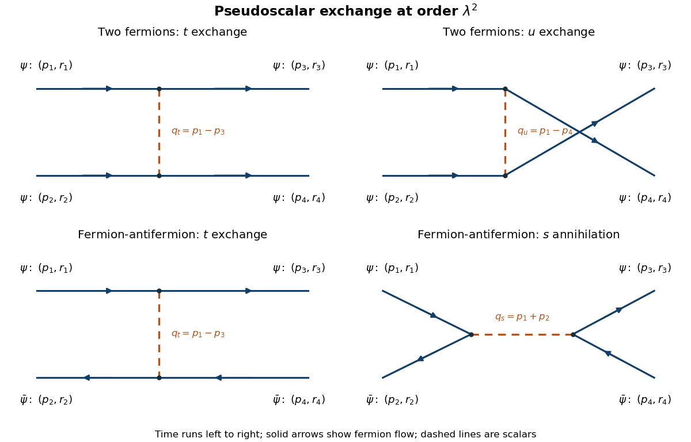

<h1 id="2/c/solution">Solution</h1>

↑ **Parent:** [C](../c.md)

Label the incoming momenta and spin states $(p_1,r_1),(p_2,r_2)$ and the outgoing ones $(p_3,r_3),(p_4,r_4)$, with $p_1+p_2=p_3+p_4$. Write $u_i=u^{r_i}(\mathbf p_i)$ and $v_i=v^{r_i}(\mathbf p_i)$. The [Mandelstam variables](../../../../../../mandelstam-variables.md) are $s=(p_1+p_2)^2$, $t=(p_1-p_3)^2$ and $u=(p_1-p_4)^2$. At lowest order, each connected [Feynman diagram](../../../../../../feynman-diagram.md) has two [pseudoscalar Yukawa interaction](../../../../../../pseudoscalar-yukawa-interaction.md) vertices and one internal [scalar propagator](../../../../../../scalar-propagator.md).

**[Figure 1](#2/c/image-the-t-and-u-exchanges-for-two-fermions-and-the-t-exchange-and-s-annihilation-for-a-fermion-antifermion-pair-with-external-momentum-and-spin-labels). The t and u exchanges for two fermions, and the t exchange and s annihilation for a fermion-antifermion pair, with external momentum and spin labels**.

Define the [scattering amplitude](../../../../../../scattering-amplitude.md) by $S_{fi}^{\mathrm{connected}}=i(2\pi)^4\delta^4(p_1+p_2-p_3-p_4)\mathcal M$. Fix the external [Fock state](../../../../../../fock-state.md) ordering as $b_1^\dagger b_2^\dagger|0\rangle$ to $b_3^\dagger b_4^\dagger|0\rangle$ for the two-fermion process. The $t$ exchange connects $1$ to $3$ and $2$ to $4$; the $u$ exchange connects $1$ to $4$ and $2$ to $3$. The two [Feynman vertices](../../../../../../interaction-vertex.md) contribute $(-i\lambda)^2$, and the internal [scalar propagator](../../../../../../scalar-propagator.md) contributes $i$ divided by its denominator. Exchanging the two identical final fermions supplies a relative [fermionic sign](../../../../../../fermionic-sign.md). Thus

$$
\boxed{\mathcal M_{\psi\psi}
=-\lambda^2\left[
\frac{(\bar u_3\gamma^5u_1)(\bar u_4\gamma^5u_2)}{t-\mu^2+i0}
-\frac{(\bar u_4\gamma^5u_1)(\bar u_3\gamma^5u_2)}{u-\mu^2+i0}
\right].}
$$

This changes sign when the two outgoing labels are exchanged, as identical-fermion antisymmetry requires. There is no $s$ annihilation diagram for two incoming fermions: the interaction preserves [Dirac fermion number conservation](../../../../../../dirac-fermion-number-conservation.md).

For the fermion-antifermion process take initial state $b_1^\dagger d_2^\dagger|0\rangle$ and final state $b_3^\dagger d_4^\dagger|0\rangle$. The $t$ exchange uses bilinears $(\bar u_3\gamma^5u_1)(\bar v_2\gamma^5v_4)$, and the $s$ annihilation uses $(\bar v_2\gamma^5u_1)(\bar u_3\gamma^5v_4)$. To fix the sign without a guess, expand the current $J=:\bar\psi\gamma^5\psi:$ in creation and annihilation operators. Its relevant terms have the signs

$$
J\supset b^\dagger b\,\bar u\gamma^5u
-d^\dagger d\,\bar v\gamma^5v
+d b\,\bar v\gamma^5u
+b^\dagger d^\dagger\,\bar u\gamma^5v.
$$

The [antifermion sign of a normal-ordered bilinear](../../../../../../antifermion-sign-of-a-normal-ordered-bilinear.md) makes the exchange contraction negative, whereas the product of annihilation and creation contractions is positive for the specified external ordering. Multiplying by $(-i\lambda)^2i=-i\lambda^2$ therefore gives

$$
\boxed{\mathcal M_{\psi\bar\psi}
=\lambda^2\left[
\frac{(\bar u_3\gamma^5u_1)(\bar v_2\gamma^5v_4)}{t-\mu^2+i0}
-\frac{(\bar v_2\gamma^5u_1)(\bar u_3\gamma^5v_4)}{s-\mu^2+i0}
\right].}
$$

A different common phase convention for an external state can reverse the overall amplitude, but never the relative sign of its two contributions. Both results are [tree scattering with pseudoscalar exchange](../../../../../../tree-scattering-with-pseudoscalar-exchange.md) and are of order $\lambda^2$.

## ↑ Ancestors (11)

1. [C](../c.md)
2. [2](../../2.md)
3. [Paper 48](../../../paper-48-split.md)
4. [Iii](../../../split.md)
5. [2008](../../../../split.md)
6. [Past exam of the mathematics course of the University of Cambridge](../../../../../split.md)
7. [Mathematics course of the University of Cambridge](../../../../../../mathematics-course-of-the-university-of-cambridge.md)
8. [Course of the University of Cambridge](../../../../../../course-of-the-university-of-cambridge.md)
9. [University of Cambridge](../../../../../../university-of-cambridge-split.md)
10. [List of universities](../../../../../../list-of-universities.md)
11. [Codex Wiki](../../../../../../split.md)
