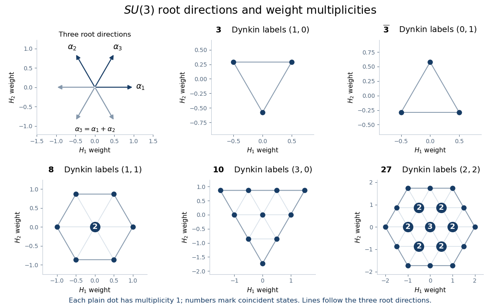

<h1 id="2/solution">Solution</h1>

↑ **Parent:** [2](../2.md)

The commuting [Hermitian operators](../../../../../hermitian-operator.md) $H_1,H_2$ admit a [weight-space decomposition](../../../../../weight-space-decomposition.md). The six [root vectors](../../../../../root-vector.md) shift their simultaneous eigenvalues by

$$
\alpha_1=(1,0),\qquad\alpha_2=(-1/2,\sqrt3/2),\qquad\alpha_3=(1/2,\sqrt3/2)
$$

or their negatives. Put $h_i=2\alpha_i\cdot H$, $e_i=\sqrt2E_+^i$ and $f_i=\sqrt2E_-^i$. The supplied relations give

$$
[h_i,e_i]=2e_i,\qquad[h_i,f_i]=-2f_i,\qquad[e_i,f_i]=h_i.
$$

These are three [sl2 triples](../../../../../sl2-triple.md), coming from the complexifications of the three [SU(2) Lie algebra](../../../../../su-2-lie-algebra.md) root-pair subalgebras. They act through homomorphisms into $\operatorname{End}(V)$. For a nontrivial representation, simplicity of the [SU(3) Lie algebra](../../../../../su-3-lie-algebra.md) makes its kernel zero, so these images are actual $\mathfrak{sl}_2(\mathbb C)$ subalgebras; a trivial representation gives zero actions. The real compact generators can be taken as $ih_i$, $i(E_+^i+E_-^i)$ and $E_+^i-E_-^i$.

Decomposing under any one of these subalgebras gives finite [weight strings](../../../../../weight-string.md) in its root direction. The two simple-root highest weights must be nonnegative integers. In the [SU(3) highest-weight coordinates](../../../../../su-3-highest-weight-coordinates.md) used here, this condition is

$$
\boxed{a=2p\in\mathbb Z_{\geq0},\qquad b=\sqrt3q-p\in\mathbb Z_{\geq0}.}
$$

Here $(a,b)$ are the [Dynkin labels](../../../../../dynkin-label.md); $(p,q)$ are the eigenvalues of $H_1,H_2$. An [irreducible representation](../../../../../irreducible-representation.md) is determined by these labels and has dimension $(a+1)(b+1)(a+b+2)/2$. An arbitrary finite-dimensional anti-Hermitian representation is a direct sum of such representations: the [orthogonal complement](../../../../../orthogonal-complement.md) of an [invariant subspace](../../../../../invariant-subspace.md) remains invariant.

The [weight diagram](../../../../../weight-diagram.md) has [Weyl group](../../../../../weyl-group.md) symmetry, namely reflections and rotations by $120$ degrees. Its convex boundary is a hexagon with alternating side lengths $a,b$, degenerating to a triangle when one label vanishes. Generic representations need not have $60$-degree symmetry. Boundary [weight multiplicities](../../../../../weight-multiplicity.md) are one. Moving inward through hexagonal layers increases multiplicity by one, up to $\min(a,b)+1$; triangular inner layers retain that maximum. An exact version of this rule is the [dominant weight multiplicity formula for sl3](../../../../../dominant-weight-multiplicity-formula-for-sl3.md): move a weight by the Weyl group to dominant Dynkin coordinates $(c,d)$ and set

$$
r=\frac{2a+b-2c-d}{3},\qquad s=\frac{a+2b-c-2d}{3}.
$$

Its multiplicity is zero unless $r,s$ are integers, and otherwise is $\max\{0,1+\min(a,b,r,s)\}$. These rules construct the diagram while counting coincident weights correctly.

**[Figure 1](#2/image-su-3-root-directions-and-weight-diagrams-with-multiplicities-at-coincident-weights). SU(3) root directions and weight diagrams, with multiplicities at coincident weights**.

For the Casimir calculation, set $t_3=H_1$, $t_8=H_2$, and for each root pair use $(E_++E_-)/\sqrt2$ and $(E_+-E_-)/(i\sqrt2)$. In the defining representation these eight generators satisfy $\operatorname{tr}(t_at_b)=\delta_{ab}/2$. Their summed squares are precisely the question's $X$. The invariant trace form makes their [structure constants of a Lie algebra](../../../../../structure-constant-of-a-lie-algebra.md) antisymmetric, so

$$
[X,t_c]=\sum_a\{t_a,[t_a,t_c]\}=0:
$$

the antisymmetric coefficient contracts a symmetric anticommutator. Thus $X$ is a [quadratic Casimir operator](../../../../../quadratic-casimir-operator.md) and is scalar on an irreducible representation by the [Schur lemma](../../../../../schur-s-lemma.md).

Let $v$ be a [highest-weight vector](../../../../../highest-weight-vector.md), annihilated by all $E_+^i$. On $v$, each $E_-^iE_+^i$ vanishes and each $E_+^iE_-^i$ reduces to the root commutator. Summing those three commutators gives $H_1+\sqrt3H_2$. Hence

$$
Xv=(p^2+q^2+p+\sqrt3q)v,
$$

and therefore the [SU(3) quadratic Casimir eigenvalue](../../../../../su-3-quadratic-casimir-eigenvalue.md) is

$$
\boxed{X=(p+\sqrt3q+p^2+q^2)I_V
=\frac{a^2+ab+b^2+3a+3b}{3}I_V.}
$$

For a reducible representation the same calculation applies separately to its irreducible blocks.

For light-hadron [flavour symmetry](../../../../../flavor-symmetry.md), the [up quark](../../../../../up-quark.md), [down quark](../../../../../down-quark.md) and [strange quark](../../../../../strange-quark.md) form $\mathbf3$, and [antiquarks](../../../../../antiquark.md) form $\overline{\mathbf3}$. Conventional [mesons](../../../../../meson.md) have $\mathbf3\otimes\overline{\mathbf3}=\mathbf1\oplus\mathbf8$. Conventional three-quark [baryons](../../../../../baryon.md) have

$$
\mathbf3^{\otimes3}=\mathbf1\oplus\mathbf8\oplus\mathbf8\oplus\mathbf{10},
$$

obtained from $\mathbf3\otimes\mathbf3=\mathbf6\oplus\overline{\mathbf3}$, $\mathbf6\otimes\mathbf3=\mathbf{10}\oplus\mathbf8$ and $\overline{\mathbf3}\otimes\mathbf3=\mathbf8\oplus\mathbf1$. Their [Dynkin labels](../../../../../dynkin-label.md) are $(0,0)$, $(1,1)$ and $(3,0)$, respectively. Thus the conventional [meson octet](../../../../../meson-octet.md), [baryon octet](../../../../../baryon-octet.md), [baryon decuplet](../../../../../baryon-decuplet.md) and singlet multiplets give $\boxed{X=0,\ 3,\ 6}$, with the same values for conjugate antibaryon multiplets. More generally, the [zero flavour triality of a light-quark hadron](../../../../../zero-flavour-triality-of-a-light-quark-hadron.md) imposes $a+2b\equiv0\pmod3$ on multiplets constructed entirely from light quarks, [antiquarks](../../../../../antiquark.md) and [gluons](../../../../../gluon.md). Their Casimir values are given by the same formula for these labels. Higher multiquark representations can therefore have other eigenvalues; the illustrated $\mathbf{27}$, of labels $(2,2)$, has $X=8$.

## ↑ Ancestors (10)

1. [2](../2.md)
2. [Paper 49](../../paper-49-split.md)
3. [Iii](../../split.md)
4. [2008](../../../split.md)
5. [Past exam of the mathematics course of the University of Cambridge](../../../../split.md)
6. [Mathematics course of the University of Cambridge](../../../../../mathematics-course-of-the-university-of-cambridge.md)
7. [Course of the University of Cambridge](../../../../../course-of-the-university-of-cambridge.md)
8. [University of Cambridge](../../../../../university-of-cambridge-split.md)
9. [List of universities](../../../../../list-of-universities.md)
10. [Codex Wiki](../../../../../split.md)
