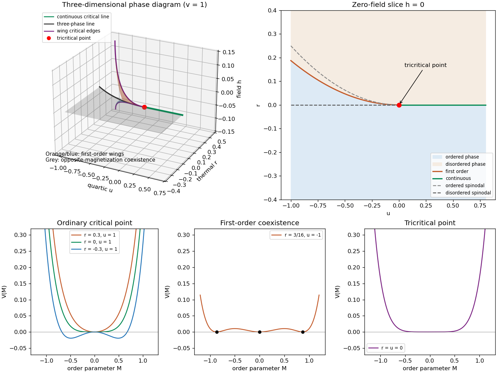

<h1 id="1/solution">Solution</h1>

↑ **Parent:** [1](../1.md)

A [phase diagram](../../../../../phase-diagram.md) locates stable [pure thermodynamic phases](../../../../../pure-thermodynamic-phase.md) and their [phase coexistence](../../../../../phase-coexistence.md) boundaries in a space of control parameters. For a concrete three-dimensional example, take the temperature, crystal-field parameter, and magnetic field of the [Blume–Capel model](../../../../../blume-capel-model.md). Its spins take values $0,\pm1$; changing the cost of the zero-spin state can turn a continuous ordering transition into a discontinuous one. A local scalar description near the resulting [tricritical point](../../../../../tricritical-point.md) is the [Landau-Ginzburg theory](../../../../../landau-ginzburg-theory.md)

$$
\mathcal F[M]=\int d^Dx\left[\frac K2|\nabla M|^2+V(M)\right],\qquad
V(M)=\frac r2M^2+\frac u4M^4+\frac v6M^6-hM,\quad K,v>0.
$$

The three local control coordinates are $(r,u,h)$, with $r$ varying linearly with the thermal scaling field. For $u>0$, $h=0$, the transition at $r=0$ is continuous. For $u<0$, zero-field coexistence is at $r=3u^2/(16v)$, and the [magnetization](../../../../../magnetization.md) jumps between zero and $\pm\sqrt{-3u/(4v)}$. The two loci meet at $r=u=h=0$, the [tricritical point](../../../../../tricritical-point.md).

The full three-dimensional [phase diagram](../../../../../phase-diagram.md) has an ordered coexistence sheet at $h=0$, where the two opposite magnetizations exchange stability when $h$ changes sign. On its three-phase line it meets two nonzero-field [tricritical wings](../../../../../tricritical-wing.md). These wings are [first-order phase transition](../../../../../first-order-phase-transition.md) surfaces between minima of the same sign but different magnitude, terminating at ordinary [thermodynamic critical points](../../../../../thermodynamic-critical-point.md). Their [tricritical wing critical edges](../../../../../tricritical-wing-critical-edge.md) are found by $V'=V''=V'''=0$:

$$
M_c^2=-\frac{3u}{10v},\qquad r_c=\frac{9u^2}{20v},\qquad h_c=\frac{6u^2M_c}{25v}\quad(u<0).
$$

Indeed $V'''=6uM+20vM^3$ fixes $M_c^2$, and substituting into $V''=0$ and $V'=0$ gives $r_c,h_c$; $V''''=-12u>0$ ensures a stable critical quartic minimum. The two signs give the two wings. All transition surfaces and critical edges end together at the [tricritical point](../../../../../tricritical-point.md). The following plot uses $v=1$; its wing surfaces come from the exact [tricritical wing coexistence factorization](../../../../../tricritical-wing-coexistence-factorization.md), rather than schematic unconstrained surfaces.

**[Figure 1](#1/image-tricritical-coexistence-surfaces-the-zero-field-phase-diagram-and-ordinary-first-order-and-tricritical-landau-potentials). Tricritical coexistence surfaces, the zero-field phase diagram, and ordinary, first-order and tricritical Landau potentials**.

The unheaded requests for [critical exponents](../../../../../critical-exponent.md) follow from the uniform equation of state

$$
h=rM+uM^3+vM^5.
$$

For an ordinary [thermodynamic critical point](../../../../../thermodynamic-critical-point.md), $u>0$ is fixed and $r=At$, $A>0$. At $h=0$, $t<0$, the small ordered minimum obeys $M^2\sim-r/u$, so the [order-parameter critical exponent](../../../../../order-parameter-critical-exponent.md) is $\beta=1/2$. Above the transition $\chi=(\partial M/\partial h)_{h=0}=1/r$, giving the [magnetic-susceptibility critical exponent](../../../../../magnetic-susceptibility-critical-exponent.md) $\gamma=1$. At $r=0$, $h\sim uM^3$, so the critical-isotherm exponent is $\delta=3$. At the tuned [tricritical point](../../../../../tricritical-point.md), $u=0$, instead $M^4=-r/v$ below the transition and $h=vM^5$ on its critical isotherm, while the disordered susceptibility remains $1/r$. Therefore

$$
\boxed{(\beta,\gamma,\delta)_{\rm ordinary}=(1/2,1,3),\qquad
(\beta,\gamma,\delta)_{\rm tricritical}=(1/4,1,5).}
$$

Below the transition the inverse susceptibility is $r+3uM^2+5vM^4$, giving $2|r|$ in the ordinary limit and $4|r|$ in the tricritical limit. Thus both sides give the same susceptibility power, with different amplitudes.

To derive the general [Ginzburg criterion](../../../../../ginzburg-criterion.md), tune away all lower even nonlinearities and let the leading stabilizer be $v_nM^{2n}/(2n)$, $n\geq2$. The equation of state gives $M_0^2\asymp|r|^{1/(n-1)}$, and its curvature at the ordered saddle is $2(n-1)|r|$, so $\xi\asymp|r|^{-1/2}$. The fluctuations of the [order parameter](../../../../../order-parameter.md) averaged over a [correlation volume](../../../../../correlation-volume.md) are estimated by its long-wavelength quadratic covariance:

$$
\langle(\delta M)^2\rangle_\xi
\asymp k_BT\int_{|q|\lesssim\xi^{-1}}\frac{d^Dq}{(2\pi)^D}\frac1{Kq^2+c|r|}
\asymp\xi^{2-D}.
$$

The integral has a fixed dimensionless upper limit after $q=p/\xi$; this is a coarse-volume fluctuation estimate, not the ultraviolet-dominated point variance. Consequently the [multicritical Ginzburg ratio](../../../../../multicritical-ginzburg-ratio.md) is

$$
\frac{\langle(\delta M)^2\rangle_\xi}{M_0^2}
\asymp |r|^{(D-2)/2-1/(n-1)}.
$$

The [Landau approximation](../../../../../landau-approximation.md) is asymptotically controlled by this test only when the ratio tends to zero. This gives the [upper critical dimension](../../../../../upper-critical-dimension.md)

$$
\boxed{D_c=\frac{2n}{n-1};\qquad D_c=4\ (n=2),\quad D_c=3\ (n=3).}
$$

The same threshold follows by giving $M$ its Gaussian [engineering dimension](../../../../../engineering-dimension.md) $(D-2)/2$: the coupling to $M^{2n}$ has scaling exponent $D-n(D-2)=2n-(n-1)D$, which becomes relevant below $D_c$.

For $D<D_c$, the fluctuation ratio diverges and the saddle calculation cannot predict the generic interacting [critical exponents](../../../../../critical-exponent.md). At $D=D_c$ the test is marginal, not a proof of changed power exponents: the ratio has zero thermal power and marginal interactions can produce logarithmic corrections. Thus the PDF's inclusion of equality in a blanket claim about wrong power exponents needs this qualification. The [Landau-Ginzburg theory](../../../../../landau-ginzburg-theory.md) as a fluctuating field theory remains useful; what loses validity is its fluctuation-free [Landau approximation](../../../../../landau-approximation.md).

## ↑ Ancestors (10)

1. [1](../1.md)
2. [Paper 50](../../paper-50-split.md)
3. [Iii](../../split.md)
4. [2008](../../../split.md)
5. [Past exam of the mathematics course of the University of Cambridge](../../../../split.md)
6. [Mathematics course of the University of Cambridge](../../../../../mathematics-course-of-the-university-of-cambridge.md)
7. [Course of the University of Cambridge](../../../../../course-of-the-university-of-cambridge.md)
8. [University of Cambridge](../../../../../university-of-cambridge-split.md)
9. [List of universities](../../../../../list-of-universities.md)
10. [Codex Wiki](../../../../../split.md)
