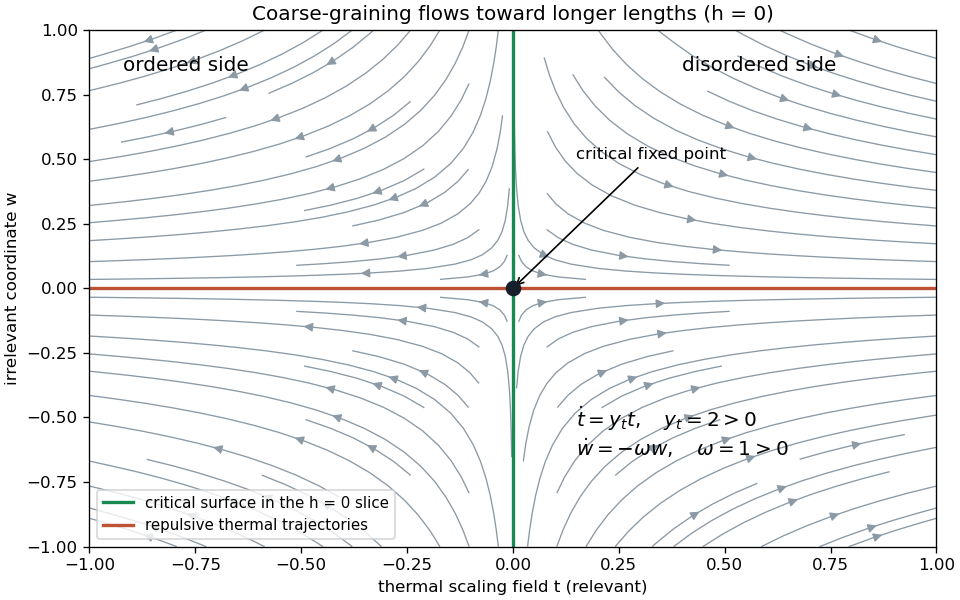

<h1 id="2/solution">Solution</h1>

↑ **Parent:** [2](../2.md)

Use $\beta_{\rm th}=1/(k_BT)$ for inverse temperature, to distinguish it from the order-parameter exponent. In a translation-invariant [pure thermodynamic phase](../../../../../pure-thermodynamic-phase.md), the [connected correlation function](../../../../../connected-correlation-function.md) is

$$
G(r)=\langle\sigma_r\sigma_0\rangle-\langle\sigma_r\rangle\langle\sigma_0\rangle.
$$

The subtraction is essential below the transition. Its exponential [correlation length](../../../../../correlation-length.md) is defined by $\xi^{-1}=-\lim_{r\to\infty}r^{-1}\log|G(r)|$, with direction specified if the lattice is anisotropic. Away from criticality, $G(r)$ has a tail proportional to $e^{-r/\xi}$ times an algebraic prefactor. In the massive continuum scalar approximation that prefactor is $r^{-(D-1)/2}$; at criticality the exponential cutoff disappears and $G(r)\asymp r^{-(D-2+\eta)}$ instead. The large-distance limit here is $r\gg\xi$, as the PDF shows.

Let $F_{\rm tot}=-\beta_{\rm th}^{-1}\log Z$. With the energy convention $-h\sum_r\sigma_r$, the [magnetization](../../../../../magnetization.md) per site and [magnetic susceptibility](../../../../../magnetic-susceptibility.md) are

$$
M=-\frac1N\frac{\partial F_{\rm tot}}{\partial h},\qquad
\chi=\frac{\partial M}{\partial h}=-\frac1N\frac{\partial^2F_{\rm tot}}{\partial h^2}.
$$

Writing $S=\sum_r\sigma_r$, direct differentiation of the [partition function](../../../../../canonical-partition-function.md) gives $\partial_h\langle S\rangle=\beta_{\rm th}(\langle S^2\rangle-\langle S\rangle^2)$. Thus the [correlation-function susceptibility sum rule](../../../../../correlation-function-susceptibility-sum-rule.md) is

$$
\boxed{\chi=\frac{\beta_{\rm th}}N\sum_{r,r'}\langle\sigma_r\sigma_{r'}\rangle_c
=\beta_{\rm th}\sum_rG(r).}
$$

In physical continuum coordinates the lattice sum becomes $a^{-D}\int d^Dr\,G(r)$, so omitting the site-density factor would change the normalization. A derivative with respect to the dimensionless source $\beta_{\rm th}h$ instead absorbs the explicit inverse-temperature factor.

An exact [renormalization-group transformation](../../../../../renormalization-group-transformation.md) with length factor $b>1$ can be defined by a nonnegative [normalized blocking kernel](../../../../../normalized-blocking-kernel.md) $K_b(\sigma',\sigma)$ satisfying $\sum_{\sigma'}K_b(\sigma',\sigma)=1$. A deterministic majority rule is one example; randomized tie-breaking preserves its normalization. Define the blocked energy, including its constant, by

$$
e^{-\beta_{\rm th}H(u',\sigma')-\beta_{\rm th}N'C'}
=\sum_\sigma K_b(\sigma',\sigma)e^{-\beta_{\rm th}H(u,\sigma)-\beta_{\rm th}NC},
\qquad N'=N/b^D.
$$

Summing over $\sigma'$ proves $Z(u',C',N')=Z(u,C,N)$. All generated operators must be retained for this identity to remain exact; a finite-coupling truncation is an approximation. After $p$ iterations, $N_p=N/b^{pD}$ and the spacing is $a_p=b^pa$. Long-distance physics is preserved because this is a marginalization of microscopic probabilities, with observables and sources transformed along with the energy. It integrates short-distance variables rather than changing their effects on retained observables. Physical lengths remain fixed even though the [correlation length](../../../../../correlation-length.md) in units of the new spacing is reduced by $b^p$.

For clarity, now use dimensionless [free energy](../../../../../thermodynamic-free-energy.md) per site $F(u,C)=-N^{-1}\log Z=f(u)+\beta_{\rm th}C$. Exact equality of the [partition functions](../../../../../canonical-partition-function.md) gives

$$
F(u_0,C_0)=b^{-pD}F(u_p,C_p).
$$

A constant microscopic energy shifts every blocked weight by the same factor, so $C'=b^DC+c(u)$. Substitution at one step yields the [additive free-energy recursion under blocking](../../../../../additive-free-energy-recursion-under-blocking.md)

$$
f(u)=b^{-D}f(R_bu)+g(u),\qquad g(u)=\beta_{\rm th}b^{-D}c(u).
$$

Induction now gives the requested relation

$$
\boxed{f(u_0)=b^{-pD}f(u_p)+\sum_{j=0}^{p-1}b^{-jD}g(u_j).}
$$

The function $g$ is the [identity-operator contribution to renormalization-group free energy](../../../../../identity-operator-contribution-to-renormalization-group-free-energy.md): it records eliminated-mode entropy, integration constants and normalization factors. A free-energy function satisfying this inhomogeneous equation need not be purely singular until its analytic background has been subtracted.

At a [renormalization-group fixed point](../../../../../renormalization-group-fixed-point.md), $R_bu_*=u_*$. Linearize in scaling coordinates $v_i$ so $v_i'=b^{\lambda_i}v_i$. Here $\lambda_i$ is a scaling exponent, not the discrete multiplier itself. A positive $\lambda_i$ gives a [relevant operator](../../../../../relevant-operator.md), a negative one an [irrelevant operator](../../../../../irrelevant-operator.md), and zero a [marginal operator](../../../../../marginal-operator.md). The [critical surface](../../../../../critical-surface.md) is the stable manifold: tune every relevant scaling field to zero and the irrelevant coordinates flow toward $u_*$. A [repulsive renormalization-group trajectory](../../../../../repulsive-renormalization-group-trajectory.md) leaves along a relevant direction; it can still have irrelevant coordinates contracting toward that manifold. The plot shows the $h=0$ section when temperature and field are relevant: $t=0$ is the critical line in this section, while an independent nonzero field is another direction away from criticality.

**[Figure 2](#2/image-renormalization-group-trajectories-near-a-critical-fixed-point-showing-thermal-repulsion-and-irrelevant-contraction-in-the-zero-field-section). Renormalization-group trajectories near a critical fixed point, showing thermal repulsion and irrelevant contraction in the zero-field section**.

The inhomogeneous term cannot simply be discarded from the full [free energy](../../../../../thermodynamic-free-energy.md). If an analytic background $A(u)$ solves $A(u)=b^{-D}A(R_bu)+g(u)$, its subtraction leaves $F_s=f-A$ obeying homogeneous scaling. For example, in linear thermal and field coordinates, a source monomial $g_{mn}t^mh^n$ is removed by

$$
A_{mn}=\frac{g_{mn}}{1-b^{m\lambda_t+n\lambda_h-D}}.
$$

When the denominator vanishes, the source is resonant and can instead produce a logarithm. Thus the homogeneous singular equation is justified after analytic subtraction when there is no relevant resonance affecting the leading singularity, no marginal logarithm that has been omitted, and no singular dependence on a [dangerously irrelevant coupling](../../../../../dangerously-irrelevant-coupling.md). Merely saying that $g$ is regular is insufficient to discard the whole weighted sum without this analysis.

Under these assumptions, with two relevant scaling fields $t,h$, choose $p$ so that $b^{p\lambda_t}|t|$ is of order one. The [scaling hypothesis for critical phenomena](../../../../../scaling-hypothesis-for-critical-phenomena.md) then gives

$$
F_s(t,h)=|t|^{D/\lambda_t}\Phi_\pm\left(\frac{h}{|t|^{\lambda_h/\lambda_t}}\right).
$$

Writing $\Phi_\pm=f_\pm+I_\pm$ recovers the PDF's notation:

$$
\boxed{F_\pm=|t|^{D/\lambda_t}\left[f_\pm\left(h/|t|^{\lambda_h/\lambda_t}\right)+I_\pm\right].}
$$

The sign labels the two matching branches $t>0$ and $t<0$, which enter different phases when the flow leaves the critical neighborhood. The constants $I_\pm$ retain a branch-dependent identity contribution or a chosen split of the scaling function. They are determined by the same matching problem, not independently adjustable nonuniversal free-energy offsets. An arbitrary analytic offset from $C_0$ belongs to the subtracted background. The formula describes the singular part; adding that background recovers the full physical [free energy](../../../../../thermodynamic-free-energy.md).

At $h=0$, restore the common metric factors as $F_{s,\pm}=A_f|a_tt|^{D/\lambda_t}\Phi_\pm(0)$. Their ratio at equal $|t|$ is $\Phi_+(0)/\Phi_-(0)$, proving the expected [universal singular free-energy amplitude ratio](../../../../../universal-singular-free-energy-amplitude-ratio.md) because $A_f$ and $a_t$ cancel. The ratio of full [free energies](../../../../../thermodynamic-free-energy.md) including an arbitrary regular $C_0$ is not universal; zero amplitudes and logarithmic resonances also require separate treatment.

The [critical exponents](../../../../../critical-exponent.md) are obtained by rescaling and differentiating, not by identifying them with the discrete multipliers. The [correlation length](../../../../../correlation-length.md) obeys $\xi(t,h)=b^p\xi(b^{p\lambda_t}t,b^{p\lambda_h}h)$, hence $\nu=1/\lambda_t$. Two temperature derivatives of $F_s(t,0)$ give $C_{V,s}\asymp|t|^{D/\lambda_t-2}$, while one and two field derivatives give the ordered [magnetization](../../../../../magnetization.md) and susceptibility powers. Thus

$$
\boxed{\nu=\frac1{\lambda_t},\quad
\alpha=2-\frac D{\lambda_t},\quad
\beta=\frac{D-\lambda_h}{\lambda_t},\quad
\gamma=\frac{2\lambda_h-D}{\lambda_t},\quad
\delta=\frac{\lambda_h}{D-\lambda_h}.}
$$

For $\delta$, instead set $t=0$ and choose the blocking scale by $h$, obtaining $F_s(0,h)\asymp|h|^{D/\lambda_h}$ and then differentiate. A nonzero spontaneous ordered-branch derivative is assumed in the formula for $\beta$. In particular the [hyperscaling relation](../../../../../hyperscaling-relation.md) is $\boxed{\alpha=2-D\nu}$. Its physical assumption is an order-one singular [free energy](../../../../../thermodynamic-free-energy.md) per [correlation volume](../../../../../correlation-volume.md), with a single diverging length and no dangerous variable changing its volume scaling. Above the [upper critical dimension](../../../../../upper-critical-dimension.md), a stabilizing quartic coupling can invalidate that assumption even though the [correlation length](../../../../../correlation-length.md) still scales.

For the last model, take the quadratic Hamiltonian exactly as visually printed: its source term is $+h\phi$, outside the half multiplying the [gradient](../../../../../gradient.md) and mass terms. With $\kappa>0$ and $m^2>0$, its connected quadratic covariance is proportional to

$$
\widetilde G(q)=\frac1{\kappa^{-1}q^2+m^2}=\frac\kappa{q^2+\kappa m^2}.
$$

The pole scale, or the [massive Gaussian field correlation tail](../../../../../massive-gaussian-field-correlation-tail.md) obtained by its [Fourier transform](../../../../../fourier-transform.md), gives

$$
\boxed{\xi=(\kappa m^2)^{-1/2}=\frac1{\sqrt\kappa\,m}\quad(m>0).}
$$

The uniform source shifts the mean to $\langle\phi\rangle=-h/m^2$ and does not change the connected covariance. Replacing $h$ by $-h$ matches the earlier magnetic source convention without changing any scaling index.

Define a [Gaussian thinning transformation](../../../../../gaussian-momentum-shell-scaling.md) by retaining momenta $|q|<\Lambda/b$, integrating the Gaussian shell, and rescaling

$$
x'=x/b,\qquad \phi'(x')=b^{(D-2)/2}\phi_<(bx').
$$

The [gradient](../../../../../gradient.md) coefficient is unchanged. Counting volume and field powers in the remaining action gives

$$
\kappa'=\kappa,\qquad (m^2)'=b^2m^2,\qquad h'=b^{(D+2)/2}h.
$$

Shell integration contributes only the additive determinant term. Thus $\lambda_t=2$ when the thermal variable is proportional to $m^2$, and $\lambda_h=(D+2)/2$. Inserting these into the homogeneous index formulas gives the requested [Gaussian critical exponents](../../../../../gaussian-critical-exponent.md)

$$
\boxed{\alpha_G=(4-D)/2,\qquad \beta_G=(D-2)/4.}
$$

The specific-heat power can also be verified without hyperscaling: two mass-squared derivatives of $\tfrac12\int d^Dq\,(2\pi)^{-D}\log(\kappa^{-1}q^2+m^2)$ produce an integral proportional to $\int d^Dq\,(q^2+\kappa m^2)^{-2}$. For $0<D<4$, rescaling $q=\sqrt\kappa m\,p$ gives $(m^2)^{D/2-2}$; at $D=4$ the divergence is logarithmic, with power index zero. At $D=2$ the determinant itself has an additive $m^2\log m^2$ resonance, although its heat-capacity power remains one.

There is a genuine limitation to the last printed request. The [Gaussian order-parameter scaling index](../../../../../gaussian-order-parameter-scaling-index.md) $\beta_G$ is formal: a pure quadratic theory has $\langle\phi\rangle=0$ at $h=0,m^2>0$, and at $m^2<0$ the uniform energy $m^2\phi^2/2$ is unbounded below, so its [partition function](../../../../../canonical-partition-function.md) diverges. It therefore has no stable ordered branch from which a spontaneous-magnetization exponent can be measured. The thinning derivation establishes the index requested by the PDF, but not a nonexistent ordered phase. A stabilizing quartic interaction is relevant for $D<4$ and generally changes these Gaussian indices to the interacting critical ones.

## ↑ Ancestors (10)

1. [2](../2.md)
2. [Paper 50](../../paper-50-split.md)
3. [Iii](../../split.md)
4. [2008](../../../split.md)
5. [Past exam of the mathematics course of the University of Cambridge](../../../../split.md)
6. [Mathematics course of the University of Cambridge](../../../../../mathematics-course-of-the-university-of-cambridge.md)
7. [Course of the University of Cambridge](../../../../../course-of-the-university-of-cambridge.md)
8. [University of Cambridge](../../../../../university-of-cambridge-split.md)
9. [List of universities](../../../../../list-of-universities.md)
10. [Codex Wiki](../../../../../split.md)
