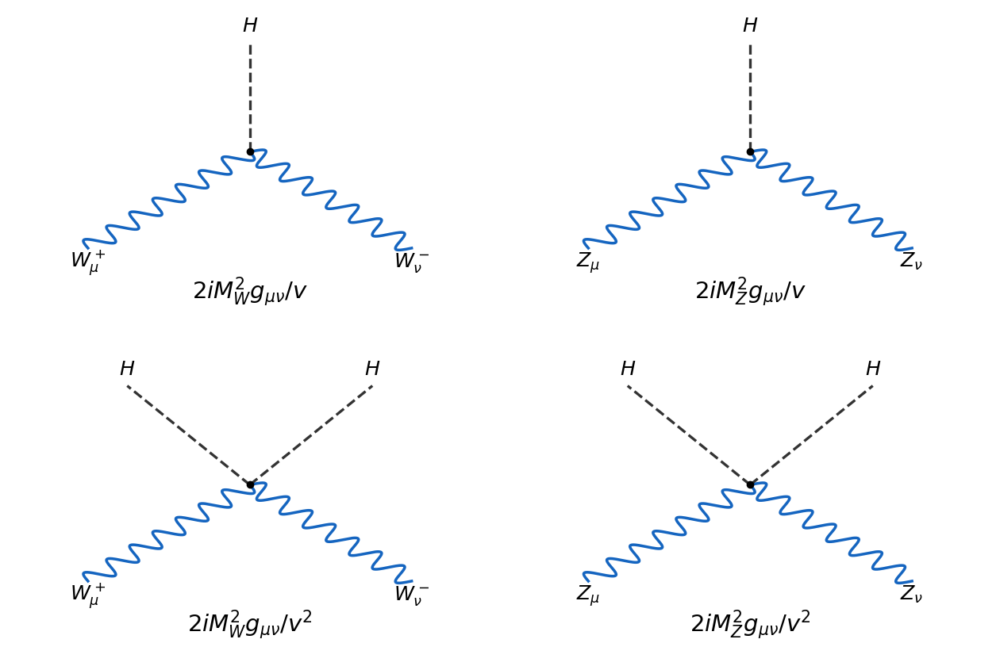

<h1 id="1/solution">Solution</h1>

↑ **Parent:** [1](../1.md)

Use metric $g_{\mu\nu}=\operatorname{diag}(1,-1,-1,-1)$ and the [hypercharge](../../../../../hypercharge.md) convention $Q=T^3+Y$. Then the [Higgs doublet](../../../../../higgs-field.md) has $Y=1/2$ and transforms under [electroweak gauge invariance](../../../../../electroweak-gauge-invariance.md) as

$$
\phi(x)\longmapsto e^{i\beta(x)/2}U(x)\phi(x),\qquad
U(x)=\exp\left(i\alpha^a(x)\sigma_a/2\right)\in SU(2).
$$

The covariant derivative sign consistent with the requested expression is

$$
\boxed{D_\mu\phi=\left(\partial_\mu+ig\frac{\sigma_a}{2}A_\mu^a
 +i\frac{g'}2B_\mu\right)\phi.}
$$

A convention that instead calls the doublet hypercharge one puts $Y/2$ in the charge generator and derivative; the physical coupling is the same. Here $B_\mu\mapsto B_\mu-\partial_\mu\beta/g'$ and the matrix-valued $SU(2)$ connection transforms as $A_\mu\mapsto UA_\mu U^{-1}+(i/g)(\partial_\mu U)U^{-1}$, making $D_\mu\phi$ transform like $\phi$.

In [unitary gauge](../../../../../unitary-gauge.md), the upper component of the derivative comes from the off-diagonal [Pauli matrices](../../../../../pauli-matrices.md):

$$
ig\frac{A_\mu^1-iA_\mu^2}{2}\frac{v+H}{\sqrt2}
=\frac{ig}{2}(v+H)W_\mu.
$$

The lower component is

$$
\frac{\partial_\mu H}{\sqrt2}
+\frac{i(v+H)}{2\sqrt2}(-gA_\mu^3+g'B_\mu).
$$

Writing $c_W=\cos\theta_W$, $s_W=\sin\theta_W$, inversion of the neutral rotation gives $A^3=c_WZ+s_WA$ and $B=-s_WZ+c_WA$. Since $g'=g\tan\theta_W$, the coefficient of the [photon](../../../../../photon.md) vanishes, whereas $-gc_W-g's_W=-g/c_W$. Thus

$$
\boxed{D_\mu\phi=\begin{pmatrix}
ig(v+H)W_\mu/2\\
\partial_\mu H/\sqrt2-ig(v+H)Z_\mu/(2\sqrt2c_W)
\end{pmatrix}.}
$$

The zero photon coupling expresses the neutrality of the surviving radial [Higgs boson](../../../../../higgs-boson.md).

The scalar [Lagrangian density](../../../../../lagrangian-density.md) is $\mathcal L_\phi=(D_\mu\phi)^\dagger D^\mu\phi-V$. Adding $-F^a_{\mu\nu}F^{a\mu\nu}/4-B_{\mu\nu}B^{\mu\nu}/4$ gives the complete bosonic electroweak [Lagrangian density](../../../../../lagrangian-density.md). Its scalar and vector mass terms, after [electroweak symmetry breaking](../../../../../electroweak-symmetry-breaking.md), are obtained directly as

$$
\begin{aligned}
\mathcal L_\phi={}&\frac12(\partial H)^2
+\frac{g^2}{4}(v+H)^2W_\mu^\dagger W^\mu
+\frac{g^2}{8c_W^2}(v+H)^2Z_\mu Z^\mu\\
&-\frac{\lambda v^2}{2}H^2-\frac{\lambda v}{2}H^3-\frac{\lambda}{8}H^4.
\end{aligned}
$$

Indeed, the [shifted quartic Higgs potential normalization](../../../../../shifted-quartic-higgs-potential-normalization.md) gives $\phi^\dagger\phi-v^2/2=vH+H^2/2$. Comparing with a canonically normalized real scalar mass term, a complex vector mass term and a real vector mass term yields

$$
\boxed{M_H^2=\lambda v^2,\qquad M_W^2=g^2v^2/4,\qquad
M_Z^2=g^2v^2/(4c_W^2),\qquad M_A=0.}
$$

The extra factor one half in this paper's [Higgs potential](../../../../../higgs-field-potential.md) is why $M_H^2$ is $\lambda v^2$, rather than $2\lambda v^2$ in another common convention. The [tree-level electroweak gauge-boson masses](../../../../../tree-level-electroweak-gauge-boson-masses.md) give **$\cos\theta_W=M_W/M_Z$**: measure the two vector masses and take their ratio. Beyond tree level this extraction requires a specified renormalization convention and radiative corrections.

Expanding the vector terms gives the [cubic and quartic Higgs couplings to electroweak gauge bosons](../../../../../cubic-and-quartic-higgs-couplings-to-electroweak-gauge-bosons.md):

$$
\mathcal L_{\mathrm{int}}=
\left(\frac{2M_W^2}{v}H+\frac{M_W^2}{v^2}H^2\right)W^\dagger_\mu W^\mu
+\left(\frac{M_Z^2}{v}H+\frac{M_Z^2}{2v^2}H^2\right)Z_\mu Z^\mu.
$$

The four elementary [Feynman diagrams](../../../../../feynman-diagram.md) and their all-incoming [Feynman rules](../../../../../feynman-rule.md) are shown below. Differentiating with respect to two identical $Z$ fields supplies a factor two; differentiating with respect to two identical Higgs fields supplies another factor two in the quartic rules.

**[Figure 1](#1/image-tree-level-higgs-vertices-with-charged-and-neutral-electroweak-gauge-bosons). Tree-level Higgs vertices with charged and neutral electroweak gauge bosons**.

There are no elementary $H\gamma\gamma$, $HZ\gamma$, $HH\gamma\gamma$ or $HHZ\gamma$ vertices in this tree-level [Lagrangian density](../../../../../lagrangian-density.md). Loop-induced photon interactions are a different order. The scalar self-interactions, if included, have rules $HHH:-3iM_H^2/v$ and $HHHH:-3iM_H^2/v^2$.

The prime LEP2 search used the [Higgs boson coupling to Z bosons](../../../../../higgs-boson-coupling-to-z-bosons.md) through **[Higgsstrahlung](../../../../../higgsstrahlung.md), $e^+e^-\to Z^*\to ZH$**, shown in the first panel of the process figure in Question 3. This identifies an associated-production interaction, rather than an on-shell decay of a single $Z$ into a heavier Higgs. The channel's historical role is documented in [the LEP2 Higgs-search account](https://cds.cern.ch/record/2299402/files/Pages_from_C99-03-20.1_375.pdf).

For the free charged [W boson](../../../../../w-boson.md), take $W_\mu(x)=\int d^4p\,e^{-ipx}W_\mu(p)/(2\pi)^4$, with the conjugate field carrying $e^{ipx}$. In the action, multiplying the two field strengths gives $2[p^2W_\mu^\dagger W^\mu-(p\cdot W^\dagger)(p\cdot W)]$. Therefore

$$
\mathcal L_W(p)=-W_\nu^\dagger(p)O^{\mu\nu}(p)W_\mu(p),\qquad
\boxed{O^{\mu\nu}=(p^2-M_W^2)g^{\mu\nu}-p^\mu p^\nu.}
$$

To invert it, separate the transverse and longitudinal projectors $P_T=g-pp/p^2$, $P_L=pp/p^2$. The operator is $(p^2-M_W^2)P_T-M_W^2P_L$, so

$$
O^{-1}=\frac{P_T}{p^2-M_W^2}-\frac{P_L}{M_W^2}
=\frac{g-pp/M_W^2}{p^2-M_W^2}.
$$

Since the quadratic action kernel is $-O$, its [Proca propagator](../../../../../proca-propagator.md) is

$$
\boxed{D_{\mu\nu}(p)=\frac{-i}{p^2-M_W^2+i0}
\left(g_{\mu\nu}-\frac{p_\mu p_\nu}{M_W^2}\right).}
$$

For all momentum components small relative to $M_W$, the low-momentum limit is **$D_{\mu\nu}\simeq ig_{\mu\nu}/M_W^2$**, with corrections of relative order $p^2/M_W^2$ or $p_\mu p_\nu/M_W^2$. This local limit leads to the [Fermi interaction](../../../../../fermi-interaction.md), with $G_F/\sqrt2=g^2/(8M_W^2)$ for the charged-current normalization used here.

## ↑ Ancestors (10)

1. [1](../1.md)
2. [Paper 54](../../paper-54-split.md)
3. [Iii](../../split.md)
4. [2008](../../../split.md)
5. [Past exam of the mathematics course of the University of Cambridge](../../../../split.md)
6. [Mathematics course of the University of Cambridge](../../../../../mathematics-course-of-the-university-of-cambridge.md)
7. [Course of the University of Cambridge](../../../../../course-of-the-university-of-cambridge.md)
8. [University of Cambridge](../../../../../university-of-cambridge-split.md)
9. [List of universities](../../../../../list-of-universities.md)
10. [Codex Wiki](../../../../../split.md)
