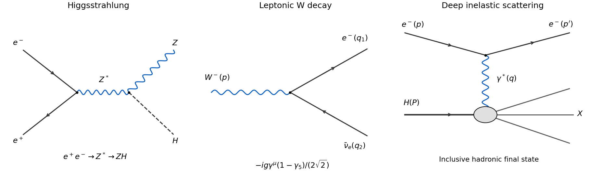

<h1 id="3/solution">Solution</h1>

↑ **Parent:** [3](../3.md)

The middle panel shows the [Feynman diagram](../../../../../feynman-diagram.md) for the leptonic [W boson](../../../../../w-boson.md) decay. With the charged-current [Lagrangian density](../../../../../lagrangian-density.md) sign in the question, its vertex [Feynman rule](../../../../../feynman-rule.md) is

$$
\boxed{-\frac{ig}{2\sqrt2}\gamma^\mu(1-\gamma_5).}
$$

An overall field-phase convention can change the overall amplitude sign but cannot change the [decay width](../../../../../decay-width.md). With the standard [Dirac field](../../../../../dirac-field.md) current ordering, the amplitude is

$$
\mathcal M=-\frac{g}{2\sqrt2}\epsilon_\mu(p)\,
\overline u(q_1)\gamma^\mu(1-\gamma_5)v(q_2).
$$

The unusual order of barred fields in the printed description should be interpreted as this physical [weak charged current](../../../../../charged-current.md) matrix element.

**[Figure 2](#3/image-higgsstrahlung-leptonic-w-decay-and-photon-mediated-deep-inelastic-scattering). Higgsstrahlung, leptonic W decay and photon-mediated deep inelastic scattering**.

For massless final [fermions](../../../../../fermion.md), the [fermion spin sums](../../../../../fermion-spin-sum.md) are $\sum_su_s\overline u_s=\not q_1$ and $\sum_sv_s\overline v_s=\not q_2$. The [massive-vector spin average](../../../../../massive-vector-spin-average.md) divides by three. Thus

$$
\overline{|\mathcal M|^2}=\frac{g^2}{24}K_{\mu\nu}T^{\mu\nu},\qquad
K_{\mu\nu}=-g_{\mu\nu}+p_\mu p_\nu/p^2,
$$

with the chiral trace

$$
T^{\mu\nu}=\operatorname{Tr}[\not q_1\gamma^\mu(1-\gamma_5)
\not q_2\gamma^\nu(1-\gamma_5)].
$$

Anticommuting $\gamma_5$ through the two following gamma matrices and using $(1-\gamma_5)^2=2(1-\gamma_5)$ gives its symmetric part

$$
T_S^{\mu\nu}=8(q_1^\mu q_2^\nu+q_1^\nu q_2^\mu-g^{\mu\nu}q_1\cdot q_2).
$$

Its remaining part is an antisymmetric epsilon tensor from the [gamma matrix trace identities](../../../../../gamma-matrix-trace-identities.md); it vanishes against the symmetric polarization tensor $K$. Direct contraction gives $-g_{\mu\nu}T_S^{\mu\nu}=16q_1\cdot q_2$ and

$$
\frac{p_\mu p_\nu}{p^2}T_S^{\mu\nu}
=8\left[\frac{2(p\cdot q_1)(p\cdot q_2)}{p^2}-q_1\cdot q_2\right].
$$

Hence

$$
\boxed{\overline{|\mathcal M|^2}=\frac{g^2}{3}
\left[q_1\cdot q_2+\frac{2(p\cdot q_1)(p\cdot q_2)}{p^2}\right].}
$$

No additional averaging over hypothetical right-handed neutrino states is appropriate: the [chiral projector](../../../../../chiral-projector.md) already enforces the physical helicity coupling.

On shell, $p=q_1+q_2$, $p^2=M_W^2$ and $q_i^2=0$, so $q_1\cdot q_2=M_W^2/2$ and $p\cdot q_i=M_W^2/2$. The squared [matrix element](../../../../../matrix-element.md) reduces to $g^2M_W^2/3$. In the parent rest frame, integrate the spatial momentum delta first in [two-body Lorentz-invariant phase space](../../../../../two-body-lorentz-invariant-phase-space.md). The remaining radial integral is

$$
\int d\Phi_2=\frac1{(2\pi)^2}\int\frac{k^2dk\,d\Omega}{4k^2}\delta(M_W-2k)
=\frac1{8\pi}.
$$

Consequently the [massless leptonic W decay width](../../../../../massless-leptonic-w-decay-width.md) is

$$
\boxed{\Gamma_e=\frac1{2M_W}\frac{g^2M_W^2}{3}\frac1{8\pi}
=\frac{g^2M_W}{48\pi}\equiv\Gamma_\ell.}
$$

Lepton universality gives $\Gamma(W^-\to\mu^-\overline\nu_\mu)=\Gamma(W^-\to\tau^-\overline\nu_\tau)=\Gamma_\ell$ in the same massless approximation. The [muon](../../../../../muon.md) and [tau lepton](../../../../../tau-particle.md) masses produce small corrections if retained.

With an identity [CKM matrix](../../../../../cabibbo-kobayashi-maskawa-matrix.md), the allowed quark channels are $d\overline u$ and $s\overline c$. The corresponding third-generation channel $b\overline t$ is closed by the top threshold. Each open channel has three orthogonal matching-color final states, so the [color multiplicity in a decay width](../../../../../color-multiplicity-in-a-decay-width.md) gives **$\Gamma(d\overline u)=\Gamma(s\overline c)=3\Gamma_\ell$**. There is no initial color average because the [W boson](../../../../../w-boson.md) is colorless. The [tree-level W branching fractions](../../../../../tree-level-w-branching-fractions.md) are therefore:

| Final channel | Partial width | Branching fraction, rounded |
| --- | --- | --- |
| $e^-\overline\nu_e$ | $\Gamma_\ell$ | $1/9\simeq11\%$ |
| $\mu^-\overline\nu_\mu$ | $\Gamma_\ell$ | $1/9\simeq11\%$ |
| $\tau^-\overline\nu_\tau$ | $\Gamma_\ell$ | $1/9\simeq11\%$ |
| $d\overline u$ | $3\Gamma_\ell$ | $1/3\simeq33\%$ |
| $s\overline c$ | $3\Gamma_\ell$ | $1/3\simeq33\%$ |

The rounded percentages sum to 99% because of rounding. The exact fractions sum to one, with total leptonic fraction $1/3$ and hadronic fraction $2/3$. The total [decay width](../../../../../decay-width.md) is

$$
\boxed{\Gamma_W=9\Gamma_\ell=\frac{3g^2M_W}{16\pi}
=\frac{3G_FM_W^3}{2\pi\sqrt2}.}
$$

As an illustrative numerical estimate, taking $g=0.65$ and $M_W=80\,\mathrm{GeV}$ gives $\Gamma_\ell\simeq0.224\,\mathrm{GeV}$, each open quark width $\simeq0.672\,\mathrm{GeV}$ and $\Gamma_W\simeq2.02\,\mathrm{GeV}$. These are tree-level model estimates with the stated illustrative inputs, not a fit to a measured width. Strong radiative corrections increase the inclusive quark widths.

The produced [quark](../../../../../quark.md) and [antiquark](../../../../../antiquark.md) radiate [gluons](../../../../../gluon.md), generating a parton shower. As their virtualities fall towards the strong-interaction scale, perturbation theory gives way to [hadronization](../../../../../hadronization.md): confinement converts the colored partons into color-neutral [hadrons](../../../../../hadron.md), typically seen as two [particle jets](../../../../../jet-particle-physics.md), with additional radiation sometimes producing resolved extra jets. Unstable hadrons subsequently decay; the primary quarks are not observed as free particles.

Including the [CKM matrix](../../../../../cabibbo-kobayashi-maskawa-matrix.md), the charged current couples an accessible up-type flavour $u_i$ to every kinematically accessible down-type flavour $d_j$. Therefore

$$
\boxed{\Gamma(W^-\to d_j\overline u_i)=3\Gamma_\ell|V_{ij}|^2,\qquad
u_i=u,c,\quad d_j=d,s,b,}
$$

The sums over $j$ remain $3\Gamma_\ell$ by row [unitarity](../../../../../unitary-operator.md), so the massless tree-level total remains $9\Gamma_\ell$. Quark mixing redistributes the hadronic [branching fractions](../../../../../branching-fraction.md); it does not create a new total color factor. If a family is above threshold, only its accessible channels enter, and the unitarity sum must not be applied to an incomplete set of final flavours.

For completeness, [CKM parameter counting](../../../../../ckm-parameter-counting.md) starts with $N^2$ real degrees of freedom of an $N\times N$ [unitary matrix](../../../../../unitary-matrix.md). This follows by counting $2N^2$ real entries and $N^2$ independent Hermitian constraints in $V^\dagger V=I$. The real-orthogonal subclass has $N(N-1)/2$ mixing angles; the remaining $N(N+1)/2$ parameters can be viewed as phases. Rephasing each up-type and down-type mass eigenfield changes $V_{ij}$ by $e^{-i\alpha_i}e^{i\beta_j}$. Of the $2N$ phases, the common phase does nothing, so $2N-1$ are removable. Thus

$$
\boxed{N_{\mathrm{physical}}=(N-1)^2,\qquad
N_{\mathrm{angles}}=\frac{N(N-1)}2,\qquad
N_{\mathrm{CP\ phases}}=\frac{(N-1)(N-2)}2.}
$$

For three generic nondegenerate families this is three angles and one [CP-violating phase](../../../../../cp-violating-phase.md). Degenerate masses can allow additional changes of basis and reduce the count.

## ↑ Ancestors (10)

1. [3](../3.md)
2. [Paper 54](../../paper-54-split.md)
3. [Iii](../../split.md)
4. [2008](../../../split.md)
5. [Past exam of the mathematics course of the University of Cambridge](../../../../split.md)
6. [Mathematics course of the University of Cambridge](../../../../../mathematics-course-of-the-university-of-cambridge.md)
7. [Course of the University of Cambridge](../../../../../course-of-the-university-of-cambridge.md)
8. [University of Cambridge](../../../../../university-of-cambridge-split.md)
9. [List of universities](../../../../../list-of-universities.md)
10. [Codex Wiki](../../../../../split.md)
