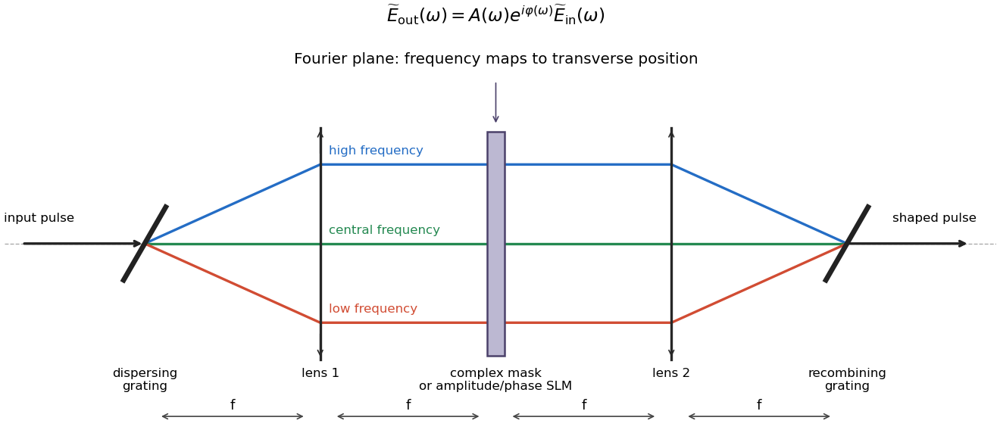

# Paper 61

↑ **Parent:** [Iii](../iii.md)

[https://www.maths.cam.ac.uk/postgrad/part-iii/files/pastpapers/2008/Paper61.pdf](https://www.maths.cam.ac.uk/postgrad/part-iii/files/pastpapers/2008/Paper61.pdf)

**Table of contents**

- [1](#1)
  - [a](#1/a)
    - [Solution](#1/a/solution)
  - [b](#1/b)
    - [Solution](#1/b/solution)
  - [c](#1/c)
    - [Solution](#1/c/solution)
  - [d](#1/d)
    - [Solution](#1/d/solution)
  - [e](#1/e)
    - [Solution](#1/e/solution)
  - [f](#1/f)
    - [Solution](#1/f/solution)
- [2](#2)
  - [a](#2/a)
    - [Solution](#2/a/solution)
  - [b](#2/b)
    - [Solution](#2/b/solution)
  - [c](#2/c)
    - [Solution](#2/c/solution)
  - [d](#2/d)
    - [Solution](#2/d/solution)
  - [e](#2/e)
    - [i](#2/e/i)
      - [Solution](#2/e/i/solution)
    - [ii](#2/e/ii)
      - [Solution](#2/e/ii/solution)
- [3](#3)
  - [a](#3/a)
    - [i](#3/a/i)
      - [Solution](#3/a/i/solution)
    - [ii](#3/a/ii)
      - [Solution](#3/a/ii/solution)
    - [iii](#3/a/iii)
      - [Solution](#3/a/iii/solution)
  - [b](#3/b)
    - [Solution](#3/b/solution)
  - [c](#3/c)
    - [Solution](#3/c/solution)
  - [d](#3/d)
    - [Solution](#3/d/solution)
- [4](#4)
  - [a](#4/a)
    - [Solution](#4/a/solution)
  - [b](#4/b)
    - [Solution](#4/b/solution)
  - [c](#4/c)
    - [Solution](#4/c/solution)
  - [d](#4/d)
    - [Solution](#4/d/solution)
  - [e](#4/e)
    - [Solution](#4/e/solution)

## 1

↑ **Parent:** [Paper 61](paper-61.md)

<h3 id="1/a">a</h3>

↑ **Parent:** [1](#1)

<h4 id="1/a/solution">Solution</h4>

↑ **Parent:** [A](#1/a)

A [reachable set](../../../control-theory.md#reachable-set) contains all states attainable from a specified initial state by admissible [control inputs](../../../control-theory.md#control-input) in the allowed times, and [controllability](../../../control-theory.md#controllability) means that every target in the declared state space is reachable from every initial state. For a closed [quantum control](../../../control-theory.md#quantum-control) system, distinguish [pure-state controllability](../../../control-theory.md#pure-state-controllability) on state rays, [density operator controllability](../../../control-theory.md#density-operator-controllability) on fixed-spectrum unitary orbits, and [unitary operator controllability](../../../control-theory.md#unitary-operator-controllability) for entire propagators. State engineering asks for a particular state transfer; process engineering asks for an entire [quantum gate](../../../quantum-circuit.md#quantum-logic-gate), which must act correctly on every input. A closed [Hamiltonian](../../../classical-mechanics.md#hamiltonian) evolution preserves density-operator [eigenvalues](../../../linear-operator-theory.md#eigenvalue), so arbitrary mixed states of different spectra cannot be connected even by a fully operator-controllable system.

<h3 id="1/b">b</h3>

↑ **Parent:** [1](#1)

<h4 id="1/b/solution">Solution</h4>

↑ **Parent:** [B](#1/b)

Assume piecewise-constant real controls with freely chosen duration, as in the usual finite-dimensional [quantum controllability](../../../control-theory.md#quantum-controllability) theorem. We can establish the strongest notion here: **the [Dynamical Lie algebra](../../../control-theory.md#dynamical-lie-algebra) is $\mathfrak u(3)$, so the system has [unitary operator controllability](../../../control-theory.md#unitary-operator-controllability)**, and consequently both pure-state and fixed-spectrum [density operator controllability](../../../control-theory.md#density-operator-controllability).

To verify the hypotheses explicitly, use [matrix units](../../../vector-space.md#matrix-unit) $E_{jk}=|j\rangle\langle k|$ and put $K_0=-iH_0$, $X_{jk}=-i(E_{jk}+E_{kj})$, $Y_{jk}=E_{jk}-E_{kj}$. Then $K_1=-iH_1=d_1X_{12}+d_2X_{23}$ and

$$
\operatorname{ad}_{K_0}^2K_1=-\omega_1^2d_1X_{12}-\omega_2^2d_2X_{23}.
$$

Since $d_1d_2\ne0$ and $\omega_1^2\ne\omega_2^2$, linear combinations of these two elements isolate $X_{12}$ and $X_{23}$. Their [commutators](../../../lie-algebra.md#commutator) with $K_0$ give $\omega_1Y_{12}$ and $-\omega_2Y_{23}$, respectively. Further [commutators](../../../lie-algebra.md#commutator) give two independent traceless diagonal generators, since $[X_{jk},Y_{jk}]=2i(E_{jj}-E_{kk})$, as well as the two $1$–$3$ generators. These eight generators span the [special unitary Lie algebra](../../../lie-algebra.md#special-unitary-lie-algebra) $\mathfrak{su}(3)$.

Finally $\operatorname{Tr}K_0=i(\omega_1+\omega_2)\ne0$. Subtract its traceless component, already in the generated algebra, to obtain a nonzero multiple of $iI$. This proves the [Lie algebra of the unitary group](../../../lie-algebra.md#unitary-lie-algebra) is all of $\mathfrak u(3)$, not merely $\mathfrak{su}(3)$. The compact-group [controllability](../../../control-theory.md#controllability) theorem then gives access to every unitary with a suitable control and some duration. This does not assert [controllability](../../../control-theory.md#controllability) at every predetermined short time or under additional bandwidth constraints. This proves that [two adjacent transitions generate the qutrit unitary Lie algebra](../../../control-theory.md#two-adjacent-transitions-generate-the-qutrit-unitary-lie-algebra).

<h3 id="1/c">c</h3>

↑ **Parent:** [1](#1)

<h4 id="1/c/solution">Solution</h4>

↑ **Parent:** [C](#1/c)

For $|D\rangle=(|1\rangle-|3\rangle)/\sqrt2$, direct multiplication gives $H_1|D\rangle=0$ and $H_0|D\rangle=-\omega|D\rangle$. It is therefore a [dark state of a driven Hamiltonian](../../../control-theory.md#dark-state-of-a-driven-hamiltonian) for every real control, and

$$
\boxed{U(t)|D\rangle=e^{i\omega t/\hbar}|D\rangle.}
$$

Starting from this state, the reachable physical ray is a singleton, so it cannot be transferred to $|2\rangle$ or any distinct ray. More generally $P_D=|D\rangle\langle D|$ commutes with both generators; hence $\operatorname{Tr}(P_D\rho)$ is conserved. The system thus fails full-qutrit [pure-state controllability](../../../control-theory.md#pure-state-controllability), [density operator controllability](../../../control-theory.md#density-operator-controllability), and [unitary operator controllability](../../../control-theory.md#unitary-operator-controllability).

This is the appropriate full-space meaning of the PDF's phrase about all senses of [controllability](../../../control-theory.md#controllability). It does not preclude control within a restricted invariant subspace: the bright state $|B\rangle=(|1\rangle+|3\rangle)/\sqrt2$ couples to $|2\rangle$ with strength $\sqrt2df(t)$, while the dark line is isolated. The [bright and dark state reduction of a star-coupled Hamiltonian](../../../quantum-mechanics.md#bright-and-dark-state-reduction-of-a-star-coupled-hamiltonian) makes that invariant decomposition explicit.

<h3 id="1/d">d</h3>

↑ **Parent:** [1](#1)

<h4 id="1/d/solution">Solution</h4>

↑ **Parent:** [D](#1/d)

Differentiate $U_I=U_0^\dagger U$. The free propagator satisfies $\dot U_0^\dagger=(i/\hbar)U_0^\dagger H_0$, so the [Schrödinger equation](../../../physics.md#schrodinger-equation) gives

$$
\begin{aligned}
i\hbar\dot U_I
&=-U_0^\dagger H_0U+U_0^\dagger(H_0+fH_1)U\\
&=fU_0^\dagger H_1U_0U_I.
\end{aligned}
$$

Thus the [interaction picture](../../../quantum-mechanics.md#interaction-picture) removes the drift and gives $\boxed{i\hbar\dot U_I=f(t)H_I(t)U_I,\quad H_I=U_0^\dagger H_1U_0}$, with $U_I(0)=I$. The transformed control [Quantum Hamiltonian](../../../quantum-mechanics.md#hamiltonian-quantum-mechanics) is time-dependent even though the original control matrix is constant.

<h3 id="1/e">e</h3>

↑ **Parent:** [1](#1)

<h4 id="1/e/solution">Solution</h4>

↑ **Parent:** [E](#1/e)

With $\hbar=1$, the free propagator is $U_0=\operatorname{diag}(e^{i\omega_1t},1,e^{i\omega_2t})$. If $E_j$ are its [Quantum Hamiltonian](../../../quantum-mechanics.md#hamiltonian-quantum-mechanics) [eigenvalues](../../../linear-operator-theory.md#eigenvalue), conjugation multiplies the $jk$ matrix element of $H_1$ by $e^{i(E_j-E_k)t}$. Therefore the [interaction picture](../../../quantum-mechanics.md#interaction-picture) [Quantum Hamiltonian](../../../quantum-mechanics.md#hamiltonian-quantum-mechanics) is

$$
\boxed{H_I(t)=\begin{pmatrix}
0&d_1e^{-i\omega_1t}&0\\
d_1e^{i\omega_1t}&0&d_2e^{i\omega_2t}\\
0&d_2e^{-i\omega_2t}&0
\end{pmatrix}.}
$$

Opposite off-diagonal phases are complex conjugates, as required by Hermiticity. The upper $2$–$3$ element has the opposite phase sign to the upper $1$–$2$ element because the middle level lies above both outer levels.

<h3 id="1/f">f</h3>

↑ **Parent:** [1](#1)

<h4 id="1/f/solution">Solution</h4>

↑ **Parent:** [F](#1/f)

Write $\cos\omega_1t=(e^{i\omega_1t}+e^{-i\omega_1t})/2$ and $\Delta\omega=\omega_2-\omega_1$. Multiplication of the matrix from part (e) gives

$$
\begin{aligned}
fH_I=\frac{A_1(t)}2\{&d_1(1+e^{-2i\omega_1t})E_{12}+d_1(1+e^{2i\omega_1t})E_{21}\\
&+d_2[e^{i\Delta\omega t}+e^{i(2\omega_1+\Delta\omega)t}]E_{23}\\
&+d_2[e^{-i\Delta\omega t}+e^{-i(2\omega_1+\Delta\omega)t}]E_{32}\}.
\end{aligned}
$$

These are exactly the constant, difference-frequency, and sum-frequency terms in the PDF, with each Hermitian pair visible. For a weak, slowly varying envelope, the terms at $2\omega_1$ and $\omega_1+\omega_2$ average out by the [rotating-wave approximation](../../../quantum-mechanics.md#rotating-wave-approximation). To discard the other transition as well, its detuning must be nonzero and large compared with the drive coupling and envelope bandwidth. Sufficient scale conditions are

$$
|A_1d_j|,\ B\ll\omega_1,\omega_2,\qquad
|A_1d_2|,\ B\ll|\Delta\omega|,
$$

where $B$ is a characteristic envelope bandwidth; turn-on transients must satisfy the same spectral restrictions. Then

$$
\boxed{fH_I\simeq\frac{A_1(t)d_1}{2}(E_{12}+E_{21}).}
$$

Small coupling compared with the optical frequencies alone is not enough for this selective approximation: if $|\Delta\omega|$ is comparable with the pulse bandwidth or Rabi scale, the spectator transition remains driven. A long selective gate also accumulates a small off-resonant Stark phase of order $(A_1d_2)^2/\Delta\omega$, so that error must be acceptable or compensated. These assumptions distinguish [resonant quantum control](../../../control-theory.md#resonant-quantum-control) from an exact decoupling.

## 2

↑ **Parent:** [Paper 61](paper-61.md)

<h3 id="2/a">a</h3>

↑ **Parent:** [2](#2)

<h4 id="2/a/solution">Solution</h4>

↑ **Parent:** [A](#2/a)

From $A^2=I$, induction gives $A^{2n}=I$ and $A^{2n+1}=A$. The [matrix exponential](../../../linear-operator-theory.md#matrix-exponential) converges absolutely in finite dimension, so its even and odd terms may be separated:

$$
e^{-i\theta A}
=\left[\sum_{n\geq0}\frac{(-1)^n\theta^{2n}}{(2n)!}\right]I
-i\left[\sum_{n\geq0}\frac{(-1)^n\theta^{2n+1}}{(2n+1)!}\right]A
=\boxed{\cos\theta\,I-i\sin\theta\,A}.
$$

This [involution exponential formula](../../../group-theory.md#involution-exponential-formula) requires no Hermiticity assumption on $A$. Hermiticity is needed if the exponential is additionally asserted to be unitary.

<h3 id="2/b">b</h3>

↑ **Parent:** [2](#2)

<h4 id="2/b/solution">Solution</h4>

↑ **Parent:** [B](#2/b)

The [Pauli matrices](../../../algebra.md#pauli-matrices) obey $\sigma_x^2=\sigma_y^2=I$ and $\sigma_x\sigma_y+\sigma_y\sigma_x=0$, so $A=\cos\phi\,\sigma_x+\sin\phi\,\sigma_y$ has $A^2=I$. Its entries are $A_{12}=\cos\phi-i\sin\phi=e^{-i\phi}$ and $A_{21}=e^{i\phi}$, with zero diagonal. Substitute this matrix into the [involution exponential formula](../../../group-theory.md#involution-exponential-formula):

$$
\boxed{e^{-i\theta A}=\begin{pmatrix}
\cos\theta&-ie^{-i\phi}\sin\theta\\
-ie^{i\phi}\sin\theta&\cos\theta
\end{pmatrix}.}
$$

The drive phase selects the transverse rotation axis, while the [quantum pulse area](../../../control-theory.md#quantum-pulse-area) selects its rotation angle.

<h3 id="2/c">c</h3>

↑ **Parent:** [2](#2)

<h4 id="2/c/solution">Solution</h4>

↑ **Parent:** [C](#2/c)

For each fixed phase $\phi_k$, the single-transition [Quantum Hamiltonian](../../../quantum-mechanics.md#hamiltonian-quantum-mechanics) is $\Omega_k(t)H_k(\phi_k)$, so its generators at different times commute. Its exact propagator depends only on $\theta_k(t)=\hbar^{-1}\int_0^t\Omega_k(\tau)d\tau$. On the active two-level subspace, $H_k^2=I$; on the spectator state, $H_k=0$. Thus it is an [embedded two-level quantum rotation](../../../control-theory.md#embedded-two-level-quantum-rotation), not an involution on the whole three-dimensional space. Explicitly,

$$
\boxed{U_1=\begin{pmatrix}
\cos\theta_1&-ie^{-i\phi_1}\sin\theta_1&0\\
-ie^{i\phi_1}\sin\theta_1&\cos\theta_1&0\\
0&0&1
\end{pmatrix},\qquad
U_2=\begin{pmatrix}
1&0&0\\
0&\cos\theta_2&-ie^{-i\phi_2}\sin\theta_2\\
0&-ie^{i\phi_2}\sin\theta_2&\cos\theta_2
\end{pmatrix}.}
$$

The spectator entries in both matrices are exactly one; the converted TeX damages the second matrix, so these entries use the PDF.

The proposed combined exponential is **false in general** for two independent envelopes. Direct multiplication gives

$$
[H_1,H_2]=e^{-i(\phi_1+\phi_2)}E_{13}-e^{i(\phi_1+\phi_2)}E_{31}\ne0,
$$

so

$$
[H(t),H(s)]=[\Omega_1(t)\Omega_2(s)-\Omega_2(t)\Omega_1(s)][H_1,H_2].
$$

The [constant pulse-axis condition for removing time ordering](../../../perturbative-quantum-field-theory.md#constant-pulse-axis-condition-for-removing-time-ordering) holds if both envelopes are proportional to the same function, but not for generic independent controls. For example, turn on only the first transition, then only the second. The result is $e^{-i\theta_2H_2}e^{-i\theta_1H_1}$, whose [Baker--Campbell--Hausdorff formula](../../../linear-operator-theory.md#baker-campbell-hausdorff-formula) includes a nonzero [commutator](../../../lie-algebra.md#commutator) correction, rather than simply $e^{-i(\theta_1H_1+\theta_2H_2)}$.

There is also a literal source defect: the PDF's right-hand exponent omits the factor $-i$ on its second term. With $\theta_1=0$ it would give $e^{\theta_2H_2}$, which has [eigenvalues](../../../linear-operator-theory.md#eigenvalue) $e^{\pm\theta_2}$ and is not unitary for real nonzero $\theta_2$, whereas the true propagator is unitary. Even after repairing that missing factor, [time ordering](../../../perturbative-quantum-field-theory.md#time-ordering) is still necessary unless the [commutators](../../../lie-algebra.md#commutator) vanish.

<h3 id="2/d">d</h3>

↑ **Parent:** [2](#2)

<h4 id="2/d/solution">Solution</h4>

↑ **Parent:** [D](#2/d)

Use pulse areas in the convention $\theta_k=\int\Omega_kdt/\hbar$, with the other channel switched off for a single-channel pulse. Substituting $\theta=\pi/2$ into part (c) shows

$$
\boxed{W_1=U_1(\pi/2,\pi/2),\qquad W_2=U_2(\pi/2,-\pi/2).}
$$

Here the arguments denote area and phase. For $W_1$, the off-diagonal factors are $-ie^{-i\pi/2}=-1$ and $-ie^{i\pi/2}=1$. For $W_2$, the phase $-\pi/2$ reverses those two signs. Thus these choices implement the gates exactly on all basis states, not only on one population.

To implement $W_4$, let $P_1=U_1(\pi/2,0)$ and $P_2=U_2(\pi/2,0)$ and apply channel 1, channel 2, then channel 1 again. Each active swap contributes $-i$, so direct tracking gives

$$
P_1P_2P_1|1\rangle=-|3\rangle,\quad
P_1P_2P_1|2\rangle=-|2\rangle,\quad
P_1P_2P_1|3\rangle=-|1\rangle.
$$

Hence $\boxed{W_4=P_1P_2P_1}$, including the overall minus sign and middle-state phase actually printed in the PDF. Alternatively equal zero-phase envelopes give $H(t)=\Omega(t)C$, where $C=E_{12}+E_{21}+E_{23}+E_{32}$. Since $C^3=2C$, its exponential is $I+[(\cos\sqrt2\theta-1)/2]C^2-i(\sin\sqrt2\theta/\sqrt2)C$. One simultaneous pulse with $\theta=\pi/\sqrt2$ gives $I-C^2=-P_{13}=W_4$.

For population transfer alone, the two zero-phase pulses $P_1$ followed by $P_2$ take $|1\rangle\mapsto-i|2\rangle\mapsto-|3\rangle$, so the target population is exactly one. If a positive final amplitude is desired, phases $\phi_1=\phi_2=\pi/2$ give $|1\rangle\mapsto|2\rangle\mapsto|3\rangle$. Both choices require area $\pi/2$ on each channel.

<h3 id="2/e">e</h3>

↑ **Parent:** [2](#2)

<h4 id="2/e/i">i</h4>

↑ **Parent:** [E](#2/e)

<h5 id="2/e/i/solution">Solution</h5>

↑ **Parent:** [I](#2/e/i)

For real nonnegative envelopes, put $\Omega=\sqrt{\Omega_1^2+\Omega_2^2}$ and choose a continuous $\theta=\operatorname{atan2}(\Omega_1,\Omega_2)$. The state $|D\rangle=\cos\theta|1\rangle-\sin\theta|3\rangle$ is dark because its two amplitudes feeding $|2\rangle$ cancel: $\Omega_1\cos\theta-\Omega_2\sin\theta=0$. The orthogonal bright combination $|B\rangle=\sin\theta|1\rangle+\cos\theta|3\rangle$ couples to $|2\rangle$ with strength $\Omega$. Thus the other [eigenstates](../../../quantum-mechanics.md#eigenstate) are $(|B\rangle\pm|2\rangle)/\sqrt2$ with energies $\pm\Omega$.

Start with $\Omega_1=0$ and $\Omega_2\ne0$, so $\theta=0$ and $|D\rangle=|1\rangle$. Slowly increase $\Omega_1/\Omega_2$ to infinity while maintaining a nonzero gap; end with $\Omega_2=0$ and $\Omega_1\ne0$, so $|D\rangle=-|3\rangle$. This target-to-intermediate pulse first is the counterintuitive ordering of [stimulated Raman adiabatic passage](../../../control-theory.md#stimulated-raman-adiabatic-passage). Its quantitative slowness condition is

$$
\boxed{\hbar|\dot\theta|\ll\Omega,\qquad
\dot\theta=\frac{\Omega_2\dot\Omega_1-\Omega_1\dot\Omega_2}{\Omega_1^2+\Omega_2^2}.}
$$

It follows from $|\langle\pm|\dot D\rangle|=|\dot\theta|/\sqrt2$ and the gap $\Omega$. Avoid switching both envelopes off while $\theta$ is changing; switch off together only after the transfer angle has become stationary. The dark [eigenvalue](../../../linear-operator-theory.md#eigenvalue) is zero, so there is no dynamical phase; with this real [eigenvector](../../../linear-operator-theory.md#eigenvector) $\langle D|\dot D\rangle=0$ as well. The ideal [adiabatic quantum control](../../../control-theory.md#adiabatic-quantum-control) therefore transfers $|1\rangle$ to $-|3\rangle$, physically the same target ray.

<h4 id="2/e/ii">ii</h4>

↑ **Parent:** [E](#2/e)

<h5 id="2/e/ii/solution">Solution</h5>

↑ **Parent:** [Ii](#2/e/ii)

The adiabatic [dark state of a driven Hamiltonian](../../../control-theory.md#dark-state-of-a-driven-hamiltonian) has exactly zero component on the lossy intermediate level throughout the ideal passage. It therefore suppresses [spontaneous emission](../../../physics.md#spontaneous-emission), whereas the two-pulse route explicitly transfers the population into $|2\rangle$ before moving it to $|3\rangle$. For an intermediate-level decay rate $\Gamma$, the leading loss probability is controlled by $\Gamma\int P_2(t)dt$. In [stimulated Raman adiabatic passage](../../../control-theory.md#stimulated-raman-adiabatic-passage), nonadiabatic leakage makes $P_2$ of order $(\hbar\dot\theta/\Omega)^2$, rather than the order-one intermediate population of the sequential swaps. Transfer is also less sensitive to precise pulse areas, provided the ordering, gap and slowness requirements hold. Making the process slower indefinitely is not always beneficial if the outer states also decohere; their coherence must survive the total passage duration.

## 3

↑ **Parent:** [Paper 61](paper-61.md)

<h3 id="3/a">a</h3>

↑ **Parent:** [3](#3)

<h4 id="3/a/i">i</h4>

↑ **Parent:** [A](#3/a)

<h5 id="3/a/i/solution">Solution</h5>

↑ **Parent:** [I](#3/a/i)

For a normalized state $|\psi(t_F;f)\rangle$ driven by the admissible control $f$, maximize

$$
\boxed{J_A[f]=\langle\psi(t_F;f)|A|\psi(t_F;f)\rangle.}
$$

Here $A$ is the specified [Hermitian operator](../../../hilbert-space.md#hermitian-operator), $t_F$ the final time, and the dependence on $f$ is through the [Schrödinger equation](../../../physics.md#schrodinger-equation). The objective is real and is exactly the desired [expectation value](../../../quantum-mechanics.md#expectation-value), so increasing it increases the requested observable. A control-resource penalty may be included when the admissible set does not already constrain field strength or fluence.

<h4 id="3/a/ii">ii</h4>

↑ **Parent:** [A](#3/a)

<h5 id="3/a/ii/solution">Solution</h5>

↑ **Parent:** [Ii](#3/a/ii)

For target [unitary operator](../../../vector-space.md#unitary-operator) $U_T$ and actual propagator $U_f(T)$ on an $n$-dimensional space, minimize the [phase-insensitive unitary gate error](../../../control-theory.md#phase-insensitive-unitary-gate-error)

$$
\boxed{J_{
m gate}[f]=1-\frac{|\operatorname{Tr}(U_T^\dagger U_f(T))|^2}{n^2}.}
$$

The [Cauchy-Schwarz inequality](../../../probability-and-statistics.md#cauchy-schwarz-inequality) for the [Hilbert-Schmidt inner product](../../../compact-operator.md#hilbert-schmidt-inner-product) gives a value in $[0,1]$, because both [unitary matrices](../../../linear-operator-theory.md#unitary-matrix) have squared [norm](../../../functional-analysis.md#norm) $n$. The error is zero exactly when the matrices are proportional, namely $U_f(T)=e^{i\phi}U_T$. It therefore tests the full process, not just its action on one state, and ignores a physically irrelevant common phase. If the gate phase itself must be fixed, instead minimize $\|U_f(T)-U_T\|_{\rm HS}^2/(2n)=1-\operatorname{Re}\operatorname{Tr}(U_T^\dagger U_f(T))/n$, which vanishes only at exact equality.

<h4 id="3/a/iii">iii</h4>

↑ **Parent:** [A](#3/a)

<h5 id="3/a/iii/solution">Solution</h5>

↑ **Parent:** [Iii](#3/a/iii)

For actual final [density operator](../../../quantum-theory.md#density-matrix) $\rho_f(t_F)$ and target $\rho_d$, minimize

$$
\boxed{J_
ho[f]=\frac12\|\rho_f(t_F)-\rho_d\|_{\rm HS}^2.}
$$

This [Hilbert-Schmidt distance](../../../compact-operator.md#hilbert-schmidt-distance) is nonnegative and is zero exactly at the target, for pure or mixed states. The subscript $f$ denotes evolution under the chosen control; $t_F$ is fixed. A simple overlap $\operatorname{Tr}(\rho_d\rho_f)$ need not have its maximum at a general mixed target, whereas this distance has the required equality condition. For purely [Quantum Hamiltonian](../../../quantum-mechanics.md#hamiltonian-quantum-mechanics) dynamics, the target must lie on the initial state's [unitary orbit of a density operator](../../../quantum-theory.md#unitary-orbit-of-a-density-operator) to attain zero error; otherwise the constrained optimization finds the closest accessible state instead.

<h3 id="3/b">b</h3>

↑ **Parent:** [3](#3)

<h4 id="3/b/solution">Solution</h4>

↑ **Parent:** [B](#3/b)

In [adaptive experimental quantum control](../../../control-theory.md#adaptive-experimental-quantum-control), parametrize a reproducible pulse by a finite real vector $c$, for example $f_c(t)=\sum_{j=1}^pc_jB_j(t)$ in a calibrated waveform basis. Prepare the same initial state for each trial, apply that pulse without feedback during the run, and estimate the objective $J(c)$ from repeated measurements. No accurate dynamical model is required if the laboratory can evaluate the objective.

One concrete algorithm is experimental finite-difference [gradient ascent](../../../numerical-analysis.md#gradient-ascent). For every parameter, run trials at $c\pm\delta e_j$ and estimate

$$
g_j\simeq\frac{\overline J(c+\delta e_j)-\overline J(c-\delta e_j)}{2\delta}.
$$

Update $c$ to an admissible projection of $c+\eta g$, test the new pulse, and reduce the step size if performance deteriorates. Averaging many shots controls statistical noise; choose $\delta$ large enough for the difference to exceed the measurement uncertainty but small enough to approximate a [derivative](../../../calculus.md#derivative). Repeat until no statistically significant improvement remains. Multiple starting pulses help explore distinct basins, but this does not guarantee a global optimum. Resource penalties and hardware restrictions belong in the objective or the admissible parameter set.

The feedback is across experimental runs: a measured objective chooses the next pulse. Each individual trial is [open-loop control](../../../control-theory.md#open-loop-control). This distinction matters because the algorithm does not require an instantaneous nondestructive state measurement on the system being controlled.

<h3 id="3/c">c</h3>

↑ **Parent:** [3](#3)

<h4 id="3/c/solution">Solution</h4>

↑ **Parent:** [C](#3/c)

For a concrete variational method, maximize the terminal-observable objective with a fluence penalty,

$$
J[f]=\langle\psi(T)|A|\psi(T)\rangle-\frac\lambda2\int_0^Tf(t)^2dt,\qquad
 i\hbar\dot\psi=(H_0+fH_1)\psi,\quad\psi(0)=\psi_0,
$$

where $\lambda>0$ weights the control cost. Enforce the dynamics with a complex [costate](../../../control-theory.md#costate) $|\chi(t)\rangle$ and the real augmented functional

$$
\mathcal J=J-2\operatorname{Re}\int_0^T\left\langle\chi\left|\dot\psi+\frac i\hbar(H_0+fH_1)\psi\right.\right\rangle dt.
$$

Variation of $\chi$ restores the state equation. Integrate the $\dot\psi$ variation by parts; because $\delta\psi(0)=0$, the terminal coefficient gives $\chi(T)=A\psi(T)$, and the interior coefficient gives

$$
i\hbar\dot\chi=(H_0+fH_1)\chi.
$$

This equation has final data, so it is integrated backward. Variation of the real control gives the [variational costate gradient for Hamiltonian quantum control](../../../control-theory.md#variational-costate-gradient-for-hamiltonian-quantum-control)

$$
\boxed{\frac{\delta J}{\delta f(t)}=\frac2\hbar\operatorname{Im}\langle\chi(t)|H_1|\psi(t)\rangle-\lambda f(t).}
$$

In particular an unconstrained stationary pulse satisfies $f(t)=2\operatorname{Im}\langle\chi|H_1|\psi\rangle/(\lambda\hbar)$. The state, adjoint and control equations form a coupled two-boundary-value problem, so the stationarity formula is not an independent explicit solution for $f$.

Use [direct-adjoint looping](../../../control-theory.md#direct-adjoint-looping): start from an admissible pulse, propagate the state forward, set the terminal [costate](../../../control-theory.md#costate), propagate it backward, compute the [gradient](../../../calculus.md#gradient) on the time grid, and update the pulse with an ascent step and line search. Project amplitude bounds and impose bandwidth constraints within the parametrization or update. Repeat until the projected [gradient](../../../calculus.md#gradient) is small. For gate objectives the forward variable is the propagator and the [costate](../../../control-theory.md#costate) is matrix-valued; for mixed-state objectives it is the [density operator](../../../quantum-theory.md#density-matrix). [Gradient ascent pulse engineering](../../../control-theory.md#gradient-ascent-pulse-engineering) applies the same efficient forward/backward differentiation to time-slice amplitudes. The variational conditions identify local stationary controls and require numerical convergence checks; they do not prove global optimality of a nonconvex control landscape.

<h3 id="3/d">d</h3>

↑ **Parent:** [3](#3)

<h4 id="3/d/solution">Solution</h4>

↑ **Parent:** [D](#3/d)

A [4f pulse shaper](../../../optics.md#4f-pulse-shaper) supplies an experimental realization of [spectral pulse shaping](../../../optics.md#spectral-pulse-shaping). A first [diffraction grating](../../../optics.md#diffraction-grating) separates the frequencies of a broadband coherent pulse; a lens maps them to distinct transverse positions in its back focal plane. Place an amplitude-and-phase mask, or calibrated [spatial light modulator](../../../optics.md#spatial-light-modulator) with appropriate polarization optics, in that Fourier plane. A second lens and grating recombine the shaped spectrum into one output beam. The original schematic below shows the frequency channels and the four focal-length separations.

**[Figure 1](#3/d/image-original-4f-spectral-pulse-shaping-schematic-showing-dispersing-and-recombining-gratings-two-lenses-and-a-frequency-resolved-complex-mask). Original 4f spectral pulse-shaping schematic showing dispersing and recombining gratings, two lenses, and a frequency-resolved complex mask**.

If the mask is $M(\omega)=A(\omega)e^{i\varphi(\omega)}$, then $\widetilde E_{\rm out}=M\widetilde E_{\rm in}$. In principle choose $M=\widetilde E_{\rm target}/\widetilde E_{\rm in}$ wherever the input spectrum is nonzero and recover the temporal waveform by inverse [Fourier transform](../../../analysis.md#fourier-transform). Set the desired real physical field by conjugate symmetry of its positive and negative frequency components; its envelope and carrier phase implement the optimized control in the appropriate interaction frame.

A passive mask cannot amplify spectral components or create frequencies absent from the input, so the desired waveform must respect available bandwidth and may need overall rescaling or amplification elsewhere. Finite spectral resolution limits the useful temporal window, while total bandwidth limits the shortest temporal features. A phase-only modulator cannot in general implement independent amplitude and phase shaping without extra optics. These are hardware admissibility constraints, not corrections supplied by the variational calculation after the fact.

## 4

↑ **Parent:** [Paper 61](paper-61.md)

<h3 id="4/a">a</h3>

↑ **Parent:** [4](#4)

<h4 id="4/a/solution">Solution</h4>

↑ **Parent:** [A](#4/a)

The feedback law printed in the PDF is not sufficient for the asserted monotonicity. We first derive the exact identity, then give a counterexample and the corrected law. Both [density operators](../../../quantum-theory.md#density-matrix) evolve unitarily, so $\operatorname{Tr}\rho^2$ and $\operatorname{Tr}\rho_d^2$ are constant. Thus

$$
V=\|\rho-\rho_d\|_{\rm HS}^2=\operatorname{Tr}\rho^2+\operatorname{Tr}\rho_d^2-2\operatorname{Tr}(\rho_d\rho).
$$

Cyclicity of the [trace](../../../linear-algebra.md#matrix-trace) gives $\operatorname{Tr}([-iH_0,\rho_d]\rho)=-\operatorname{Tr}(\rho_d[-iH_0,\rho])$. These drift terms cancel in the [derivative](../../../calculus.md#derivative) of the overlap, leaving

$$
\frac d{dt}\operatorname{Tr}(\rho_d\rho)=fC,\qquad
C=\operatorname{Tr}(\rho_d[-iH_1,\rho]),\qquad
\boxed{\dot V=-2fC.}
$$

Here $C$ is real: $-i[H_1,\rho]$ is Hermitian, and the [trace](../../../linear-algebra.md#matrix-trace) of the product of two [Hermitian matrices](../../../hilbert-space.md#hermitian-operator) is real. This is the [Hilbert-Schmidt Lyapunov feedback identity](../../../control-theory.md#hilbert-schmidt-lyapunov-feedback-identity).

For a direct counterexample to the source's overlap law, take $H_0=0$, $H_1=\sigma_y/2$, $\rho_d=(I+\sigma_z)/2$ and $\rho=(I+\sigma_x)/2$. All are admissible qubit operators and states. The printed overlap is $f=\operatorname{Tr}(\rho_d\rho)=1/2$, but $-i[H_1,\rho]=-\sigma_z/2$ gives $C=-1/2$. Hence $\dot V=1/2>0$: the distance initially increases. This proves that [feedback based on state overlap need not be stabilizing](../../../control-theory.md#feedback-based-on-state-overlap-need-not-be-stabilizing).

The intended [Lyapunov quantum control](../../../control-theory.md#lyapunov-quantum-control) replaces the overlap by its control-direction [derivative](../../../calculus.md#derivative):

$$
\boxed{f=k\operatorname{Tr}(\rho_d[-iH_1,\rho]),\quad k>0,
\qquad\dot V=-2kC^2\leq0.}
$$

The conclusion is nonincrease, not strict decrease or automatic convergence. For example, opposite computational-basis [pure states](../../../quantum-theory.md#pure-state), diagonal $H_0$, and $H_1=\sigma_x$ give $C=0$ and zero control even though $V=2$. Target convergence requires further invariant-set and reachability conditions. A target with a different spectrum is also inaccessible under [Quantum Hamiltonian](../../../quantum-mechanics.md#hamiltonian-quantum-mechanics) evolution. The density-operator [derivatives](../../../calculus.md#derivative) in the governing equations use the dots visible in the PDF, which the TeX loses.

<h3 id="4/b">b</h3>

↑ **Parent:** [4](#4)

<h4 id="4/b/solution">Solution</h4>

↑ **Parent:** [B](#4/b)

The deterministic law cannot be transplanted unchanged into [measurement-based quantum feedback](../../../control-theory.md#measurement-based-quantum-feedback). Evaluating its state-dependent scalar requires knowledge of the current [quantum state](../../../quantum-mechanics.md#quantum-state). In fact $C=\operatorname{Tr}(i[H_1,\rho_d]\rho)$ is the [expectation value](../../../quantum-mechanics.md#expectation-value) of a Hermitian observable, but that expectation cannot be obtained exactly from a single system without measurement backaction. Tomography uses many independently prepared copies, not a nondisturbing readout of one evolving state.

Continuous weak measurements can supply a noisy record and a conditional state estimate, but then the state follows stochastic measurement dynamics with additional disturbance and decoherence, rather than the closed unitary equation used in part (a). A new stochastic stability analysis is required. One may instead simulate the corrected [Lyapunov quantum control](../../../control-theory.md#lyapunov-quantum-control) from known initial data and apply its waveform as [open-loop control](../../../control-theory.md#open-loop-control), or learn a pulse across repeated experiments as in Question 3. Those procedures do not constitute real-time state feedback on a single quantum trajectory. The separate source error in part (a) remains: even ideal knowledge of the state would not make its printed overlap law monotone.

<h3 id="4/c">c</h3>

↑ **Parent:** [4](#4)

<h4 id="4/c/solution">Solution</h4>

↑ **Parent:** [C](#4/c)

Assume $\gamma>0$ and zero initial cavity amplitude. Taking [Laplace transforms](../../../analysis.md#laplace-transform) gives

$$
(s+\gamma/2)\widetilde a=-\sqrt\gamma\,\widetilde b_0,
\qquad \widetilde b_1=\sqrt\gamma\,\widetilde a+\widetilde b_0.
$$

Eliminating the mode yields the [passive cavity input-output transfer function](../../../control-theory.md#passive-cavity-input-output-transfer-function)

$$
\boxed{\widetilde b_1=G(s)\widetilde b_0,\qquad
G(s)=1-\frac\gamma{s+\gamma/2}=\frac{s-\gamma/2}{s+\gamma/2}.}
$$

Its unique pole is $s=-\gamma/2$, so the cavity's internal mode decays and its causal input-output response is stable. A nonzero initial amplitude would add $\sqrt\gamma\,a(0)/(s+\gamma/2)$ to the output, a decaying transient.

For a precise [Nyquist stability criterion](../../../control-theory.md#nyquist-stability-criterion) interpretation of this open cavity, rewrite the mode equation as an integrator with negative state feedback. Its return ratio is $L(s)=(\gamma/2)/s$, and its characteristic equation is $1+L(s)=0$. The frequency locus $L(i\omega)=-i\gamma/(2\omega)$ lies on the imaginary axis. The Nyquist indentation excluding the pole at the origin maps to a large semicircle in the right half-plane; the whole contour has no winding around $-1$. There are no right-half-plane open-loop poles within that indented contour, so there are no unstable characteristic zeros. There is also no zero-frequency characteristic root, since the physical characteristic polynomial is $s+\gamma/2$. This recovers asymptotic stability.

Do not use the plant $G$ as a return ratio without specifying an additional feedback connection. Indeed

$$
G(i\omega)=\frac{\omega^2-(\gamma/2)^2+i\gamma\omega}{\omega^2+(\gamma/2)^2},\qquad |G(i\omega)|=1,
$$

and its locus passes through $-1$ at $\omega=0$. That would indicate a marginal mode for a new unity-negative-feedback loop with characteristic factor $1+G$, but not instability of the original cavity. Part (e) supplies the actual return ratio $\alpha G$ for the beam-splitter network.

<h3 id="4/d">d</h3>

↑ **Parent:** [4](#4)

<h4 id="4/d/solution">Solution</h4>

↑ **Parent:** [D](#4/d)

The [beam splitter](../../../optics.md#beam-splitter) relation and the cavity output equation give

$$
b_0=\beta b_{
m in}-\alpha(\sqrt\gamma\,a+b_0),
\qquad (1+\alpha)b_0=\beta b_{
m in}-\alpha\sqrt\gamma\,a.
$$

For $\alpha\ne-1$, solve this scalar algebraic relation and substitute back:

$$
\boxed{b_0=\frac\beta{1+\alpha}b_{
m in}-\frac{\alpha\sqrt\gamma}{1+\alpha}a,\qquad
b_1=\frac\beta{1+\alpha}b_{
m in}+\frac{\sqrt\gamma}{1+\alpha}a.}
$$

The cavity equation becomes

$$
\boxed{\dot a=\frac{\gamma(\alpha-1)}{2(1+\alpha)}a-\frac{\beta\sqrt\gamma}{1+\alpha}b_{
m in}.}
$$

Finally, use the other beam-splitter output and $\alpha^2+\beta^2=1$:

$$
b_2=\alpha b_{
m in}+\beta b_1
=\left(\alpha+\frac{\beta^2}{1+\alpha}\right)b_{
m in}
+\frac{\beta\sqrt\gamma}{1+\alpha}a
=\boxed{b_{
m in}+\frac{\beta\sqrt\gamma}{1+\alpha}a}.
$$

These derivations retain the printed input $b_{
m in}$ in both beam-splitter equations; the converted TeX changes one of these subscripts. Define $\gamma_{
m eff}=\gamma(1-\alpha)/(1+\alpha)$ and $c=\beta\sqrt\gamma/(1+\alpha)$, so $\dot a=-\gamma_{
m eff}a/2-cb_{
m in}$ and $b_2=b_{
m in}+ca$. In the nondegenerate range $|\alpha|<1$, $\gamma_{
m eff}>0$ and $c^2=\gamma_{
m eff}$, the expected passive input-output relation. This is [instantaneous coherent cavity feedback through a beam splitter](../../../control-theory.md#instantaneous-coherent-cavity-feedback-through-a-beam-splitter); it uses the zero-delay interconnection assumed by the equations.

<h3 id="4/e">e</h3>

↑ **Parent:** [4](#4)

<h4 id="4/e/solution">Solution</h4>

↑ **Parent:** [E](#4/e)

The stated $M$ is specifically the transfer from the external input to the internal field $b_1$. Combining $b_1=Gb_0$ with $b_0=\beta b_{
m in}-\alpha b_1$ gives

$$
\boxed{\frac{\widetilde b_1}{\widetilde b_{
m in}}=M(s)=\frac{\beta G(s)}{1+\alpha G(s)}
=\frac\beta{1+\alpha}\frac{s-\gamma/2}{s+\gamma_{
m eff}/2}.}
$$

For $\gamma>0$ and a nondegenerate [beam splitter](../../../optics.md#beam-splitter) $|\alpha|<1$, the closed-loop pole is $-\gamma_{
m eff}/2<0$. The return ratio for the [Nyquist stability criterion](../../../control-theory.md#nyquist-stability-criterion) is $L=\alpha G$. Its frequency locus is a circle of radius $|\alpha|<1$, so it cannot reach or encircle $-1$. The open cavity has no unstable poles; hence the closed loop has none. This agrees with the directly derived state damping rate.

The externally accessible output is different. From $b_2=\alpha b_{
m in}+\beta b_1$,

$$
\boxed{\frac{\widetilde b_2}{\widetilde b_{
m in}}
=\alpha+\beta M=\frac{\alpha+G}{1+\alpha G}
=\frac{s-\gamma_{
m eff}/2}{s+\gamma_{
m eff}/2}.}
$$

It is again an all-pass cavity response. Confusing $b_1$ and $b_2$ would give the wrong output steady state.

For a constant coherent input mean $B=\langle b_{
m in}\rangle$, the steady mean cavity amplitude follows by setting its [derivative](../../../calculus.md#derivative) to zero:

$$
\boxed{\langle a\rangle_{
m ss}=-\frac{2\beta}{\sqrt\gamma(1-\alpha)}B,
\quad\langle b_0\rangle_{
m ss}=\frac\beta{1-\alpha}B,
\quad\langle b_1\rangle_{
m ss}=-\frac\beta{1-\alpha}B,
\quad\langle b_2\rangle_{
m ss}=-B.}
$$

The input-output values also follow from $G(0)=-1$ and $M(0)=-\beta/(1-\alpha)$. For any initial mean amplitude, its difference from the stationary mean decays as $e^{-\gamma_{
m eff}t/2}$.

The stability statement needs endpoint qualifications. At $\alpha=1$, normalization forces $\beta=0$, and the cavity obeys $\dot a=0$: it is isolated and undamped, not asymptotically stable. Its external output is nevertheless the decoupled input. At $\alpha=-1$, the algebraic elimination divides by zero; the instantaneous feedback connection is singular and is not a well-posed instance of these reduced equations. Thus strict cavity stability holds for $|\alpha|<1$, not for every real pair satisfying only $\alpha^2+\beta^2=1$.

Finally, $b_{
m in}(t)$ is a quantum stochastic field, so arbitrary inputs do not approach a literal time-independent operator amplitude. The stationary expressions above describe a constant coherent drive's means, or the formal zero-frequency response. The full solution contains the filtered input-noise convolution

$$
a(t)=e^{-\gamma_{
m eff}t/2}a(0)-c\int_0^te^{-\gamma_{
m eff}(t-s)/2}b_{
m in}(s)\,ds.
$$

The stationary cavity [density operator](../../../quantum-theory.md#density-matrix) also depends on the input noise statistics. For this ideal passive cavity with a coherent drive and vacuum noise, it is the coherent state with the amplitude just calculated; without such input statistics, the gain function alone does not specify a complete stationary [quantum state](../../../quantum-mechanics.md#quantum-state).

## ↑ Ancestors (8)

1. [Iii](../iii.md)
2. [2008](../../2008.md)
3. [Past exam of the mathematics course of the University of Cambridge](../../../past-exam-of-the-mathematics-course-of-the-university-of-cambridge.md)
4. [Mathematics course of the University of Cambridge](../../../university-of-cambridge.md#mathematics-course-of-the-university-of-cambridge)
5. [Course of the University of Cambridge](../../../university-of-cambridge.md#course-of-the-university-of-cambridge)
6. [University of Cambridge](../../../university-of-cambridge.md)
7. [List of universities](../../../README.md#list-of-universities)
8. [Codex Wiki](../../../README.md)
