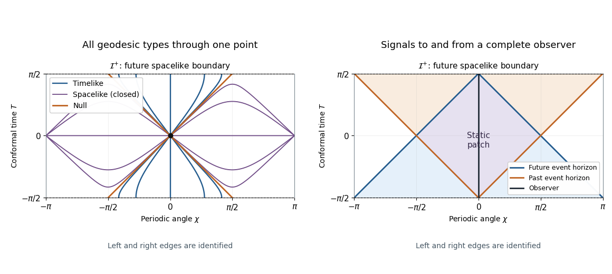

<h1 id="4/solution">Solution</h1>

↑ **Parent:** [4](../4.md)

For the full unit-radius [two-dimensional de Sitter spacetime](../../../../../two-dimensional-de-sitter-spacetime.md), the coordinate ranges are

$$
\boxed{t\in\mathbb R,\qquad \chi\in\mathbb R/(2\pi\mathbb Z).}
$$

One can use $0\leq\chi<2\pi$ with endpoints identified. If the identification is omitted, the same line element describes the universal covering spacetime instead. The periodicity follows from the [hyperboloid](../../../../../hyperboloid.md) embedding

$$
X^0=\sinh t,\qquad X^1=\cosh t\cos\chi,\qquad X^2=\cosh t\sin\chi,
\qquad (X^0)^2-(X^1)^2-(X^2)^2=-1.
$$

The induced ambient [Minkowski metric](../../../../../minkowski-metric.md) is precisely the given [Lorentzian metric](../../../../../lorentzian-metric.md).

Using an [affine parameter](../../../../../affine-parameter.md) $s$, the [geodesic Lagrangian](../../../../../geodesic-lagrangian.md) is $\tfrac12(\dot t^2-\cosh^2t\,\dot\chi^2)$. The nonzero [Christoffel symbols](../../../../../christoffel-symbol.md) are

$$
\Gamma^t{}_{\chi\chi}=\sinh t\cosh t,
\qquad \Gamma^\chi{}_{t\chi}=\Gamma^\chi{}_{\chi t}=\tanh t.
$$

Thus the [geodesic equations](../../../../../geodesic-equation.md) and their [first integrals](../../../../../first-integral.md) are

$$
\boxed{\ddot t+\sinh t\cosh t\,\dot\chi^2=0,
\qquad \ddot\chi+2\tanh t\,\dot t\dot\chi=0,}
$$

$$
J=\cosh^2t\,\dot\chi=\mathrm{constant},
\qquad \dot t^2-\frac{J^2}{\cosh^2t}=\varepsilon,
\qquad \varepsilon\in\{1,0,-1\}.
$$

Here $\varepsilon=1$ for unit-speed [timelike geodesics](../../../../../timelike-geodesic.md), $0$ for [null geodesics](../../../../../null-geodesic.md) and $-1$ for unit-speed [spacelike geodesics](../../../../../spacelike-geodesic.md). The conserved $J$ is the [geodesic conserved quantity from a Killing vector](../../../../../geodesic-conserved-quantity-from-a-killing-vector.md) for the angular symmetry.

All [geodesics of two-dimensional de Sitter spacetime](../../../../../geodesics-of-two-dimensional-de-sitter-spacetime.md) can be written especially simply in the embedding. If $P$ is the initial point and $V$ the initial tangent, with $P^2=-1$, $P\cdot V=0$, $V^2=\varepsilon$, the geodesic has normal ambient acceleration $X''=\varepsilon X$. Therefore

$$
X(s)=
\begin{cases}
P\cosh s+V\sinh s,&\varepsilon=1,\\
P+sV,&\varepsilon=0,\\
P\cos s+V\sin s,&\varepsilon=-1.
\end{cases}
$$

These curves stay in the two-plane spanned by $P$ and $V$, preserve both constraints and have no tangential acceleration. They consequently solve the [geodesic equation](../../../../../geodesic-equation.md) and exhaust all initial directions.

An [isometry](../../../../../isometry.md) can move the chosen point to $P=(0,1,0)$, namely $(t,\chi)=(0,0)$. For future-directed [timelike geodesics](../../../../../timelike-geodesic.md) take $V=(\cosh\alpha,0,\sinh\alpha)$, obtaining

$$
\sinh t=\cosh\alpha\sinh s,
\qquad \tan\chi=\sinh\alpha\tanh s.
$$

The continuous angular branch has $|\chi|<\pi/2$, and every real $\alpha$ gives a distinct timelike direction. The two [null geodesics](../../../../../null-geodesic.md) have $V=(1,0,\pm1)$ and

$$
\sinh t=s,\qquad \tan\chi=\pm s.
$$

For [spacelike geodesics](../../../../../spacelike-geodesic.md) take $V=(\sinh\alpha,0,\cosh\alpha)$, giving

$$
\sinh t=\sinh\alpha\sin s,
\quad \cosh t\cos\chi=\cos s,
\quad \cosh t\sin\chi=\cosh\alpha\sin s.
$$

They are closed with period $2\pi$ in affine arclength and $|t|\leq|\alpha|$. In particular, $\alpha=0$ is the equatorial geodesic $t=0$. These three families, with reversals of parametrization allowed, are the requested complete set through the chosen point.

The [conformal time](../../../../../conformal-time.md) substitution gives

$$
T=2\arctan(e^t)-\frac\pi2,
\qquad \sin T=\tanh t,
\qquad \cos T=\operatorname{sech}t,
\qquad \frac{dT}{dt}=\operatorname{sech}t.
$$

Hence

$$
\boxed{ds^2=\sec^2T(dT^2-d\chi^2),
\qquad -\frac\pi2<T<\frac\pi2,\quad\chi\sim\chi+2\pi.}
$$

Multiplying by $\cos^2T$ gives the regular [conformal cylinder of two-dimensional de Sitter spacetime](../../../../../conformal-cylinder-of-two-dimensional-de-sitter-spacetime.md). Adding $T=\pm\pi/2$ completes the [conformal compactification](../../../../../conformal-compactification.md); both boundary circles are spacelike. [Null geodesics](../../../../../null-geodesic.md) are straight lines $\chi=\pm T$ through the origin. The other families have the useful diagram equations

$$
\chi(T)=\arcsin(\tanh\alpha\sin T)\quad\text{for timelike geodesics},
\qquad T(\chi)=\arcsin(\tanh\alpha\sin\chi)\quad\text{for spacelike geodesics}.
$$

The image sketches representative directions from each family; the formulas allow all intermediate directions.

**[Figure 1](#4/image-geodesics-through-one-point-and-observer-horizons-on-the-two-dimensional-de-sitter-conformal-cylinder). Geodesics through one point and observer horizons on the two-dimensional de Sitter conformal cylinder**.

For the complete observer $\chi=0$, let $d(\chi,0)\in[0,\pi]$ be the shortest angular distance on the circle. Since light travels one unit of angular distance per unit [conformal time](../../../../../conformal-time.md), an event at $(T,\chi)$ can signal to the observer at some finite future time precisely when

$$
\boxed{d(\chi,0)<\frac\pi2-T.}
$$

Equality defines its future [observer event horizon](../../../../../observer-event-horizon.md). Likewise an event can receive a signal emitted by the observer precisely when

$$
\boxed{d(\chi,0)<T+\frac\pi2,}
$$

and equality defines the past horizon. In the lift $-\pi\leq\chi\leq\pi$, their branches are $\chi=\pm(\pi/2-T)$ and $\chi=\pm(T+\pi/2)$. The common communication region is the diamond $|\chi|+|T|<\pi/2$, the observer's [static patch of de Sitter spacetime](../../../../../static-patch-of-de-sitter-spacetime.md). These are the [observer horizons in two-dimensional de Sitter spacetime](../../../../../observer-horizons-in-two-dimensional-de-sitter-spacetime.md). Every complete timelike observer has analogous horizons after a [de Sitter isometry](../../../../../de-sitter-isometry.md); they depend on the observer, rather than enclosing an intrinsic black-hole region.

Despite these horizons, each constant-$T$ circle is a [Cauchy hypersurface](../../../../../cauchy-surface.md) of the full spacetime: any inextendible [causal curve](../../../../../causal-curve.md) crosses it exactly once. The global spacetime is therefore [globally hyperbolic](../../../../../globally-hyperbolic-spacetime.md) and has no [Cauchy horizons](../../../../../cauchy-horizon.md). The conformal boundaries lie at infinite proper time for complete [timelike geodesics](../../../../../timelike-geodesic.md) and infinite affine distance for complete [null geodesics](../../../../../null-geodesic.md), so their finite height in the diagram is not a physical incompleteness.

## ↑ Ancestors (10)

1. [4](../4.md)
2. [Paper 63](../../paper-63-split.md)
3. [Iii](../../split.md)
4. [2008](../../../split.md)
5. [Past exam of the mathematics course of the University of Cambridge](../../../../split.md)
6. [Mathematics course of the University of Cambridge](../../../../../mathematics-course-of-the-university-of-cambridge.md)
7. [Course of the University of Cambridge](../../../../../course-of-the-university-of-cambridge.md)
8. [University of Cambridge](../../../../../university-of-cambridge-split.md)
9. [List of universities](../../../../../list-of-universities.md)
10. [Codex Wiki](../../../../../split.md)
