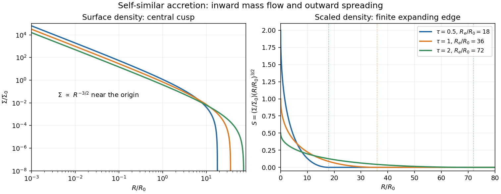

<h1 id="2/b/solution">Solution</h1>

↑ **Parent:** [B](../b.md)

This part uses source-free [viscous evolution of an accretion disk](../../../../../../viscous-evolution-of-an-accretion-disk.md). Put $R=R_0x^2$ and $\Sigma=\Sigma_0x^{-3}S$. The prescribed [kinematic viscosity](../../../../../../kinematic-viscosity.md) then becomes

$$
\nu=\nu_0(Sx^{-3})^{1/2}x^{9/2}=\nu_0S^{1/2}x^3,
$$

so $\nu\Sigma R^{1/2}=\nu_0\Sigma_0R_0^{1/2}xS^{3/2}$. Since $\partial_R=(2R_0x)^{-1}\partial_x$, the [Keplerian viscous diffusion equation](../../../../../../keplerian-viscous-diffusion-equation.md) gives

$$
\Sigma_0x^{-3}\partial_tS
=\frac{3\nu_0\Sigma_0}{4R_0^2}x^{-3}\partial_x^2(xS^{3/2}).
$$

Canceling the prefactor and setting $\tau=3\nu_0t/(4R_0^2)$ proves

$$
\boxed{\partial_\tau S=\partial_x^2(xS^{3/2}).}
$$

Use the [similarity ansatz](../../../../../../similarity-ansatz.md) $S=\tau^{-1}f(\xi)$ with $\xi=x/\sqrt\tau$. Derivatives at fixed $x$ give

$$
\partial_\tau S=\tau^{-2}\left(-f-\frac\xi2f'\right),\qquad
\partial_x^2(xS^{3/2})=\tau^{-2}(\xi f^{3/2})''.
$$

On the branch $1-k\xi\geq0$, substitute $f=(1-k\xi)^2$. The two expressions reduce to

$$
-f-\frac\xi2f'=-1+3k\xi-2k^2\xi^2,
$$

$$
(\xi f^{3/2})''=(\xi(1-k\xi)^3)''
=-6k+18k^2\xi-12k^3\xi^2.
$$

Equality of the constant coefficients requires $\boxed{k=1/6}$, and then the other coefficients agree as well.

The physical [compact self-similar disk with square-root density viscosity](../../../../../../compact-self-similar-disk-with-square-root-density-viscosity.md) uses this branch up to its outer edge and vacuum beyond it:

$$
\boxed{S(x,\tau)=\frac1\tau\left(1-\frac{x}{6\sqrt\tau}\right)_+^2,\qquad\tau>0.}
$$

Here $(u)_+=\max(u,0)$ is the [positive part](../../../../../../positive-part-of-a-real-valued-function.md). The cutoff matters: beyond $\xi=6$, the untruncated squared expression would have $f^{3/2}=|1-\xi/6|^3$, and its right-hand side would no longer be the polynomial used above. At the moving edge, $S$ vanishes quadratically and $xS^{3/2}$ vanishes cubically. The latter and its first derivative match the vacuum values continuously, so joining to zero creates no distributional mass-flux source. The joined profile satisfies the equation, including in the weak sense at the edge.

Returning to the [surface density](../../../../../../surface-density-of-a-disk.md) gives the explicit result

$$
\boxed{\Sigma(R,\tau)=\frac{\Sigma_0}{\tau}
\left(\frac{R}{R_0}\right)^{-3/2}
\left(1-\frac{\sqrt{R/R_0}}{6\sqrt\tau}\right)^2,
\quad0<R<36R_0\tau,}
$$

with $\Sigma=0$ for $R\geq36R_0\tau$. Thus the outer edge is $\boxed{R_e=36R_0\tau}$ and moves linearly in physical time, with speed $27\nu_0/R_0$. The density decreases monotonically with radius, has an integrable $R^{-3/2}$ central cusp, and drops quadratically to zero at the outer edge. The formal origin boundary has zero [viscous torque in an accretion disk](../../../../../../viscous-torque-in-an-accretion-disk.md), because $\nu\Sigma\sqrt R\to0$ there, even though the [surface density](../../../../../../surface-density-of-a-disk.md) diverges.

To characterize the spreading, let $a=6\sqrt\tau$ and integrate in $x$. The disk mass and [angular momentum](../../../../../../angular-momentum.md) are

$$
\begin{aligned}
M_d&=2\pi\int_0^{R_e}\Sigma R\,dR
=\frac{4\pi\Sigma_0R_0^2}{\tau}\int_0^a(1-x/a)^2\,dx
=\boxed{8\pi\Sigma_0R_0^2\tau^{-1/2}},\\
J_d&=2\pi\int_0^{R_e}\Sigma R\sqrt{GMR}\,dR
=\frac{4\pi\Sigma_0R_0^2\sqrt{GMR_0}}{\tau}\int_0^ax(1-x/a)^2\,dx
=\boxed{12\pi\Sigma_0R_0^2\sqrt{GMR_0}}.
\end{aligned}
$$

The mass decreases while the [angular momentum](../../../../../../angular-momentum.md) remains constant: matter accretes at the origin and the remaining disk spreads outward. More explicitly, with $u=x/(6\sqrt\tau)$, the inward [mass flux](../../../../../../mass-flux.md) is

$$
F_M=3\pi\nu_0\Sigma_0\tau^{-3/2}(1-u)^2(1-4u).
$$

It is inward for $u<1/4$ and outward for $u>1/4$. The dividing radius is $9R_0\tau/4$, and the origin flux $3\pi\nu_0\Sigma_0\tau^{-3/2}$ equals $-dM_d/dt$. The outer edge carries no flux beyond itself. This family is a self-similar accreting disk with finite mass at each positive time, rather than a regular finite-mass initial profile at $\tau=0$.

**[Figure 1](#2/b/image-surface-density-and-scaled-surface-density-of-the-compact-self-similar-accretion-disc-at-three-times). Surface density and scaled surface density of the compact self-similar accretion disc at three times**.

## ↑ Ancestors (11)

1. [B](../b.md)
2. [2](../../2.md)
3. [Paper 71](../../../paper-71-split.md)
4. [Iii](../../../split.md)
5. [2008](../../../../split.md)
6. [Past exam of the mathematics course of the University of Cambridge](../../../../../split.md)
7. [Mathematics course of the University of Cambridge](../../../../../../mathematics-course-of-the-university-of-cambridge.md)
8. [Course of the University of Cambridge](../../../../../../course-of-the-university-of-cambridge.md)
9. [University of Cambridge](../../../../../../university-of-cambridge-split.md)
10. [List of universities](../../../../../../list-of-universities.md)
11. [Codex Wiki](../../../../../../split.md)
