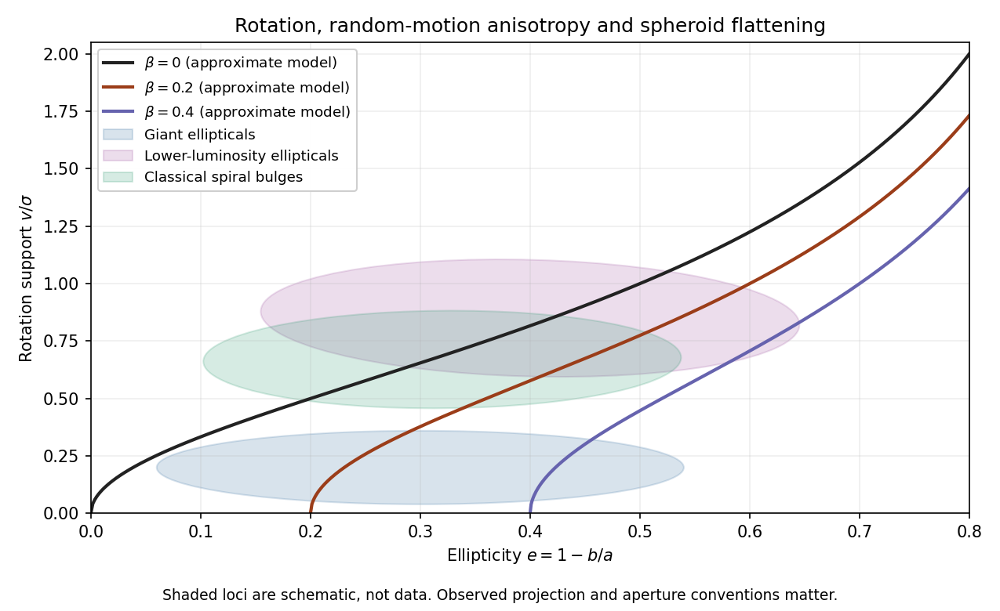

<h1 id="2/ii/solution">Solution</h1>

↑ **Parent:** [Ii](../ii.md)

The [rotation-anisotropy diagram](../../../../../../rotation-anisotropy-diagram.md) below uses the [oblate-rotator flattening proxy](../../../../../../oblate-rotator-flattening-proxy.md) for $\beta=0,0.2,0.4$. Each curve starts at $e=\beta$ and rises as $e$ increases. The plotted domains cover typical spheroid values, roughly $0\le e\lesssim0.7$ and $0\le v/\sigma\lesssim1.5$, with the upper axis extended to show the reference curve's rise. The shaded regions are schematic overlapping populations, not measurements or sharp classification boundaries.

**[Figure 1](#2/ii/image-approximate-rotation-anisotropy-curves-and-schematic-elliptical-galaxy-and-bulge-populations). Approximate rotation-anisotropy curves and schematic elliptical-galaxy and bulge populations**.

Giant [elliptical galaxies](../../../../../../elliptical-galaxy.md) commonly have low ordered rotation for their observed flattening, lying below the [oblate isotropic rotator](../../../../../../oblate-isotropic-rotator.md) reference. Anisotropic [velocity dispersions](../../../../../../velocity-dispersion.md) and, in many cases, triaxial structure provide support. Lower-luminosity [elliptical galaxies](../../../../../../elliptical-galaxy.md) are more commonly rotating, disky systems near the isotropic reference. Classical [galactic bulges](../../../../../../galactic-bulge.md) of [spiral galaxies](../../../../../../spiral-galaxy.md) often overlap this rotating-spheroid locus; disk-like bulges can be more strongly rotation supported. These are population trends with substantial overlap, not universal rules for individual [galaxies](../../../../../../galaxy-split.md).

Observations usually use projected ellipticity and a line-of-sight rotation measure such as peak speed divided by a central [velocity dispersion](../../../../../../velocity-dispersion.md). The intrinsic $e$ and global dispersions used in the derivation are different quantities. Inclination, apertures, and unresolved streaming can change both coordinates. Consequently **a point below the reference suggests extra random-motion support, but does not uniquely measure $\beta$.**

## ↑ Ancestors (11)

1. [Ii](../ii.md)
2. [2](../../2.md)
3. [Paper 72](../../../paper-72-split.md)
4. [Iii](../../../split.md)
5. [2008](../../../../split.md)
6. [Past exam of the mathematics course of the University of Cambridge](../../../../../split.md)
7. [Mathematics course of the University of Cambridge](../../../../../../mathematics-course-of-the-university-of-cambridge.md)
8. [Course of the University of Cambridge](../../../../../../course-of-the-university-of-cambridge.md)
9. [University of Cambridge](../../../../../../university-of-cambridge-split.md)
10. [List of universities](../../../../../../list-of-universities.md)
11. [Codex Wiki](../../../../../../split.md)
