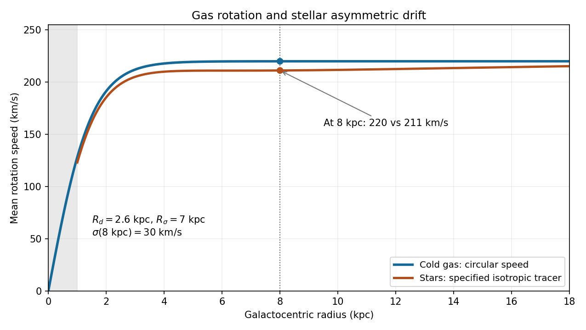

<h1 id="2/iv/solution">Solution</h1>

↑ **Parent:** [Iv](../iv.md)

For a concrete Milky-Way-like illustration, take

$$
V_c(R)=220\tanh(R/1.5\,\mathrm{kpc})\,\mathrm{km\,s^{-1}},\quad R_d=2.6\,\mathrm{kpc},\quad R_\sigma=7\,\mathrm{kpc},
$$

and isotropic tracer [velocity dispersion](../../../../../../velocity-dispersion.md)

$$
\sigma(R)=30\exp\left[-\frac{R-8\,\mathrm{kpc}}{2R_\sigma}\right]\,\mathrm{km\,s^{-1}}.
$$

With local tracer density $\nu\propto e^{-R/R_d}$, the [exponential-disk asymmetric drift](../../../../../../exponential-disk-asymmetric-drift.md) then predicts

$$
\bar v_\phi(R)=\left[V_c^2(R)-\sigma^2(R)R\left(\frac1{R_d}+\frac1{R_\sigma}\right)\right]^{1/2}.
$$

The sketch shows the cold gas following $V_c$, rising in the inner galaxy and becoming approximately flat, while the stellar curve sits below it. Only radii $R\ge1\,\mathrm{kpc}$ are used for the stellar approximation; a central [galactic bulge](../../../../../../galactic-bulge.md) needs a separate model.

**[Figure 2](#2/iv/image-milky-way-like-cold-gas-circular-rotation-and-a-stellar-rotation-curve-with-explicitly-specified-asymmetric-drift). Milky-Way-like cold-gas circular rotation and a stellar rotation curve with explicitly specified asymmetric drift**.

At $R=8\,\mathrm{kpc}$, $A\simeq4.22$ and $\sigma=30\,\mathrm{km\,s^{-1}}$, giving **gas speed about $220\,\mathrm{km\,s^{-1}}$, stellar speed about $211\,\mathrm{km\,s^{-1}}$, and a lag about $9\,\mathrm{km\,s^{-1}}$**. These are representative scales for the requested schematic, not a fit to the [Milky Way](../../../../../../milky-way.md). Hotter old [stellar populations](../../../../../../stellar-population.md) would have a larger lag: doubling this dispersion at the same radius gives a stellar speed about $182\,\mathrm{km\,s^{-1}}$. The specified radial laws and isotropy make the example reproducible while retaining the qualifications in the preceding derivation.

## ↑ Ancestors (11)

1. [Iv](../iv.md)
2. [2](../../2.md)
3. [Paper 72](../../../paper-72-split.md)
4. [Iii](../../../split.md)
5. [2008](../../../../split.md)
6. [Past exam of the mathematics course of the University of Cambridge](../../../../../split.md)
7. [Mathematics course of the University of Cambridge](../../../../../../mathematics-course-of-the-university-of-cambridge.md)
8. [Course of the University of Cambridge](../../../../../../course-of-the-university-of-cambridge.md)
9. [University of Cambridge](../../../../../../university-of-cambridge-split.md)
10. [List of universities](../../../../../../list-of-universities.md)
11. [Codex Wiki](../../../../../../split.md)
