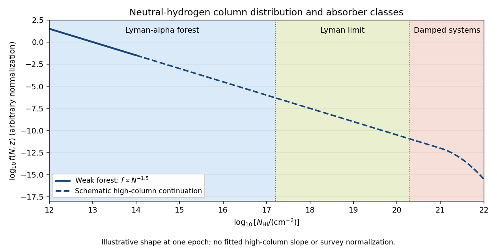

<h1 id="3/i/solution">Solution</h1>

↑ **Parent:** [I](../i.md)

The neutral-hydrogen [column density](../../../../../../column-density.md) is $N_{\rm HI}=\int n_{\rm HI}\,d\ell$, with units $\mathrm{cm}^{-2}$. Define the [neutral-hydrogen column-density distribution](../../../../../../neutral-hydrogen-column-density-distribution.md) by

$$
f(N,z)=\frac{\partial^2\mathcal N}{\partial N\,\partial z},
\qquad d\mathcal N=f(N,z)\,dN\,dz.
$$

Here $\mathcal N$ counts absorption systems along a [quasar](../../../../../../quasar.md) sightline. A histogram per logarithmic column interval instead measures $N\ln(10)f(N,z)$; forgetting this factor changes the inferred slope. Another common convention uses the [absorption distance](../../../../../../absorption-distance.md) $X$, with $dX/dz=H_0(1+z)^2/H(z)$, and $f_X=f/(dX/dz)$.

At a fixed epoch, weak [Lyman-alpha forest](../../../../../../lyman-alpha-forest.md) lines have an approximately falling power-law distribution, $f(N,z)\simeq A(z)N^{-\beta}$ with $\beta\simeq1.4$–$1.5$ over representative low-column ranges. Stronger absorbers deviate from one universal slope, and the normalization and fitted slopes depend on epoch and sample. The low-column fit is measured, for example, in [Kim and collaborators' forest survey](https://arxiv.org/abs/astro-ph/0101005). The sketch distinguishes that empirical low-column trend from an illustrative higher-column continuation.

**[Figure 1](#3/i/image-neutral-hydrogen-column-density-distribution-with-forest-lyman-limit-and-damped-system-thresholds). Neutral-hydrogen column-density distribution with forest, Lyman-limit and damped-system thresholds**.

Ordinary [Lyman-alpha forest](../../../../../../lyman-alpha-forest.md) lines cover roughly $10^{12}\lesssim N_{\rm HI}\lesssim10^{17.2}\,\mathrm{cm}^{-2}$. They are numerous resonant [Lyman-alpha absorption](../../../../../../lyman-alpha-absorption.md) features from intervening gas at different [cosmological redshifts](../../../../../../cosmological-redshift.md), collectively resembling a forest in a [quasar](../../../../../../quasar.md) spectrum. Many are optically thin at the ionization edge even when their line centers are saturated.

A [Lyman limit system](../../../../../../lyman-limit-system.md) becomes optically thick at the $91.2\,\mathrm{nm}$ hydrogen ionization edge. With $\sigma_{912}\simeq6.3\times10^{-18}\,\mathrm{cm}^2$, $\tau_{912}=N_{\rm HI}\sigma_{912}\gtrsim1$ requires

$$
N_{\rm HI}\gtrsim1.6\times10^{17}\,\mathrm{cm}^{-2}\simeq10^{17.2}\,\mathrm{cm}^{-2}.
$$

Its spectrum consequently has a strong continuum decrement below the redshifted Lyman edge. In a classification separating the highest columns, [Lyman limit systems](../../../../../../lyman-limit-system.md) extend up to the damped-system boundary.

A [damped Lyman-alpha system](../../../../../../damped-lyman-alpha-system.md) conventionally has $N_{\rm HI}\gtrsim2\times10^{20}\,\mathrm{cm}^{-2}$. Its [Lyman-alpha absorption](../../../../../../lyman-alpha-absorption.md) is sufficiently strong that the Lorentzian wings of the [Voigt profile](../../../../../../voigt-profile.md) are prominent. “Damped” refers to the finite radiative lifetime of the atomic excited state, not an inference that the gas has a high [temperature](../../../../../../temperature.md). These systems trace substantial neutral reservoirs, usually associated with [galaxies](../../../../../../galaxy-split.md).

## ↑ Ancestors (11)

1. [I](../i.md)
2. [3](../../3.md)
3. [Paper 73](../../../paper-73-split.md)
4. [Iii](../../../split.md)
5. [2008](../../../../split.md)
6. [Past exam of the mathematics course of the University of Cambridge](../../../../../split.md)
7. [Mathematics course of the University of Cambridge](../../../../../../mathematics-course-of-the-university-of-cambridge.md)
8. [Course of the University of Cambridge](../../../../../../course-of-the-university-of-cambridge.md)
9. [University of Cambridge](../../../../../../university-of-cambridge-split.md)
10. [List of universities](../../../../../../list-of-universities.md)
11. [Codex Wiki](../../../../../../split.md)
