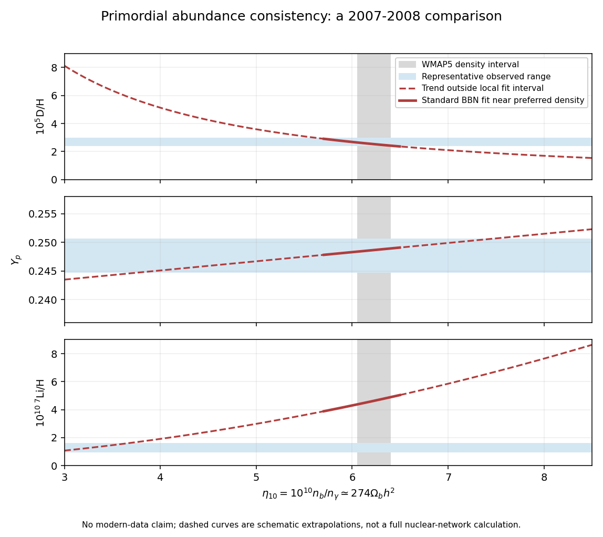

<h1 id="4/iii/b/solution">Solution</h1>

↑ **Parent:** [B](../b.md)

In standard [Big Bang nucleosynthesis](../../../../../../../big-bang-nucleosynthesis.md), with the radiation content and reaction rates fixed, the main adjustable abundance parameter is the [baryon-to-photon ratio](../../../../../../../baryon-to-photon-ratio.md) $\eta$. The [baryon-density consistency between nucleosynthesis and the microwave background](../../../../../../../baryon-density-consistency-between-nucleosynthesis-and-the-microwave-background.md) uses

$$
\eta_{10}=10^{10}\eta\simeq274\,\Omega_{b,0}h^2,
\qquad H_0=100h\,\mathrm{km\,s^{-1}\,Mpc^{-1}}.
$$

Increasing [cosmological baryon density](../../../../../../../cosmological-baryon-density.md) makes deuterium burn more efficiently, so D/H falls steeply. The [primordial helium mass fraction](../../../../../../../primordial-helium-mass-fraction.md) grows only slowly, because its dominant control is the surviving neutron fraction. Near the observationally favored density, lithium-7 production, much of it initially as beryllium-7, rises with density. At lower densities the full lithium curve has a valley; the sketch focuses on the branch relevant to the baryon-density comparison.

For the historical meaning of “current” in this 2008 paper, representative 2007–2008 fits near $\eta_{10}\simeq6$ are

$$
10^5\mathrm{D/H}\simeq2.68(6/\eta_{10})^{1.6},
\qquad Y_p\simeq0.2483+0.0016(\eta_{10}-6),
\qquad 10^{10}\,{}^7\mathrm{Li/H}\simeq4.30(\eta_{10}/6)^2.
$$

These local fits, with nuclear-rate uncertainties, and representative D/H and lithium ranges are documented in [Steigman's 2007 nucleosynthesis analysis](https://arxiv.org/abs/0712.1100). They are not a replacement for a nuclear network outside their calibrated range.

**[Figure 2](#4/iii/b/image-2007-2008-primordial-abundance-trends-and-observational-ranges-compared-with-the-wmap-baryon-density). 2007–2008 primordial abundance trends and observational ranges compared with the WMAP baryon density**.

The [cosmic microwave background](../../../../../../../cosmic-microwave-background.md) acoustic peak pattern measures baryon loading at recombination, independently of the abundance measurements. For example, [the five-year WMAP cosmological analysis](https://arxiv.org/abs/0803.0547) gives $\Omega_{b,0}h^2=0.02273\pm0.00062$ from WMAP alone, corresponding to $\eta_{10}\simeq6.23\pm0.17$. For $h\simeq0.7$, this is $\Omega_{b,0}\simeq0.046$. Galaxy-cluster baryon fractions combined with independent total-matter density provide another, more astrophysically model-dependent cross-check.

At $\eta_{10}\simeq6.2$, the fitted predictions are D/H $\simeq2.5\times10^{-5}$, $Y_p\simeq0.249$, and ${}^7\mathrm{Li/H}\simeq4.6\times10^{-10}$. A representative observed D/H range around $(2.7\pm0.3)\times10^{-5}$ overlaps the prediction; its inferred density $\eta_{10}\simeq6.0\pm0.4$ is compatible with the [cosmic microwave background](../../../../../../../cosmic-microwave-background.md). The helium result $Y_p=0.2477\pm0.0029$ from [the 2007 helium analysis](https://arxiv.org/abs/astro-ph/0701580) also agrees. Other helium analyses had lower central values, illustrating why ionization and temperature systematics matter.

In contrast, a representative plateau estimate $12+\log_{10}({}^7\mathrm{Li/H})\simeq2.1\pm0.1$ corresponds to roughly $(1.0$–$1.6)\times10^{-10}$, a factor of several below the prediction at the same density. This is the [cosmological lithium problem](../../../../../../../cosmological-lithium-problem.md). The three abundance ranges therefore should not all be described as exact simultaneous agreement: **deuterium and helium broadly support the independently measured baryon density, while lithium has a substantial discrepancy**. The plotted ranges explicitly refer to the 2007–2008 comparison, not present-day parameter estimates.

## ↑ Ancestors (12)

1. [B](../b.md)
2. [Iii](../../iii.md)
3. [4](../../../4.md)
4. [Paper 73](../../../../paper-73-split.md)
5. [Iii](../../../../split.md)
6. [2008](../../../../../split.md)
7. [Past exam of the mathematics course of the University of Cambridge](../../../../../../split.md)
8. [Mathematics course of the University of Cambridge](../../../../../../../mathematics-course-of-the-university-of-cambridge.md)
9. [Course of the University of Cambridge](../../../../../../../course-of-the-university-of-cambridge.md)
10. [University of Cambridge](../../../../../../../university-of-cambridge-split.md)
11. [List of universities](../../../../../../../list-of-universities.md)
12. [Codex Wiki](../../../../../../../split.md)
