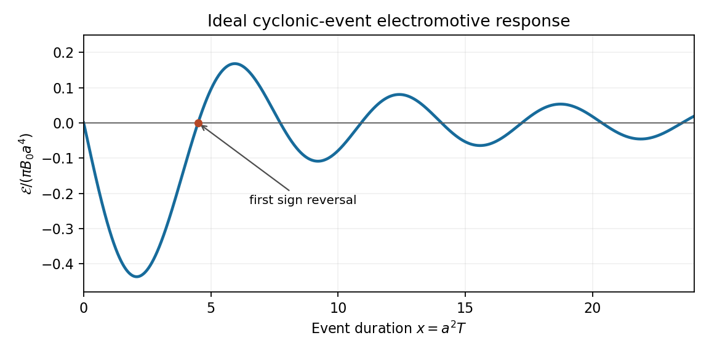

<h1 id="2/solution">Solution</h1>

↑ **Parent:** [2](../2.md)

The ansatz gives $B_r=A_\phi/r$, $B_\phi=-A_r$, and $B_z=B$. Initially $A=B_0r\sin\phi$ and $B=0$, since $B_r=B_0\cos\phi$ and $B_\phi=-B_0\sin\phi$ are a uniform Cartesian field. In [ideal magnetohydrodynamics](../../../../../ideal-magnetohydrodynamics.md), the transverse flux function is advected, while the axial field is stretched by the axial [velocity](../../../../../velocity.md) [gradient](../../../../../gradient.md). More explicitly, the transverse induction equations are equivalent to $(\partial_t+f\partial_\phi)A=0$; the axial component of $\partial_t\mathbf B+\mathbf u\cdot\nabla\mathbf B=\mathbf B\cdot\nabla\mathbf u$ is $(\partial_t+f\partial_\phi)B=B_rg'$. Substituting the azimuthal mode therefore gives

$$
\partial_t\widehat A+if\widehat A=0,\qquad\partial_t\widehat B+if\widehat B=i\frac{g'}r\widehat A.
$$

The initial coefficients are $\widehat A(r,0)=B_0r$ and $\widehat B(r,0)=0$. Multiplication by $e^{ift}$ integrates both equations, giving $\widehat A=B_0r e^{-ift}$ and $\widehat B=iB_0tg'e^{-ift}$. Thus the [ideal magnetic response to a cylindrical cyclonic event](../../../../../ideal-magnetic-response-to-a-cylindrical-cyclonic-event.md) at its end is

$$
\boxed{A(r,\phi,T)=B_0r\sin(\phi-f(r)T),\qquad B(r,\phi,T)=B_0Tg'(r)\cos(\phi-f(r)T).}
$$

With ideal induction these fields remain frozen after the flow is switched off. The EMF calculated below is the active-flow value at $T^-$; at $T^+$ the [velocity](../../../../../velocity.md) itself is zero.

In cylindrical components, $\mathbf u\times\mathbf B=(rfB+gA_r)\widehat{\mathbf r}+(gA_\phi/r)\widehat{\boldsymbol\phi}-fA_\phi\widehat{\mathbf z}$. Put $\psi=\phi-fT$. Since $A_r=B_0(\sin\psi-rTf'\cos\psi)$, its Cartesian $x$-component reduces to

$$
(\mathbf u\times\mathbf B)_x=B_0\left[rT(fg'-gf')\cos\phi\cos\psi-g\sin(fT)\right].
$$

Use $\int_0^{2\pi}\cos\phi\cos(\phi-fT)d\phi=\pi\cos(fT)$ and the area element $r\,dr\,d\phi$. The [integrated electromotive response of a finite cyclonic event](../../../../../integrated-electromotive-response-of-a-finite-cyclonic-event.md) is

$$
\boxed{\mathcal E(T)=\pi B_0\int_0^\infty\left[Tr^2(fg'-gf')\cos(fT)-2rg\sin(fT)\right]dr.}
$$

When the boundary term vanishes, the last two terms combine as $-g\,\partial_r[r^2\sin(fT)]$, giving the useful equivalent [integral](../../../../../integral.md)

$$
\mathcal E(T)=\pi B_0\int_0^\infty r^2g'[\sin(fT)+Tf\cos(fT)]dr.
$$

For the compactly supported profile, $fg'-gf'=0$ on $0<r<a$. Substitution of $v=a^2-r^2$ into the first [integral](../../../../../integral.md) gives

$$
\mathcal E(T)=-\pi B_0\int_0^{a^2}v\sin(vT)dv=\boxed{\pi B_0\left[\frac{a^2\cos(a^2T)}T-\frac{\sin(a^2T)}{T^2}\right].}
$$

At zero the continuous limiting value is zero, and $\mathcal E(T)=-\pi B_0a^6T/3+O(T^3)$. For $B_0>0$ it begins negative; the nonzero zeros satisfy $\tan(a^2T)=a^2T$, the first at $a^2T\simeq4.4934$. It then alternates sign, with an asymptotic $1/T$ envelope. The requested sketch uses $x=a^2T$ and scales the EMF by $\pi B_0a^4$:

**[Figure 1](#2/image-sign-changes-of-the-ideal-cyclonic-event-electromotive-response). Sign changes of the ideal cyclonic-event electromotive response**.

This sign alternation is possible even though the flow has fixed-sign [kinetic helicity](../../../../../hydrodynamical-helicity.md). Indeed, its [vorticity](../../../../../vorticity.md) components are $(0,-g',2f+rf')$, so $\mathbf u\cdot\boldsymbol\omega=2fg+r(gf'-fg')$, which reduces to $2f^2\geq0$ for this profile. The finite-duration response retains winding and phase information; it cannot be assigned a universal sign from the instantaneous helicity alone.

A small [magnetic diffusivity](../../../../../magnetic-diffusivity.md) replaces the ideal mode equations by

$$
\partial_t\widehat A+if\widehat A=\eta D_1\widehat A,\qquad\partial_t\widehat B+if\widehat B=i\frac{g'}r\widehat A+\eta D_1\widehat B,\quad D_1=\partial_r^2+r^{-1}\partial_r-r^{-2}.
$$

[Differential rotation](../../../../../differential-rotation.md) creates radial phase [gradients](../../../../../gradient.md) of order $Tf'$, so the resistive damping rate grows like $\eta T^2f'^2$. Locally, [magnetic phase mixing under differential rotation](../../../../../magnetic-phase-mixing-under-differential-rotation.md) gives an accumulated damping factor of order $e^{-\eta f'^2T^3/3}$. Thus the ideal result is a good early-time approximation but [diffusion](../../../../../diffusion.md) eventually limits winding and stretching, smooths the sharp field gradients at $r=a$, and modifies the later EMF oscillations. Small [diffusion](../../../../../diffusion.md) does not immediately remove all finite-time sign reversals, and a long-time resistive response requires the diffusive boundary-value problem rather than the ideal formula. After the event, the remaining distorted field relaxes by [diffusion](../../../../../diffusion.md) toward the imposed uniform background.

## ↑ Ancestors (10)

1. [2](../2.md)
2. [Paper 74](../../paper-74-split.md)
3. [Iii](../../split.md)
4. [2008](../../../split.md)
5. [Past exam of the mathematics course of the University of Cambridge](../../../../split.md)
6. [Mathematics course of the University of Cambridge](../../../../../mathematics-course-of-the-university-of-cambridge.md)
7. [Course of the University of Cambridge](../../../../../course-of-the-university-of-cambridge.md)
8. [University of Cambridge](../../../../../university-of-cambridge-split.md)
9. [List of universities](../../../../../list-of-universities.md)
10. [Codex Wiki](../../../../../split.md)
