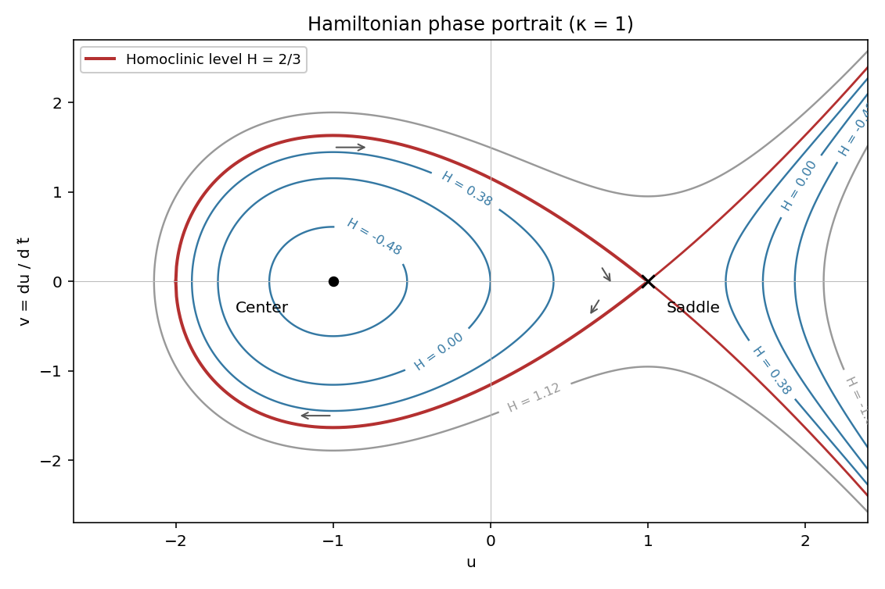

<h1 id="1/b/solution">Solution</h1>

↑ **Parent:** [B](../b.md)

With the stated time rescaling, $\dot x=\varepsilon^3u'$ and $\ddot x=\varepsilon^4u''$, where primes refer to $\widetilde t$. Dividing by $\varepsilon^4$ gives

$$
u''=u^2-\kappa-\varepsilon(\lambda+u)u'.
$$

At $\varepsilon=0$, put $v=u'$ and define the [Hamiltonian](../../../../../../hamiltonian.md)

$$
\boxed{H(u,v)=\frac12v^2+\kappa u-\frac13u^3.}
$$

Its [orbital derivative](../../../../../../orbital-derivative.md) is $H'=v(u^2-\kappa)+(\kappa-u^2)v=0$, so this is a [conserved quantity](../../../../../../conserved-quantity.md). The [Hamiltonian system](../../../../../../hamiltonian-system.md) has $u'=H_v=v$, $v'=-H_u=u^2-\kappa$.

For $\kappa>0$, set $s=\sqrt\kappa$. The potential $U(u)=\kappa u-u^3/3$ has a minimum at $-s$ and a maximum at $s$. The corresponding [center equilibrium](../../../../../../center-equilibrium.md) and [saddle equilibrium](../../../../../../saddle-equilibrium.md) have energies $H_c=-2s^3/3$ and $H_s=2s^3/3$. Levels $H_c<H<H_s$ contain closed ovals around $(-s,0)$, as well as separate unbounded components on the right. At $H=H_s$, the center's ovals limit to a [homoclinic orbit](../../../../../../homoclinic-orbit.md) to the saddle, turning at $u=-2s$. Its equation is

$$
v^2=\frac23(u-s)^2(u+2s),\qquad -2s\leq u\leq s,
\qquad \boxed{H_{\mathrm{hom}}=\frac23\kappa^{3/2}.}
$$

The same energy also has external unbounded saddle separatrices for $u>s$. Levels above $H_s$ pass over the potential barrier and are open. Along the upper halves $u'=v>0$, so the closed loops are traversed clockwise. If $\kappa=0$, the two critical points coalesce into a degenerate [equilibrium](../../../../../../equilibrium-point-of-a-dynamical-system.md); if $\kappa<0$, the potential is strictly decreasing and there is no center or homoclinic loop.

**[Figure 1](#1/b/image-hamiltonian-level-curves-for-kappa-equal-to-one-showing-the-center-saddle-and-homoclinic-loop). Hamiltonian level curves for kappa equal to one, showing the center, saddle and homoclinic loop**.

## ↑ Ancestors (11)

1. [B](../b.md)
2. [1](../../1.md)
3. [Paper 78](../../../paper-78-split.md)
4. [Iii](../../../split.md)
5. [2008](../../../../split.md)
6. [Past exam of the mathematics course of the University of Cambridge](../../../../../split.md)
7. [Mathematics course of the University of Cambridge](../../../../../../mathematics-course-of-the-university-of-cambridge.md)
8. [Course of the University of Cambridge](../../../../../../course-of-the-university-of-cambridge.md)
9. [University of Cambridge](../../../../../../university-of-cambridge-split.md)
10. [List of universities](../../../../../../list-of-universities.md)
11. [Codex Wiki](../../../../../../split.md)
