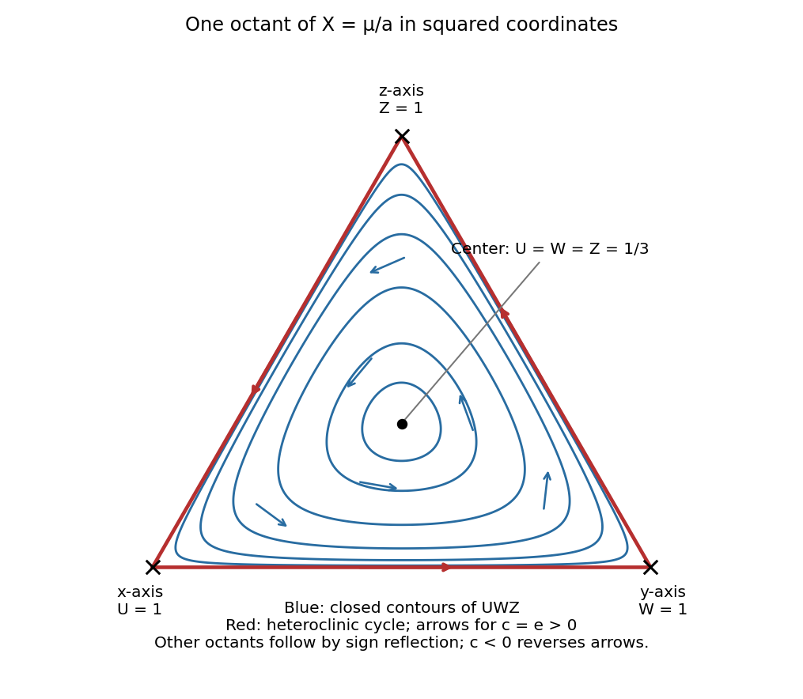

<h1 id="3/e/solution">Solution</h1>

↑ **Parent:** [E](../e.md)

Write $Q=x^2y^2+y^2z^2+z^2x^2$ and $V=xyz$. Direct differentiation of the cubic [amplitude equations](../../../../../../amplitude-equation.md) gives

$$
\dot X=2\mu X-2aX^2+2(e-c)Q,\qquad
\dot V=V\bigl(3\mu-(3a+c-e)X\bigr).
$$

When $c=e$, these reduce to $\dot X=2X(\mu-aX)$ and $\dot V=3V(\mu-aX)$. Therefore, wherever $X>0$,

$$
\boxed{\frac d{dt}\left(\frac{V}{X^{3/2}}\right)=0.}
$$

This conserved directional quantity is nonconstant in every neighborhood of a nonzero [equilibrium](../../../../../../equilibrium-point-of-a-dynamical-system.md). If such an [equilibrium](../../../../../../equilibrium-point-of-a-dynamical-system.md) were [asymptotically stable](../../../../../../asymptotic-stability.md), all sufficiently nearby initial points would approach it, forcing their conserved values to equal its value. That is impossible. The origin is unstable since its linearization is $\mu I$ with $\mu>0$. Hence **there are no [asymptotically stable](../../../../../../asymptotic-stability.md) [equilibria](../../../../../../equilibrium-point-of-a-dynamical-system.md) when $c=e$** in the displayed cubic system. For $c=e=0$ the sphere is entirely [equilibria](../../../../../../equilibrium-point-of-a-dynamical-system.md), so its individual points still cannot be [asymptotically stable](../../../../../../asymptotic-stability.md).

The radial equation attracts every nonzero radius toward $X=R^2=\mu/a$. On this invariant sphere, with $c=e$, the remaining motion is

$$
\dot x=cx(z^2-y^2),\quad
\dot y=cy(x^2-z^2),\quad
\dot z=cz(y^2-x^2),\qquad V=\text{constant}.
$$

For $c\ne0$, the six coordinate-axis points are saddles on the sphere. The eight equal-magnitude points $|x|=|y|=|z|=R/\sqrt3$ are centers of the restricted motion. In each open octant the regular level curves of $V$ are closed loops around that octant's center. The coordinate planes, where $V=0$, form [heteroclinic orbits](../../../../../../heteroclinic-orbit.md) joining the axis saddles. In the positive octant, for $c>0$ the boundary orientation is $x\text{-axis}\to y\text{-axis}\to z\text{-axis}\to x\text{-axis}$; for $c<0$ all arrows reverse. Sign reflections give the other octants.

The following sketch uses normalized squared coordinates $U=x^2/R^2$, $W=y^2/R^2$, $Z=z^2/R^2$, with $U+W+Z=1$. This is a one-to-one coordinate representation of each closed spherical octant, so its triangle depicts the sphere's trajectories without hiding a hemisphere. The center is $U=W=Z=1/3$, and the interior loops are contours of $UWZ$. This is the [conserved octant dynamics of a cyclic amplitude system](../../../../../../conserved-octant-dynamics-of-a-cyclic-amplitude-system.md).

**[Figure 2](#3/e/image-phase-portrait-of-one-octant-of-the-invariant-sphere-in-normalized-squared-coordinates-with-closed-orbits-and-a-heteroclinic-boundary-cycle). Phase portrait of one octant of the invariant sphere in normalized squared coordinates, with closed orbits and a heteroclinic boundary cycle**.

## ↑ Ancestors (11)

1. [E](../e.md)
2. [3](../../3.md)
3. [Paper 78](../../../paper-78-split.md)
4. [Iii](../../../split.md)
5. [2008](../../../../split.md)
6. [Past exam of the mathematics course of the University of Cambridge](../../../../../split.md)
7. [Mathematics course of the University of Cambridge](../../../../../../mathematics-course-of-the-university-of-cambridge.md)
8. [Course of the University of Cambridge](../../../../../../course-of-the-university-of-cambridge.md)
9. [University of Cambridge](../../../../../../university-of-cambridge-split.md)
10. [List of universities](../../../../../../list-of-universities.md)
11. [Codex Wiki](../../../../../../split.md)
