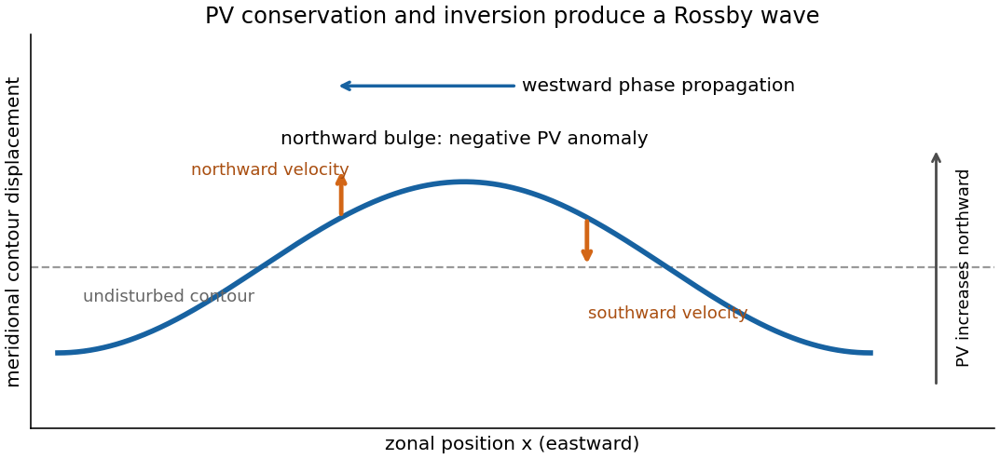

<h1 id="3/solution">Solution</h1>

↑ **Parent:** [3](../3.md)

Let $\zeta$ denote free-surface height and $h=\zeta-b$ the water depth. The inviscid rotating [shallow water equations](../../../../../shallow-water-equations.md) with constant [Coriolis parameter](../../../../../coriolis-parameter.md) $f$ are

$$
D_Hu-fv=-g\zeta_x,\qquad D_Hv+fu=-g\zeta_y,
\qquad h_t+(hu)_x+(hv)_y=0,
\qquad D_H=\partial_t+u\partial_x+v\partial_y.
$$

It is $\zeta$, not $h$, that supplies the horizontal pressure gradient. For a fixed bottom, mass conservation equivalently gives $D_Hh=-h(u_x+v_y)$.

Write $\xi=v_x-u_y$ for relative [vorticity](../../../../../vorticity.md). Differentiate the second momentum equation in $x$ and the first in $y$, then subtract. The pressure terms cancel. Expanding the differentiated advection terms gives

$$
D_H\xi+(\xi+f)(u_x+v_y)=0.
$$

Consequently the [absolute vorticity](../../../../../absolute-vorticity.md) $q_a=\xi+f$ satisfies $D_Hq_a=-q_a\nabla_H\cdot\mathbf u_H$. Combining this with mass conservation yields exact [shallow-water potential vorticity](../../../../../shallow-water-potential-vorticity.md) conservation:

$$
\boxed{D_H(q_a/h)=\frac{hD_Hq_a-q_aD_Hh}{h^2}=0.}
$$

A sloping bottom changes the depth and hence the stretching, but contributes no curl to the gravitational pressure force.

For the [quasi-geostrophic approximation](../../../../../quasi-geostrophic-approximation.md), choose constant reference depth $H_0$, speed $U$, and horizontal length $L$. Require [Rossby number](../../../../../rossby-number.md) $\operatorname{Ro}=U/(|f|L)\ll1$, slow evolution on the advective time $L/U$, smooth horizontal scales, and $L/L_D=O(1)$ or smaller, where $L_D=\sqrt{gH_0}/|f|$ is the [Rossby deformation radius](../../../../../rossby-deformation-radius.md). Write $\zeta=\zeta_0+\eta$, $b=b_0+\delta b$, and $h=H_0+\eta-\delta b$. The leading momentum balance is [geostrophic balance](../../../../../geostrophic-balance.md):

$$
u_g=-\psi_y,\qquad v_g=\psi_x,\qquad \psi=g\eta/f.
$$

It gives $\eta/H_0=O(\operatorname{Ro}(L/L_D)^2)$, while we require $\delta b/H_0=O(\operatorname{Ro})$ and slopes on the chosen horizontal scale. Relative [vorticity](../../../../../vorticity.md) divided by $f$ is also $O(\operatorname{Ro})$. Thus

$$
\frac{q_a}{h}=\frac f{H_0}+\frac1{H_0}
\left(\nabla_H^2\psi-\frac f{H_0}\eta+\frac f{H_0}\delta b\right)
+O\left(\operatorname{Ro}^2\frac{|f|}{H_0}\right).
$$

The derivative of the constant first term vanishes. In advecting the first-order anomaly, the [ageostrophic flow](../../../../../ageostrophic-flow.md) contributes only at the next order. Therefore the [shallow-water quasi-geostrophic potential vorticity](../../../../../shallow-water-quasi-geostrophic-potential-vorticity.md) equation is

$$
\boxed{q=\nabla_H^2\psi-L_D^{-2}\psi+\frac f{H_0}\delta b,
\qquad q_t+J(\psi,q)=0,\qquad J(\psi,q)=\psi_xq_y-\psi_yq_x.}
$$

This retains the balanced vortical branch, including [Rossby waves](../../../../../rossby-wave.md) driven here by the topographic [potential-vorticity gradient](../../../../../potential-vorticity-gradient.md). It filters the freely oscillating inertia–gravity branches of the full [shallow water equations](../../../../../shallow-water-equations.md), and does not retain independent boundary [Kelvin wave](../../../../../kelvin-wave.md) dynamics. Small [Rossby number](../../../../../rossby-number.md) alone is insufficient for the reduction: fast waves must be absent at leading order, as in well-prepared balanced initial data.

In the channel take $H_0=h_{00}$ and measure the bottom anomaly from mid-channel: $\delta b=\varepsilon(y-L/2)$. Define $\beta=\varepsilon f/H_0$. The resting [potential vorticity](../../../../../potential-vorticity.md) is $\beta(y-L/2)$, and the linear [Rossby wave](../../../../../rossby-wave.md) equation is

$$
\partial_t(\nabla_H^2-L_D^{-2})\psi+\beta\psi_x=0.
$$

For nonzero zonal [wavenumber](../../../../../wavenumber.md) $k$, wall conditions $\psi=0$ select

$$
\boxed{\psi=\operatorname{Re}\{A\sin(n\pi y/L)e^{i(kx-\omega t)}\},
\qquad \omega=-\frac{\beta k}{k^2+(n\pi/L)^2+L_D^{-2}},\quad n=1,2,\ldots.}
$$

The $k=0$ modes are stationary. Write $K^2=k^2+(n\pi/L)^2+L_D^{-2}$ and take real $A$ for the following sketch. The total [potential vorticity](../../../../../potential-vorticity.md) is $q=\beta(y-L/2)-K^2\psi$. For a contour whose undisturbed position is $y_0$, its small meridional displacement is

$$
\delta y=\frac{K^2}{\beta}\psi(x,y_0,t)+O(A^2).
$$

Thus [potential-vorticity conservation](../../../../../potential-vorticity-conservation.md) says a northward displacement in a positive background gradient carries a negative anomaly, $q'=-\beta\delta y$. [Potential-vorticity inversion](../../../../../potential-vorticity-inversion.md) turns this into positive $\psi$ and anticyclonic motion around the bulge. At a positive cosine crest, $v=\psi_x$ is northward on its western flank and southward on its eastern flank. Advection raises the contour on the west and lowers it on the east, so the crest moves west. Algebraically, $\delta y_t=v$ and $\delta y=(K^2/\beta)\psi$ give $\omega/k=-\beta/K^2$, the same [phase velocity](../../../../../phase-velocity.md) as above. For $\beta<0$ all propagation directions reverse.

**[Figure 1](#3/image-potential-vorticity-contour-displacement-and-westward-rossby-wave-propagation-for-a-positive-background-gradient). Potential-vorticity contour displacement and westward Rossby-wave propagation for a positive background gradient**.

For a square basin use a nonzero-frequency [normal mode](../../../../../normal-mode.md) $\psi=\operatorname{Re}\{\Psi(x,y)e^{-i\omega t}\}$, with $\Psi=0$ on all walls. Its equation is

$$
(\nabla_H^2-L_D^{-2})\Psi+\frac{i\beta}{\omega}\Psi_x=0.
$$

Set $\alpha=\beta/(2\omega)$ and $\widehat\Psi=e^{i\alpha x}\Psi$. Substitution cancels the first derivative and gives

$$
\nabla_H^2\widehat\Psi+(\alpha^2-L_D^{-2})\widehat\Psi=0,
\qquad \widehat\Psi=0\text{ on the walls}.
$$

The square's Dirichlet [Laplacian eigenfunctions](../../../../../laplacian-eigenfunction.md) are $\widehat\Psi=A\sin(m\pi x/L)\sin(n\pi y/L)$, with $m,n$ positive integers. Consequently the [square-basin topographic Rossby mode](../../../../../square-basin-topographic-rossby-mode.md) has

$$
\boxed{\omega=\pm\frac{\beta}{2\sqrt{\pi^2(m^2+n^2)/L^2+L_D^{-2}}},
\qquad \Psi=Ae^{-i\beta x/(2\omega)}\sin(m\pi x/L)\sin(n\pi y/L).}
$$

For $\beta>0$, the positive-frequency branch therefore tends to $\beta L/[2\pi\sqrt{m^2+n^2}]$ as $L/L_D\to0$, as required. The negative-frequency solution is its complex-conjugate representation for a real disturbance; the physical frequency magnitude is $|\beta|/[2\sqrt{\pi^2(m^2+n^2)/L^2+L_D^{-2}}]$.

## ↑ Ancestors (10)

1. [3](../3.md)
2. [Paper 81](../../paper-81-split.md)
3. [Iii](../../split.md)
4. [2008](../../../split.md)
5. [Past exam of the mathematics course of the University of Cambridge](../../../../split.md)
6. [Mathematics course of the University of Cambridge](../../../../../mathematics-course-of-the-university-of-cambridge.md)
7. [Course of the University of Cambridge](../../../../../course-of-the-university-of-cambridge.md)
8. [University of Cambridge](../../../../../university-of-cambridge-split.md)
9. [List of universities](../../../../../list-of-universities.md)
10. [Codex Wiki](../../../../../split.md)
