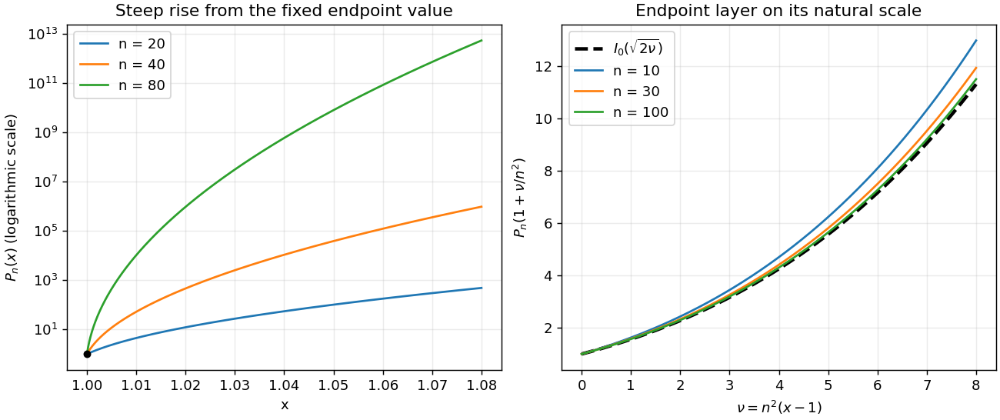

<h1 id="1/b/solution">Solution</h1>

↑ **Parent:** [B](../b.md)

For fixed $x>1$, write $a=\sqrt{x^2-1}$ and $A=x+a$. The maximum of the integrand occurs at $\theta=0$, and

$$
\log(x+a\cos\theta)=\log A-\frac{a}{2A}\theta^2+O(\theta^4).
$$

Here is the required endpoint [Laplace method](../../../../../../laplace-s-method.md) derivation. Outside a fixed neighborhood of zero, the integrand is exponentially smaller than $A^n$. Inside that neighborhood, use $\theta=(A/(na))^{1/2}u$. The quadratic term gives $e^{-u^2/2}$ and the higher terms vanish in the scaled limit. The [Gaussian integral](../../../../../../gaussian-integral.md) on the half-line is $\sqrt{\pi/2}$, so

$$
\boxed{P_n(x)\sim\frac{(x+\sqrt{x^2-1})^{n+1/2}}{\sqrt{2\pi n\sqrt{x^2-1}}},\qquad x>1\ \text{fixed}.}
$$

This is the [Hyperbolic Debye asymptotic for Legendre polynomials](../../../../../../hyperbolic-debye-asymptotic-for-legendre-polynomials.md). At the endpoint the integrand is identically one, giving **$P_n(1)=1$ exactly**.

The localization width in the [Laplace method](../../../../../../laplace-s-method.md) is $O((na)^{-1/2})$. It becomes order one when $n\sqrt{x-1}=O(1)$, so the [Legendre boundary layer at x equals one](../../../../../../legendre-boundary-layer-at-x-equals-one.md) has **$q=2$**. With $x=1+\nu/n^2$ and fixed $\nu\ge0$,

$$
n\log(x+\sqrt{x^2-1}\cos\theta)=\sqrt{2\nu}\cos\theta+O(n^{-1})
$$

uniformly in $\theta$. The boundary-layer answer is therefore

$$
\boxed{P_n(1+\nu/n^2)\sim\frac1\pi\int_0^\pi e^{\sqrt{2\nu}\cos\theta}\,d\theta=I_0(\sqrt{2\nu}).}
$$

This [real integral representation of the modified Bessel function I0](../../../../../../real-integral-representation-of-the-modified-bessel-function-i0.md) gives one at $\nu=0$, agreeing with the endpoint value. Applying the same endpoint [Laplace method](../../../../../../laplace-s-method.md) to the integral for $I_0(z)$ gives $I_0(z)\sim e^z/\sqrt{2\pi z}$. Thus, as $\nu\to\infty$, the inner result is $e^{\sqrt{2\nu}}/\sqrt{2\pi\sqrt{2\nu}}$. The outer result has precisely this limit in the overlap $1\ll\nu\ll n$. This proves both matches rather than extending the fixed-$x$ formula directly to $x=1$.

For the derivatives, the [power series](../../../../../../power-series.md) $I_0(\sqrt{2\nu})=1+\nu/2+\nu^2/16+\cdots$ suggests their leading orders. To justify differentiation, expand the original integral itself near $x=1$. Its first three even cosine moments give

$$
P_n(x)=x^n+\frac{n(n-1)}4x^{n-2}(x^2-1)
+\frac{n(n-1)(n-2)(n-3)}{64}x^{n-4}(x^2-1)^2+O((x-1)^3).
$$

Odd cosine moments vanish, and higher even moments start at cubic order. Expanding at $x=1$ yields

$$
\boxed{P_n'(1)=\frac{n(n+1)}2\sim\frac{n^2}2,\qquad
P_n''(1)=\frac{(n-1)n(n+1)(n+2)}8\sim\frac{n^4}8.}
$$

For large $n$, the graph starts at $(1,1)$ with a very large positive slope and positive [curvature](../../../../../../curvature.md). It rises through the $n^{-2}$ [boundary layer](../../../../../../boundary-layer.md) and then follows the rapidly increasing outer [asymptotic expansion](../../../../../../asymptotic-expansion.md). The sketch below shows both scales.

**[Figure 1](#1/b/image-large-degree-legendre-functions-and-their-n-squared-endpoint-scaling). Large-degree Legendre functions and their n-squared endpoint scaling**.

## ↑ Ancestors (11)

1. [B](../b.md)
2. [1](../../1.md)
3. [Paper 82](../../../paper-82-split.md)
4. [Iii](../../../split.md)
5. [2008](../../../../split.md)
6. [Past exam of the mathematics course of the University of Cambridge](../../../../../split.md)
7. [Mathematics course of the University of Cambridge](../../../../../../mathematics-course-of-the-university-of-cambridge.md)
8. [Course of the University of Cambridge](../../../../../../course-of-the-university-of-cambridge.md)
9. [University of Cambridge](../../../../../../university-of-cambridge-split.md)
10. [List of universities](../../../../../../list-of-universities.md)
11. [Codex Wiki](../../../../../../split.md)
