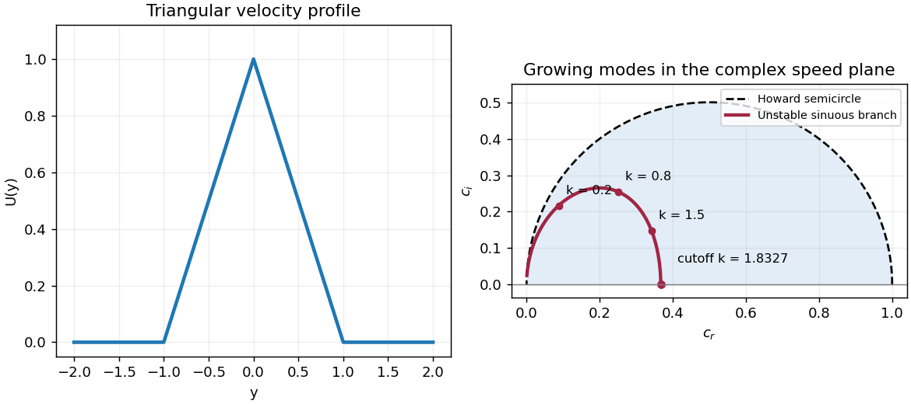

<h1 id="4/b/solution">Solution</h1>

↑ **Parent:** [B](../b.md)

Away from the velocity-profile corners, $U''=0$ and an unstable [normal mode](../../../../../../normal-mode.md) satisfies $\phi''-k^2\phi=0$. On the upper half of the jet write

$$
\phi=A\cosh ky+B\sinh ky\quad(0<y<1),\qquad
\phi=D e^{-k(y-1)}\quad(y>1).
$$

The exterior solution is selected by decay at infinity. From the given velocity components, the perturbation [pressure](../../../../../../pressure.md) is

$$
p=-(U-c)\phi'+U'\phi.
$$

Continuity of normal velocity and [pressure](../../../../../../pressure.md) therefore gives continuity of $\phi$ and [pressure matching at a piecewise-linear shear interface](../../../../../../pressure-matching-at-a-piecewise-linear-shear-interface.md):

$$
[(U-c)\phi'-U'\phi]=0,
\qquad (U-c)[\phi']=[U']\phi.
$$

At $y=1$ the slope of $U$ jumps from $-1$ to zero. Using $\phi'(1^+)=-k\phi(1)$ yields

$$
c\,[\phi'(1^-)+k\phi(1)]=\phi(1),\qquad
ck e^k(A+B)=A\cosh k+B\sinh k.
$$

The lower interface then follows by parity.

For the even [sinuous mode of a planar jet](../../../../../../sinuous-mode-of-a-planar-jet.md), the derivative can jump at the center: being an [even function](../../../../../../even-function.md) does not require the one-sided derivative to vanish. The slope jump at $y=0$ is $-2$, whereas $[\phi']=2\phi'(0^+)$. Thus

$$
(1-c)\phi'(0^+)+\phi(0)=0,
\qquad A+k(1-c)B=0.
$$

Substitute $A=-k(1-c)B$ into the upper-interface relation. With $q=e^{-2k}$, division by $e^k$ and multiplication by $2k$ give

$$
2kc(1-k+kc)+k(1-c)(1+q)-(1-q)=0.
$$

Collecting powers of the [phase velocity](../../../../../../phase-velocity.md) gives the required [dispersion relation](../../../../../../dispersion-relation.md):

$$
\boxed{2k^2c^2+k(1-2k-e^{-2k})c-[1-k-(1+k)e^{-2k}]=0.}
$$

These equations can also be treated as a homogeneous two-by-two system in $A,B$, avoiding division by any potentially zero [amplitude](../../../../../../wave-amplitude.md) or phase-velocity factor.

For the odd [varicose mode of a planar jet](../../../../../../varicose-mode-of-a-planar-jet.md), $\phi(0)=0$, so $A=0$; the central [pressure matching at a piecewise-linear shear interface](../../../../../../pressure-matching-at-a-piecewise-linear-shear-interface.md) is automatic. The upper-interface equation becomes $ck e^k=\sinh k$, and therefore

$$
\boxed{2kc-(1-e^{-2k})=0,\qquad
c=\frac{1-e^{-2k}}{2k}.}
$$

This [phase velocity](../../../../../../phase-velocity.md) is real for every $k>0$, so the discrete [varicose mode of a planar jet](../../../../../../varicose-mode-of-a-planar-jet.md) is neutral and there is no exponentially unstable odd mode.

To determine the unstable even modes, factor the reduced [discriminant](../../../../../../discriminant.md) of the quadratic:

$$
\begin{aligned}
D(k)&=(2k-3)^2-2(2k+5)e^{-2k}+e^{-4k}\\
&=(2k-3-e^{-2k}-4e^{-k})(2k-3-e^{-2k}+4e^{-k}).
\end{aligned}
$$

The second factor vanishes at zero and has derivative $2(1-e^{-k})^2>0$ for $k>0$, so it is positive there. The first factor starts at $-8$, is strictly increasing, and tends to infinity. It therefore has one positive zero $k_c$. The even [phase velocities](../../../../../../phase-velocity.md) are

$$
c_\pm=\frac{2k+e^{-2k}-1\pm\sqrt{D(k)}}{4k}.
$$

It follows that

$$
\boxed{\text{The sinuous branch is exponentially unstable exactly for }0<k<k_c,
\quad 2k_c-3-e^{-2k_c}-4e^{-k_c}=0,
\quad k_c\simeq1.832744.}
$$

For $0<k<k_c$, one member of the [complex conjugate](../../../../../../complex-conjugate.md) pair grows at rate $k c_i=\sqrt{-D(k)}/4$ and the other decays. At $k=k_c$ the speeds merge and there is no exponential growth; for $k>k_c$ both speeds are real. This is [inviscid instability of a triangular jet](../../../../../../inviscid-instability-of-a-triangular-jet.md). The unstable [sinuous mode of a planar jet](../../../../../../sinuous-mode-of-a-planar-jet.md) also satisfies [Howard's semicircle theorem](../../../../../../howard-s-semicircle-theorem.md) with $U_{\min}=0$ and $U_{\max}=1$: its speed lies in the upper half-disk centered at $1/2$ with radius $1/2$.

**[Figure 2](#4/b/image-triangular-jet-profile-and-unstable-sinuous-phase-velocities-inside-the-howard-semicircle). Triangular jet profile and unstable sinuous phase velocities inside the Howard semicircle**.

## ↑ Ancestors (11)

1. [B](../b.md)
2. [4](../../4.md)
3. [Paper 82](../../../paper-82-split.md)
4. [Iii](../../../split.md)
5. [2008](../../../../split.md)
6. [Past exam of the mathematics course of the University of Cambridge](../../../../../split.md)
7. [Mathematics course of the University of Cambridge](../../../../../../mathematics-course-of-the-university-of-cambridge.md)
8. [Course of the University of Cambridge](../../../../../../course-of-the-university-of-cambridge.md)
9. [University of Cambridge](../../../../../../university-of-cambridge-split.md)
10. [List of universities](../../../../../../list-of-universities.md)
11. [Codex Wiki](../../../../../../split.md)
