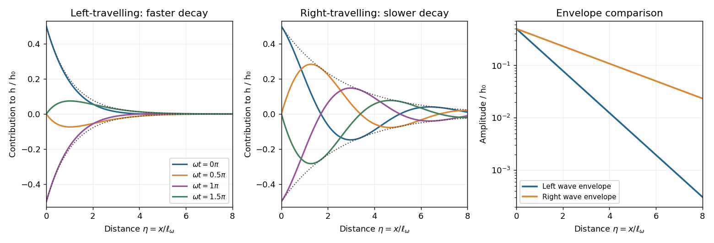

<h1 id="3/c/solution">Solution</h1>

↑ **Parent:** [C](../c.md)

Set $F=e^{k\eta}$. The characteristic polynomial is $k^4=-i$, whose roots have arguments $-\pi/8$, $3\pi/8$, $7\pi/8$, and $11\pi/8$. Only the last two have negative real part and decay at infinity. Write $c=\cos(\pi/8)$ and $s=\sin(\pi/8)$; the admissible roots are

$$
\boxed{k_\ell=-c+is,\qquad k_r=-s-ic.}
$$

Thus $F=a_\ell e^{k_\ell\eta}+a_re^{k_r\eta}$. Since $k_r=ik_\ell$, the boundary equations are $a_\ell+a_r=1$ and $k_\ell^2(a_\ell-a_r)=0$. Therefore

$$
\boxed{a_\ell=a_r=\frac12,\qquad F(\eta)=\frac12(e^{(-c+is)\eta}+e^{(-s-ic)\eta}).}
$$

Taking real parts gives the [oscillatory bending of a moment-free semi-infinite filament](../../../../../../oscillatory-bending-of-a-moment-free-semi-infinite-filament.md)

$$
\boxed{h(x,t)=\frac{h_0}{2}\left[e^{-cx/\ell}\cos(\omega t+sx/\ell)+e^{-sx/\ell}\cos(\omega t-cx/\ell)\right].}
$$

The first phase is constant along paths with $dx/dt=-\omega\ell/s$, so that contribution travels left. The second has $dx/dt=\omega\ell/c$ and travels right. Both are forced, attenuating patterns in an overdamped medium; they are not undamped inertial waves. Their amplitudes are equal at the driven end, but $c\simeq0.924>s\simeq0.383$ gives decay lengths $\ell/c\simeq1.08\ell$ and $\ell/s\simeq2.61\ell$. Hence **the right-travelling contribution dominates away from the end**, because it decays more slowly; its amplitude relative to the left-travelling one grows as $e^{(c-s)x/\ell}$.

**[Figure 1](#3/c/image-counter-propagating-contributions-to-a-driven-filament-with-faster-attenuation-of-the-left-travelling-wave). Counter-propagating contributions to a driven filament, with faster attenuation of the left-travelling wave**.

The envelopes in the sketch show this amplitude comparison independently of the instantaneous phase. At particular points a cosine can vanish or the two terms can interfere, so dominance refers to envelopes and the far-field response, not to a strict pointwise inequality at every time.

## ↑ Ancestors (11)

1. [C](../c.md)
2. [3](../../3.md)
3. [Paper 83](../../../paper-83-split.md)
4. [Iii](../../../split.md)
5. [2008](../../../../split.md)
6. [Past exam of the mathematics course of the University of Cambridge](../../../../../split.md)
7. [Mathematics course of the University of Cambridge](../../../../../../mathematics-course-of-the-university-of-cambridge.md)
8. [Course of the University of Cambridge](../../../../../../course-of-the-university-of-cambridge.md)
9. [University of Cambridge](../../../../../../university-of-cambridge-split.md)
10. [List of universities](../../../../../../list-of-universities.md)
11. [Codex Wiki](../../../../../../split.md)
