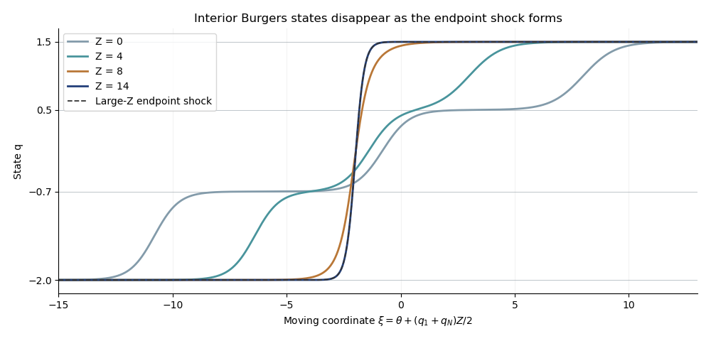

<h1 id="3/a/solution">Solution</h1>

↑ **Parent:** [A](../a.md)

Write $h=\log\psi$ and $q=2\epsilon h_\theta$, with $\epsilon>0$. Direct differentiation gives

$$
q_Z-qq_\theta-\epsilon q_{\theta\theta}
=2\epsilon\partial_\theta[h_Z-\epsilon(h_{\theta\theta}+h_\theta^2)]
=2\epsilon\partial_\theta\left(\frac{\psi_Z-\epsilon\psi_{\theta\theta}}{\psi}\right).
$$

Thus the [Cole-Hopf transformation](../../../../../../cole-hopf-transformation.md) with this negative-flux convention maps the [heat equation](../../../../../../heat-equation.md) to the stated [viscous Burgers equation](../../../../../../viscous-burgers-equation.md). Conversely its residual is independent of $\theta$ and can be removed by multiplying $\psi$ by a function of $Z$.

Convolving each initial exponential with the [Gaussian heat kernel](../../../../../../gaussian-heat-kernel.md) gives

$$
\psi(\theta,Z)=\sum_{j=1}^N e^{A_j},
\qquad A_j=\frac{q_j(\theta-\theta_j)+q_j^2Z/2}{2\epsilon}.
$$

The resulting [finite-exponential Cole-Hopf solution](../../../../../../finite-exponential-cole-hopf-solution.md) is

$$
\boxed{q(\theta,Z)=\frac{\sum_jq_je^{A_j}}{\sum_je^{A_j}}.}
$$

It is a [softmax function](../../../../../../softmax-function.md) average of the constant states, so $q_1\leq q\leq q_N$ and $q_\theta=\operatorname{Var}_w(q_j)/(2\epsilon)\geq0$.

For $N=2$, put $\Delta=q_2-q_1>0$ and $\overline q=(q_1+q_2)/2$. Equality of the two exponents occurs at

$$
\theta_s(Z)=\frac{q_2\theta_2-q_1\theta_1}{\Delta}-\overline q Z.
$$

Therefore

$$
\boxed{q=\overline q+\frac\Delta2\tanh\frac{\Delta(\theta-\theta_s)}{4\epsilon}.}
$$

This is an increasing viscous shock from $q_1$ to $q_2$, moving at speed $-\overline q$ and with transition width of order $\epsilon/\Delta$. That speed agrees with the [Rankine-Hugoniot condition](../../../../../../rankine-hugoniot-conditions.md) for flux $-q^2/2$; its concavity makes the increasing jump the entropy shock.

For general $N$, use the shock frame $\theta=-(q_1+q_N)Z/2+\xi$. The leading $Z$ coefficient in $A_j$ is $q_j(q_j-q_1-q_N)/(4\epsilon)$. The endpoint coefficients coincide, and every interior coefficient is smaller by $(q_j-q_1)(q_N-q_j)/(4\epsilon)>0$. The [extremal-state asymptotics of exponential Burgers solutions](../../../../../../extremal-state-asymptotics-of-exponential-burgers-solutions.md) therefore reduce the large-$Z$ profile to the same tanh shock with states $q_1,q_N$ and centre

$$
\theta_s=\frac{q_N\theta_N-q_1\theta_1}{q_N-q_1}-\frac{q_1+q_N}{2}Z.
$$

At a fixed $\theta$, rather than in the moving frame, the endpoint of largest $|q_j|$ dominates. If $q_N=-q_1$, both endpoint rates coincide and the limiting shock is stationary. Intermediate plateaus disappear in the moving-frame limit.

**[Figure 1](#3/a/image-intermediate-states-disappear-from-the-finite-exponential-burgers-solution-in-the-moving-shock-frame). Intermediate states disappear from the finite-exponential Burgers solution in the moving shock frame**.

## ↑ Ancestors (11)

1. [A](../a.md)
2. [3](../../3.md)
3. [Paper 88](../../../paper-88-split.md)
4. [Iii](../../../split.md)
5. [2008](../../../../split.md)
6. [Past exam of the mathematics course of the University of Cambridge](../../../../../split.md)
7. [Mathematics course of the University of Cambridge](../../../../../../mathematics-course-of-the-university-of-cambridge.md)
8. [Course of the University of Cambridge](../../../../../../course-of-the-university-of-cambridge.md)
9. [University of Cambridge](../../../../../../university-of-cambridge-split.md)
10. [List of universities](../../../../../../list-of-universities.md)
11. [Codex Wiki](../../../../../../split.md)
