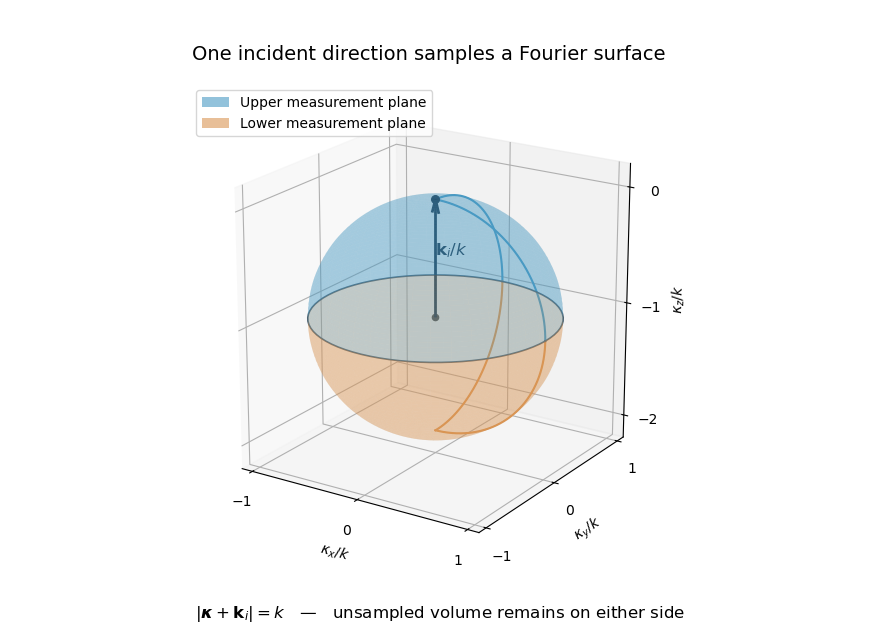

<h1 id="5/b/solution">Solution</h1>

↑ **Parent:** [B](../b.md)

Let $\widehat\psi_s(\mathbf K,z)=\int\psi_s(x,y,z)e^{-i(K_xx+K_yy)}dx\,dy$, and use the same two-dimensional [Fourier transform](../../../../../../fourier-transform.md) for $V$ at a fixed depth. For propagating modes, $|\mathbf K|<k$ and $m=\sqrt{1-|\mathbf K|^2/k^2}$. Fourier transforming the angular spectrum in the previous part gives

$$
\widehat\psi_s(\mathbf K,z_\sigma)=-\frac{i}{m}e^{i\sigma kmz_\sigma}
\widetilde V(\mathbf K-\mathbf k_{i,\perp},\sigma km-k_{i,z}).
$$

The factor $k^2$ cancels against the change of transverse spectral variables $\mathbf K=k(p,q)$. Hence the recoverable samples satisfy

$$
\boxed{\widetilde V(\mathbf K-\mathbf k_{i,\perp},\sigma km-k_{i,z})
=im\,e^{-i\sigma kmz_\sigma}\widehat\psi_s(\mathbf K,z_\sigma).}
$$

Equivalently, in terms of the requested two-dimensional transform of $V$,

$$
\boxed{\int_D\widehat V(\mathbf K-\mathbf k_{i,\perp},z')
 e^{i(k_{i,z}-\sigma km)z'}\,dz'
=im\,e^{-i\sigma kmz_\sigma}\widehat\psi_s(\mathbf K,z_\sigma).}
$$

This is the [Fourier diffraction theorem](../../../../../../fourier-diffraction-theorem.md). It recovers Fourier samples on the two hemispheres of a shifted [Ewald sphere](../../../../../../ewald-sphere.md), since the outgoing wavevector $\mathbf k_s=(\mathbf K,\sigma km)$ has length $k$ and the Fourier transfer is $\boldsymbol\kappa=\mathbf k_s-\mathbf k_i$.

**[Figure 2](#5/b/image-two-observation-planes-sample-the-hemispheres-of-one-shifted-ewald-sphere-in-the-born-approximation). Two observation planes sample the hemispheres of one shifted Ewald sphere in the Born approximation**.

For a general three-dimensional $V$, this is not enough to recover $\widehat V(\mathbf K,z')$ at every depth or reconstruct $V$ uniquely. At a fixed transverse frequency, the two planes supply only two longitudinal Fourier samples. Additional incident directions, frequencies or prior constraints are required. Thus the inverse problem as worded yields the boxed sampling relation, rather than a unique unconstrained volumetric solution.

An explicit nullspace makes this obstruction stronger than a dimension count. For any real smooth $h$ with compact support in $D$, take the [Born non-scattering contrasts at one incident direction](../../../../../../born-non-scattering-contrasts-at-one-incident-direction.md)

$$
V=[\Delta^2+4(\mathbf k_i\cdot\nabla)^2]h.
$$

Its [Fourier transform](../../../../../../fourier-transform.md) is $[|\boldsymbol\kappa|^4-4(\mathbf k_i\cdot\boldsymbol\kappa)^2]\widetilde h$. On the sampled sphere, $|\boldsymbol\kappa|^2+2\mathbf k_i\cdot\boldsymbol\kappa=0$, so this polynomial factor vanishes. Nonzero real compactly supported contrasts can therefore give identical propagating data to zero contrast in this linear approximation. Their amplitude can be made small enough to keep $n>0$ and remain in the weak-scattering regime. In fact the associated Born field is $\psi_s=2k e^{i\mathbf k_i\cdot\mathbf r}(\Delta-2i\mathbf k_i\cdot\nabla)h$. Applying $\Delta+k^2$ gives the source $2kVe^{i\mathbf k_i\cdot\mathbf r}$, while compact support makes this field zero on both exterior measurement planes. Thus this example also defeats recovery from their evanescent components.

## ↑ Ancestors (11)

1. [B](../b.md)
2. [5](../../5.md)
3. [Paper 88](../../../paper-88-split.md)
4. [Iii](../../../split.md)
5. [2008](../../../../split.md)
6. [Past exam of the mathematics course of the University of Cambridge](../../../../../split.md)
7. [Mathematics course of the University of Cambridge](../../../../../../mathematics-course-of-the-university-of-cambridge.md)
8. [Course of the University of Cambridge](../../../../../../course-of-the-university-of-cambridge.md)
9. [University of Cambridge](../../../../../../university-of-cambridge-split.md)
10. [List of universities](../../../../../../list-of-universities.md)
11. [Codex Wiki](../../../../../../split.md)
