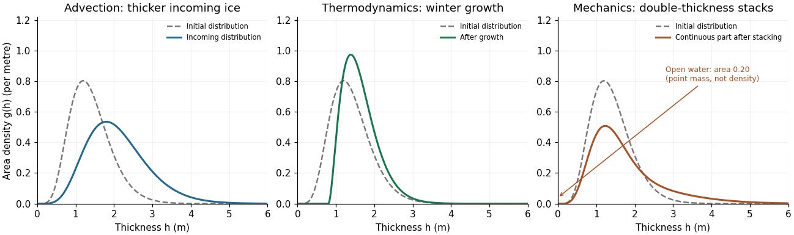

<h1 id="3/solution">Solution</h1>

↑ **Parent:** [3](../3.md)

Define $g(\mathbf x,h,t)\,dh$ as the fraction of horizontal ocean area covered by [sea ice](../../../../../sea-ice.md) of thickness in $[h,h+dh]$. Allow a [Dirac delta](../../../../../dirac-delta-function.md) mass at $h=0$ for open water, so the whole-area distribution has $\int g\,dh=1$; its first moment $H=\int h g\,dh$ is ice volume per ocean area, rather than mean thickness conditional on ice being present. Let $f=dh/dt$ be thermodynamic growth, $\mathbf v$ the horizontal ice velocity and $\psi$ the [mechanical redistribution of sea ice](../../../../../mechanical-redistribution-of-sea-ice.md).

Conservation in a horizontal cell and a thickness interval gives horizontal flux $\mathbf v g$ and thickness-space flux $fg$. For $h_1<h_2$, their contribution is $-\nabla\cdot\int_{h_1}^{h_2}\mathbf v g\,dh-[fg]_{h_1}^{h_2}$; adding $\int_{h_1}^{h_2}\psi\,dh$ and shrinking the interval yields

$$
\boxed{\frac{\partial g}{\partial t}+\nabla\cdot(\mathbf v g)+\frac{\partial(fg)}{\partial h}=\psi.}
$$

This is the [sea-ice thickness distribution](../../../../../sea-ice-thickness-distribution.md) equation. Its distributional formulation must include creation and removal of open water when characteristics reach or leave $h=0$. On a positive-thickness smooth portion it is equivalently

$$
\frac{Dg}{Dt}+f\,\partial_hg=-g\big(\nabla\cdot\mathbf v+\partial_h f\big)+\psi.
$$

If a nonconservative form uses a redistribution function $\widetilde\psi$, then $\widetilde\psi=\psi-g\nabla\cdot\mathbf v$; the two definitions must not be interchanged.

With the open-water boundary flux accounted for consistently, whole-area normalization requires $\int\psi\,dh=\nabla\cdot\mathbf v$. Mechanical rearrangement preserves ice volume locally, so $\int h\psi\,dh=0$. The volume moment consequently obeys

$$
\boxed{\partial_t H+\nabla\cdot(\mathbf v H)=\int f g\,dh,}
$$

where formation of new [sea ice](../../../../../sea-ice.md) from the open-water category is included in the thermal term. Compression raises local volume per area through convergence, even though ridging does not create ice mass.

The three processes have distinct effects on the curve. Pure [advection](../../../../../advection.md) imports the distributions found upstream, so a fixed location may acquire a different mode or thick tail. Along an incompressible material trajectory, advection alone does not alter its distribution. Convergence and divergence also change area fractions through the horizontal flux, with the redistribution and open-water terms ensuring normalization.

Thermodynamic growth moves probability along thickness characteristics $\dot h=f(h,t)$, with $g(h,t)\,dh=g(h_0,0)\,dh_0$ when mechanics and horizontal divergence vanish. For example, winter conductive growth $f=\kappa/h$ gives $h^2=h_0^2+2\kappa t$ and

$$
g(h,t)=g_0\!\left(\sqrt{h^2-2\kappa t}\right)\frac{h}{\sqrt{h^2-2\kappa t}}.
$$

Thin ice grows faster, so the mode moves to larger thickness and neighboring thin-ice characteristics converge, sharpening the level-ice peak. Summer ablation moves classes left and creates open water when ice disappears; if melt rate depends on thickness, the shape changes as well.

[Mechanical redistribution of sea ice](../../../../../mechanical-redistribution-of-sea-ice.md) removes area from thin or level ice and populates thick rafted or classes containing [sea-ice pressure ridges](../../../../../sea-ice-pressure-ridge.md), broadening the upper tail. It can also create [sea-ice leads](../../../../../lead-sea-ice.md). A simple volume-conserving example, stacking a fraction $r$ of an initial distribution into double-thickness ice, is

$$
g_{\rm mech}(h)=(1-r)g_0(h)+\frac r4g_0(h/2)+\frac r2\delta_0(h).
$$

The stacked component has area $r/2$ and unchanged volume $r\int h g_0(h)\,dh$; the freed area $r/2$ becomes open water. Thus mechanical thickening is not merely a translation of the entire curve.

**[Figure 1](#3/image-advection-winter-growth-and-volume-conserving-mechanical-stacking-of-an-ice-thickness-distribution). Advection, winter growth and volume-conserving mechanical stacking of an ice thickness distribution**.

The figure uses illustrative distributions, not measured data. The advection panel compares local ice with incoming thicker ice; the growth panel applies the thickness-characteristic formula; the mechanical panel uses $r=0.4$ and shows its open-water mass separately from the continuous density.

For the thick tail, take the common-shape [sea-ice pressure ridge](../../../../../sea-ice-pressure-ridge.md) idealization to mean triangular profile sections with a common effective side slope $s=\tan\delta$, while peak thicknesses vary. Let $n(H)\,dH$ count [sea-ice pressure ridge](../../../../../sea-ice-pressure-ridge.md) peaks per track length with maximum thickness in $[H,H+dH]$. Above a level-ice baseline $h_0$, a [sea-ice pressure ridge](../../../../../sea-ice-pressure-ridge.md) with $H\ge h$ contributes two flank lengths $dh/s$ at thickness $h$; it contributes nothing at $h>H$. For a representative transect, summing these lengths gives the [triangular ridge occupation identity](../../../../../triangular-ridge-occupation-identity.md)

$$
g_{\rm tail}(h)=\frac2s\int_h^\infty n(H)\,dH.
$$

Suppose $n(H)=Be^{-\lambda H}$ for $H\ge h_0$. Then

$$
\boxed{g_{\rm tail}(h)=Ae^{-\lambda h},\qquad A=\frac{2B}{s\lambda},\qquad \tan\delta=\frac{2B}{A\lambda}.}
$$

Thus an [exponential ridge-draft model](../../../../../exponential-ridge-draft-model.md), expressed in the same vertical coordinate as the profile, generates an exponential occupation tail with the same decay parameter. The peak-count distribution and the area-weighted thickness distribution are different distributions, so their amplitudes carry essential information.

If $\mu=\int_{h_0}^\infty n(H)\,dH$ is ridge line density and $p=\int_{h_0}^\infty g_{\rm tail}(h)\,dh$ is the tail's area fraction, the same result becomes

$$
\boxed{\lambda=\frac1{\langle H\rangle-h_0},\qquad \tan\delta=\frac{2\mu}{\lambda p}.}
$$

The decay rate alone does not fix slope: [sea-ice pressure ridge](../../../../../sea-ice-pressure-ridge.md) frequency or tail amplitude is also needed. If side slopes vary independently of peak height, replace $1/s$ by $\langle1/s\rangle$, giving an effective harmonic-mean slope. Measured along-track slopes differ from slopes normal to a ridge if the transect is oblique. Overlap, irregular shape and porosity limit this simple geometric model. Literally identical complete ridge cross-sections would have one height, so “common shape” here necessarily permits different ridge sizes.

[Sea-ice pressure ridge](../../../../../sea-ice-pressure-ridge.md) spacings are positive and broadly distributed. A spatial [Poisson process](../../../../../poisson-process.md) gives an [exponential distribution](../../../../../exponential-distribution.md) of gaps, a useful simple approximation. Observed [sea-ice pressure ridge](../../../../../sea-ice-pressure-ridge.md) spacings, however, often fit a shifted [lognormal distribution](../../../../../log-normal-distribution.md) better, with few very small spacings because of ridge geometry, identification rules and finite beam width. This differs from the successful exponential model for peak drafts. [Observed ridge-spacing and draft distributions](https://agupubs.onlinelibrary.wiley.com/doi/abs/10.1029/JC091iC09p10697) establish this distinction.

[Sea-ice lead-width distributions](../../../../../sea-ice-lead-width-distribution.md) contain very many narrow openings and a broad tail. A [power law](../../../../../power-law.md) often describes widths over a resolved range better than one negative exponential; its exponents and apparent cutoffs depend on the lead definition, resolution and count-versus-area weighting. [Sea-ice lead](../../../../../lead-sea-ice.md) spacings may be approximately exponential over an intermediate range, but clustering produces excess close pairs and large gaps, so there is no universal independent-spacing law. Both behaviors were found in [Greenland Sea and Eurasian Basin lead statistics](https://agupubs.onlinelibrary.wiley.com/doi/abs/10.1029/91JC03137). **Advection imports thickness classes, thermodynamics transports them in $h$, and mechanics exchanges thin-ice area for ridged ice and leads; common-slope exponential ridge populations reproduce the exponential thick tail.**

## ↑ Ancestors (10)

1. [3](../3.md)
2. [Paper 89](../../paper-89-split.md)
3. [Iii](../../split.md)
4. [2008](../../../split.md)
5. [Past exam of the mathematics course of the University of Cambridge](../../../../split.md)
6. [Mathematics course of the University of Cambridge](../../../../../mathematics-course-of-the-university-of-cambridge.md)
7. [Course of the University of Cambridge](../../../../../course-of-the-university-of-cambridge.md)
8. [University of Cambridge](../../../../../university-of-cambridge-split.md)
9. [List of universities](../../../../../list-of-universities.md)
10. [Codex Wiki](../../../../../split.md)
