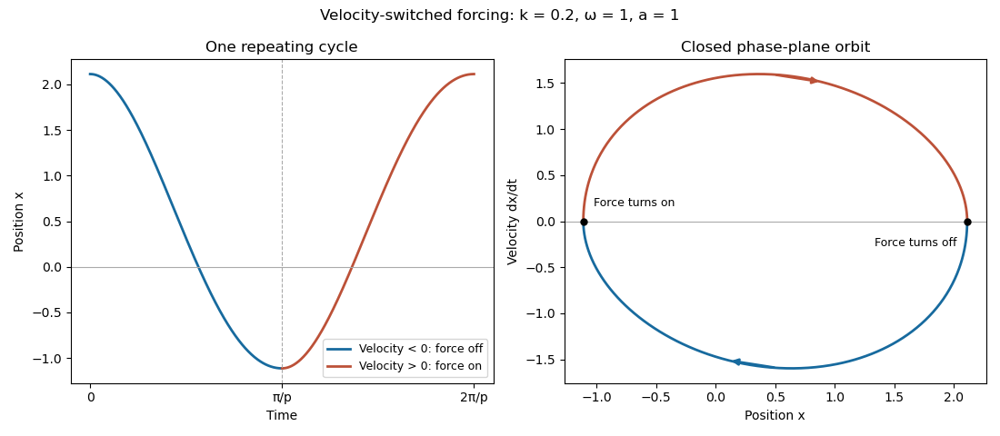

<h1 id="6c/solution">Solution</h1>

↑ **Parent:** [6C](../6c.md)

Assume $\omega>0$. The [characteristic roots](../../../../../characteristic-root-of-a-constant-coefficient-differential-equation.md) of the [damped harmonic oscillator](../../../../../damped-harmonic-oscillator.md) are $-k\pm\sqrt{k^2-\omega^2}$. Its general homogeneous solution is

$$
\boxed{\begin{array}{ll}
k<\omega:&x=e^{-kt}(C\cos pt+D\sin pt),\quad p=\sqrt{\omega^2-k^2},\\
k=\omega:&x=(C+Dt)e^{-kt},\\
k>\omega:&x=e^{-kt}(C\cosh qt+D\sinh qt),\quad q=\sqrt{k^2-\omega^2}.
\end{array}}
$$

These are respectively the underdamped, [critically damped](../../../../../critical-damping.md) and overdamped regimes.

For the [velocity-switched driven oscillator](../../../../../velocity-switched-driven-oscillator.md), the initial acceleration is $-\omega^2x_1<0$. Its velocity is therefore negative on the first half-cycle, and the forcing is zero:

$$
\boxed{x(t)=x_1e^{-kt}\left(\cos pt+\frac{k}{p}\sin pt\right),\qquad 0\leq t\leq\frac\pi p.}
$$

Indeed $\dot x=-(\omega^2x_1/p)e^{-kt}\sin pt<0$ in that open interval. Set $r=e^{-k\pi/p}$; at the first turning point, $x_2=-rx_1$ and $\dot x=0$.

Put $\tau=t-\pi/p$. On the second half-cycle the velocity is positive, so the particular solution is $a/\omega^2$. Matching position and velocity gives

$$
\boxed{x(t)=\frac a{\omega^2}
+\left(-rx_1-\frac a{\omega^2}\right)e^{-k\tau}
\left(\cos p\tau+\frac{k}{p}\sin p\tau\right),\quad
\frac\pi p\leq t\leq\frac{2\pi}p.}
$$

Its derivative is positive for $0<\tau<\pi/p$. At the next turning point,

$$
x_3=r^2x_1+(1+r)\frac a{\omega^2},\qquad \dot x_3=0.
$$

The [turning-point return map](../../../../../poincare-map.md) therefore repeats the initial state exactly when

$$
\boxed{x_1=\frac{a}{\omega^2(1-r)},\qquad r=e^{-k\pi/p},\qquad T=\frac{2\pi}{p}.}
$$

This value exceeds $a/\omega^2$, so the subsequent acceleration initiates the required negative-velocity half-cycle again. The switched solution is continuous with continuous velocity, and is piecewise twice differentiable; acceleration has one-sided jumps where the forcing switches.

**[Figure 1](#6c/image-periodic-motion-of-the-oscillator-with-forcing-applied-only-during-positive-velocity). Periodic motion of the oscillator with forcing applied only during positive velocity**.

For $k>\omega$, the specified positive initial value gives

$$
x=x_1e^{-kt}\left(\cosh qt+\frac{k}{q}\sinh qt\right),\qquad
\dot x=-\frac{\omega^2x_1}{q}e^{-kt}\sinh qt<0\quad(t>0).
$$

There is no next turning point: the forcing stays zero and $x$ approaches zero monotonically. **The motion from the specified initial state cannot be periodic.** More generally, a solution started at any positive maximum has this same obstruction; a nonconstant periodic orbit would require such a maximum. The zero equilibrium is a separate constant solution.

## ↑ Ancestors (10)

1. [6C](../6c.md)
2. [Paper 2](../../paper-2-split.md)
3. [Ia](../../split.md)
4. [2009](../../../split.md)
5. [Past exam of the mathematics course of the University of Cambridge](../../../../split.md)
6. [Mathematics course of the University of Cambridge](../../../../../mathematics-course-of-the-university-of-cambridge.md)
7. [Course of the University of Cambridge](../../../../../course-of-the-university-of-cambridge.md)
8. [University of Cambridge](../../../../../university-of-cambridge-split.md)
9. [List of universities](../../../../../list-of-universities.md)
10. [Codex Wiki](../../../../../split.md)
