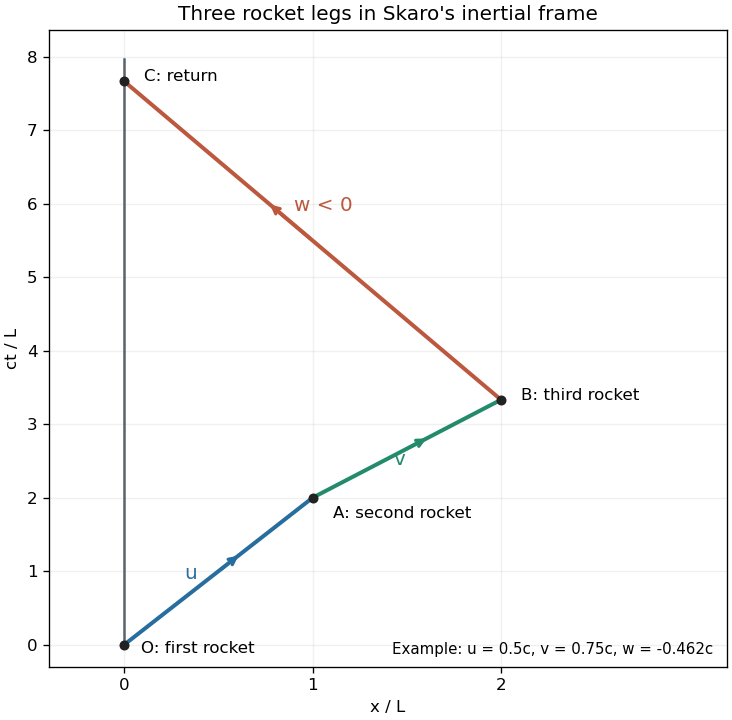

# Paper 4

↑ **Parent:** [Ia](../ia.md)

[https://www.maths.cam.ac.uk/undergrad/pastpapers/files/2009/PaperIA_4.pdf](https://www.maths.cam.ac.uk/undergrad/pastpapers/files/2009/PaperIA_4.pdf)

**Table of contents**

- [1E](#1e)
  - [Solution](#1e/solution)
- [2E](#2e)
  - [a](#2e/a)
    - [Solution](#2e/a/solution)
  - [b](#2e/b)
    - [Solution](#2e/b/solution)
- [3A](#3a)
  - [Solution](#3a/solution)
- [4A](#4a)
  - [a](#4a/a)
    - [Solution](#4a/a/solution)
  - [b](#4a/b)
    - [Solution](#4a/b/solution)
  - [c](#4a/c)
    - [Solution](#4a/c/solution)
- [5E](#5e)
  - [a](#5e/a)
    - [Solution](#5e/a/solution)
  - [b](#5e/b)
    - [Solution](#5e/b/solution)
- [6E](#6e)
  - [a](#6e/a)
    - [Solution](#6e/a/solution)
  - [b](#6e/b)
    - [Solution](#6e/b/solution)
- [7E](#7e)
  - [Solution](#7e/solution)
- [8E](#8e)
  - [Solution](#8e/solution)
- [9A](#9a)
  - [Solution](#9a/solution)
- [10A](#10a)
  - [a](#10a/a)
    - [Solution](#10a/a/solution)
  - [b](#10a/b)
    - [Solution](#10a/b/solution)
  - [c](#10a/c)
    - [Solution](#10a/c/solution)
- [11A](#11a)
  - [Solution](#11a/solution)
- [12A](#12a)
  - [a](#12a/a)
    - [Solution](#12a/a/solution)
  - [b](#12a/b)
    - [Solution](#12a/b/solution)

## 1E

↑ **Parent:** [Paper 4](paper-4.md)

<h3 id="1e/solution">Solution</h3>

↑ **Parent:** [1E](#1e)

Write $\Delta_A=\{(x,x):x\in A\}$ and regard each [binary relation](../../../set-theory.md#binary-relation) as a subset of $A\times A$. Then $R=Q\cup\Delta_A$ is the [reflexive closure](../../../set-theory.md#reflexive-closure) of $Q$: every $x\in A$ satisfies $xRx$ because $x=x$. The relation $S=R\cup R^{-1}$ is its [symmetric closure](../../../set-theory.md#symmetric-closure). It is a [reflexive relation](../../../set-theory.md#reflexive-relation) since it contains $R$, and $xSy$ means either $xRy$ or $yRx$, either of which also gives $ySx$.

For $T$, a one-step chain $(x,x)$ is allowed because $xSx$, so $xTx$. If $(x_0,\ldots,x_n)$ witnesses $xTy$, the reversed chain $(x_n,\ldots,x_0)$ witnesses $yTx$, since $S$ is a [symmetric relation](../../../set-theory.md#symmetric-relation). Finally, concatenate a chain from $x$ to $y$ with a chain from $y$ to $z$ to obtain a positive-length chain from $x$ to $z$. Hence $T$ is a [transitive relation](../../../set-theory.md#transitive-relation) as well, and

$$
\boxed{R\text{ is reflexive},\quad S\text{ is reflexive and symmetric},\quad T\text{ is an equivalence relation}.}
$$

Thus $T$ is the [transitive closure of a relation](../../../set-theory.md#transitive-closure-relation) applied to $S$.

Now suppose $E$ is an [equivalence relation](../../../set-theory.md#equivalence-relation) containing $Q$. Its reflexivity implies $\Delta_A\subseteq E$, hence $R\subseteq E$. Its symmetry then implies $R^{-1}\subseteq E$, hence $S\subseteq E$. Along a chain witnessing $xTy$, every consecutive pair is $E$-related. Induction on the chain length using [transitivity](../../../set-theory.md#transitive-relation) gives $xEy$: the one-step case is $S\subseteq E$, and the last step joins $xEx_{n-1}$ to $x_{n-1}Ey$. Therefore

$$
\boxed{T\subseteq E\text{ for every equivalence relation }E\supseteq Q.}
$$

Together with $Q\subseteq T$, this proves that $T$ is exactly the [equivalence closure](../../../set-theory.md#equivalence-closure) of $Q$. The reasoning also covers an empty $A$, where all assertions about elements are vacuous.

## 2E

↑ **Parent:** [Paper 4](paper-4.md)

<h3 id="2e/a">a</h3>

↑ **Parent:** [2E](#2e)

<h4 id="2e/a/solution">Solution</h4>

↑ **Parent:** [A](#2e/a)

Eliminate $x$ by twice the first [modular congruence](../../../number-theory.md#modular-congruence) minus three times the second. This gives

$$
3y\equiv2(4)-3(14)=-34\equiv13\pmod{47}.
$$

The [modular inverse](../../../number-theory.md#modular-multiplicative-inverse) of $3$ is $16$, because $3\cdot16=48\equiv1$. Hence $y\equiv16\cdot13\equiv20$. Substitution into the second [modular congruence](../../../number-theory.md#modular-congruence) gives $6x\equiv14-7(20)\equiv15$, and $6^{-1}\equiv8$, so $x\equiv8\cdot15\equiv26$. Thus

$$
\boxed{x=26+47r,\qquad y=20+47s,\qquad r,s\in\mathbb Z.}
$$

In particular, $(x,y)=(26,20)$ works: $9(26)+12(20)=474=10(47)+4$ and $6(26)+7(20)=296=6(47)+14$. The elimination is reversible because $3$ and $6$ have [modular inverses](../../../number-theory.md#modular-multiplicative-inverse), so the displayed classes contain all solutions.

<h3 id="2e/b">b</h3>

↑ **Parent:** [2E](#2e)

<h4 id="2e/b/solution">Solution</h4>

↑ **Parent:** [B](#2e/b)

The integer $137$ is prime: none of the primes $2,3,5,7,11$ below $\sqrt{137}$ divides it. Since $43\not\equiv0\pmod{137}$, [Fermat's little theorem](../../../number-theory.md#fermat-little-theorem) gives $43^{136}\equiv1$. Therefore $43^{135}$ is the [modular inverse](../../../number-theory.md#modular-multiplicative-inverse) of $43$. The [extended Euclidean algorithm](../../../number-theory.md#extended-euclidean-algorithm) yields

$$
137=3(43)+8,\quad43=5(8)+3,\quad8=2(3)+2,\quad3=2+1,
$$

and back-substitution gives $1=51(43)-16(137)$. Consequently

$$
\boxed{43^{135}\equiv51\pmod{137}.}
$$

Indeed, $43\cdot51=2193=16\cdot137+1$, directly checking the required [modular inverse](../../../number-theory.md#modular-multiplicative-inverse).

## 3A

↑ **Parent:** [Paper 4](paper-4.md)

<h3 id="3a/solution">Solution</h3>

↑ **Parent:** [3A](#3a)

Take upward as positive and let $dm<0$ be the change in rocket [mass](../../../classical-mechanics.md#mass) during $dt$. The exhaust emitted has mass $-dm$ and, to first order, upward velocity $v-U$. The [linear momentum](../../../classical-mechanics.md#momentum) of the rocket and just-emitted gas changes by

$$
(m+dm)(v+dv)+(-dm)(v-U)-mv=m\,dv+U\,dm+O(dt^2).
$$

The external gravitational impulse is $-mg\,dt$ to first order. Applying the momentum balance to this material system, rather than applying a fixed-mass formula to the rocket alone, gives the [rocket equation](../../../classical-mechanics.md#rocket-equation)

$$
\boxed{m\frac{dv}{dt}+U\frac{dm}{dt}=-mg.}
$$

The term $-U\dot m$ is the upward thrust.

For the specified mass loss and exhaust law, $\dot m=-\alpha$ and

$$
\dot v=\frac{\alpha U_0m_0}{(m_0-\alpha t)^2}-g,\qquad \dot v(0)=\frac{\alpha U_0}{m_0}-g.
$$

Thus the condition for strictly positive upward [acceleration](../../../classical-mechanics.md#acceleration) at launch is

$$
\boxed{\alpha U_0>m_0g.}
$$

At equality the initial thrust just balances the weight; under this particular exhaust law the acceleration becomes positive immediately afterwards. If the initial thrust is smaller than the weight and the rocket initially rests on a launch surface, a nonzero supporting force persists until a later lift-off, so the free-flight equation does not describe its earlier supported motion.

For immediate free flight, integrate the [rocket equation](../../../classical-mechanics.md#rocket-equation) with $v(0)=0$:

$$
v(t)=U_0m_0\left(\frac1{m_0-\alpha t}-\frac1{m_0}\right)-gt,\qquad \boxed{v(t)=\frac{U_0\alpha t}{m_0-\alpha t}-gt}.
$$

This applies while $0\leq t<m_0/\alpha$ and the nonrelativistic approximation remains valid. The formal divergence as the model's remaining mass approaches zero is not a prediction within that approximation.

For [dimensional analysis](../../../physics.md#dimensional-analysis), write the mass, length and time dimensions as $\mathsf M,\mathsf L,\mathsf T$. Then $[m_0]=[m]=\mathsf M$, $[\alpha]=\mathsf M\mathsf T^{-1}$, $[t]=\mathsf T$, $[U_0]=[U]=[v]=\mathsf L\mathsf T^{-1}$, and $[g]=\mathsf L\mathsf T^{-2}$. Both $m_0$ and $\alpha t$ have mass dimension, so $\alpha t/(m_0-\alpha t)$ is dimensionless; both terms in the boxed velocity have dimension $\mathsf L\mathsf T^{-1}$. The launch inequality compares two forces, each of dimension $\mathsf M\mathsf L\mathsf T^{-2}$.

## 4A

↑ **Parent:** [Paper 4](paper-4.md)

<h3 id="4a/a">a</h3>

↑ **Parent:** [4A](#4a)

<h4 id="4a/a/solution">Solution</h4>

↑ **Parent:** [A](#4a/a)

A [central force](../../../physics.md#central-force) acts along the line joining the particle to a fixed centre. Taking that centre as the origin, its usual position-dependent form is

$$
\boxed{\mathbf F(\mathbf r)=f(r)\,\mathbf e_r,\qquad r=|\mathbf r|,\quad\mathbf e_r=\mathbf r/r.}
$$

Positive $f$ gives an outward force and negative $f$ an inward one. For a conventional [central force](../../../physics.md#central-force) the magnitude depends only on distance from the centre, not on direction. The angular-momentum conclusions below require only that the force remain radial about that fixed centre.

<h3 id="4a/b">b</h3>

↑ **Parent:** [4A](#4a)

<h4 id="4a/b/solution">Solution</h4>

↑ **Parent:** [B](#4a/b)

The particle's [angular momentum](../../../classical-mechanics.md#angular-momentum) about the force centre is $\mathbf L=m\mathbf r\times\dot{\mathbf r}$. A [central force](../../../physics.md#central-force) exerts zero [torque](../../../classical-mechanics.md#torque) about that centre, so

$$
\dot{\mathbf L}=m\dot{\mathbf r}\times\dot{\mathbf r}+\mathbf r\times\mathbf F=\mathbf0.
$$

By [conservation of angular momentum](../../../classical-mechanics.md#conservation-of-angular-momentum), $\mathbf L$ is a constant vector. If it is nonzero, the identity $\mathbf r\cdot\mathbf L=0$ places every point of the orbit in the fixed plane through the centre perpendicular to $\mathbf L$:

$$
\boxed{\text{The orbit lies in the plane }\mathbf r\cdot\mathbf L=0.}
$$

If $\mathbf L=0$, position and velocity are parallel. Away from the force centre, $\dot{\mathbf e}_r=(\dot{\mathbf r}-\dot r\mathbf e_r)/r=\mathbf0$, so the motion is radial along a fixed line, which lies in any plane containing that line. Thus the zero-angular-momentum case also gives planar motion. As usual, these assertions apply while the force law supplies a regular orbit; continuation through a singular force centre is a separate issue.

<h3 id="4a/c">c</h3>

↑ **Parent:** [4A](#4a)

<h4 id="4a/c/solution">Solution</h4>

↑ **Parent:** [C](#4a/c)

With the Sun fixed, its gravitational force on the planet is a [central force](../../../physics.md#central-force). In the fixed orbital plane, the transverse acceleration in [polar coordinates](../../../calculus.md#polar-coordinates) therefore vanishes:

$$
r\ddot\theta+2\dot r\dot\theta=0,\qquad \frac{d}{dt}(r^2\dot\theta)=0.
$$

During $dt$, the position vector sweeps an infinitesimal sector of area $dA=\tfrac12r^2d\theta$. Hence the [areal velocity](../../../classical-mechanics.md#areal-velocity) is

$$
\boxed{\frac{dA}{dt}=\frac12r^2\dot\theta=\frac{L}{2m}=\text{constant}.}
$$

Integrating over any two equal time intervals gives equal swept areas, proving [Kepler's second law](../../../physics.md#kepler-s-second-law). Here $L$ is the signed component of [angular momentum](../../../classical-mechanics.md#angular-momentum) normal to the orbital plane. The argument uses [conservation of angular momentum](../../../classical-mechanics.md#conservation-of-angular-momentum); an inverse-square dependence is not needed for this particular law, only a central force.

## 5E

↑ **Parent:** [Paper 4](paper-4.md)

<h3 id="5e/a">a</h3>

↑ **Parent:** [5E](#5e)

<h4 id="5e/a/solution">Solution</h4>

↑ **Parent:** [A](#5e/a)

A [left inverse](../../../function.md#left-inverse) of $f$ is a function $\ell:B\to A$ satisfying $\ell\circ f=\operatorname{id}_A$. If such $\ell$ exists and $f(a)=f(a')$, applying $\ell$ gives $a=a'$, so $f$ is an [injection](../../../algebra.md#injective-function). Conversely, suppose $f$ is an [injection](../../../algebra.md#injective-function) and fix $a_0\in A$, possible because $A$ is nonempty. Define

$$
\ell(b)=\begin{cases}a,&b=f(a)\text{ for some }a\in A,\\a_0,&b\notin f(A).\end{cases}
$$

The first value is unique by injectivity, and $\ell(f(a))=a$ for every $a$. Thus

$$
\boxed{f\text{ is injective}\iff f\text{ has a left inverse}.}
$$

No choice from a family of nonempty sets is needed here: each preimage in the first case is unique, and the second case uses one fixed element.

A [right inverse](../../../function.md#right-inverse) is a function $r:B\to A$ with $f\circ r=\operatorname{id}_B$. Its existence makes every $b$ the image of $r(b)$, proving that $f$ is a [surjection](../../../algebra.md#surjective-function). Conversely, if $f$ is a [surjection](../../../algebra.md#surjective-function), every [fiber of a function](../../../function.md#fiber-of-a-function) $f^{-1}(\{b\})$ is nonempty. Using the usual [axiom of choice](../../../set-theory.md#axiom-of-choice) for arbitrary sets, choose $r(b)\in f^{-1}(\{b\})$ for each $b$. Then $f(r(b))=b$, giving

$$
\boxed{f\text{ is surjective}\iff f\text{ has a right inverse}\quad\text{assuming choice}.}
$$

The converse in this second equivalence is the [right-inverse characterization of the axiom of choice](../../../function.md#right-inverse-characterization-of-the-axiom-of-choice); it is not an unrestricted choice-free theorem about arbitrary sets.

<h3 id="5e/b">b</h3>

↑ **Parent:** [5E](#5e)

<h4 id="5e/b/solution">Solution</h4>

↑ **Parent:** [B](#5e/b)

Choose a [right inverse](../../../function.md#right-inverse) $s:A\to B$ of the [surjection](../../../algebra.md#surjective-function) $f$, so $f(s(a))=a$, and define

$$
\boxed{h=g\circ s.}
$$

For each $a$, the element $b=s(a)$ then witnesses both $f(b)=a$ and $g(b)=h(a)$. As in part (a), arbitrary simultaneous choices use the [axiom of choice](../../../set-theory.md#axiom-of-choice). If $A$ is empty, surjectivity and the existence of $f:B\to A$ force $B$ to be empty, and the unique empty function $h:A\to C$ already meets the requirement.

Suppose $g$ is constant on each [fiber of a function](../../../function.md#fiber-of-a-function) of $f$. Since every fiber is nonempty, $h(a)$ must be its common $g$-value: any witness $b$ in that fiber gives that value. This defines exactly one $h$ and yields $g=h\circ f$, an instance of [factorization through a surjection](../../../function.md#factorization-through-a-surjection).

Conversely, suppose a fiber contains $b,b'$ with $f(b)=f(b')=a_0$ but $g(b)\ne g(b')$. Starting with any admissible $h$, define $h_1,h_2$ to agree with it away from $a_0$, but put $h_1(a_0)=g(b)$ and $h_2(a_0)=g(b')$. Both remain admissible, witnessed at $a_0$ by $b$ and $b'$ respectively, yet they are distinct. Hence

$$
\boxed{h\text{ is unique}\iff f(b)=f(b')\Longrightarrow g(b)=g(b').}
$$

The distinction is important: the original existence property asks only for one witness in each fiber. Only when $g$ is fiberwise constant does that property force $g=h\circ f$ for every $b$.

## 6E

↑ **Parent:** [Paper 4](paper-4.md)

<h3 id="6e/a">a</h3>

↑ **Parent:** [6E](#6e)

<h4 id="6e/a/solution">Solution</h4>

↑ **Parent:** [A](#6e/a)

For finite sets $X_1,\ldots,X_N$, the [inclusion-exclusion principle](../../../combinatorics.md#inclusion-exclusion-principle) states

$$
\boxed{\left|\bigcup_{i=1}^NX_i\right|=\sum_{r=1}^N(-1)^{r-1}\sum_{1\leq i_1<\cdots<i_r\leq N}|X_{i_1}\cap\cdots\cap X_{i_r}|.}
$$

To prove it, fix an element belonging to exactly $s\geq1$ of these sets. At level $r$ it is counted in precisely $\binom sr$ intersections, so its total multiplicity on the right is

$$
\sum_{r=1}^s(-1)^{r-1}\binom sr=1-(1-1)^s=1
$$

by the [binomial theorem](../../../combinatorics.md#binomial-theorem). An element in no set contributes zero. Summing these equal multiplicities over the finite union proves [inclusion-exclusion](../../../combinatorics.md#inclusion-exclusion-principle). This also explains why pairwise subtraction alone is insufficient: elements in triple and higher intersections must receive the alternating corrections.

<h3 id="6e/b">b</h3>

↑ **Parent:** [6E](#6e)

<h4 id="6e/b/solution">Solution</h4>

↑ **Parent:** [B](#6e/b)

Use the universe $\Omega=\{B\subseteq A:|B|=k\}$ and define the exact-occupancy events $E_i=\{B\in\Omega:|B\cap A_i|=3\}$. The desired collection is $\bigcup_{i=1}^kE_i$, so apply [inclusion-exclusion](../../../combinatorics.md#inclusion-exclusion-principle) to these events.

Fix $r$ distinct block indices. For $B$ to belong to the intersection of their events, it must contain exactly three elements in each selected block. There are $\binom m3^r$ ways to make those choices. None of the other elements in these selected blocks may be included; the remaining $k-3r$ elements must come from the $n-rm$ elements outside the selected blocks. Thus

$$
\left|E_{i_1}\cap\cdots\cap E_{i_r}\right|=\binom m3^r\binom{n-rm}{k-3r}.
$$

There are $\binom kr$ choices of block indices, and the intersection is empty when $3r>k$. Substitution into [inclusion-exclusion](../../../combinatorics.md#inclusion-exclusion-principle) gives

$$
\boxed{|\mathcal B|=\sum_{r=1}^{\lfloor k/3\rfloor}(-1)^{r-1}\binom kr\binom m3^r\binom{n-rm}{k-3r}.}
$$

Here [binomial coefficients](../../../combinatorics.md#binomial-coefficient) with a lower argument exceeding a nonnegative upper argument are zero. In particular, when $m<3$ every event is empty, and when $k<3$ the sum is empty; both give the correct answer zero. The subtraction of entire selected blocks, not merely the $3r$ chosen elements, is what enforces exact rather than at-least-three occupancy. This is [inclusion-exclusion for exact block occupancy](../../../combinatorics.md#inclusion-exclusion-for-exact-block-occupancy) with the number of blocks and subset size both equal to $k$.

## 7E

↑ **Parent:** [Paper 4](paper-4.md)

<h3 id="7e/solution">Solution</h3>

↑ **Parent:** [7E](#7e)

If $A$ is nonempty, take $a\in A$. The stated implication repeatedly gives $a+jt\in A$ for $j=0,1,\ldots,p-1$. These residues are all distinct: equality of two would give $(j-\ell)t=0$ in the [prime field](../../../algebra.md#prime-field) $\mathbb Z_p$, and the nonzero $t$ can be cancelled. They therefore exhaust the field. Thus

$$
\boxed{A+t\subseteq A,\quad t\ne0\quad\Longrightarrow\quad A=\varnothing\text{ or }A=\mathbb Z_p.}
$$

Equivalently, a nonzero element generates the additive [cyclic group](../../../group.md#cyclic-group) of prime order.

Now assume $0<k<p$. If $A+s=A+t$ with $s\ne t$, translating by $-s$ gives $A=A+(t-s)$, contradicting the preceding result. Hence all $p$ translates are distinct. Translation defines equivalence classes on the collection of all $k$-element subsets: two subsets are equivalent if one is a translate of the other, and each class contains exactly $p$ subsets. Since there are $\binom pk$ such subsets, their partition into classes gives

$$
\boxed{p\mid\binom pk\qquad(1\leq k\leq p-1).}
$$

This is the [free translation action on nontrivial subsets of a prime cyclic group](../../../group.md#free-translation-action-on-nontrivial-subsets-of-a-prime-cyclic-group).

The [binomial theorem](../../../combinatorics.md#binomial-theorem) now gives, in the [prime field](../../../algebra.md#prime-field),

$$
(a+1)^p=a^p+1+\sum_{j=1}^{p-1}\binom pj a^j= a^p+1.
$$

Starting with $0^p=0$ and applying this identity successively to the representatives $0,1,\ldots,p-1$ proves $a^p=a$ for every residue $a$. For nonzero $a$, cancellation gives

$$
\boxed{a^p=a\text{ in }\mathbb Z_p;\qquad a^{p-1}=1\text{ if }a\ne0,}
$$

which is [Fermat's little theorem](../../../number-theory.md#fermat-little-theorem), or $a^p\equiv a\pmod p$ for every integer $a$ and $a^{p-1}\equiv1$ when $p\nmid a$.

The same vanishing of intermediate [binomial coefficients](../../../combinatorics.md#binomial-coefficient) proves $(R+S)^p=R^p+S^p$ for any commuting elements in a ring whose [ring characteristic](../../../commutative-algebra.md#characteristic-of-a-ring) is $p$, in particular for polynomials over $\mathbb Z_p$. Applying this repeatedly to the terms of $Q$, and applying [Fermat's little theorem](../../../number-theory.md#fermat-little-theorem) to each coefficient, gives the [Frobenius endomorphism](../../../galois-theory.md#frobenius-endomorphism) identity

$$
Q(x)^p=\sum_{j=0}^n(a_jx^j)^p=\sum_{j=0}^na_j^px^{pj},\qquad \boxed{Q(x)^p=\sum_{j=0}^na_jx^{pj}=Q(x^p).}
$$

This is an equality of formal [polynomials](../../../polynomial.md). It does not assert $x^p=x$ as a polynomial; that latter equality holds only after evaluating at elements of $\mathbb Z_p$.

## 8E

↑ **Parent:** [Paper 4](paper-4.md)

<h3 id="8e/solution">Solution</h3>

↑ **Parent:** [8E](#8e)

Suppose all infinite [binary sequences](../../../real-analysis.md#bitstream) could be listed as $\epsilon^{(1)},\epsilon^{(2)},\ldots$, where $\epsilon^{(j)}=(\epsilon^{(j)}_1,\epsilon^{(j)}_2,\ldots)$. Define another [binary sequence](../../../real-analysis.md#bitstream) by $d_j=1-\epsilon^{(j)}_j$. It differs from the $j$th listed sequence at its $j$th entry, so it is absent from the list. This contradiction is [Cantor's diagonal argument](../../../set-theory.md#cantor-s-diagonal-argument), proving that

$$
\boxed{\{0,1\}^{\mathbb N}\text{ is uncountable}.}
$$

To transfer this result to $[0,1]$, map a [binary sequence](../../../real-analysis.md#bitstream) to

$$
f(\epsilon)=\sum_{j=1}^{\infty}\frac{2\epsilon_j}{3^j}.
$$

This lies in $[0,1]$ because $\sum_{j\geq1}2/3^j=1$. If two sequences first differ at index $j$, with $\epsilon_j=1$ and $\eta_j=0$, then

$$
f(\epsilon)-f(\eta)\geq\frac2{3^j}-\sum_{n=j+1}^{\infty}\frac2{3^n}=\frac1{3^j}>0.
$$

Thus $f$ is an [injection](../../../algebra.md#injective-function), avoiding the ambiguous expansions that would arise from unrestricted binary digits in base two. An injection from an [uncountable set](../../../set-theory.md#uncountable-set) into $[0,1]$ proves that $\boxed{[0,1]\text{ is uncountable}}$.

For $\Sigma(\mathbb Z)$, a nondecreasing sequence bounded above can take only finitely many integer values, all lying between its first term and an integer upper bound. Every strict increase raises its value by at least one, so only finitely many strict increases occur. It is therefore eventually constant. Every such sequence has the form

$$
(a_1,\ldots,a_N,a_N,a_N,\ldots)
$$

for some finite list of integers. The set of finite integer lists is a [countable set](../../../set-theory.md#countable-set): at stage $j$, list the tuples of length at most $j$ whose entries have absolute value at most $j$, omitting earlier duplicates. Each stage is finite and every finite tuple occurs at some stage. Constant sequences give an injection of $\mathbb Z$ into the collection, so

$$
\boxed{\Sigma(\mathbb Z)\text{ is countably infinite}.}
$$

This is the discrete-order phenomenon that [bounded nondecreasing integer sequences are eventually constant](../../../real-analysis.md#bounded-nondecreasing-integer-sequences-are-eventually-constant).

For $\Sigma(\mathbb Q)$, use a different encoding, into rational [partial sums](../../../real-analysis.md#partial-sum):

$$
s_n(\epsilon)=\sum_{j=1}^n\frac{\epsilon_j}{3^j}.
$$

Each $s_n$ is a [rational number](../../../number-theory.md#rational-number), the sequence is nondecreasing, and $s_n\leq1/2$. If two binary inputs first differ at $j$, their $j$th partial sums differ by $3^{-j}$, so their output sequences differ. This defines an [injection](../../../algebra.md#injective-function) of the uncountable binary-sequence set into $\Sigma(\mathbb Q)$. Thus [bounded nondecreasing rational sequences are uncountable](../../../real-analysis.md#bounded-nondecreasing-rational-sequences-are-uncountable). Finally, every such rational sequence is also an admissible real sequence, so inclusion into $\Sigma(\mathbb R)$ is injective. Consequently

$$
\boxed{\Sigma(\mathbb Q)\text{ and }\Sigma(\mathbb R)\text{ are both uncountable}.}
$$

Boundedness and monotonicity force eventual constancy for integer values, but not for rational or real values; countability of the set of possible individual terms does not imply countability of all infinite sequences of those terms.

## 9A

↑ **Parent:** [Paper 4](paper-4.md)

<h3 id="9a/solution">Solution</h3>

↑ **Parent:** [9A](#9a)

Use signed [velocities](../../../classical-mechanics.md#velocity) in Skaro's [inertial frame](../../../physics.md#inertial-frame); the returning velocity $w$ must be negative. For the first two rockets, the [Lorentz transformation](../../../special-relativity.md#lorentz-transformation) of infinitesimal separations is $dx=\gamma_u(dx'+u\,dt')$, $dt=\gamma_u(dt'+u\,dx'/c^2)$. Dividing with $dx'/dt'=v'$ gives the [relativistic velocity-addition formula](../../../special-relativity.md#velocity-addition-formula)

$$
\boxed{v=\frac{u+v'}{1+uv'/c^2}}.
$$

For the third rocket, its signed velocity in the second frame is $-w''$, so another application gives

$$
w=\frac{v-w''}{1-vw''/c^2},\qquad \boxed{w=\frac{u+v'-w''(1+uv'/c^2)}{1+uv'/c^2-w''(u+v')/c^2}}.
$$

Since $0<v<c$ and $0<w''<c$, the denominator $1-vw''/c^2$ is positive. The third rocket returns from positive $x$ to Skaro if and only if $w<0$, hence

$$
\boxed{w''>v=\frac{u+v'}{1+uv'/c^2}}.
$$

Equality leaves it stationary in Skaro's frame, so it never returns from $x=2L$; a smaller $w''$ leaves it travelling outward.

Let $O$ denote departure, $A$ boarding the second rocket, $B$ boarding the third, and $C$ reunion with Skaro. In coordinates $(t,x)$, their positions on the [worldline](../../../special-relativity.md#world-line) are

$$
\boxed{O=(0,0),\quad A=(L/u,L),\quad B=(L/u+L/v,2L),\quad C=(L/u+L/v-2L/w,0).}
$$

Indeed, the first two coordinate durations are $L/u$ and $L/v$, and the returning leg has duration $-2L/w>0$. Equivalently, their $(ct,x)$ coordinates are obtained by multiplying each displayed time by $c$; these are the coordinates used for the [spacetime](../../../special-relativity.md#spacetime) diagram.

**[Figure 1](#9a/image-three-inertial-rocket-legs-and-reunion-in-skaro-s-frame). Three inertial rocket legs and reunion in Skaro's frame**.

The diagram uses representative velocities satisfying the return condition; its event labels apply to the general formulas above. Skaro's elapsed time is

$$
\boxed{T=\frac Lu+\frac Lv-\frac{2L}{w}}.
$$

On a constant-velocity leg the traveller's [proper time](../../../special-relativity.md#proper-time) is $\Delta t/\gamma_V=\Delta t\sqrt{1-V^2/c^2}$, by [time dilation](../../../special-relativity.md#time-dilation). Neglecting the specified brief accelerations, Davros therefore ages by

$$
\boxed{\Delta\tau=\frac Lu\sqrt{1-\frac{u^2}{c^2}}+\frac Lv\sqrt{1-\frac{v^2}{c^2}}-\frac{2L}{w}\sqrt{1-\frac{w^2}{c^2}}.}
$$

Every contribution is positive because $w<0$. Each square-root factor is smaller than one, so $\Delta\tau<T$: Davros returns younger than a companion who remained on Skaro. The elapsed times compare the same departure and reunion events; they cannot be obtained by applying one time-dilation factor to the whole journey, whose [worldline](../../../special-relativity.md#world-line) has three different velocities.

## 10A

↑ **Parent:** [Paper 4](paper-4.md)

<h3 id="10a/a">a</h3>

↑ **Parent:** [10A](#10a)

<h4 id="10a/a/solution">Solution</h4>

↑ **Parent:** [A](#10a/a)

For $|\mathbf v|<c$, define the [Lorentz factor](../../../special-relativity.md#lorentz-factor) $\gamma=(1-|\mathbf v|^2/c^2)^{-1/2}$. A particle of [rest mass](../../../special-relativity.md#invariant-mass) $m$ has

$$
\boxed{\mathbf p=\gamma m\mathbf v,\qquad E=\gamma mc^2.}
$$

These expressions give the [relativistic energy-momentum relation](../../../special-relativity.md#energy-momentum-relation) directly:

$$
E^2-c^2\mathbf p\cdot\mathbf p=\gamma^2m^2c^4\left(1-\frac{|\mathbf v|^2}{c^2}\right)=m^2c^4,
$$

so $\boxed{E^2=c^2\mathbf p\cdot\mathbf p+m^2c^4}$.

The [four-momentum](../../../special-relativity.md#four-momentum) is

$$
\boxed{P^\mu=(E/c,\mathbf p)=mU^\mu,\qquad U^\mu=\gamma(c,\mathbf v),}
$$

where $U^\mu$ is the [four-velocity](../../../special-relativity.md#four-velocity), the proper-time derivative of $(ct,\mathbf x)$. It is a [four-vector](../../../special-relativity.md#four-vector), so its [Minkowski metric](../../../special-relativity.md#minkowski-metric) norm is invariant under [Lorentz transformations](../../../special-relativity.md#lorentz-transformation). Choose [metric signature](../../../topology.md#metric-signature) $(+,-,-,-)$; in the particle's rest frame, $P^\mu=(mc,\mathbf0)$ and $P_\mu P^\mu=m^2c^2$. In any frame the same norm is $E^2/c^2-|\mathbf p|^2$. Equating the two yields the same [relativistic energy-momentum relation](../../../special-relativity.md#energy-momentum-relation). With the opposite metric convention both norm expressions change sign, leaving the energy relation unchanged.

<h3 id="10a/b">b</h3>

↑ **Parent:** [10A](#10a)

<h4 id="10a/b/solution">Solution</h4>

↑ **Parent:** [B](#10a/b)

The two incoming particles have equal energies and opposite [momenta](../../../classical-mechanics.md#momentum), so their total [four-momentum](../../../special-relativity.md#four-momentum) in this frame is

$$
P_{\rm in}=\left(\frac{2E}{c},\mathbf0\right).
$$

It is already a [centre-of-momentum frame](../../../special-relativity.md#center-of-momentum-frame). By [four-momentum conservation](../../../special-relativity.md#four-momentum-conservation), the final spatial momenta sum to zero and their energies sum to $2E$. Each product has energy

$$
E_i=\sqrt{\mu_i^2c^4+c^2|\mathbf p_i|^2}\geq\mu_ic^2.
$$

Summing gives the necessary [relativistic collision mass threshold](../../../special-relativity.md#relativistic-collision-mass-threshold)

$$
\boxed{E\geq\frac12\left(\sum_{i=1}^n\mu_i\right)c^2.}
$$

For massive products the equality threshold has all of them at rest in this frame. Above it, multiple products can carry balancing momenta and relative [kinetic energy](../../../classical-mechanics.md#kinetic-energy). The displayed condition is necessary, as requested; a single final particle must instead have exactly the incoming invariant mass, and additional physical conservation laws could further restrict a real reaction.

<h3 id="10a/c">c</h3>

↑ **Parent:** [10A](#10a)

<h4 id="10a/c/solution">Solution</h4>

↑ **Parent:** [C](#10a/c)

Let the incoming projectile momentum be $\mathbf p_1$. The stationary target has [four-momentum](../../../special-relativity.md#four-momentum) $(m_2c,\mathbf0)$, so the total incoming norm is

$$
P_{\rm in}^2=\left(\frac{E_1}{c}+m_2c\right)^2-|\mathbf p_1|^2=m_1^2c^2+m_2^2c^2+2m_2E_1.
$$

Here the [relativistic energy-momentum relation](../../../special-relativity.md#energy-momentum-relation) eliminated $|\mathbf p_1|^2$. Write $W$ for the total energy in the [centre-of-momentum frame](../../../special-relativity.md#center-of-momentum-frame); then $W^2=c^2P_{\rm in}^2$. If $M_f=\sum_i\mu_i$, the [relativistic collision mass threshold](../../../special-relativity.md#relativistic-collision-mass-threshold) gives $W\geq M_fc^2$. Squaring and rearranging with $m_2>0$ yields the [fixed-target production threshold](../../../special-relativity.md#fixed-target-production-threshold)

$$
\boxed{E_1\geq\frac{M_f^2-m_1^2-m_2^2}{2m_2}c^2.}
$$

The actual incident total energy also obeys $E_1\geq m_1c^2$. Thus a negative algebraic reaction bound would not allow a negative-energy projectile.

For a [photon](../../../quantum-mechanics.md#photon), $m_1=0$ and $E_1=h\nu$, where $h$ is the [Planck constant](../../../quantum-mechanics.md#planck-constant). The necessary bound becomes

$$
\nu\geq\frac{M_f^2-m_2^2}{2m_2h}c^2.
$$

In the usual massive multi-product channel with $M_f>m_2$, conservation alone permits the threshold configuration in which all products are at rest relative to one another in the [centre-of-momentum frame](../../../special-relativity.md#center-of-momentum-frame). Boosting that configuration supplies the required laboratory momentum. Hence the [photon fixed-target production threshold](../../../special-relativity.md#photon-fixed-target-production-threshold) is

$$
\boxed{\nu_{\min}=\frac{(\sum_i\mu_i)^2-m_2^2}{2m_2h}c^2\qquad(M_f>m_2).}
$$

For a multi-product channel with $M_f\leq m_2$, there is no positive mass threshold: the lower limit of allowed positive frequencies is zero. The compact expression for that lower limit is $\boxed{\nu_{\rm inf}=\max\{0,M_f^2-m_2^2\}c^2/(2m_2h)}$; it need not correspond to a zero-frequency incident photon.

For completeness, if the only product is one particle of mass $\mu_1$, its invariant mass must match exactly. A positive incident frequency is possible only when $\mu_1>m_2$, and is then fixed at $\nu=(\mu_1^2-m_2^2)c^2/(2m_2h)$; frequencies above that value do not produce the same single particle while conserving four-momentum. If a multi-product channel includes massless particles, an all-products-at-rest configuration is impossible for those particles with nonzero energy, so the nominal massive threshold may be only an infimum. These qualifications distinguish the requested necessary inequalities from unrestricted claims of sufficiency.

## 11A

↑ **Parent:** [Paper 4](paper-4.md)

<h3 id="11a/solution">Solution</h3>

↑ **Parent:** [11A](#11a)

For the complete uniform disc, the surface density is $\sigma=M/(\pi a^2)$. An annular strip of radius $r$ and thickness $dr$ has mass $dm=2\pi\sigma r\,dr$, so its contribution to the axial [moment of inertia](../../../classical-mechanics.md#moment-of-inertia) is $r^2dm$. Hence

$$
\boxed{I_{\rm disc}=2\pi\sigma\int_0^ar^3\,dr=\frac12Ma^2.}
$$

This derives the [moment of inertia of a uniform disc](../../../classical-mechanics.md#moment-of-inertia-of-a-uniform-disc) rather than assuming it.

Removing a concentric disc of radius $a/2$ at the same density removes mass $M/4$ and inertia $\tfrac12(M/4)(a/2)^2=Ma^2/32$. The remaining annulus therefore has mass $m_A=3M/4$ and

$$
\boxed{I_A=\frac12Ma^2-\frac1{32}Ma^2=\frac{15}{32}Ma^2=\frac58m_Aa^2.}
$$

The [moment of inertia of a uniform annulus](../../../classical-mechanics.md#moment-of-inertia-of-a-uniform-annulus) gives the same value directly.

Let $A_c$ be the downhill centre-of-mass [acceleration](../../../classical-mechanics.md#acceleration) and let $F$ denote the magnitude of the uphill [static friction](../../../classical-mechanics.md#static-friction). Translation, rotation about the centre, and [rolling without slipping](../../../classical-mechanics.md#rolling-without-slipping) give

$$
m_AA_c=m_Ag\sin\alpha-F,\qquad I_A\dot\omega=Fa,\qquad A_c=a\dot\omega.
$$

Thus $F=I_AA_c/a^2=(5/8)m_AA_c$. Eliminating $F$ gives the [rolling acceleration with rotational inertia](../../../classical-mechanics.md#rolling-acceleration-with-rotational-inertia)

$$
\boxed{A_c=\frac{g\sin\alpha}{1+5/8}=\frac8{13}g\sin\alpha.}
$$

Substitution gives the contact forces

$$
\boxed{F=\frac{15}{52}Mg\sin\alpha\quad\text{up the plane},\qquad N=\frac34Mg\cos\alpha.}
$$

The [normal force](../../../classical-mechanics.md#normal-force) balances the perpendicular component of gravity because the centre remains at a constant distance from the plane. Although the annulus accelerates downhill, friction must act uphill to supply the [torque](../../../classical-mechanics.md#torque) that increases its rolling angular speed. For a plane with $0\leq\alpha<\pi/2$, the assumed no-slip motion requires a coefficient of [static friction](../../../classical-mechanics.md#static-friction) satisfying $\mu_s\geq F/N=(5/13)\tan\alpha$. With that condition, contact friction does no work because the instantaneous contact point is stationary; it redistributes the gravitational energy between translational and rotational [kinetic energy](../../../classical-mechanics.md#kinetic-energy).

## 12A

↑ **Parent:** [Paper 4](paper-4.md)

<h3 id="12a/a">a</h3>

↑ **Parent:** [12A](#12a)

<h4 id="12a/a/solution">Solution</h4>

↑ **Parent:** [A](#12a/a)

With no electric field, the [Lorentz force](../../../electromagnetism.md#lorentz-force) is

$$
\boxed{\mathbf F=q\mathbf v\times\mathbf B.}
$$

For nonrelativistic motion, the [work-energy theorem](../../../classical-mechanics.md#work-energy-theorem) gives

$$
\frac{dK}{dt}=\frac{d}{dt}\left(\frac12m|\mathbf v|^2\right)=m\dot{\mathbf v}\cdot\mathbf v=\mathbf F\cdot\mathbf v=q(\mathbf v\times\mathbf B)\cdot\mathbf v=0.
$$

Consequently $\boxed{K(t)=K(0)}$. The reason is geometric: [magnetic forces do no work](../../../electromagnetism.md#magnetic-forces-do-no-work) because they are perpendicular to the instantaneous [velocity](../../../classical-mechanics.md#velocity). They can change its direction but not its magnitude. The same energy conclusion holds relativistically, using $dE/dt=\mathbf F\cdot\mathbf v$ and subtracting the constant rest energy to obtain [kinetic energy](../../../classical-mechanics.md#kinetic-energy).

<h3 id="12a/b">b</h3>

↑ **Parent:** [12A](#12a)

<h4 id="12a/b/solution">Solution</h4>

↑ **Parent:** [B](#12a/b)

Place the four fixed charges at $(sa,ta)$ with $s,t\in\{-1,1\}$, and write the moving particle's position as $(x,y)$. Introduce its mass $m>0$, which is needed for an oscillation frequency but is not named in the question. Let $C=Qq/(4\pi\epsilon_0)>0$. By [Coulomb's law](../../../electromagnetism.md#coulomb-s-law) and superposition, the moving particle's [potential energy](../../../classical-mechanics.md#potential-energy) is

$$
V(x,y)=C\sum_{s,t=\pm1}\left[2a^2-2a(sx+ty)+x^2+y^2\right]^{-1/2}.
$$

The [electrostatic potential](../../../electromagnetism.md#electric-potential) itself is $V/q$. Put $r^2=x^2+y^2$ and $\delta_{st}=-(sx+ty)/a+r^2/(2a^2)$. Near the centre, a [Taylor expansion](../../../calculus.md#taylor-expansion) gives

$$
\left[2a^2-2a(sx+ty)+r^2\right]^{-1/2}=\frac1{\sqrt2a}\left(1-\frac12\delta_{st}+\frac38\delta_{st}^2+\cdots\right).
$$

On summing over the four corners, linear terms cancel. To quadratic order, $\sum\delta_{st}=2r^2/a^2$ and $\sum\delta_{st}^2=4r^2/a^2+O(r^4/a^4)$, since $\sum st=0$. Reflection symmetry removes all odd-degree terms. Hence

$$
V(x,y)=\frac{C}{\sqrt2a}\left(4+\frac{x^2+y^2}{2a^2}\right)+O\left(\frac{Cr^4}{a^5}\right)=V(0,0)+\frac12\kappa(x^2+y^2)+O(r^4),
$$

where

$$
\kappa=\frac{C}{\sqrt2a^3}>0.
$$

Thus the centre has zero planar force and a positive-definite planar [Hessian matrix](../../../calculus.md#hessian-matrix) $\kappa I_2$. It is a strict local minimum of the constrained [potential energy](../../../classical-mechanics.md#potential-energy), so it is a [stable equilibrium](../../../dynamical-systems.md#stable-equilibrium). More explicitly, conservation of the total energy confines sufficiently small-energy motions within a small neighbourhood of this isolated local minimum.

Keeping only the quadratic potential, the two coordinates obey independent [small oscillations](../../../classical-mechanics.md#small-oscillation):

$$
m\ddot x=-\kappa x,\qquad m\ddot y=-\kappa y.
$$

Both planar modes have the same [angular frequency](../../../classical-mechanics.md#angular-frequency), and the ordinary [frequency](../../../physics.md#frequency) is

$$
\boxed{\omega=\sqrt{\frac{Qq}{4\pi\epsilon_0\sqrt2\,ma^3}},\qquad \nu=\frac{\omega}{2\pi}.}
$$

The planar constraint is essential to this [constrained electrostatic equilibrium](../../../electromagnetism.md#constrained-electrostatic-equilibrium). Along the perpendicular axis, $V(0,0,z)=4C/(2a^2+z^2)^{1/2}=V(0,0)-Cz^2/(\sqrt2a^3)+O(z^4)$, so the same stationary point is unstable to unconstrained normal displacements. That also checks the cancellation of the three-dimensional Hessian trace required by [Laplace's equation](../../../partial-differential-equation.md#laplace-equation) away from charges; it does not contradict the positive-definite restriction to the given plane.

## ↑ Ancestors (8)

1. [Ia](../ia.md)
2. [2009](../../2009.md)
3. [Past exam of the mathematics course of the University of Cambridge](../../../past-exam-of-the-mathematics-course-of-the-university-of-cambridge.md)
4. [Mathematics course of the University of Cambridge](../../../university-of-cambridge.md#mathematics-course-of-the-university-of-cambridge)
5. [Course of the University of Cambridge](../../../university-of-cambridge.md#course-of-the-university-of-cambridge)
6. [University of Cambridge](../../../university-of-cambridge.md)
7. [List of universities](../../../README.md#list-of-universities)
8. [Codex Wiki](../../../README.md)
