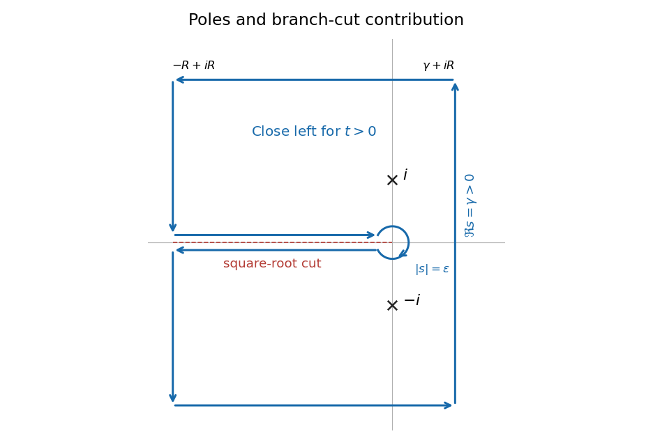

<h1 id="13d/solution">Solution</h1>

↑ **Parent:** [13D](../13d.md)

Choose the principal [branch of a multivalued function](../../../../../branch-of-a-multivalued-function.md), $-\pi<\arg s<\pi$, for $s^{1/2}$. The integrand $G(s)=e^{st}/((s^2+1)\sqrt s)$ has simple poles at $\pm i$ and a [branch cut](../../../../../branch-cut.md) along the negative real axis. Its residues are

$$
\operatorname{Res}_{i}G=\frac{e^{it-i\pi/4}}{2i},\qquad \operatorname{Res}_{-i}G=-\frac{e^{-it+i\pi/4}}{2i},
$$

whose sum is $\sin(t-\pi/4)$.

For $t>0$, close the [Bromwich contour](../../../../../bromwich-contour.md) to the left using a rectangle with outer real part $-R$ and horizontal edges at imaginary parts $\pm R$, indenting the cut and zero. On every distant edge, $|s^2+1|\ge|s|^2-1$, $|\sqrt s|=|s|^{1/2}$ and $|e^{st}|\le e^{\gamma t}$. Each edge has length $O(R)$ and $|s|\ge R$, so its [integral](../../../../../integral.md) is $O(R^{-3/2})$. The small circle of radius $\varepsilon$ about zero contributes $O(\varepsilon^{1/2})$. The tails of the original vertical [integral](../../../../../integral.md) are absolutely bounded by $O(R^{-3/2})$ as well.

On the upper and lower banks at $s=-r$, the square roots are $i\sqrt r$ and $-i\sqrt r$, respectively. With the upper bank traversed toward zero and the lower bank away from zero, their combined [integral](../../../../../integral.md) is

$$
-2i\int_\varepsilon^R\frac{e^{-rt}}{(r^2+1)\sqrt r}\,dr.
$$

The cut [integral](../../../../../integral.md) converges near zero since $r^{-1/2}$ is integrable, and at infinity by exponential decay. The [residue theorem](../../../../../residue-theorem.md), followed by $R\to\infty$ and $\varepsilon\to0$, therefore gives

$$
\boxed{f(t)=\sin(t-\pi/4)+\frac1\pi\int_0^\infty\frac{e^{-rt}}{(r^2+1)\sqrt r}\,dr\quad(t>0).}
$$

For $t<0$, close the [Bromwich contour](../../../../../bromwich-contour.md) to the right. There are no enclosed poles or cuts, and $|e^{st}|\le e^{\gamma t}$ there. The same distant-edge estimates show **$f(t)=0$ for $t<0$**.

**[Figure 1](#13d/image-left-closing-bromwich-contour-with-the-principal-square-root-cut-two-pole-residues-and-a-small-indentation-at-zero). Left-closing Bromwich contour with the principal square-root cut, two pole residues, and a small indentation at zero**.

For the large-$t$ expansion, $1/(1+r^2)=1-r^2+r^4/(1+r^2)$. Scaling $r=u/t$ and using the given [integral](../../../../../integral.md) yields $\int_0^\infty e^{-rt}r^{-1/2}\,dr=\sqrt\pi\,t^{-1/2}$. Integration by parts twice gives the next coefficient $\Gamma(5/2)=3\sqrt\pi/4$. The remainder is bounded by $\int_0^\infty e^{-rt}r^{7/2}\,dr=\Gamma(9/2)t^{-9/2}$. Thus, without needing a globally convergent termwise integration of the local power series,

$$
f(t)=\sin(t-\pi/4)+\frac1{\sqrt{\pi t}}-\frac3{4\sqrt\pi\,t^{5/2}}+O(t^{-9/2}).
$$

In particular, the requested two leading terms are **$\sin(t-\pi/4)+(\pi t)^{-1/2}$**, interpreted as an additive asymptotic expansion. This is [Bromwich inversion with a square-root branch cut](../../../../../bromwich-inversion-with-a-square-root-branch-cut.md).

## ↑ Ancestors (10)

1. [13D](../13d.md)
2. [Paper 1](../../paper-1-split.md)
3. [Ib](../../split.md)
4. [2009](../../../split.md)
5. [Past exam of the mathematics course of the University of Cambridge](../../../../split.md)
6. [Mathematics course of the University of Cambridge](../../../../../mathematics-course-of-the-university-of-cambridge.md)
7. [Course of the University of Cambridge](../../../../../course-of-the-university-of-cambridge.md)
8. [University of Cambridge](../../../../../university-of-cambridge-split.md)
9. [List of universities](../../../../../list-of-universities.md)
10. [Codex Wiki](../../../../../split.md)
