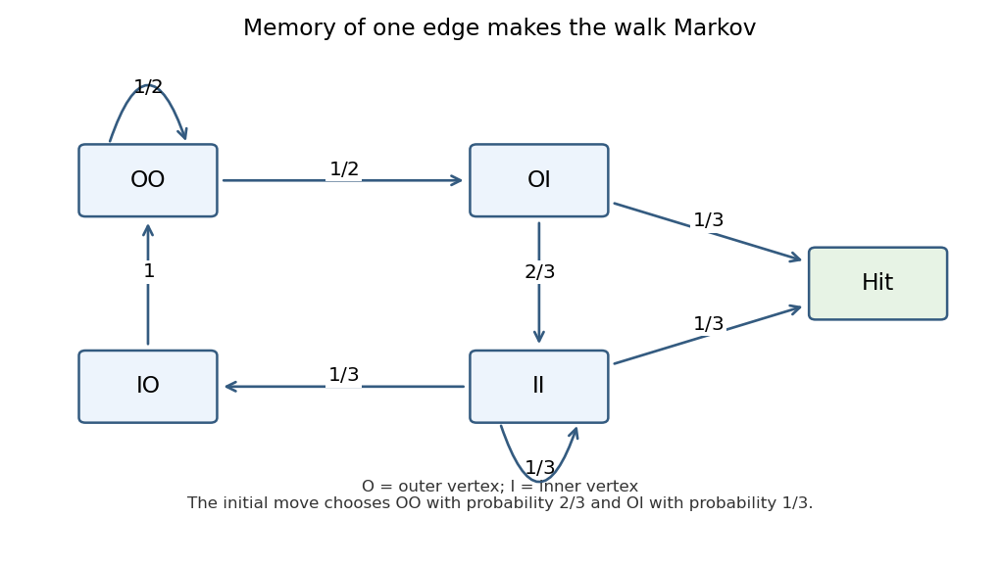

<h1 id="19h/solution">Solution</h1>

↑ **Parent:** [19H](../19h.md)

Read the maze as two four-cycles: outer vertices $O_j$, inner vertices $I_j$ for $j$ modulo four, edges $O_jO_{j+1}$, $I_jI_{j+1}$, and $O_jI_j$, together with edges from every $I_j$ to the target $T$. The starting vertex is an outer vertex. Outer degrees are three and inner degrees are four.

For the ordinary [random walk on a graph](../../../../../random-walk-on-a-graph.md), symmetry gives a common [expected hitting time](../../../../../expected-hitting-time.md) $O$ from an outer vertex and $I$ from an inner one. First-step conditioning gives

$$
O=1+\frac23O+\frac13I,\qquad I=1+\frac14O+\frac12I.
$$

Thus $O=I+3$ and $I=2+O/2$, yielding **$I=7$ and the requested starting mean $O=10$ moves**.

For the [non-backtracking random walk](../../../../../non-backtracking-random-walk.md), the current vertex alone does not form a [Markov chain](../../../../../markov-chain.md). Use states $(a,b)$ recording previous and current vertices. Before hitting $T$, its transitions are $(a,b)\to(b,c)$ with [probability](../../../../../probability.md) $1/(\deg b-1)$ for each neighbor $c\ne a$. Add a starting state with no preceding vertex, choosing its first neighbor with [probability](../../../../../probability.md) $1/3$, and an absorbing hit state. This specifies the full [Markov chain](../../../../../markov-chain.md).

Its directed edges aggregate into types $OO,OI,IO,II$, determined by the two vertex layers. From $OO$ the next type is $OO$ or $OI$ with [probability](../../../../../probability.md) $1/2$ each. From $OI$ it is $II$ with [probability](../../../../../probability.md) $2/3$ and the absorbing state with [probability](../../../../../probability.md) $1/3$. From $IO$ it is always $OO$. From $II$ it is $II$, $IO$ or the absorbing state with [probability](../../../../../probability.md) $1/3$ each. Every nonabsorbing type has a positive uniformly bounded chance of hitting within at most three more moves, so its mean time is finite.

**[Figure 2](#19h/image-transition-probabilities-between-the-four-directed-edge-types-of-the-non-backtracking-maze-walk-and-its-absorbing-target). Transition probabilities between the four directed-edge types of the non-backtracking maze walk and its absorbing target**.

Let their remaining mean times be $A,B,C,D$ in that order. The first-step equations are

$$
A=1+\tfrac12A+\tfrac12B,\quad B=1+\tfrac23D,\quad C=1+A,\quad D=1+\tfrac13C+\tfrac13D.
$$

Solving gives $A=13/2$, $B=9/2$, $C=15/2$, $D=21/4$. The first move from the initial outer vertex reaches type $OO$ with [probability](../../../../../probability.md) $2/3$ and type $OI$ with [probability](../../../../../probability.md) $1/3$, so the intelligent starting mean is

$$
\boxed{1+\frac23\frac{13}{2}+\frac13\frac92=\frac{41}{6}\text{ moves}.}
$$

This [hitting a hub from two four-cycles](../../../../../hitting-a-hub-from-two-four-cycles.md) calculation reduces the mean from $10$ to $41/6$, saving $19/6$ moves. Excluding immediate reversal removes wasteful two-step returns, although it does not guarantee that the next move is toward the target.

## ↑ Ancestors (10)

1. [19H](../19h.md)
2. [Paper 1](../../paper-1-split.md)
3. [Ib](../../split.md)
4. [2009](../../../split.md)
5. [Past exam of the mathematics course of the University of Cambridge](../../../../split.md)
6. [Mathematics course of the University of Cambridge](../../../../../mathematics-course-of-the-university-of-cambridge.md)
7. [Course of the University of Cambridge](../../../../../course-of-the-university-of-cambridge.md)
8. [University of Cambridge](../../../../../university-of-cambridge-split.md)
9. [List of universities](../../../../../list-of-universities.md)
10. [Codex Wiki](../../../../../split.md)
