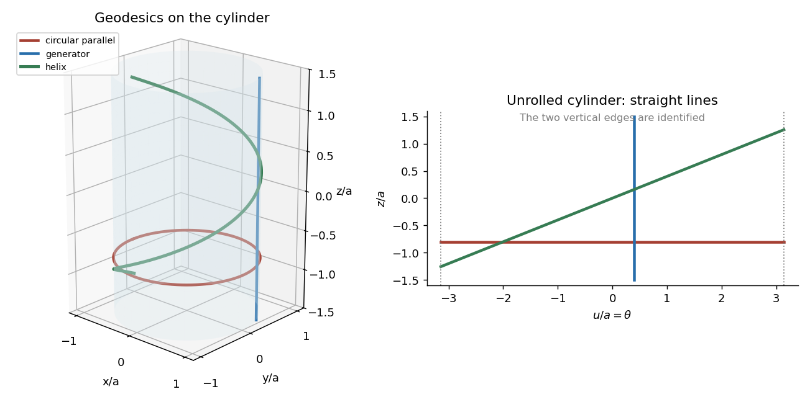

<h1 id="2g/solution">Solution</h1>

↑ **Parent:** [2G](../2g.md)

For local surface coordinates $u^1,u^2$ and metric coefficients $g_{ij}$, affinely parametrized [geodesics](../../../../../geodesic.md) satisfy

$$
\boxed{\ddot u^k+\Gamma^k_{ij}\dot u^i\dot u^j=0,\qquad
\Gamma^k_{ij}=\frac12g^{k\ell}(\partial_i g_{j\ell}+\partial_jg_{i\ell}-\partial_\ell g_{ij}).}
$$

These are the [geodesic equation](../../../../../geodesic-equation.md) and [Christoffel symbols](../../../../../christoffel-symbol.md). They follow by applying the [Euler-Lagrange equation](../../../../../euler-lagrange-equation.md) to the energy $\tfrac12g_{ij}\dot u^i\dot u^j$. Equivalently, in an embedded surface a constant-speed [geodesic](../../../../../geodesic.md) has acceleration normal to the surface.

Parameterize a [circular cylinder](../../../../../circular-cylinder.md) by $(a\cos\theta,a\sin\theta,z)$, where $a>0$. Its [induced metric](../../../../../induced-metric.md) is $a^2d\theta^2+dz^2$, with constant coefficients, so all [Christoffel symbols](../../../../../christoffel-symbol.md) vanish in this chart. Thus

$$
\boxed{\theta(s)=\theta_0+cs,\qquad z(s)=z_0+ds.}
$$

These [geodesics on a circular cylinder](../../../../../geodesics-on-a-circular-cylinder.md) are straight generators when $c=0$, circles around the cylinder when $d=0$, and [helices](../../../../../helix.md) when $cd\ne0$. Constant curves arise if both vanish. For unit-speed nonconstant curves, $a^2c^2+d^2=1$. This description is global after allowing the angle to run through arbitrary multiples of $2\pi$.

**[Figure 1](#2g/image-generators-circular-parallels-and-helices-on-a-cylinder-become-straight-lines-when-the-cylinder-is-unrolled). Generators, circular parallels and helices on a cylinder become straight lines when the cylinder is unrolled**.

The unrolled coordinate $u=a\theta$ exhibits the [intrinsic flatness of a circular cylinder](../../../../../intrinsic-flatness-of-a-circular-cylinder.md): every displayed family is a straight line in $(u,z)$. A circle is therefore a [geodesic](../../../../../geodesic.md) despite bending in ambient three-dimensional space; its acceleration is normal to the cylinder.

## ↑ Ancestors (10)

1. [2G](../2g.md)
2. [Paper 3](../../paper-3-split.md)
3. [Ib](../../split.md)
4. [2009](../../../split.md)
5. [Past exam of the mathematics course of the University of Cambridge](../../../../split.md)
6. [Mathematics course of the University of Cambridge](../../../../../mathematics-course-of-the-university-of-cambridge.md)
7. [Course of the University of Cambridge](../../../../../course-of-the-university-of-cambridge.md)
8. [University of Cambridge](../../../../../university-of-cambridge-split.md)
9. [List of universities](../../../../../list-of-universities.md)
10. [Codex Wiki](../../../../../split.md)
