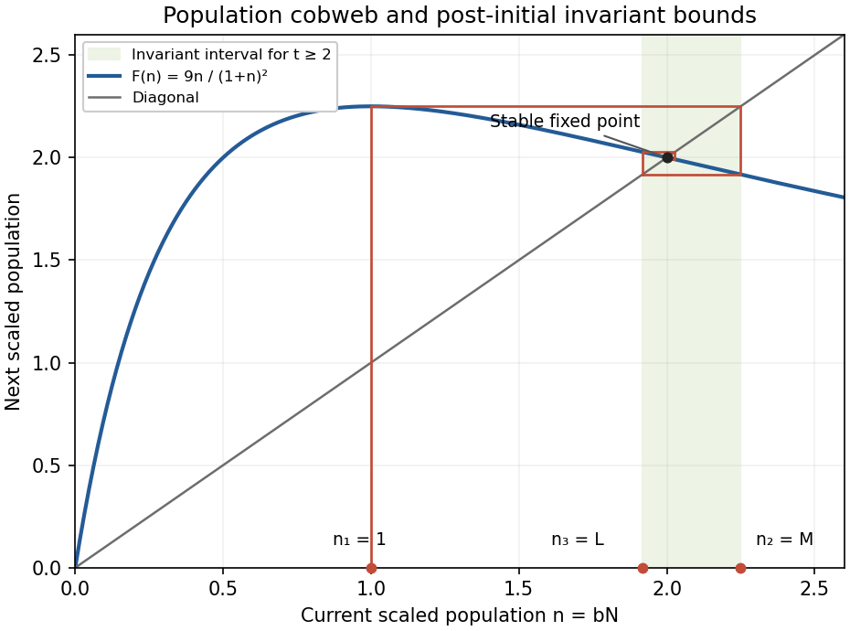

<h1 id="6a/solution">Solution</h1>

↑ **Parent:** [6A](../6a.md)

In the [squared-denominator population map](../../../../../squared-denominator-population-map.md), $r$ is the low-density per-generation multiplication factor, while $b$ controls crowding: $1/b$ is the characteristic population scale. The nonzero [fixed point](../../../../../fixed-point.md) for $r>1$ and its multiplier are

$$
\boxed{N_*=(\sqrt r-1)/b,\qquad F'(N_*)=2/\sqrt r-1.}
$$

Since this multiplier lies strictly between minus one and one, $N_*$ is locally asymptotically stable. This holds for every finite $r>1$, even when the map is locally decreasing at its [fixed point](../../../../../fixed-point.md).

For the [post-initial invariant interval for a squared-denominator population map](../../../../../post-initial-invariant-interval-for-a-squared-denominator-population-map.md), put $M=r/(4b)$ and $L=4r^2/[b(r+4)^2]$. The derivative $F'(N)=r(1-bN)/(1+bN)^3$ shows that the global maximum is $M$ at $N=1/b$. The first two iterates of the supplied initial condition are consequently

$$
N_2=M,\qquad N_3=F(M)=L.
$$

For $r>4$, $1/b<L\leq M$. Hence the map decreases throughout $[L,M]$, with minimum $F(M)=L$ there, and its global maximum bound ensures $F(L)\leq M$. Thus $F([L,M])\subseteq[L,M]$, and induction proves

$$
\boxed{L\leq N_t\leq M\quad\text{for every }t\geq2.}
$$

Both endpoints are attained at $t=2,3$. The lower bound printed without a time qualification is false at $t=1$, because the given value $N_1=1/b$ is strictly below $L$ when $r>4$. The invariant bounds apply after that initial step, not to it.

The [cobweb plot](../../../../../cobweb-plot.md) below uses $n=bN$ and $r=9$. The first vertical move reaches the maximum, the next reaches its image, and subsequent vertical/horizontal steps remain in the invariant interval and approach the stable [fixed point](../../../../../fixed-point.md).

**[Figure 1](#6a/image-cobweb-of-the-squared-denominator-population-map-showing-the-invariant-interval-from-the-second-iterate). Cobweb of the squared-denominator population map, showing the invariant interval from the second iterate**.

## ↑ Ancestors (10)

1. [6A](../6a.md)
2. [Paper 1](../../paper-1-split.md)
3. [Ii](../../split.md)
4. [2009](../../../split.md)
5. [Past exam of the mathematics course of the University of Cambridge](../../../../split.md)
6. [Mathematics course of the University of Cambridge](../../../../../mathematics-course-of-the-university-of-cambridge.md)
7. [Course of the University of Cambridge](../../../../../course-of-the-university-of-cambridge.md)
8. [University of Cambridge](../../../../../university-of-cambridge-split.md)
9. [List of universities](../../../../../list-of-universities.md)
10. [Codex Wiki](../../../../../split.md)
