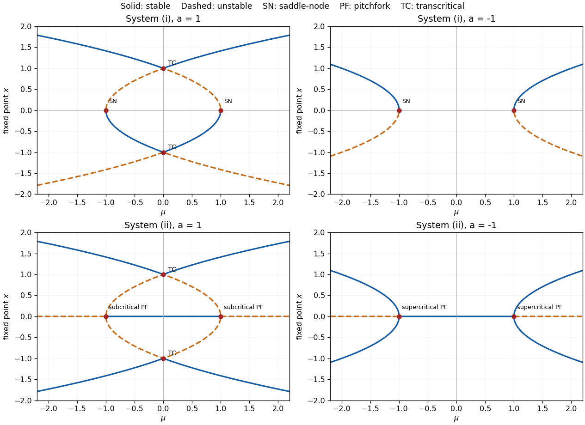
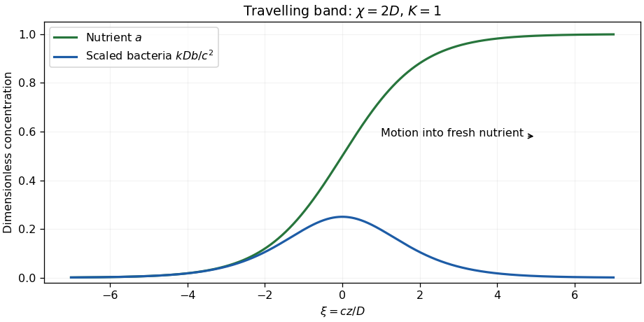

# Paper 2

↑ **Parent:** [Ii](../ii.md)

[https://www.maths.cam.ac.uk/undergrad/pastpapers/files/2009/PaperII_2.pdf](https://www.maths.cam.ac.uk/undergrad/pastpapers/files/2009/PaperII_2.pdf)

**Table of contents**

- [1G](#1g)
  - [Solution](#1g/solution)
- [2F](#2f)
  - [a](#2f/a)
    - [Solution](#2f/a/solution)
  - [b](#2f/b)
    - [Solution](#2f/b/solution)
- [3F](#3f)
  - [Solution](#3f/solution)
- [4H](#4h)
  - [Solution](#4h/solution)
- [5I](#5i)
  - [Solution](#5i/solution)
- [6A](#6a)
  - [Solution](#6a/solution)
- [7E](#7e)
  - [i](#7e/i)
    - [Solution](#7e/i/solution)
  - [ii](#7e/ii)
    - [Solution](#7e/ii/solution)
- [8B](#8b)
  - [i](#8b/i)
    - [Solution](#8b/i/solution)
  - [ii](#8b/ii)
    - [Solution](#8b/ii/solution)
- [9E](#9e)
  - [Solution](#9e/solution)
- [10D](#10d)
  - [a](#10d/a)
    - [Solution](#10d/a/solution)
  - [b](#10d/b)
    - [Solution](#10d/b/solution)
- [11F](#11f)
  - [a](#11f/a)
    - [Solution](#11f/a/solution)
  - [b](#11f/b)
    - [Solution](#11f/b/solution)
  - [c](#11f/c)
    - [Solution](#11f/c/solution)
- [12H](#12h)
  - [Solution](#12h/solution)
- [13A](#13a)
  - [Solution](#13a/solution)
- [14C](#14c)
  - [i](#14c/i)
    - [Solution](#14c/i/solution)
  - [ii](#14c/ii)
    - [Solution](#14c/ii/solution)
- [15E](#15e)
  - [Solution](#15e/solution)
  - [i](#15e/i)
    - [Solution](#15e/i/solution)
  - [ii](#15e/ii)
    - [Solution](#15e/ii/solution)
- [16G](#16g)
  - [i](#16g/i)
    - [Solution](#16g/i/solution)
  - [ii](#16g/ii)
    - [Solution](#16g/ii/solution)
- [17F](#17f)
  - [i](#17f/i)
    - [Solution](#17f/i/solution)
  - [ii](#17f/ii)
    - [Solution](#17f/ii/solution)
- [18H](#18h)
  - [Solution](#18h/solution)
- [19F](#19f)
  - [i](#19f/i)
    - [Solution](#19f/i/solution)
  - [ii](#19f/ii)
    - [Solution](#19f/ii/solution)
  - [iii](#19f/iii)
    - [Solution](#19f/iii/solution)
- [20H](#20h)
  - [i](#20h/i)
    - [Solution](#20h/i/solution)
  - [ii](#20h/ii)
    - [Solution](#20h/ii/solution)
  - [iii](#20h/iii)
    - [Solution](#20h/iii/solution)
- [21G](#21g)
  - [Solution](#21g/solution)
- [22H](#22h)
  - [a](#22h/a)
    - [Solution](#22h/a/solution)
  - [b](#22h/b)
    - [Solution](#22h/b/solution)
  - [c](#22h/c)
    - [Solution](#22h/c/solution)
- [23G](#23g)
  - [a](#23g/a)
    - [Solution](#23g/a/solution)
  - [b](#23g/b)
    - [Solution](#23g/b/solution)
- [24G](#24g)
  - [Solution](#24g/solution)
- [25H](#25h)
  - [a](#25h/a)
    - [Solution](#25h/a/solution)
  - [b](#25h/b)
    - [Solution](#25h/b/solution)
  - [c](#25h/c)
    - [Solution](#25h/c/solution)
- [26J](#26j)
  - [Solution](#26j/solution)
- [27J](#27j)
  - [a](#27j/a)
    - [Solution](#27j/a/solution)
  - [b](#27j/b)
    - [Solution](#27j/b/solution)
- [28I](#28i)
  - [Solution](#28i/solution)
- [29I](#29i)
  - [Solution](#29i/solution)
- [30J](#30j)
  - [Solution](#30j/solution)
- [31B](#31b)
  - [a](#31b/a)
    - [Solution](#31b/a/solution)
  - [b](#31b/b)
    - [Solution](#31b/b/solution)
  - [c](#31b/c)
    - [Solution](#31b/c/solution)
- [32B](#32b)
  - [Solution](#32b/solution)
- [33C](#33c)
  - [Solution](#33c/solution)
- [34D](#34d)
  - [Solution](#34d/solution)
- [35D](#35d)
  - [i](#35d/i)
    - [Solution](#35d/i/solution)
  - [ii](#35d/ii)
    - [Solution](#35d/ii/solution)
  - [iii](#35d/iii)
    - [Solution](#35d/iii/solution)
- [36D](#36d)
  - [Solution](#36d/solution)
- [37E](#37e)
  - [Solution](#37e/solution)
- [38A](#38a)
  - [Solution](#38a/solution)
- [39B](#39b)
  - [i](#39b/i)
    - [Solution](#39b/i/solution)
  - [ii](#39b/ii)
    - [Solution](#39b/ii/solution)
  - [iii](#39b/iii)
    - [Solution](#39b/iii/solution)

## 1G

↑ **Parent:** [Paper 2](paper-2.md)

<h3 id="1g/solution">Solution</h3>

↑ **Parent:** [1G](#1g)

For odd positive coprime integers, [quadratic reciprocity](../../../number-theory.md#quadratic-reciprocity) for the [Jacobi symbol](../../../number-theory.md#jacobi-symbol) is

$$
\boxed{\left(\frac mn\right)\left(\frac nm\right)=(-1)^{(m-1)(n-1)/4}.}
$$

If the integers are not coprime, both symbols vanish; equivalently the usual signed reciprocity identity still holds. To deduce it from [quadratic reciprocity](../../../number-theory.md#quadratic-reciprocity) for the [Legendre symbol](../../../number-theory.md#legendre-symbol), factor $m=\prod_i p_i^{a_i}$ and $n=\prod_jq_j^{b_j}$. Multiplication of the prime reciprocity identities gives the sign exponent

$$
\sum_{i,j}a_ib_j\frac{p_i-1}{2}\frac{q_j-1}{2}
=\left(\sum_i a_i\frac{p_i-1}{2}\right)\left(\sum_j b_j\frac{q_j-1}{2}\right).
$$

Modulo two, each bracket is respectively $(m-1)/2$ and $(n-1)/2$: for odd $u,v$, $(uv-1)/2\equiv(u-1)/2+(v-1)/2\pmod2$. This proves the composite-denominator law, including repeated prime factors.

Now $261=9\cdot29$, and 9 contributes a square factor. Since $317\equiv1\pmod4$, reciprocity and reduction of the numerator give

$$
\left(\frac{261}{317}\right)=\left(\frac{29}{317}\right)=\left(\frac{27}{29}\right)=\left(\frac3{29}\right).
$$

A second reciprocity step gives $(3/29)=(29/3)(-1)^{14}=(2/3)=-1$. Thus **the requested [Jacobi symbol](../../../number-theory.md#jacobi-symbol) is $-1$**.

## 2F

↑ **Parent:** [Paper 2](paper-2.md)

<h3 id="2f/a">a</h3>

↑ **Parent:** [2F](#2f)

<h4 id="2f/a/solution">Solution</h4>

↑ **Parent:** [A](#2f/a)

The [Chebyshev alternation theorem](../../../uniform-approximation.md#equioscillation-theorem) says that for $f\in C([a,b])$ a [polynomial](../../../polynomial.md) $q$ of degree at most $n-1$ is a best [uniform approximation](../../../uniform-approximation.md) precisely when there are $n+1$ ordered points $a\leq x_0<\cdots<x_n\leq b$ such that

$$
f(x_j)-q(x_j)=\varepsilon(-1)^j\|f-q\|_\infty,\qquad\varepsilon\in\{1,-1\}.
$$

The best [polynomial](../../../polynomial.md) is unique. These equally large alternating extrema are the equal-ripple criterion; the zero-error case is interpreted in the evident way.

<h3 id="2f/b">b</h3>

↑ **Parent:** [2F](#2f)

<h4 id="2f/b/solution">Solution</h4>

↑ **Parent:** [B](#2f/b)

Set $p_*(x)=2^{1-n}T_n(x)$, a monic [Chebyshev polynomial](../../../numerical-analysis.md#chebyshev-polynomial). Its norm on $[-1,1]$ is $2^{1-n}$. At the ordered points $x_j=\cos((n-j)\pi/n)$, its values alternate between the two extreme values $\pm2^{1-n}$.

Approximate $f(x)=x^n$ by [polynomials](../../../polynomial.md) of degree at most $n-1$. The error corresponding to $q_*=x^n-p_*$ is exactly $p_*$. The [Chebyshev alternation theorem](../../../uniform-approximation.md#equioscillation-theorem) therefore makes $q_*$ the unique best approximant. For any monic $p$, the [polynomial](../../../polynomial.md) $q=x^n-p$ is an admissible approximant, so

$$
\boxed{\|p\|_\infty=\|x^n-q\|_\infty\geq\|p_*\|_\infty=2^{1-n}.}
$$

Equality holds precisely for $p=p_*$. Alternatively, a smaller norm would force $p-p_*$ to change sign between each consecutive pair of alternating extrema, giving at least $n$ zeros to a [polynomial](../../../polynomial.md) of degree at most $n-1$.

## 3F

↑ **Parent:** [Paper 2](paper-2.md)

<h3 id="3f/solution">Solution</h3>

↑ **Parent:** [3F](#3f)

In the upper-half-plane model, with metric $ds^2=(dx^2+dy^2)/y^2$, the [hyperbolic geodesics](../../../geometry-and-topology.md#geodesic-in-the-poincare-half-plane-model) are vertical lines and semicircles [orthogonal](../../../linear-algebra.md#orthogonal-vectors) to the real boundary. Two [geodesics](../../../riemannian-geometry.md#geodesic) with disjoint endpoints and no intersection are ultraparallel and have a common perpendicular $h$. To construct it, send one [geodesic](../../../riemannian-geometry.md#geodesic) to the imaginary axis by an [isometry](../../../riemannian-geometry.md#isometry). The second then has endpoints $0<a<b$ after a possible reflection. The semicircle centered at zero with radius $\sqrt{ab}$ is perpendicular to the imaginary axis and to the second [circle](../../../topology.md#circle): its squared radius plus $((b-a)/2)^2$ equals $((a+b)/2)^2$, the orthogonality condition for the two [circles](../../../topology.md#circle).

Let the intersection points of $h$ with the given [geodesics](../../../riemannian-geometry.md#geodesic) have signed arclength coordinates $s_1,s_2$ on $h$. Each [hyperbolic reflection](../../../geometry-and-topology.md#hyperbolic-reflection) preserves $h$ and restricts there to $s\mapsto2s_i-s$: the perpendicular intersection point is fixed and the tangent direction along $h$ is reversed. Thus their composition restricts to

$$
s\longmapsto2s_1-(2s_2-s)=s+2(s_1-s_2).
$$

The displacement is nonzero since the two perpendicular intersection points differ. Its $N$th iterate translates by $2N(s_1-s_2)$, which is never zero for $N>0$. **The composite is a hyperbolic translation of infinite order.** The assumption excluding a common endpoint ensures the common perpendicular used here exists.

## 4H

↑ **Parent:** [Paper 2](paper-2.md)

<h3 id="4h/solution">Solution</h3>

↑ **Parent:** [4H](#4h)

The supplied congruence is a [congruence of squares](../../../number-theory.md#congruence-of-squares), since $25=5^2$. Hence

$$
3953\mid(2886-5)(2886+5).
$$

A nontrivial square root modulo a product of two odd primes may agree with $+5$ modulo one prime and $-5$ modulo the other. Taking greatest common divisors separates these factors. The [Euclidean algorithm](../../../number-theory.md#euclidean-algorithm) gives

$$
\gcd(3953,2881)=67,\qquad\gcd(3953,2891)=59.
$$

For example the successive remainders for the first computation are $1072,737,335,67,0$; for the second they are $1062,767,295,177,118,59,0$. Therefore

$$
\boxed{3953=59\cdot67.}
$$

Both numbers are prime by trial division by primes at most their square roots. More generally, given $a^2\equiv b^2\pmod N$ with $a\not\equiv\pm b\pmod N$, computing $\gcd(N,a-b)$ often produces a proper factor. The method requires no prior knowledge of which prime gives which sign, and is the basic factor-extraction step in congruence-of-squares algorithms.

## 5I

↑ **Parent:** [Paper 2](paper-2.md)

<h3 id="5i/solution">Solution</h3>

↑ **Parent:** [5I](#5i)

An [exponential dispersion family](../../../exponential-family.md#exponential-dispersion-model) has density or mass function

$$
p(y;\theta,\phi)=\exp\left\{\frac{y\theta-b(\theta)}{a(\phi)}+c(y,\phi)\right\},
$$

with support independent of the natural parameter $\theta$. Usually $a(\phi)=\phi/w$ for a known weight $w$. For the [Poisson distribution](../../../discrete-probability-distribution.md#poisson-distribution), identify

$$
\theta=\log\lambda,\qquad b(\theta)=e^\theta,\qquad a(\phi)=1,\qquad c(y,\phi)=-\log(y!),\quad y\in\mathbb N_0.
$$

The dispersion is fixed at one. Differentiating the normalizing identity gives $\mathbb EY=b'(\theta)$; differentiating again gives $\operatorname{Var}Y=a(\phi)b''(\theta)$. Here both [derivatives](../../../calculus.md#derivative) equal $e^\theta=\lambda$, so

$$
\boxed{\mathbb EY=\lambda,\qquad\operatorname{Var}Y=\lambda,\qquad V(\mu)=\mu.}
$$

The [variance function](../../../exponential-family.md#variance-function) expresses $b''(\theta)$ in terms of the mean $\mu$. The [canonical link function](../../../statistical-modelling.md#canonical-link-function) maps the mean to the natural parameter, so **the Poisson canonical link is $g(\mu)=\log\mu$**.

## 6A

↑ **Parent:** [Paper 2](paper-2.md)

<h3 id="6a/solution">Solution</h3>

↑ **Parent:** [6A](#6a)

By the [law of mass action](../../../mathematical-biology.md#law-of-mass-action), the net changes in the intermediate concentrations are

$$
\dot X=k_1A-(k_2B+k_4)X+k_3X^2Y,\qquad\dot Y=k_2BX-k_3X^2Y.
$$

The autocatalytic reaction increases $X$ by one and decreases $Y$ by one; its reaction-rate convention is $k_3X^2Y$. With the specified common concentration scale and time scale, choose

$$
\boxed{\alpha=\frac{k_4}{k_1A},\qquad a=\frac{k_3(k_1A)^2}{k_4^3},\qquad b=\frac{k_2B}{k_4}.}
$$

Substitution gives the nondimensional [Brusselator](../../../diffusion-equation.md#brusselator) system. Adding its two steady equations gives $u=1$, and then the second gives $v=b/a$. Its [Jacobian matrix](../../../calculus.md#jacobian-matrix) there is

$$
J=\begin{pmatrix}b-1&a\\-b&-a\end{pmatrix},\qquad\operatorname{tr}J=b-1-a,\quad\det J=a>0.
$$

The equilibrium is asymptotically stable for $b<1+a$ and unstable for $b>1+a$. At $b_c=1+a$ the [eigenvalues](../../../linear-operator-theory.md#eigenvalue) are $\pm i\sqrt a$, crossing the imaginary axis with nonzero speed $\frac d{db}\operatorname{Re}\lambda=1/2$.

The nonlinear [Hopf bifurcation](../../../dynamical-systems.md#hopf-bifurcation) is nondegenerate. At the threshold, put $x=u-1$ and $y=-\sqrt a[(u-1)+(v-b/a)]$. The translated equations are

$$
x'=-\sqrt a\,y+(1-a)x^2-2\sqrt a\,xy-ax^3-\sqrt a\,x^2y,\qquad y'=\sqrt a\,x.
$$

The [Hopf coefficient of the Brusselator](../../../diffusion-equation.md#hopf-coefficient-of-the-brusselator) in the planar radial normalization is $-(a+2)/8<0$: the cubic contribution is $-6a/16$ and the quadratic contribution is $[-2\sqrt a\,2(1-a)]/(16\sqrt a)$. Consequently the bifurcation is supercritical, producing small stable oscillations on the unstable-equilibrium side. Their limiting period is

$$
\boxed{P_\tau\longrightarrow\frac{2\pi}{\sqrt a},\qquad P_t\longrightarrow\frac{2\pi}{k_4\sqrt a}.}
$$

## 7E

↑ **Parent:** [Paper 2](paper-2.md)

<h3 id="7e/i">i</h3>

↑ **Parent:** [7E](#7e)

<h4 id="7e/i/solution">Solution</h4>

↑ **Parent:** [I](#7e/i)

Write $F(x)=\mu^2-(x^2-a)^2$. Its [fixed points](../../../function.md#fixed-point) satisfy $x^2=a\pm|\mu|$, retaining only nonnegative right sides. At a simple [fixed point](../../../function.md#fixed-point),

$$
F'(x)=-4x(x^2-a).
$$

Thus on the outer branches $x^2=a+|\mu|$, the positive point is stable and the negative point unstable. On the inner branches $x^2=a-|\mu|$, the positive point is unstable and the negative point stable.

For $a>0$, there are four simple points for $0<|\mu|<a$, two for $|\mu|>a$, and a saddle-node at each $(\mu,x)=(\pm a,0)$, where the two inner points coalesce. At $\mu=0$, there are also bifurcations at $x=\pm\sqrt a$. The smooth branches $x=\pm\sqrt{a+\mu}$ and $x=\pm\sqrt{a-\mu}$ cross and exchange stability. Locally $F=\mu^2-4a\xi^2+\text{higher terms}$, where $\xi=x-x_0$. After a parameter-dependent shift this is a [transcritical bifurcation](../../../dynamical-systems.md#transcritical-bifurcation). It is not an ordinary saddle-node: two nearby branches exist on both sides of zero. At zero itself each crossing point is semistable, attracting from the right and repelling from the left.

For $a<0$, the only possible branch is $x=\pm\sqrt{a+|\mu|}$, existing for $|\mu|\geq|a|$. Each point $(\pm|a|,0)$ is a [saddle-node bifurcation](../../../dynamical-systems.md#saddle-node-bifurcation). There are no [fixed points](../../../function.md#fixed-point) for $|\mu|<|a|$; outside that interval the positive point is stable and the negative point unstable. At either threshold $F\sim2ax^2<0$, so the zero point is semistable. The first row of the diagram displays these branches; solid curves are stable and dashed curves unstable.

**[Figure 1](#7e/i/image-fixed-point-bifurcation-diagrams-for-both-scalar-systems-with-positive-and-negative-a-stable-branches-are-solid-and-unstable-branches-dashed). Fixed-point bifurcation diagrams for both scalar systems with positive and negative a; stable branches are solid and unstable branches dashed**.

<h3 id="7e/ii">ii</h3>

↑ **Parent:** [7E](#7e)

<h4 id="7e/ii/solution">Solution</h4>

↑ **Parent:** [Ii](#7e/ii)

Now $G(x)=x[\mu^2-(x^2-a)^2]$. The zero point exists for all parameters and has [eigenvalue](../../../linear-operator-theory.md#eigenvalue) $G'(0)=\mu^2-a^2$, so it is stable for $|\mu|<|a|$ and unstable for $|\mu|>|a|$. At every nonzero [fixed point](../../../function.md#fixed-point),

$$
G'(x)=-4x^2(x^2-a).
$$

Both outer branches are stable and both inner branches unstable.

For $a>0$, the nonzero locations are as in part (i). At $(\mu,x)=(\pm a,0)$ the local equation is $\dot x=(\mu^2-a^2)x+2ax^3+O(x^5)$: these are [subcritical pitchfork bifurcations](../../../dynamical-systems.md#subcritical-pitchfork-bifurcation), with the two unstable inner branches present on the side where zero is stable. At the bifurcation itself $\dot x\sim2ax^3$, so zero is unstable. At $(0,\pm\sqrt a)$ the inner and outer branches cross and exchange stability in [transcritical bifurcations](../../../dynamical-systems.md#transcritical-bifurcation). The positive crossing is semistable, attracting from the right; the negative crossing is semistable, attracting from the left, because the additional factor $x$ reverses the local flow there.

For $a<0$, the outer stable pair exists only for $|\mu|>|a|$. The points $(\pm|a|,0)$ are [supercritical pitchfork bifurcations](../../../dynamical-systems.md#supercritical-pitchfork-bifurcation), since the cubic coefficient $2a$ is negative. Zero loses stability as $|\mu|$ increases across $|a|$, and a stable symmetric pair appears. At the threshold zero remains nonlinearly stable, with $\dot x\sim2ax^3$. There are no further bifurcations. The second row of the preceding figure gives the diagrams. The plots use $a=\pm1$; the general locations are obtained from the formulas above.

## 8B

↑ **Parent:** [Paper 2](paper-2.md)

<h3 id="8b/i">i</h3>

↑ **Parent:** [8B](#8b)

<h4 id="8b/i/solution">Solution</h4>

↑ **Parent:** [I](#8b/i)

Use the sign convention in the question: the [Hilbert transform](../../../analysis.md#hilbert-transform) kernel is $(y-x)^{-1}$, the negative of another common convention. A contour indentation at the origin gives

$$
\operatorname{pv}\int_{\mathbb R}\frac{e^{isy}}{y-x}\,dy=i\pi\operatorname{sgn}(s)e^{isx}.
$$

For $s>0$ close the contour in the upper half-plane; for $s<0$ close it below. Thus the transform of $\sin(sx)$ is $\cos(sx)$ for $s>0$. Since $(1-\cos x)/x=\int_0^1\sin(sx)\,ds$, integration of this multiplier identity, justified first with an Abel regularization, yields

$$
\boxed{\widehat f(x)=\frac{\sin x}{x},\qquad\widehat f(0)=1.}
$$

The value at zero also follows directly from $\pi^{-1}\int(1-\cos y)y^{-2}\,dy=1$.

<h3 id="8b/ii">ii</h3>

↑ **Parent:** [8B](#8b)

<h4 id="8b/ii/solution">Solution</h4>

↑ **Parent:** [Ii](#8b/ii)

Splitting the exponential into the half-plane where it decays gives

$$
\boxed{f^+(z)=\frac{1-e^{iz}}{2z},\qquad f^-(z)=\frac{e^{-iz}-1}{2z}.}
$$

Their singularities at zero are removable. The first function is analytic above the real axis and the second below it; their exponential terms are bounded in those respective half-planes, giving the required $O(1/z)$ decay. Their difference on the real axis is the prescribed jump. Moreover their sum there is $-i\sin x/x$, agreeing with the [Sokhotski–Plemelj formula](../../../complex-analysis.md#sokhotski-plemelj-theorem) and the transform computed above.

For uniqueness in the class with continuous boundary values, subtract two solutions. The zero jump glues their differences into an entire function, tending to zero at infinity. [Liouville's theorem](../../../complex-analysis.md#liouville-theorem) makes it zero. Thus these are the unique solutions of the [Riemann-Hilbert problem](../../../differential-equation.md#riemann-hilbert-problem) with the stated decay.

## 9E

↑ **Parent:** [Paper 2](paper-2.md)

<h3 id="9e/solution">Solution</h3>

↑ **Parent:** [9E](#9e)

For $q=(x_1,\eta_1,\eta_2)^T$, the [Euler-Lagrange equations](../../../analysis.md#euler-lagrange-equation) give

$$
m\ddot q+\mu Kq=0,\qquad K=\begin{pmatrix}19/3&-1&0\\-1&2&-1\\0&-1&1\end{pmatrix}.
$$

In components these are $m\ddot x_1=-\mu(19x_1/3-\eta_1)$, $m\ddot\eta_1=-\mu(2\eta_1-x_1-\eta_2)$ and $m\ddot\eta_2=-\mu(\eta_2-\eta_1)$. A [normal mode](../../../wave-equation.md#normal-mode) has $q=v\cos(\omega t+\delta)$ and satisfies $Kv=(m\omega^2/\mu)v$. For [eigenvalue](../../../linear-operator-theory.md#eigenvalue) $1/3$, the first and third rows give $\eta_1=6x_1$ and $\eta_2=3\eta_1/2$, and the second row then agrees. Hence

$$
\boxed{q=C(1,6,9)^T\cos\left(\sqrt{\frac\mu{3m}}t+\delta\right),\qquad P=2\pi\sqrt{\frac{3m}{\mu}}.}
$$

The particle positions are recovered by adding the equilibrium offsets to the last two entries. Their displacements are in phase with amplitude ratio $1:6:9$.

## 10D

↑ **Parent:** [Paper 2](paper-2.md)

<h3 id="10d/a">a</h3>

↑ **Parent:** [10D](#10d)

<h4 id="10d/a/solution">Solution</h4>

↑ **Parent:** [A](#10d/a)

Substitute $x=pc/(k_BT)$ in the [Fermi-Dirac distribution](../../../statistical-physics.md#fermi-dirac-distribution) energy [integral](../../../calculus.md#integral). Then

$$
\epsilon=\frac{4\pi k_B^4}{h^3c^3}T^4\int_0^\infty\frac{x^3}{e^x+1}\,dx.
$$

The [integral](../../../calculus.md#integral) converges, is positive, and is independent of temperature. Thus **$\epsilon=\alpha T^4$**, with $\alpha$ equal to the displayed constant [integral](../../../calculus.md#integral). The given normalization is for the specified degeneracy; further internal degrees of freedom multiply it.

<h3 id="10d/b">b</h3>

↑ **Parent:** [10D](#10d)

<h4 id="10d/b/solution">Solution</h4>

↑ **Parent:** [B](#10d/b)

For a relativistic species at zero chemical potential, $p=\epsilon/3$ and $s=(\epsilon+p)/T_i$, so its [entropy density](../../../thermodynamics.md#entropy-density) is proportional to $g_iT_i^3$. The [Bose-Einstein distribution](../../../statistical-physics.md#bose-einstein-distribution) gives the bosonic normalization, while the fermionic thermal [integral](../../../calculus.md#integral) is $7/8$ of it. Species still in thermal equilibrium have $T_i=T$; freely streaming decoupled species can have another temperature and therefore contribute an extra factor $(T_i/T)^3$ when the total is expressed in [units](../../../algebra.md#unit-in-a-ring) of $T^3$. This gives the two terms $N_*$ and $N_{SD}$ and their stated effective-degree-of-freedom weights.

After neutrino decoupling, the [comoving entropy](../../../thermodynamics.md#comoving-entropy) of the photon-electron-positron plasma is conserved separately from the neutrinos. Before electron-positron annihilation its effective [entropy](../../../thermodynamics.md#entropy) count is $2+(7/8)4=11/2$; afterwards it is $2$. Consequently

$$
\frac{11}{2}(aT_{\rm before})^3=2(aT_\gamma)^3,
$$

whereas $aT_\nu$ stays equal to its pre-annihilation value. Hence

$$
\boxed{\frac{T_\nu}{T_\gamma}=\left(\frac4{11}\right)^{1/3}.}
$$

This is the instantaneous-decoupling, negligible residual-electron approximation used in the question. Heating of the still-coupled plasma, not cooling peculiar to neutrinos, creates the temperature difference.

## 11F

↑ **Parent:** [Paper 2](paper-2.md)

<h3 id="11f/a">a</h3>

↑ **Parent:** [11F](#11f)

<h4 id="11f/a/solution">Solution</h4>

↑ **Parent:** [A](#11f/a)

The planar [Brouwer fixed-point theorem](../../../topological-analysis.md#brouwer-fixed-point-theorem) states that every continuous map from a nonempty [compact](../../../topology.md#compact-space) convex subset of $\mathbb R^2$ to itself has a [fixed point](../../../function.md#fixed-point). In particular it applies to a closed disk or a closed triangle. Convexity and compactness are essential hypotheses in this formulation.

<h3 id="11f/b">b</h3>

↑ **Parent:** [11F](#11f)

<h4 id="11f/b/solution">Solution</h4>

↑ **Parent:** [B](#11f/b)

Let $v_I,v_J,v_K$ be the vertices opposite the corresponding sides, and let $\lambda_I,\lambda_J,\lambda_K$ be their barycentric coordinates. We prove the equivalence by negating each assertion.

Suppose the closed covering sets have empty triple intersection. For $x\in T$ put $d_I(x)=\operatorname{dist}(x,A)$, and define $d_J,d_K$ similarly. At least one distance is positive, since $x$ cannot belong to all three sets, and at least one is zero, since they cover $T$. Consequently

$$
f(x)=\frac{d_I(x)v_I+d_J(x)v_J+d_K(x)v_K}{d_I(x)+d_J(x)+d_K(x)}
$$

is continuous and lies in the boundary: one barycentric coordinate vanishes. On $I$ its first coefficient is zero because $I\subseteq A$, so $f(I)\subseteq I$, and likewise for the other sides. This contradicts assertion (1), proving (1) implies (2).

Conversely, suppose such a boundary-valued map exists. Define closed subsets of $\mathbb R^2$ by

$$
A=\{x\in T:\lambda_I(f(x))=0\},\quad B=\{x\in T:\lambda_J(f(x))=0\},\quad C=\{x\in T:\lambda_K(f(x))=0\}.
$$

They are closed because $T$ is [compact](../../../topology.md#compact-space) and the coordinate functions are continuous. They cover $T$ because $f$ is boundary-valued; the side-preserving condition gives $I\subseteq A$, $J\subseteq B$, $K\subseteq C$. Their triple intersection is empty because barycentric coordinates sum to one. Thus failure of (1) implies failure of (2), completing the equivalence.

In fact both assertions hold. If the map in (1) existed, let $R$ rotate the equilateral triangle through $120^\circ$. [Brouwer fixed-point theorem](../../../topological-analysis.md#brouwer-fixed-point-theorem) applied to $R\circ f:T\to T$ gives a [fixed point](../../../function.md#fixed-point) $x$ on the boundary. On any side $I$ containing $x$, side preservation puts $x$ also on $R(I)$, so it is their common vertex. A side-preserving map fixes every vertex because that vertex lies on two sides. Therefore $x=Rf(x)=Rx$, impossible for a noncentral vertex. This also proves the covering-intersection assertion through the established equivalence.

<h3 id="11f/c">c</h3>

↑ **Parent:** [11F](#11f)

<h4 id="11f/c/solution">Solution</h4>

↑ **Parent:** [C](#11f/c)

On the [unit](../../../algebra.md#unit-in-a-ring) [circle](../../../topology.md#circle) the two equations reduce to the same condition

$$
x^2(f^2+g^2)=f^2,
$$

since $y^2=1-x^2$. Define $H(x,y)=x^2(f(x,y)^2+g(x,y)^2)-f(x,y)^2$. At either point $(\pm1,0)$ it is strictly positive, and at either point $(0,\pm1)$ it is strictly negative. On each of the four closed quarter-circle arcs, continuity and the [intermediate value theorem](../../../calculus.md#intermediate-value-theorem) give a zero in its interior. These four interiors are disjoint, so **there are at least four distinct solutions**, one in each open quadrant. No solution here lies on an axis because $f,g$ are strictly positive.

## 12H

↑ **Parent:** [Paper 2](paper-2.md)

<h3 id="12h/solution">Solution</h3>

↑ **Parent:** [12H](#12h)

The standard name is the [Reed-Muller code](../../../coding-theory.md#reed-muller-code). For $0\leq d\leq m$, evaluate all multilinear [polynomials](../../../polynomial.md) over $\mathbb F_2$ of total degree at most $d$ at every point of $\mathbb F_2^m$. These evaluation vectors form $RM(m,d)$, of length $2^m$. Distinct multilinear [polynomials](../../../polynomial.md) have distinct evaluations: induct on the variables using $f=g+x_mh$ and the two restrictions $g,g+h$. Thus the monomials of degree at most $d$ are independent and

$$
\boxed{\dim RM(m,d)=\sum_{j=0}^d\binom mj,\qquad R=2^{-m}\sum_{j=0}^d\binom mj.}
$$

For minimum weight, use the same splitting. A nonzero $h$ has weight at least $2^{m-d}$ by induction, and $\operatorname{wt}(g)+\operatorname{wt}(g+h)\geq\operatorname{wt}(h)$. If $h=0$, the two identical halves give the same lower bound by induction on $g$. The endpoint $d=m$ has minimum weight one, and $d=0$ is the repetition code. A product of $d$ distinct variables has exactly $2^{m-d}$ nonzero evaluations, so

$$
\boxed{d_{\min}=\operatorname{wt}_{\min}=2^{m-d}.}
$$

Here distance equals minimum nonzero weight because the code is linear.

Every monomial of degree at most $d-1$ in $d$ variables has an even number of ones, and parity is additive over $\mathbb F_2$. Thus every word of $RM(d,d-1)$ has even weight. If $x\in RM(m,r)$ and $y\in RM(m,m-r-1)$, their coordinatewise product is an evaluation of degree at most $m-1$, even after reducing $X_i^2=X_i$. Its weight is therefore even, so $\langle x,y\rangle=0$. This proves the asserted inclusion in the [dual code](../../../coding-theory.md#dual-code). Finally

$$
\sum_{j=0}^{m-r-1}\binom mj=2^m-\sum_{j=0}^r\binom mj,
$$

by binomial symmetry. The dimensions agree with that of the [orthogonal](../../../linear-algebra.md#orthogonal-vectors) complement, proving **$RM(m,r)^\perp=RM(m,m-r-1)$** for $0\leq r<m$.

## 13A

↑ **Parent:** [Paper 2](paper-2.md)

<h3 id="13a/solution">Solution</h3>

↑ **Parent:** [13A](#13a)

For a positive-speed [travelling wave](../../../analysis.md#travelling-wave), the nutrient equation gives $a'=kb/c$. Integrating the bacterial equation once, with zero flux in the uncolonized limit, gives

$$
Db'-\chi b\frac{a'}a=-cb.
$$

Hence

$$
\boxed{b'=\frac{b}{cD}\left(\frac{k\chi b}{a}-c^2\right),\qquad a'=\frac{kb}{c}.}
$$

In the region where $b>0$, divide the two equations. With $\gamma=\chi/D$,

$$
\frac{db}{da}-\frac\gamma a b=-\frac{c^2}{kD}.
$$

The condition $b(1)=0$ fixes the integration constant, giving

$$
\boxed{b(a)=\frac{c^2}{k(\chi-D)}(a-a^{\chi/D})\quad(\chi\ne D).}
$$

At $\chi=D$ the limiting expression is $b=-(c^2/kD)a\log a$. These formulas are positive between zero and one. For $\chi<D$ the nutrient reaches zero at a finite rear coordinate, so the strictly positive smooth whole-line ansatz with logarithmic chemotactic sensitivity needs a separate zero-nutrient interpretation there; for $\chi\geq D$ it reaches zero only as $z\to-\infty$.

For $\chi=2D$, the nutrient equation reduces to $a'=(c/D)a(1-a)$ and integration gives

$$
\boxed{a(z)=\frac1{1+Ke^{-cz/D}},\qquad b(z)=\frac{c^2K}{kD}\frac{e^{-cz/D}}{(1+Ke^{-cz/D})^2}.}
$$

The factor $K$ in the bacterial numerator is required by $a'=kb/c$; it is absent in the printed expression unless $K=1$. A translation of $z$ sets $K=1$, which is the version plotted below. The nutrient rises monotonically from zero behind the band to one ahead, while bacteria form a localized pulse with maximum $c^2/(4kD)$ at the nutrient half-height. Its total population is $\int b\,dz=c/k$. The band advances into fresh nutrient, consumes it and leaves a depleted region behind; [chemotaxis](../../../mathematical-biology.md#chemotaxis) draws bacteria up the nutrient gradient while diffusion spreads them.

**[Figure 2](#13a/image-travelling-bacterial-pulse-and-nutrient-front-for-logarithmic-chemotaxis-with-chi-equal-to-twice-d-plotted-in-dimensionless-travelling-coordinates). Travelling bacterial pulse and nutrient front for logarithmic chemotaxis with chi equal to twice D, plotted in dimensionless travelling coordinates**.

## 14C

↑ **Parent:** [Paper 2](paper-2.md)

<h3 id="14c/i">i</h3>

↑ **Parent:** [14C](#14c)

<h4 id="14c/i/solution">Solution</h4>

↑ **Parent:** [I](#14c/i)

Use the half-line transform $\widehat u(k,t)=\int_0^\infty e^{-ikx}u(x,t)\,dx$ and let $g_j(t)=\partial_x^j u(0,t)$. Integrating the [heat equation](../../../diffusion-equation.md#heat-equation) twice by parts gives

$$
e^{k^2t}\widehat u(k,t)=\widehat u_0(k)-\widetilde g_1(k^2,t)-ik\widetilde g_0(k^2,t),\qquad
\widetilde g_j(k^2,t)=\int_0^te^{k^2s}g_j(s)\,ds.
$$

Here $\widehat u_0(k)=(1+ik)^{-2}$ and

$$
\widetilde g_0(k^2,t)=\frac{e^{k^2t}(k^2\sin t-\cos t)+1}{k^4+1},
$$

with removable singularities at the apparent denominator zeros. Let $D^+=\{\operatorname{Im}k>0,\operatorname{Re}k^2<0\}$, and orient its boundary from infinity on the $3\pi/4$ ray to zero and then out on the $\pi/4$ ray. Transform inversion and [contour deformation](../../../complex-analysis.md#contour-deformation) give

$$
\boxed{u(x,t)=\frac1{2\pi}\int_{\mathbb R}\frac{e^{ikx-k^2t}}{(1+ik)^2}\,dk
-\frac1{2\pi}\int_{\partial D^+}e^{ikx-k^2t}\left[\frac1{(1-ik)^2}+2ik\widetilde g_0(k^2,t)\right]dk.}
$$

To eliminate the unknown boundary [derivative](../../../calculus.md#derivative), evaluate the transform identity at $-k$: $\widetilde g_1=\widehat u_0(-k)+ik\widetilde g_0-e^{k^2t}\widehat u(-k,t)$. The resulting extra [contour integral](../../../complex-analysis.md#contour-integral) of $e^{ikx}\widehat u(-k,t)$ vanishes by analyticity and decay in the upper half-plane. This proves that the boxed expression involves only the prescribed data. It is intended for $x,t>0$, with boundary and initial values obtained as limits.

<h3 id="14c/ii">ii</h3>

↑ **Parent:** [14C](#14c)

<h4 id="14c/ii/solution">Solution</h4>

↑ **Parent:** [Ii](#14c/ii)

Split the real contour at zero and rotate its positive part to angle $\theta\in(0,\pi/4)$ and its negative part to angle $\pi-\theta$. Rotate the two rays of $\partial D^+$ to these same angles, preserving orientation. The initial-transform pole at $k=i$ is not crossed by either real-contour rotation, while $\widehat u_0(-k)$ has its pole at $-i$, outside the upper half-plane. The apparent poles in $\widetilde g_0$ are removable.

On the rotated rays, both $\operatorname{Im}k>0$ and $\operatorname{Re}k^2>0$. The initial-data factor has Gaussian decay $|e^{ikx-k^2t}|=e^{-x\operatorname{Im}k-t\operatorname{Re}k^2}$. For the boundary term, retain the [integral](../../../calculus.md#integral) form

$$
e^{-k^2t}\widetilde g_0(k^2,t)=\int_0^te^{-k^2(t-s)}\sin s\,ds,
$$

which is $O(|k|^{-2})$ there. Multiplication by $e^{ikx}$ gives exponential decay as $|k|\to\infty$ for every fixed $x>0$. Thus all integrands are exponentially damped on the deformed contours; the endpoint boundary value at $x=0$ is taken afterwards, rather than claiming uniform exponential decay there.

## 15E

↑ **Parent:** [Paper 2](paper-2.md)

<h3 id="15e/solution">Solution</h3>

↑ **Parent:** [15E](#15e)

The angles $\psi$ and $\phi$ are cyclic. Their [conjugate momentum](../../../classical-mechanics.md#canonical-momentum) components are $p_\psi=I_3(\dot\psi+\dot\phi\cos\theta)$ and $p_\phi=I_1\dot\phi\sin^2\theta+p_\psi\cos\theta$, so both are conserved; consequently $\omega_3=p_\psi/I_3$ is constant. With $q=I_3\omega_3=p_\phi>0$,

$$
\dot\phi=\frac{q(1-\cos\theta)}{I_1\sin^2\theta}=\frac{q}{2I_1\cos^2(\theta/2)}.
$$

Eliminating the cyclic velocities gives the nutation [effective potential](../../../physics.md#effective-potential)

$$
V_{\rm eff}(\theta)=\frac{q^2}{2I_1}\tan^2(\theta/2)+gl\cos\theta,
$$

apart from the constant axial [spin](../../../quantum-mechanics.md#spin) energy. Thus

$$
\boxed{\ddot\theta=\frac{gl}{I_1}\sin\theta\left[1-\frac{q^2}{4I_1gl\cos^4(\theta/2)}\right].}
$$

The endpoint $\theta=\pi$ is excluded for these nonzero conserved momenta: the [effective potential](../../../physics.md#effective-potential) diverges there. The apparent Euler-angle singularity at $\theta=0$ is interpreted by its smooth small-tilt limit.

<h3 id="15e/i">i</h3>

↑ **Parent:** [15E](#15e)

<h4 id="15e/i/solution">Solution</h4>

↑ **Parent:** [I](#15e/i)

Put $\beta=q^2/(4I_1gl)>1$. There is no nonzero equilibrium angle because $\cos^4(\theta/2)\leq1<\beta$. The upright angle $\theta=0$ is stable: its linearized equation is $\ddot\theta=-(gl/I_1)(\beta-1)\theta$. Hence

$$
\boxed{P=\frac{2\pi}{\sqrt{q^2/(4I_1^2)-gl/I_1}}.}
$$

These are small nutational oscillations of the rapidly spinning top. No downward equilibrium belongs to the momentum level under consideration.

<h3 id="15e/ii">ii</h3>

↑ **Parent:** [15E](#15e)

<h4 id="15e/ii/solution">Solution</h4>

↑ **Parent:** [Ii](#15e/ii)

For $0<\beta<1$, the upright angle has $\ddot\theta=(gl/I_1)(1-\beta)\theta$ and is unstable. There is one nonzero equilibrium in $0<\theta<\pi$,

$$
\boxed{\theta_*=2\arccos(\beta^{1/4}).}
$$

Differentiate the right side of the nutation equation at this angle. Since the bracket vanishes there, the [derivative](../../../calculus.md#derivative) is $-2(gl/I_1)\sin\theta_*\tan(\theta_*/2)=-4(gl/I_1)\sin^2(\theta_*/2)$. Therefore it is stable, with

$$
\boxed{P=\frac{\pi\sqrt{I_1/(gl)}}{\sin(\theta_*/2)}.}
$$

This equilibrium represents steady precession, not a top with all Euler angles stationary. The equality case $\beta=1$ is excluded by the two cases in the question and requires a nonlinear marginal analysis.

## 16G

↑ **Parent:** [Paper 2](paper-2.md)

<h3 id="16g/i">i</h3>

↑ **Parent:** [16G](#16g)

<h4 id="16g/i/solution">Solution</h4>

↑ **Parent:** [I](#16g/i)

One Hilbert axiomatization of [classical propositional logic](../../../mathematical-logic.md#classical-propositional-logic) uses the schemas $A\to(B\to A)$, $[A\to(B\to C)]\to[(A\to B)\to(A\to C)]$ and $(\neg B\to\neg A)\to(A\to B)$, with modus ponens as its inference rule. Other connectives can be defined from implication and negation. Syntactic entailment $\Gamma\vdash A$ means that a finite formal proof derives $A$ from the schemas and members of $\Gamma$. Consistency means that no formula and its negation are both derivable, equivalently no contradiction is derivable.

Use the standard deduction theorem, closure of derivability under modus ponens, and the maximal-consistency properties: a maximal consistent set contains exactly one of $A,\neg A$, is closed under derivability, and satisfies $A\to B\in\Phi$ exactly when $A\notin\Phi$ or $B\in\Phi$. These follow from the deduction theorem and the classical schemas; in particular adjoining a missing formula to a maximal set must yield a contradiction. Define $v(p)=T$ iff $p\in\Phi$. Induction on formula construction now proves

$$
v(A)=T\quad\Longleftrightarrow\quad A\in\Phi.
$$

For negation use the exactly-one property, and for implication use its displayed membership rule, which is precisely the Boolean truth table. Thus **every member of $\Phi$ is true under $v$**, providing the required valuation.

<h3 id="16g/ii">ii</h3>

↑ **Parent:** [16G](#16g)

<h4 id="16g/ii/solution">Solution</h4>

↑ **Parent:** [Ii](#16g/ii)

Add to the group axioms the sentences $\forall x\,(x^n=e\Rightarrow x=e)$ for every $n\geq2$. Their models are precisely the [torsion-free groups](../../../group.md#torsion-free-group). This theory is not finitely axiomatizable. If a finite sentence or finite theory were equivalent to it, the [compactness theorem](../../../mathematical-logic.md#compactness-theorem) would imply that finitely many of these power axioms already entailed the proposed axiomatization. A [cyclic group](../../../group.md#cyclic-group) of prime order greater than all the finitely listed exponents satisfies those power axioms but is not torsion-free, a contradiction.

The class of all torsion groups is not first-order axiomatizable at all. If a theory $T$ axiomatized it, add a new constant $c$ and the sentences $c^n\ne e$ for all $n\geq1$. Every finite subset has a model: use a [cyclic group](../../../group.md#cyclic-group) of sufficiently large prime order, with $c$ a generator. Compactness gives a model of all of $T$ in which $c$ has infinite order, contradicting the claimed torsion property. These conclusions concern the ordinary first-order language of groups.

## 17F

↑ **Parent:** [Paper 2](paper-2.md)

<h3 id="17f/i">i</h3>

↑ **Parent:** [17F](#17f)

<h4 id="17f/i/solution">Solution</h4>

↑ **Parent:** [I](#17f/i)

The [Turán graph](../../../graph-theory.md#turan-graph) $T_r(n)$ is the complete $r$-partite [graph](../../../graph.md) with part sizes differing by at most one. [Turan theorem](../../../graph-theory.md#turan-s-theorem) states that a [graph](../../../graph.md) on $n$ vertices containing no $K_r$ has at most $e(T_{r-1}(n))$ edges, with equality precisely for that balanced [complete multipartite graph](../../../graph-theory.md#complete-multipartite-graph).

Here is a symmetrization proof, including equality. Choose a $K_r$-free [graph](../../../graph.md) with the maximum number of edges. Replacing a vertex $u$ by a nonadjacent twin of a nonadjacent vertex $v$ preserves $K_r$-freeness: a [clique](../../../graph-theory.md#clique-graph-theory) using the replacement would give the same [clique](../../../graph-theory.md#clique-graph-theory) using $v$. Thus nonadjacent vertices must have equal degrees, or cloning the higher-degree vertex increases the edge count. In fact their neighborhoods are identical. Otherwise choose $w$ adjacent to $u$ but not $v$. Cloning $u$ to $v$ preserves the total number of edges but lowers $w$'s degree by one, leaving $v$'s degree unchanged. The still nonadjacent pair $w,v$ now has unequal degrees, allowing an edge-increasing clone and contradicting maximality.

Nonadjacency is consequently an equivalence relation, and the extremal [graph](../../../graph.md) is complete multipartite. It has at most $r-1$ parts because choosing one vertex from each part forms a [clique](../../../graph-theory.md#clique-graph-theory). For $n\geq r-1$, using fewer parts cannot be extremal if a part can be split. Finally its number of edges is $\frac12(n^2-\sum n_i^2)$, maximized uniquely by balanced sizes: moving a vertex from a part at least two larger than another decreases the sum of squares. This proves the theorem and its equality characterization. The cases with fewer vertices than the forbidden [clique](../../../graph-theory.md#clique-graph-theory) are immediate.

<h3 id="17f/ii">ii</h3>

↑ **Parent:** [17F](#17f)

<h4 id="17f/ii/solution">Solution</h4>

↑ **Parent:** [Ii](#17f/ii)

For $r\geq3$, join a [clique](../../../graph-theory.md#clique-graph-theory) on $r-2$ vertices to an independent set on $n-r+2$ vertices. The resulting complete $(r-1)$-partite [graph](../../../graph.md) has

$$
\boxed{e=(r-2)n-\binom{r-1}{2}.}
$$

Its largest [clique](../../../graph-theory.md#clique-graph-theory) has size $r-1$. Every missing edge joins two vertices of the independent set; adding it produces a $K_r$ with the original $(r-2)$-clique. It is therefore maximal $K_r$-free. For $n>r$ its part sizes are unbalanced, so its edge count is strictly less than that of $T_{r-1}(n)$.

For $r=3$ the construction is a star with $n-1$ edges. Every maximal triangle-free [graph](../../../graph.md) on $n>3$ vertices is connected: an edge between distinct components would create no triangle. A [connected graph](../../../graph.md#connected-graph) has at least $n-1$ edges, so **the minimum is $n-1$**, attained by the star. Literally the requested construction is impossible for $r=2$, since $T_1(n)$ has zero edges. The nontrivial assertion thus requires the customary $r\geq3$ hypothesis.

## 18H

↑ **Parent:** [Paper 2](paper-2.md)

<h3 id="18h/solution">Solution</h3>

↑ **Parent:** [18H](#18h)

For the first [polynomial](../../../polynomial.md), put $\alpha=\sqrt{1+\sqrt{26}}$ and $\beta=5i/\alpha$, so that $\beta^2=1-\sqrt{26}$. The roots are $\pm\alpha,\pm\beta$, and

$$
\boxed{K=\mathbb Q(\alpha,i),\qquad G\cong D_4\text{ of order }8.}
$$

To justify the degree, a rational quadratic factorization would have the form $(x^2+ux+v)(x^2-ux+w)$. The vanishing linear coefficient implies either $u=0$ or $v=w$. The former requires $v,w=-1\pm\sqrt{26}$, not rational, while the latter requires $v^2=-25$, also impossible over $\mathbb Q$. There is no rational root, since its square would have to be $1\pm\sqrt{26}$, so the [polynomial](../../../polynomial.md) is irreducible. The real field $\mathbb Q(\alpha)$ has degree four and does not contain $i$, giving degree eight after adjoining it. The group acts transitively on the four roots while preserving their two opposite pairs, so is contained in the square's [dihedral group](../../../finite-group-theory.md#dihedral-group) of order eight; the degree makes it the full group.

For the second [polynomial](../../../polynomial.md), choose $\alpha=\sqrt3+i\sqrt2$ and $\beta=\sqrt3-i\sqrt2$. Then $\alpha^2=1+2i\sqrt6$, $\beta^2=1-2i\sqrt6$ and $\alpha\beta=5$. Its four roots generate

$$
\boxed{K=\mathbb Q(\sqrt3,\sqrt{-2}),\qquad G\cong C_2\times C_2.}
$$

Indeed $\alpha+\beta=2\sqrt3$ and $\alpha-\beta=2\sqrt{-2}$ recover both generators. The real quadratic field $\mathbb Q(\sqrt3)$ cannot contain $\sqrt{-2}$, so the degree is four. Independent changes of the two square-root signs give all four [automorphisms](../../../algebra.md#automorphism).

## 19F

↑ **Parent:** [Paper 2](paper-2.md)

<h3 id="19f/i">i</h3>

↑ **Parent:** [19F](#19f)

<h4 id="19f/i/solution">Solution</h4>

↑ **Parent:** [I](#19f/i)

If $\rho$ affords an [irreducible character](../../../representation-theory.md#irreducible-character) $\chi$, entrywise complex conjugation gives a representation with [character](../../../representation-theory.md#character-of-a-representation) $\overline\chi$. An invariant complex subspace for the conjugate representation conjugates back to one for $\rho$, so irreducibility is preserved. If representations afford $\chi,\psi$, their [tensor product](../../../linear-algebra.md#tensor-product) has trace $\chi(g)\psi(g)$, proving that their product is a [character](../../../representation-theory.md#character-of-a-representation).

With the usual [character inner product](../../../representation-theory.md#character-inner-product),

$$
\langle\chi\psi,1_G\rangle=\frac1{|G|}\sum_g\chi(g)\psi(g)=\langle\chi,\overline\psi\rangle.
$$

The [character orthogonality](../../../representation-theory.md#character-orthogonality) and the first assertion therefore make this equal to one if $\chi=\overline\psi$ and zero otherwise. This also counts the invariant vectors in the tensor-product representation.

<h3 id="19f/ii">ii</h3>

↑ **Parent:** [19F](#19f)

<h4 id="19f/ii/solution">Solution</h4>

↑ **Parent:** [Ii](#19f/ii)

For a representation space $V$, let $\chi_S$ and $\chi_A$ be the [characters](../../../representation-theory.md#character-of-a-representation) on $\operatorname{Sym}^2V$ and $\bigwedge^2V$. If the [eigenvalues](../../../linear-operator-theory.md#eigenvalue) of $\rho(g)$ are $\lambda_1,\ldots,\lambda_d$, the respective traces are $\sum_{i\leq j}\lambda_i\lambda_j$ and $\sum_{i<j}\lambda_i\lambda_j$. Since $\chi(g)=\sum\lambda_i$ and $\chi(g^2)=\sum\lambda_i^2$, this gives

$$
\boxed{\chi_S(g)=\frac{\chi(g)^2+\chi(g^2)}2,\qquad\chi_A(g)=\frac{\chi(g)^2-\chi(g^2)}2.}
$$

Finite-order matrices over $\mathbb C$ are diagonalizable, so this [eigenvalue](../../../linear-operator-theory.md#eigenvalue) argument applies to every group element. Equivalently the symmetric and antisymmetric projections on $V\otimes V$ are $(I\pm\text{swap})/2$.

<h3 id="19f/iii">iii</h3>

↑ **Parent:** [19F](#19f)

<h4 id="19f/iii/solution">Solution</h4>

↑ **Parent:** [Iii](#19f/iii)

Use the given square-class assignments and $\omega^3=1$, $1+\omega+\omega^2=0$. The [character](../../../representation-theory.md#character-of-a-representation) values, in the specified class order, are

$$
\boxed{\chi_S=(3,3,-1,0,0,0,0),\qquad\chi_A=(1,1,1,\omega,\omega^2,\omega^2,\omega).}
$$

For example the fourth entry of $\chi_S$ is $(( -\omega^2)^2-\omega)/2=0$, and that of $\chi_A$ is $\omega$. A class of centralizer order $c$ has size $24/c$, so a [character](../../../representation-theory.md#character-of-a-representation) norm is the sum of its squared moduli divided by these centralizer orders. Therefore

$$
\langle\chi_S,\chi_S\rangle=\frac9{24}+\frac9{24}+\frac14=1,\qquad
\langle\chi_A,\chi_A\rangle=\frac1{24}+\frac1{24}+\frac14+\frac46=1.
$$

Both are genuine [characters](../../../representation-theory.md#character-of-a-representation) by their symmetric/exterior-square construction. A [character](../../../representation-theory.md#character-of-a-representation) norm is the sum of squares of its irreducible multiplicities, so **both [characters](../../../representation-theory.md#character-of-a-representation) are irreducible**.

## 20H

↑ **Parent:** [Paper 2](paper-2.md)

<h3 id="20h/i">i</h3>

↑ **Parent:** [20H](#20h)

<h4 id="20h/i/solution">Solution</h4>

↑ **Parent:** [I](#20h/i)

Choose a nonzero [integral ideal](../../../commutative-algebra.md#integral-ideal) $I$ in the inverse of any desired [ideal class](../../../algebraic-number-theory.md#ideal-class). For the nonzero element $x\in I$ supplied by the norm bound, $J=(x)I^{-1}$ is [integral](../../../calculus.md#integral), belongs to the desired class and satisfies

$$
N(J)=\frac{|N_{K/\mathbb Q}(x)|}{N(I)}\leq C_K.
$$

There are only finitely many [integral ideals](../../../commutative-algebra.md#integral-ideal) of bounded norm: identify $\mathcal O_K$ with $\mathbb Z^n$ as an additive group, so ideals of norm $m$ are among its [subgroups](../../../group.md#subgroup) of index $m$, of which there are finitely many. Since every [ideal class](../../../algebraic-number-theory.md#ideal-class) has one of these bounded-norm representatives, **the [ideal class group](../../../algebraic-number-theory.md#ideal-class-group) is finite**.

<h3 id="20h/ii">ii</h3>

↑ **Parent:** [20H](#20h)

<h4 id="20h/ii/solution">Solution</h4>

↑ **Parent:** [Ii](#20h/ii)

For the [ideal class group of the imaginary quadratic field of discriminant minus eighty-four](../../../algebraic-number-theory.md#ideal-class-group-of-the-imaginary-quadratic-field-of-discriminant-minus-eighty-four), write $s=\sqrt{-21}$. Here $\mathcal O_K=\mathbb Z[s]$, $D_K=-84$, and the [Minkowski bound for ideal classes](../../../algebraic-number-theory.md#minkowski-s-bound) is $(2/\pi)\sqrt{84}<6$. Thus every class has a representative of norm at most five. The relevant [prime ideals](../../../commutative-algebra.md#prime-ideal) are

$$
\mathfrak p_2=(2,1+s),\quad\mathfrak p_3=(3,s),\quad\mathfrak p_5=(5,s-2),\quad\overline{\mathfrak p}_5=(5,s+2).
$$

The first two are ramified: $\mathfrak p_2^2=(2)$ and $\mathfrak p_3^2=(3)$. Also $\mathfrak p_5^2=(2-s)$, as both sides have norm 25 and $s\equiv2\pmod{\mathfrak p_5}$. The element $3+s$ has norm 30 and

$$
(3+s)=\mathfrak p_2\mathfrak p_3\mathfrak p_5.
$$

There are no elements of norms 2, 3, 5 or 6, since the element norm is $a^2+21b^2$. Hence the classes of $\mathfrak p_2$, $\mathfrak p_3$ and their product are all nontrivial and distinct. The relation makes the last product equal to the class of $\mathfrak p_5$. Ideals of norm four are principal, and the two primes above five have the same class of order two. The norm bound therefore gives no further classes. Thus

$$
\boxed{\operatorname{Cl}(\mathbb Q(\sqrt{-21}))\cong C_2\times C_2,\qquad h_K=4.}
$$

<h3 id="20h/iii">iii</h3>

↑ **Parent:** [20H](#20h)

<h4 id="20h/iii/solution">Solution</h4>

↑ **Parent:** [Iii](#20h/iii)

Suppose $y^2+21=x^3$. Its positive left side gives $x>0$. Reduction modulo four shows that $x$ is odd and $y$ even. Moreover $3\mid y$ would make the valuation of $y^2+21$ at 3 equal to one, impossible for a cube. The same argument excludes $7\mid y$.

In $\mathbb Z[s]$, factor $(y+s)(y-s)=(x)^3$. Any common [prime ideal](../../../commutative-algebra.md#prime-ideal) divisor divides both $2y$ and $2s$, so must lie above 2, 3 or 7. The odd norm excludes 2, and the previous divisibility arguments exclude 3 and 7. The two ideals are therefore coprime. Unique factorization of ideals gives $(y+s)=I^3$. The class group has exponent two, so $[I]^3=1$ implies $[I]=1$. Thus $I=(a+bs)$, and the only [units](../../../algebra.md#unit-in-a-ring), $\pm1$, can be absorbed into a cube. It follows that

$$
y+s=(a+bs)^3.
$$

Comparing the coefficient of $s$ gives $1=3b(a^2-7b^2)$, an impossibility over the integers. Consequently **there are no integer solutions**: this is the [no integer solutions of the Mordell equation with constant minus twenty-one](../../../algebraic-number-theory.md#no-integer-solutions-of-the-mordell-equation-with-constant-minus-twenty-one) result. The class-group argument is essential: element factorization was not assumed to be unique.

## 21G

↑ **Parent:** [Paper 2](paper-2.md)

<h3 id="21g/solution">Solution</h3>

↑ **Parent:** [21G](#21g)

A [deck transformation](../../../algebraic-topology.md#deck-transformation) is a homeomorphism $h:X\to X$ satisfying $p\circ h=p$. A connected cover is regular when its deck group acts transitively on each fiber. In the usual connected, locally path-connected covering-space setting, this is equivalent to normality of $p_*\pi_1(X)$ in $\pi_1(Y)$.

A two-sheeted cover corresponds to an index-two [subgroup](../../../group.md#subgroup), which is normal: its two left and right cosets are the [subgroup](../../../group.md#subgroup) and its complement. If $\pi_1(Y)$ is abelian, every [subgroup](../../../group.md#subgroup) is normal. These observations prove both regularity assertions.

For examples over the wedge of two [circles](../../../topology.md#circle), label their generators $a,b$ and use three sheets numbered $1,2,3$. A permutation describes the lift of each oriented base edge. For a regular cover take $a=(123)$ and $b=1$: the covering [graph](../../../graph.md) has an oriented three-cycle of $a$-edges and a $b$-loop at each vertex. Cyclic rotation of the vertices is a transitive deck group $C_3$. For a nonregular cover take $a=(123)$ and $b=(12)$: the same $a$-cycle is accompanied by a $b$-edge in each direction between 1 and 2, and a $b$-loop at 3. It is connected. A deck permutation must commute with both generators, whose image is all $S_3$; their centralizer is trivial. Thus its deck group is not transitive and the cover is nonregular. Each vertex has exactly one entering and one leaving edge of each label, verifying that these [graphs](../../../graph.md) really are three-sheeted covers.

## 22H

↑ **Parent:** [Paper 2](paper-2.md)

<h3 id="22h/a">a</h3>

↑ **Parent:** [22H](#22h)

<h4 id="22h/a/solution">Solution</h4>

↑ **Parent:** [A](#22h/a)

Let $q=p/(p-1)$. The scalar [Young inequality](../../../nonlinear-analysis.md#young-s-inequality-for-products) $ab\leq a^p/p+b^q/q$ follows by maximizing $ab-a^p/p$ over $a\geq0$, obtaining $b^q/q$. If both norms are nonzero, apply it to $|x_j|/\|x\|_p$ and $|y_j|/\|y\|_q$, and sum over a finite initial segment. Passing to the increasing limit gives

$$
\boxed{\sum_{j=1}^\infty|x_jy_j|\leq\|x\|_p\|y\|_q.}
$$

Zero norms give the trivial case. This proves [Hölder's inequality](../../../real-analysis.md#holder-s-inequality) without assuming convergence of the product series in advance.

<h3 id="22h/b">b</h3>

↑ **Parent:** [22H](#22h)

<h4 id="22h/b/solution">Solution</h4>

↑ **Parent:** [B](#22h/b)

Apply [Hölder's inequality](../../../real-analysis.md#holder-s-inequality) to the finite sum with the second sequence $|x_j+y_j|^{p-1}$:

$$
\sum_{j=1}^N|x_j+y_j|^p
\leq(\|x\|_p+\|y\|_p)\left(\sum_{j=1}^N|x_j+y_j|^p\right)^{(p-1)/p}.
$$

Divide by the last power if the sum is nonzero. The resulting bound is independent of $N$, so passing to the limit proves both membership in $\ell^p$ and the [Minkowski inequality](../../../real-analysis.md#minkowski-inequality)

$$
\boxed{\|x+y\|_p\leq\|x\|_p+\|y\|_p.}
$$

<h3 id="22h/c">c</h3>

↑ **Parent:** [22H](#22h)

<h4 id="22h/c/solution">Solution</h4>

↑ **Parent:** [C](#22h/c)

Assume $K$ is nonempty; without that necessary hypothesis the assertion is false. Put $d=\inf_{z\in K}\|x-z\|_p$ and choose $y_n\in K$ with $\|x-y_n\|_p\to d$. Convexity gives $(y_n+y_m)/2\in K$, so its distance to $x$ is at least $d$. Apply the supplied uniform-convexity inequality to $x-y_n$ and $x-y_m$:

$$
\|y_n-y_m\|_p^p\leq2^{p-1}(\|x-y_n\|_p^p+\|x-y_m\|_p^p)-2^pd^p\longrightarrow0.
$$

Thus the minimizing sequence is Cauchy. Completeness of the [Banach space](../../../banach-space.md) $\ell^p$ gives $y_n\to y$; closedness gives $y\in K$, and continuity of the norm gives $\|x-y\|_p=d$. **The minimum distance is attained.** This is the [nearest point in a uniformly convex Banach space](../../../banach-space.md#nearest-point-in-a-uniformly-convex-banach-space) property. The same inequality applied to two minimizers shows uniqueness, though existence alone was requested.

## 23G

↑ **Parent:** [Paper 2](paper-2.md)

<h3 id="23g/a">a</h3>

↑ **Parent:** [23G](#23g)

<h4 id="23g/a/solution">Solution</h4>

↑ **Parent:** [A](#23g/a)

An [elliptic function](../../../complex-analysis.md#elliptic-function) for a [lattice](../../../mathematical-logic.md#lattice) $\Lambda$ is a [meromorphic function](../../../isolated-singularity.md#meromorphic-function) on $\mathbb C$ satisfying $f(z+\lambda)=f(z)$ for all $\lambda\in\Lambda$. Its order is the number of poles, counted with multiplicity, in a fundamental parallelogram, equivalently the degree of its map from the [torus](../../../topology.md#torus) to the [Riemann sphere](../../../complex-analysis.md#riemann-sphere). Differentiation preserves the periods. If the distinct poles have orders $r_1,\ldots,r_s$, the [derivative](../../../calculus.md#derivative) has exactly the same pole locations with orders $r_j+1$. Therefore

$$
\boxed{n=m+s,\qquad m+1\leq n\leq2m.}
$$

The bounds use $1\leq s\leq m$, valid for a nonconstant [elliptic function](../../../complex-analysis.md#elliptic-function).

For the [Weierstrass elliptic function](../../../complex-analysis.md#weierstrass-elliptic-function) $\wp$, $f=\wp\wp'$ has a single pole of order five, so its [derivative](../../../calculus.md#derivative) has order six. For the second example choose $c$ not a critical value of $\wp$ and choose $a$ away from zero and the two points where $\wp=c$. Then

$$
f(z)=\wp(z-a)+\frac{\wp'(z)}{\wp(z)-c}
$$

has a double pole at $a$ and three simple poles: the quotient has residue $-2$ at zero and residue 1 at each of its two other poles. No locations overlap. Hence its order is five and its [derivative](../../../calculus.md#derivative) has order $3+2+2+2=9$, as required.

<h3 id="23g/b">b</h3>

↑ **Parent:** [23G](#23g)

<h4 id="23g/b/solution">Solution</h4>

↑ **Parent:** [B](#23g/b)

The [Monodromy theorem](../../../complex-analysis.md#monodromy-theorem) states that a germ admitting analytic continuation along every path in a simply connected domain extends to a single-valued [holomorphic function](../../../complex-analysis.md#holomorphic-function) there. Equivalently continuations along homotopic paths with fixed endpoints agree. For a biholomorphism between the two tori, lift its composition with $\mathbb C\to\mathbb C/\Lambda_1$ through the second covering. Simple connectivity, or monodromy applied to local inverse charts, yields a holomorphic lift $F:\mathbb C\to\mathbb C$.

Lift the inverse similarly. The compositions of the lifts differ from the identity by [lattice](../../../mathematical-logic.md#lattice) translations; adjusting the lifts shows that $F$ is bijective. By the allowed classification, $F(z)=az+b$ with $a\ne0$. For $\lambda\in\Lambda_1$, its two arguments $z,z+\lambda$ represent the same [torus](../../../topology.md#torus) point, so $a\lambda=F(z+\lambda)-F(z)\in\Lambda_2$. Thus $a\Lambda_1\subseteq\Lambda_2$. Apply the inverse lift to obtain the reverse inclusion. Therefore

$$
\boxed{\Lambda_2=a\Lambda_1.}
$$

The translation $b$ affects the chosen origin, not the period [lattice](../../../mathematical-logic.md#lattice).

## 24G

↑ **Parent:** [Paper 2](paper-2.md)

<h3 id="24g/solution">Solution</h3>

↑ **Parent:** [24G](#24g)

In an affine chart, the [Zariski tangent space](../../../algebraic-geometry.md#zariski-tangent-space) at $P$ consists of vectors $v$ with $df_P(v)=0$ for every [polynomial](../../../polynomial.md) vanishing on the variety. Intrinsically it is the dual of $\mathfrak m_P/\mathfrak m_P^2$. For a finite set of generators in an ambient $N$-space, its dimension is $N-\operatorname{rank}J(P)$. The condition that this be at least $r$ is the vanishing of all $(N-r+1)$-minors, hence is closed. The affine-chart descriptions agree intrinsically; being closed is local on the variety, so the same conclusion holds projectively.

For the two given quadrics the gradient rows are

$$
J=\begin{pmatrix}0&X_2&X_1&X_4&X_3\\X_1&X_0&0&2X_3&2X_4\end{pmatrix}.
$$

Their intersection has dimension two: the quadrics have no common factor, so form a codimension-two complete intersection. Its singular points are where the two rows are dependent. If the first row vanishes, one obtains $[1:0:0:0:0]$. Otherwise write a dependence with nonzero coefficient of the second row. Its first coordinate forces $X_1=0$. The defining equations then imply $X_3X_4=0$ and $X_3^2+X_4^2=0$, hence $X_3=X_4=0$. Conversely every point of the resulting line lies on the variety and has dependent rows. Therefore

$$
\boxed{\operatorname{Sing}V=\{[X_0:0:X_2:0:0]\}\cong\mathbb P^1.}
$$

On this line at least one of $X_0,X_2$ is nonzero, so the Jacobian [rank](../../../linear-algebra.md#rank-one-quadratic-form) is exactly one. The projective ambient tangent dimension is four, giving **$\dim T_{V,P}=3$ at every singular point**. Away from the line the [rank](../../../linear-algebra.md#rank-one-quadratic-form) is two and the tangent dimension is two.

## 25H

↑ **Parent:** [Paper 2](paper-2.md)

<h3 id="25h/a">a</h3>

↑ **Parent:** [25H](#25h)

<h4 id="25h/a/solution">Solution</h4>

↑ **Parent:** [A](#25h/a)

For an arclength-parametrized curve define the [Frenet frame](../../../differential-geometry.md#frenet-frame) by $T=\alpha'$, $k=|\alpha''|>0$, $N=T'/k$ and $B=T\times N$. Differentiating the [unit](../../../algebra.md#unit-in-a-ring) lengths gives diagonal frame-derivative coefficients zero. Also $T'=kN$ implies $N'\cdot T=-k$, while $B'\cdot T=-B\cdot T'=0$. Define the [torsion of a space curve](../../../differential-geometry.md#torsion-of-a-curve) by $\tau=-B'\cdot N$. Orthogonality then gives

$$
\boxed{T'=kN,\qquad N'=-kT+\tau B,\qquad B'=-\tau N.}
$$

These are the Frenet formulae. Differentiating $B=T\times N$ also verifies the chosen torsion sign; equivalently $\tau=\det(\alpha',\alpha'',\alpha''')/|\alpha'\times\alpha''|^2$.

<h3 id="25h/b">b</h3>

↑ **Parent:** [25H](#25h)

<h4 id="25h/b/solution">Solution</h4>

↑ **Parent:** [B](#25h/b)

At a fixed initial parameter choose an [orthogonal](../../../linear-algebra.md#orthogonal-vectors) map $Q$ sending $\widetilde T$ to $T$, $\widetilde N$ to $N$ and $\widetilde B$ to $-B$. Its determinant is $-1$. The transformed curve $Q\widetilde\alpha$ has [Frenet frame](../../../differential-geometry.md#frenet-frame) $(Q\widetilde T,Q\widetilde N,-Q\widetilde B)$, so its [curvature](../../../differential-geometry.md#curvature) is $k$ and its torsion is $-\widetilde\tau=\tau$.

Both its frame and the frame of $\alpha$ solve the same linear Frenet system with the same initial data. The uniqueness theorem for a linear ordinary differential system with continuous coefficients makes the frames identical on the whole interval. In particular $Q\widetilde\alpha'=\alpha'$, so their difference is a constant vector $v$. Thus

$$
\boxed{\alpha=Q\widetilde\alpha+v,\qquad Q\in O(3),\quad\det Q=-1.}
$$

The orientation-reversing [rigid motion](../../../geometry-and-topology.md#rigid-transformation) accounts for the reversal of torsion.

<h3 id="25h/c">c</h3>

↑ **Parent:** [25H](#25h)

<h4 id="25h/c/solution">Solution</h4>

↑ **Parent:** [C](#25h/c)

For the positively oriented simple closed boundary, the [turning tangent theorem](../../../differential-geometry.md#turning-tangent-theorem) gives $\int k(s)\,ds=2\pi$. If $L$ is its length, continuity gives a point with $k(s_0)\leq2\pi/L$. The [planar isoperimetric inequality](../../../geometry-and-topology.md#planar-isoperimetric-inequality) gives $L^2\geq4\pi A(K)$, hence

$$
\boxed{k(s_0)\leq\frac{2\pi}{L}\leq\sqrt{\frac\pi{A(K)}}.}
$$

For the reversed orientation the [curvature](../../../differential-geometry.md#curvature) [integral](../../../calculus.md#integral) is $-2\pi$, so a point of nonpositive [curvature](../../../differential-geometry.md#curvature) already proves the stated positive upper bound. The region-bounding interpretation is the ordinary Jordan-curve one; self-intersections would require specifying a different notion of enclosed area.

## 26J

↑ **Parent:** [Paper 2](paper-2.md)

<h3 id="26j/solution">Solution</h3>

↑ **Parent:** [26J](#26j)

[Kolmogorov zero-one law](../../../probability-theory.md#kolmogorov-s-zero-one-law) says that the tail sigma-algebra of [independent random variables](../../../random-variable.md#independent-random-variables) is trivial: every tail event has probability zero or one. The [Birkhoff ergodic theorem](../../../measure-theory.md#birkhoff-ergodic-theorem) says that for a probability-preserving transformation $T$ and integrable $f$, the averages $A_nf=n^{-1}\sum_{j=0}^{n-1}f\circ T^j$ converge almost surely to $\mathbb E(f\mid\mathcal I)$, where $\mathcal I$ is the invariant sigma-algebra. The [mean ergodic theorem](../../../vector-space.md#von-neumann-mean-ergodic-theorem) in $L^p$, $1\leq p<\infty$, gives the same convergence in $L^p$ for $f\in L^p$; $p=2$ is the classical von Neumann theorem, and on a probability space the $L^1$ version applies to the integrable case needed here. There is no general supremum-norm convergence assertion for $p=\infty$.

The [strong law of large numbers](../../../convergence-of-random-variables.md#strong-law-of-large-numbers) for iid integrable variables is $n^{-1}\sum_{j=1}^nX_j\to\mathbb EX_1$ almost surely. To prove it, realize the sequence on its product probability space and take the left shift $T$. The shift preserves the iid product law. Birkhoff applied to $f=X_1$ gives an almost-sure invariant limit $Z$. An invariant event is, modulo null sets, measurable with respect to coordinates after every finite index, hence is a tail event. Kolmogorov's law makes the invariant sigma-algebra trivial, so $Z$ is constant almost surely. Finally the $L^1$ mean ergodic theorem permits passing [expectations](../../../probability-theory.md#expected-value) through the limit; all averages have [expectation](../../../probability-theory.md#expected-value) $\mathbb EX_1$. This identifies that constant and proves the strong law.

## 27J

↑ **Parent:** [Paper 2](paper-2.md)

<h3 id="27j/a">a</h3>

↑ **Parent:** [27J](#27j)

<h4 id="27j/a/solution">Solution</h4>

↑ **Parent:** [A](#27j/a)

After a record of value $v$, the first subsequent observation exceeding it has the original distribution conditioned on $X>v$. Indeed, summing over the number of failed observations gives the density

$$
\sum_{j=0}^\infty F(v)^j f(w)\mathbf1_{w>v}=\frac{f(w)}{1-F(v)}\mathbf1_{w>v}.
$$

Independence makes this conditional transition depend only on the latest record. Multiplying these transitions, starting with the density $f(v_1)$, proves

$$
\boxed{f_{V_1,\ldots,V_n}=\mathbf1_{0<v_1<\cdots<v_n}\,f(v_1)\prod_{j=2}^n\frac{f(v_j)}{1-F(v_{j-1})}.}
$$

The ordering indicator is part of the density; it is zero elsewhere. Continuity of the observation distribution avoids ties.

<h3 id="27j/b">b</h3>

↑ **Parent:** [27J](#27j)

<h4 id="27j/b/solution">Solution</h4>

↑ **Parent:** [B](#27j/b)

Take $R_t=0$ when no record has occurred below $t$, the needed convention for the maximum of an empty set. Assume $F(t)<1$ and write $S(t)=1-F(t)$. Given the latest record $v_k<t$, the chance that the next one exceeds $t$ is $S(t)/S(v_k)$. Multiplying this by the joint density from part (a) leaves

$$
S(t)\prod_{j=1}^k\frac{f(v_j)}{S(v_j)}
$$

on the ordered simplex $0<v_1<\cdots<v_k<t$. Its [integral](../../../calculus.md#integral) is $S(t)\Lambda(t)^k/k!$, where $\Lambda(t)=\int_0^t f(s)/S(s)\,ds=-\log S(t)$. The $k=0$ probability is directly $S(t)=e^{-\Lambda(t)}$. Hence

$$
\boxed{R_t\sim\operatorname{Poisson}(\Lambda(t)),\qquad\lambda(t)=\frac{f(t)}{1-F(t)}.}
$$

This is [Poisson record counts in cumulative hazard coordinates](../../../survival-analysis.md#poisson-record-counts-in-cumulative-hazard-coordinates); the instantaneous rate is the original distribution's [hazard function](../../../survival-analysis.md#hazard-function). If the distribution has a finite upper endpoint and $t$ reaches it, $F(t)=1$ and infinitely many record values lie below $t$ almost surely; there is then no finite-parameter Poisson law. The finite-hazard assumption is thus necessary for the literal assertion.

## 28I

↑ **Parent:** [Paper 2](paper-2.md)

<h3 id="28i/solution">Solution</h3>

↑ **Parent:** [28I](#28i)

Let $\ell(\theta;x)=\log p(x\mid\theta)$. The [maximum-likelihood estimator](../../../statistical-modelling.md#maximum-likelihood-estimator) maximizes this function; the [score function](../../../statistical-modelling.md#informant-function) is $U=\partial_\theta\ell$, the [Observed Fisher information](../../../statistical-modelling.md#observed-fisher-information) is $\widehat j=-\partial_\theta^2\ell(\widehat\theta;x)$, and the [Fisher information](../../../statistical-modelling.md#fisher-information-matrix) is $I_n(\theta)=\mathbb E_\theta U^2=-\mathbb E_\theta\ell''$ under the stated differentiation regularity. Differentiating normalization gives $\mathbb EU=0$. For iid observations the score is a sum of iid centered terms with [variance](../../../variance.md) $I_1$, so the [central limit theorem](../../../convergence-of-random-variables.md#central-limit-theorem) gives $U/\sqrt{nI_1}\Rightarrow N(0,1)$ when $0<I_1<\infty$. Under the additional usual consistency, identifiability and interior-MLE regularity, $\sqrt{I_n}(\widehat\theta-\theta)\Rightarrow N(0,1)$. Differentiation under the [integral](../../../calculus.md#integral) alone does not imply all these MLE conditions.

For the specified autoregression, index the innovations so $X_i=\theta X_{i-1}+E_i$, with $x_0=1$. Conditional normal densities give

$$
L(\theta;x)=(2\pi)^{-n/2}\exp\left[-\frac12\sum_{i=1}^n(x_i-\theta x_{i-1})^2\right].
$$

Set $A=\sum x_{i-1}^2\geq1$, $B=\sum x_{i-1}x_i$ and $C=\sum x_i^2$. Completing the square gives

$$
\boxed{\widehat\theta=B/A,\qquad\widehat j=A.}
$$

The likelihood ratio between two data vectors is independent of $\theta$ precisely when their coefficients $A,B$ agree, because its log is a constant plus $\theta\Delta B-\theta^2\Delta A/2$. The positive-density likelihood-ratio criterion therefore makes $(A,B)$ minimal sufficient. Since $(A,B)\leftrightarrow(\widehat j,\widehat\theta)$ is bijective, the requested pair is also minimal sufficient.

With the flat improper prior, the posterior kernel is $\exp[-A(\theta-\widehat\theta)^2/2]$, which is integrable because $A\geq1$. Thus

$$
\boxed{\theta\mid x\sim N(\widehat\theta,A^{-1}),\qquad S=\sqrt A=\sqrt{\widehat j}.}
$$

Conditionally on the observations, $S(\theta-\widehat\theta)$ is exactly standard normal, as is $E_1$. This is a posterior statement, not a claim that the estimator standardized by the random information is an exact normal sampling pivot.

## 29I

↑ **Parent:** [Paper 2](paper-2.md)

<h3 id="29i/solution">Solution</h3>

↑ **Parent:** [29I](#29i)

An [average-reward optimal policy](../../../mathematical-optimization.md#average-reward-optimal-policy) maximizes the limiting expected reward per epoch, $\liminf_{n\to\infty}n^{-1}\mathbb E\sum_{t=1}^nr_t$, from each initial state. Here the state is the score modulo three. Under the coin policy the state moves to itself or its successor with probability one half. Its unique [stationary distribution](../../../markov-process.md#stationary-distribution) is uniform, so the reward for reaching state zero has average **$g=1/3$ per toss**.

The reward vector for that policy is $(1/2,0,1/2)$. Solving its [Poisson equations](../../../partial-differential-equation.md#poisson-equation) $g+h_i=r_i+\frac12h_i+\frac12h_{i+1}$, with cyclic indices and $h_0=0$, gives $h=(0,-1/3,1/3)$. Telescoping the equations gives $F_s(i)=s/3+h_i-\mathbb E_i h(X_s)$. The chain is irreducible and aperiodic, so its last [expectation](../../../probability-theory.md#expected-value) converges to its stationary mean, independent of the starting state. Therefore

$$
\boxed{\lim_{s\to\infty}[F_s(x)-F_s(0)]=\begin{cases}0,&x\equiv0,\\-1/3,&x\equiv1,\\1/3,&x\equiv2\pmod3.\end{cases}}
$$

For policy improvement, a die gives a uniform next residue, so its reward-plus-old-bias value is $1/3+(h_0+h_1+h_2)/3=1/3$. Coin values are $g+h_i=(1/3,0,2/3)$. Switch to the die at residue one and retain the coin at the others. The new [stationary distribution](../../../markov-process.md#stationary-distribution) is $(4/9,1/3,2/9)$ and its average reward is $4/9$, strictly better.

This improved policy is already optimal. Its bias is $h=(0,-1/9,1/9)$ and $g=4/9$. Die values are again $1/3$, whereas coin values are $(4/9,0,5/9)$. They satisfy the [average-reward Bellman equation](../../../mathematical-optimization.md#average-reward-bellman-equation) $g+h_i=\max_a\{r_i(a)+\mathbb E_a h(X_{t+1})\}$. Summing the Bellman inequalities under any policy bounds its expected total reward by $ng$ plus a bounded bias difference; the proposed policy achieves equality. Hence

$$
\boxed{\text{use the die at residue }1\text{ and the coin at residues }0,2;\quad g_*=4/9.}
$$

## 30J

↑ **Parent:** [Paper 2](paper-2.md)

<h3 id="30j/solution">Solution</h3>

↑ **Parent:** [30J](#30j)

A [martingale](../../../martingale.md) is an adapted integrable process $M_n$ with $\mathbb E(M_{n+1}\mid\mathcal F_n)=M_n$. A [stopping time](../../../martingale.md#stopping-time) $T$ satisfies $\{T\leq n\}\in\mathcal F_n$. The bounded [optional sampling theorem](../../../martingale.md#optional-sampling-theorem-for-a-supermartingale) states that for bounded [stopping times](../../../martingale.md#stopping-time) $S\leq T$, $\mathbb E(M_T\mid\mathcal F_S)=M_S$.

To prove it, let $A\in\mathcal F_S$ and take a common deterministic bound $N$. Then

$$
\mathbb E[\mathbf1_A(M_T-M_S)]=\sum_{j=0}^{N-1}\mathbb E[\mathbf1_{A\cap\{S\leq j<T\}}(M_{j+1}-M_j)]=0,
$$

since each indicator is $\mathcal F_j$-measurable. This proves the conditional identity. The theorem extends to almost surely finite [stopping times](../../../martingale.md#stopping-time) for a uniformly integrable [martingale](../../../martingale.md) by truncating the times and passing in $L^1$; without such a hypothesis unrestricted optional sampling is false.

For the proposed exponential process, conditioning on one increment gives the [martingale](../../../martingale.md) condition $z(pe^\theta+qe^{-\theta})=1$. Thus, when $q>0$, the complete set is

$$
\boxed{\theta_\pm=\log\left(\frac{1\pm\sqrt{1-4pqz^2}}{2pz}\right).}
$$

These are the two real logarithms: $\theta_-<0<\theta_+$. If $q=0$, the sole finite value is $\theta=-\log z$. Stop the $\theta_+$ [martingale](../../../martingale.md) at $n\wedge\tau_k$. Before the first hit, $S_n<k$, so the stopped process is bounded above by $e^{k\theta_+}$. On failure to hit, its value tends to zero because of $z^n$. Bounded convergence after bounded optional sampling gives $1=e^{k\theta_+}\mathbb E[z^{\tau_k};\tau_k<\infty]$, hence

$$
\boxed{G_k(z)=\left(\frac{2pz}{1+\sqrt{1-4pqz^2}}\right)^k.}
$$

Its limit at $z=1$ is one, proving almost-sure hitting as well. Differentiating at one gives

$$
\boxed{\mathbb E\tau_k=\frac{k}{p-q}.}
$$

For instance implicit differentiation of the [martingale](../../../martingale.md) equation gives $\theta_+'(1)=-1/(p-q)$.

For the first subsequent return $\tau'_k$, the walk may first rise above $k$, so the uniform bound used in the stopping-limit argument fails. In fact after reaching $k$ it returns with probability $q+p(q/p)=2q<1$: a downward first step is followed by an almost-sure upward hit, while an upward first step hits the level below only with probability $q/p$. Thus $\tau'_k=\infty$ with positive probability and its unconditional mean is infinite. This pinpoints why repeating the earlier differentiation argument is invalid; bounded-time optional sampling itself remains valid.

## 31B

↑ **Parent:** [Paper 2](paper-2.md)

<h3 id="31b/a">a</h3>

↑ **Parent:** [31B](#31b)

<h4 id="31b/a/solution">Solution</h4>

↑ **Parent:** [A](#31b/a)

Characteristics beginning at $\xi$ have $x=\xi+t u_I(\xi)$ and carry the constant value $u_I(\xi)$. In the sloping interval, $x=t+(1-t)\xi$. For $0\leq t<1$ the resulting single-valued solution is

$$
\boxed{u(x,t)=\begin{cases}1,&x\leq t,\\(1-x)/(1-t),&t<x<1,\\0,&x\geq1.\end{cases}}
$$

It is continuous and piecewise smooth, locally Lipschitz for $t<1$, but not a classical $C^1$ solution across the two [derivative](../../../calculus.md#derivative) corners. Its weak [derivatives](../../../calculus.md#derivative) satisfy the equation, since the function itself has no jumps there. The sloping gradient is $-1/(1-t)$ and blows up at $t=1$, when those characteristics coalesce.

Thus **the continuous characteristic description has maximal interval $0\leq t<1$**. If “[weak solution](../../../partial-differential-equation.md#weak-solution)” is taken literally, it does not cease to exist then: the [entropy](../../../thermodynamics.md#entropy) continuation is a shock with left/right states 1 and 0 and Rankine-Hugoniot speed $1/2$, situated at $x=(t+1)/2$ for $t\geq1$. It is a global [entropy](../../../thermodynamics.md#entropy) [weak solution](../../../partial-differential-equation.md#weak-solution), with the step at $t=1$ as its limiting trace. This distinguishes breakdown of the characteristic parametrization from nonexistence of a weak continuation.

<h3 id="31b/b">b</h3>

↑ **Parent:** [31B](#31b)

<h4 id="31b/b/solution">Solution</h4>

↑ **Parent:** [B](#31b/b)

The exterior characteristics give $u=0$ for $x<0$ and $u=1$ for $x>t$. In the gap put $\xi=x/t$ and $u=f(\xi)$. The [Inviscid Burgers equation](../../../partial-differential-equation.md#inviscid-burgers-equation) becomes $(f-\xi)f'=0$. Matching the increasing states selects the [rarefaction wave](../../../partial-differential-equation.md#rarefaction-wave) $f(\xi)=\xi$, so

$$
\boxed{u(x,t)=\begin{cases}0,&x\leq0,\\x/t,&0<x<t,\\1,&x\geq t.\end{cases}}
$$

It is continuous and piecewise smooth at positive times and satisfies the [entropy](../../../thermodynamics.md#entropy) condition. A discontinuous shock joining the same increasing states would be nonentropic.

<h3 id="31b/c">c</h3>

↑ **Parent:** [31B](#31b)

<h4 id="31b/c/solution">Solution</h4>

↑ **Parent:** [C](#31b/c)

For any fixed $t>0$, the characteristic map $X_t(\xi)=\xi+t u_I(\xi)$ has [derivative](../../../calculus.md#derivative) $1+t u_I'(\xi)>1$. It is strictly increasing and onto: for $\xi\geq0$ it is at least $\xi+t u_I(0)$, and for $\xi\leq0$ at most that quantity. Hence the inverse function theorem supplies a global $C^1$ inverse. Define $u(x,t)=u_I(X_t^{-1}(x))$. Differentiating gives

$$
u_x=\frac{u_I'(\xi)}{1+t u_I'(\xi)},\qquad
u_t=-\frac{u_I(\xi)u_I'(\xi)}{1+t u_I'(\xi)}=-uu_x.
$$

The [derivatives](../../../calculus.md#derivative) are continuous, and $u_x\leq1/t$ for positive times. Thus **a classical solution exists for all $t>0$**, without any characteristic intersection or shock formation.

## 32B

↑ **Parent:** [Paper 2](paper-2.md)

<h3 id="32b/solution">Solution</h3>

↑ **Parent:** [32B](#32b)

Use a common invariant operator domain on which the stated differentiations and [commutator](../../../lie-algebra.md#commutator) are valid. For a differentiable normalized [eigenfunction](../../../linear-operator-theory.md#eigenfunction), the Hellmann-Feynman calculation and self-adjointness give

$$
\lambda'=\langle f,L_tf\rangle=\langle f,LAf-ALf\rangle
=\lambda\langle f,Af\rangle-\lambda\langle f,Af\rangle=0.
$$

The [Lax equation preserves the spectrum](../../../integrable-systems.md#lax-equation-preserves-the-spectrum). Differentiating $Lf=\lambda f$ now gives $(L-\lambda)(f_t+Af)=0$, so $f_t+Af$ is in the same eigenspace, or is zero. For a nondegenerate [eigenvalue](../../../linear-operator-theory.md#eigenvalue) it equals $c(t,\lambda)f$. Multiplying $f$ by $\exp[-\int c(t,\lambda)\,dt]$ produces $\widehat f$ with $\widehat f_t+A\widehat f=0$ while preserving its [eigenvalue](../../../linear-operator-theory.md#eigenvalue).

Write $b=u_x+a_0$ and $d=u-\lambda+a_1$. The spatial [eigenvalue](../../../linear-operator-theory.md#eigenvalue) equation gives $\widehat f_{xx}=(u-\lambda)\widehat f$, so $A\widehat f=b\widehat f+d\widehat f_x$. For $F=(\widehat f,\widehat f_x)^T$ the two first-order systems are therefore

$$
\boxed{U=\begin{pmatrix}0&1\\u-\lambda&0\end{pmatrix},\qquad
V=\begin{pmatrix}-b&-d\\-b_x-d(u-\lambda)&-b-d_x\end{pmatrix}.}
$$

The second row of $V$ follows by differentiating the first time equation in $x$ and using the spatial equation once more. Conversely these [matrix](../../../vector-space.md#matrix) equations imply both scalar equations, so the formulations are equivalent.

## 33C

↑ **Parent:** [Paper 2](paper-2.md)

<h3 id="33c/solution">Solution</h3>

↑ **Parent:** [33C](#33c)

Putting the [unit](../../../algebra.md#unit-in-a-ring) vector along a coordinate axis gives $\sigma_i^2=I$. Putting it along $(e_i+e_j)/\sqrt2$ gives $\sigma_i\sigma_j+\sigma_j\sigma_i=0$ for $i\ne j$. Combining the resulting anticommutators with the given [commutators](../../../lie-algebra.md#commutator) yields $\sigma_i\sigma_j=\delta_{ij}I+i\epsilon_{ijk}\sigma_k$, and hence

$$
\boxed{(\mathbf a\cdot\boldsymbol\sigma)(\mathbf b\cdot\boldsymbol\sigma)
=(\mathbf a\cdot\mathbf b)I+i(\mathbf a\times\mathbf b)\cdot\boldsymbol\sigma.}
$$

The operators $S_i=(\hbar/2)\sigma_i$ obey angular-momentum [commutators](../../../lie-algebra.md#commutator) and $\mathbf S^2=3\hbar^2I/4$, the spin-one-half value. In a spin-half irreducible sector they are the intrinsic [spin](../../../quantum-mechanics.md#spin) operators; the algebra also permits direct sums of such sectors.

Since $Q=\mathbf n\cdot\boldsymbol\sigma$ is Hermitian with $Q^2=I$, its operators $P_\pm=(I\pm Q)/2$ are Hermitian and satisfy $P_\pm^2=P_\pm$, $P_+P_-=0$ and $P_++P_-=I$. Moreover $QP_\pm=\pm P_\pm$. Thus $|\chi\rangle=P_+|\chi\rangle+P_-|\chi\rangle$ is its [orthogonal](../../../linear-algebra.md#orthogonal-vectors) [eigenstate](../../../quantum-mechanics.md#eigenstate) decomposition, omitting any zero component. The Born probabilities for a normalized state are

$$
\boxed{\|P_\pm|\chi\rangle\|^2=\langle\chi|P_\pm|\chi\rangle=\tfrac12(1\pm\langle\chi|Q|\chi\rangle).}
$$

For [spin](../../../quantum-mechanics.md#spin) up along $\mathbf m$, the anticommutator $\{\mathbf m\cdot\boldsymbol\sigma,\sigma_j\}=2m_jI$ gives $\langle\sigma_j\rangle=m_j$. Therefore **the probability of [spin](../../../quantum-mechanics.md#spin) up along $\mathbf n$ is $(1+\mathbf n\cdot\mathbf m)/2$**.

## 34D

↑ **Parent:** [Paper 2](paper-2.md)

<h3 id="34d/solution">Solution</h3>

↑ **Parent:** [34D](#34d)

Assume the physical potential is real, as required for the stated conjugation identity, and use the regular radial solution and its analytic continuation. The [differential equation](../../../differential-equation.md) depends on $k^2$, so exchanging $k$ and $-k$ exchanges the outgoing and incoming coefficients of the same regular solution. Their ratio consequently gives $S(-k)=S(k)^{-1}$. Complex conjugation gives a solution at $k^*$ and exchanges those coefficients, so $S(k)^*S(k^*)=1$.

For real $k$, $|S(k)|=1$, hence $S=e^{2i\delta_0(k)}$ with real phase. The first identity makes the phase odd modulo $\pi$; one can choose odd branches on paired nonzero intervals. A continuous odd branch through zero additionally requires $S(0)=1$, excluding a threshold-resonance exception. For the given rational expression, which has $S(0)=1$, choose

$$
\delta_0(k)=-\arctan(k/\lambda)-\arctan(k/(3\lambda)).
$$

Its small-$k$ behavior is $\delta_0(k)=-4k/(3\lambda)+O(k^3)$. Thus

$$
\boxed{a=\frac4{3\lambda},\qquad4\pi a^2=\frac{64\pi}{9\lambda^2}.}
$$

A zero of the continued $S$ means that the outgoing coefficient vanishes, leaving an incoming-only asymptotic solution. It is paired by $S(k)S(-k)=1$ with a pole at the opposite wave number. The displayed zeros are $-i\lambda$ and $-3i\lambda$. Genuine bound-state poles on the positive imaginary axis correspond to negative energies and decaying regular solutions; their opposite zeros encode the same spectral information. A bare continued pole outside the physical analyticity region need not be a [bound state](../../../quantum-mechanics.md#bound-state), so no additional classification of the two poles follows merely from the rational expression without further potential assumptions.

## 35D

↑ **Parent:** [Paper 2](paper-2.md)

<h3 id="35d/i">i</h3>

↑ **Parent:** [35D](#35d)

<h4 id="35d/i/solution">Solution</h4>

↑ **Parent:** [I](#35d/i)

The [Van der Waals equation](../../../thermodynamics.md#van-der-waals-equation) modifies the ideal-gas pressure in two ways. Short-range repulsion reduces the volume accessible to the particles from $V$ to $V-bN$, while attractive interactions reduce the pressure by $aN^2/V^2$. The parameters $b$ and $a$ therefore encode excluded volume and mean attraction respectively. The equation is a phenomenological approximation, not an exact microscopic equation of state.

<h3 id="35d/ii">ii</h3>

↑ **Parent:** [35D](#35d)

<h4 id="35d/ii/solution">Solution</h4>

↑ **Parent:** [Ii](#35d/ii)

At fixed particle number, the first law and a [Maxwell relation](../../../thermodynamics.md#maxwell-relations) give $E_V|_T=T p_T|_V-p$. Substituting the equation of state yields

$$
E_V|_T=\frac{aN^2}{V^2},\qquad
\boxed{E(T,V)=E_0(T)-\frac{aN^2}{V},\qquad C_V=E_0'(T).}
$$

Thus the attraction term makes the energy increase with volume at fixed temperature, but the constant-volume [heat capacity](../../../thermodynamics.md#heat-capacity) is independent of volume. Its temperature dependence is not determined by the pressure equation alone.

<h3 id="35d/iii">iii</h3>

↑ **Parent:** [35D](#35d)

<h4 id="35d/iii/solution">Solution</h4>

↑ **Parent:** [Iii](#35d/iii)

Free expansion into vacuum performs no work and receives no heat, so the initial and final internal energies agree. If $C_V$ is temperature independent, the preceding energy expression gives

$$
C_V(T_2-T_1)=aN^2\left(\frac1{V_2}-\frac1{V_1}\right),\qquad
\boxed{T_2=T_1-\frac{aN^2}{C_V}\left(\frac1{V_1}-\frac1{V_2}\right).}
$$

The gas cools for positive $a$ and $V_2>V_1$. Genuine free expansion is irreversible and not quasistatic; the endpoint energy calculation remains valid without the prompt's quasistatic qualification. Use of equilibrium thermodynamic identities only requires the two endpoint states to be equilibrated.

## 36D

↑ **Parent:** [Paper 2](paper-2.md)

<h3 id="36d/solution">Solution</h3>

↑ **Parent:** [36D](#36d)

For $t>0$ the nonzero [Christoffel symbols](../../../riemannian-geometry.md#christoffel-symbol), apart from lower-index symmetry, are

$$
\boxed{\Gamma^0_{ii}=p_it^{2p_i-1},\qquad\Gamma^i_{0i}=\Gamma^i_{i0}=p_i/t\quad\text{(no sum)}.}
$$

Put $S=\sum p_i$ and $Q=\sum p_i^2$. Their substitution in the [Ricci tensor](../../../general-relativity.md#ricci-tensor) gives $R_{00}=(S-Q)/t^2$ and $R_{ii}=p_i(S-1)t^{2p_i-2}$, with all off-diagonal entries zero. Thus either every $p_i=0$, or some exponent is nonzero and

$$
\boxed{S=Q=1.}
$$

The latter are the [Kasner metric](../../../general-relativity.md#kasner-metric) conditions; the all-zero static Minkowski solution is a separate vacuum possibility.

In an [orthonormal frame](../../../general-relativity.md#orthonormal-frame-in-spacetime) the independent [curvature](../../../differential-geometry.md#curvature) components are proportional to $p_i(p_i-1)/t^2$ and $p_ip_j/t^2$. They all vanish precisely when the exponents are all zero or a permutation of $(1,0,0)$. The latter flat metric is Minkowski space in a Milne-type coordinate chart.

All three exponents cannot be strictly positive: in the nonstatic branch, $S^2-Q=2\sum_{i<j}p_ip_j=0$, contradicting positive pairwise products. If all three are nonzero, there is exactly one negative exponent: two negative ones would force the positive one above one, violating $Q=1$. Therefore **one [scale factor](../../../cosmology.md#scale-factor-cosmology) contracts and two expand as $t$ increases** in that branch.

## 37E

↑ **Parent:** [Paper 2](paper-2.md)

<h3 id="37e/solution">Solution</h3>

↑ **Parent:** [37E](#37e)

Incompressibility gives $r^{-1}(ru)_r+r^{-1}v_\phi=0$, permitting a [stream function](../../../fluid-mechanics.md#stream-function) with $u=\psi_\phi/r$, $v=-\psi_r$. Its axial vorticity is $-\Delta\psi$. Taking the curl of the [Stokes flow](../../../stokes-flow.md) momentum equation eliminates pressure and gives $\Delta$ of that vorticity zero, hence $\Delta^2\psi=0$.

At an impermeable constant-angle plane, $v=0$ means $\psi$ is constant along that boundary. Fix that constant to zero. A rigid boundary also requires $\psi_\phi=0$. The tangential stress is $\mu(-\psi_{rr}+\psi_r/r+\psi_{\phi\phi}/r^2)$; along an impermeable boundary its first two terms vanish, so a stress-free boundary requires $\psi_{\phi\phi}=0$.

Write $\psi=(S/\mu)r^2F(\phi)$. The [biharmonic equation](../../../calculus.md#biharmonic-equation) becomes $F''''+4F''=0$. The [boundary conditions](../../../differential-equation.md#boundary-condition) are $F(-\alpha)=F'(-\alpha)=F(0)=0$ and $F''(0)=1$. Consequently

$$
F=\tfrac14(1-\cos2\phi)+B\phi+D\sin2\phi,
$$

$$
D=\frac{1-\cos2\alpha-2\alpha\sin2\alpha}{4(\sin2\alpha-2\alpha\cos2\alpha)},\qquad B=\tfrac12\sin2\alpha-2D\cos2\alpha.
$$

The requested $f$ is $F/\mu$. Evaluating $u(r,0)=(Sr/\mu)F'(0)$ gives

$$
\boxed{U(r)=\frac{Sr}{\mu}\frac{1-\cos2\alpha-\alpha\sin2\alpha}{\sin2\alpha-2\alpha\cos2\alpha}.}
$$

Its small-angle ratio is $\alpha/4+O(\alpha^3)$, so $U$ and $S$ have the same sign for sufficiently small positive angle. At the first nonzero critical root, $2\alpha_c\simeq4.493409$, the denominator vanishes while the numerator does not. The pure $r^2$ similarity solution is then resonant and cannot satisfy the forcing; logarithmic radial terms or additional global boundary data are needed. Just beyond this angle, and up to $\alpha<\pi$, the denominator is negative and numerator positive, so the formal surface flow reverses relative to $S$. This is not a contradiction of viscous dissipation: the wedge is radially unbounded and its radial-end energy flux has not been prescribed. A physical finite-domain flow needs those outer conditions, and the Stokes approximation also fails sufficiently far out when the velocity grows with $r$.

## 38A

↑ **Parent:** [Paper 2](paper-2.md)

<h3 id="38a/solution">Solution</h3>

↑ **Parent:** [38A](#38a)

The displacement equation is $\rho\mathbf u_{tt}=(\lambda+\mu)\nabla(\nabla\cdot\mathbf u)+\mu\Delta\mathbf u$. With $\mathbf u=\nabla\phi+\nabla\times\boldsymbol\psi$ and divergence-free vector-potential gauge, divergence and curl give [wave equations](../../../wave-equation.md) with

$$
\boxed{c_P^2=(\lambda+2\mu)/\rho,\qquad c_S^2=\mu/\rho.}
$$

Thus $\phi_{tt}=c_P^2\Delta\phi$ and $\boldsymbol\psi_{tt}=c_S^2\Delta\boldsymbol\psi$, up to gauge constants. The [P wave](../../../wave-equation.md#p-wave) displacement is parallel to its propagation direction; [S wave](../../../wave-equation.md#s-wave) displacement is perpendicular, with two transverse polarizations.

Take the plane of incidence to be $xy$. Let $k$ be the shared tangential wave number, $h=(\omega^2/c_P^2-k^2)^{1/2}$ and $s=(\omega^2/c_S^2-k^2)^{1/2}$. Incident P, reflected P and reflected SV waves have respectively wave vectors $(k,h)$, $(k,-h)$ and $(k,-s)$. Thus the reflected P angle equals $\theta$ and $\sin\theta_S=(c_S/c_P)\sin\theta$. No SH wave is excited by this planar P incidence.

Use scalar potentials $\mathbf u=(\phi_x+\psi_y,\phi_y-\psi_x)$, with incident potential amplitude one, reflected P amplitude $R$, and reflected SV amplitude $Q$. At the surface their phases are common. Vanishing $xy$ and $yy$ [tractions](../../../continuum-mechanics.md#traction) gives, with $D=s^2-k^2$,

$$
2kh(1-R)+DQ=0,\qquad D(1+R)+2ksQ=0.
$$

Eliminating $Q$ gives

$$
\boxed{R=\frac{4k^2hs-D^2}{4k^2hs+D^2}.}
$$

There is no reflected P wave precisely when $4k^2hs=D^2$. If $\beta=c_S^2/c_P^2$ and $\sigma=k^2c_S^2/\omega^2=\beta\sin^2\theta$, then $h=(\omega/c_S)\sqrt{\beta-\sigma}$, $s=(\omega/c_S)\sqrt{1-\sigma}$ and $D=(\omega^2/c_S^2)(1-2\sigma)$. Substitution proves

$$
\boxed{4\sigma\sqrt{1-\sigma}\sqrt{\beta-\sigma}=(1-2\sigma)^2.}
$$

The condition applies only to incidence angles in the physical range $0\leq\sigma\leq\beta$; it need not have a solution for every elastic-modulus ratio.

## 39B

↑ **Parent:** [Paper 2](paper-2.md)

<h3 id="39b/i">i</h3>

↑ **Parent:** [39B](#39b)

<h4 id="39b/i/solution">Solution</h4>

↑ **Parent:** [I](#39b/i)

Expand the two central second-difference operators. The given stencil identity yields

$$
\Gamma_9u=h^2\Delta u+\frac{h^4}{12}\Delta^2u+h^6\left[\frac{u_{xxxxxx}+u_{yyyyyy}}{360}+\frac{u_{xxxxyy}+u_{xxyyyy}}{72}\right]+O(h^8).
$$

Consequently its unnormalized local residual is $\Gamma_9u-h^2f=(h^4/12)\Delta f+O(h^6)$. **The normalized Laplacian approximation has leading error $(h^2/12)\Delta f$ and is second order.** These Taylor statements require the indicated smooth [derivatives](../../../calculus.md#derivative); boundary accuracy is a separate matter.

<h3 id="39b/ii">ii</h3>

↑ **Parent:** [39B](#39b)

<h4 id="39b/ii/solution">Solution</h4>

↑ **Parent:** [Ii](#39b/ii)

If $f$ is harmonic, the leading term vanishes because $\Delta f=0$. Hence $\Gamma_9u-h^2f=O(h^6)$, or **fourth-order error $O(h^4)$ after dividing by $h^2$**. More explicitly $\Delta^3u=0$ gives $u_{xxxxxx}+u_{yyyyyy}=-3(u_{xxxxyy}+u_{xxyyyy})$, so the leading unnormalized term is $h^6(u_{xxxxyy}+u_{xxyyyy})/180$.

<h3 id="39b/iii">iii</h3>

↑ **Parent:** [39B](#39b)

<h4 id="39b/iii/solution">Solution</h4>

↑ **Parent:** [Iii](#39b/iii)

The five-point stencil on the forcing satisfies

$$
\Gamma_5f=h^2\Delta f+\frac{h^4}{12}(f_{xxxx}+f_{yyyy})+O(h^6).
$$

Thus the correction $h^2\Gamma_5f/12$ cancels exactly the $h^4\Delta f/12$ residual in part (i), leaving

$$
\Gamma_9u-h^2f-\frac{h^2}{12}\Gamma_5f
=h^6\left[-\frac{u_{xxxxxx}+u_{yyyyyy}}{240}+\frac{u_{xxxxyy}+u_{xxyyyy}}{144}\right]+O(h^8).
$$

The modified scheme therefore has **fourth-order normalized local accuracy**, the same improved order as the harmonic-forcing case, now without assuming $\Delta f=0$. It need not have the same leading error constant.

## ↑ Ancestors (8)

1. [Ii](../ii.md)
2. [2009](../../2009.md)
3. [Past exam of the mathematics course of the University of Cambridge](../../../past-exam-of-the-mathematics-course-of-the-university-of-cambridge.md)
4. [Mathematics course of the University of Cambridge](../../../university-of-cambridge.md#mathematics-course-of-the-university-of-cambridge)
5. [Course of the University of Cambridge](../../../university-of-cambridge.md#course-of-the-university-of-cambridge)
6. [University of Cambridge](../../../university-of-cambridge.md)
7. [List of universities](../../../README.md#list-of-universities)
8. [Codex Wiki](../../../README.md)
