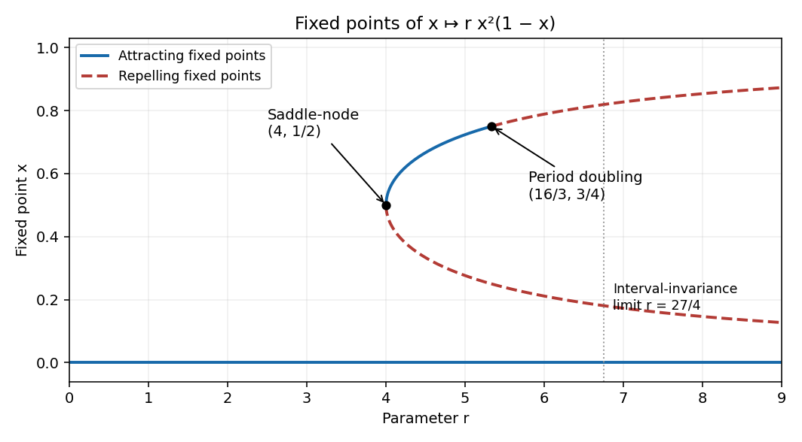
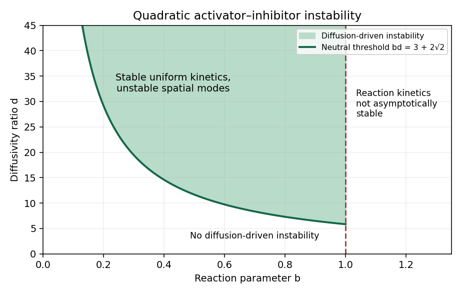

# Paper 3

↑ **Parent:** [Ii](../ii.md)

[https://www.maths.cam.ac.uk/undergrad/pastpapers/files/2009/PaperII_3.pdf](https://www.maths.cam.ac.uk/undergrad/pastpapers/files/2009/PaperII_3.pdf)

**Table of contents**

- [1G](#1g)
  - [Solution](#1g/solution)
- [2F](#2f)
  - [a](#2f/a)
    - [Solution](#2f/a/solution)
  - [b](#2f/b)
    - [Solution](#2f/b/solution)
- [3F](#3f)
  - [Solution](#3f/solution)
- [4H](#4h)
  - [Solution](#4h/solution)
- [5I](#5i)
  - [Solution](#5i/solution)
- [6A](#6a)
  - [Solution](#6a/solution)
- [7E](#7e)
  - [Solution](#7e/solution)
- [8B](#8b)
  - [Solution](#8b/solution)
- [9E](#9e)
  - [a](#9e/a)
    - [Solution](#9e/a/solution)
  - [b](#9e/b)
    - [Solution](#9e/b/solution)
- [10D](#10d)
  - [a](#10d/a)
    - [Solution](#10d/a/solution)
  - [b](#10d/b)
    - [Solution](#10d/b/solution)
- [11G](#11g)
  - [Solution](#11g/solution)
- [12F](#12f)
  - [a](#12f/a)
    - [Solution](#12f/a/solution)
  - [b](#12f/b)
    - [Solution](#12f/b/solution)
  - [c](#12f/c)
    - [Solution](#12f/c/solution)
- [13A](#13a)
  - [Solution](#13a/solution)
- [14E](#14e)
  - [i](#14e/i)
    - [Solution](#14e/i/solution)
  - [ii](#14e/ii)
    - [Solution](#14e/ii/solution)
  - [iii](#14e/iii)
    - [Solution](#14e/iii/solution)
- [15D](#15d)
  - [i](#15d/i)
    - [Solution](#15d/i/solution)
  - [ii](#15d/ii)
    - [Solution](#15d/ii/solution)
- [16G](#16g)
  - [Solution](#16g/solution)
- [17F](#17f)
  - [a](#17f/a)
    - [Solution](#17f/a/solution)
  - [b](#17f/b)
    - [Solution](#17f/b/solution)
  - [c](#17f/c)
    - [Solution](#17f/c/solution)
- [18H](#18h)
  - [Solution](#18h/solution)
- [19F](#19f)
  - [Solution](#19f/solution)
  - [i](#19f/i)
    - [Solution](#19f/i/solution)
  - [ii](#19f/ii)
    - [Solution](#19f/ii/solution)
  - [iii](#19f/iii)
    - [Solution](#19f/iii/solution)
- [20G](#20g)
  - [i](#20g/i)
    - [Solution](#20g/i/solution)
  - [ii](#20g/ii)
    - [Solution](#20g/ii/solution)
- [21H](#21h)
  - [a](#21h/a)
    - [Solution](#21h/a/solution)
  - [b](#21h/b)
    - [Solution](#21h/b/solution)
  - [c](#21h/c)
    - [Solution](#21h/c/solution)
- [22G](#22g)
  - [i](#22g/i)
    - [Solution](#22g/i/solution)
  - [ii](#22g/ii)
    - [Solution](#22g/ii/solution)
- [23G](#23g)
  - [Solution](#23g/solution)
- [24H](#24h)
  - [a](#24h/a)
    - [Solution](#24h/a/solution)
  - [b](#24h/b)
    - [Solution](#24h/b/solution)
- [25J](#25j)
  - [Solution](#25j/solution)
- [26J](#26j)
  - [a](#26j/a)
    - [Solution](#26j/a/solution)
  - [b](#26j/b)
    - [Solution](#26j/b/solution)
  - [c](#26j/c)
    - [Solution](#26j/c/solution)
- [27I](#27i)
  - [Solution](#27i/solution)
- [28I](#28i)
  - [Solution](#28i/solution)
- [29J](#29j)
  - [Solution](#29j/solution)
- [30B](#30b)
  - [a](#30b/a)
    - [Solution](#30b/a/solution)
  - [b](#30b/b)
    - [Solution](#30b/b/solution)
  - [c](#30b/c)
    - [Solution](#30b/c/solution)
  - [d](#30b/d)
    - [Solution](#30b/d/solution)
- [31A](#31a)
  - [Solution](#31a/solution)
- [32B](#32b)
  - [i](#32b/i)
    - [Solution](#32b/i/solution)
  - [ii](#32b/ii)
    - [Solution](#32b/ii/solution)
- [33C](#33c)
  - [i](#33c/i)
    - [Solution](#33c/i/solution)
  - [ii](#33c/ii)
    - [Solution](#33c/ii/solution)
- [34D](#34d)
  - [Solution](#34d/solution)
- [35D](#35d)
  - [i](#35d/i)
    - [Solution](#35d/i/solution)
  - [ii](#35d/ii)
    - [Solution](#35d/ii/solution)
  - [iii](#35d/iii)
    - [Solution](#35d/iii/solution)
- [36C](#36c)
  - [Solution](#36c/solution)
- [37E](#37e)
  - [Solution](#37e/solution)
- [38A](#38a)
  - [Solution](#38a/solution)
- [39B](#39b)
  - [Solution](#39b/solution)

## 1G

↑ **Parent:** [Paper 3](paper-3.md)

<h3 id="1g/solution">Solution</h3>

↑ **Parent:** [1G](#1g)

For every [prime number](../../../number-theory.md#prime-number) $p$ with $n<p\le2n$, the numerator $(2n)!$ contains one factor $p$, whereas neither copy of $n!$ contains one. Consequently the product of these [prime numbers](../../../number-theory.md#prime-number) divides the [binomial coefficient](../../../combinatorics.md#binomial-coefficient) $\binom{2n}{n}$. Since this [binomial coefficient](../../../combinatorics.md#binomial-coefficient) is one positive summand of $\sum_{j=0}^{2n}\binom{2n}{j}=2^{2n}$, and other summands are positive,

$$
\theta(2n)-\theta(n)=\log\prod_{n<p\le2n}p\le\log\binom{2n}{n}<2n\log2.
$$

For $x\ge2$, choose $k$ with $2^{k-1}<x\le2^k$. The [Chebyshev function](../../../number-theory.md#chebyshev-function) is increasing, so telescoping gives

$$
\theta(x)\le\theta(2^k)=\sum_{j=1}^k\bigl(\theta(2^j)-\theta(2^{j-1})\bigr)<(2^{k+1}-2)\log2<4x\log2.
$$

For $x=1$ the inequality follows from $\theta(1)=0$. Thus $\boxed{\theta(x)<4(\log2)x}$ throughout the stated range.

## 2F

↑ **Parent:** [Paper 3](paper-3.md)

<h3 id="2f/a">a</h3>

↑ **Parent:** [2F](#2f)

<h4 id="2f/a/solution">Solution</h4>

↑ **Parent:** [A](#2f/a)

For $n\ge3$, extend the restriction of the [continuous function](../../../calculus.md#continuous-function) $f$ to $[1/n,1-1/n]$ to a [continuous function](../../../calculus.md#continuous-function) $f_n$ on $[0,1]$ by making it constant on each of the two remaining intervals. The [Weierstrass approximation theorem](../../../functional-analysis.md#weierstrass-approximation-theorem) supplies a [polynomial](../../../polynomial.md) $P_n$ with $\|P_n-f_n\|_{\infty,[0,1]}<1/n$. Every [compact set](../../../topology.md#compact-space) $K\subset(0,1)$ is eventually contained in $[1/n,1-1/n]$, where $f_n=f$. Hence $\sup_K|P_n-f|<1/n$ eventually. This proves **uniform convergence on every compact subset**, without assuming any endpoint limits of $f$. The first two [polynomials](../../../polynomial.md) can be chosen arbitrarily.

<h3 id="2f/b">b</h3>

↑ **Parent:** [2F](#2f)

<h4 id="2f/b/solution">Solution</h4>

↑ **Parent:** [B](#2f/b)

Write $M=\sup_{(0,1)}|f|<\infty$ and use the same constant extensions $f_n$ as in part (a). They satisfy $\|f_n\|_\infty\le M$. Choose [polynomials](../../../polynomial.md) $Q_n$ with $\|Q_n-f_n\|_\infty<1/n$ for $n\ge3$, and set the first two [polynomials](../../../polynomial.md) equal to zero. Then $\boxed{\sup_n\sup_{0<x<1}|Q_n(x)|\le M+1}$, while the argument of part (a) proves [uniform convergence](../../../real-analysis.md#uniform-convergence) to $f$ on every [compact subset](../../../topology.md#compact-space) of $(0,1)$. The bound concerns the entire interval, rather than just each separate [compact subset](../../../topology.md#compact-space).

## 3F

↑ **Parent:** [Paper 3](paper-3.md)

<h3 id="3f/solution">Solution</h3>

↑ **Parent:** [3F](#3f)

Consider the [Möbius transformations](../../../group-theory.md#mobius-transformation)

$$
A(z)=z+2,\qquad B(z)=\frac{z}{2z+1},\qquad
A=\begin{pmatrix}1&2\\0&1\end{pmatrix},\quad B=\begin{pmatrix}1&0\\2&1\end{pmatrix}.
$$

Their [group](../../../group.md) lies in $\operatorname{PSL}_2(\mathbb Z)$, which is a [discrete subgroup](../../../topological-group.md#discrete-subgroup) of the [Möbius group](../../../group-theory.md#mobius-group): integer entries cannot approach the identity matrix except by eventually equalling it, and passing to the quotient by $\{I,-I\}$ preserves this property.

For freeness let $X=\{x\in\mathbb R:|x|>1\}$ and $Y=\{x\in\mathbb R:|x|<1\}$. For every nonzero integer $n$, $A^n(Y)=(2n-1,2n+1)\subset X$ and

$$
B^n(x)=\frac{x}{2nx+1},\qquad |B^n(x)|=\frac1{|2n+1/x|}<1\quad(x\in X).
$$

A reduced word involving both generators can be conjugated to a cyclically reduced word beginning with $A^n$ and ending with a nonzero power of $B$, after interchanging the generators if necessary. Repeated use of these inclusions shows that this word sends $X$ into the proper subset $A^n(Y)$ of $X$, so it cannot be the identity. Nonzero pure powers of either generator are also nonidentity. This is the [ping-pong lemma](../../../geometric-group-theory.md#ping-pong-lemma) in this particular action, and proves that $\boxed{\langle A,B\rangle\cong F_2}$ is a [free group](../../../geometric-group-theory.md#free-group) of rank two as well as a [discrete subgroup](../../../topological-group.md#discrete-subgroup) of $\operatorname{PSL}_2(\mathbb C)$.

## 4H

↑ **Parent:** [Paper 3](paper-3.md)

<h3 id="4h/solution">Solution</h3>

↑ **Parent:** [4H](#4h)

Use the binary [Hamming code](../../../coding-theory.md#hamming-code) $C=\ker H\subset\mathbb F_2^{15}$, where the $j$th column $h_j$ of the $4\times15$ [parity-check matrix](../../../coding-theory.md#parity-check-matrix) $H$ is the four-digit binary expansion of $j$, for $1\le j\le15$. Thus the columns are precisely the nonzero vectors of $\mathbb F_2^4$. They include the four coordinate vectors, so $\operatorname{rank}H=4$ and $\dim C=15-4=11$. Its [code rate](../../../coding-theory.md#code-rate) is therefore $\boxed{11/15}$.

For a received word $y$, compute its [syndrome](../../../coding-theory.md#syndrome) $s=Hy$. If $s=0$, report no error. Otherwise identify the unique column $h_j=s$ and flip bit $j$. Indeed, if $y=c+e_j$ with $c\in C$, then $Hy=Hc+He_j=h_j$, so this procedure recovers $c$ exactly. No column is zero and no two columns coincide; hence no nonzero [codeword](../../../coding-theory.md#codeword) has [Hamming weight](../../../coding-theory.md#hamming-weight) one or two. Some three columns sum to zero, for example those indexed by $1,2,3$, so the [minimum distance](../../../coding-theory.md#minimum-distance-of-a-code) is exactly three. Thus **every single-bit error is corrected**. The assertion requires at most one error; arbitrary multiple errors need not be detected by this procedure.

## 5I

↑ **Parent:** [Paper 3](paper-3.md)

<h3 id="5i/solution">Solution</h3>

↑ **Parent:** [5I](#5i)

Partition the [design matrix](../../../linear-regression.md#design-matrix) accordingly as $X=(X_1\ \cdots\ X_k)$. The blocks $\beta_i,\beta_j$ are [orthogonal](../../../linear-algebra.md#orthogonal-vectors) when $X_i^{\mathsf T}X_j=0$, meaning that their column spaces are [orthogonal vectors](../../../linear-algebra.md#orthogonal-vectors). Mutual [orthogonality](../../../linear-algebra.md#orthogonal-vectors) means that this holds for every pair of distinct blocks, so $X^{\mathsf T}X$ is block diagonal.

For the three scalar coefficients, the corresponding columns are $\mathbf1,x_1,x_2$. The necessary and sufficient conditions are

$$
\boxed{\sum_{i=1}^n x_{i1}=0,\qquad\sum_{i=1}^n x_{i2}=0,\qquad\sum_{i=1}^n x_{i1}x_{i2}=0.}
$$

Under the assumed full rank, neither explanatory column is zero. The [maximum-likelihood estimator](../../../statistical-modelling.md#maximum-likelihood-estimator) is $\widehat\beta=(X^{\mathsf T}X)^{-1}X^{\mathsf T}Y$, and the [normal distribution](../../../probability-theory.md#normal-distribution) of $Y$ implies

$$
\widehat\beta\sim N_3\!\left(\beta,\sigma^2\operatorname{diag}\left(\frac1n,\frac1{\sum_i x_{i1}^2},\frac1{\sum_i x_{i2}^2}\right)\right).
$$

Thus **the three coefficient estimators are independent normal random variables**, not merely uncorrelated. This is a sampling-distribution statement with the true $\sigma^2$ fixed.

## 6A

↑ **Parent:** [Paper 3](paper-3.md)

<h3 id="6a/solution">Solution</h3>

↑ **Parent:** [6A](#6a)

Let $p_j^n$ be the probability of occupying site $ja$ after $n$ steps, with $p_j^0=\mathbf1_{\{j=0\}}$ and $\alpha+\beta=1$. The [master equation](../../../markov-process.md#master-equation) is

$$
\boxed{p_j^{n+1}=\alpha p_{j-1}^n+\beta p_{j+1}^n.}
$$

Write $p_j^n\approx a p(ja,n\tau)$ so that the limiting $p$ is a [probability density](../../../quantum-mechanics.md#probability-density). A [Taylor expansion](../../../calculus.md#taylor-expansion) of this [master equation](../../../markov-process.md#master-equation) gives

$$
\tau p_t=(\beta-\alpha)a p_x+\frac{(\alpha+\beta)a^2}{2}p_{xx}+O(a^3,\tau^2).
$$

The weakly biased [diffusion limit of a weakly biased random walk](../../../markov-process.md#diffusion-limit-of-a-weakly-biased-random-walk) keeps $a^2/\tau$ and $(\alpha-\beta)a/\tau$ finite as $a,\tau\to0$, so $\alpha-\beta=O(a)$. The limiting [advection-diffusion equation](../../../diffusion-equation.md#advection-diffusion-equation) is

$$
\boxed{p_t+Vp_x=Dp_{xx},\qquad V=\frac{a(\alpha-\beta)}\tau,\quad D=\frac{a^2(\alpha+\beta)}{2\tau}=\frac{a^2}{2\tau}.}
$$

Its initial condition is the [Dirac delta function](../../../distribution-theory.md#dirac-delta-function) at the origin. At finite spacing, the exact variance gained per step is $a^2[1-(\alpha-\beta)^2]=4a^2\alpha\beta$. Thus a finite-step [central limit theorem](../../../convergence-of-random-variables.md#central-limit-theorem) gives the variance-matched coefficient $2a^2\alpha\beta/\tau$; its difference from the displayed $D$ vanishes in the stated weak-bias [diffusion limit of a weakly biased random walk](../../../markov-process.md#diffusion-limit-of-a-weakly-biased-random-walk). Keeping a fixed nonzero bias while taking diffusive space-time scaling would instead make $V$ diverge.

## 7E

↑ **Parent:** [Paper 3](paper-3.md)

<h3 id="7e/solution">Solution</h3>

↑ **Parent:** [7E](#7e)

The [fixed points](../../../function.md#fixed-point) satisfy $x[rx(1-x)-1]=0$. There is always $x=0$, and the other branches are

$$
x_\pm(r)=\frac{1\pm\sqrt{1-4/r}}2,\qquad r\ge4.
$$

They coincide at $(r,x)=(4,1/2)$. For $0<x<1$, $F(x)>0$ and its maximum occurs at $x=2/3$, with value $4r/27$. Consequently $\boxed{F((0,1))\subset(0,1)\iff0<r<27/4}$; equality at the upper endpoint fails because the maximum is attained inside the interval.

The [fixed-point multiplier](../../../dynamical-systems.md#multiplier-of-a-periodic-orbit-of-an-iteration) at zero is zero, so zero is attracting for every $r>0$. On either nonzero branch,

$$
F'(x)=\frac{2-3x}{1-x}.
$$

The lower branch has multiplier greater than one for $r>4$ and is repelling. The upper branch is attracting for $4<r<16/3$, reaches multiplier $-1$ at $x=3/4$, and is repelling for $r>16/3$. At $r=4$ the multiplier is $+1$, and the two branches are created in a [saddle-node bifurcation](../../../dynamical-systems.md#saddle-node-bifurcation). The fixed point there is attracting from one side and repelling from the other: $F(x)-x=-4x(x-1/2)^2$.

The second change is a supercritical [period-doubling bifurcation](../../../dynamical-systems.md#period-doubling-bifurcation) at $\boxed{(r,x)=(16/3,3/4)}$. To check its type, expand at that fixed point. The local map has quadratic coefficient $a=-20/3$ and cubic coefficient $b=-16/3$ when the multiplier is $-1$. Its second iterate has cubic coefficient $-2(a^2+b)=-704/9<0$. The multiplier decreases through $-1$ as $r$ increases, so a small attracting two-cycle is born on the $r>16/3$ side. These exhaust the fixed-point [bifurcations](../../../dynamical-systems.md#bifurcation), since their multipliers have no other crossings of $\pm1$.

**[Figure 1](#7e/image-fixed-point-branches-of-the-cubic-map-with-attracting-solid-curves-and-repelling-dashed-curves). Fixed-point branches of the cubic map, with attracting solid curves and repelling dashed curves**.

## 8B

↑ **Parent:** [Paper 3](paper-3.md)

<h3 id="8b/solution">Solution</h3>

↑ **Parent:** [8B](#8b)

First suppose the integral of $g(\xi)/(\xi-z)$ converges, for example if $g\in L^1(\mathbb R)$. Substitute the complexified coordinates $x=(z+\bar a)/2$, $y=(z-\bar a)/(2i)$ into the [Poisson integral](../../../partial-differential-equation.md#poisson-integral). The factorization of its denominator gives

$$
2u\!\left(\frac{z+\bar a}{2},\frac{z-\bar a}{2i}\right)=\frac1{i\pi}\int_{\mathbb R}g(\xi)\left(\frac1{\xi-z}-\frac1{\xi-\bar a}\right)d\xi.
$$

The given [Schwarz integral formula](../../../partial-differential-equation.md#schwarz-integral-formula) therefore writes $f(z)$ as $(i\pi)^{-1}\int g(\xi)/(\xi-z)\,d\xi$ plus a constant. For $z=x+iy$, the real part of this integral is exactly the [Poisson integral](../../../partial-differential-equation.md#poisson-integral), since

$$
\operatorname{Re}\frac1{i(\xi-z)}=\frac{y}{(\xi-x)^2+y^2}.
$$

The remaining constant has zero real part, giving $\boxed{f(z)=(i\pi)^{-1}\int_{\mathbb R}\frac{g(\xi)}{\xi-z}\,d\xi+ic}$ with $c\in\mathbb R$. The complex substitution is initially understood where the real-analytic harmonic function has its complexification; the holomorphic integral then continues the identity throughout the upper half-plane.

**Decay of $u$ alone does not guarantee convergence of the printed unregularized integral.** For example, choose a continuous $g$ which vanishes on $(-\infty,e]$ and equals $1/\log\xi$ for $\xi\ge e^2$, with continuous interpolation. It is bounded and tends to zero at both ends. Its [Poisson integral](../../../partial-differential-equation.md#poisson-integral) tends to zero as $|z|\to\infty$ in the closed upper half-plane: split the boundary function into a small uniform tail and a compactly supported part. Nevertheless $\int^\infty g(\xi)/(\xi-z)\,d\xi$ diverges like $\log\log\xi$, even as a symmetric principal value. With only the stated decay assumptions, the always convergent version is

$$
\boxed{f(z)=\frac1{i\pi}\int_{\mathbb R}g(\xi)\left(\frac1{\xi-z}-\frac{\xi}{1+\xi^2}\right)d\xi+ic.}
$$

The subtracted kernel is real on the integration line, so it changes only the imaginary constant and leaves the [harmonic function](../../../partial-differential-equation.md#harmonic-function) $u$ unchanged. The kernel difference is $O(\xi^{-2})$, which ensures convergence for bounded $g$.

## 9E

↑ **Parent:** [Paper 3](paper-3.md)

<h3 id="9e/a">a</h3>

↑ **Parent:** [9E](#9e)

<h4 id="9e/a/solution">Solution</h4>

↑ **Parent:** [A](#9e/a)

Put the cylinder's centre at the origin, with $-h/2\le z\le h/2$, $0\le r\le a$, and uniform density $\rho=M/(\pi a^2h)$. Symmetry makes the [inertia tensor](../../../classical-mechanics.md#inertia-tensor) diagonal and gives $I_1=I_2$. Direct integration yields

$$
I_3=\rho\int_{-h/2}^{h/2}\!dz\int_0^a\!r^3dr\int_0^{2\pi}\!d\theta=\frac{Ma^2}{2}.
$$

For a transverse [principal moment of inertia](../../../classical-mechanics.md#principal-moment-of-inertia), the two contributions are

$$
\int y^2\,dm=\rho h\frac{a^4}{4}\int_0^{2\pi}\sin^2\theta\,d\theta=\frac{Ma^2}{4},\qquad
\int z^2\,dm=\rho\pi a^2\frac{h^3}{12}=\frac{Mh^2}{12}.
$$

Therefore $\boxed{I_1=I_2=M(a^2/4+h^2/12),\quad I_3=Ma^2/2}$ are the three [principal moments of inertia](../../../classical-mechanics.md#principal-moment-of-inertia).

<h3 id="9e/b">b</h3>

↑ **Parent:** [9E](#9e)

<h4 id="9e/b/solution">Solution</h4>

↑ **Parent:** [B](#9e/b)

Set $I=I_1=I_2$. The third of the [Euler equations for a torque-free rigid body](../../../classical-mechanics.md#euler-equations-for-a-torque-free-rigid-body) gives $I_3\dot\omega_3=0$, so $\omega_3$ is constant. Define $\Omega=(I_3-I)\omega_3/I$. The first two [Euler equations for a torque-free rigid body](../../../classical-mechanics.md#euler-equations-for-a-torque-free-rigid-body) become

$$
\dot\omega_1=-\Omega\omega_2,\qquad\dot\omega_2=\Omega\omega_1,
$$

so $\omega_1+i\omega_2=C e^{i\Omega t}$. Since the body-frame [angular momentum](../../../classical-mechanics.md#angular-momentum) has components $(I\omega_1,I\omega_2,I_3\omega_3)$, its transverse components rotate at $\Omega$ while its axial component is constant. Substitution of the [principal moments of inertia](../../../classical-mechanics.md#principal-moment-of-inertia) gives

$$
\boxed{\Omega=\frac{3a^2-h^2}{3a^2+h^2}\,\omega_3.}
$$

This is precession relative to the body axes; the [angular momentum](../../../classical-mechanics.md#angular-momentum) is constant in an inertial frame. If $h^2=3a^2$, the rate is zero even when $\omega_3\ne0$. If the transverse components vanish, the precession cone degenerates to its axis.

## 10D

↑ **Parent:** [Paper 3](paper-3.md)

<h3 id="10d/a">a</h3>

↑ **Parent:** [10D](#10d)

<h4 id="10d/a/solution">Solution</h4>

↑ **Parent:** [A](#10d/a)

Assemble the star by adding spherical shells. A shell of mass $dm$ at radius $r$ has [gravitational potential energy](../../../classical-mechanics.md#gravitational-energy) $-Gm(r)\,dm/r$ relative to infinity, giving

$$
\boxed{E_{\mathrm{grav}}=-\int_0^R\frac{Gm(r)}r\,dm=-4\pi G\int_0^R m(r)\rho(r)r\,dr.}
$$

Multiplication of the [hydrostatic equilibrium](../../../statistical-physics.md#hydrostatic-equilibrium) equation by $4\pi r^3$ and [integration by parts](../../../calculus.md#integration-by-parts) gives

$$
E_{\mathrm{grav}}=\int_0^R4\pi r^3P'(r)dr=4\pi R^3P(R)-3\int_V P\,dV.
$$

For an isolated star with negligible surface pressure, $P(R)=0$. Using $E_{\mathrm{kin}}=(3/2)\int_V P\,dV$, the [virial theorem](../../../classical-mechanics.md#virial-theorem) becomes $\boxed{2E_{\mathrm{kin}}+E_{\mathrm{grav}}=0}$. If a nonzero external pressure is present, the surface term must be retained: $2E_{\mathrm{kin}}+E_{\mathrm{grav}}=3P(R)V$. Thus the printed zero-surface-term identity implicitly assumes an isolated star.

<h3 id="10d/b">b</h3>

↑ **Parent:** [10D](#10d)

<h4 id="10d/b/solution">Solution</h4>

↑ **Parent:** [B](#10d/b)

Use the uniform-density configuration as a trial configuration for the [white dwarf](../../../stellar-astrophysics.md#white-dwarf). Write $P=C_F h^2n^{5/3}/m_e$, with $C_F>0$ the numerical coefficient suppressed by the approximate equation of state. Its particle density is $n=3M/(4\pi m_pR^3)$, and the nonrelativistic [degeneracy pressure](../../../statistical-physics.md#degeneracy-pressure) has kinetic-energy density $3P/2$. Hence

$$
E_{\mathrm{kin}}=\frac{\alpha}{R^2},\qquad
\alpha=\frac32 C_F\frac{h^2}{m_e}\left(\frac3{4\pi}\right)^{2/3}\left(\frac{M}{m_p}\right)^{5/3}.
$$

For uniform density $m(r)=M(r/R)^3$, so integration of the shell energy gives

$$
E_{\mathrm{grav}}=-\frac{\beta}{R},\qquad \beta=\frac35GM^2.
$$

Both constants are positive and independent of $R$. Differentiating $E=\alpha/R^2-\beta/R$ gives its unique stationary radius $R=2\alpha/\beta$. The second derivative there is $2\alpha/R^4>0$, and this is the global minimum since $E\to+\infty$ at zero and $E\to0^-$ at infinity. Thus

$$
\boxed{R_{\mathrm{WD}}=5C_F\left(\frac3{4\pi}\right)^{2/3}\frac{h^2M^{-1/3}}{Gm_e m_p^{5/3}}\ \sim\ \frac{h^2M^{-1/3}}{Gm_e m_p^{5/3}}.}
$$

The uniform-density approximation is used for this energy estimate; it does not require a spatially constant pressure to satisfy the exact [hydrostatic equilibrium](../../../statistical-physics.md#hydrostatic-equilibrium) equation.

## 11G

↑ **Parent:** [Paper 3](paper-3.md)

<h3 id="11g/solution">Solution</h3>

↑ **Parent:** [11G](#11g)

In the multiplicative [group](../../../group.md) $\mathbb F_p^\times$, the squaring map is a [group homomorphism](../../../group-theory.md#group-homomorphism) with kernel $\{1,-1\}$, since $p$ is odd. Every nonzero square therefore has exactly two square roots. There are $(p-1)/2$ [quadratic residues](../../../number-theory.md#quadratic-residue) and the same number of nonresidues, and consequently $\sum_{a=1}^{p-1}\left(\frac ap\right)=0$.

For $nm_n\equiv1\pmod p$, direct multiplication gives $n^2(1+m_n)\equiv n^2+n=n(n+1)$. Multiplicativity of the [Legendre symbol](../../../number-theory.md#legendre-symbol), including its value zero on multiples of $p$, implies

$$
\left(\frac{n(n+1)}p\right)=\left(\frac{1+m_n}p\right).
$$

Inversion permutes $\mathbb F_p^\times$, so $1+m_n$ runs through all residue classes except $1$. Thus

$$
\boxed{\sum_{n=1}^{p-1}\left(\frac{n(n+1)}p\right)=\sum_{a\in\mathbb F_p,\ a\ne1}\left(\frac ap\right)=0-1=-1.}
$$

## 12F

↑ **Parent:** [Paper 3](paper-3.md)

<h3 id="12f/a">a</h3>

↑ **Parent:** [12F](#12f)

<h4 id="12f/a/solution">Solution</h4>

↑ **Parent:** [A](#12f/a)

The polynomial form of the [Runge approximation theorem](../../../complex-analysis.md#runge-s-theorem) says: if $K\subset\mathbb C$ is [compact](../../../topology.md#compact-space), $\mathbb C\setminus K$ is connected, and $f$ is [holomorphic](../../../complex-analysis.md#complex-differentiability-at-a-point) on a neighborhood of $K$, then for every $\varepsilon>0$ there is a [polynomial](../../../polynomial.md) $P$ with $\sup_K|f-P|<\varepsilon$. Choosing errors tending to zero gives a uniformly convergent sequence of [polynomials](../../../polynomial.md). Equivalently, on an open domain with connected complement in the Riemann sphere, every [holomorphic function](../../../complex-analysis.md#holomorphic-function) is the compact-uniform limit of [polynomials](../../../polynomial.md). The connected-complement hypothesis excludes enclosed holes containing poles of the function being approximated.

<h3 id="12f/b">b</h3>

↑ **Parent:** [12F](#12f)

<h4 id="12f/b/solution">Solution</h4>

↑ **Parent:** [B](#12f/b)

A [compact set](../../../topology.md#compact-space) $K\subset\mathbb C$ has exactly one unbounded complementary component, since its complement contains the outside of a sufficiently large disk. The connected, unbounded open set $\Omega$, being disjoint from $K$, lies in that component. In particular $\zeta$ belongs to the unbounded component.

Fill all bounded components of $\mathbb C\setminus K$ to obtain the [polynomial hull](../../../complex-analysis.md#polynomial-hull) $\widehat K$. It is a [compact set](../../../topology.md#compact-space) with connected complement, and $\zeta\notin\widehat K$. Therefore $1/(z-\zeta)$ is [holomorphic](../../../complex-analysis.md#complex-differentiability-at-a-point) on a neighborhood of $\widehat K$. The [Runge approximation theorem](../../../complex-analysis.md#runge-s-theorem) gives [polynomials](../../../polynomial.md) $P_n$ converging uniformly to this function on $\widehat K$, hence on $K$. This proves the requested **uniform polynomial approximation on $K$**, even when $K$ itself has holes. If $K$ is empty, the assertion is vacuous.

<h3 id="12f/c">c</h3>

↑ **Parent:** [12F](#12f)

<h4 id="12f/c/solution">Solution</h4>

↑ **Parent:** [C](#12f/c)

Take $\Omega=\{|z|<1\}$, $K=\{|z|=1\}$, and $\zeta=0$. These satisfy the stated connectedness and disjointness conditions. If [polynomials](../../../polynomial.md) $P_n$ converged uniformly to $1/z$ on $K$, convergence of the contour integrals would imply

$$
0=\lim_n\int_{|z|=1}P_n(z)\,dz=\int_{|z|=1}\frac{dz}{z}=2\pi i,
$$

a contradiction to the [Cauchy integral theorem](../../../complex-analysis.md#cauchy-s-integral-theorem). Thus **boundedness of this $\Omega$ permits the obstruction** excluded in part (b).

## 13A

↑ **Parent:** [Paper 3](paper-3.md)

<h3 id="13a/solution">Solution</h3>

↑ **Parent:** [13A](#13a)

The species $u$ is the [activator](../../../diffusion-equation.md#activator-in-a-reaction-diffusion-system), since increasing $u$ increases its own production $u^2/v$; $v$ is the [inhibitor](../../../diffusion-equation.md#inhibitor-in-a-reaction-diffusion-system), since increasing $v$ reduces that production. The unique positive uniform [steady state](../../../dynamical-systems.md#steady-state) solves $v=u^2$ and $u^2/v=bu$, giving $\boxed{u_*=1/b,\ v_*=1/b^2}$.

The reaction [Jacobian matrix](../../../calculus.md#jacobian-matrix) at this state is

$$
J=\begin{pmatrix}b&-b^2\\2/b&-1\end{pmatrix},\qquad \operatorname{tr}J=b-1,\qquad\det J=b.
$$

Its [eigenvalues](../../../linear-operator-theory.md#eigenvalue) solve $\lambda^2+(1-b)\lambda+b=0$. Since $b>0$, both have negative real part precisely for $0<b<1$. This proves stability of the spatially uniform reaction kinetics.

A perturbation proportional to $e^{\lambda t+ikx}$ replaces $J$ by $J-k^2\operatorname{diag}(1,d)$. Put $q=k^2$. Its trace is $b-1-(1+d)q<0$ in the kinetically stable range, and its determinant is

$$
D(q)=dq^2+(1-bd)q+b.
$$

A growing spatial mode exists exactly when this determinant is negative for some $q>0$. Its minimum occurs at $q=(bd-1)/(2d)$, which is positive only if $bd>1$, and the minimum is negative precisely if $(bd-1)^2>4bd$. Together these conditions reduce to the [Turing threshold of the quadratic activator-inhibitor model](../../../diffusion-equation.md#turing-threshold-of-the-quadratic-activator-inhibitor-model),

$$
\boxed{0<b<1,\qquad bd>3+2\sqrt2.}
$$

The unstable band is

$$
\frac{bd-1-\sqrt{(bd-1)^2-4bd}}{2d}<k^2<\frac{bd-1+\sqrt{(bd-1)^2-4bd}}{2d}.
$$

At the [Turing instability](../../../diffusion-equation.md#turing-instability) threshold the band shrinks to its double root, yielding $\boxed{k_c^2=(1+\sqrt2)/d}$. On a bounded spatial interval, an allowed [wavenumber](../../../wave-equation.md#wavenumber) must additionally lie in the unstable band; the displayed parameter condition assumes the continuous spatial spectrum.

**[Figure 2](#13a/image-diffusion-driven-instability-above-the-threshold-curve-for-b-between-zero-and-one). Diffusion-driven instability above the threshold curve for b between zero and one**.

## 14E

↑ **Parent:** [Paper 3](paper-3.md)

<h3 id="14e/i">i</h3>

↑ **Parent:** [14E](#14e)

<h4 id="14e/i/solution">Solution</h4>

↑ **Parent:** [I](#14e/i)

Put $s=\sqrt b$. The two [fixed points](../../../function.md#fixed-point) on the invariant line $x=0$ are $P_+=(0,s)$ and $P_-=(0,-s)$. There are also $Q_\pm=(\pm\sqrt{b-a^2/4},-a/2)$ when $a^2<4b$. At equality they coalesce with $P_-$.

The [Jacobian matrix](../../../calculus.md#jacobian-matrix) is

$$
J(x,y)=\begin{pmatrix}-a-2y&-2x\\2x&2y\end{pmatrix}.
$$

At $P_+$ its [eigenvalues](../../../linear-operator-theory.md#eigenvalue) are $-a-2s$ and $2s$, so it is always a [saddle equilibrium](../../../dynamical-systems.md#saddle-equilibrium). At $P_-$ they are $2s-a$ and $-2s$, so it is a [saddle equilibrium](../../../dynamical-systems.md#saddle-equilibrium) for $a<2s$ and a [stable node](../../../dynamical-systems.md#stable-node) for $a>2s$, with a zero [eigenvalue](../../../linear-operator-theory.md#eigenvalue) at $a=2s$.

At $Q_\pm$ the characteristic equation is $\lambda^2+a\lambda+4b-a^2=0$, giving

$$
\lambda=\frac{-a\pm\sqrt{5a^2-16b}}2.
$$

For $0<a^2<16b/5$ these points are [stable spirals](../../../dynamical-systems.md#stable-spiral); for $16b/5<a^2<4b$ they are [stable nodes](../../../dynamical-systems.md#stable-node). At $a^2=16b/5$ the double negative [eigenvalue](../../../linear-operator-theory.md#eigenvalue) has only one independent eigenvector, so these are improper [stable nodes](../../../dynamical-systems.md#stable-node). When $a=0$ they are [center equilibria](../../../dynamical-systems.md#center-equilibrium), as established in part (iii). Thus the collision at $\boxed{a^2=4b>0}$ changes both the number and stability of [fixed points](../../../function.md#fixed-point); it is the [bifurcation](../../../dynamical-systems.md#bifurcation) classified below.

<h3 id="14e/ii">ii</h3>

↑ **Parent:** [14E](#14e)

<h4 id="14e/ii/solution">Solution</h4>

↑ **Parent:** [Ii](#14e/ii)

Set $Y=y+s$ and $\mu=2s-a$, and include $\dot\mu=0$ for the extended [center manifold](../../../dynamical-systems.md#center-manifold). The equations near $P_-$ become

$$
\dot x=\mu x-2xY,\qquad\dot Y=x^2-2sY+Y^2,\qquad\dot\mu=0.
$$

The stable direction has [eigenvalue](../../../linear-operator-theory.md#eigenvalue) $-2s$ and the center directions are $(x,\mu)$. Choose a symmetry-preserving [center manifold](../../../dynamical-systems.md#center-manifold) $Y=h(x,\mu)$, even in $x$, containing the equilibrium line $x=0,Y=0$. Its invariance equation is

$$
h_x(\mu x-2xh)=x^2-2sh+h^2.
$$

Write $h=A x^2+B\mu x^2+\cdots$. At degree two, $0=(1-2sA)x^2$, so $A=1/(2s)$. At degree three, $2A\mu x^2=-2sB\mu x^2$, so $B=-1/(2s^2)$. Consequently

$$
\dot x=\mu x-\frac{x^3}{s}+O(\mu x^3,x^5).
$$

With $x=\sqrt{s}\,X$ this is $\dot X=\mu X-X^3+O(\mu X^3,X^5)$, the supercritical [pitchfork bifurcation](../../../dynamical-systems.md#pitchfork-bifurcation-normal-form). For $\mu<0$, $P_-$ is attracting; for $\mu>0$ it becomes a [saddle equilibrium](../../../dynamical-systems.md#saddle-equilibrium) and two attracting branches appear, consistent with the exact $Q_\pm$.

For $0<a^2<4b$, the vertical invariant line flows from $P_+$ towards $P_-$ between those points. The two off-axis [stable equilibria](../../../dynamical-systems.md#stable-equilibrium) lie below the horizontal axis, one in each invariant half-plane $x>0$ and $x<0$. For $a^2>4b$, these [stable equilibria](../../../dynamical-systems.md#stable-equilibrium) have merged into the [stable node](../../../dynamical-systems.md#stable-node) $P_-$, while $P_+$ remains a [saddle equilibrium](../../../dynamical-systems.md#saddle-equilibrium). Filled green points mark attracting equilibria, green rings mark centers, and red crosses mark saddle equilibria. The plotted arrows and nullclines show the corresponding phase portraits; a focus can become a node within the first parameter range without changing the pitchfork classification.

**[Figure 3](#14e/ii/image-phase-portraits-of-the-planar-pitchfork-system-before-collision-after-collision-and-in-its-hamiltonian-limit). Phase portraits of the planar pitchfork system before collision, after collision, and in its Hamiltonian limit**.

<h3 id="14e/iii">iii</h3>

↑ **Parent:** [14E](#14e)

<h4 id="14e/iii/solution">Solution</h4>

↑ **Parent:** [Iii](#14e/iii)

When $a=0$, define the [Hamiltonian function](../../../symplectic-geometry.md#hamiltonian-function)

$$
H(x,y)=\frac{x^3}{3}+xy^2-bx.
$$

Then $\dot x=-H_y$ and $\dot y=H_x$, so $\dot H=0$. At $(\sqrt b,0)$ the Hessian of $H$ is $2\sqrt b\,I$, a strict nondegenerate minimum; at $(-\sqrt b,0)$ it is $-2\sqrt b\,I$, a strict maximum. Small regular level curves around either point are closed curves, and the [vector field](../../../calculus.md#vector-field) is nonzero on them. Motion around each curve therefore returns after a finite period, proving the existence of [periodic orbits](../../../dynamical-systems.md#periodic-orbit) and classifying both equilibria as [center equilibria](../../../dynamical-systems.md#center-equilibrium).

The separatrix level is $H=0$, consisting of $x=0$ and $x^2/3+y^2=b$. The two arcs of this ellipse run from the lower [saddle equilibrium](../../../dynamical-systems.md#saddle-equilibrium) to the upper one, while the vertical segment runs from the upper saddle to the lower one. They enclose the two families of [periodic orbits](../../../dynamical-systems.md#periodic-orbit), as shown in the last panel of the phase portrait. Outside the loops, regular levels are unbounded.

For $a>0$ the divergence of the original [vector field](../../../calculus.md#vector-field) is exactly $-a$. If a [periodic orbit](../../../dynamical-systems.md#periodic-orbit) existed, uniqueness of trajectories would make it a simple closed curve, tangent everywhere to the [vector field](../../../calculus.md#vector-field). The flux across its boundary would be zero, whereas the [divergence theorem](../../../calculus.md#divergence-theorem) would give $-a$ times its positive enclosed area. This contradiction is the [Bendixson-Dulac criterion](../../../dynamical-systems.md#bendixson-dulac-theorem). Hence $\boxed{\text{periodic orbits exist if and only if }a=0}$.

## 15D

↑ **Parent:** [Paper 3](paper-3.md)

<h3 id="15d/i">i</h3>

↑ **Parent:** [15D](#15d)

<h4 id="15d/i/solution">Solution</h4>

↑ **Parent:** [I](#15d/i)

Mass conservation in the [Zeldovich approximation](../../../large-scale-structure-of-the-universe.md#zeldovich-approximation) gives $\rho\,d^3r=\bar\rho a^3\,d^3q$. Expanding the trajectory [Jacobian determinant](../../../calculus.md#jacobian-determinant) to first order therefore yields $\boxed{\delta=-\nabla_q\cdot\Psi}$. At the same order, $\nabla_r=a^{-1}\nabla_q$ and

$$
\nabla_rP=c_s^2\nabla_r\rho=-\frac{\bar\rho c_s^2}{a}\nabla_q(\nabla_q\cdot\Psi)=-\frac{\bar\rho c_s^2}{a}\nabla_q^2\Psi.
$$

The last equality uses $\nabla_q\times\Psi=0$ and the [vector calculus](../../../calculus.md#vector-calculus) $\nabla\operatorname{div}=\nabla^2+\nabla\times\nabla\times$.

Split the [gravitational potential](../../../classical-mechanics.md#newtonian-potential-of-a-point-mass) into its homogeneous-background and perturbed parts. The background has $\nabla_r\Phi_0=(4\pi G\bar\rho/3)r$. For the perturbation, [Poisson equation](../../../partial-differential-equation.md#poisson-equation) and irrotationality give

$$
\nabla_r\phi=-4\pi G\bar\rho\,a\Psi,
$$

with a harmonic or uniform-acceleration contribution set to zero by the perturbation boundary conditions. Its divergence is $-4\pi G\bar\rho\nabla_q\cdot\Psi=4\pi G\bar\rho\delta$, as required. Insert this and the pressure gradient into $\ddot r=\ddot a(q+\Psi)+2\dot a\dot\Psi+a\ddot\Psi$. The background acceleration cancels using $\ddot a/a=-4\pi G\bar\rho/3$, leaving

$$
\boxed{\ddot\Psi+2\frac{\dot a}{a}\dot\Psi-4\pi G\bar\rho\Psi-\frac{c_s^2}{a^2}\nabla_q^2\Psi=0.}
$$

Take minus the comoving divergence, and expand $\delta(q,t)=\sum_k\delta_k(t)e^{ik\cdot q}$. Since $\nabla_q^2$ acts on a [Fourier mode](../../../fourier-analysis.md#fourier-mode) by $-k^2$, each mode satisfies

$$
\boxed{\ddot\delta_k+2\frac{\dot a}{a}\dot\delta_k-\left(4\pi G\bar\rho-\frac{c_s^2k^2}{a^2}\right)\delta_k=0.}
$$

Here the expansion coordinate is comoving; confusing it with the physical coordinate would lose the factor $a^{-2}$.

<h3 id="15d/ii">ii</h3>

↑ **Parent:** [15D](#15d)

<h4 id="15d/ii/solution">Solution</h4>

↑ **Parent:** [Ii](#15d/ii)

For $P=\beta\rho^{4/3}$, the [sound speed](../../../compressible-flow.md#speed-of-sound) obeys $c_s^2=(4\beta/3)\bar\rho^{1/3}$. Using $a=(t/t_0)^{2/3}$ and $\bar\rho=(6\pi Gt^2)^{-1}$ gives

$$
\frac{c_s^2}{a^2}=\frac{\bar v_s^2}{t^2},\qquad\bar v_s^2=\frac{4\beta}{3}(6\pi G)^{-1/3}t_0^{4/3},\qquad 4\pi G\bar\rho=\frac2{3t^2}.
$$

The mode equation is an [Euler differential equation](../../../differential-equation.md#cauchy-euler-equation). Substituting $\delta_k=t^n$ produces $n(n-1)+(4/3)n-2/3+\bar v_s^2k^2=0$. Thus, for distinct roots,

$$
\boxed{\delta_k=A_kt^{n_+}+B_kt^{n_-},\qquad n_\pm=-\frac16\pm\sqrt{\frac{25}{36}-\bar v_s^2k^2}.}
$$

A genuinely growing mode occurs only for $\bar v_s^2k^2<2/3$; at $k=0$ the exponents are $2/3$ and $-1$. At $\bar v_s^2k^2=2/3$ the larger root is zero. Between $2/3$ and $25/36$, both roots are negative. At the repeated-root value $\bar v_s^2k^2=25/36$, the independent solutions are $t^{-1/6}$ and $t^{-1/6}\log t$. Beyond it, write $\nu=\sqrt{\bar v_s^2k^2-25/36}$ to obtain $t^{-1/6}[A\cos(\nu\log t)+B\sin(\nu\log t)]$. Thus the phrase “growing and decaying” applies to the long-wavelength regime; pressure-stabilized modes decay instead.

## 16G

↑ **Parent:** [Paper 3](paper-3.md)

<h3 id="16g/solution">Solution</h3>

↑ **Parent:** [16G](#16g)

The induced ordering on $x$ is a [well-order](../../../set.md#well-order). By [transfinite recursion](../../../set-theory.md#transfinite-recursion) define $h(t)=\{h(s):s\in x,\ s<t\}$ for $t\in x$. Induction shows that each $h(t)$ is an [ordinal](../../../set-theory.md#ordinal), that these values strictly increase, and that their range is the [ordinal](../../../set-theory.md#ordinal) $\mu(x)=\bigcup_{t\in x}(h(t)+1)$. The map $h$ is an [order isomorphism](../../../set.md#order-isomorphism) from $x$ to this ordinal. Any [order isomorphism](../../../set.md#order-isomorphism) between ordinals must fix their elements successively, so this ordinal is unique.

An increasing map $j:\kappa\to\lambda$ between [ordinals](../../../set-theory.md#ordinal) satisfies $j(\xi)\ge\xi$ by induction: its predecessors include $j(\eta)$ for all $\eta<\xi$. Hence $\kappa\le\lambda$. Apply this to the inclusion $x\subset y$, transported through their [order isomorphisms](../../../set.md#order-isomorphism), and then to $y\subset\alpha$. It follows that $\boxed{\mu(x)\le\mu(y)\le\alpha}$.

If each $x_n$ is an [initial segment](../../../set.md#initial-segment) of later $x_m$, uniqueness makes their ordinal enumerations compatible: the enumeration of $x_m$ restricts to that of $x_n$. Their union is consequently an [order isomorphism](../../../set.md#order-isomorphism) from $\bigcup_n x_n$ to $\bigcup_n\mu(x_n)$. This proves the asserted equality. Without the [initial segment](../../../set.md#initial-segment) condition it fails: in $\alpha=\omega+1$, take $x_n=\{0,\ldots,n-1\}\cup\{\omega\}$. Then $\mu(x_n)=n+1$, whose union is $\omega$, but $\mu(\bigcup_nx_n)=\omega+1$.

For decreasing sets, $\mu(x_n)$ is a nonincreasing sequence of [ordinals](../../../set-theory.md#ordinal). Its set of values has a least member, attained at some $n_0$; all later values must equal it. Hence the sequence is **eventually constant**. The intersection formula nevertheless fails: take $x_n=\{n,n+1,\ldots\}\subset\omega$. Every $x_n$ has order type $\omega$, whereas their intersection is empty and has order type zero. Thus $\mu(\bigcap_nx_n)=0\ne\bigcap_n\mu(x_n)=\omega$.

## 17F

↑ **Parent:** [Paper 3](paper-3.md)

<h3 id="17f/a">a</h3>

↑ **Parent:** [17F](#17f)

<h4 id="17f/a/solution">Solution</h4>

↑ **Parent:** [A](#17f/a)

The [Brooks' theorem](../../../graph-theory.md#brooks-theorem) states that a finite connected simple [graph](../../../graph.md) with maximum [vertex degree](../../../graph-theory.md#degree-graph-theory) $\Delta$ has [chromatic number](../../../graph-theory.md#chromatic-number) at most $\Delta$, unless it is a [complete graph](../../../graph-theory.md#complete-graph) or an odd [cycle graph](../../../graph-theory.md#cycle-graph); those exceptions have chromatic number $\Delta+1$.

First, if the graph is not regular, choose a vertex $v$ of degree less than $\Delta$ and a [spanning tree](../../../combinatorics.md#spanning-tree) rooted at $v$. Order vertices with every child before its parent, and apply the [greedy coloring](../../../graph-theory.md#greedy-coloring) algorithm. Every vertex except $v$ has an as-yet uncolored parent, so has at most $\Delta-1$ colored neighbors; $v$ also has fewer than $\Delta$ neighbors. Thus $\Delta$ colors suffice. This justifies reducing to the regular case.

Now let $G$ be regular, 3-connected and not complete. A shortest path between two nonadjacent vertices contains an induced two-edge path $a,v,b$ with $a,b$ nonadjacent. By 3-connectivity, $G-\{a,b\}$ is connected. Color $a,b$ with the same color. Choose a [spanning tree](../../../combinatorics.md#spanning-tree) of the remaining graph rooted at $v$ and color its vertices in child-before-parent order. Each vertex other than $v$ again has an uncolored parent and thus at most $\Delta-1$ already colored neighbors. At the last vertex $v$, the two neighbors $a,b$ share a color, so its $\Delta$ neighbors use at most $\Delta-1$ distinct colors. A color is therefore available at every step, proving $\boxed{\chi(G)\le\Delta}$ in the required 3-connected noncomplete case. A 3-connected graph has $\Delta\ge3$, so the odd-cycle exception cannot arise here.

<h3 id="17f/b">b</h3>

↑ **Parent:** [17F](#17f)

<h4 id="17f/b/solution">Solution</h4>

↑ **Parent:** [B](#17f/b)

The [Vizing theorem](../../../graph-theory.md#vizing-s-theorem) states that for every finite simple [graph](../../../graph.md) of maximum [vertex degree](../../../graph-theory.md#degree-graph-theory) $\Delta$, its [edge chromatic number](../../../graph-theory.md#edge-chromatic-number) satisfies $\boxed{\Delta\le\chi'(G)\le\Delta+1}$. The lower bound follows because all edges incident to a maximum-degree vertex need different colors. The simplicity hypothesis matters: unrestricted [multigraphs](../../../graph.md#multigraph) need not satisfy this upper bound.

<h3 id="17f/c">c</h3>

↑ **Parent:** [17F](#17f)

<h4 id="17f/c/solution">Solution</h4>

↑ **Parent:** [C](#17f/c)

The first assertion is **false**. The [complete graph](../../../graph-theory.md#complete-graph) $K_4$ has $\chi(K_4)=4$, but $\chi'(K_4)=3$: color each of its three perfect matchings with its own color. It is connected and has more than two vertices.

The second assertion is **false**. Take the [crown graph](../../../graph-theory.md#crown-graph) with bipartition $a_1,\ldots,a_5$ and $b_1,\ldots,b_5$, joining $a_i$ to $b_j$ exactly when $i\ne j$. Its [chromatic number](../../../graph-theory.md#chromatic-number) is two. In the ordering $a_1,b_1,a_2,b_2,\ldots,a_5,b_5$, the [greedy coloring](../../../graph-theory.md#greedy-coloring) algorithm assigns color $i$ to both $a_i,b_i$: both see all previously used colors, but they are not adjacent to each other. It therefore uses five colors, exceeding $2\chi(G)=4$. Taking more pairs makes the ratio arbitrarily large.

The third assertion is **true**. When an edge is colored greedily, at most $2\Delta-2$ adjacent edges have previously received colors. Thus the [greedy coloring](../../../graph-theory.md#greedy-coloring) algorithm uses at most $2\Delta-1\le2\chi'(G)-1<2\chi'(G)$ colors whenever the graph has an edge. The edgeless case is trivial. This bound holds for every edge ordering.

## 18H

↑ **Parent:** [Paper 3](paper-3.md)

<h3 id="18h/solution">Solution</h3>

↑ **Parent:** [18H](#18h)

The [Artin fixed-field theorem](../../../galois-theory.md#artin-fixed-field-theorem) says that for a finite group $G$ of distinct automorphisms of a field $K$, the extension $K/K^G$ is [Galois extension](../../../galois-theory.md#finite-galois-extension) and has degree $|G|$. Here $y=x^p-x$ is invariant under translations because $(x+a)^p-(x+a)=x^p-x$ for $a\in\mathbb F_p$. Hence $\mathbb F_p(y)\subset K^G$. Also $x$ is a root of $T^p-T-y$, so $[K:\mathbb F_p(y)]\le p$. The fixed-field theorem gives $[K:K^G]=p$, forcing $\boxed{K^G=\mathbb F_p(y)}$. The extension is [separable](../../../topology.md#separable-topological-space); explicitly the derivative of $T^p-T-y$ is $-1$.

For the affine substitutions, $y$ transforms to $dy$, since $d^p=d$ and $a^p=a$. Therefore $z=y^{p-1}$ is fixed by all $p(p-1)$ substitutions. The polynomial $(T^p-T)^{p-1}-z$ has $x$ as a root and degree $p(p-1)$. Apply the same degree comparison and the [Artin fixed-field theorem](../../../galois-theory.md#artin-fixed-field-theorem) to obtain

$$
\boxed{K^H=\mathbb F_p(z),\qquad z=(x^p-x)^{p-1}.}
$$

Moreover $[\mathbb F_p(y):\mathbb F_p(z)]=p-1$, so the [minimal polynomial](../../../linear-operator-theory.md#minimal-polynomial) of $y$ is $\boxed{T^{p-1}-z}$. It splits as $\prod_{d\in\mathbb F_p^\times}(T-dy)$, and its derivative is nonzero at every root. Thus $K^G/K^H$ is a [Galois extension](../../../galois-theory.md#finite-galois-extension) with group $\mathbb F_p^\times$, acting by $y\mapsto dy$.

There is a harmless convention issue in labeling the substitutions: $f(x)\mapsto f(dx+a)$ composes in the reverse order to the displayed affine matrices. It is naturally a right action on functions, or a left action after inserting inverses. The set of automorphisms and all the [fixed fields](../../../galois-theory.md#fixed-field) just computed are unchanged by that convention.

## 19F

↑ **Parent:** [Paper 3](paper-3.md)

<h3 id="19f/solution">Solution</h3>

↑ **Parent:** [19F](#19f)

The left [group action](../../../group-theory.md#group-action) on the homogeneous [polynomials](../../../polynomial.md) is $\rho_n(g)P(z)=P(g^{-1}z)$, since $\rho_n(g)\rho_n(h)=\rho_n(gh)$. Every [SU(2) matrix](../../../topological-group.md#su-2-matrix) is conjugate to $\operatorname{diag}(e^{i\theta},e^{-i\theta})$ with $0\le\theta\le\pi$. In the monomial basis $z_1^{n-j}z_2^j$, its eigenvalues are $e^{-i(n-2j)\theta}$. Consequently the [character of the homogeneous polynomial representation of SU2](../../../representation-theory.md#character-of-the-homogeneous-polynomial-representation-of-su2) is

$$
\boxed{\chi_n(\theta)=\sum_{j=0}^n e^{i(n-2j)\theta}=\frac{\sin((n+1)\theta)}{\sin\theta}.}
$$

The quotient is interpreted by continuity at the endpoints: $\chi_n(0)=n+1$ and $\chi_n(\pi)=(-1)^n(n+1)$. The introductory action and character requests are independent of parts (i)–(iii), so this root Solution slot has been restored.

<h3 id="19f/i">i</h3>

↑ **Parent:** [19F](#19f)

<h4 id="19f/i/solution">Solution</h4>

↑ **Parent:** [I](#19f/i)

The $n+1$ monomials $z_1^{n-j}z_2^j$ form a [basis](../../../vector-space.md#basis), so $\boxed{\dim V_n=n+1}$. For irreducibility, use the following compact-group facts: every finite-dimensional continuous representation is unitarizable by averaging an [inner product](../../../linear-algebra.md#inner-product); such representations decompose into irreducibles; their irreducible characters are orthonormal under normalized Haar measure. In particular the squared character norm is the sum of squares of the irreducible multiplicities.

The [Weyl integration formula for SU2](../../../measure-theory.md#weyl-integration-formula-for-su-2) gives, for a class function $F$,

$$
\int_{SU(2)}F(g)\,dg=\frac2\pi\int_0^\pi F(\theta)\sin^2\theta\,d\theta.
$$

Using the character already found,

$$
\langle\chi_n,\chi_n\rangle=\frac2\pi\int_0^\pi\sin^2((n+1)\theta)\,d\theta=1.
$$

Thus exactly one irreducible constituent occurs with multiplicity one: **$V_n$ is irreducible for every $n\ge0$**.

<h3 id="19f/ii">ii</h3>

↑ **Parent:** [19F](#19f)

<h4 id="19f/ii/solution">Solution</h4>

↑ **Parent:** [Ii](#19f/ii)

The same [Weyl integration formula for SU2](../../../measure-theory.md#weyl-integration-formula-for-su-2) gives $\langle\chi_n,\chi_m\rangle=\delta_{nm}$. More strongly, these characters are complete in the space of square-integrable class functions: multiplication by $\sin\theta$ identifies that weighted space with $L^2(0,\pi)$, and sends $\chi_n$ to $\sin((n+1)\theta)$. The sine functions form a complete [orthogonal basis](../../../linear-algebra.md#orthogonal-basis) of $L^2(0,\pi)$, as follows from the [Fourier series](../../../fourier-series.md) theorem applied to odd extensions.

Suppose a finite-dimensional continuous irreducible [group representation](../../../representation-theory.md#group-representation) were not isomorphic to any $V_n$. [Character orthogonality](../../../representation-theory.md#character-orthogonality) would make its character orthogonal to every $\chi_n$. Completeness forces its character to vanish in $L^2$, and continuity then forces it to vanish everywhere. This is impossible at the identity, where the character equals the positive dimension of the representation. Hence $\boxed{\text{every such irreducible representation is some }V_n}$. Since the dimensions $n+1$ differ, the index is unique.

<h3 id="19f/iii">iii</h3>

↑ **Parent:** [19F](#19f)

<h4 id="19f/iii/solution">Solution</h4>

↑ **Parent:** [Iii](#19f/iii)

The character of the [dual representation](../../../representation-theory.md#dual-representation) is $\chi_{V_n^*}(g)=\chi_n(g^{-1})=\overline{\chi_n(g)}$, using unitarizability. The displayed sine quotient is real, so this character equals $\chi_n$. The theorem that characters determine finite-dimensional semisimple complex representations of a compact group therefore gives $\boxed{V_n\cong V_n^*}$. This is complex-linear self-duality; it does not assert that every $V_n$ has an invariant real structure.

## 20G

↑ **Parent:** [Paper 3](paper-3.md)

<h3 id="20g/i">i</h3>

↑ **Parent:** [20G](#20g)

<h4 id="20g/i/solution">Solution</h4>

↑ **Parent:** [I](#20g/i)

A [chain homotopy](../../../homology.md#chain-homotopy) from $g$ to $f$ consists of homomorphisms $s_n:C_n\to C'_{n+1}$ such that

$$
f_n-g_n=d'_{n+1}s_n+s_{n-1}d_n
$$

for every $n$. If $z\in C_n$ is a cycle, $d_nz=0$, so $f_n(z)-g_n(z)=d'_{n+1}s_n(z)$ is a boundary. Hence $f_n(z)$ and $g_n(z)$ represent the same [homology class](../../../homology.md#homology-class). Every [homology class](../../../homology.md#homology-class) has a cycle representative, proving $\boxed{f_*=g_*}$ in every degree.

<h3 id="20g/ii">ii</h3>

↑ **Parent:** [20G](#20g)

<h4 id="20g/ii/solution">Solution</h4>

↑ **Parent:** [Ii](#20g/ii)

For a finite [chain complex](../../../homology.md#chain-complex) of finite-dimensional vector spaces, its [Euler characteristic](../../../homology.md#euler-characteristic) is $\chi(C)=\sum_n(-1)^n\dim C_n$. For finitely generated free abelian groups, replace dimension by rank. Write $Z_n=\ker d_n$ and $B_n=\operatorname{im}d_{n+1}$. The identities $\operatorname{rank}C_n=\operatorname{rank}Z_n+\operatorname{rank}B_{n-1}$ and $\operatorname{rank}Z_n=\operatorname{rank}H_n+\operatorname{rank}B_n$ show by cancellation that $\chi(C)=\sum_n(-1)^n\operatorname{rank}H_n$. An [exact sequence](../../../homology.md#exact-sequence) thus has alternating rank sum zero.

Starting at the left, the three displayed sequences have alternating rank sums respectively $0,1,1$. Therefore, given that one is exact, **the first sequence is the exact one**. For completeness its necessary image ranks, successively, are $11,13,7,6,14,11$, all nonnegative and consistent with the adjacent module ranks. Split each middle free group as the incoming image plus a complementary outgoing image, and use identity maps on these summands, to realize an exact sequence of the first rank pattern. Vanishing of the alternating sum alone is not a general test for the exactness of unspecified maps; the supplied existence assertion is what selects the sequence.

## 21H

↑ **Parent:** [Paper 3](paper-3.md)

<h3 id="21h/a">a</h3>

↑ **Parent:** [21H](#21h)

<h4 id="21h/a/solution">Solution</h4>

↑ **Parent:** [A](#21h/a)

For a compact space $K$, the [Arzelà-Ascoli theorem](../../../topological-analysis.md#arzela-ascoli-theorem) says that a family $\mathcal F\subset C(K)$ is relatively compact in the [supremum norm](../../../functional-analysis.md#supremum-norm) if and only if it is pointwise bounded and equicontinuous. In the usual formulation $K$ is compact Hausdorff; the elementary argument below also works for any compact $K$ for real-valued continuous functions.

Pointwise bounded means $\sup_{f\in\mathcal F}|f(x)|<\infty$ for every $x\in K$. Equicontinuity means that for every $x\in K$ and $\varepsilon>0$ there is a neighborhood $U$ of $x$ such that $|f(y)-f(x)|<\varepsilon$ for every $y\in U$ and $f\in\mathcal F$. Relative compactness means compactness of the closure in $C(K)$, where $\|f\|_\infty=\sup_K|f|$. This is a complete metric vector space, since uniform limits of continuous functions are continuous. Equivalently, every sequence in the family has a uniformly convergent subsequence, with limit in $C(K)$, though not necessarily in the original family.

<h3 id="21h/b">b</h3>

↑ **Parent:** [21H](#21h)

<h4 id="21h/b/solution">Solution</h4>

↑ **Parent:** [B](#21h/b)

Assume first that $\overline{\mathcal F}$ is compact in the [supremum norm](../../../functional-analysis.md#supremum-norm). A finite norm-net shows that the norms of its members are bounded, so pointwise boundedness follows. Given $x$ and $\varepsilon>0$, choose a finite $\varepsilon/3$-net $g_1,\ldots,g_N$ in the closure. Their continuity gives a common neighborhood $U$ of $x$ where $|g_j(y)-g_j(x)|<\varepsilon/3$ for every $j$. For any $f\in\mathcal F$, choose $g_j$ with $\|f-g_j\|_\infty<\varepsilon/3$; the [triangle inequality](../../../topological-analysis.md#triangle-inequality) then gives $|f(y)-f(x)|<\varepsilon$. Thus the family is equicontinuous.

Conversely, suppose pointwise boundedness and equicontinuity. For a prescribed $\varepsilon>0$, choose neighborhoods $U_x$ where every $f$ varies from $f(x)$ by less than $\varepsilon/3$. Compactness supplies a finite subcover $U_{x_1},\ldots,U_{x_N}$. Pointwise boundedness makes the set of vectors $(f(x_1),\ldots,f(x_N))$ bounded in $\mathbb R^N$. Partition a bounding box into finitely many boxes of coordinate diameter less than $\varepsilon/3$, and choose one function from each occupied box. If $f,g$ belong to the same box and $y\in U_{x_j}$, then

$$
|f(y)-g(y)|\le |f(y)-f(x_j)|+|f(x_j)-g(x_j)|+|g(x_j)-g(y)|<\varepsilon.
$$

The chosen functions are therefore a finite $\varepsilon$-net in the [supremum norm](../../../functional-analysis.md#supremum-norm). Thus $\mathcal F$ is totally bounded. Its closure is complete and totally bounded, hence compact. To recall the last metric-space fact, successively selecting subsequences in balls of radii $2^{-j}$ produces a Cauchy diagonal subsequence from every sequence; completeness supplies its limit. This proves both directions of the [Arzelà-Ascoli theorem](../../../topological-analysis.md#arzela-ascoli-theorem).

<h3 id="21h/c">c</h3>

↑ **Parent:** [21H](#21h)

<h4 id="21h/c/solution">Solution</h4>

↑ **Parent:** [C](#21h/c)

Set $g_n=f-f_n$. These are nonnegative [continuous functions](../../../calculus.md#continuous-function), decrease pointwise, and converge pointwise to zero. For $\varepsilon>0$, the open sets $U_n=\{x:g_n(x)<\varepsilon\}$ increase and cover $K$. A finite subcover exists by compactness; because the sets are increasing, one $U_N$ already covers $K$. Hence $0\le g_n(x)<\varepsilon$ for every $x\in K$ and every $n\ge N$, and $\|f-f_n\|_\infty\le\varepsilon$. Therefore $\boxed{\|f_n-f\|_\infty\to0}$. This is [Dini's theorem](../../../real-analysis.md#dini-s-theorem); continuity of the limit is essential to the openness used in the proof.

## 22G

↑ **Parent:** [Paper 3](paper-3.md)

<h3 id="22g/i">i</h3>

↑ **Parent:** [22G](#22g)

<h4 id="22g/i/solution">Solution</h4>

↑ **Parent:** [I](#22g/i)

The lacunary series converges locally uniformly on $|z|<1$: for $|z|\le r<1$, $\sum r^{2^n}\le\sum_{j\ge1}r^j<\infty$. It therefore defines a [holomorphic function](../../../complex-analysis.md#holomorphic-function) there. Let $\zeta^{2^N}=1$. For $n\ge N$, $(r\zeta)^{2^n}=r^{2^n}$ is positive real. As $r\uparrow1$, the sum of any fixed number of these tail terms tends to that number, while the earlier finite sum stays bounded. Thus $\operatorname{Re}f(r\zeta)\to+\infty$. A [analytic continuation](../../../complex-analysis.md#analytic-continuation) through $\zeta$ would be bounded in a small closed neighborhood and cannot have this radial divergence.

Roots of unity of orders $2^N$ are dense on the unit circle. If an [analytic continuation](../../../complex-analysis.md#analytic-continuation) existed through any boundary point, its neighborhood would contain one of these singular roots, and the [identity theorem](../../../complex-analysis.md#identity-theorem) would make it agree with $f$ on the inside portion. This contradicts the divergence just proved. Hence **the entire unit circle is a natural boundary**. The exponent printed in the PDF is $2^n$, not $2n$; the latter would give a rational function and would not have this property.

<h3 id="22g/ii">ii</h3>

↑ **Parent:** [22G](#22g)

<h4 id="22g/ii/solution">Solution</h4>

↑ **Parent:** [Ii](#22g/ii)

Two function elements $(U,f)$ and $(V,g)$ define the same [germ of a holomorphic function](../../../complex-analysis.md#germ-of-a-holomorphic-function) at $p$ when $p\in U\cap V$ and they agree on some neighborhood of $p$. Write the germ as $[f]_p$. Basic open sets of the [space of germs of holomorphic functions](../../../complex-analysis.md#space-of-germs-of-holomorphic-functions) are

$$
\widetilde U_f=\{[f]_p:p\in U\},
$$

for open $U$ on which $f$ is [holomorphic](../../../complex-analysis.md#complex-differentiability-at-a-point). If two such sets meet, equality of the germs gives a smaller open sheet contained in their intersection, so these sets form a basis. The projection $\pi([f]_p)=p$ maps each sheet homeomorphically onto $U$. Compose this with a local coordinate on $X$ to define the complex charts on the germ space. Transition maps are the corresponding transition maps on $X$, hence [holomorphic](../../../complex-analysis.md#complex-differentiability-at-a-point); $\pi$ is a local [biholomorphism](../../../complex-analysis.md#biholomorphism) and is onto, since even constant functions provide germs over every point.

The germ space is Hausdorff. Germs over different points are separated by base neighborhoods. For distinct germs over the same point, choose representatives on one small connected disk. If their two sheets met anywhere in that disk, the representatives would agree on an open set and hence everywhere on the disk by the [identity theorem](../../../complex-analysis.md#identity-theorem), a contradiction. These sheets thus separate the germs. Together with the allowed second-countability fact, the charts make each component a [Riemann surface](../../../complex-analysis.md#riemann-surfaces).

Here “covering in the sense of complex analysis” means this locally biholomorphic, possibly incomplete [analytic germ projection](../../../complex-analysis.md#analytic-germ-projection). It does not mean an evenly covered topological [covering map](../../../algebraic-topology.md#covering-space): an analytic branch can cease to exist at a singularity, so the restriction to a component need not project onto all of $X$.

The evaluation map $E([f]_p)=f(p)$ is [holomorphic](../../../complex-analysis.md#complex-differentiability-at-a-point), since on the sheet $\widetilde U_f$ it is just $f$. Starting from one germ, continuation through overlapping disks produces exactly the germs in its connected component. Indeed such continuations give paths in the germ space; conversely, cover a path by finitely many successive sheets to obtain a chain of function elements. Components are path-connected because the surface is locally path-connected. No two distinct germs can be added to that component without being obtainable by continuation. It therefore represents the maximal analytic continuation, or [complete holomorphic function](../../../complex-analysis.md#complete-analytic-function), of any of its germs. Conversely every such maximal continuation embeds into the germ space by taking its local germs; completeness makes its image the entire component. These constructions are inverse, giving the requested **bijection between complete holomorphic functions and connected components**, with functions understood up to their natural equivalence as analytic continuations, rather than merely as single-valued functions defined on all of $X$.

## 23G

↑ **Parent:** [Paper 3](paper-3.md)

<h3 id="23g/solution">Solution</h3>

↑ **Parent:** [23G](#23g)

For a [divisor on an algebraic curve](../../../algebraic-geometry.md#divisor-on-an-algebraic-curve) $D$, let $L(D)=H^0(V,\mathcal O(D))$ and choose a basis of dimension $r+1$. Regarding the basis as sections of the [divisor line bundle](../../../cartier-divisor.md#divisor-line-bundle), evaluation gives $\phi_D:V\to\mathbb P^r$. If the [linear system of divisors](../../../algebraic-geometry.md#linear-system-of-divisors) has no base points, at least one section is nonzero at each point, and these homogeneous coordinates define a [morphism](../../../algebra.md#morphism). If the effective divisor has a fixed part $F$, first divide all sections by their common vanishing factor. The moving divisor $E=D-F$ is base-point-free, has the same section space, and gives the uniquely extended morphism on the smooth curve. Thus effectiveness alone does not make the raw evaluations everywhere nonzero, but cancellation supplies the usual map.

A morphism from a projective integral curve is a [finite morphism](../../../algebraic-geometry.md#finite-morphism) onto its image precisely when it is nonconstant, equivalently $r\ge1$: a positive-dimensional fiber of a curve would be the whole curve, while a nonconstant proper map with finite fibers is finite. It is an isomorphism onto its image precisely when its moving complete linear system is [very ample](../../../ringed-space.md#very-ample-line-bundle). In section-space terms, putting $h=h^0(E)$, the criteria are

$$
h^0(E-P)=h-1\quad\text{for all }P,\qquad h^0(E-P-Q)=h-2\quad\text{for all }P,Q,
$$

where $Q=P$ is allowed. These express absence of base points, separation of distinct points, and separation of tangent directions. In the base-point-free convention $E=D$.

Now suppose the genus is two. The [Riemann-Roch theorem](../../../algebraic-geometry.md#riemann-roch-theorem) gives $\deg K=2$ and $h^0(K)=2$. There cannot be a nonconstant function with only a single simple pole on a positive-genus smooth projective curve: it would give a degree-one map to $\mathbb P^1$, an isomorphism. Hence $h^0(P)=1$ for every point $P$. Applying [Riemann-Roch theorem](../../../algebraic-geometry.md#riemann-roch-theorem) to $K-P$ gives $h^0(K-P)=h^0(P)=1$, so the canonical linear system has no base point. The resulting map $\phi_K:V\to\mathbb P^1$ has degree $\deg K=2$.

Set $D=K+P_1+P_2$, of degree four. The [Riemann-Roch theorem](../../../algebraic-geometry.md#riemann-roch-theorem) gives $h^0(D)=3$ and $h^0(D-P)=2$ for every $P$, since the residual divisors have negative degree. Thus $\phi_D$ is a base-point-free map to $\mathbb P^2$ with nondegenerate image $C$. Degree of the pullback of a general line gives

$$
4=(\deg\phi_D)(\deg C).
$$

The image cannot be a line because the three sections are independent. The only alternatives are a birational quartic or a double cover of a conic. In the latter case identify the smooth conic with $\mathbb P^1$. Its hyperplane bundle has degree two, so $D\sim2A$, where $A$ is a degree-two divisor with $h^0(A)\ge2$. Again [Riemann-Roch theorem](../../../algebraic-geometry.md#riemann-roch-theorem) implies $h^0(K-A)=h^0(A)-1\ge1$. Since $K-A$ has degree zero, it must be linearly equivalent to zero; hence $A\sim K$. This would force $P_1+P_2\sim K$, contrary to the hypothesis. Therefore the image is a plane quartic and the map is birational. A smooth plane quartic has genus $(4-1)(4-2)/2=3$, while its normalization here has genus two. Consequently $\boxed{\phi_D\text{ is birational onto a singular plane quartic}}$.

## 24H

↑ **Parent:** [Paper 3](paper-3.md)

<h3 id="24h/a">a</h3>

↑ **Parent:** [24H](#24h)

<h4 id="24h/a/solution">Solution</h4>

↑ **Parent:** [A](#24h/a)

The [Theorema Egregium](../../../differential-geometry.md#theorema-egregium) states that the [Gaussian curvature](../../../second-fundamental-form.md#gaussian-curvature) of a surface in $\mathbb R^3$ is determined entirely by its [first fundamental form](../../../differential-geometry.md#first-fundamental-form); in particular a local [isometry](../../../riemannian-geometry.md#isometry) preserves it.

Let $r(u^1,u^2)$ be a regular parametrization, $g_{ij}=r_i\cdot r_j$, $n$ a unit normal, and $b_{ij}=r_{ij}\cdot n$ the [second fundamental form](../../../second-fundamental-form.md). Differentiating the metric and decomposing $r_{ij}$ into tangent and normal parts gives the Gauss formula

$$
r_{ij}=\Gamma^k_{ij}r_k+b_{ij}n,\qquad
\Gamma^k_{ij}=\frac12g^{k\ell}(\partial_i g_{j\ell}+\partial_jg_{i\ell}-\partial_\ell g_{ij}).
$$

Differentiating $n\cdot r_j=0$ gives $n_i=-b_i{}^kr_k$, the Weingarten formula. Compute two successive ambient derivatives of a tangent vector and subtract them. Ambient derivatives commute, so their tangential parts yield the [Gauss equation](../../../second-fundamental-form.md#gauss-equation)

$$
R(X,Y)Z=b(Y,Z)SX-b(X,Z)SY,
$$

where $S$ is the shape operator and $R(X,Y)Z=\nabla_X\nabla_YZ-\nabla_Y\nabla_XZ-\nabla_{[X,Y]}Z$ is the intrinsic curvature of the connection with the displayed Christoffel symbols. Taking $X=\partial_1,Y=\partial_2,Z=\partial_2$ and the inner product with $\partial_1$ gives

$$
\langle R(\partial_1,\partial_2)\partial_2,\partial_1\rangle=b_{11}b_{22}-b_{12}^2.
$$

But $K=\det S=\det(b)/\det(g)$, so

$$
\boxed{K=\frac{\langle R(\partial_1,\partial_2)\partial_2,\partial_1\rangle}{g_{11}g_{22}-g_{12}^2}.}
$$

Both the connection and its curvature on the right are computed from $g$ and its derivatives alone. This proves the theorem, rather than merely using its name as a substitute for the argument.

<h3 id="24h/b">b</h3>

↑ **Parent:** [24H](#24h)

<h4 id="24h/b/solution">Solution</h4>

↑ **Parent:** [B](#24h/b)

Write the plane as $\{x:\nu\cdot x=c\}$ for a fixed unit vector $\nu$, and put $h(x)=\nu\cdot x-c$. Suppose $X$ misses the plane. Choose a point of $X$ and a number $A$ larger than its distance to the plane. The hypothesis $D_n\to\infty$ makes $\{x\in X:|h(x)|\le A\}$ bounded, and closedness of $X$ makes it compact. Thus $|h|$ attains its global minimum at some $p\in X$, with $|h(p)|>0$.

Locally the sign of $h$ is constant, and $h$ has a local minimum or maximum at $p$. Its surface gradient vanishes, so the tangent plane of $X$ there is parallel to the given plane and its normal is $\pm\nu$. For a surface tangent vector, the intrinsic Hessian of $h$ is the normal component of the [second fundamental form](../../../second-fundamental-form.md), namely $\operatorname{Hess}_Xh=\pm b$ at $p$. The Hessian is semidefinite because this is a local extremum. Since $X$ is a [minimal surface](../../../second-fundamental-form.md#minimal-surface), $\operatorname{tr}_g b=2H=0$. A semidefinite symmetric form with zero trace must be zero, so $b(p)=0$. This makes $p$ a planar point, contradicting the assumption. Therefore $\boxed{X\cap\Pi\ne\varnothing}$.

The boundaryless hypothesis ensures that the minimizing point is an interior surface point. The condition on $D_n$ ensures that the infimum is attained; disjointness from a plane alone would not do so.

## 25J

↑ **Parent:** [Paper 3](paper-3.md)

<h3 id="25j/solution">Solution</h3>

↑ **Parent:** [25J](#25j)

For events $A_n$, their limsup is the event that infinitely many occur. The first [Borel-Cantelli lemma](../../../probability-theory.md#borel-cantelli-lemmas) states that $\sum_n\mathbb P(A_n)<\infty$ implies $\mathbb P(\limsup A_n)=0$, without independence. Indeed

$$
\mathbb P\!\left(\bigcup_{n\ge N}A_n\right)\le\sum_{n\ge N}\mathbb P(A_n)\longrightarrow0,
$$

and intersecting these decreasing tail-unions proves the claim.

The second [Borel-Cantelli lemma](../../../probability-theory.md#borel-cantelli-lemmas) states that independent events with $\sum_n\mathbb P(A_n)=\infty$ satisfy $\mathbb P(\limsup A_n)=1$. For each fixed $N$,

$$
\mathbb P\!\left(\bigcap_{n=N}^M A_n^c\right)=\prod_{n=N}^M(1-\mathbb P(A_n))\le\exp\!\left(-\sum_{n=N}^M\mathbb P(A_n)\right)\longrightarrow0.
$$

Thus the probability that no event occurs after $N$ is zero; take the countable union over $N$ to exclude finitely many occurrences.

**As printed, the requested real logarithm is undefined:** independent [Cauchy random variables](../../../probability-theory.md#cauchy-random-variable) are negative with probability $1/2$, and the second [Borel-Cantelli lemma](../../../probability-theory.md#borel-cantelli-lemmas) shows that this happens infinitely often almost surely. There is therefore no real-valued sequence $\log X_n/\log n$ as stated. The natural corrected expression uses $\log|X_n|$ (or takes the limsup only over indices with $X_n>0$).

For the absolute-value interpretation,

$$
\mathbb P(|X_n|>t)=1-\frac2\pi\arctan t\sim\frac2{\pi t}\quad(t\to\infty).
$$

For every $q>1$ the events $|X_n|>n^q$ are summable and hence occur only finitely often; for $0<q\le1$ they are independent with divergent probability sum and occur infinitely often. Applying the two [Borel-Cantelli lemmas](../../../probability-theory.md#borel-cantelli-lemmas) to a countable sequence of $q$ approaching one from above and below gives

$$
\boxed{\limsup_{n\to\infty}\frac{\log|X_n|}{\log n}=1\quad\text{almost surely}.}
$$

The one-sided tail $\mathbb P(X_n>t)\sim1/(\pi t)$ gives the same constant $1$ for the positive-subsequence interpretation. It does not repair the undefined logarithms at the remaining indices unless that interpretation is explicitly adopted.

## 26J

↑ **Parent:** [Paper 3](paper-3.md)

<h3 id="26j/a">a</h3>

↑ **Parent:** [26J](#26j)

<h4 id="26j/a/solution">Solution</h4>

↑ **Parent:** [A](#26j/a)

Let $S_1,S_2,\ldots$ be independent [exponential random variables](../../../continuous-probability-distribution.md#exponential-distribution) of rate $\lambda$, let $T_n=S_1+\cdots+S_n$ and $T_0=0$, and define $N_t=\max\{n:T_n\le t\}$. The [strong law of large numbers](../../../convergence-of-random-variables.md#strong-law-of-large-numbers) gives $T_n/n\to1/\lambda$, so there is no finite-time explosion. This defines the [Poisson process](../../../probability-theory.md#poisson-process) of rate $\lambda$.

For $n\ge1$, repeated [convolution](../../../fourier-analysis.md#convolution) gives $T_n$ the [gamma distribution](../../../continuous-probability-distribution.md#gamma-distribution) with density $\lambda^n s^{n-1}e^{-\lambda s}/(n-1)!$. Independence of $S_{n+1}$ gives

$$
\mathbb P(N_t=n)=\int_0^t\frac{\lambda^n s^{n-1}e^{-\lambda s}}{(n-1)!}e^{-\lambda(t-s)}ds=e^{-\lambda t}\frac{(\lambda t)^n}{n!}.
$$

For $n=0$, the probability is $\mathbb P(S_1>t)=e^{-\lambda t}$. Hence $\boxed{N_t\sim\operatorname{Poisson}(\lambda t)}$ for all $t\ge0$, including the degenerate law at $t=0$.

<h3 id="26j/b">b</h3>

↑ **Parent:** [26J](#26j)

<h4 id="26j/b/solution">Solution</h4>

↑ **Parent:** [B](#26j/b)

Convolve three rate-$\lambda$ [exponential distributions](../../../continuous-probability-distribution.md#exponential-distribution). The first two have convolution density $\lambda^2xe^{-\lambda x}\mathbf1_{x>0}$; convolving once more gives

$$
\int_0^x\lambda^2s e^{-\lambda s}\lambda e^{-\lambda(x-s)}ds=\frac12\lambda^3x^2e^{-\lambda x}.
$$

Thus $X$ is an [Erlang distribution](../../../continuous-probability-distribution.md#erlang-distribution) of shape three, equal in law to the sum of three independent exponentials. Addition of independent means and variances yields

$$
\boxed{\mathbb EX=3/\lambda,\quad\operatorname{Var}X=3/\lambda^2,\quad M_X(t)=\left(\frac\lambda{\lambda-t}\right)^3\ (t<\lambda).}
$$

For $t\ge\lambda$ the [moment-generating function](../../../probability-theory.md#moment-generating-function) is infinite.

Realize each [holding time](../../../markov-process.md#holding-time) as a consecutive block of three exponential holding times from one [Poisson process](../../../probability-theory.md#poisson-process) $N_t$. The renewal count is then $X_t=\lfloor N_t/3\rfloor$ pathwise under this coupling. If $R_t$ is the remainder of $N_t$ modulo three, $N_t=3X_t+R_t$ and $\mathbb ER_t=p_1(t)+2p_2(t)$. Taking expectations gives

$$
\boxed{m(t)=\frac{\lambda t}{3}-\frac13p_1(t)-\frac23p_2(t).}
$$

This proves the formula without assuming that the renewal count itself is Poisson.

<h3 id="26j/c">c</h3>

↑ **Parent:** [26J](#26j)

<h4 id="26j/c/solution">Solution</h4>

↑ **Parent:** [C](#26j/c)

The equilibrium-delay theorem for a [renewal process](../../../probability-theory.md#renewal-process) with positive holding time $S$, finite mean $\mu$, and distribution function $F$ says that the first future renewal must have the [equilibrium residual-life distribution](../../../probability-theory.md#equilibrium-residual-life-distribution),

$$
F_e(t)=\frac1\mu\int_0^t(1-F(s))\,ds\quad(t\ge0),
$$

independently of subsequent ordinary holding times. This is the residual lifetime seen at a stationary observation time, rather than an ordinary inter-renewal lifetime.

Here $\mu=3/\lambda$ and $1-F(t)=e^{-\lambda t}(1+\lambda t+\lambda^2t^2/2)$. Thus the required initial-delay density is

$$
\boxed{f_{S_1^D}(t)=\frac\lambda3e^{-\lambda t}\left(1+\lambda t+\frac{\lambda^2t^2}{2}\right)\mathbf1_{t>0}.}
$$

Equivalently, choose with equal probability a sum of one, two, or three independent rate-$\lambda$ [exponential random variables](../../../continuous-probability-distribution.md#exponential-distribution). The three [Erlang distributions](../../../continuous-probability-distribution.md#erlang-distribution) have densities that average to the displayed density. A concrete stationary construction chooses the phase modulo three of a stationary Poisson clock uniformly; the number of exponential stages until its next third-stage renewal is then uniform on $\{1,2,3\}$.

## 27I

↑ **Parent:** [Paper 3](paper-3.md)

<h3 id="27i/solution">Solution</h3>

↑ **Parent:** [27I](#27i)

Write $R(\theta,\delta)=\mathbb E_\theta L(\theta,\delta(X))$ and $r(\pi,\delta)=\int R(\theta,\delta)\,d\pi(\theta)$. An [equaliser rule](../../../statistical-inference.md#equalizer-rule) has constant risk $R(\theta,\delta)=c$. An [Extended Bayes rule](../../../statistical-inference.md#extended-bayes-rule) has, for every $\varepsilon>0$, a proper prior $\pi$ such that $r(\pi,\delta)\le r^*(\pi)+\varepsilon$, where $r^*(\pi)=\inf_d r(\pi,d)$. If a rule has both properties, every competitor $d$ satisfies

$$
\sup_\theta R(\theta,d)\ge r(\pi,d)\ge r^*(\pi)\ge c-\varepsilon.
$$

Letting $\varepsilon\to0$ proves that its maximum risk $c$ is the [minimax risk](../../../statistical-modelling.md#minimax-risk).

For the given [normal distribution](../../../probability-theory.md#normal-distribution) model, completing the square in prior times likelihood gives the posterior $N(m,H^{-1})$, with $H=h_0+nh$ and $m=(h_0m_0+h\sum_i x_i)/H$. Another completion of the square gives

$$
\mathbb E\!\left[e^{-k(a-\theta)^2/2}\mid X=x\right]=\sqrt{\frac H{H+k}}\exp\!\left[-\frac{kH}{2(H+k)}(a-m)^2\right].
$$

This is maximized uniquely at $a=m$. Consequently the [Bayes act](../../../statistical-inference.md#bayes-act) and posterior [posterior expected loss](../../../statistical-inference.md#posterior-expected-loss) are

$$
\boxed{a_B=m,\qquad \rho_B(x)=1-\sqrt{\frac{h_0+nh}{h_0+nh+k}}.}
$$

The posterior loss is independent of $x$, so averaging over the predictive distribution gives the same value for the [Bayes risk](../../../statistical-inference.md#bayes-risk) of this [Bayes decision rule](../../../statistical-inference.md#bayes-decision-rule).

The [sample mean](../../../variance.md#sample-mean) obeys $\bar X-\theta\sim N(0,(nh)^{-1})$, so its risk is the constant $c=1-\sqrt{nh/(nh+k)}$. Take any fixed $m_0$ and let the proper prior precisions $h_0\downarrow0$. The optimal [Bayes risks](../../../statistical-inference.md#bayes-risk) just calculated tend to $c$, while the integrated risk of $\bar X$ is exactly $c$ for every prior. Thus its excess [Bayes risk](../../../statistical-inference.md#bayes-risk) tends to zero: it is extended Bayes as well as equaliser. The preceding argument proves

$$
\boxed{\bar X\text{ is minimax, with risk }1-\sqrt{\frac{nh}{nh+k}}.}
$$

## 28I

↑ **Parent:** [Paper 3](paper-3.md)

<h3 id="28i/solution">Solution</h3>

↑ **Parent:** [28I](#28i)

Put $\beta=2/3$. The [Bellman equation](../../../mathematical-optimization.md#bellman-equation) is $F(x)=\inf_u\{x^2+u^2+\beta\mathbb EF(x+u+\epsilon)\}$. For the quadratic candidate $G(x)=Px^2+d$, the quantity minimized is

$$
x^2+u^2+\beta P[(x+u)^2+1]+\beta d.
$$

For $P\ge0$, completing the square gives $u_*=-\beta P x/(1+\beta P)$. Matching the $x^2$ and constant terms requires

$$
P=1+\frac{\beta P}{1+\beta P},\qquad d=\beta(P+d).
$$

The first equation is $2P^2-P-3=0$. Its admissible nonnegative root is $P=3/2$, and $d=3$. Hence $\boxed{G(x)=\tfrac32x^2+3,\quad u_t=-x_t/2}$.

A suitable discounted verification theorem is: if a nonnegative candidate satisfies the [Bellman equation](../../../mathematical-optimization.md#bellman-equation), a stationary minimizing selector has finite cost and its discounted expected terminal candidate tends to zero, and the same terminal limit holds for every finite-cost competing policy, then that selector is optimal and the candidate is the value function. Iterating the Bellman inequality proves the lower bound for each competing cost; iterating equality along the selector proves attainment. Here finite cost implies $\sum_t\beta^t\mathbb Ex_t^2<\infty$, so $\beta^t\mathbb EG(x_t)\to0$. Under the selector $x_{t+1}=x_t/2+\epsilon_t$, the second moments are bounded by a geometric recursion, giving finite cost and the same terminal limit. Thus $F=G$. Infinite-cost policies cannot improve the value.

For $\lambda=0$, the two coordinates decouple and have the same discount, so $\boxed{u_t=-x_t/2,\quad w_t=-y_t/2}$. The total value is $(3/2)(x^2+y^2)+6$.

For $\lambda=1$, the discount is $\beta=3/4$ and the state cost is $(x+y)^2$. Introduce the [orthogonal transformation](../../../linear-algebra.md#orthogonal-transformation) $s=(x+y)/\sqrt2$, $q=(x-y)/\sqrt2$, with controls $v=(u+w)/\sqrt2$, $z=(u-w)/\sqrt2$. The cost becomes $2s^2+v^2+z^2$. Each transformed noise has mean zero and variance one; they need not be independent unless the original noises are Gaussian, and no such independence is needed here. The unpenalized difference coordinate has optimal control $z=0$. For the sum coordinate, the quadratic coefficient solves

$$
P=2+\frac{(3/4)P}{1+(3/4)P},\qquad 3P^2-5P-8=0,
$$

so $P=8/3$, $v=-2s/3$, and the constant is $d=\beta P/(1-\beta)=8$. Therefore

$$
\boxed{u_t=w_t=-\frac{x_t+y_t}{3},\qquad V(x,y)=\frac43(x+y)^2+8.}
$$

The sum state is mean-square stable under this feedback; the uncontrolled difference state may wander, but its value function and state cost are both zero. The same verification argument applies to the penalized sum coordinate.

## 29J

↑ **Parent:** [Paper 3](paper-3.md)

<h3 id="29j/solution">Solution</h3>

↑ **Parent:** [29J](#29j)

A standard [Brownian motion](../../../brownian-motion.md) $W_t$ starts at zero, has continuous sample paths, and has independent increments $W_t-W_s\sim N(0,t-s)$ for $0\le s<t$. The [Black-Scholes model](../../../mathematical-finance.md#black-scholes-model) assumes a frictionless market permitting continuous, self-financing trading and short selling, a bank account $B_t=e^{rt}$ at constant interest rate, and a non-dividend-paying asset

$$
dS_t=\mu S_t\,dt+\sigma S_t\,dW_t,\qquad S_0>0,\quad\sigma>0,
$$

with constant coefficients and no arbitrage.

For an option price $C(S,t)$, [Itô's formula](../../../stochastic-calculus.md#ito-s-lemma) gives diffusion coefficient $\sigma SC_S$. Holding $C_S$ units of the asset hedges this diffusion. The hedged portfolio has value $C-SC_S$ and instantaneous gain $(C_t+\tfrac12\sigma^2S^2C_{SS})dt$, so no arbitrage requires

$$
C_t+\frac12\sigma^2S^2C_{SS}+rSC_S-rC=0,\qquad C(S,T)=(S-K)^+.
$$

Equivalently, the [risk-neutral measure](../../../mathematical-finance.md#risk-neutral-measure) makes $e^{-rt}S_t$ a martingale and gives the solution $C(S_0,0)=e^{-rT}\mathbb E_Q(S_T-K)^+$. Under that measure,

$$
S_T=S_0\exp\!\left((r-\sigma^2/2)T+\sigma\sqrt T\,Z\right),\qquad Z\sim N(0,1).
$$

Put $d_2=[\log(S_0/K)+(r-\sigma^2/2)T]/(\sigma\sqrt T)$ and $d_1=d_2+\sigma\sqrt T$. Then $\mathbb P_Q(S_T>K)=\Phi(d_2)$, and completing the square in the normal integral gives $\mathbb E_Q[S_T\mathbf1_{S_T>K}]=S_0e^{rT}\Phi(d_1)$. Therefore the [Black-Scholes formula](../../../mathematical-finance.md#black-scholes-formula) is

$$
\boxed{C_0=S_0\Phi(d_1)-Ke^{-rT}\Phi(d_2).}
$$

Here $K>0$; a zero strike has value $S_0$ directly.

For the [forward-start call option](../../../mathematical-finance.md#forward-start-call-option), condition at the strike-fixing time $t$. Given $\mathcal F_t$, the remaining asset-price ratio has the same lognormal law over $\tau=T-t$, independently of past increments. Thus its time-$t$ value is

$$
C_t=S_t\left[\Phi\!\left(\frac{(r+\sigma^2/2)\sqrt\tau}{\sigma}\right)-e^{-r\tau}\Phi\!\left(\frac{(r-\sigma^2/2)\sqrt\tau}{\sigma}\right)\right].
$$

Since $\mathbb E_Q(e^{-rt}S_t)=S_0$, conditioning once more yields

$$
\boxed{C_0=S_0\left[\Phi\!\left(\frac{(r+\sigma^2/2)\sqrt{T-t}}\sigma\right)-e^{-r(T-t)}\Phi\!\left(\frac{(r-\sigma^2/2)\sqrt{T-t}}\sigma\right)\right].}
$$

The strike is random before $t$; inserting an unknown $S_t$ as a fixed strike at time zero would miss the conditioning step.

## 30B

↑ **Parent:** [Paper 3](paper-3.md)

<h3 id="30b/a">a</h3>

↑ **Parent:** [30B](#30b)

<h4 id="30b/a/solution">Solution</h4>

↑ **Parent:** [A](#30b/a)

There is a missing hypothesis in the printed uniqueness claim: on an unbounded domain it is false without a condition at infinity. For example, on $\Omega=\{x_d>0\}$ take $f=0$ and $u_D=0$. Both $u=0$ and $u=x_d$ are classical solutions, although $f_u=0$.

For the intended bounded-domain statement, let $u,v\in C^2(\Omega)\cap C(\overline\Omega)$ be solutions and put $w=u-v$. The derivative assumption makes $f$ nondecreasing in its first argument. On the open set $D=\{x\in\Omega:w(x)>0\}$,

$$
\Delta w=f(u,x)-f(v,x)\ge0.
$$

The difference $w$ vanishes on $\partial\Omega$, and continuity makes it zero on every interior boundary point of $D$ as well. Since $D$ is bounded, the [weak maximum principle](../../../elliptic-boundary-value-problem.md#weak-maximum-principle-for-elliptic-operators) for subharmonic functions gives $\sup_{\overline D}w\le\sup_{\partial D}w=0$, contradicting $w>0$ there unless $D$ is empty. Thus $u\le v$. Interchanging $u,v$ gives the reverse inequality, proving $\boxed{u=v}$. An appropriate bound or decay at infinity can replace boundedness, but the printed hypotheses alone do not include it.

<h3 id="30b/b">b</h3>

↑ **Parent:** [30B](#30b)

<h4 id="30b/b/solution">Solution</h4>

↑ **Parent:** [B](#30b/b)

Use the [Fourier transform](../../../analysis.md#fourier-transform) convention $\widehat\phi(\xi)=\int_{\mathbb R^n}e^{-ix\cdot\xi}\phi(x)dx$. For every [orthogonal matrix](../../../linear-algebra.md#orthogonal-matrix) $Q$, changing variables $x=Qy$ gives

$$
\widehat\phi(Q\xi)=\int e^{-iy\cdot\xi}\phi(Qy)dy=\widehat\phi(\xi),
$$

since the Jacobian has absolute determinant one and a radial function satisfies $\phi(Qy)=\phi(y)$. Any two vectors of the same length are related by an [orthogonal transformation](../../../linear-algebra.md#orthogonal-transformation), so $\boxed{\widehat\phi\text{ is radial}}$.

<h3 id="30b/c">c</h3>

↑ **Parent:** [30B](#30b)

<h4 id="30b/c/solution">Solution</h4>

↑ **Parent:** [C](#30b/c)

Taking the [Fourier transform](../../../analysis.md#fourier-transform) gives $(1+|\xi|^2)\widehat u(\xi)=\widehat\phi(\xi)$. Thus the canonical solution is

$$
\boxed{u(x)=\frac1{(2\pi)^n}\int_{\mathbb R^n}e^{ix\cdot\xi}\frac{\widehat\phi(\xi)}{1+|\xi|^2}\,d\xi.}
$$

A smooth compactly supported function is a [Schwartz function](../../../fourier-analysis.md#schwartz-function), as is its [Fourier transform](../../../analysis.md#fourier-transform). The multiplier $(1+|\xi|^2)^{-1}$ and all its derivatives have polynomial bounds, so their product with $\widehat\phi$ is again a [Schwartz function](../../../fourier-analysis.md#schwartz-function). The inverse integral can therefore be differentiated to verify $-\Delta u+u=\phi$ classically. By part (b), its Fourier-space integrand factor $\widehat\phi/(1+|\xi|^2)$ is radial. Changing variables by any [orthogonal transformation](../../../linear-algebra.md#orthogonal-transformation) in the inverse integral gives $u(Qx)=u(x)$, proving radiality.

This is also the unique tempered-distribution solution: the nonvanishing multiplier $1+|\xi|^2$ can be inverted on that space. Unrestricted classical solutions need not be unique, since one may add, for example, $e^{x_1}$; the Fourier construction selects the rapidly decaying solution.

<h3 id="30b/d">d</h3>

↑ **Parent:** [30B](#30b)

<h4 id="30b/d/solution">Solution</h4>

↑ **Parent:** [D](#30b/d)

The real [Lax-Milgram theorem](../../../functional-analysis.md#lax-milgram-theorem) states that if $V$ is a [Hilbert space](../../../hilbert-space.md), $B:V\times V\to\mathbb R$ is a continuous bilinear form with $B(v,v)\ge\alpha\|v\|_V^2$ for some $\alpha>0$, and $\ell\in V^*$ is continuous, then there is a unique $u\in V$ such that $B(u,v)=\ell(v)$ for all $v\in V$. Moreover $\|u\|_V\le\|\ell\|/\alpha$.

Take the [Sobolev space](../../../sobolev-space.md) $V=H_0^1(\Omega)$ with norm $\|v\|_V=\|\nabla v\|_2$. Since $\Omega$ is bounded, the [Poincaré inequality](../../../sobolev-space.md#poincare-inequality) gives $\|v\|_2\le C_P\|\nabla v\|_2$, making this norm equivalent to the full Sobolev norm. For the given bounded measurable coefficient define

$$
B(u,v)=\int_\Omega(\nabla u\cdot\nabla v+a(x)uv)dx,\qquad\ell(v)=\int_\Omega fv\,dx.
$$

Then $|B(u,v)|\le(1+\bar a C_P^2)\|u\|_V\|v\|_V$, $B(v,v)\ge\|v\|_V^2$ since $a\ge0$, and $|\ell(v)|\le C_P\|f\|_2\|v\|_V$. The [Lax-Milgram theorem](../../../functional-analysis.md#lax-milgram-theorem) therefore gives a unique $u\in H_0^1(\Omega)$ satisfying this identity, which is exactly the required [weak solution](../../../partial-differential-equation.md#weak-solution). Strict positivity of the lower coefficient bound is unnecessary: the zero boundary condition and boundedness supply coercivity through the gradient term.

## 31A

↑ **Parent:** [Paper 3](paper-3.md)

<h3 id="31a/solution">Solution</h3>

↑ **Parent:** [31A](#31a)

For $t=u+iv$, the exponent is

$$
ix\cosh t=-x\sinh u\sin v+ix\cosh u\cos v.
$$

Its imaginary part must remain equal to its value $x$ at the saddle $t=0$. The descending branch connecting the required ends is therefore

$$
\boxed{\cosh u\cos v=1,\qquad v=\operatorname{sgn}(u)\arccos(\operatorname{sech}u).}
$$

Along it $\sin v=\tanh u$, so the real part is $-x(\cosh u-\operatorname{sech}u)$, strictly negative away from zero for $x>0$. The branch approaches $v=\pm\pi/2$ at the two infinities and has tangent $t=e^{i\pi/4}s$ at the saddle, oriented towards increasing $s$.

Locally $\cosh t=1+t^2/2+O(t^4)$, hence the [steepest descent method](../../../numerical-analysis.md#gradient-descent) gives

$$
\int_Ce^{ix\cosh t}dt=e^{ix+i\pi/4}\int_{-\infty}^\infty e^{-xs^2/2}ds\,[1+O(x^{-1})]
=e^{ix+i\pi/4}\sqrt{\frac{2\pi}{x}}\,[1+O(x^{-1})].
$$

Outside a small saddle neighborhood the descending contour has strictly smaller real exponent; inside it the Gaussian rescaling $s=x^{-1/2}r$ controls the higher terms. Multiplication by $1/(i\pi)$ and taking the real part yield

$$
\boxed{J_0(x)=\sqrt{\frac2{\pi x}}\cos\left(x-\frac\pi4\right)+O(x^{-3/2})\quad(x\to+\infty).}
$$

This additive asymptotic form specifies the leading term even near the zeros of the oscillating cosine, where a literal pointwise ratio interpretation of the printed $\sim$ is unsuitable.

## 32B

↑ **Parent:** [Paper 3](paper-3.md)

<h3 id="32b/i">i</h3>

↑ **Parent:** [32B](#32b)

<h4 id="32b/i/solution">Solution</h4>

↑ **Parent:** [I](#32b/i)

For $k,n>0$, substitute $x'=\alpha x$, $t'=\beta t$, $u'=\gamma u$ and compare the two distinct right-hand terms. Invariance requires $\beta=\alpha^{2k+1}$ and $\gamma^n=\alpha^{-2k}$. Taking $\alpha=e^s$ gives the [Lie point symmetry](../../../partial-differential-equation.md#lie-point-symmetry)

$$
(x,t,u)\mapsto(e^sx,e^{(2k+1)s}t,e^{-2ks/n}u),\qquad D=x\partial_x+(2k+1)t\partial_t-\frac{2k}{n}u\partial_u.
$$

Translations in $x$ and $t$ are also [Lie point symmetries](../../../partial-differential-equation.md#lie-point-symmetry), generated by $X=\partial_x$ and $T=\partial_t$. Direct differentiation gives

$$
[D,X]=-X,\qquad[D,T]=-(2k+1)T,\qquad[X,T]=0,
$$

so their span is a three-dimensional [Lie algebra](../../../lie-algebra.md).

The printed nonnegative-integer range also includes cases where the generic scaling would divide by zero. If $k>0,n=0$, the equation is linear, $u_t=u_x+\partial_x^{2k+1}u$. Amplitude scaling $(x,t,u)\mapsto(x,t,e^su)$ is a symmetry, with $D=u\partial_u$. Along with $X,T$ all brackets are zero, giving an abelian three-dimensional [Lie algebra](../../../lie-algebra.md). A nontrivial pure rescaling of space and time cannot preserve both derivative orders in this case.

If $k=0$, the equation becomes $u_t=(u^n+1)u_x$, including $u_t=2u_x$ when $n=0$. In either case choose $(x,t,u)\mapsto(e^sx,e^st,u)$, with $D=x\partial_x+t\partial_t$. Then $[D,X]=-X$, $[D,T]=-T$, and $[X,T]=0$. This covers every allowed pair $(k,n)$; when both vanish, there is also an independent amplitude scaling.

<h3 id="32b/ii">ii</h3>

↑ **Parent:** [32B](#32b)

<h4 id="32b/ii/solution">Solution</h4>

↑ **Parent:** [Ii](#32b/ii)

Assume periodic boundary conditions or sufficient decay so that integrations by parts have no boundary terms. Use the Hamiltonian operator $\mathcal J=\partial_x$ and the functional

$$
\boxed{H[u]=\int\left[\frac{u^{n+2}}{(n+1)(n+2)}+\frac{(-1)^k}{2}(\partial_x^ku)^2\right]dx.}
$$

For a variation $u+\varepsilon v$, integrate the second term by parts $k$ times. The two factors $(-1)^k$ cancel, giving

$$
\frac{\delta H}{\delta u}=\frac{u^{n+1}}{n+1}+\partial_x^{2k}u.
$$

Thus $\boxed{u_t=\mathcal J\,\delta H/\delta u}$ is exactly the equation, including $k=0$ and $n=0$. The bracket $\{F,G\}=\int(\delta F/\delta u)\partial_x(\delta G/\delta u)dx$ is antisymmetric by integration by parts. Since this differential operator has coefficients independent of $u$, its associated constant Poisson bracket satisfies the Jacobi identity. This supplies a genuine [Hamiltonian field equation](../../../classical-mechanics.md#hamiltonian-field-equation), not just a conserved scalar functional.

## 33C

↑ **Parent:** [Paper 3](paper-3.md)

<h3 id="33c/i">i</h3>

↑ **Parent:** [33C](#33c)

<h4 id="33c/i/solution">Solution</h4>

↑ **Parent:** [I](#33c/i)

Addition of angular momenta one and $j$ gives $\boxed{J=|j-1|,|j-1|+1,\ldots,j+1}$, with projection condition $\boxed{M=q+m}$. The usual bounds $q\in\{-1,0,1\}$, $-j\le m\le j$, $-J\le M\le J$ must also hold. For $j=0$ only $J=1$ occurs; for $j=1/2$ the values are $3/2,1/2$.

For $j=1/2$, abbreviate the product state $|1,q\rangle|1/2,m\rangle$ by $|q,\uparrow\rangle$ or $|q,\downarrow\rangle$. The highest-weight state is $|3/2,3/2\rangle=|1,\uparrow\rangle$. Applying the total lowering operator, the sum of the two individual lowering operators, and dividing by the required ladder coefficient gives the whole quartet:

$$
\begin{aligned}
|\tfrac32,\tfrac32\rangle&=|1,\uparrow\rangle,\\
|\tfrac32,\tfrac12\rangle&=\sqrt{\tfrac23}|0,\uparrow\rangle+\sqrt{\tfrac13}|1,\downarrow\rangle,\\
|\tfrac32,-\tfrac12\rangle&=\sqrt{\tfrac23}|0,\downarrow\rangle+\sqrt{\tfrac13}|-1,\uparrow\rangle,\\
|\tfrac32,-\tfrac32\rangle&=|-1,\downarrow\rangle.
\end{aligned}
$$

The normalized vector orthogonal to the $M=1/2$ quartet state is annihilated by total raising, hence is the highest state of the remaining spin-$1/2$ representation. Lowering it gives

$$
\begin{aligned}
|\tfrac12,\tfrac12\rangle&=\sqrt{\tfrac13}|0,\uparrow\rangle-\sqrt{\tfrac23}|1,\downarrow\rangle,\\
|\tfrac12,-\tfrac12\rangle&=\sqrt{\tfrac23}|-1,\uparrow\rangle-\sqrt{\tfrac13}|0,\downarrow\rangle.
\end{aligned}
$$

These six orthonormal states span the six-dimensional product space, and are therefore all the states. Their relative signs are consistent with the lowering convention; a common phase for either multiplet is immaterial. The coefficients are the corresponding [Clebsch-Gordan coefficients](../../../representation-theory.md#clebsch-gordan-coefficients).

<h3 id="33c/ii">ii</h3>

↑ **Parent:** [33C](#33c)

<h4 id="33c/ii/solution">Solution</h4>

↑ **Parent:** [Ii](#33c/ii)

The supplied commutators say that the three operators $X_q$ transform as an angular-momentum-one tensor. Thus the span of $X_q|n\ell m\rangle$ transforms inside the product representation $1\otimes\ell$. The angular-momentum addition rule requires $\boxed{|\ell-1|\le\ell'\le\ell+1}$; specifically $\ell=\ell'=0$ is forbidden. Also

$$
(m'-m)\langle n'\ell'm'|X_q|n\ell m\rangle=\langle n'\ell'm'|[L_3,X_q]|n\ell m\rangle=q\langle n'\ell'm'|X_q|n\ell m\rangle,
$$

so a nonzero amplitude requires $m'=m+q$. Since $\widehat x_3=X_0$, its rule is $\Delta m=0$. The components $\widehat x_1,\widehat x_2$ are linear combinations of $X_{+1},X_{-1}$, so each requires $\Delta m=\pm1$. Projection bounds $|m|\le\ell$, $|m'|\le\ell'$ remain necessary.

Hydrogen orbital states have [parity](../../../quantum-mechanics.md#parity) $(-1)^\ell$, while the position operator is odd. Inserting parity on both sides of a position matrix element multiplies it by $(-1)^{\ell'+\ell+1}$; a nonzero element therefore requires this factor to equal one. Combining the resulting odd $\ell'+\ell$ with the angular-momentum condition leaves the electric [dipole selection rule](../../../quantum-mechanics.md#electric-dipole-selection-rule)

$$
\boxed{\Delta\ell=\pm1,\quad \Delta m=0\ (i=3),\quad\Delta m=\pm1\ (i=1,2).}
$$

These are necessary conditions, not guarantees of a nonzero radial integral. Angular momentum supplies no additional selection rule on $n,n'$ apart from the allowed orbital labels.

## 34D

↑ **Parent:** [Paper 3](paper-3.md)

<h3 id="34d/solution">Solution</h3>

↑ **Parent:** [34D](#34d)

Choose the [vector potential](../../../calculus.md#vector-potential) $A=(-\int_0^yB(s)ds,0,0)$, whose curl is $(0,0,B(y))$, and a spin-down wavefunction $\Psi=e^{-ikx}\chi(y)(0,1)^{\mathsf T}$, independent of $z$. Define

$$
a(y)=\frac e\hbar\int_0^yB(s)ds,\qquad b(y)=\frac{eB(y)}\hbar,\qquad\epsilon=\frac{2mE}{\hbar^2}.
$$

The covariant $x$ derivative acts as $-i(k+a)$, and $\sigma_3$ acts as $-1$. The [Pauli equation](../../../physics.md#pauli-equation) consequently reduces to

$$
-\chi''+(k+a)^2\chi-b\chi=\epsilon\chi,\qquad\boxed{a'=b>eB_0/\hbar>0}.
$$

The sign of the plane-wave phase was chosen to match the printed $k+a$ convention; choosing $e^{ikx}$ simply reverses the label $k$.

Set $W=k+a$ and $M=\partial_y+W$. On the square-integrable operator domain with vanishing boundary terms, $M^\dagger=-\partial_y+W$, and

$$
M^\dagger M=-\partial_y^2+W^2-W'=-\partial_y^2+(k+a)^2-b.
$$

Taking the inner product with $\chi$ gives $\epsilon\|\chi\|_2^2=\|M\chi\|_2^2\ge0$. Thus $\boxed{E\ge0}$.

A zero mode solves $M\chi=0$, so

$$
\boxed{\chi_k(y)=C_k\exp\!\left[-ky-\int_0^y a(s)ds\right].}
$$

Since $a(0)=0$ and $a'\ge b_0=eB_0/\hbar$, integration on either side of zero gives $\int_0^y a(s)ds\ge b_0y^2/2$. Therefore $|\chi_k(y)|\le|C_k|e^{-ky-b_0y^2/2}$, proving square integrability for every real $k$. Each can be normalized and supplies a distinct momentum label at zero energy. Hence **zero energy is infinitely degenerate**. In an infinite $x$ direction the individual plane waves are generalized momentum states; square-integrable superpositions of their normalized transverse zero modes give ordinary transverse states by the Fourier isometry. The stipulated zero $z$ momentum is understood per unit longitudinal length, or with periodic longitudinal normalization.

## 35D

↑ **Parent:** [Paper 3](paper-3.md)

<h3 id="35d/i">i</h3>

↑ **Parent:** [35D](#35d)

<h4 id="35d/i/solution">Solution</h4>

↑ **Parent:** [I](#35d/i)

Measure energy from the single-particle ground state and write $z=e^{\mu/(k_BT)}\le1$. The [Bose-Einstein distribution](../../../statistical-physics.md#bose-einstein-distribution) gives the number in excited levels as

$$
N_{\mathrm{ex}}=B\int_0^\infty\frac{\epsilon^{7/2}}{z^{-1}e^{\epsilon/(k_BT)}-1}d\epsilon
=B\Gamma(\tfrac92)(k_BT)^{9/2}\operatorname{Li}_{9/2}(z).
$$

Here $\operatorname{Li}_s(z)=\sum_{j\ge1}z^j/j^s$, obtained directly from the supplied integral identity. At the [Bose-Einstein condensation](../../../statistical-physics.md#bose-einstein-condensation) threshold, $z\uparrow1$ and the excited states are just able to hold all $N$ particles. Thus

$$
\boxed{T_c=\frac1{k_B}\left[\frac{N}{B\Gamma(9/2)\zeta(9/2)}\right]^{2/9}.}
$$

The ground-state population is treated separately from the continuum [density of states](../../../statistical-physics.md#density-of-states).

<h3 id="35d/ii">ii</h3>

↑ **Parent:** [35D](#35d)

<h4 id="35d/ii/solution">Solution</h4>

↑ **Parent:** [Ii](#35d/ii)

Below $T_c$ the fugacity is $z=1$ in the continuum ideal-gas approximation. The zero-energy condensate contributes no internal energy, so the same [Bose integral](../../../complex-analysis.md#bose-integral) with one additional factor of energy gives

$$
E=B\Gamma(\tfrac{11}2)\zeta(\tfrac{11}2)(k_BT)^{11/2}.
$$

Eliminate $B$ using $N=B\Gamma(9/2)\zeta(9/2)(k_BT_c)^{9/2}$ and $\Gamma(11/2)=(9/2)\Gamma(9/2)$:

$$
\boxed{E=\frac92Nk_BT\frac{\zeta(11/2)}{\zeta(9/2)}\left(\frac T{T_c}\right)^{9/2}\quad(T\le T_c).}
$$

The excited fraction is $(T/T_c)^{9/2}$ and the remaining particles occupy the [Bose-Einstein condensate](../../../statistical-physics.md#bose-einstein-condensate). For fixed $B$, the condensed-state energy at fixed $T$ is independent of how many additional particles are placed in the zero-energy ground state.

<h3 id="35d/iii">iii</h3>

↑ **Parent:** [35D](#35d)

<h4 id="35d/iii/solution">Solution</h4>

↑ **Parent:** [Iii](#35d/iii)

In the classical limit the fugacity is small and $\operatorname{Li}_s(z)=z+O(z^2)$. The [Bose-Einstein distribution](../../../statistical-physics.md#bose-einstein-distribution) approaches the [Maxwell-Boltzmann distribution](../../../statistical-physics.md#maxwell-boltzmann-distribution), giving

$$
N\simeq Bz\Gamma(\tfrac92)(k_BT)^{9/2},\qquad E\simeq Bz\Gamma(\tfrac{11}2)(k_BT)^{11/2}.
$$

Taking the ratio eliminates both $z$ and $B$, yielding $\boxed{E\simeq\tfrac92Nk_BT}$. The coefficient $9/2$ follows from this density of states, rather than the $3/2$ of a free three-dimensional gas.

## 36C

↑ **Parent:** [Paper 3](paper-3.md)

<h3 id="36c/solution">Solution</h3>

↑ **Parent:** [36C](#36c)

Use $c=1$ and metric signature $(-,+,+,+)$, consistent with the supplied rest potential. In the [Lorenz gauge](../../../electromagnetism.md#lorenz-gauge-condition), the Maxwell equations reduce to wave equations for the four-potential. A point worldline has current $j^a(x)=q\int u^a(s)\delta^{(4)}(x-y(s))ds$, where $u^a=dy^a/ds$. Convolution with the retarded wave Green function $\theta(R^0)\delta(R^2)/(2\pi)$ gives the stated integral: its support is the future light cone of each source point and it excludes incoming advanced signals.

For uniform motion $y^a(s)=(\gamma s,0,0,\gamma vs)$, $u^a=\gamma(1,0,0,v)$. Let $R=x-y(s)$. The delta-function argument has derivative $d(R^2)/ds=-2R\cdot u$. Only the retarded root survives the step function, so

$$
A^a(x)=\frac{\mu_0q}{4\pi}\left.\frac{u^a}{-R\cdot u}\right|_{\mathrm{ret}}.
$$

Put $Z=z-vt$, $r_\perp^2=x^2+y^2$, and $\Delta=t-t_{\mathrm{ret}}>0$. The light-cone condition is $\Delta^2=r_\perp^2+(Z+v\Delta)^2$, whence

$$
\Delta=\frac{vZ+\sqrt{Z^2+(1-v^2)r_\perp^2}}{1-v^2},\qquad
-R\cdot u=\gamma[(1-v^2)\Delta-vZ]=\gamma\sqrt{Z^2+(1-v^2)r_\perp^2}.
$$

Therefore, away from the worldline,

$$
\boxed{\phi=\frac{\mu_0q}{4\pi\sqrt{(z-vt)^2+(1-v^2)(x^2+y^2)}},\qquad A_z=v\phi,\quad A_x=A_y=0.}
$$

As an independent check, in the rest frame $z'=\gamma(z-vt)$ and $r'=\sqrt{x^2+y^2+\gamma^2Z^2}$. Its potential is $A'^a=(\mu_0q/(4\pi r'),0,0,0)$. A [Lorentz transformation](../../../special-relativity.md#lorentz-transformation) gives $A^0=\gamma A'^0$, $A^z=\gamma vA'^0$, exactly the expression above because $r'=\gamma\sqrt{Z^2+(1-v^2)r_\perp^2}$. Restoring SI units would require restoring the factors of $c$ in both the four-potential convention and the supplied electrostatic normalization.

## 37E

↑ **Parent:** [Paper 3](paper-3.md)

<h3 id="37e/solution">Solution</h3>

↑ **Parent:** [37E](#37e)

For an axisymmetric flow without azimuthal velocity, define the [Stokes streamfunction](../../../fluid-mechanics.md#stokes-streamfunction) by

$$
\boxed{u_R=\frac{\Psi_\theta}{R^2\sin\theta},\qquad u_\theta=-\frac{\Psi_R}{R\sin\theta},\qquad u_\phi=0.}
$$

These formulas enforce incompressibility. The only nonzero curl component is $R^{-1}[\partial_R(Ru_\theta)-\partial_\theta u_R]$. Substitution gives

$$
\nabla\times u=\left(0,0,-\frac{D^2\Psi}{R\sin\theta}\right),\qquad
D^2=\partial_R^2+\frac{\sin\theta}{R^2}\partial_\theta\left(\frac1{\sin\theta}\partial_\theta\right).
$$

Curling the [Stokes flow](../../../stokes-flow.md) equations eliminates pressure and gives $\nabla^2(\nabla\times u)=0$. For an azimuthal field, its vector Laplacian is the scalar Laplacian minus $1/(R^2\sin^2\theta)$; applying that operator to $-D^2\Psi/(R\sin\theta)$ gives $-D^2(D^2\Psi)/(R\sin\theta)$. Hence the streamfunction equation is $\boxed{D^2D^2\Psi=0}$.

For the proposed sphere solution put $f(R)=R^2-3aR/2+a^3/(2R)$, so $\Psi=(U/2)f(R)\sin^2\theta$. Its velocity is

$$
u_R=U\cos\theta\left(1-\frac{3a}{2R}+\frac{a^3}{2R^3}\right),\qquad
u_\theta=-U\sin\theta\left(1-\frac{3a}{4R}-\frac{a^3}{4R^3}\right).
$$

Both components vanish at $R=a$ and tend to the components of $Ue_z$ at infinity. Also $D^2\Psi=(U/2)(f''-2f/R^2)\sin^2\theta=(3Ua/(2R))\sin^2\theta$, and applying $D^2$ once more gives zero. This verifies the differential equation and both physical boundary conditions.

For a sphere translating upward through otherwise stationary fluid, subtract the uniform background in the sphere frame and reverse its far-flow direction. Its leading disturbance is the upward [Stokeslet](../../../stokes-flow.md#stokeslet)

$$
u(R)=\frac{3aU}{4R}(I+\widehat R\widehat R^{\mathsf T})e_z+O(Ua^3/R^3).
$$

Place an image at $z=+d$ with the **opposite**, downward velocity $-U$, while the real sphere is at $z=-d$. The sum has $u_z$ odd under $z\mapsto-z$ and $u_r$ even. Thus at $z=0$, $u_z=0$ and $\partial_z u_r=0$; moreover $\partial_r u_z=0$. The tangential stress $\sigma_{rz}=\mu(\partial_z u_r+\partial_r u_z)$ is therefore zero, as required by the [stress-free boundary condition](../../../viscous-fluid-flow.md#stress-free-boundary-condition).

At a point on the plane with radial coordinate $r$, the real Stokeslet gives $u_r=3aUrd/[4(r^2+d^2)^{3/2}]$. The image gives the same radial contribution, so

$$
\boxed{u_r(r,0)=\frac{3aUrd}{2(r^2+d^2)^{3/2}}+O\!\left(U\frac{a^2}{d^2}\right)\quad(r/d\text{ fixed}).}
$$

The surface flow is outward. Although the isolated-sphere dipole term is only $O(U(a/d)^3)$, the **next correction is $O(U(a/d)^2)$**: the image's velocity at the real sphere is downward and of size $3aU/(4d)$, so satisfying the real sphere's prescribed velocity requires a relative $O(a/d)$ correction to its Stokeslet strength. Since the leading surface flow is $O(Ua/d)$, the first reflection already changes it at the displayed second order. Ignoring this boundary-interaction correction would give the wrong next power.

## 38A

↑ **Parent:** [Paper 3](paper-3.md)

<h3 id="38a/solution">Solution</h3>

↑ **Parent:** [38A](#38a)

Start from $\rho(\partial_tu+u\cdot\nabla u)=-\nabla p-\rho ge_z$, $\partial_t\rho+u\cdot\nabla\rho=0$, and $\nabla\cdot u=0$. The stationary background obeys $p_0'=-g\rho_0$. Linearize in small perturbations and use the [Boussinesq approximation](../../../geophysical-fluid-dynamics.md#boussinesq-approximation): replace the density by a reference value $\rho_*$ in inertia but retain the density perturbation in the buoyancy force. With $\pi=p'/\rho_*$ and $b=-g\rho'/\rho_*$,

$$
u_t=-\nabla\pi+be_z,\qquad b_t+N^2w=0,\qquad\nabla\cdot u=0,\qquad
\boxed{N^2=-\frac g{\rho_*}\frac{d\rho_0}{dz}>0.}
$$

This is the [Brunt–Väisälä frequency](../../../gravity-wave.md#buoyancy-frequency). Its assumed constancy requires a locally uniform stable density gradient in this approximation; rotation and viscosity are neglected.

For a [plane wave](../../../quantum-mechanics.md#plane-wave) with wavevector $K=(k,\ell,m)$, project the momentum equation onto the space perpendicular to $K$ to eliminate pressure. Its vertical component is $-i\omega w=b[1-m^2/|K|^2]$, while $-i\omega b+N^2w=0$. Eliminating $b$ yields

$$
\boxed{\omega^2=\frac{N^2(k^2+\ell^2)}{k^2+\ell^2+m^2}.}
$$

For $0<\omega<N$, a small oscillating body radiates upward and downward conical [internal gravity wave](../../../gravity-wave.md#internal-wave) beams. In a vertical section the beams make a St Andrew's cross, with angle $\alpha$ to the horizontal satisfying $\sin\alpha=\omega/N$. Indeed the [group velocity](../../../wave-equation.md#group-velocity) is perpendicular to the wavevector and has ratio of vertical to horizontal magnitudes $\sqrt{k^2+\ell^2}/|m|$. Thus wave energy follows the cones, rather than the direction normal to a fixed-radius spherical wavefront. There are no such propagating beams for $\omega>N$.

For the shear-flow calculation choose the positive intrinsic-frequency branch and $k_0>0$, conditions needed for the printed critical-level formula. The slowly varying local dispersion relation is

$$
\Omega=kU(z)+\widehat\omega,\qquad\widehat\omega=\frac{Nk}{\sqrt{k^2+m^2}}.
$$

Stationarity and horizontal homogeneity conserve $\Omega$ and $k=k_0$. The [Hamiltonian ray equations for a local dispersion relation](../../../wave-equation.md#hamiltonian-ray-equations-for-a-local-dispersion-relation) give

$$
\dot z=\partial_m\Omega=-\frac{Nk_0m}{(k_0^2+m^2)^{3/2}},\qquad\dot m=-\partial_z\Omega=-k_0U'(z)<0.
$$

Thus $m_0<0$ stays negative and the ray propagates upward. Conservation of frequency gives

$$
\widehat\omega(z)=\frac{Nk_0}{\sqrt{k_0^2+m_0^2}}-k_0[U(z)-U(0)].
$$

If the shear reaches the required velocity difference, its first zero is the [critical level of an internal gravity wave](../../../gravity-wave.md#critical-level-of-an-internal-gravity-wave),

$$
\boxed{U(z_c)-U(0)=\frac N{\sqrt{k_0^2+m_0^2}}.}
$$

As $z\uparrow z_c$, the intrinsic frequency tends to zero, $m\to-\infty$, the vertical wavelength tends to zero and the vertical [group velocity](../../../wave-equation.md#group-velocity) tends to zero. The ideal ray cannot cross this level. For finite $U'_c>0$, $\dot z\sim k_0(U'_c)^2(z_c-z)^2/N$, so it approaches the level only asymptotically in time. The disturbance develops short scales; even weak viscosity can then absorb it, and nonlinear effects can invalidate the small-amplitude approximation.

**The printed sign and existence hypotheses are incomplete.** On the positive-frequency branch, $k_0<0$ instead gives $\dot m>0$ and eventually a turning point when the intrinsic frequency reaches $N$. As a concrete counterexample to the stated universal height bound, take $N=1$, $k_0=-1$, $m_0=-3$, and $U(z)=\varepsilon z$ with any small $\varepsilon>0$. At the printed height $z_c=1/(\varepsilon\sqrt{10})$, the intrinsic frequency is $2/\sqrt{10}<1$ and $m=-\sqrt{3/2}<0$, so the vertical [group velocity](../../../wave-equation.md#group-velocity) is still positive and the ray crosses that height. Also, $U'>0$ alone does not ensure that the displayed velocity difference is ever reached; an increasing bounded $U$ may have no finite critical level. The qualified derivation above gives the intended positive-$k_0$ result whenever that level exists.

## 39B

↑ **Parent:** [Paper 3](paper-3.md)

<h3 id="39b/solution">Solution</h3>

↑ **Parent:** [39B](#39b)

Set $\theta_k=k\pi/(M+1)$ and extend the proposed vector by $v_0=v_{M+1}=0$. For $v_m=i^m\sin(m\theta_k)$, the angle-addition identity gives

$$
v_{m+1}-v_{m-1}=i^{m+1}[\sin((m+1)\theta_k)+\sin((m-1)\theta_k)]=2i\cos\theta_k\,v_m.
$$

Hence the [Toeplitz antisymmetric tridiagonal matrix](../../../linear-algebra.md#toeplitz-antisymmetric-tridiagonal-matrix) has eigenvalues

$$
\boxed{\lambda_k=a+2ib\cos\frac{k\pi}{M+1},\qquad1\le k\le M.}
$$

The real sine vectors are eigenvectors of the real symmetric tridiagonal matrix with both off-diagonals one, with distinct eigenvalues $2\cos\theta_k$; thus they are orthogonal and form a basis. Multiplication by the unitary diagonal matrix $\operatorname{diag}(i,i^2,\ldots,i^M)$ preserves orthogonality. Their squared norms are $(M+1)/2$, so multiplying by $\sqrt{2/(M+1)}$ gives a common [orthonormal basis](../../../linear-algebra.md#orthonormal-basis) for all $a,b$, even when some eigenvalues coincide.

Let $K$ have superdiagonal one, subdiagonal minus one and diagonal zero. The prescribed endpoint values remove the exterior unknowns, and the scheme is

$$
\boxed{B=I-\frac\mu4K,\qquad C=I+\frac\mu4K,\qquad Bu^{n+1}=Cu^n.}
$$

In the common orthonormal eigenbasis, the two eigenvalues are $1\mp i(\mu/2)\cos\theta_k$. Every eigenvalue of $B$ is nonzero for real $\mu$, and the amplification matrix $Q=B^{-1}C$ has eigenvalues

$$
q_k=\frac{1+i(\mu/2)\cos\theta_k}{1-i(\mu/2)\cos\theta_k},\qquad |q_k|=1.
$$

Thus $Q$ is a [unitary matrix](../../../linear-operator-theory.md#unitary-matrix) and $\|u^{n+1}\|_2=\|u^n\|_2$ exactly. The same holds for the mesh-weighted norm. This matrix argument proves $\boxed{\text{stability for every real }\mu\text{, hence every physical }\mu\ge0}$, without a Fourier stability calculation.

**The printed mesh ratio has a consistency error:** advection requires $\mu=\Delta t/\Delta x$, while the PDF prints $\Delta t/(\Delta x)^2$. Indeed the centered spatial difference is $2\Delta x\,u_x+O((\Delta x)^3)$, so division of the scheme by $\Delta t$ gives leading right-hand coefficient $\mu\Delta x/\Delta t$. The printed choice makes this $1/\Delta x$ rather than one. The stability conclusion is valid for the algebraic scheme with either definition, but does not fix this inconsistency. The continuous first-order advection problem also ordinarily specifies only the inflow endpoint, here $x=1$; zero data at both endpoints restrict admissible initial data. For example the initially boundary-zero profile $\sin\pi x$ develops nonzero outflow $u(0,t)=\sin\pi t$ before inflow changes reach that boundary. The matrix norm calculation concerns the stated two-endpoint discretization and does not establish well-posedness for arbitrary continuous initial data.

## ↑ Ancestors (8)

1. [Ii](../ii.md)
2. [2009](../../2009.md)
3. [Past exam of the mathematics course of the University of Cambridge](../../../past-exam-of-the-mathematics-course-of-the-university-of-cambridge.md)
4. [Mathematics course of the University of Cambridge](../../../university-of-cambridge.md#mathematics-course-of-the-university-of-cambridge)
5. [Course of the University of Cambridge](../../../university-of-cambridge.md#course-of-the-university-of-cambridge)
6. [University of Cambridge](../../../university-of-cambridge.md)
7. [List of universities](../../../README.md#list-of-universities)
8. [Codex Wiki](../../../README.md)
