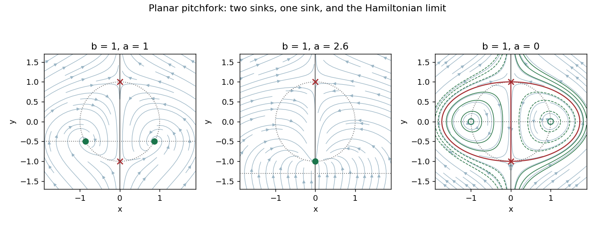

<h1 id="14e/ii/solution">Solution</h1>

↑ **Parent:** [Ii](../ii.md)

Set $Y=y+s$ and $\mu=2s-a$, and include $\dot\mu=0$ for the extended [center manifold](../../../../../../center-manifold.md). The equations near $P_-$ become

$$
\dot x=\mu x-2xY,\qquad\dot Y=x^2-2sY+Y^2,\qquad\dot\mu=0.
$$

The stable direction has [eigenvalue](../../../../../../eigenvalue.md) $-2s$ and the center directions are $(x,\mu)$. Choose a symmetry-preserving [center manifold](../../../../../../center-manifold.md) $Y=h(x,\mu)$, even in $x$, containing the equilibrium line $x=0,Y=0$. Its invariance equation is

$$
h_x(\mu x-2xh)=x^2-2sh+h^2.
$$

Write $h=A x^2+B\mu x^2+\cdots$. At degree two, $0=(1-2sA)x^2$, so $A=1/(2s)$. At degree three, $2A\mu x^2=-2sB\mu x^2$, so $B=-1/(2s^2)$. Consequently

$$
\dot x=\mu x-\frac{x^3}{s}+O(\mu x^3,x^5).
$$

With $x=\sqrt{s}\,X$ this is $\dot X=\mu X-X^3+O(\mu X^3,X^5)$, the supercritical [pitchfork bifurcation](../../../../../../pitchfork-bifurcation-normal-form.md). For $\mu<0$, $P_-$ is attracting; for $\mu>0$ it becomes a [saddle equilibrium](../../../../../../saddle-equilibrium.md) and two attracting branches appear, consistent with the exact $Q_\pm$.

For $0<a^2<4b$, the vertical invariant line flows from $P_+$ towards $P_-$ between those points. The two off-axis [stable equilibria](../../../../../../stable-equilibrium.md) lie below the horizontal axis, one in each invariant half-plane $x>0$ and $x<0$. For $a^2>4b$, these [stable equilibria](../../../../../../stable-equilibrium.md) have merged into the [stable node](../../../../../../stable-node.md) $P_-$, while $P_+$ remains a [saddle equilibrium](../../../../../../saddle-equilibrium.md). Filled green points mark attracting equilibria, green rings mark centers, and red crosses mark saddle equilibria. The plotted arrows and nullclines show the corresponding phase portraits; a focus can become a node within the first parameter range without changing the pitchfork classification.

**[Figure 3](#14e/ii/image-phase-portraits-of-the-planar-pitchfork-system-before-collision-after-collision-and-in-its-hamiltonian-limit). Phase portraits of the planar pitchfork system before collision, after collision, and in its Hamiltonian limit**.

## ↑ Ancestors (11)

1. [Ii](../ii.md)
2. [14E](../../14e.md)
3. [Paper 3](../../../paper-3-split.md)
4. [Ii](../../../split.md)
5. [2009](../../../../split.md)
6. [Past exam of the mathematics course of the University of Cambridge](../../../../../split.md)
7. [Mathematics course of the University of Cambridge](../../../../../../mathematics-course-of-the-university-of-cambridge.md)
8. [Course of the University of Cambridge](../../../../../../course-of-the-university-of-cambridge.md)
9. [University of Cambridge](../../../../../../university-of-cambridge-split.md)
10. [List of universities](../../../../../../list-of-universities.md)
11. [Codex Wiki](../../../../../../split.md)
