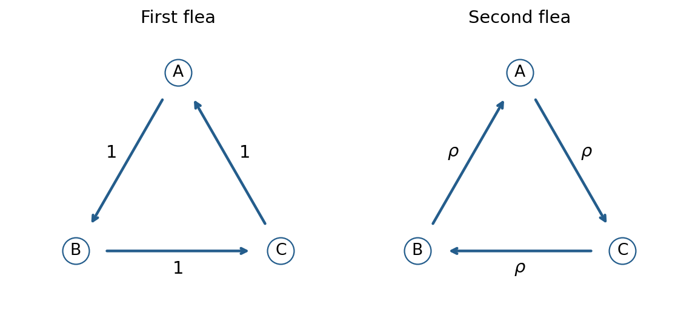

<h1 id="26j/a/solution">Solution</h1>

↑ **Parent:** [A](../a.md)

Number the vertices $A,B,C$ by $0,1,2$. The [continuous-time Markov chain](../../../../../../continuous-time-markov-chain.md) moves one step forward cyclically at rate one, as shown in the left diagram.

**[Figure 2](#26j/a/image-cyclic-transitions-of-the-two-fleas-with-their-jump-rates). Cyclic transitions of the two fleas, with their jump rates**.

Write $P$ for the cyclic shift [matrix](../../../../../../matrix.md), so $Q=P-I$. With $\omega=e^{2\pi i/3}$, the [eigenvalues](../../../../../../eigenvalue.md) of $P$ are $1,\omega,\omega^2$ and those of $Q$ are

$$
\boxed{0,\quad-\frac32+\frac{\sqrt3}{2}i,\quad-\frac32-\frac{\sqrt3}{2}i.}
$$

The [stationary distribution](../../../../../../stationary-distribution.md) is uniform. A jump count is a rate-one [Poisson process](../../../../../../poisson-process.md), and the displacement is that count modulo three. The roots-of-unity filter $\mathbf1_{n\equiv d\ (3)}=\frac13\sum_{j=0}^2\omega^{j(n-d)}$ and $E(s^{N_t})=e^{t(s-1)}$ therefore give, for $d=(y-x)\bmod3$,

$$
\boxed{p_{xy}(t)=\frac13\sum_{j=0}^2e^{t(\omega^j-1)}\omega^{-jd}
=\frac13\left[1+2e^{-3t/2}\cos\left(\frac{\sqrt3t}{2}-\frac{2\pi d}{3}\right)\right].}
$$

These are also the entries of $e^{tQ}$ obtained by diagonalizing $Q$. In particular,

$$
\boxed{P(N_t\equiv i\pmod3)=\frac13\left[1+2e^{-3t/2}\cos\left(\frac{\sqrt3t}{2}-\frac{2\pi i}{3}\right)\right],\quad i=0,1,2.}
$$

## ↑ Ancestors (11)

1. [A](../a.md)
2. [26J](../../26j.md)
3. [Paper 4](../../../paper-4-split.md)
4. [Ii](../../../split.md)
5. [2009](../../../../split.md)
6. [Past exam of the mathematics course of the University of Cambridge](../../../../../split.md)
7. [Mathematics course of the University of Cambridge](../../../../../../mathematics-course-of-the-university-of-cambridge.md)
8. [Course of the University of Cambridge](../../../../../../course-of-the-university-of-cambridge.md)
9. [University of Cambridge](../../../../../../university-of-cambridge-split.md)
10. [List of universities](../../../../../../list-of-universities.md)
11. [Codex Wiki](../../../../../../split.md)
