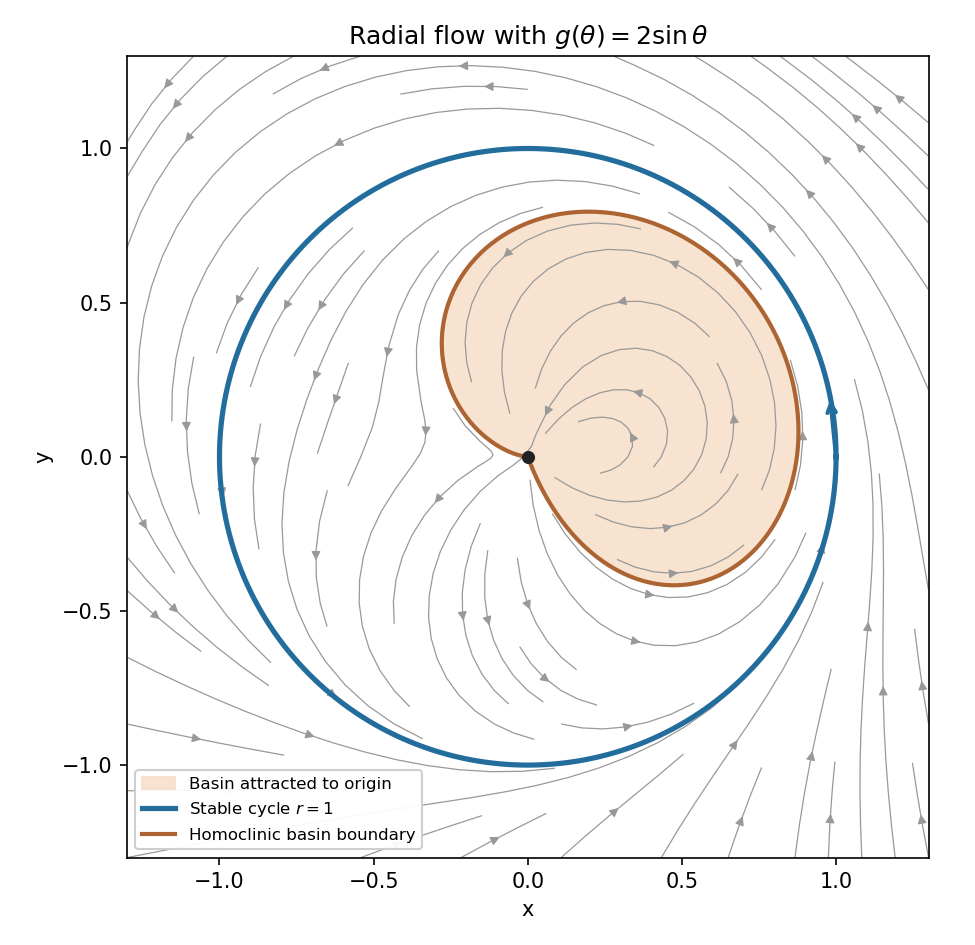

<h1 id="7e/solution">Solution</h1>

↑ **Parent:** [7E](../7e.md)

The circle $\gamma:r=1$ is a [periodic orbit](../../../../../periodic-orbit.md), since $\dot r=0$ there and $\dot\theta=1$. Its period is $2\pi$. Linearizing in $(\delta r,\delta\theta)$ along it gives

$$
\frac d{dt}\begin{pmatrix}\delta r\\\delta\theta\end{pmatrix}
=\begin{pmatrix}g(\theta_0+t)-1&0\\1&0\end{pmatrix}
\begin{pmatrix}\delta r\\\delta\theta\end{pmatrix}.
$$

The monodromy [matrix](../../../../../matrix.md) is triangular with diagonal entries

$$
\boxed{\lambda_{\rm tangent}=1,\qquad
\lambda_{\rm normal}=\exp\left(\int_0^{2\pi}g(\theta)\,d\theta-2\pi\right).}
$$

The unit [Floquet multiplier](../../../../../floquet-multiplier.md) comes from translating an autonomous orbit in time: its tangent vector is a periodic solution of the variational equation, independently of $g$. A sufficient condition for [asymptotic stability](../../../../../asymptotic-stability.md) is $\int_0^{2\pi}g<2\pi$, making the normal multiplier less than one. The reverse strict inequality gives instability; equality requires nonlinear analysis.

For $g=2\sin\theta$ the normal multiplier is $e^{-2\pi}$, so **the circle is [asymptotically stable](../../../../../asymptotic-stability.md)**. That does not mean it attracts every initial point. Since $r>0$ makes $\theta$ strictly increasing, divide the radial equation by $\dot\theta$:

$$
\frac{dr}{d\theta}=(1-r)(r-2\sin\theta).
$$

For $r>1$, put $v=r-1>0$. Then $v'=(2\sin\theta-1)v-v^2\le(2\sin\theta-1)v$, whose integrated linear coefficient decreases by $2\pi$ per revolution. Thus every exterior orbit approaches $r=1$.

For $0<r<1$ put $w=(1-r)^{-1}>1$. It satisfies the linear equation

$$
w'=(1-2\sin\theta)w-1.
$$

Let $w_c$ be its solution with $w_c(\pi)=1$. It defines the separatrix $r_c=1-1/w_c$ wherever $w_c>1$. At $\theta=\pi$, $r_c=0$, $r_c'=0$, and differentiation gives $r_c''=2$, so $r_c\sim(\theta-\pi)^2$. The approach to this endpoint takes infinite physical time because $dt=d\theta/r_c$.

To locate its other endpoint, use the integrating factor $e^{-A(\theta)}$ with $A(\theta)=\theta+2\cos\theta$. It gives

$$
w_c(\theta)=e^{A(\theta)-A(\pi)}\left[1+\int_\theta^\pi e^{A(\pi)-A(s)}\,ds\right].
$$

In particular $w_c(0)>e^{4-\pi}>1$, whereas

$$
w_c(-\pi)=e^{-2\pi}+\int_0^{2\pi}e^{-u-2+2\cos u}\,du<1.
$$

On $(-\pi,0)$, crossing $w=1$ has $w'=-2\sin\theta>0$, so there is one crossing $\theta_b\in(-\pi,0)$. There cannot be another crossing before $\pi$: on $(0,\pi)$ crossings have negative derivative, while the local quadratic form at $\pi$ is positive on its left. Thus $r_c>0$ for $\theta_b<\theta<\pi$, and its closure is a [homoclinic orbit](../../../../../homoclinic-orbit.md) to the origin. At $\theta_b$, $r_c'=-2\sin\theta_b>0$, so departure from the origin likewise takes infinite time.

Scalar-solution comparison now gives the basin picture. Initial points inside that loop have $w<w_c$ at the same angle and approach $r=0$ before reaching angle $\pi$. Points on its boundary return to the origin along the homoclinic trajectory. Points outside the loop reach angle $\pi$ with $w>1$ or lie outside the [unit circle](../../../../../complex-unit-circle.md); they approach $r=1$. To check the inner exterior region quantitatively, the return map at $\theta=\pi$ is $w\mapsto e^{2\pi}(w-I)$, where $I=\int_0^{2\pi}e^{-u-2+2\cos u}\,du<1-e^{-2\pi}$. It sends every $w>1$ increasingly to infinity, equivalently $r\to1$.

**[Figure 1](#7e/image-stable-periodic-circle-and-the-homoclinic-basin-boundary-for-the-sinusoidal-radial-flow). Stable periodic circle and the homoclinic basin boundary for the sinusoidal radial flow**.

There are no other nonconstant [periodic orbits](../../../../../periodic-orbit.md): an orbit reaching the section with $w>1$ has strictly increasing successive $w$ values, and the remaining inner trajectories tend to the origin. The origin, defined by the continuous Cartesian extension, attracts the interior of the loop but is not [Lyapunov stable](../../../../../lyapunov-stability.md), since arbitrarily small lower-sector initial points outside the loop approach the [unit circle](../../../../../complex-unit-circle.md). This is the [homoclinic basin boundary in a sinusoidal radial flow](../../../../../homoclinic-basin-boundary-in-a-sinusoidal-radial-flow.md).

## ↑ Ancestors (10)

1. [7E](../7e.md)
2. [Paper 4](../../paper-4-split.md)
3. [Ii](../../split.md)
4. [2009](../../../split.md)
5. [Past exam of the mathematics course of the University of Cambridge](../../../../split.md)
6. [Mathematics course of the University of Cambridge](../../../../../mathematics-course-of-the-university-of-cambridge.md)
7. [Course of the University of Cambridge](../../../../../course-of-the-university-of-cambridge.md)
8. [University of Cambridge](../../../../../university-of-cambridge-split.md)
9. [List of universities](../../../../../list-of-universities.md)
10. [Codex Wiki](../../../../../split.md)
